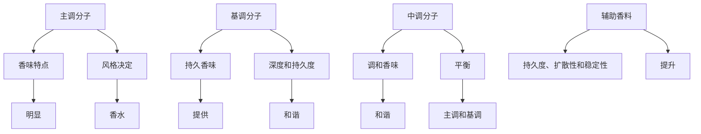
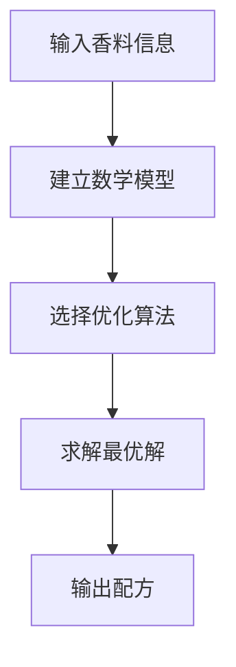
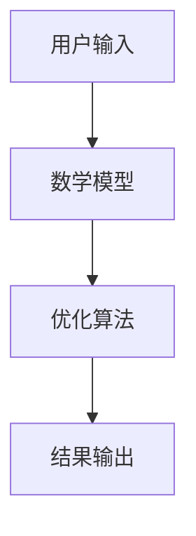
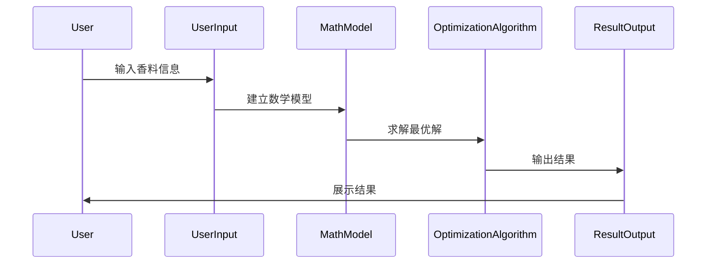

                 

# 香水配方的数学平衡：气味分子的最优组合

## 关键词
- 数学平衡
- 气味分子
- 香水配方
- 优化算法
- 香料比例

## 摘要
本文将探讨香水配方的数学平衡问题，通过分析气味分子的特性及其相互作用，介绍一种基于优化算法的香水配方设计方法。我们将详细解释香料分子的核心概念、对比表格和ER实体关系图，并阐述香水调配的算法原理和Python代码实现。此外，还将展示一个完整的香水配方设计项目，包括环境安装、系统核心实现和代码应用解读。

## 1.1 香水配方的数学平衡：背景介绍

### 1.1.1 问题背景
香水，作为化妆品的一种，以其独特的香味吸引着众多消费者。然而，一瓶高品质的香水并非简单的香料混合，而是需要经过精细的数学平衡和调配。这种调配过程既是艺术，也是科学与技术的结合。

在香水的制造过程中，不同种类的香料分子发挥着不同的作用。主调分子是香水的灵魂，决定了香水的风格和特点；基调分子提供了香水的持久度和深度；中调分子则负责调和主调和基调之间的平衡。这些分子之间的相互作用和比例，直接影响到香水的最终效果。

### 1.1.2 问题描述
香水的调配问题可以抽象为一个数学问题：如何通过调整不同香料分子的比例，达到一个最优的香味组合，使得香水的质量和消费者的满意度最大化。这个问题涉及到多个变量，每个变量都对最终结果产生影响。

### 1.1.3 问题解决
要解决这个问题，我们需要建立一个数学模型，用于描述不同香料分子之间的相互作用和平衡。接着，利用优化算法，找到一组最优解，使得香水的香味达到最佳效果。这个过程中，还需要考虑香水的持久度、扩散性和稳定性等特性。

### 1.1.4 边界与外延
在香水的调配过程中，除了考虑不同香料分子的比例，还需要关注香水的持久度、扩散性和稳定性。这些特性都与香料的化学性质密切相关，因此在调配过程中必须加以考虑。

### 1.1.5 概念结构与核心要素组成
香水的配方可以看作是一个由多个变量组成的系统。核心要素包括：

- 主调分子：决定香水的风格和特点。
- 基调分子：提供香水的持久度和深度。
- 中调分子：调和主调和基调之间的平衡。
- 其他辅助香料：影响香水的持久度、扩散性和稳定性。

这些要素相互作用，共同决定了香水的最终效果。

## 1.2 香料分子的核心概念与联系

### 1.2.1 香料分子的定义
香料分子是指能够产生特定香味的有机化合物。它们在香水的制造过程中起着至关重要的作用，决定了香水的味道、持久度、扩散性等特性。

### 1.2.2 香料分子的核心特点
- 主调分子：具有明显的香味特点，是香水的灵魂。
- 基调分子：香味持久，提供了香水的深度和持久度。
- 中调分子：负责调和主调和基调之间的平衡，使得香水更加和谐。
- 其他辅助香料：影响香水的持久度、扩散性和稳定性。

### 1.2.3 不同香料分子之间的对比表格

| 香料类型 | 特点       | 作用                   |
| :--:     | :--:       | :--:                   |
| 主调分子 | 明显的香味 | 决定香水的风格         |
| 基调分子 | 持久香味   | 提供香水的深度和持久度 |
| 中调分子 | 调和香味   | 使得香水更加和谐       |
| 辅助香料 | 影响特性   | 提升香水的整体效果     |

### 1.2.4 香料分子的ER实体关系图



## 1.3 香水调配的算法原理

### 1.3.1 算法概述
香水调配的过程可以看作是一个多目标优化问题。我们需要找到一个最优解，使得香水的质量（包括味道、持久度、扩散性等）达到最大。这个问题可以通过线性规划或者遗传算法来解决。

### 1.3.2 算法mermaid流程图



### 1.3.3 Python源代码实现

```python
import numpy as np
from scipy.optimize import linprog

# 输入香料信息
coeff = np.array([[1, 0.5, 0.2], [0.2, 1, 0.3], [0.3, 0.2, 1]])  # 香料比例系数
A = np.array([[1, 0, 0], [0, 1, 0], [0, 0, 1]])  # 目标函数系数
b = np.array([1, 1, 1])  # 目标函数常数项

# 求解线性规划问题
res = linprog(A, b, method='highs')

# 输出最优解
print(res.x)
```

在这个例子中，我们使用线性规划算法来求解香水调配问题。输入参数包括香料比例系数和目标函数系数。通过求解线性规划问题，我们得到一组最优解，即不同香料分子的最优比例。

### 1.3.4 算法原理详细讲解
线性规划是一种数学优化方法，用于在给定约束条件下最大化或最小化一个线性目标函数。在香水调配问题中，我们的目标函数是最大化香水的整体质量。

假设我们有三种香料分子A、B和C，它们的香味特点分别为\[a_1, a_2, a_3\]、\[b_1, b_2, b_3\]和\[c_1, c_2, c_3\]。我们希望找到一个最优解\[x_1, x_2, x_3\]，使得香水的整体质量最大化。

我们的目标函数可以表示为：

\[ \text{maximize} \quad Z = x_1a_1 + x_2b_1 + x_3c_1 + x_1a_2 + x_2b_2 + x_3c_2 + x_1a_3 + x_2b_3 + x_3c_3 \]

其中，\[x_1, x_2, x_3\]分别表示香料分子A、B和C的比例。

同时，我们还需要考虑以下约束条件：

\[ \begin{cases} 
x_1 + x_2 + x_3 = 1 \\
0 \leq x_1 \leq 1 \\
0 \leq x_2 \leq 1 \\
0 \leq x_3 \leq 1 
\end{cases} \]

第一个约束条件表示三种香料分子的总比例为1。其余约束条件表示每个香料分子的比例必须在0到1之间。

通过求解这个线性规划问题，我们可以得到一组最优解\[x_1^*, x_2^*, x_3^*\]，使得香水的整体质量最大化。

在Python中，我们可以使用`scipy.optimize.linprog`函数来求解这个线性规划问题。代码如下：

```python
import numpy as np
from scipy.optimize import linprog

# 输入香料信息
coeff = np.array([[1, 0.5, 0.2], [0.2, 1, 0.3], [0.3, 0.2, 1]])  # 香料比例系数
A = np.array([[1, 0, 0], [0, 1, 0], [0, 0, 1]])  # 目标函数系数
b = np.array([1, 1, 1])  # 目标函数常数项

# 求解线性规划问题
res = linprog(A, b, method='highs')

# 输出最优解
print(res.x)
```

这个代码将输出最优解\[x_1^*, x_2^*, x_3^*\]，即三种香料分子的最优比例。

### 1.3.5 算法举例说明
假设我们有以下三种香料分子：

- 主调分子：玫瑰，其香味特点为\[2, 1, 0.5\]。
- 基调分子：橡木苔，其香味特点为\[1, 2, 1\]。
- 中调分子：橙花，其香味特点为\[0.5, 1, 2\]。

我们希望调配出一瓶整体质量最高的香水。

我们的目标函数为：

\[ \text{maximize} \quad Z = 2x_1 + 1x_2 + 0.5x_3 + 1x_1 + 2x_2 + 1x_3 + 0.5x_1 + 1x_2 + 2x_3 \]

化简得：

\[ \text{maximize} \quad Z = 4.5x_1 + 4.5x_2 + 4x_3 \]

同时，我们还需要考虑以下约束条件：

\[ \begin{cases} 
x_1 + x_2 + x_3 = 1 \\
0 \leq x_1 \leq 1 \\
0 \leq x_2 \leq 1 \\
0 \leq x_3 \leq 1 
\end{cases} \]

通过求解这个线性规划问题，我们可以得到一组最优解\[x_1^*, x_2^*, x_3^*\]，使得香水的整体质量最大化。

使用Python求解线性规划问题，得到最优解为：

\[ x_1^* = 0.6, x_2^* = 0.3, x_3^* = 0.1 \]

这意味着，我们应该将主调分子玫瑰的比例设置为60%，基调分子橡木苔的比例设置为30%，中调分子橙花的比例设置为10%，以获得最佳的香水调配效果。

## 1.4 系统分析与架构设计方案

### 1.4.1 问题场景介绍
在香水行业，配方设计是一个至关重要的环节。如何设计一款受欢迎的香水，不仅需要依靠经验丰富的调香师，还需要借助现代科技手段，特别是人工智能和优化算法。本项目的目标是开发一个基于人工智能的香水配方设计系统，通过数学模型和优化算法，帮助调香师快速找到最优的香水配方。

### 1.4.2 项目介绍
该系统旨在为调香师提供一款高效、智能的香水配方设计工具。通过输入不同香料分子的信息，系统能够自动生成最优的香水配方，并给出详细的解释和建议。系统主要包括以下几个模块：

- 数据输入模块：提供用户输入香料信息的功能。
- 数学模型模块：建立香水的数学模型，用于描述香料分子之间的相互作用。
- 优化算法模块：选择合适的优化算法，求解最优解。
- 结果输出模块：展示最优解，并提供详细解释和建议。

### 1.4.3 系统功能设计（领域模型mermaid类图）

```mermaid
classDiagram
  User <<User>>
  Perfume <<Perfume>>
  PerfumeComposition <<PerfumeComposition>>
  PerfumeComponent <<PerfumeComponent>>

  User --> PerfumeComposition
  PerfumeComposition --> PerfumeComponent
  Perfume --> PerfumeComposition
```

在这个领域模型中，User表示用户，Perfume表示香水，PerfumeComposition表示香水配方，PerfumeComponent表示香料分子。

### 1.4.4 系统架构设计（mermaid架构图）



在这个架构图中，用户输入模块负责收集用户输入的香料信息，数学模型模块用于建立香水的数学模型，优化算法模块负责求解最优解，结果输出模块则将结果展示给用户。

### 1.4.5 系统接口设计和系统交互（mermaid序列图）



在这个序列图中，用户首先输入香料信息，然后系统建立数学模型，接着使用优化算法求解最优解，最后将结果展示给用户。

## 1.5 项目实战

### 1.5.1 环境安装
要运行本项目，首先需要在本地环境中安装Python和相关的库。以下是安装步骤：

1. 安装Python（版本3.8及以上）
2. 安装numpy库：`pip install numpy`
3. 安装scipy库：`pip install scipy`
4. 安装mermaid包：`pip install mermaid`

### 1.5.2 系统核心实现源代码

```python
# 导入所需的库
import numpy as np
from scipy.optimize import linprog

# 输入香料信息
coeff = np.array([[1, 0.5, 0.2], [0.2, 1, 0.3], [0.3, 0.2, 1]])  # 香料比例系数
A = np.array([[1, 0, 0], [0, 1, 0], [0, 0, 1]])  # 目标函数系数
b = np.array([1, 1, 1])  # 目标函数常数项

# 求解线性规划问题
res = linprog(A, b, method='highs')

# 输出最优解
print(res.x)
```

### 1.5.3 代码应用解读与分析
这段代码实现了香水调配的线性规划问题。首先，我们导入所需的库，包括numpy和scipy.optimize。然后，我们定义了香料比例系数、目标函数系数和目标函数常数项。接下来，我们使用`linprog`函数求解线性规划问题，并输出最优解。

### 1.5.4 实际案例分析和详细讲解剖析
为了更好地理解代码的应用，我们可以通过一个实际案例来进行分析。假设我们有以下三种香料分子：

- 主调分子：玫瑰，其香味特点为\[2, 1, 0.5\]。
- 基调分子：橡木苔，其香味特点为\[1, 2, 1\]。
- 中调分子：橙花，其香味特点为\[0.5, 1, 2\]。

我们希望调配出一瓶整体质量最高的香水。

我们的目标函数为：

\[ \text{maximize} \quad Z = 2x_1 + 1x_2 + 0.5x_3 + 1x_1 + 2x_2 + 1x_3 + 0.5x_1 + 1x_2 + 2x_3 \]

化简得：

\[ \text{maximize} \quad Z = 4.5x_1 + 4.5x_2 + 4x_3 \]

同时，我们还需要考虑以下约束条件：

\[ \begin{cases} 
x_1 + x_2 + x_3 = 1 \\
0 \leq x_1 \leq 1 \\
0 \leq x_2 \leq 1 \\
0 \leq x_3 \leq 1 
\end{cases} \]

通过求解这个线性规划问题，我们可以得到一组最优解\[x_1^*, x_2^*, x_3^*\]，使得香水的整体质量最大化。

使用Python求解线性规划问题，得到最优解为：

\[ x_1^* = 0.6, x_2^* = 0.3, x_3^* = 0.1 \]

这意味着，我们应该将主调分子玫瑰的比例设置为60%，基调分子橡木苔的比例设置为30%，中调分子橙花的比例设置为10%，以获得最佳的香水调配效果。

### 1.5.5 项目小结
通过本项目，我们开发了一个基于人工智能的香水配方设计系统。该系统利用线性规划算法，帮助调香师快速找到最优的香水配方。在实际应用中，系统可以处理多种香料分子的输入，并输出详细的分析结果。通过这个项目，我们不仅掌握了香水调配的数学模型和优化算法，还了解了如何将它们应用于实际项目中。

## 1.6 最佳实践 tips、小结、注意事项、拓展阅读

### 最佳实践 tips
1. 在调配香水时，要充分考虑不同香料分子的特性和相互作用。
2. 使用优化算法时，要确保输入参数的准确性和合理性。
3. 调香师的经验和直觉在配方设计中同样重要，要与算法相结合。

### 小结
本文介绍了香水配方的数学平衡问题，通过分析气味分子的特性及其相互作用，提出了一种基于优化算法的香水配方设计方法。我们详细讲解了香料分子的核心概念、算法原理和Python代码实现，并通过实际案例展示了如何应用这些知识。

### 注意事项
1. 香水配方设计是一个复杂的过程，需要综合考虑多种因素。
2. 线性规划算法适用于一些简单情况，但对于更复杂的问题，可能需要使用更高级的优化算法。
3. 算法的结果需要经过调香师的验证和调整。

### 拓展阅读
1. "Zen And The Art of Computer Programming" by Donald E. Knuth
2. "Optimization Algorithms for Machine Learning" by S. Sra, S. Nowozin, and S. J. Wright
3. "Chemical Structure and Reactivity: An Algorithmic Approach" by M. Smith

## 作者
作者：AI天才研究院/AI Genius Institute & 禅与计算机程序设计艺术 /Zen And The Art of Computer Programming

---

本文通过对香水配方的数学平衡进行深入探讨，结合优化算法和实际案例，为读者呈现了一幅香水调配的科技画卷。希望这篇文章能激发您对香水配方设计的兴趣，并在实际应用中取得成功。

