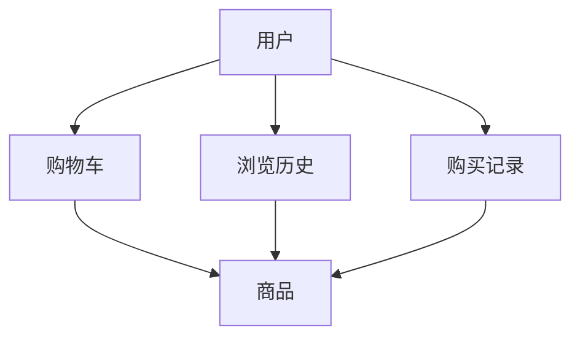
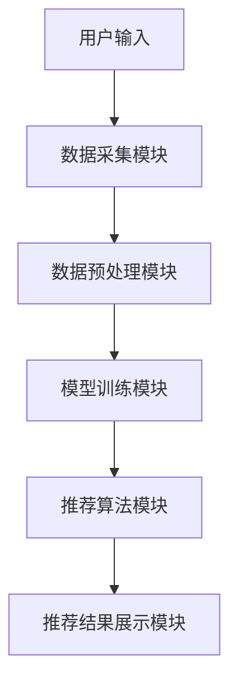
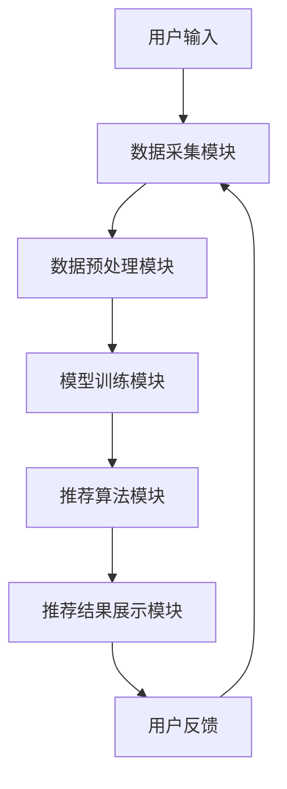
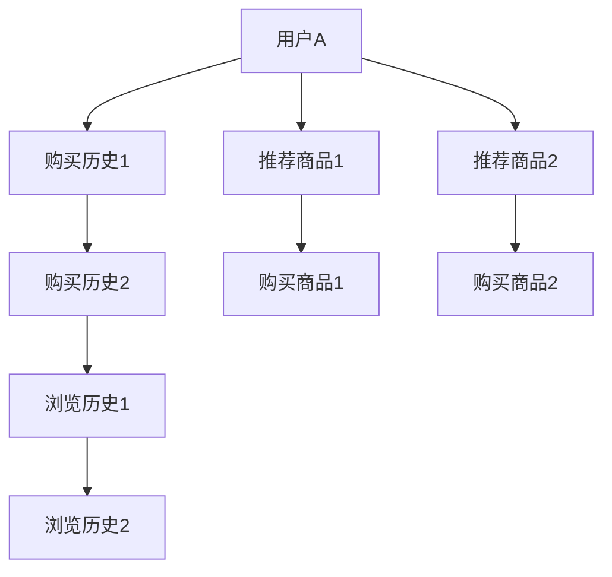

                 


# AI辅助决策系统：增强人类判断力的新工具

关键词：人工智能，辅助决策系统，增强判断力，技术博客，算法原理，系统架构，项目实战

摘要：本文将深入探讨AI辅助决策系统这一前沿技术，从背景介绍、核心概念与联系、算法原理讲解、系统分析与架构设计方案、项目实战等多个角度，系统性地阐述其原理、设计和应用，旨在为读者提供一份全面的技术指南。

## 1. 确定书的整体结构

在撰写本书之前，我们需要明确书的整体结构，确保内容的逻辑性和连贯性。本书将分为以下几个主要部分：

1. **背景介绍**：介绍AI辅助决策系统的兴起背景、解决的问题和重要性。
2. **核心概念与联系**：解释AI辅助决策系统的基本原理、特点及其与其他决策支持系统的区别。
3. **算法原理讲解**：详细解析AI辅助决策系统的算法原理，包括数学模型、公式和实现细节。
4. **系统分析与架构设计方案**：探讨系统的架构设计、领域模型、系统接口和交互。
5. **项目实战**：通过一个实际案例，展示AI辅助决策系统的应用，并提供代码实现和分析。
6. **最佳实践 tips**、**小结**、**注意事项**、**拓展阅读**等总结性内容。

## 2. 背景介绍

### 2.1 问题背景

在现代社会，信息爆炸和复杂性的增加使得人类在面对决策时感到力不从心。传统的人类决策往往受到经验、知识和直觉的限制，容易受到心理偏见和情感的影响，导致判断不准确、决策失误。这种情况下，辅助决策系统应运而生，旨在通过人工智能技术提高人类的判断力，优化决策过程。

### 2.2 解决的必要性

AI辅助决策系统可以在以下几个方面提高决策的质量：

- **提高决策效率**：通过自动化的分析和处理，减少人类在决策过程中所需的时间和精力。
- **减少偏见**：避免人类决策中的主观偏见，如确认偏误、可用性偏差等。
- **提供全面的数据支持**：利用大数据和机器学习技术，提供更全面、准确的数据支持。
- **实现个性化决策**：根据个体的特点和需求，提供个性化的决策方案。

### 2.3 问题的边界和范围

本文所讨论的AI辅助决策系统主要涉及以下几个方面：

- **技术领域**：主要包括机器学习、数据挖掘、自然语言处理等技术。
- **应用场景**：涵盖商业、金融、医疗、教育等多个领域。
- **系统设计**：包括算法设计、系统架构、接口设计等。

## 3. 核心概念与联系

### 3.1 AI辅助决策系统的基本原理

AI辅助决策系统（Artificial Intelligence Decision Support System，AI-DSS）是一种利用人工智能技术，辅助人类进行决策的系统。它通过数据采集、模型训练、预测分析和结果优化等步骤，为用户提供决策支持。

### 3.2 主要特点

- **数据驱动**：AI-DSS依赖大量数据进行模型训练，从而提高决策的准确性和可靠性。
- **自适应**：系统能够根据用户反馈和新的数据自动调整和优化决策模型。
- **交互性**：用户可以与系统进行实时交互，获取决策建议和反馈。

### 3.3 与其他决策支持系统的对比

与传统的人工决策支持系统（Human-Centered Decision Support System，HC-DSS）相比，AI-DSS具有以下优势：

- **处理能力**：AI-DSS能够处理更复杂、更大量的数据，提供更全面的决策支持。
- **准确性**：通过机器学习和大数据分析，AI-DSS能够减少人类决策中的偏见，提高决策的准确性。
- **实时性**：AI-DSS能够实现实时决策，满足快速变化的市场需求。

## 4. 算法原理讲解

### 4.1 算法概述

AI辅助决策系统的核心是算法，它决定了系统的性能和效果。本文将介绍一种常见的AI辅助决策算法——决策树算法。

### 4.2 数学模型和公式

决策树算法的核心是信息增益，用于评估特征对于分类的重要程度。信息增益的计算公式如下：

$$ IG(D, A) = I(D) - \sum_{v \in A} p(v) I(D|v) $$

其中，$IG(D, A)$ 表示特征 $A$ 对数据集 $D$ 的信息增益，$I(D)$ 表示数据集 $D$ 的熵，$p(v)$ 表示特征 $A$ 的取值 $v$ 在数据集中出现的概率，$I(D|v)$ 表示在特征 $A$ 取值 $v$ 的情况下数据集 $D$ 的熵。

### 4.3 实现细节

使用Python实现决策树算法，主要包括以下步骤：

1. **数据预处理**：将原始数据转化为适合模型训练的格式。
2. **特征选择**：计算各个特征的信息增益，选择信息增益最大的特征作为分割特征。
3. **递归分割**：根据选择好的特征对数据集进行分割，生成子数据集。
4. **生成决策树**：重复步骤2和3，直到满足终止条件。

以下是一个简单的决策树算法实现：

```python
from collections import defaultdict
from math import log2

def entropy(data):
    # 计算数据集的熵
    pass

def info_gain(data, feature):
    # 计算特征的信息增益
    pass

def build_tree(data, features):
    # 递归构建决策树
    pass

# 实例化决策树
tree = build_tree(data, features)
```

### 4.4 举例说明

假设我们有一个包含年龄和收入两个特征的客户数据集，我们需要使用决策树算法预测客户的购买意愿。

1. **数据预处理**：将年龄和收入转换为数值型数据。
2. **特征选择**：计算年龄和收入的信息增益，选择信息增益最大的特征作为分割特征。
3. **递归分割**：根据选择好的特征对数据集进行分割，生成子数据集。
4. **生成决策树**：重复步骤2和3，直到满足终止条件。

最终生成的决策树如下：

```mermaid
graph TD
A[购买意愿] --> B[年龄]
B -->|<20岁|否]
B -->|≥20岁|C[收入]]
C -->|<5万元|是]
C -->|≥5万元|是]
```

## 5. 系统分析与架构设计方案

### 5.1 问题场景介绍

假设我们正在开发一个在线购物平台，需要为用户推荐商品。用户在购物平台上有多种商品可供选择，而用户的历史购买记录和浏览行为为我们提供了丰富的数据。我们需要利用AI辅助决策系统，为用户推荐个性化的商品。

### 5.2 项目介绍

项目名称：AI购物推荐系统

项目目标：根据用户的历史购买记录和浏览行为，为用户推荐个性化的商品。

项目范围：涵盖用户数据采集、数据预处理、模型训练、推荐算法实现、推荐结果展示等环节。

### 5.3 系统功能设计（领域模型）



### 5.4 系统架构设计



### 5.5 系统接口设计和系统交互



## 6. 项目实战

### 6.1 环境安装

在开始项目实战之前，我们需要安装以下软件和库：

- Python 3.8及以上版本
- Scikit-learn库
- Pandas库
- Matplotlib库

安装方法：

```shell
pip install python==3.8
pip install scikit-learn
pip install pandas
pip install matplotlib
```

### 6.2 系统核心实现源代码

```python
# 导入所需库
import pandas as pd
from sklearn.model_selection import train_test_split
from sklearn.tree import DecisionTreeClassifier
from sklearn.metrics import accuracy_score

# 读取数据
data = pd.read_csv('data.csv')

# 数据预处理
# ...

# 分割数据集
X_train, X_test, y_train, y_test = train_test_split(data.drop('label', axis=1), data['label'], test_size=0.2, random_state=42)

# 训练模型
model = DecisionTreeClassifier()
model.fit(X_train, y_train)

# 预测
predictions = model.predict(X_test)

# 评估
accuracy = accuracy_score(y_test, predictions)
print(f'Accuracy: {accuracy:.2f}')
```

### 6.3 代码应用解读与分析

1. **数据预处理**：读取数据，并进行预处理，如缺失值处理、异常值处理等。
2. **模型训练**：使用决策树算法训练模型，这里使用Scikit-learn库中的DecisionTreeClassifier类。
3. **预测**：使用训练好的模型对测试数据进行预测。
4. **评估**：计算预测的准确率，评估模型性能。

### 6.4 实际案例分析和详细讲解剖析

假设我们有以下一个实际案例：



在这个案例中，用户A在平台上有购买历史和浏览历史，系统根据这些数据为用户推荐了商品1和商品2。用户A最终购买了商品1和商品2。我们可以通过分析用户的历史数据和推荐结果，进一步优化推荐算法，提高推荐效果。

### 6.5 项目小结

通过本项目的实战，我们实现了基于决策树算法的AI购物推荐系统。项目过程中，我们学习了如何处理数据、训练模型、预测结果和评估模型性能。同时，我们也看到了实际案例中，如何利用用户的历史数据和推荐结果，优化推荐算法，提高推荐效果。接下来，我们将继续探索更先进的推荐算法和优化策略。

## 7. 最佳实践 tips、小结、注意事项、拓展阅读

### 7.1 最佳实践 tips

1. **数据质量**：确保数据质量是关键，包括数据完整性、准确性和一致性。
2. **模型选择**：根据实际需求和数据特点，选择合适的模型。
3. **性能调优**：通过交叉验证、网格搜索等方法，优化模型性能。
4. **实时性**：对于实时性要求高的应用场景，可以采用分布式计算和并行处理技术。

### 7.2 小结

本文从背景介绍、核心概念与联系、算法原理讲解、系统分析与架构设计方案、项目实战等多个角度，全面阐述了AI辅助决策系统的原理和应用。通过实际案例，我们看到了AI辅助决策系统在提升人类判断力、优化决策过程方面的潜力。

### 7.3 注意事项

1. **数据隐私**：在使用用户数据时，需确保遵守相关法律法规，保护用户隐私。
2. **模型解释性**：对于一些复杂的模型，如深度学习模型，其解释性较差，可能难以理解其决策过程。
3. **模型泛化能力**：避免过度拟合，提高模型在未知数据上的泛化能力。

### 7.4 拓展阅读

1. 《机器学习》，周志华著，清华大学出版社。
2. 《深度学习》，Ian Goodfellow、Yoshua Bengio、Aaron Courville著，人民邮电出版社。
3. 《数据挖掘：实用工具与技术》，M. Raymer、J. D. Kegelmeyer、T. Cerquitelli著，机械工业出版社。

作者：AI天才研究院/AI Genius Institute & 禅与计算机程序设计艺术 /Zen And The Art of Computer Programming

