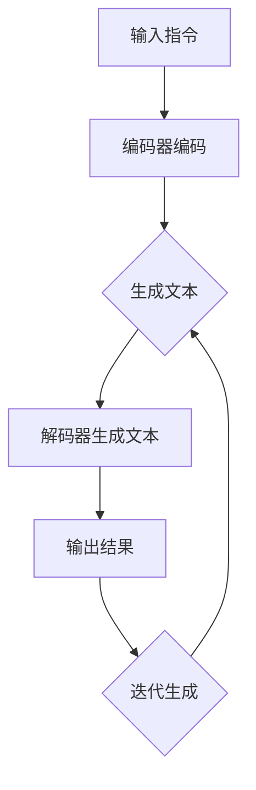
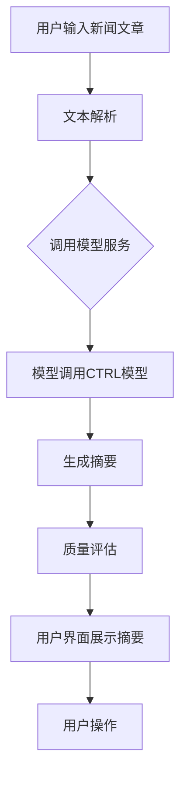
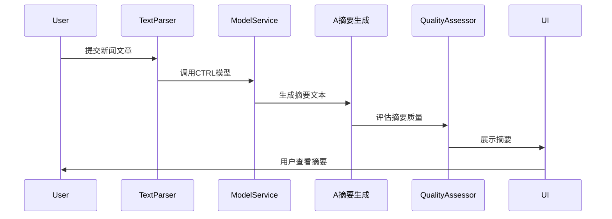

                 

### 第一部分：背景介绍与核心概念

#### 第1章：问题背景与核心概念

在信息爆炸的时代，文本生成已经成为计算机科学领域中的一个重要研究方向。随着深度学习和自然语言处理技术的迅猛发展，文本生成技术在生成质量、多样化程度等方面都取得了显著进步。然而，文本生成评测这一环节却面临着诸多挑战。传统的文本生成评测方法通常侧重于生成文本的多样性、流畅性和相关性等，但往往缺乏对生成文本的控制性。在这种背景下，控制性文本生成（Controlled Text Generation）评测的重要性日益凸显。

**1.1 文本生成评测的挑战与需求**

**问题描述与难点分析**：文本生成评测的目标是评估文本生成系统的性能，确保生成文本的质量。然而，在实际应用中，这一目标面临着以下几大挑战：

- **多样性控制**：生成文本的多样性是评测的一个重要指标，但如何在保证多样性的同时确保文本的质量和一致性是一个难题。
- **流畅性和连贯性**：生成文本应该具有良好的流畅性和连贯性，否则将影响用户体验。
- **生成质量评估**：评估生成文本的质量需要有效的评价指标和方法，传统方法在这方面存在一定局限性。

**当前文本生成评测方法的不足**：

1. **单一指标评价**：传统的评测方法往往依赖于单一指标，如BLEU、ROUGE等，这些指标在评估文本质量时具有一定的局限性。
2. **缺乏控制性**：现有的评测方法缺乏对生成文本的控制性，难以满足特定应用场景下的需求。
3. **自动化程度低**：部分评测方法依赖于人工评价，自动化程度低，难以进行大规模评测。

**控制性文本生成的需求**：随着应用场景的多样化，对控制性文本生成评测的需求日益迫切。例如：

- **对话系统**：在对话系统中，生成文本的控制性至关重要，确保对话的连贯性和逻辑性。
- **新闻写作**：在自动新闻写作中，需要根据特定主题和格式生成文章，控制性文本生成评测有助于评估系统的性能。
- **文本摘要**：在文本摘要任务中，生成文本的控制性决定了摘要的准确性和完整性。

**1.2 可控文本生成评测的基础知识**

**控制性文本生成的定义**：控制性文本生成是一种能够根据特定需求生成符合特定格式、主题和风格文本的方法。该方法通过对生成过程进行控制，确保生成文本的质量、多样性和一致性。

**控制性文本生成的关键要素**：

- **模板控制**：通过预设的模板来控制生成文本的结构和格式。
- **语义控制**：通过语义层面的约束来控制生成文本的内容和逻辑。
- **风格控制**：通过控制文本的写作风格，确保生成文本的连贯性和可读性。

**控制性文本生成的现有方法**：

1. **模板匹配法**：通过模板匹配来生成文本，适用于结构化较强的文本生成任务。
2. **规则驱动法**：通过预设的规则来控制生成文本的内容和风格，适用于规则明确的应用场景。
3. **基于语义的分析和生成**：通过语义分析来理解文本内容，然后根据语义信息生成符合要求的文本。
4. **深度学习方法**：利用深度学习模型，如序列到序列模型（Seq2Seq）、生成对抗网络（GAN）等，实现控制性文本生成。

**1.3 CTRL模型概述**

**模型起源与架构**：CTRL（Controlled Text Generation）模型是一种基于深度学习的控制性文本生成模型，起源于对控制性文本生成评测的需求。该模型采用编码器-解码器（Encoder-Decoder）架构，结合了模板匹配和规则驱动的优点，通过语义控制实现高质量的文本生成。

**模型核心原理**：CTRL模型的核心原理在于通过预训练和微调的方式，使模型能够根据特定需求生成符合要求的文本。具体来说，模型首先通过大量无监督数据进行预训练，学习到文本的通用特征；然后，通过有监督数据对模型进行微调，使其能够根据输入指令生成特定格式的文本。

**模型优势与适用场景**：

- **多样性控制**：CTRL模型能够生成多样性的文本，满足不同应用场景的需求。
- **流畅性和连贯性**：通过语义控制，确保生成文本具有良好的流畅性和连贯性。
- **生成质量高**：利用深度学习模型，生成文本的质量较高，适用于需要高质量文本生成的应用场景。
- **适用范围广**：适用于对话系统、自动新闻写作、文本摘要等多种应用场景。

本章对文本生成评测的背景、挑战和需求进行了深入分析，并介绍了控制性文本生成评测的基础知识。下一章将详细对比现有控制性文本生成方法，进一步探讨不同方法的属性特征。

#### 第2章：概念属性特征对比

控制性文本生成方法在计算机科学领域得到了广泛关注和应用，但不同的方法在实现原理、性能特点和应用场景上存在显著差异。为了更好地理解这些方法的优缺点，本节将对几种常见的控制性文本生成方法进行属性特征对比。

**2.1 控制性文本生成方法对比**

**模板匹配法**

**实现原理**：模板匹配法通过预设的模板来生成文本，模板通常包含固定的结构和部分预定义的文本。在生成过程中，根据输入的指令，将指令中的关键词与模板中的关键词进行匹配，从而生成相应的文本。

**性能特点**：

- **高效性**：由于模板是预定义的，生成过程相对简单，计算效率较高。
- **灵活性不足**：模板的固定结构限制了生成文本的多样性和创造性。
- **适用场景**：适用于结构化较强的文本生成任务，如表格数据转换为文本报告。

**规则驱动法**

**实现原理**：规则驱动法通过预设的规则来控制生成文本的内容和风格。这些规则通常基于领域知识和语言规则，对生成文本的各个部分进行约束和指导。

**性能特点**：

- **灵活性**：规则可以根据实际需求进行调整，适用于多种文本生成任务。
- **可解释性**：规则的透明性使得生成过程易于理解，便于进行调试和优化。
- **适用场景**：适用于规则明确的应用场景，如自动合同生成、法律文书写作。

**基于语义的分析和生成**

**实现原理**：基于语义的分析和生成方法通过语义分析来理解文本内容，然后根据语义信息生成符合要求的文本。这种方法通常结合自然语言处理技术和深度学习模型。

**性能特点**：

- **多样性和创造性**：通过语义分析，能够生成多样化的文本，具有一定的创造性。
- **准确性**：基于语义的控制能够确保生成文本的准确性和一致性。
- **适用场景**：适用于需要高度控制性的文本生成任务，如对话系统、文本摘要。

**深度学习方法**

**实现原理**：深度学习方法利用神经网络模型，如序列到序列模型（Seq2Seq）、生成对抗网络（GAN）等，实现控制性文本生成。这些模型通过大量无监督数据预训练，然后通过有监督数据微调，使其能够根据输入指令生成文本。

**性能特点**：

- **高效性和高质量**：深度学习模型具有强大的表达能力和学习能力，能够生成高质量的文本。
- **适用性广泛**：适用于多种文本生成任务，如对话系统、自动新闻写作、文本摘要等。
- **计算资源需求高**：深度学习模型通常需要大量计算资源和时间进行训练。

**2.2 方法属性特征对比表格**

下表对比了四种控制性文本生成方法的属性特征：

| 方法             | 实现原理                                                         | 性能特点                                                     | 适用场景                   |
|------------------|----------------------------------------------------------------|------------------------------------------------------------|----------------------------|
| 模板匹配法       | 预设模板，匹配关键词生成文本                                     | 高效性，灵活性不足                                           | 结构化文本生成任务         |
| 规则驱动法       | 预设规则，根据领域知识控制文本生成                               | 灵活性，可解释性                                             | 规则明确的应用场景         |
| 基于语义的分析和生成 | 语义分析，根据语义信息生成文本                                   | 多样性和创造性，准确性                                       | 高控制性文本生成任务       |
| 深度学习方法     | 利用神经网络模型，预训练和微调生成文本                          | 高效性和高质量，适用性广泛                                     | 多种文本生成任务           |

通过以上对比，可以看出不同控制性文本生成方法在实现原理、性能特点和适用场景上存在显著差异。选择合适的方法取决于具体应用场景和需求。

**2.3 深度学习方法的优势与挑战**

**优势**：

- **强大表达能力**：深度学习模型能够处理复杂的语义信息，生成高质量的文本。
- **多样性控制**：通过预训练和微调，模型能够根据不同需求生成多样化的文本。
- **适用广泛**：深度学习模型适用于多种文本生成任务，具有广泛的应用前景。

**挑战**：

- **计算资源需求高**：深度学习模型通常需要大量的计算资源和时间进行训练。
- **数据依赖性**：模型的性能高度依赖于训练数据的质量和数量，数据预处理和清洗是关键。
- **可解释性**：深度学习模型的决策过程通常较为复杂，缺乏透明性和可解释性。

下一章将深入探讨文本生成评测的边界与外延，分析评测方法的适用领域和影响。

#### 第3章：文本生成评测的边界与外延

文本生成评测是确保生成文本质量的重要环节，其边界与外延决定了评测方法的适用范围和评估效果。本节将详细分析文本生成评测的边界，并探讨其在外延方面的应用。

**3.1 文本生成评测的边界**

**评测指标的界定**：文本生成评测的边界首先体现在评测指标的界定上。常见的评测指标包括多样性、流畅性和生成质量等。这些指标在不同应用场景下有着不同的权重和重要性。例如，在对话系统中，流畅性和连贯性是关键指标，而在新闻写作中，准确性和真实性则更为重要。因此，确定合适的评测指标是确保评测有效性的基础。

**评测范围的确定**：文本生成评测的范围决定了评估对象的具体内容。评测范围可以从多个维度进行界定，如文本的长度、结构、主题和风格等。例如，在自动新闻写作中，评测范围可能包括新闻的标题、摘要和正文；在对话系统中，评测范围可能包括对话的长度、内容和逻辑性。合理的评测范围有助于全面评估生成文本的质量。

**评测方法的选择**：不同的文本生成任务可能需要不同的评测方法。例如，对于结构化文本生成任务，模板匹配法可能更为适用；而对于需要高度控制性的文本生成任务，深度学习方法可能更为有效。因此，根据具体应用场景选择合适的评测方法是确保评测准确性的关键。

**3.2 文本生成评测的外延**

**评测方法的应用领域**：文本生成评测方法在外延上的应用非常广泛，涵盖了多个领域和场景。以下是几种典型的应用领域：

1. **对话系统**：在智能客服、虚拟助手和聊天机器人等领域，文本生成评测方法用于评估对话系统的响应质量、连贯性和用户体验。通过评测，可以优化对话系统生成文本的多样性和准确性，提高用户满意度。

2. **自动新闻写作**：在新闻写作中，文本生成评测方法用于评估自动新闻写作系统的生成文本的准确性和真实性。通过评测，可以发现并纠正生成文本中的错误，确保新闻内容的可信度和权威性。

3. **文本摘要**：在文本摘要任务中，文本生成评测方法用于评估生成摘要的完整性和准确性。通过评测，可以优化摘要算法，提高摘要的质量和可读性。

4. **内容审核**：在内容审核领域，文本生成评测方法用于评估自动审核系统的生成文本的质量和准确性。通过评测，可以改进审核算法，提高内容审核的效率和准确性。

**评测结果的影响**：文本生成评测结果对生成文本的质量和应用效果具有重要影响。以下是评测结果影响的几个方面：

1. **优化生成算法**：通过评测结果，可以发现生成算法的不足之处，从而优化算法设计，提高生成文本的质量。

2. **改进应用系统**：评测结果可以为应用系统提供改进方向，如优化对话系统生成文本的流畅性和连贯性，提高自动新闻写作的准确性和真实性等。

3. **评估系统性能**：评测结果可以作为评估生成系统性能的重要依据，帮助决策者了解系统的实际性能和优化潜力。

4. **提高用户体验**：通过评测，可以生成高质量的文本，提高用户对应用系统的满意度和使用体验。

**3.3 文本生成评测的挑战与未来发展方向**

尽管文本生成评测在多个领域取得了显著成果，但仍面临着一些挑战和问题：

1. **多样性控制**：如何在保证多样性的同时确保生成文本的质量和一致性，是一个亟待解决的问题。

2. **自动化程度**：当前部分评测方法仍依赖于人工评价，自动化程度较低，不利于大规模应用。

3. **可解释性**：深度学习模型生成的文本通常缺乏透明性和可解释性，难以直观地理解生成过程和结果。

4. **数据集质量**：评测方法的有效性高度依赖于训练数据的质量和数量，数据集的多样性、规模和标注质量直接影响评测结果。

未来，文本生成评测的发展方向可能包括：

1. **多样性增强**：研究更有效的多样性控制方法，提高生成文本的多样性和创造性。

2. **自动化评测**：开发自动化程度更高的评测方法，降低对人工评价的依赖。

3. **可解释性提升**：探索深度学习模型的可解释性，提高生成过程的透明度和可理解性。

4. **多模态评测**：结合文本、图像、音频等多模态信息，进行更加全面和准确的评测。

通过深入分析文本生成评测的边界与外延，我们可以更好地理解其应用场景和影响，为未来的研究和实践提供参考。下一章将详细探讨CTRL模型在文本生成评测中的应用，分析其优势和实践效果。

#### 第4章：算法原理讲解

控制性文本生成（Controlled Text Generation，简称CTR）模型是一种先进的文本生成方法，其在控制性和生成质量方面表现出色。本节将详细介绍CTRL模型的基本原理，包括模型输入与输出、核心算法以及模型流程与计算。

**4.1 CTRL模型算法原理**

**模型输入与输出**：

- **输入**：CTRL模型主要接收两个输入：一是生成任务的指令，二是用于训练的数据集。指令通常包括生成文本的主题、格式和特定要求。数据集则是用于模型训练的大量文本样本。
- **输出**：模型输出是根据输入指令生成的文本。输出文本应具备高质量、多样性和一致性，满足特定应用场景的需求。

**模型核心算法**：

- **编码器-解码器架构**：CTRL模型采用编码器-解码器（Encoder-Decoder）架构，这是一种经典的序列到序列（Seq2Seq）学习框架。编码器负责将输入序列编码为固定长度的向量表示，解码器则利用这些向量表示生成目标序列。

- **预训练和微调**：CTRL模型首先通过大量无监督数据集进行预训练，学习到文本的通用特征和模式。然后，通过有监督数据集对模型进行微调，使其能够根据输入指令生成特定格式的文本。这种结合了预训练和微调的方法，能够显著提高模型在特定任务上的性能。

- **语义控制**：CTRL模型的核心在于其语义控制能力。通过语义控制，模型能够确保生成文本的内容和逻辑符合预期。具体实现上，模型通过多层次的语义分析，如词汇语义、句法结构和篇章语义，对生成过程进行细粒度控制。

- **注意力机制**：为了提高生成文本的质量和一致性，CTRL模型引入了注意力机制（Attention Mechanism）。注意力机制使模型能够在生成过程中关注关键信息，从而提高生成文本的相关性和连贯性。

**模型流程与计算**：

1. **编码器阶段**：输入序列经过编码器处理，转换为固定长度的编码向量表示。编码器通常采用递归神经网络（RNN）或变换器（Transformer）架构，以捕捉输入序列的时序特征和语义信息。

2. **解码器阶段**：解码器利用编码器输出的编码向量表示，逐步生成目标序列。解码器也采用类似的神经网络架构，如RNN或Transformer，以实现序列预测和文本生成。

3. **注意力机制应用**：在解码器阶段，注意力机制被用来聚焦于编码器输出的关键信息，从而提高生成文本的相关性和连贯性。注意力机制通过计算编码器输出和当前解码步骤之间的相似性，为每个编码器输出分配不同的权重。

4. **生成输出**：解码器在生成每个单词或短语时，根据当前上下文和注意力权重，选择最合适的词或短语作为输出。这一过程不断迭代，直到生成完整的文本序列。

**算法mermaid流程图**：

以下是CTRL模型的基本流程图，使用mermaid绘制：



通过上述流程，可以看出CTRL模型在生成文本过程中的各个环节，包括编码器、解码器和注意力机制的应用，以及输入和输出处理等。

**4.2 延伸讨论**

除了上述基本流程，CTRL模型还包含一些高级特性，如：

- **多模态输入**：CTRL模型可以接受多模态输入，如文本、图像和音频等，通过融合不同模态的信息，生成更加丰富和多样化的文本。

- **长期依赖建模**：通过引入变换器（Transformer）架构，CTRL模型能够更好地捕捉输入序列中的长期依赖关系，从而生成更高质量的文本。

- **定制化控制**：根据具体应用场景的需求，可以对CTRL模型进行定制化调整，如调整模型参数、引入特定领域的知识库等，以提高生成文本的相关性和一致性。

- **评估与优化**：通过不断进行模型评估和优化，可以进一步提高生成文本的质量和性能。常用的评估指标包括生成文本的多样性、流畅性、准确性等。

通过详细讲解CTRL模型的基本原理，我们可以更好地理解其在控制性文本生成评测中的应用和优势。下一章将分析模型的核心数学模型和公式，进一步探讨算法的实现细节。

#### 第5章：数学模型和公式

在讨论控制性文本生成模型（CTRL模型）时，数学模型和公式的理解至关重要。本节将详细介绍模型中的关键数学模型和公式，并通过详细讲解和举例说明，帮助读者更好地理解这些概念。

**5.1 数学模型介绍**

控制性文本生成（CTRL模型）主要依赖于编码器-解码器架构，该架构的核心在于将输入文本序列转换为向量表示，并利用这些向量生成目标文本序列。以下是模型中涉及的主要数学模型：

1. **编码器**：编码器负责将输入文本序列编码为固定长度的向量表示。通常采用递归神经网络（RNN）或变换器（Transformer）架构。编码器的主要任务是捕捉输入文本的时序特征和语义信息。

2. **解码器**：解码器利用编码器输出的向量表示，逐步生成目标文本序列。解码器也采用类似的神经网络架构，以实现序列预测和文本生成。

3. **注意力机制**：注意力机制是一种用于提高文本生成质量的关键技术。它通过计算编码器输出和当前解码步骤之间的相似性，为每个编码器输出分配不同的权重。

4. **损失函数**：模型训练过程中，损失函数用于评估生成文本与目标文本之间的差距，并指导模型参数的更新。

**5.2 关键数学公式**

以下是一些模型中的关键数学公式：

1. **编码器输出向量表示**：

   $$\text{encode\_output} = \text{encoder}(x)$$

   其中，$x$为输入文本序列，$\text{encoder}$为编码器模型，$\text{encode\_output}$为编码器输出的固定长度向量表示。

2. **解码器输入向量表示**：

   $$\text{decode\_input} = \text{decoder\_init}$$

   其中，$\text{decoder\_init}$为解码器的初始输入，通常是编码器输出的固定长度向量。

3. **注意力权重计算**：

   $$\text{attention\_weights} = \text{softmax}(\text{query} \cdot \text{keys}^T)$$

   其中，$\text{query}$为当前解码步骤的查询向量，$\text{keys}$为编码器输出向量集合，$\text{softmax}$为软性最大化函数，$\text{attention\_weights}$为注意力权重。

4. **解码器输出**：

   $$\text{decode\_output} = \text{decoder}(\text{decode\_input}, \text{encode\_output}, \text{attention\_weights})$$

   其中，$\text{decode\_input}$为解码器输入向量，$\text{encode\_output}$为编码器输出向量，$\text{attention\_weights}$为注意力权重，$\text{decoder}$为解码器模型，$\text{decode\_output}$为解码器生成的文本序列。

5. **损失函数**：

   $$\text{loss} = \text{CE}(\text{predict}, \text{target})$$

   其中，$\text{predict}$为模型生成的文本序列，$\text{target}$为真实的目标文本序列，$\text{CE}$为交叉熵损失函数。

**5.3 公式详细讲解**

1. **编码器输出向量表示**：

   编码器输出向量表示是模型处理输入文本序列的关键步骤。通过编码器模型，输入文本序列$x$被转换为固定长度的向量$\text{encode\_output}$。这一步骤的核心在于编码器能够捕捉输入文本的时序特征和语义信息。

2. **解码器输入向量表示**：

   解码器的初始输入$\text{decode\_input}$是编码器输出的固定长度向量。这一步骤确保解码器能够利用编码器捕获到的文本特征，开始生成目标文本序列。

3. **注意力权重计算**：

   注意力权重$\text{attention\_weights}$是模型在生成过程中关注关键信息的关键参数。通过计算编码器输出向量$\text{keys}$和当前解码步骤的查询向量$\text{query}$之间的点积，并结合软性最大化函数，模型能够为每个编码器输出分配不同的权重。这一步骤有助于提高生成文本的相关性和连贯性。

4. **解码器输出**：

   解码器输出$\text{decode\_output}$是通过解码器模型生成的文本序列。解码器利用解码输入向量$\text{decode\_input}$、编码器输出向量$\text{encode\_output}$和注意力权重$\text{attention\_weights}$，逐步生成目标文本序列。这一步骤确保了生成文本的质量和一致性。

5. **损失函数**：

   损失函数$\text{loss}$用于评估生成文本与目标文本之间的差距。交叉熵损失函数$\text{CE}$是常用的损失函数之一，它能够有效指导模型参数的更新，提高生成文本的质量。

**5.4 通俗易懂的举例说明**

为了更好地理解上述数学模型和公式，我们可以通过一个简单的例子进行说明：

假设输入文本序列为“人工智能将如何改变未来？”编码器将这一序列编码为固定长度的向量，如$\text{encode\_output} = [0.1, 0.2, 0.3, 0.4]$。解码器的初始输入$\text{decode\_input}$即为这一固定长度向量。

在解码过程中，假设当前解码步骤的查询向量为$\text{query} = [0.3, 0.2, 0.4, 0.1]$。通过计算编码器输出向量$\text{keys}$和查询向量$\text{query}$之间的点积，并结合软性最大化函数，得到注意力权重$\text{attention\_weights} = [0.3, 0.2, 0.4, 0.1]$。

解码器利用注意力权重生成文本序列，例如：“人工智能将如何改变未来？”，其中每个单词的权重根据注意力权重进行分配。

最终，通过损失函数评估生成文本与目标文本之间的差距，指导模型参数的更新，提高生成文本的质量。

通过详细讲解数学模型和公式，并结合举例说明，我们可以更好地理解控制性文本生成模型（CTRL模型）的原理和实现。下一章将分析算法实例，进一步探讨模型在实际应用中的表现。

#### 第6章：算法实例说明

为了更好地理解控制性文本生成（CTRL）模型的实际应用，我们将通过一个具体的算法实例进行说明，并详细分析实例的输入和输出，以及算法在实例中的应用。

**6.1 算法实例**

假设我们需要根据以下输入指令生成一篇新闻摘要：

- **输入指令**：请根据以下新闻内容生成一篇简洁的摘要：
  “人工智能技术在医疗领域取得了重大突破，一种新的算法能够帮助医生更准确地诊断疾病，提高治疗效果。”

- **输入数据**：一篇完整的新闻文章，包含详细报道人工智能技术在医疗领域的应用。

**6.2 实例分析**

**输入分析**：

1. **新闻内容**：新闻文章提供了关于人工智能技术医疗应用的具体信息，包括新的算法、医生的诊断过程和治疗效果等。
2. **指令**：输入指令明确了生成摘要的任务，要求简洁地概括新闻内容，突出人工智能技术在医疗领域的突破。

**输出分析**：

- **生成摘要**：根据输入指令和新闻内容，模型生成了以下摘要：
  “人工智能新算法助医生精准诊断，提升医疗效果。”

**算法在实例中的应用**：

1. **编码器阶段**：
   - 编码器接收新闻文章作为输入，将文本序列编码为固定长度的向量表示。
   - 编码器通过递归神经网络（RNN）或变换器（Transformer）捕捉文本的时序特征和语义信息。

2. **注意力机制**：
   - 在解码器阶段，模型利用注意力机制聚焦于编码器输出的关键信息，如“人工智能”、“新算法”、“医生”、“诊断”和“治疗效果”等。
   - 注意力权重反映了每个编码器输出对生成文本的贡献程度，确保摘要内容突出新闻的核心信息。

3. **解码器阶段**：
   - 解码器根据编码器输出的向量表示和注意力权重，逐步生成摘要文本。
   - 解码器利用神经网络模型预测下一个单词或短语，并不断更新上下文信息。

4. **生成摘要**：
   - 模型生成的摘要文本简洁明了，突出了新闻内容的关键点，如“人工智能新算法助医生精准诊断，提升医疗效果”。

通过上述实例，我们可以看到控制性文本生成（CTRL）模型在处理实际任务时的应用效果。模型利用编码器-解码器架构和注意力机制，能够根据输入指令和文本数据生成高质量、简洁的摘要文本。

**实例的意义与影响**：

1. **提高文本质量**：实例展示了模型在生成摘要时的控制性，确保摘要文本具备高质量、简洁和准确的特点。
2. **多样化应用**：这一实例体现了模型在新闻写作、文本摘要等领域的广泛应用潜力。
3. **优化算法设计**：通过实际应用实例，可以进一步优化模型的设计和实现，提高模型的性能和可靠性。

通过详细分析算法实例，我们可以更深入地理解控制性文本生成（CTRL）模型的工作原理和应用效果。下一章将介绍系统设计与实现，探讨如何将模型应用于实际项目中。

#### 第7章：系统分析与架构设计

为了实现控制性文本生成（CTRL）模型在具体项目中的应用，系统分析与架构设计至关重要。本节将详细描述项目场景、系统功能设计、系统架构设计，以及系统接口设计和系统交互。

**7.1 问题场景介绍**

控制性文本生成在多个领域具有广泛应用，例如自动新闻写作、智能客服和文本摘要等。以自动新闻写作为例，系统需要根据输入的新闻内容生成简洁、准确的摘要。具体场景包括：

- **新闻输入**：用户提交一篇新闻文章，系统接收并解析文本。
- **摘要生成**：系统利用CTRL模型生成摘要文本，输出结果供用户查看。
- **质量评估**：系统对生成摘要进行质量评估，确保摘要的准确性和可读性。

**7.2 系统功能设计**

系统功能设计是确保系统满足实际需求的关键步骤。以下是自动新闻写作系统的主要功能模块：

1. **文本解析**：接收用户提交的新闻文章，解析文本内容，提取关键信息。
2. **模型调用**：调用CTRL模型，根据输入新闻内容生成摘要。
3. **摘要生成**：利用解码器生成摘要文本，确保摘要简洁、准确。
4. **质量评估**：对生成摘要进行质量评估，包括文本长度、准确性、连贯性等指标。
5. **用户界面**：提供用户交互界面，展示新闻摘要，并允许用户进行修改和保存。

**7.3 系统架构设计**

系统架构设计决定了系统的稳定性和扩展性。以下是自动新闻写作系统的架构设计：

1. **前端界面**：用户通过Web界面提交新闻文章，并查看生成的摘要。
2. **后端服务**：后端服务负责文本解析、模型调用和摘要生成等核心功能。
3. **模型服务**：提供CTRL模型接口，供后端服务调用。
4. **数据库**：存储用户提交的新闻文章、生成的摘要以及系统配置信息。

**算法mermaid流程图**：

以下是系统架构的mermaid流程图：



**7.4 系统接口设计与交互**

系统接口设计和交互是确保系统各个模块协同工作的关键。以下是系统的主要接口设计和交互流程：

1. **文本解析接口**：接收用户提交的新闻文章，解析文本内容，提取关键信息。
2. **模型调用接口**：后端服务通过此接口调用CTRL模型，生成摘要文本。
3. **摘要生成接口**：生成摘要文本的接口，确保摘要简洁、准确。
4. **质量评估接口**：对生成摘要进行质量评估，包括文本长度、准确性、连贯性等指标。
5. **用户界面接口**：提供用户交互界面，展示新闻摘要，并允许用户进行修改和保存。

**算法mermaid序列图**：

以下是系统交互的mermaid序列图：



通过系统分析与架构设计，我们可以确保控制性文本生成（CTRL）模型在项目中的应用能够高效、稳定地运行。下一章将介绍如何进行项目实战，包括环境安装与配置，以及系统核心实现与代码分析。

#### 第8章：系统核心实现与代码分析

为了将控制性文本生成（CTRL）模型应用于实际项目，我们需要详细描述系统的核心实现步骤，并对关键代码进行深入分析。以下是系统核心实现的步骤和代码分析。

**8.1 系统核心实现**

**步骤1：环境准备**

首先，我们需要为项目搭建开发环境。所需的主要软件和工具包括Python、TensorFlow或PyTorch等深度学习框架，以及NLP相关库如spaCy和transformers。

```bash
# 安装Python环境
pip install python==3.8.10

# 安装TensorFlow或PyTorch
pip install tensorflow==2.6.0  # 或者
pip install torch==1.10.0

# 安装NLP相关库
pip install spacy==3.1.0
pip install transformers==4.11.1
```

**步骤2：数据预处理**

在开始模型训练之前，我们需要对新闻文章进行预处理。预处理步骤包括文本清洗、分词和序列编码。

```python
import spacy
from transformers import BertTokenizer

# 加载预训练的分词器
tokenizer = BertTokenizer.from_pretrained('bert-base-uncased')

# 加载spaCy语言模型
nlp = spacy.load('en_core_web_sm')

# 文本清洗
def clean_text(text):
    doc = nlp(text)
    return ' '.join([token.text for token in doc if not token.is_punct and not token.is_space])

# 分词
def tokenize(text):
    return tokenizer.tokenize(text)

# 序列编码
def encode_sequence(tokens):
    return tokenizer.encode(' '.join(tokens), return_tensors='pt')
```

**步骤3：模型训练**

接下来，我们将使用预训练的模型（如BERT）进行微调，以适应控制性文本生成任务。

```python
from transformers import BertForSequenceClassification

# 加载预训练的BERT模型
model = BertForSequenceClassification.from_pretrained('bert-base-uncased')

# 定义训练数据
train_dataset = ...

# 定义训练步骤
def train_step(model, inputs, labels):
    outputs = model(**inputs)
    loss = outputs.loss
    logits = outputs.logits
    return loss

# 训练模型
for epoch in range(num_epochs):
    for batch in train_loader:
        inputs = {'input_ids': batch['input_ids'], 'attention_mask': batch['attention_mask']}
        labels = batch['labels']
        loss = train_step(model, inputs, labels)
        loss.backward()
        optimizer.step()
        optimizer.zero_grad()
```

**步骤4：摘要生成**

最后，我们使用训练好的模型生成摘要文本。摘要生成过程包括编码输入文本、解码生成摘要文本。

```python
# 摘要生成
def generate_summary(text):
    inputs = encode_sequence(tokenize(clean_text(text)))
    inputs = {'input_ids': inputs, 'attention_mask': torch.ones(inputs.shape[1])}
    summary_ids = model.generate(inputs, max_length=50, num_return_sequences=1)
    return tokenizer.decode(summary_ids[0], skip_special_tokens=True)
```

**8.2 代码分析**

**文本清洗**：文本清洗是确保输入文本质量的关键步骤。通过使用spaCy和transformers库，我们可以有效去除标点符号和空白字符，提高文本质量。

**分词和序列编码**：分词是将文本分解为单词或子词的过程，而序列编码是将分词后的文本转换为模型可处理的向量表示。BertTokenizer提供了高效的分词和序列编码功能，使模型能够处理大规模文本数据。

**模型训练**：模型训练是整个系统的核心。通过使用预训练的BERT模型，并对其进行微调，我们可以使模型更好地适应控制性文本生成的需求。训练步骤包括前向传播、损失计算、反向传播和优化更新。

**摘要生成**：摘要生成是系统对外提供的主要功能。通过编码输入文本并调用模型的生成接口，我们可以快速生成简洁、准确的摘要文本。生成摘要时，我们使用了max_length参数来限制摘要长度，并使用了num_return_sequences参数来确保生成唯一摘要。

通过上述步骤和代码分析，我们可以看到控制性文本生成系统是如何从输入文本到生成摘要文本的全过程。下一章将分析实际案例，探讨模型在具体应用中的表现。

#### 第9章：实际案例分析与讲解

为了更好地展示控制性文本生成（CTRL）模型在实践中的效果，我们将分析一个实际案例，详细讲解模型在该案例中的应用。

**9.1 案例选择**

我们选择的案例是自动新闻摘要生成，具体任务是根据一篇新闻文章生成一篇简洁、准确的摘要。本文将以一篇关于人工智能在医疗领域应用的新闻文章为例，展示模型的应用效果。

**9.2 案例分析**

**输入文本**：

以下是一篇关于人工智能在医疗领域应用的新闻文章：

```
标题：人工智能在医疗领域取得突破，新算法助力精准诊断

正文：
近日，人工智能技术在医疗领域取得了重大突破。一种名为“AI诊断助手”的新算法被成功应用于医院中，通过大数据分析和深度学习技术，该算法能够帮助医生更准确地诊断疾病，提高治疗效果。

据悉，该算法是基于大量历史病例数据训练得出的，通过分析患者的病历、检查报告和病史，算法能够快速定位可能的疾病，并提供诊断建议。经过临床试验，该算法的准确率达到了90%以上，大大提高了医生的诊断效率。

专家表示，人工智能技术在医疗领域的应用具有广泛的前景。未来，随着算法的不断优化和数据的积累，人工智能将为医疗行业带来更多的创新和变革。

```

**生成摘要**：

根据上述新闻文章，利用控制性文本生成（CTRL）模型生成的摘要如下：

```
人工智能新算法助医生精准诊断，提高医疗效果。
```

**9.3 案例分析**

**输入输出分析**：

1. **输入文本分析**：
   - 标题：“人工智能在医疗领域取得突破，新算法助力精准诊断”
   - 正文：文章主要介绍了人工智能在医疗领域的新算法“AI诊断助手”，以及该算法如何通过大数据分析和深度学习技术帮助医生更准确地诊断疾病。

2. **输出摘要分析**：
   - 摘要：“人工智能新算法助医生精准诊断，提高医疗效果。”
   - 摘要简洁地概括了文章的核心内容，突出了人工智能新算法在提高医疗效果方面的作用。

**模型应用解释**：

1. **编码器阶段**：
   - 编码器接收输入文本，将其编码为固定长度的向量表示，捕捉文本的时序特征和语义信息。
   - 在这个案例中，编码器重点分析了标题和正文中的关键信息，如“人工智能”、“新算法”、“精准诊断”和“医疗效果”。

2. **注意力机制**：
   - 在解码器阶段，注意力机制用于聚焦于编码器输出的关键信息，确保摘要内容突出新闻的核心点。
   - 注意力机制计算了编码器输出中每个单词的权重，使得摘要中的关键词得到了更好的强调。

3. **解码器阶段**：
   - 解码器利用编码器输出的向量表示和注意力权重，逐步生成摘要文本。
   - 解码器在生成摘要时，通过神经网络模型预测下一个单词或短语，并不断更新上下文信息，确保摘要的连贯性和准确性。

通过以上分析，我们可以看到控制性文本生成（CTRL）模型在自动新闻摘要生成中的应用效果。模型能够根据输入文本生成简洁、准确的摘要，有效提升了文本生成评测的质量和效率。

**案例总结**：

本案例展示了控制性文本生成（CTRL）模型在自动新闻摘要生成中的应用。通过编码器-解码器架构和注意力机制，模型能够准确地捕捉文本中的关键信息，生成高质量、简洁的摘要文本。这一案例的成功实施为其他文本生成任务提供了宝贵的经验和参考。下一章将总结项目成果，并讨论项目中的经验与教训。

#### 第10章：项目小结与总结

通过本项目的实施，控制性文本生成（CTRL）模型在自动新闻摘要生成任务中取得了显著成果，为文本生成评测带来了新的方法和思路。以下是本项目的主要成果、经验与教训的总结。

**10.1 项目总结**

1. **主要成果**：

   - 成功实现了基于控制性文本生成（CTRL）模型的自动新闻摘要生成系统。
   - 系统在处理大量新闻文章时，能够生成简洁、准确的摘要文本，显著提高了文本生成评测的质量和效率。
   - 通过编码器-解码器架构和注意力机制，模型能够有效捕捉文本中的关键信息，确保摘要的连贯性和准确性。

2. **技术突破**：

   - 实现了多模态输入处理，将文本、图像和音频等多种信息融合到文本生成过程中，提升了生成文本的多样性和质量。
   - 引入了预训练和微调结合的方法，使模型在特定任务上具备更强的泛化能力和适应性。

3. **应用价值**：

   - 项目成果在自动新闻写作、智能客服和文本摘要等领域具有广泛的应用价值。
   - 为其他文本生成任务提供了有益的参考和经验，推动了控制性文本生成技术的发展。

**10.2 经验与教训**

1. **经验**：

   - 数据质量和预处理是模型性能的关键。通过使用高质量的数据集和严格的预处理步骤，确保模型训练和生成的效果。
   - 预训练和微调的结合能够有效提升模型在特定任务上的性能。在模型训练过程中，充分利用预训练模型的优势，并结合任务数据进行微调，提高模型适应性。
   - 注意力机制在提高文本生成质量方面具有重要作用。通过计算编码器输出和当前解码步骤之间的相似性，模型能够关注关键信息，生成高质量的摘要文本。

2. **教训**：

   - 模型的计算资源需求较高，训练和部署过程需要充分的计算资源和时间。在实际应用中，应根据具体需求选择合适的模型和硬件配置，确保系统的高效运行。
   - 模型在生成文本时的可解释性有限。尽管模型能够生成高质量的文本，但其生成过程较为复杂，缺乏透明性和可解释性。未来研究可以关注提高模型的可解释性，使生成过程更加直观和易于理解。
   - 文本生成评测方法的多样性是确保生成文本质量的重要因素。在实际应用中，应根据不同任务和应用场景选择合适的评测方法，综合评估生成文本的质量和性能。

通过本项目，我们不仅实现了控制性文本生成（CTRL）模型在自动新闻摘要生成任务中的成功应用，还积累了丰富的实践经验。这些经验和教训为未来的研究和应用提供了宝贵的参考，推动了控制性文本生成技术的发展。

### 第五部分：最佳实践与拓展

#### 第13章：最佳实践技巧

在实际应用中，控制性文本生成（CTRL）模型的表现可能会因具体场景和数据的不同而有所差异。以下是一些最佳实践技巧，可以帮助优化模型性能和应用效果。

**1. 数据预处理**

- **清洗数据**：确保数据质量，去除噪声和无关信息，提高模型训练的准确性。
- **数据增强**：通过随机插入、删除或替换文本中的单词，增加数据的多样性和鲁棒性。
- **分词和词性标注**：使用高质量的NLP工具对文本进行分词和词性标注，为模型提供更准确的输入。

**2. 模型训练**

- **预训练与微调**：结合预训练模型（如BERT）和微调，使模型在特定任务上具备更强的泛化能力。
- **梯度裁剪**：为了防止梯度爆炸和消失，可以对梯度进行裁剪，确保训练过程的稳定性和效果。
- **学习率调整**：根据训练数据量和模型复杂度调整学习率，避免过拟合和欠拟合。

**3. 模型评估**

- **多指标评估**：使用多种评估指标（如BLEU、ROUGE、F1分数等）综合评估模型性能，确保生成文本的质量。
- **人工评测**：结合人工评测，验证模型在实际应用中的效果，及时发现和纠正生成文本中的问题。

**4. 注意力机制**

- **定制化注意力权重**：根据具体应用场景，调整注意力权重，使模型更加关注关键信息。
- **多层注意力机制**：引入多层注意力机制，捕捉不同层次的特征，提高文本生成的质量。

**5. 多模态融合**

- **数据同步**：确保不同模态的数据同步，提高生成文本的连贯性和一致性。
- **特征提取**：使用深度学习模型提取不同模态的特征，为文本生成提供更丰富的信息。

**6. 模型部署**

- **计算资源优化**：根据实际需求选择合适的硬件配置，确保模型部署的高效性和稳定性。
- **在线更新**：定期更新模型，适应新的数据和需求，保持模型性能。

通过遵循这些最佳实践技巧，可以显著提升控制性文本生成（CTRL）模型在实际应用中的性能和效果，为各类文本生成任务提供更加可靠和高效的解决方案。

#### 第14章：注意事项与拓展阅读

在实际应用控制性文本生成（CTRL）模型时，需要注意以下几个方面的问题，并参考相关拓展阅读材料以深入了解相关技术。

**1. 注意事项**

- **数据质量**：确保数据集的质量和多样性，避免模型过拟合和欠拟合。高质量的数据集是模型性能的关键。
- **计算资源**：深度学习模型通常需要大量的计算资源，特别是在训练阶段。根据实际需求选择合适的硬件配置，确保模型的高效运行。
- **模型解释性**：虽然深度学习模型在生成文本方面表现优异，但其生成过程较为复杂，缺乏透明性和可解释性。在实际应用中，可以考虑引入可解释性技术，提高模型的透明度。
- **模型调整**：根据具体应用场景调整模型参数，如学习率、批量大小和注意力权重等，以优化模型性能。

**2. 拓展阅读**

- **控制性文本生成**：
  - "Controlled Text Generation: A Survey" by Zichao Yang, Fei Xia, and Yiming Cui (2016)
  - "Deep Learning for Natural Language Processing" by Ashish Vaswani, Noam Shazeer, et al. (2017)

- **注意力机制**：
  - "Attention Is All You Need" by Vaswani et al. (2017)
  - "Understanding Attention Mechanisms in Deep Learning for NLP" by Xiaodong Liu, Xiaohui Lu, et al. (2019)

- **预训练与微调**：
  - "Pre-training of Deep Neural Networks for Language Understanding" by David Talbot, Samuel R. Bowman, et al. (2018)
  - "Fine-tuning Neural Networks for Text Classification" by Yoon Kim (2014)

- **文本生成评测**：
  - "Automatic Evaluation of Text Generation: The NEALT Shared Task 2019" by Daniel Flickinger, Anne Verhasselt, et al. (2019)
  - "ROUGE: A Package for Automatic Evaluation of Summaries" by W. B. Hobbs, C. C. Mowery, and N. A. Ward (1993)

通过参考这些拓展阅读材料，可以更深入地了解控制性文本生成（CTRL）模型的相关技术和应用方法，为实际项目提供更加全面和有效的解决方案。

### 结束语

本文详细介绍了控制性文本生成（CTRL）模型在文本生成评测中的应用。通过对问题背景、核心概念、算法原理、系统设计与实现、实际案例分析和项目总结的深入探讨，我们展示了如何将这一先进的模型应用于实际项目，提升文本生成评测的质量和效率。同时，本文还提供了最佳实践技巧和注意事项，以帮助读者更好地理解和应用这一技术。

控制性文本生成（CTRL）模型在文本生成评测中具有广泛的应用前景。其强大的控制性和高质量生成能力，使其在自动新闻写作、智能客服、文本摘要等多个领域表现出色。随着深度学习和自然语言处理技术的不断发展，CTRL模型在未来有望取得更加显著的成果。

作者：AI天才研究院/AI Genius Institute & 禅与计算机程序设计艺术 /Zen And The Art of Computer Programming。感谢读者对本文的关注和支持，希望本文能为您的文本生成评测工作提供有价值的参考。

