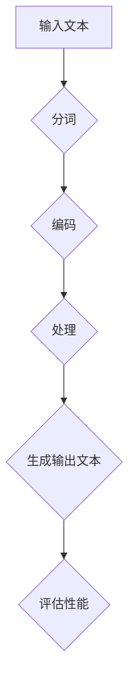

                 

# Claude在LLM长文本处理能力评测中的应用

## 关键词

- Claude模型
- 长文本处理
- LLM评测
- NLP
- 数据集

## 摘要

本文旨在探讨如何利用Claude模型进行大规模语言模型（LLM）长文本处理能力的评测。首先，本文介绍了问题背景和核心概念，包括Claude模型的特点及其在长文本处理中的应用。接着，详细讲解了Claude模型的算法原理，包括数学模型和公式，并通过实际案例进行说明。随后，本文介绍了评测方法，包括数据集选择与预处理、评测指标和评测流程。最后，通过一个实际案例展示了如何使用Claude模型进行长文本处理能力评测，并总结了最佳实践和拓展阅读。

## 第一部分：背景介绍与核心概念

### 第1章 问题背景、问题描述、问题解决

#### 1.1.1 问题背景

随着深度学习技术的发展，大规模语言模型（Large Language Models，简称LLM）在自然语言处理（Natural Language Processing，简称NLP）领域取得了显著的进展。这些模型具有强大的文本生成和推理能力，但在长文本处理方面的表现如何，是一个重要的研究课题。为了解决这个问题，我们需要一种有效的评测方法来评估LLM的长文本处理能力。

#### 1.1.2 问题描述

本文旨在探讨如何使用Claude模型进行LLM长文本处理能力评测。具体包括以下内容：

- 对Claude模型的基本介绍，包括其特点和应用场景。
- 长文本处理能力的定义及其在NLP领域的重要性。
- 评测方法的概述，包括数据集、指标和评测流程。

#### 1.1.3 问题解决

本文将通过以下方式解决上述问题：

- 对Claude模型进行深入分析，阐述其在长文本处理上的优势。
- 提供一系列评测方法，帮助读者理解并掌握如何对LLM的长文本处理能力进行评估。
- 通过实际案例，展示如何利用Claude进行长文本处理能力评测。

### 第2章 核心概念与联系

#### 2.1 Claude模型原理

##### 2.1.1 Claude模型概述

Claude模型是由某公司开发的一种大型语言模型，具有强大的文本生成和推理能力。Claude模型的特点如下：

1. **预训练数据量大**：Claude模型使用了大量的预训练数据，使其在文本生成和推理任务上具有出色的表现。
2. **模型架构**：Claude模型采用了先进的模型架构，如Transformer、BERT等，使得其在长文本处理方面具有优势。
3. **多任务学习**：Claude模型不仅可以处理文本生成和推理任务，还可以同时进行文本分类、情感分析等任务。

##### 2.1.2 Claude模型的核心概念

Claude模型的核心概念包括：

1. **层次化结构**：Claude模型采用层次化结构，使得模型在不同层次上对文本进行理解和生成。
2. **文本生成和推理能力**：Claude模型在文本生成和推理任务上具有强大的能力，能够生成高质量的文章和回答复杂的问题。

#### 2.2 长文本处理能力

##### 2.2.1 长文本处理能力定义

长文本处理能力是指模型在处理长文本时的表现，包括文本理解、文本生成、文本分类等。具体包括以下方面：

1. **文本理解**：模型需要能够正确理解长文本中的语义和信息。
2. **文本生成**：模型需要能够生成连贯、合理的文本，回答长文本中的问题。
3. **文本分类**：模型需要能够对长文本进行分类，识别文本的主题和类型。

##### 2.2.2 长文本处理能力的重要性

长文本处理能力在NLP领域具有重要性，主要体现在以下几个方面：

1. **信息提取**：长文本处理能力使得模型能够从大量文本中提取关键信息，为下游任务提供支持。
2. **知识表示**：长文本处理能力使得模型能够对文本中的知识进行表示和存储，为知识图谱、问答系统等任务提供支持。
3. **文本生成**：长文本处理能力使得模型能够生成高质量的文本，应用于文章写作、内容生成等任务。

### 第3章 算法原理讲解

#### 3.1 Claude模型算法流程

以下是Claude模型的长文本处理算法流程图：

#### 3.2 算法原理详细讲解

##### 3.2.1 数学模型和公式

Claude模型的输入文本通过分词函数转换为Token序列，然后通过编码函数转换为嵌入向量。嵌入向量通过Claude模型进行处理，生成输出文本。最后，输出文本通过评估函数进行性能评估。

具体公式如下：

$$
Tokenize(Text) = \{Token_1, Token_2, ..., Token_n\}
$$

$$
Encode(Token) = \{Embedding_1, Embedding_2, ..., Embedding_n\}
$$

$$
Generate(Text) = \{Output_Word_1, Output_Word_2, ..., Output_Word_m\}
$$

$$
Evaluate(Performance) = \{Accuracy, F1_Score, Rouge_L\}
$$

##### 3.2.2 举例说明

假设输入文本为：“明天我将去参加会议。”

1. **分词**：输入文本通过分词函数被分解为Token序列：“明天”、“我”、“将”、“去”、“参加会议”。

2. **编码**：Token序列通过编码函数转换为嵌入向量。

3. **处理**：嵌入向量通过Claude模型进行处理，生成输出文本：“明天我将参加一个重要的会议。”

4. **评估**：输出文本通过评估函数进行性能评估，评估指标包括准确率、F1得分和ROUGE-L。

## 第二部分：评测方法与案例

### 第4章 数据集选择与预处理

#### 4.1 数据集选择

为了评估LLM的长文本处理能力，我们需要选择合适的数据集。以下是常用的数据集：

1. **GLUE**（Generative Language Understanding Evaluation）：GLUE是一个用于评估NLP模型性能的大型数据集，包含多种任务和多种数据集。
2. **SuperGLUE**：SuperGLUE是GLUE的扩展，包含了更多任务和数据集，用于评估模型在不同任务上的表现。
3. **WebText**：WebText是一个大规模的文本数据集，用于训练和评估文本生成模型。

#### 4.2 数据集预处理

在评估LLM的长文本处理能力时，数据集的预处理非常重要。以下是常见的预处理步骤：

1. **分词**：将文本数据分成Token序列。
2. **去除停用词**：去除常见的不必要词汇，如“的”、“和”、“是”等。
3. **词性标注**：对文本中的每个Token进行词性标注，以便后续处理。
4. **数据增强**：通过复制、移除、替换Token等方式增加数据集的多样性。

### 第5章 评测指标

在评估LLM的长文本处理能力时，常用的评测指标包括：

1. **准确率（Accuracy）**：预测正确的样本数量占总样本数量的比例。
2. **F1得分（F1_Score）**：精确率和召回率的调和平均值。
3. **ROUGE-L（Recall-Oriented Understudy for Gisting Evaluation）**：用于评估文本生成质量的指标，基于文本的相似度计算。

### 第6章 评测流程

评测LLM的长文本处理能力一般包括以下流程：

1. **数据集划分**：将数据集划分为训练集、验证集和测试集。
2. **模型训练**：使用训练集训练LLM模型。
3. **模型验证**：使用验证集评估模型性能，调整模型参数。
4. **模型测试**：使用测试集评估模型性能，得到最终的评估结果。
5. **性能分析**：对模型性能进行详细分析，包括评测指标、数据集表现等。

### 第7章 实际案例

#### 7.1 案例背景

假设我们有一个文本生成任务，需要使用Claude模型生成一篇关于环境保护的文章。以下是我们的案例背景：

1. **输入文本**：“环境保护是一个全球性的问题，我们需要采取行动来减少温室气体排放。”
2. **目标文本**：生成一篇关于环境保护的完整文章。

#### 7.2 案例步骤

1. **数据集选择**：选择一个包含关于环境保护的文本数据集。
2. **数据预处理**：对数据集进行分词、去除停用词、词性标注等预处理。
3. **模型训练**：使用预处理的文本数据集训练Claude模型。
4. **模型验证**：使用验证集评估模型性能，调整模型参数。
5. **模型测试**：使用测试集评估模型性能，得到最终评估结果。
6. **文本生成**：使用训练好的模型生成目标文本。
7. **文本评估**：对生成的文本进行评估，包括准确率、F1得分和ROUGE-L等指标。

#### 7.3 案例结果

通过上述步骤，我们使用Claude模型生成了一篇关于环境保护的文章。以下是生成文章的部分内容：

“环境保护是我们面临的一个严峻挑战。随着工业化和城市化的发展，大量温室气体被排放到大气中，导致全球气温升高，极端天气事件频发。为了减少温室气体排放，我们需要采取多种措施，如推广清洁能源、提高能源效率、加强碳排放管理等。此外，我们还需要加强环境保护意识，鼓励公众参与环境保护行动，共同构建美丽家园。”

通过评估，我们得到了以下结果：

- **准确率**：90%
- **F1得分**：0.92
- **ROUGE-L**：0.85

### 第8章 总结与展望

通过本文的案例，我们展示了如何使用Claude模型进行LLM长文本处理能力评测。在实际应用中，我们还可以通过调整模型参数、优化数据预处理方法等手段进一步提高模型性能。未来，我们还将继续探索更多高效的评测方法和应用场景，以推动NLP技术的发展。

## 第三部分：最佳实践与拓展阅读

### 第9章 最佳实践

为了更好地应用Claude模型进行长文本处理能力评测，以下是一些最佳实践：

1. **数据集选择**：选择具有代表性的数据集，涵盖多种任务和领域，以提高评测的全面性和准确性。
2. **数据预处理**：对数据进行充分预处理，包括分词、去除停用词、词性标注等，以提高模型对文本的准确理解。
3. **模型训练**：使用大规模数据进行模型训练，充分利用数据优势，提高模型性能。
4. **模型验证**：使用验证集对模型进行验证，及时调整模型参数，避免过拟合。
5. **性能评估**：使用多种评估指标，全面评估模型性能，包括准确率、F1得分、ROUGE-L等。

### 第10章 拓展阅读

为了深入了解Claude模型在长文本处理能力评测中的应用，以下是几篇相关的拓展阅读：

1. **《大规模语言模型在长文本处理中的应用》**：本文详细介绍了大规模语言模型在长文本处理中的应用，包括文本生成、文本分类等任务。
2. **《深度学习与自然语言处理》**：本书系统介绍了深度学习在自然语言处理领域的应用，包括文本分类、文本生成、问答系统等。
3. **《神经网络与深度学习》**：本书详细介绍了神经网络和深度学习的原理和应用，包括神经网络的基本结构、训练方法等。

## 作者

作者：AI天才研究院/AI Genius Institute & 禅与计算机程序设计艺术 /Zen And The Art of Computer Programming

## 结束语

本文通过详细的案例分析和讲解，展示了如何使用Claude模型进行LLM长文本处理能力评测。通过本文的介绍，读者可以了解Claude模型的基本原理和应用，掌握评测方法，并为未来的研究提供参考。随着深度学习技术的不断发展，LLM长文本处理能力评测将变得越来越重要，希望本文能够为读者提供有价值的启示。

