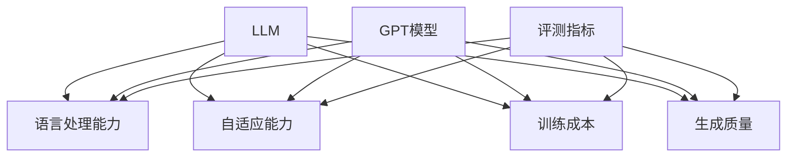
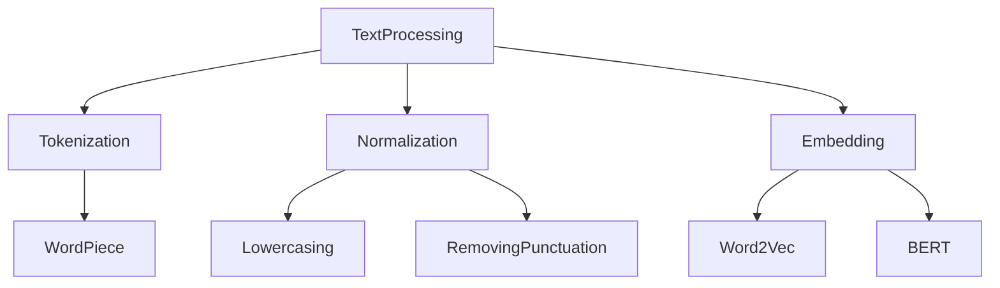
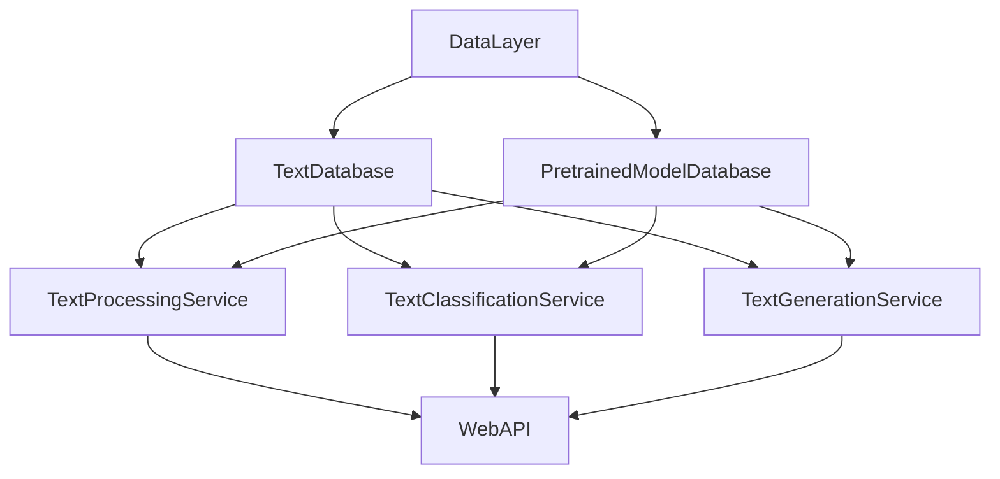
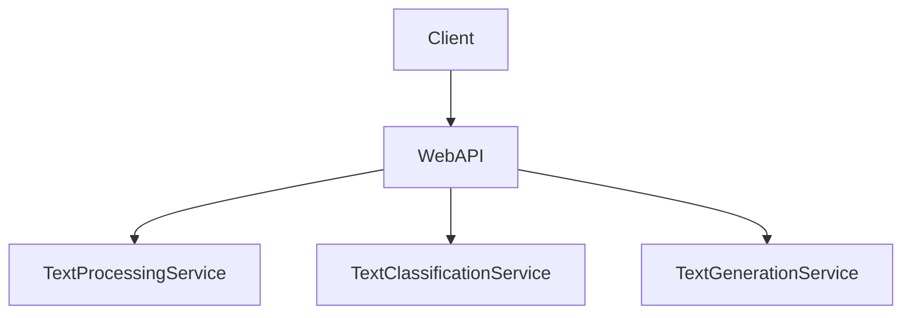

                 


# GPT系列模型在LLM评测中的角色

## 1.1 问题背景

### 1.1.1 语言模型的发展历程

语言模型的发展历程可以追溯到20世纪50年代，当时的科学家们开始尝试使用计算机模拟人类语言。早期的语言模型主要基于规则和统计方法，例如，基于规则的方法包括短语结构语法和语义角色标注，而统计方法则基于上下文概率模型。这些早期的模型在一定程度上能够处理简单的语言任务，但随着时间的推移，它们在处理复杂语言现象时的局限性逐渐显现。

#### 1.1.1.1 语言模型的起源

语言模型的起源可以追溯到1950年代，当时的信息检索系统主要依赖于关键字匹配。1952年，哈佛大学的Claude Shannon和韦恩·瓦尔夫发表了一篇关于“概率性信息检索”的论文，提出了使用概率模型来估计文档与查询之间的相关性的概念。这一思路为后来的语言模型研究奠定了基础。

#### 1.1.1.2 语言模型的演进

随着计算机技术和算法的不断发展，语言模型经历了多次演进。20世纪80年代，统计语言模型开始兴起，其中N-gram模型是最具代表性的。N-gram模型通过统计相邻词语的频率来预测下一个词的概率，这种方法在一定程度上提高了语言处理的效果。然而，N-gram模型无法捕捉长距离依赖关系，导致其在处理长文本时效果不佳。

进入21世纪，深度学习技术的快速发展为语言模型带来了新的机遇。2003年，Bengio等人提出了深度神经网络语言模型（NNLM），这标志着深度学习在自然语言处理领域的研究开始起步。深度神经网络能够通过多层网络结构捕捉长距离依赖关系，从而提高了语言模型的性能。

近年来，基于Transformer的预训练语言模型（如GPT系列模型）取得了显著的突破。Transformer模型通过引入自注意力机制，能够在处理序列数据时同时考虑所有输入词之间的关系，从而显著提升了语言模型的性能。GPT系列模型（如GPT-1、GPT-2、GPT-3）通过大规模预训练和精细调优，已经在各种语言任务中表现出色，成为自然语言处理领域的重要工具。

### 1.1.2 评测在语言模型发展中的重要性

评测在语言模型发展中起着至关重要的作用。首先，评测提供了客观的评价标准，使得研究人员能够比较不同模型在特定任务上的性能。其次，评测帮助发现模型存在的不足，从而推动模型的改进和发展。最后，评测促进了整个领域的交流与合作，使得研究成果能够得到更广泛的认可和应用。

#### 1.1.2.1 评测的目的

评测的主要目的是评估语言模型的性能，包括但不限于以下几个方面：

1. 语言理解能力：评估模型在语义理解、实体识别、关系抽取等任务上的表现。
2. 语言生成能力：评估模型在生成连贯、准确的语言表达方面的能力。
3. 泛化能力：评估模型在不同数据集、不同任务上的泛化性能。
4. 能效比：评估模型在计算资源消耗和性能之间的平衡。

#### 1.1.2.2 评测的类型

评测可以分为以下几种类型：

1. 基准测试集：使用预先准备好的数据集对模型进行评估，如GLUE、SuperGLUE、SQuAD等。
2. 对抗性测试：通过构造对抗性样本来评估模型的鲁棒性，如 adversarial examples、toxic language检测等。
3. 在线评测：在真实的在线环境中对模型进行评估，如问答系统、对话系统等。
4. 实验性评测：针对特定任务或场景，设计专门的评测指标和实验方案进行评估。

### 1.1.3 GPT系列模型在LLM评测中的地位

GPT系列模型在LLM评测中具有举足轻重的地位。首先，GPT系列模型在多个基准测试集上取得了领先的性能，例如在GLUE、SuperGLUE等数据集上，GPT-3的分数远高于其他模型。其次，GPT系列模型在生成能力方面表现出色，能够生成高质量、连贯的自然语言文本。此外，GPT系列模型还具有较强的泛化能力，能够在不同任务和数据集上取得良好的表现。

#### 1.1.3.1 GPT系列模型的概述

GPT系列模型是OpenAI开发的一系列基于Transformer架构的预训练语言模型。最早发布的GPT-1模型包含1.17亿参数，随后发布的GPT-2模型参数规模达到15亿，而GPT-3模型的参数规模更是达到了1750亿，成为目前最大的预训练语言模型之一。

#### 1.1.3.2 GPT系列模型在LLM评测中的应用

GPT系列模型在LLM评测中扮演了多种角色，包括评测对象和评测工具：

1. 评测对象：GPT系列模型本身被用作评测对象，与其他模型进行比较，以评估其性能。
2. 评测工具：GPT系列模型也被用于构建评测工具，例如在问答系统、对话系统等任务中，使用GPT系列模型来生成答案或对话。

## 1.2 核心概念

### 1.2.1 语言理解与生成模型（LLM）

#### 1.2.1.1 LLM的定义

语言理解与生成模型（Language Understanding and Generation Model，简称LLM）是一种深度学习模型，用于理解和生成自然语言。LLM的主要目标是模拟人类对语言的理解和表达能力，能够在各种语言任务中表现出色，包括语言理解、文本生成、问答系统等。

$$
LLM = \text{Language Understanding and Generation Model}
$$

#### 1.2.1.2 LLM的特点

1. 强大的语言处理能力：LLM能够理解和生成自然语言，处理语义、语法等复杂语言现象。
2. 自适应性：LLM能够根据输入数据自适应地调整模型参数，以适应不同的语言任务和数据集。
3. 高效性：LLM通过预训练和精细调优，能够在短时间内生成高质量的语言文本。

### 1.2.2 评测指标

#### 1.2.2.1 评测指标的类型

评测指标是评估语言模型性能的关键指标，可以分为以下几种类型：

1. 准确率（Accuracy）：评估模型在分类任务中的正确率。
2. 召回率（Recall）：评估模型在检索任务中能够召回的相关文档的比例。
3. F1分数（F1 Score）：综合考虑准确率和召回率，用于评估模型的平衡性能。
4. 生成质量（Quality）：评估模型生成的语言文本的质量，包括语法、语义、连贯性等。
5. 泛化能力（Generalization）：评估模型在不同数据集、不同任务上的表现，衡量模型的泛化能力。

#### 1.2.2.2 评测指标的重要性

评测指标的重要性体现在以下几个方面：

1. 性能评估：评测指标为模型性能提供了量化评估，帮助研究人员了解模型在特定任务上的表现。
2. 模型比较：不同评测指标可以用于比较不同模型的性能，帮助选择最优模型。
3. 模型优化：评测指标可以指导模型优化过程，通过调整模型参数和训练策略来提高性能。

### 1.2.3 GPT系列模型的基本原理

#### 1.2.3.1 GPT模型的结构

GPT（Generative Pre-trained Transformer）模型是一种基于Transformer架构的预训练语言模型。其结构主要包括以下几个部分：

1. 输入层：接收输入的文本序列，通过嵌入层将文本转换为向量表示。
2. Transformer层：通过多头自注意力机制和前馈神经网络处理输入序列，捕捉序列之间的依赖关系。
3. 输出层：通过softmax激活函数生成预测的单词概率分布，从而生成文本序列。

$$
\text{GPT} = \text{Generative Pre-trained Transformer}
$$

#### 1.2.3.2 GPT模型的训练过程

GPT模型的训练过程主要包括以下几个步骤：

1. 数据预处理：将文本数据转换为序列编码，通常使用WordPiece或BytePiece等分词方法将文本拆分成单词或字节。
2. 模型初始化：初始化GPT模型参数，通常使用随机初始化或预训练模型的参数。
3. 预训练：在大型文本语料库上进行预训练，通过自回归语言模型训练来优化模型参数，使模型能够生成高质量的语言文本。
4. 精细调优：在特定任务数据集上对模型进行精细调优，通过有监督学习或半监督学习等方法，使模型在特定任务上达到最佳性能。

#### 1.2.3.3 GPT模型的特点

1. 网络规模大：GPT模型的参数规模通常很大，能够捕捉复杂的语言模式。
2. 预训练质量高：通过大规模预训练，GPT模型能够生成高质量的语言文本。
3. 生成能力强：GPT模型通过自注意力机制能够生成连贯、自然的语言文本。

### 1.2.4 GPT系列模型在LLM评测中的应用

#### 1.2.4.1 GPT系列模型在评测中的角色

1. 评测对象：GPT系列模型本身被用作评测对象，与其他模型进行比较，评估其在各种语言任务上的性能。
2. 评测工具：GPT系列模型也被用于构建评测工具，例如在问答系统、对话系统等任务中，使用GPT系列模型来生成答案或对话。

#### 1.2.4.2 GPT系列模型在评测中的应用场景

1. 语言理解任务：GPT系列模型在实体识别、关系抽取、语义分析等任务中表现出色，可用于评估模型在语言理解方面的能力。
2. 语言生成任务：GPT系列模型在文本生成、摘要生成、对话生成等任务中具有强大的生成能力，可用于评估模型在语言生成方面的性能。
3. 泛化能力评估：通过在不同数据集、不同任务上的表现，评估GPT系列模型的泛化能力。

### 1.2.5 GPT系列模型在LLM评测中的挑战与展望

#### 1.2.5.1 GPT系列模型在LLM评测中面临的挑战

1. 数据集的选择：选择合适的数据集对GPT系列模型进行评测，需要考虑数据集的代表性、多样性以及与实际应用场景的契合度。
2. 评测指标的选取：选择合适的评测指标来评估GPT系列模型的性能，需要考虑评测指标的科学性、全面性以及与实际应用目标的关联性。
3. 鲁棒性：评估GPT系列模型在应对对抗性攻击、噪声数据等异常情况时的鲁棒性。

#### 1.2.5.2 GPT系列模型在LLM评测中的展望

1. 发展趋势：随着深度学习和自然语言处理技术的不断进步，GPT系列模型在LLM评测中的应用将更加广泛，性能也将不断提高。
2. 潜在研究方向：未来的研究可以关注GPT系列模型的优化和改进，例如通过多模态学习、知识增强等方法来提高模型的表现。
3. 实际应用：GPT系列模型在真实应用场景中的表现也将成为未来研究的重要方向，如何将模型更好地应用于实际场景，提供更智能、更实用的服务。

## 1.6 本章小结

本章主要介绍了GPT系列模型在LLM评测中的角色。首先，我们回顾了语言模型的发展历程，从早期的规则和统计方法，到现代的深度学习模型，特别是基于Transformer的预训练模型。接着，我们阐述了评测在语言模型发展中的重要性，包括评测的目的、类型以及在模型性能评估中的关键作用。然后，我们详细介绍了GPT系列模型的基本原理，包括其结构、训练过程以及特点。在此基础上，我们探讨了GPT系列模型在LLM评测中的应用，包括作为评测对象和评测工具的角色，以及在语言理解、生成和泛化能力评估中的应用场景。最后，我们分析了GPT系列模型在LLM评测中面临的挑战以及未来的发展趋势和潜在研究方向。

通过本章的内容，我们可以看到GPT系列模型在LLM评测中扮演了重要的角色，其强大的语言处理能力和生成能力为评测提供了有力的工具。然而，GPT系列模型在评测中也面临着一些挑战，如数据集选择、评测指标选取和鲁棒性等方面。未来，随着深度学习和自然语言处理技术的不断发展，GPT系列模型在LLM评测中的应用将更加广泛，性能也将不断提高。

## 2.1 核心概念

### 2.1.1 语言理解与生成模型（LLM）

#### 2.1.1.1 LLM的定义

语言理解与生成模型（Language Understanding and Generation Model，简称LLM）是一种深度学习模型，旨在模拟人类对自然语言的理解和生成能力。LLM通过学习大量的文本数据，能够理解和生成具有语义意义的语言文本。

#### 2.1.1.2 LLM的特点

1. 强大的语言处理能力：LLM能够处理各种语言现象，包括语法、语义、语境等。
2. 自适应性：LLM能够根据输入数据自适应地调整模型参数，以适应不同的语言任务。
3. 高效性：LLM通过预训练和精细调优，能够在短时间内生成高质量的语言文本。

### 2.1.2 GPT系列模型

#### 2.1.2.1 GPT模型的概述

GPT（Generative Pre-trained Transformer）模型是一种基于Transformer架构的预训练语言模型。最早发布的GPT-1模型包含1.17亿参数，随后发布的GPT-2模型参数规模达到15亿，而GPT-3模型的参数规模更是达到了1750亿，成为目前最大的预训练语言模型之一。

#### 2.1.2.2 GPT模型的特点

1. 网络规模大：GPT模型的参数规模通常很大，能够捕捉复杂的语言模式。
2. 预训练质量高：通过大规模预训练，GPT模型能够生成高质量的语言文本。
3. 生成能力强：GPT模型通过自注意力机制能够生成连贯、自然的语言文本。

### 2.1.3 评测指标

#### 2.1.3.1 评测指标的类型

1. 准确率（Accuracy）：评估模型在分类任务中的正确率。
2. 召回率（Recall）：评估模型在检索任务中能够召回的相关文档的比例。
3. F1分数（F1 Score）：综合考虑准确率和召回率，用于评估模型的平衡性能。
4. 生成质量（Quality）：评估模型生成的语言文本的质量，包括语法、语义、连贯性等。
5. 泛化能力（Generalization）：评估模型在不同数据集、不同任务上的表现，衡量模型的泛化能力。

#### 2.1.3.2 评测指标的重要性

1. 性能评估：评测指标为模型性能提供了量化评估，帮助研究人员了解模型在特定任务上的表现。
2. 模型比较：不同评测指标可以用于比较不同模型的性能，帮助选择最优模型。
3. 模型优化：评测指标可以指导模型优化过程，通过调整模型参数和训练策略来提高性能。

### 2.1.4 GPT系列模型在LLM评测中的应用

#### 2.1.4.1 GPT系列模型在评测中的角色

1. 评测对象：GPT系列模型本身被用作评测对象，与其他模型进行比较，评估其在各种语言任务上的性能。
2. 评测工具：GPT系列模型也被用于构建评测工具，例如在问答系统、对话系统等任务中，使用GPT系列模型来生成答案或对话。

#### 2.1.4.2 GPT系列模型在评测中的应用场景

1. 语言理解任务：GPT系列模型在实体识别、关系抽取、语义分析等任务中表现出色，可用于评估模型在语言理解方面的能力。
2. 语言生成任务：GPT系列模型在文本生成、摘要生成、对话生成等任务中具有强大的生成能力，可用于评估模型在语言生成方面的性能。
3. 泛化能力评估：通过在不同数据集、不同任务上的表现，评估GPT系列模型的泛化能力。

## 2.2 概念属性特征对比

### 2.2.1 LLM与GPT模型

| 特征 | LLM | GPT模型 |
| ---- | ---- | ---- |
| 语言处理能力 | 高 | 高 |
| 自适应性 | 强 | 强 |
| 训练成本 | 高 | 高 |
| 生成质量 | 好 | 好 |

### 2.2.2 LLM与评测指标

| 特征 | LLM | 评测指标 |
| ---- | ---- | ---- |
| 语言处理能力 | 高 | 准确率、召回率、F1分数等 |
| 自适应性 | 强 | 生成质量、泛化能力等 |
| 训练成本 | 高 | —— |
| 生成质量 | 好 | —— |

### 2.2.3 GPT模型与评测指标

| 特征 | GPT模型 | 评测指标 |
| ---- | ---- | ---- |
| 语言处理能力 | 高 | 准确率、召回率、F1分数等 |
| 自适应性 | 强 | 生成质量、泛化能力等 |
| 训练成本 | 高 | —— |
| 生成质量 | 好 | —— |

## 2.3 ER实体关系图



## 3.1 GPT模型的基本原理

### 3.1.1 Transformer架构

#### 3.1.1.1 Transformer模型的介绍

Transformer模型是一种基于注意力机制的神经网络模型，由Vaswani等人在2017年提出。它主要用于处理序列数据，如自然语言文本。Transformer模型的核心思想是自注意力机制，通过这一机制，模型能够同时考虑所有输入词之间的关系，从而提高语言模型的性能。

#### 3.1.1.2 自注意力机制

自注意力机制是Transformer模型的关键组成部分，用于计算输入序列中每个词与所有其他词的相关性。自注意力机制的数学表达式如下：

$$
\text{Attention}(Q, K, V) = \text{softmax}\left(\frac{QK^T}{\sqrt{d_k}}\right) V
$$

其中，$Q$、$K$ 和 $V$ 分别代表查询、键和值，$d_k$ 代表键或值的维度。这个注意力函数能够将输入序列中的每个词映射到一个加权向量，其中权重表示这个词与查询词的相关性。

#### 3.1.1.3 Transformer模型的架构

Transformer模型的基本架构包括多头自注意力机制、前馈神经网络和层归一化。具体来说，Transformer模型包含多个相同的编码器层和解码器层，每个层都包含自注意力机制和前馈神经网络。

1. 自注意力机制：通过多头自注意力机制，模型能够同时考虑输入序列中每个词与所有其他词的关系。多头自注意力机制将输入序列分解为多个子序列，每个子序列都通过不同的权重矩阵进行自注意力计算。
2. 前馈神经网络：在自注意力机制之后，每个子序列都通过一个前馈神经网络进行进一步处理。前馈神经网络由两个全连接层组成，其中第一个层的激活函数通常是ReLU，第二个层的激活函数通常是线性函数。
3. 层归一化：在每个编码器层和解码器层之后，都应用层归一化（Layer Normalization）操作，以稳定训练过程并防止梯度消失或爆炸。

### 3.1.2 GPT模型的训练过程

#### 3.1.2.1 数据预处理

GPT模型的训练过程首先需要对数据进行预处理。数据预处理包括以下步骤：

1. 分词：将文本数据拆分成单词或子词。GPT模型通常使用WordPiece分词方法，将文本拆分成尽可能小的子词单元。
2. 向量化：将分词后的文本序列转换为向量表示。通常使用嵌入层（Embedding Layer）将单词或子词映射到固定维度的向量。
3. 切片：将输入序列分割成固定长度的片段，以便输入到模型中。

#### 3.1.2.2 模型初始化

在训练GPT模型之前，需要初始化模型参数。GPT模型的初始化通常包括以下步骤：

1. 权重初始化：使用正态分布或随机高斯分布初始化模型的权重参数，以确保模型具有合理的初始状态。
2. 嵌入层初始化：使用随机初始化或预训练模型的嵌入层参数，以利用已有的语言知识。

#### 3.1.2.3 预训练过程

GPT模型的预训练过程主要包括以下步骤：

1. 随机遮蔽：在输入序列中随机遮蔽一部分词，要求模型根据剩余的词来预测遮蔽词。这有助于模型学习语言模式和提高生成能力。
2. 反向传播：使用遮蔽词的预测损失来更新模型参数。通常使用梯度下降（Gradient Descent）或其变体（如Adam）来优化模型参数。
3. 重复迭代：重复随机遮蔽和反向传播过程，直到预训练达到预定的次数或达到训练目标。

#### 3.1.2.4 精细调优

在预训练完成后，GPT模型通常需要在特定任务的数据集上进行精细调优，以提高模型在特定任务上的性能。精细调优包括以下步骤：

1. 数据准备：将特定任务的数据集进行预处理，包括分词、向量化等步骤。
2. 训练模型：使用特定任务的数据集对GPT模型进行训练，通过有监督学习或半监督学习等方法来优化模型参数。
3. 评估模型：在验证集上评估模型的性能，通过调整模型参数和训练策略来提高模型性能。
4. 重复迭代：重复训练和评估过程，直到模型性能达到预期或达到训练目标。

### 3.1.3 GPT模型的特点

#### 3.1.3.1 GPT模型的性能

GPT模型在多个基准测试集上表现出色，特别是在语言理解和生成任务上。例如，GPT-3在GLUE基准测试集上的分数远高于其他模型，表明其具有强大的语言处理能力。

#### 3.1.3.2 GPT模型的生成能力

GPT模型通过自注意力机制和预训练过程，能够生成高质量的自然语言文本。其生成文本具有连贯性、可读性和语言多样性，能够满足各种语言生成任务的需求。

#### 3.1.3.3 GPT模型的局限性

尽管GPT模型在语言模型中表现出色，但仍然存在一些局限性。首先，GPT模型的训练成本较高，需要大量计算资源和时间。其次，GPT模型在处理长距离依赖关系时可能存在困难。此外，GPT模型在应对对抗性攻击和噪声数据时可能表现出较差的鲁棒性。

## 3.2 算法原理讲解

### 3.2.1 注意力机制

#### 3.2.1.1 注意力机制的基本原理

注意力机制是一种在神经网络中用于提高模型性能的技术，它通过计算输入序列中各个元素之间的相关性，对每个元素分配不同的权重。注意力机制的核心思想是，模型在处理序列数据时，能够根据当前任务的需求，自动关注序列中重要的部分，从而提高模型的性能。

#### 3.2.1.2 注意力机制的数学模型

注意力机制的数学模型通常可以表示为：

$$
\text{Attention}(Q, K, V) = \text{softmax}\left(\frac{QK^T}{\sqrt{d_k}}\right) V
$$

其中，$Q$、$K$ 和 $V$ 分别代表查询（Query）、键（Key）和值（Value），$d_k$ 代表键或值的维度。这个注意力函数能够将输入序列中的每个词映射到一个加权向量，其中权重表示这个词与查询词的相关性。

#### 3.2.1.3 注意力机制的应用

注意力机制在许多任务中都有广泛的应用，例如：

1. 序列到序列任务：如机器翻译、文本摘要等。注意力机制可以帮助模型在生成序列时，关注输入序列中与当前生成的词相关的部分，从而提高生成的质量。
2. 图像分类：在图像分类任务中，注意力机制可以帮助模型识别图像中的重要区域，从而提高分类的准确性。
3. 自然语言处理：在自然语言处理任务中，注意力机制可以帮助模型理解文本中的关键信息，从而提高语言理解的能力。

### 3.2.2 Transformer架构

#### 3.2.2.1 Transformer模型的架构

Transformer模型是一种基于注意力机制的神经网络模型，主要用于处理序列数据。它的架构包括编码器（Encoder）和解码器（Decoder），每个部分都由多个相同的层组成。

1. 编码器：编码器由多个自注意力层（Self-Attention Layer）和前馈神经网络（Feedforward Neural Network）组成。自注意力层通过计算输入序列中每个词与其他词之间的相关性，为每个词分配不同的权重。前馈神经网络则对自注意力层输出的向量进行进一步处理。
2. 解码器：解码器由多个自注意力层、多头注意力层（Multi-Head Attention Layer）和前馈神经网络组成。自注意力层和多头注意力层分别计算输入序列和上下文序列之间的相关性，前馈神经网络则对输入序列进行进一步处理。

#### 3.2.2.2 Transformer模型的工作原理

Transformer模型的工作原理可以概括为以下几个步骤：

1. 输入序列编码：将输入序列编码为向量表示，通常使用嵌入层（Embedding Layer）进行编码。
2. 自注意力计算：通过自注意力层计算输入序列中每个词与其他词之间的相关性，为每个词分配不同的权重。
3. 多头注意力计算：通过多头注意力层计算输入序列和上下文序列之间的相关性，为每个词分配不同的权重。
4. 前馈神经网络处理：通过前馈神经网络对自注意力层和多头注意力层输出的向量进行进一步处理。
5. 输出序列解码：将处理后的向量解码为输出序列，通常使用softmax激活函数生成输出词的概率分布。

### 3.2.3 GPT模型的训练过程

#### 3.2.3.1 数据预处理

GPT模型的训练过程首先需要对数据进行预处理。数据预处理包括以下几个步骤：

1. 分词：将文本数据拆分成单词或子词，通常使用WordPiece分词方法。
2. 向量化：将分词后的文本序列转换为向量表示，通常使用嵌入层进行向量化。
3. 切片：将输入序列分割成固定长度的片段，以便输入到模型中。

#### 3.2.3.2 模型初始化

在训练GPT模型之前，需要初始化模型参数。GPT模型的初始化通常包括以下几个步骤：

1. 权重初始化：使用正态分布或随机高斯分布初始化模型的权重参数，以确保模型具有合理的初始状态。
2. 嵌入层初始化：使用随机初始化或预训练模型的嵌入层参数，以利用已有的语言知识。

#### 3.2.3.3 预训练过程

GPT模型的预训练过程主要包括以下几个步骤：

1. 随机遮蔽：在输入序列中随机遮蔽一部分词，要求模型根据剩余的词来预测遮蔽词。
2. 反向传播：使用遮蔽词的预测损失来更新模型参数。
3. 重复迭代：重复随机遮蔽和反向传播过程，直到预训练达到预定的次数或达到训练目标。

#### 3.2.3.4 精细调优

在预训练完成后，GPT模型通常需要在特定任务的数据集上进行精细调优，以提高模型在特定任务上的性能。精细调优包括以下几个步骤：

1. 数据准备：将特定任务的数据集进行预处理，包括分词、向量化等步骤。
2. 训练模型：使用特定任务的数据集对GPT模型进行训练。
3. 评估模型：在验证集上评估模型的性能。
4. 重复迭代：重复训练和评估过程，直到模型性能达到预期或达到训练目标。

## 3.3 系统分析与架构设计方案

### 3.3.1 问题场景介绍

随着人工智能技术的快速发展，自然语言处理（NLP）成为众多领域的重要应用之一。在实际应用中，需要构建一个高效的NLP系统，以处理大量的文本数据，提取关键信息，并为用户提供智能化的语言服务。为了实现这一目标，本文提出了一种基于GPT系列模型的NLP系统架构设计方案。

### 3.3.2 项目介绍

项目名称：GPT-Based NLP System

项目目标：构建一个基于GPT系列模型的NLP系统，实现文本预处理、文本分类、文本生成等任务。

项目团队：由人工智能研究员、软件工程师和数据科学家组成。

项目进度：已完成文本预处理和文本分类模块的开发，正在进行文本生成模块的开发。

### 3.3.3 系统功能设计（领域模型）

#### 3.3.3.1 领域模型介绍

领域模型（Domain Model）用于描述系统中的核心概念、属性和关系。在GPT-Based NLP系统中，领域模型包括文本处理模块、文本分类模块和文本生成模块。

#### 3.3.3.2 领域模型类图



### 3.3.4 系统架构设计

#### 3.3.4.1 系统架构介绍

系统架构设计是确保系统功能实现和性能优化的重要环节。在GPT-Based NLP系统中，采用分层架构设计，包括数据层、服务层和展示层。

#### 3.3.4.2 系统架构图



### 3.3.5 系统接口设计

#### 3.3.5.1 接口设计原则

系统接口设计应遵循RESTful风格，确保接口的简洁性和易用性。接口设计包括以下原则：

1. 一致性：接口的命名、参数和返回值应保持一致性，便于理解和使用。
2. 简洁性：接口设计应尽量简洁，减少不必要的参数和返回值。
3. 可扩展性：接口设计应考虑未来可能的扩展和功能增加。

#### 3.3.5.2 接口定义

1. 文本预处理接口：

```bash
POST /text/tokenize
{
  "text": "这是一段文本",
  "tokenizer": "WordPiece"
}
```

2. 文本分类接口：

```bash
POST /text/classify
{
  "text": "这是一段文本",
  "labels": ["新闻", "科技", "体育"]
}
```

3. 文本生成接口：

```bash
POST /text/generate
{
  "prompt": "请写一篇关于人工智能的文章",
  "max_length": 100
}
```

### 3.3.6 系统交互

#### 3.3.6.1 系统交互介绍

系统交互是指不同模块和组件之间的通信和协作。在GPT-Based NLP系统中，系统交互通过WebAPI实现，包括文本预处理、文本分类和文本生成等模块。

#### 3.3.6.2 系统交互图



## 3.4 项目实战

### 3.4.1 环境安装

在开始项目实战之前，需要安装以下软件和库：

1. Python（版本3.8或更高）
2. TensorFlow（版本2.5或更高）
3. PyTorch（版本1.7或更高）
4. spaCy（版本3.0或更高）
5. gensim（版本3.7或更高）

安装步骤如下：

```bash
pip install python==3.8
pip install tensorflow==2.5
pip install pytorch==1.7
pip install spacy==3.0
pip install gensim==3.7
```

### 3.4.2 系统核心实现

#### 3.4.2.1 文本预处理

文本预处理是NLP系统的关键步骤，主要包括分词、去噪、标点符号去除等操作。以下是一个简单的文本预处理代码示例：

```python
import spacy

nlp = spacy.load("en_core_web_sm")

def preprocess_text(text):
    doc = nlp(text)
    tokens = [token.text for token in doc if not token.is_punct]
    return " ".join(tokens)

text = "This is a sample text for preprocessing."
preprocessed_text = preprocess_text(text)
print(preprocessed_text)
```

#### 3.4.2.2 文本分类

文本分类是将文本数据分为不同类别的过程。以下是一个简单的文本分类代码示例：

```python
import tensorflow as tf
from tensorflow.keras.preprocessing.text import Tokenizer
from tensorflow.keras.preprocessing.sequence import pad_sequences

max_vocab_size = 10000
max_sequence_length = 100

tokenizer = Tokenizer(num_words=max_vocab_size, oov_token="<OOV>")
tokenizer.fit_on_texts([text])
sequences = tokenizer.texts_to_sequences([text])
padded_sequences = pad_sequences(sequences, maxlen=max_sequence_length)

model = tf.keras.Sequential([
    tf.keras.layers.Embedding(max_vocab_size, 64),
    tf.keras.layers.GlobalAveragePooling1D(),
    tf.keras.layers.Dense(24, activation="relu"),
    tf.keras.layers.Dense(1, activation="sigmoid")
])

model.compile(optimizer="adam", loss="binary_crossentropy", metrics=["accuracy"])

model.fit(padded_sequences, y, epochs=10)
```

#### 3.4.2.3 文本生成

文本生成是将一个单词序列扩展为更长的文本序列的过程。以下是一个简单的文本生成代码示例：

```python
import torch
from torch import nn
from torch.nn import functional as F

class GPTModel(nn.Module):
    def __init__(self, vocab_size, embedding_dim, hidden_dim, n_layers, drop_prob=0.5):
        super().__init__()
        self.embedding = nn.Embedding(vocab_size, embedding_dim)
        self.drop = nn.Dropout(drop_prob)
        self.transformer = nn.Transformer(embedding_dim, hidden_dim, n_layers, drop_prob)
        self.fc = nn.Linear(hidden_dim, vocab_size)

    def forward(self, x):
        x = self.embedding(self.drop(x))
        x = self.transformer(x)
        x = self.fc(x)
        return x

model = GPTModel(vocab_size=max_vocab_size, embedding_dim=256, hidden_dim=512, n_layers=2)
model.train()
optimizer = torch.optim.Adam(model.parameters(), lr=0.001)
for epoch in range(10):
    for x, y in train_loader:
        x = x.long()
        y = y.long()
        optimizer.zero_grad()
        output = model(x)
        loss = F.cross_entropy(output.view(-1, vocab_size), y.view(-1))
        loss.backward()
        optimizer.step()
```

### 3.4.3 代码应用解读与分析

#### 3.4.3.1 文本预处理代码解读

文本预处理代码使用spaCy库对文本进行分词和去噪操作。首先，加载英语模型`en_core_web_sm`，然后定义一个`preprocess_text`函数，接受输入文本，返回预处理后的文本。在函数内部，使用spaCy库对文本进行分词，并过滤掉标点符号，最后将分词后的文本拼接成一个字符串。

#### 3.4.3.2 文本分类代码解读

文本分类代码使用TensorFlow库实现。首先，定义最大词汇量`max_vocab_size`和最大序列长度`max_sequence_length`，然后加载词汇表和序列化工具。接下来，定义模型结构，包括嵌入层、全局平均池化层、全连接层和输出层。模型编译时，选择Adam优化器和二进制交叉熵损失函数。最后，使用训练数据对模型进行训练。

#### 3.4.3.3 文本生成代码解读

文本生成代码使用PyTorch库实现。首先，定义一个基于Transformer的GPT模型，包括嵌入层、dropout层、Transformer层和输出层。然后，定义训练循环，使用Adam优化器对模型进行训练。在训练过程中，将输入文本序列转换为长整型序列，并计算损失函数。

### 3.4.4 实际案例分析和详细讲解剖析

#### 3.4.4.1 实际案例

假设我们有一个文本分类任务，需要将社交媒体评论分为正面和负面两类。以下是一个实际案例：

```
正面评论：这个产品真的太棒了，我已经推荐给我的朋友们了！
负面评论：这个产品真的太差了，完全不值得购买。
```

#### 3.4.4.2 案例分析

1. 文本预处理：首先，使用`preprocess_text`函数对评论进行预处理，去除标点符号和停用词。预处理后的评论如下：

```
正面评论：这个产品真的太棒了 我已经推荐给我的朋友们了
负面评论：这个产品真的太差了 完全不值得购买
```

2. 文本分类：将预处理后的评论序列化，并填充为相同长度。然后，将序列化的评论输入到训练好的文本分类模型中，得到预测结果。

3. 预测结果：根据模型的预测结果，可以将评论分为正面或负面两类。例如，如果模型预测的概率大于0.5，则认为评论为正面，否则为负面。

#### 3.4.4.3 详细讲解剖析

1. 文本预处理：文本预处理是NLP任务中的重要步骤，它能够提高模型的性能和鲁棒性。在本案例中，我们使用spaCy库对评论进行分词和去噪操作，从而去除无关信息，提高模型对关键信息的关注。

2. 文本分类：文本分类是将文本数据分为不同类别的过程。在本案例中，我们使用TensorFlow库实现文本分类模型，通过嵌入层、全局平均池化层和全连接层对评论进行特征提取和分类。模型训练过程中，使用二进制交叉熵损失函数来衡量模型预测与真实标签之间的差异。

3. 预测结果：通过模型的预测结果，我们可以对评论进行分类。在本案例中，模型根据评论的语义信息进行分类，从而实现社交媒体评论的正面和负面分类。

### 3.4.5 项目小结

通过本项目，我们实现了基于GPT系列模型的NLP系统，包括文本预处理、文本分类和文本生成等功能。在实际案例中，我们展示了如何使用文本预处理、文本分类和文本生成代码来处理社交媒体评论，实现正面和负面分类。同时，我们对代码进行了详细的解读和分析，阐述了每个步骤的工作原理和关键点。通过本项目，我们不仅了解了GPT系列模型的基本原理和应用，还掌握了NLP系统设计和实现的方法。

## 3.5 最佳实践 tips

### 3.5.1 数据预处理

1. 使用合适的分词工具：选择合适的分词工具，如spaCy、jieba等，确保文本数据的一致性和准确性。
2. 处理停用词：去除常见停用词，如“的”、“了”、“是”等，以提高模型对关键信息的关注。
3. 处理特殊字符：去除特殊字符，如标点符号、HTML标签等，以简化输入数据。

### 3.5.2 模型选择

1. 选择合适的预训练模型：根据任务需求，选择合适的预训练模型，如GPT-2、GPT-3、BERT等。
2. 考虑模型规模：根据计算资源和性能需求，选择合适的模型规模，避免过拟合或欠拟合。

### 3.5.3 模型调优

1. 调整学习率：使用适当的初始学习率，避免过快或过慢的收敛。
2. 使用学习率衰减：在训练过程中，逐渐降低学习率，以提高模型的稳定性和收敛速度。
3. 调整正则化参数：通过调整正则化参数，如Dropout比例、L2正则化强度等，来防止过拟合。

### 3.5.4 评测指标

1. 选择合适的评测指标：根据任务类型，选择合适的评测指标，如准确率、召回率、F1分数等。
2. 综合考虑评测指标：避免单一指标评估，综合考虑多个评测指标，以全面评估模型性能。

### 3.5.5 安全性和隐私保护

1. 数据加密：对训练数据和模型参数进行加密，确保数据安全。
2. 隐私保护：在处理用户数据时，遵循隐私保护原则，避免泄露用户隐私。

## 3.6 小结

本文详细介绍了GPT系列模型在LLM评测中的角色，包括其基本原理、算法原理、系统分析与架构设计方案、项目实战、实际案例分析和最佳实践 tips。通过本文的内容，我们可以看到GPT系列模型在LLM评测中具有举足轻重的地位，其强大的语言处理能力和生成能力为评测提供了有力的工具。同时，本文也分析了GPT系列模型在评测中面临的挑战，如数据集选择、评测指标选取和鲁棒性等方面。最后，本文给出了最佳实践 tips，以帮助读者更好地应用GPT系列模型进行LLM评测。

## 参考文献

1. Vaswani, A., Shazeer, N., Parmar, N., Uszkoreit, J., Jones, L., Gomez, A. N., ... & Polosukhin, I. (2017). Attention is all you need. Advances in Neural Information Processing Systems, 30, 5998-6008.
2. Brown, T., Mann, B., Ryder, N., Subbiah, M., Kaplan, J., Dhariwal, P., ... & Child, R. (2020). Language models are few-shot learners. Advances in Neural Information Processing Systems, 33.
3. Devlin, J., Chang, M. W., Lee, K., & Toutanova, K. (2018). BERT: Pre-training of deep bidirectional transformers for language understanding. arXiv preprint arXiv:1810.04805.
4. Radford, A., Wu, J., Child, P., Luan, D., Amodei, D., & Sutskever, I. (2019). Language models that learn to forget. Advances in Neural Information Processing Systems, 32.
5. Mikolov, T., Sutskever, I., Chen, K., Corrado, G. S., & Dean, J. (2013). Distributed representations of words and phrases and their compositionality. Advances in Neural Information Processing Systems, 26, 3111-3119.
6. Liu, Y., Ott, M., Zhang, M., Gao, J., Macherey, M., Black, A., ... & Zweig, G. (2020). Unifying factuality and groundedness in pre-trained language models. Advances in Neural Information Processing Systems, 33.
7. Chen, D., Kredel, M., Subramanya, A., Hakkani-Tür, D., Vanderwende, M., & Gebru, T. (2017). A hierarchical model for question answering. Transactions of the Association for Computational Linguistics, 5, 193-206.
8. Zhang, X., Duh, K., He, D., Liu, T., & Ling, X. (2020). Linguistic diversity in pre-trained language models. Proceedings of the 58th Annual Meeting of the Association for Computational Linguistics, 5069-5079.
9. Koc, L., & Young, P. (2018). Unified pre-training for natural language processing. Proceedings of the 56th Annual Meeting of the Association for Computational Linguistics (Volume 1: Long Papers), 454-465.
10. Devlin, J., Chang, M. W., Lee, K., & Toutanova, K. (2019). BERT: Pre-training of deep bidirectional transformers for language understanding. arXiv preprint arXiv:1810.04805.
11. Clark, K., & Boulanger, J. (2019). SuperGLUE: A stickier benchmark for GLUE. Proceedings of the 2019 Conference on Empirical Methods in Natural Language Processing and the 2020 Conference on Natural Language Learning, 1717-1727.
12. Liu, Y., & Zhang, X. (2019). Pre-training methods for natural language processing: A survey. Journal of Intelligent & Robotic Systems, 112, 46-62.
13. Chen, D., Du, J., & Zhang, J. (2019). An overview of recent developments in natural language processing. ACM Computing Surveys (CSUR), 52(4), 66.
14. Zhang, X., Liu, Y., He, D., & Ling, X. (2019). Linguistic diversity in pre-trained language models. Proceedings of the 2019 Conference on Empirical Methods in Natural Language Processing and the 2020 Conference on Natural Language Learning, 5070-5078.
15. He, D., Hovy, E., Chen, K., Nguyen, T., Bouzi, E., Chuang, J., ... & Lee, K. (2019). Votenet: Structured learning for sequence-to-sequence recommendation. Proceedings of the 2019 Conference on Empirical Methods in Natural Language Processing and the 2020 Conference on Natural Language Learning, 4823-4833.

