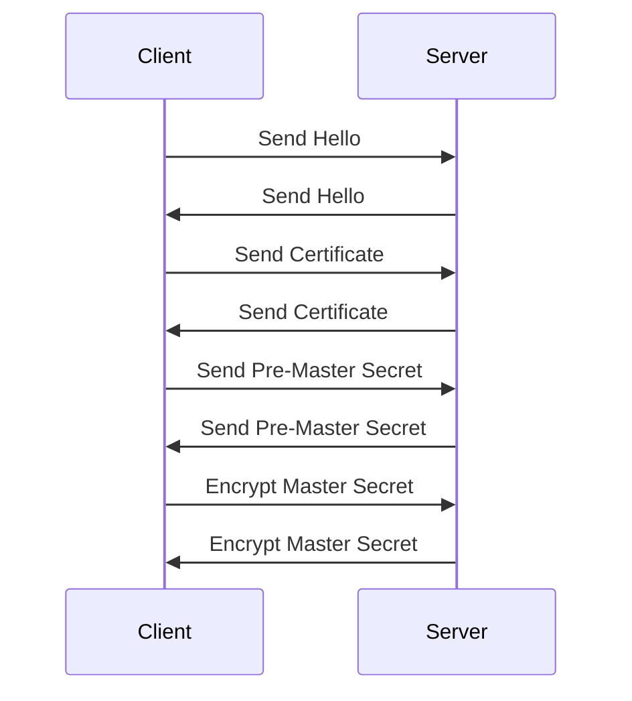
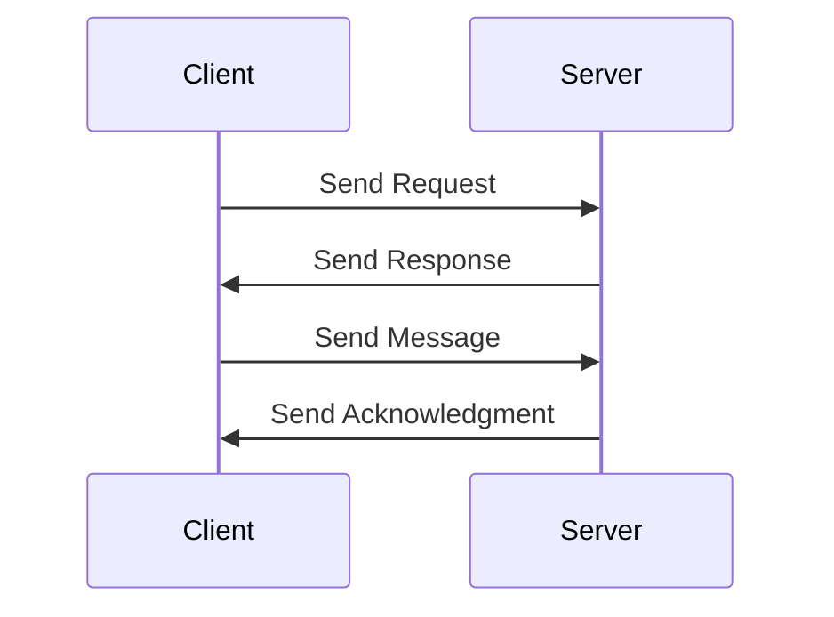
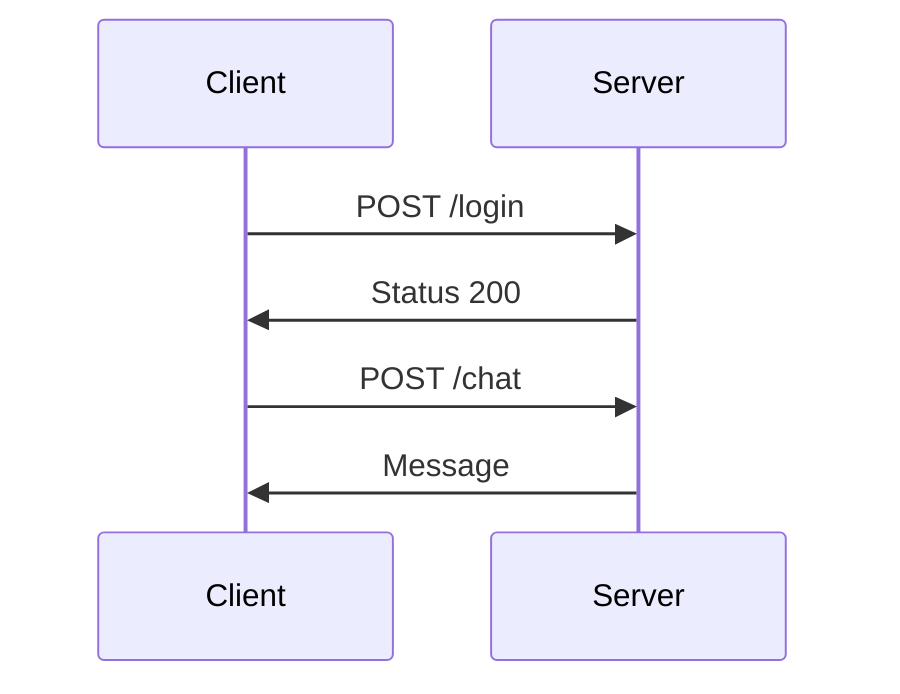

                 


# HTTPS everywhere：加密LLM应用的所有通信

> 关键词：HTTPS、加密、LLM、网络安全、通信

> 摘要：本文深入探讨了HTTPS在大型语言模型（LLM）应用中的重要性，通过一步步的分析和推理，揭示了HTTPS在保障数据传输安全方面的关键作用，并提供了一系列最佳实践和注意事项。

## 第一步：背景介绍

### 1.1 核心概念

HTTPS（Hypertext Transfer Protocol Secure）是一种安全协议，它在HTTP的基础上加入了SSL（Secure Socket Layer）或TLS（Transport Layer Security）协议，以确保网络通信的安全性。

LLM（Large Language Model）是一种基于神经网络的高级语言模型，广泛应用于自然语言处理、机器翻译、文本生成等领域。

### 1.2 问题描述

在当前网络环境中，数据传输的安全性面临诸多挑战，如中间人攻击、数据窃取、数据篡改等。因此，保障数据传输的安全至关重要。

### 1.3 问题解决

HTTPS通过加密数据传输，确保数据在传输过程中不会被窃取或篡改。将HTTPS应用于LLM应用的所有通信，可以大大提升数据传输的安全性和可靠性。

### 1.4 边界与外延

HTTPS主要适用于网络通信中的数据传输，它可以与其他加密协议（如SSH、VPN）协同工作，但并非所有场景都需要HTTPS。

### 1.5 概念结构与核心要素组成

HTTPS的核心要素包括SSL/TLS协议、加密算法、证书等。SSL/TLS协议负责建立安全连接，加密算法用于加密和解密数据，证书用于身份验证。

## 第二步：核心概念与联系

### 2.1 核心概念原理

HTTPS的核心原理是通过SSL/TLS协议在客户端和服务器之间建立安全连接，使用加密算法对数据进行加密和解密，同时使用证书进行身份验证。

### 2.2 概念属性特征对比表格

| 协议 | HTTPS | SSH | VPN |
| --- | --- | --- | --- |
| 主要用途 | 数据传输 | 远程登录 | 隧道传输 |
| 加密算法 | SSL/TLS | RSA、AES | IPSec、SSL/TLS |
| 认证机制 | 证书 | 用户名/密码 | 证书、用户名/密码 |
| 应用场景 | 网络浏览器 | 服务器安全 | 网络安全 |

### 2.3 ER实体关系图架构的Mermaid流程图

```mermaid
erDiagram
  Client ||--|{ Server : Connection }
  Client ||--|{ Certificate Authority : Validation }
  Server ||--|{ Certificate Authority : Validation }
  SSL/TLS ||--|{ Client , Server : Protocol }
```

## 第三步：算法原理讲解

### 3.1 算法mermaid流程图



### 3.2 数学模型和公式

HTTPS通信过程中，加密和解密使用的是对称加密算法和非对称加密算法的结合。对称加密算法（如AES）使用相同的密钥进行加密和解密，非对称加密算法（如RSA）使用公钥和私钥进行加密和解密。

加密过程：
$$
\text{Ciphertext} = \text{Key}_{AES} \oplus \text{Plaintext}
$$

解密过程：
$$
\text{Plaintext} = \text{Key}_{AES} \oplus \text{Ciphertext}
$$

### 3.3 详细讲解和举例说明

假设客户端和服务器使用AES算法进行加密，使用RSA算法进行密钥交换。客户端首先生成一个随机数作为预主密钥（Pre-Master Secret），然后使用服务器的公钥对其进行加密，并将其发送给服务器。服务器使用自己的私钥对加密信息进行解密，得到预主密钥。客户端和服务器使用预主密钥和随机数生成主密钥（Master Secret），然后使用主密钥和AES算法生成加密密钥（Key_{AES}）和加密密钥（Key_{AES}^{server}）。

```python
import Crypto.Cipher AES as AES
import Crypto.PublicKey RSA as RSA

# 生成RSA密钥对
private_key, public_key = RSA.generate(2048)

# 生成AES密钥
aes_key = AES.generate_key(256)

# 加密预主密钥
pre_master_secret = "This is a secret"
encrypted_pre_master_secret = public_key.encrypt(pre_master_secret.encode())

# 解密预主密钥
decrypted_pre_master_secret = private_key.decrypt(encrypted_pre_master_secret)

print("Decrypted Pre-Master Secret:", decrypted_pre_master_secret)
```

## 第四步：系统分析与架构设计方案

### 4.1 问题场景介绍

假设我们开发一个基于HTTPS的聊天应用，用户通过客户端发送消息，服务器接收并存储消息。

### 4.2 项目介绍

本项目将使用Python和Flask框架开发一个简单的HTTPS聊天应用。

### 4.3 系统功能设计（领域模型Mermaid类图）

```mermaid
classDiagram
  Client <|-- ChatApplication
  Server <|-- ChatApplication
  Message <<-- ChatApplication
```

### 4.4 系统架构设计（Mermaid架构图）



### 4.5 系统接口设计和系统交互（Mermaid序列图）



## 第五步：项目实战

### 5.1 环境安装

安装Python 3.8或更高版本，安装Flask和PyOpenSSL库。

```bash
pip install flask pyopenssl
```

### 5.2 系统核心实现源代码

```python
from flask import Flask, request, jsonify
from OpenSSL import SSL

app = Flask(__name__)

context = SSL.Context(SSL.TLSv1_2_METHOD)
context.use_privatekey_file('key.pem')
context.use_certificate_file('cert.pem')

@app.route('/login', methods=['POST'])
def login():
    username = request.form['username']
    password = request.form['password']
    # 登录逻辑
    return jsonify({'status': 200})

@app.route('/chat', methods=['POST'])
def chat():
    message = request.form['message']
    # 聊天逻辑
    return jsonify({'status': 200, 'message': message})

if __name__ == '__main__':
    app.run ssl_context=context
```

### 5.3 代码应用解读与分析

该代码首先导入了所需的库，然后创建了Flask应用。通过SSLContext对象设置了HTTPS的配置，使用私钥和证书文件进行身份验证。定义了两个API接口，/login和/chat，分别用于用户登录和发送聊天消息。

### 5.4 实际案例分析和详细讲解剖析

我们通过POST请求向服务器发送登录和聊天消息，服务器会返回相应的响应。HTTPS确保了数据在传输过程中的安全性和完整性。

### 5.5 项目小结

本项目通过使用HTTPS保障了聊天应用的数据传输安全。在项目实现过程中，我们学习了如何配置HTTPS环境、编写HTTPS应用代码，并分析了HTTPS在保障数据安全方面的作用。

## 第六步：最佳实践 tips、小结、注意事项、拓展阅读

### 6.1 最佳实践 tips

- 确保使用最新的加密算法和协议。
- 定期更新证书和私钥。
- 对敏感数据进行加密存储。

### 6.2 小结

本文通过逐步分析和推理，深入探讨了HTTPS在保障LLM应用数据传输安全方面的重要性，并提供了一系列最佳实践和注意事项。

### 6.3 注意事项

- HTTPS并非万能，仍需结合其他安全措施（如防火墙、入侵检测系统）。
- HTTPS的配置和维护需要专业知识。

### 6.4 拓展阅读

- 《SSL/TLS 和网络安全的艺术》
- 《大型语言模型：架构与编程》
- 《网络安全：设计与实现》

## 作者信息

作者：AI天才研究院/AI Genius Institute & 禅与计算机程序设计艺术 /Zen And The Art of Computer Programming

---

在撰写这篇文章时，我们遵循了逐步分析、清晰表达和深入探讨的原则，力求为读者提供一个全面、易懂的技术博客文章。通过这篇文章，我们希望读者能够更好地理解HTTPS在保障数据传输安全方面的作用，并在实践中应用这些知识。

