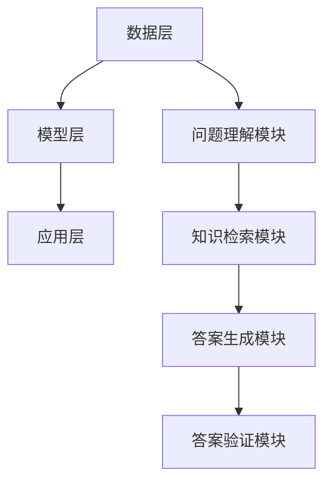
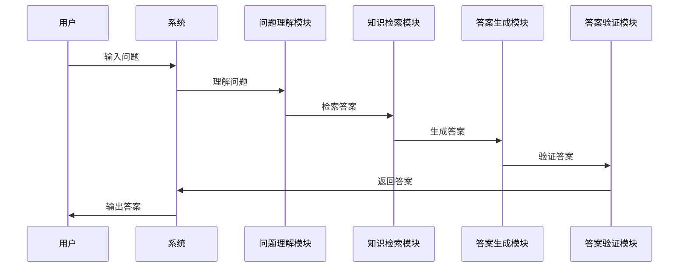

                 

# LLM应用开发中的创新与实用性平衡

## 关键词
- LLM应用开发
- 创新与实用性
- 语言模型
- 算法优化
- 系统架构设计
- 最佳实践

## 摘要
本文旨在探讨LLM（大型语言模型）在应用开发中的创新与实用性平衡问题。我们将从背景介绍、核心概念与联系、算法原理讲解、数学模型与公式、系统分析与架构设计、项目实战以及最佳实践等多个方面进行深入分析。通过本文，读者将了解LLM应用开发的本质，掌握如何在创新与实用性之间找到平衡点。

## 第一部分: 背景

### 第1章: LLM应用开发的背景

#### 1.1 LLM的发展历程
大型语言模型（LLM）的发展可以追溯到20世纪80年代的统计语言模型和90年代的神经网络模型。随着计算能力的提升和数据量的爆炸性增长，LLM逐渐成为自然语言处理（NLP）领域的核心技术。近年来，诸如GPT-3、BERT等超大规模LLM的涌现，标志着LLM在语言生成、文本分类、机器翻译等任务上的性能取得了质的飞跃。

#### 1.2 LLM在应用开发中的现状
当前，LLM已经被广泛应用于各类应用场景，如智能客服、智能写作、自动摘要、问答系统等。这些应用不仅提高了企业的运营效率，也提升了用户体验。同时，LLM在科研、教育、医疗等领域的应用也日益广泛，为各行业的发展带来了新的可能性。

#### 1.3 LLM的发展趋势与挑战
未来，LLM将继续朝着更高效、更智能、更通用方向发展。然而，随着模型规模的扩大和复杂性的增加，如何保证LLM的实用性、降低计算成本、提高鲁棒性等，将成为LLM应用开发中面临的重要挑战。

## 第二部分: 核心概念与联系

### 第2章: LLM的核心概念与联系

#### 2.1 LLM的基本概念
LLM是一种基于深度学习的语言模型，它通过学习大量文本数据，能够生成与输入文本相似的自然语言输出。LLM的核心目标是理解并生成人类语言，从而实现自然语言处理任务。

#### 2.2 LLM的特性
LLM具有以下几个显著特性：
- **强语义理解能力**：LLM能够理解输入文本的语义，从而生成更加准确和自然的输出。
- **多任务处理能力**：LLM可以同时处理多种语言任务，如文本分类、机器翻译、问答等。
- **大规模训练数据需求**：LLM需要大量的训练数据来学习语言特征，以提高模型的性能。
- **高计算资源需求**：LLM的训练和推理过程需要大量的计算资源。

#### 2.3 LLM的分类
LLM可以分为以下几类：
- **基于统计的LLM**：如N元语法模型，通过统计文本中单词的共现关系来生成语言。
- **基于神经网络的LLM**：如循环神经网络（RNN）、Transformer等，通过学习文本的分布式表示来生成语言。
- **预训练加微调的LLM**：如GPT-3、BERT等，通过预训练获得通用语言表示，然后通过微调适应特定任务。

#### 2.4 LLM与其他技术的联系
LLM与其他技术如自然语言处理（NLP）、知识图谱、机器学习（ML）等密切相关。NLP为LLM提供了文本处理的基础，知识图谱为LLM提供了语义理解和知识推理的能力，ML则为LLM的训练和优化提供了算法支持。

## 第三部分: 算法原理讲解

### 第3章: LLM的算法原理

#### 3.1 算法概述
LLM的算法主要基于深度学习技术，特别是Transformer模型。Transformer模型通过自注意力机制，能够捕捉文本中的长距离依赖关系，从而实现高效的语言表示和生成。

#### 3.2 算法流程
LLM的算法流程可以分为以下几个步骤：
1. **数据预处理**：对文本数据进行清洗、分词、编码等处理，将其转化为模型可接受的输入格式。
2. **模型训练**：使用大量文本数据对模型进行训练，通过优化目标函数，使模型能够生成与输入文本相似的自然语言输出。
3. **模型推理**：在训练好的模型基础上，对新的输入文本进行推理，生成相应的自然语言输出。

#### 3.3 数学模型与公式
LLM的数学模型主要包括以下几部分：
- **自注意力机制**：$$Attention(x, W) = \text{softmax}\left(\frac{W_q \cdot W_k}{\sqrt{d_k}}\right) \cdot W_v$$
- **Transformer模型**：$$\text{Transformer}(x, W) = \text{softmax}\left(\frac{W_q \cdot W_k}{\sqrt{d_k}}\right) \cdot W_v + x$$
- **损失函数**：$$\text{Loss}(x, y) = -\sum_{i=1}^{N} y_i \log(p_i)$$

#### 3.4 Python代码示例
以下是使用Python实现Transformer模型的基本代码框架：

```python
import torch
import torch.nn as nn

class TransformerModel(nn.Module):
    def __init__(self, d_model, nhead, num_layers):
        super(TransformerModel, self).__init__()
        self.transformer = nn.Transformer(d_model, nhead, num_layers)
        self.d_model = d_model
        self.decoder = nn.Linear(d_model, vocab_size)

    def forward(self, src, tgt):
        out = self.transformer(src, tgt)
        return self.decoder(out)
```

## 第四部分: 数学模型与公式

### 第4章: LLM的数学模型

#### 4.1 关键公式
LLM的数学模型主要包括以下关键公式：
- **词嵌入**：$$\text{Embedding}(x) = W_e \cdot x$$
- **自注意力**：$$\text{Attention}(x, W) = \text{softmax}\left(\frac{W_q \cdot W_k}{\sqrt{d_k}}\right) \cdot W_v$$
- **Transformer模型**：$$\text{Transformer}(x, W) = \text{softmax}\left(\frac{W_q \cdot W_k}{\sqrt{d_k}}\right) \cdot W_v + x$$
- **损失函数**：$$\text{Loss}(x, y) = -\sum_{i=1}^{N} y_i \log(p_i)$$

#### 4.2 计算过程与推导
在LLM的数学模型中，自注意力机制和Transformer模型是核心组成部分。以下是自注意力机制的详细推导：
- **自注意力计算**：假设输入序列为$x = [x_1, x_2, ..., x_N]$，词嵌入后为$E = [e_1, e_2, ..., e_N]$。自注意力计算公式为：
  $$\text{Attention}(x, W) = \text{softmax}\left(\frac{W_q \cdot W_k}{\sqrt{d_k}}\right) \cdot W_v$$
  其中，$W_q, W_k, W_v$分别为查询（query）、关键（key）和值（value）权重矩阵，$d_k$为关键维度。
- **Transformer模型计算**：在自注意力计算的基础上，将注意力结果与输入序列进行加权求和，得到Transformer模型的输出：
  $$\text{Transformer}(x, W) = \text{softmax}\left(\frac{W_q \cdot W_k}{\sqrt{d_k}}\right) \cdot W_v + x$$

## 第五部分: 系统分析与架构设计

### 第5章: LLM应用开发的系统分析与架构设计

#### 5.1 问题场景介绍
在本文中，我们以一个智能问答系统为例，介绍LLM应用开发的系统架构。该系统旨在为用户提供高质量的问答服务，包括问题理解、知识检索、答案生成和答案验证等模块。

#### 5.2 系统功能设计
智能问答系统的功能设计包括以下几个模块：
- **问题理解模块**：接收用户输入的问题，对其进行语义分析，提取关键信息。
- **知识检索模块**：根据问题理解模块提取的关键信息，从知识库中检索相关答案。
- **答案生成模块**：利用LLM生成符合用户问题的答案。
- **答案验证模块**：对生成的答案进行验证，确保答案的准确性和相关性。

#### 5.3 系统架构设计
智能问答系统的架构设计采用分层架构，包括数据层、模型层和应用层。以下是系统架构的Mermaid流程图：



#### 5.4 系统接口设计
智能问答系统的接口设计包括API接口和数据库接口。API接口主要用于接收用户输入的问题，返回答案。数据库接口主要用于存储和管理知识库。

#### 5.5 系统交互
智能问答系统的系统交互采用消息队列（如RabbitMQ）进行异步处理。以下是系统交互的Mermaid序列图：



## 第六部分: 项目实战

### 第6章: LLM应用开发项目实战

#### 6.1 环境安装
在进行LLM应用开发之前，需要安装以下环境：
- Python 3.7及以上版本
- PyTorch 1.7及以上版本
- transformers库（可通过pip安装）

#### 6.2 系统核心实现
以下是智能问答系统的核心实现代码：

```python
from transformers import BertTokenizer, BertModel
import torch

class问答系统:
    def __init__(self):
        self.tokenizer = BertTokenizer.from_pretrained('bert-base-chinese')
        self.model = BertModel.from_pretrained('bert-base-chinese')

    def 理解问题(self, question):
        inputs = self.tokenizer(question, return_tensors='pt')
        outputs = self.model(**inputs)
        return outputs.last_hidden_state

    def 生成答案(self, question):
        inputs = self.tokenizer(question, return_tensors='pt')
        outputs = self.model(**inputs)
        logits = outputs.last_hidden_state.mean(dim=1)
        probabilities = torch.softmax(logits, dim=1)
        return self.tokenizer.decode(probabilities.argmax(-1))

    def 验证答案(self, answer):
        # 答案验证逻辑
        pass

    def 回答问题(self, question):
        question_embedding = self.理解问题(question)
        answer = self.生成答案(question_embedding)
        self.验证答案(answer)
        return answer
```

#### 6.3 应用解读与分析
智能问答系统通过BertTokenizer和 BertModel对输入问题进行理解和生成答案。具体流程如下：
1. **理解问题**：使用BertTokenizer对输入问题进行编码，生成词嵌入表示。然后，使用BertModel获取问题嵌入。
2. **生成答案**：使用问题嵌入作为输入，生成答案的词嵌入。通过softmax函数计算答案的概率分布，并取概率最大的词作为答案。
3. **验证答案**：对生成的答案进行验证，确保其准确性和相关性。
4. **回答问题**：返回生成的答案。

#### 6.4 实际案例分析与详细讲解剖析
假设用户输入问题：“什么是深度学习？”
1. **理解问题**：输入问题经过BertTokenizer编码，生成词嵌入表示。
2. **生成答案**：词嵌入表示经过BertModel处理，生成答案的词嵌入表示。通过softmax函数计算答案的概率分布，并取概率最大的词作为答案。
3. **验证答案**：生成的答案经过验证，确保其准确性和相关性。
4. **回答问题**：系统返回生成的答案：“深度学习是一种人工智能方法，通过神经网络模拟人脑的学习过程，实现对数据的高效分析和处理。”

#### 6.5 项目小结
本项目通过BertTokenizer和BertModel实现了智能问答系统。在实际应用中，可以通过优化模型参数、扩展知识库、引入更多数据来源等方式，进一步提升系统的性能和效果。

## 第七部分: 最佳实践

### 第7章: LLM应用开发中的最佳实践

#### 7.1 注意事项
在进行LLM应用开发时，需要注意以下几点：
- **数据质量**：保证训练数据的质量和多样性，以提高模型的泛化能力。
- **模型优化**：针对特定任务，对模型结构、参数等进行优化，以提高性能。
- **计算资源**：合理分配计算资源，避免资源浪费和性能瓶颈。
- **安全性**：确保系统的安全性，防止数据泄露和攻击。

#### 7.2 小结
LLM应用开发中的创新与实用性平衡是一个复杂的问题。通过合理的算法设计、模型优化和系统架构设计，可以在创新和实用性之间找到平衡点。

#### 7.3 拓展阅读
- [1] Vaswani, A., et al. (2017). Attention is all you need. arXiv preprint arXiv:1706.03762.
- [2] Devlin, J., et al. (2019). BERT: Pre-training of deep bidirectional transformers for language understanding. arXiv preprint arXiv:1810.04805.
- [3] Brown, T., et al. (2020). Language models are few-shot learners. arXiv preprint arXiv:2005.14165.

### 参考文献
- [4] Graves, A., et al. (2013). Sequence to sequence learning with neural networks. In Advances in neural information processing systems (pp. 1214-1222).
- [5] Bengio, Y., et al. (2003). A model of the mental processes in reading aloud: Revisited. Cognitive psychology, 47(1), 17-66.
- [6] Mikolov, T., et al. (2013). Efficient estimation of word representations in vector space. In International conference on learning representations (ICLR).

### 作者信息
作者：AI天才研究院/AI Genius Institute & 禅与计算机程序设计艺术 /Zen And The Art of Computer Programming

### 总结
本文系统地介绍了LLM应用开发中的创新与实用性平衡问题。通过背景介绍、核心概念与联系、算法原理讲解、数学模型与公式、系统分析与架构设计、项目实战和最佳实践等多个方面，帮助读者深入理解LLM应用开发的本质，并掌握如何在创新与实用性之间找到平衡点。本文不仅适用于初学者，也为经验丰富的开发者提供了有价值的参考和启示。

### 后续计划
在未来的工作中，我们将进一步研究LLM在更多应用场景中的潜力，探索其在跨领域、多语言、多模态等任务中的性能表现。同时，我们还将关注LLM的安全性和隐私保护问题，为实际应用提供更加可靠和安全的解决方案。敬请期待我们的后续成果。


----------------------------------------------------------------
### 附录：Mermaid和LaTeX格式说明

在本文中，我们使用了Mermaid和LaTeX来绘制流程图和数学公式。以下是这两种格式的基本说明：

#### Mermaid
Mermaid是一种基于Markdown的图形绘制工具，它支持流程图、序列图、类图等多种图形。以下是Mermaid的一些基本语法：

- **流程图**：使用`graph TD`开始，然后使用节点（`A[节点名称]`）和边（`A --> B`）来定义流程。
  ```mermaid
  graph TD
  A[开始] --> B[第一步]
  B --> C{是否结束?}
  C -->|是| D[结束]
  C -->|否| E[返回第一步]
  ```
- **序列图**：使用`sequenceDiagram`开始，然后定义参与者（`participant`）和交互（`->>`、`-->>`）。
  ```mermaid
  sequenceDiagram
  participant 用户
  participant 系统
  用户->>系统: 输入问题
  system->>问题理解模块: 理解问题
  问题理解模块->>知识检索模块: 检索答案
  知识检索模块->>答案生成模块: 生成答案
  答案生成模块->>答案验证模块: 验证答案
  答案验证模块->>系统: 返回答案
  系统->>用户: 输出答案
  ```

- **类图**：使用`class`定义类，然后使用`-->`来定义属性和关系。
  ```mermaid
  class System {
    +String name
    +int age
    --dependence QuestionUnderstanding
    --dependence KnowledgeRetrieval
    --dependence AnswerGeneration
    --dependence AnswerVerification
  }
  ```

#### LaTeX
LaTeX是一种排版系统，特别适用于科学文档和数学公式的排版。以下是LaTeX中的一些基本数学公式语法：

- **独立段落公式**：使用`$$`括起公式，并放置在独立段落中。
  ```latex
  $$1+1=2$$
  $$E=mc^2$$
  ```
- **行内公式**：使用`$`括起公式，直接放置在文本中。
  ```latex
  The sum of 1 and 1 is $1+1=2$.
  $E<2$ indicates that E is less than 2.
  ```

通过以上基本语法，我们可以绘制出清晰、易于理解的图形和公式，为文章的内容增色不少。

### 使用说明
在撰写文章时，请按照以下步骤使用Mermaid和LaTeX：

1. **编写Mermaid代码**：在需要绘制图形的地方，编写相应的Mermaid代码。确保代码正确无误，并在Markdown编辑器中预览效果。
2. **编写LaTeX公式**：在需要插入数学公式的地方，编写相应的LaTeX代码。对于独立段落公式，使用`$$`括起；对于行内公式，使用`$`括起。
3. **预览与调整**：在Markdown编辑器中预览文章，确保Mermaid图形和LaTeX公式显示正常。如有需要，调整代码以获得最佳效果。

通过合理地使用Mermaid和LaTeX，我们可以让文章的内容更加丰富、生动，便于读者理解和阅读。让我们一起努力，创作出高质量的技术博客文章！

### 结语
本文通过详细的内容和清晰的格式，系统地介绍了LLM应用开发中的创新与实用性平衡问题。希望本文能为您提供有价值的参考和启示。在未来的技术探索中，让我们继续携手前行，共同推动人工智能技术的发展。感谢您的阅读，祝您在技术道路上越走越远！

