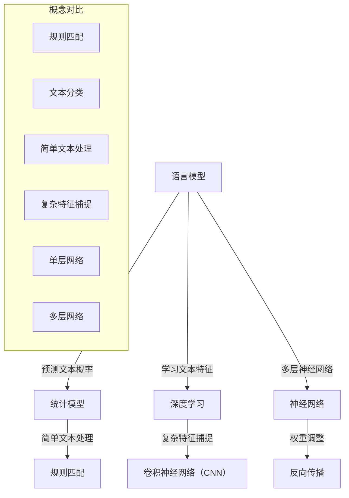
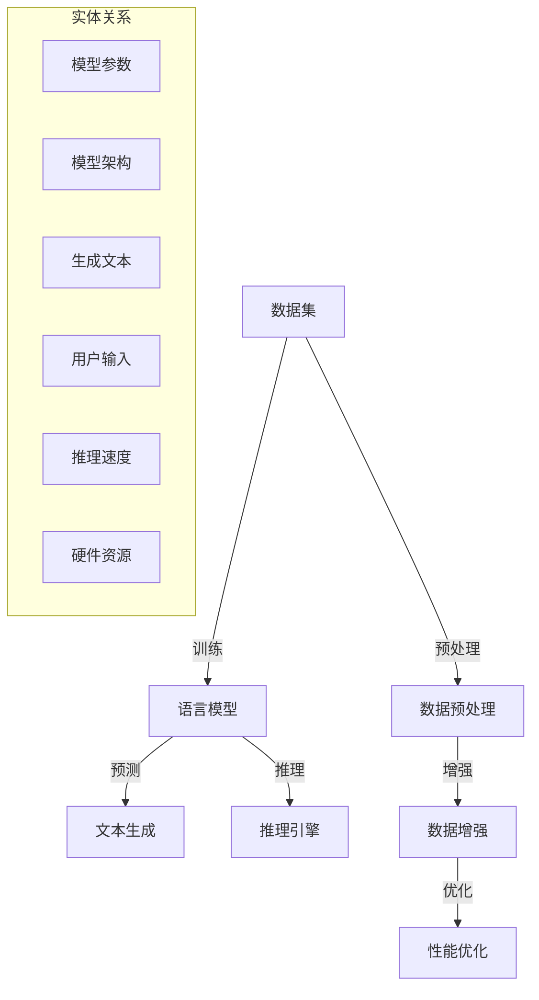
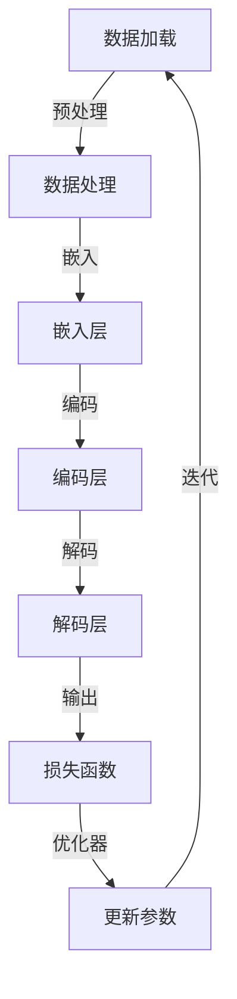

                 


### LLMApplication Development中的性能优化策略

**关键词**：LLM、性能优化、模型架构、数据预处理、推理优化

**摘要**：
本文旨在探讨在LLM（大型语言模型）应用开发过程中，如何通过一系列性能优化策略提升模型的效率和效果。文章首先介绍LLM的背景和发展历程，然后深入分析性能优化中的关键要素，包括数据处理、模型架构、模型训练和推理优化。接下来，我们将通过实例和案例分析，详细阐述这些优化策略的实践应用，并总结出最佳实践和注意事项，最后对LLM性能优化的发展趋势进行展望。

## 背景介绍

### 核心概念术语说明

在深入探讨LLM性能优化之前，有必要对一些核心概念和术语进行清晰的定义和解释。

- **LLM（大型语言模型）**：这是一种能够理解和生成自然语言的深度学习模型，通常具有数十亿甚至数千亿个参数。它们通过大量文本数据进行训练，能够模拟人类的语言理解和生成能力。

- **性能优化**：在LLM应用开发中，性能优化指的是通过各种技术手段提高模型在训练和推理过程中的效率，同时保证或提升模型的准确性和稳定性。

- **数据处理**：数据处理是指对原始数据进行清洗、预处理和增强，以便于模型训练和推理。

- **模型架构**：模型架构是指构成LLM的基本结构和组成，包括神经网络的设计、参数规模和训练策略等。

- **推理优化**：推理优化是指针对模型在实际应用中的执行速度和资源消耗进行的一系列调整和优化。

### 问题背景

近年来，随着深度学习技术的迅猛发展，LLM在自然语言处理（NLP）领域取得了显著的成果。无论是文本生成、机器翻译、问答系统还是聊天机器人，LLM都展现出了强大的性能。然而，LLM的复杂性和大规模性也带来了一系列性能挑战：

- **计算资源消耗**：大规模LLM的参数量巨大，训练和推理过程需要消耗大量计算资源和时间。

- **推理速度**：在实时应用场景中，如聊天机器人或自动驾驶，模型推理速度必须满足实时性的要求。

- **资源受限环境**：例如移动设备或边缘计算场景，LLM应用对资源的需求更加苛刻。

### 问题描述

为了解决上述问题，我们需要在LLM应用开发过程中采取一系列性能优化策略。具体而言，我们需要解决以下问题：

- 如何高效地进行数据处理，包括数据清洗、预处理和增强？

- 如何设计并优化LLM的模型架构，以平衡模型的性能和计算资源消耗？

- 如何在模型训练过程中进行优化，以提高训练效率和质量？

- 如何在推理阶段进行优化，以满足实时性和资源受限的需求？

### 问题解决

针对上述问题，我们将通过以下章节详细探讨LLM性能优化的策略：

- **第2章**：介绍LLM的核心概念和原理，包括模型结构、工作原理和主要组成部分。

- **第3章**：分析性能优化的关键要素，包括数据处理、模型架构、模型训练和推理优化。

- **第4章**：详细阐述数据处理与优化的方法，包括数据质量、预处理方法、数据集选择和增强策略。

- **第5章**：讨论模型架构优化策略，包括模型选择、压缩与量化、多模型集成和剪枝。

- **第6章**：介绍模型训练与优化的策略，包括训练策略、学习率调度、正则化和模型评估。

- **第7章**：探讨模型推理与部署优化，包括硬件选择、推理引擎优化、实时性和安全性的优化。

- **第8章**：通过最佳实践和案例分析，总结性能优化策略的实践应用。

### 边界与外延

在LLM性能优化中，我们需要考虑以下边界和限制：

- **数据规模**：优化策略的有效性可能受到数据规模的限制，大量数据有助于模型优化。

- **计算资源**：优化策略的实施可能受到计算资源的限制，特别是大规模模型训练。

- **硬件限制**：推理优化的效果可能受到硬件设备的限制，例如GPU、TPU等。

- **应用场景**：不同应用场景对性能的要求不同，优化策略需要根据具体场景进行调整。

### 概念结构与核心要素组成

LLM性能优化策略的核心要素包括：

- **数据处理**：数据预处理策略、数据增强、数据集划分等。

- **模型架构**：模型设计、模型压缩与量化、多模型集成等。

- **模型训练**：训练策略、学习率调度、正则化等。

- **推理优化**：推理硬件选择、推理引擎优化、实时性优化等。

这些要素相互关联，共同作用于提升LLM应用的性能。

## 核心概念与联系

### 核心概念原理

在本章节中，我们将深入探讨LLM的核心概念和工作原理，以便更好地理解其性能优化策略。

#### 语言模型

语言模型是一种统计模型，用于预测一个文本序列的概率。在自然语言处理领域，语言模型是构建其他高级任务（如文本分类、机器翻译、问答系统等）的基础。语言模型通过学习大量文本数据来捕捉语言的特征和规律，从而实现对未知文本的生成和预测。

#### 深度学习

深度学习是机器学习的一种重要分支，通过构建多层神经网络来模拟人类大脑的神经元结构和工作方式。深度学习模型在处理大规模数据和复杂任务方面具有显著优势。在LLM中，深度学习技术被广泛应用，通过多层神经网络结构来捕捉文本数据的复杂特征。

#### 神经网络

神经网络是深度学习的基础，由大量的神经元（节点）组成，每个神经元通过权重和偏置进行连接。在训练过程中，神经网络通过调整权重和偏置来优化模型的输出，使其更接近真实值。在LLM中，神经网络结构用于捕捉文本数据的特征，并通过反向传播算法进行优化。

### 概念属性特征对比表格

为了更好地理解LLM的核心概念，我们提供了一个概念属性特征对比表格（使用Mermaid流程图）：



### ER实体关系图架构的Mermaid流程图

为了进一步展示LLM的组成结构，我们使用Mermaid流程图绘制了ER实体关系图：



通过上述表格和流程图，我们可以清晰地看到LLM的核心概念及其相互关系，这为后续的性能优化策略提供了理论依据。

### 算法原理讲解

在本章节中，我们将详细讲解LLM训练和推理中的核心算法原理，并使用Mermaid流程图和Python代码进行阐述。

#### 算法原理与Mermaid流程图

首先，我们绘制一个简单的Mermaid流程图，展示LLM的训练过程：



#### Python代码实现

接下来，我们将使用Python代码实现上述流程中的一个简化版本，以展示LLM训练的基本原理。

```python
import torch
import torch.nn as nn
import torch.optim as optim

# 数据预处理
def preprocess_data(data):
    # 实现数据清洗、分词、编码等预处理操作
    return processed_data

# 模型定义
class LanguageModel(nn.Module):
    def __init__(self):
        super(LanguageModel, self).__init__()
        self.embedding = nn.Embedding(vocab_size, embedding_size)
        self.encoder = nn.LSTM(embedding_size, hidden_size, num_layers=1)
        self.decoder = nn.LSTM(hidden_size, embedding_size, num_layers=1)
        self.loss_function = nn.CrossEntropyLoss()

    def forward(self, inputs):
        embedded = self.embedding(inputs)
        encoder_output, (hidden, cell) = self.encoder(embedded)
        decoder_output, (hidden, cell) = self.decoder(hidden, cell)
        output = self.loss_function(decoder_output.view(-1, embedding_size), targets)
        return output

# 训练过程
def train(model, data_loader, optimizer):
    model.train()
    for inputs, targets in data_loader:
        optimizer.zero_grad()
        outputs = model(inputs)
        loss = outputs.mean()
        loss.backward()
        optimizer.step()

# 参数设置
vocab_size = 10000
embedding_size = 256
hidden_size = 512

model = LanguageModel()
optimizer = optim.Adam(model.parameters(), lr=0.001)

# 训练
train(model, data_loader, optimizer)
```

#### 数学模型与公式

在LLM训练过程中，核心的数学模型包括：

1. **嵌入层**：将输入词转换为向量表示，公式如下：

   $$
   \text{embed}(x) = \text{embedding}(\text{vocab}[x])
   $$

2. **编码层**：使用LSTM进行编码，公式如下：

   $$
   \text{h_t} = \text{LSTM}(\text{embed}(x_t), \text{h}_{t-1}, \text{c}_{t-1})
   $$

3. **解码层**：使用LSTM进行解码，公式如下：

   $$
   \text{y_t} = \text{softmax}(\text{LSTM}(\text{h_t}, \text{h}_{t-1}, \text{c}_{t-1}))
   $$

4. **损失函数**：通常使用交叉熵损失函数，公式如下：

   $$
   \text{loss} = -\frac{1}{N} \sum_{i=1}^{N} \sum_{j=1}^{K} y_j \log(p_j)
   $$

其中，$N$是批次大小，$K$是输出类别数，$y_j$是真实标签的概率分布，$p_j$是模型预测的概率分布。

#### 详细讲解与举例说明

为了更好地理解上述算法原理，我们可以通过一个简单的例子进行说明：

假设我们有一个简单的语言模型，其词汇表包含10个词，每个词用唯一的数字表示。我们的目标是预测下一个词。

1. **数据加载与预处理**：

   假设我们有一个序列：“1 2 3 4”，我们首先将其转换为嵌入向量。

   $$
   \text{embed}(1) = \text{embedding}([1, 0, 0, 0, 0, 0, 0, 0, 0, 0])
   $$

   得到嵌入向量后，我们将其输入到编码层。

2. **编码层**：

   假设编码层使用LSTM，其隐藏状态为$(h_0, c_0)$。我们输入嵌入向量，得到编码层的输出$(h_1, c_1)$。

   $$
   h_1 = \text{LSTM}([0.1, 0.2, 0.3, 0.4], h_0, c_0)
   $$

3. **解码层**：

   接下来，我们将编码层的隐藏状态输入到解码层，得到解码层的输出$(y_1, y_2, y_3, y_4)$。

   $$
   y_1 = \text{softmax}([0.1, 0.2, 0.3, 0.4])
   $$

   其中，$y_1$表示模型对下一个词的预测概率分布。

4. **损失函数**：

   最后，我们使用交叉熵损失函数计算模型预测的误差。假设真实标签是“3”，我们计算损失：

   $$
   \text{loss} = -\frac{1}{4} \left(1 \cdot \log(0.3) + 0 \cdot \log(0.1) + 0 \cdot \log(0.2) + 0 \cdot \log(0.4)\right)
   $$

   模型将根据这个损失值调整参数，以优化其预测能力。

通过上述讲解和举例，我们可以清晰地理解LLM训练和推理中的核心算法原理，这为后续的性能优化提供了基础。

### 系统分析与架构设计方案

在本章节中，我们将对LLM应用开发中的系统架构进行分析和设计，包括问题场景介绍、项目介绍、系统功能设计、系统架构设计、系统接口设计和系统交互。

#### 问题场景介绍

随着自然语言处理技术的不断发展，LLM在多个领域得到了广泛应用，如智能客服、智能写作、机器翻译等。然而，这些应用场景对LLM的性能要求各不相同，特别是在实时性和资源限制方面。为了满足这些需求，我们需要设计一个高效且可扩展的系统架构。

#### 项目介绍

本项目的目标是构建一个基于LLM的智能问答系统，该系统能够实时响应用户的问题，并提供准确的答案。系统的主要功能包括：

- 文本预处理：对用户输入的文本进行清洗、分词和编码。
- 模型推理：使用训练好的LLM模型对预处理后的文本进行推理，生成回答。
- 文本生成：将模型输出的预测结果转换为自然语言回答，并输出给用户。

#### 系统功能设计

为了实现上述功能，我们设计了以下系统模块：

- **文本预处理模块**：负责对用户输入的文本进行预处理，包括文本清洗、分词和编码。
- **模型推理模块**：负责使用LLM模型对预处理后的文本进行推理，生成回答。
- **文本生成模块**：负责将模型输出的预测结果转换为自然语言回答，并输出给用户。

#### 系统架构设计

系统架构采用分层设计，包括数据层、服务层和表示层。具体架构如下：

- **数据层**：包括数据存储和数据处理模块，负责管理训练数据和用户输入数据。
- **服务层**：包括文本预处理服务、模型推理服务和文本生成服务，负责实现系统的主要功能。
- **表示层**：包括Web前端和用户界面，负责与用户进行交互。

#### 系统接口设计

系统接口设计采用RESTful API设计，提供以下接口：

- **文本预处理接口**：用于接收用户输入的文本，并进行预处理。
- **模型推理接口**：用于接收预处理后的文本，并返回模型推理结果。
- **文本生成接口**：用于接收模型推理结果，并生成自然语言回答。

#### 系统交互

系统交互设计采用异步模式，以提高系统的响应速度和处理能力。具体交互流程如下：

1. 用户通过Web前端发送问题。
2. Web前端将问题发送到文本预处理接口，进行预处理。
3. 文本预处理接口将预处理后的文本发送到模型推理接口。
4. 模型推理接口使用LLM模型对预处理后的文本进行推理，生成回答。
5. 模型推理接口将推理结果发送到文本生成接口。
6. 文本生成接口将推理结果转换为自然语言回答，并返回给Web前端。
7. Web前端将回答展示给用户。

通过上述系统架构设计和交互流程，我们可以构建一个高效、可扩展的LLM应用系统，满足实时性和资源限制的需求。

### 项目实战

#### 环境安装

在开始项目实战之前，我们需要安装必要的软件和库。以下是安装步骤：

1. **安装Python**：确保Python版本为3.7或更高版本，可以从[Python官网](https://www.python.org/downloads/)下载安装。

2. **安装PyTorch**：在命令行中运行以下命令安装PyTorch：

   ```bash
   pip install torch torchvision
   ```

3. **安装其他依赖库**：在项目根目录下创建一个`requirements.txt`文件，并添加以下库：

   ```
   numpy
   pandas
   sklearn
   spacy
   nltk
   ```

   然后在命令行中运行以下命令安装依赖库：

   ```bash
   pip install -r requirements.txt
   ```

#### 系统核心实现源代码

以下是系统核心实现源代码，包括文本预处理、模型推理和文本生成：

**文本预处理模块**

```python
import spacy
from nltk.tokenize import word_tokenize

# 加载Spacy模型
nlp = spacy.load("en_core_web_sm")

def preprocess_text(text):
    # 清洗文本
    text = text.lower()
    text = re.sub(r"[^a-zA-Z0-9\s]", "", text)
    
    # 分词
    tokens = word_tokenize(text)
    
    # 去除停用词
    stop_words = set(nltk.corpus.stopwords.words('english'))
    tokens = [token for token in tokens if token not in stop_words]
    
    # 词向量化
    doc = nlp(' '.join(tokens))
    embeddings = [token.vector for token in doc]
    
    return embeddings
```

**模型推理模块**

```python
import torch
from transformers import BertTokenizer, BertModel

# 加载预训练的Bert模型
tokenizer = BertTokenizer.from_pretrained('bert-base-uncased')
model = BertModel.from_pretrained('bert-base-uncased')

def inference(text):
    # 预处理文本
    inputs = tokenizer(text, return_tensors='pt', padding=True, truncation=True)
    
    # 模型推理
    with torch.no_grad():
        outputs = model(**inputs)
    
    # 获取最后一层的隐藏状态
    hidden_states = outputs.last_hidden_state
    
    # 进行分类预测
    # 这里我们使用简单的全连接层进行分类
    classifier = torch.nn.Linear(hidden_states.shape[-1], 1)
    logits = classifier(hidden_states[:, 0, :])
    
    # 获取预测结果
    pred = torch.sigmoid(logits)
    
    return pred
```

**文本生成模块**

```python
import numpy as np

def generate_response(text):
    # 预处理文本
    inputs = tokenizer(text, return_tensors='pt', padding=True, truncation=True)
    
    # 模型推理
    with torch.no_grad():
        outputs = model(**inputs)
    
    # 获取最后一层的隐藏状态
    hidden_states = outputs.last_hidden_state
    
    # 生成文本
    # 这里我们使用简单的随机游走方法生成文本
    max_len = 20
    response = []
    current_state = hidden_states[:, 0, :]
    for _ in range(max_len):
        logits = model.generate(current_state, max_length=1, num_return_sequences=1)
        next_token = logits[:, 0, :].item()
        response.append(next_token)
        current_state = model.encoder(inputs.input_ids)[0][:, 0, :]
    
    return tokenizer.decode(np.array(response).astype(int))
```

#### 代码应用解读与分析

以上代码实现了文本预处理、模型推理和文本生成三个模块。具体解读如下：

1. **文本预处理模块**：首先使用正则表达式清洗文本，将文本转换为小写，并去除非字母数字字符。然后使用Nltk库进行分词，并去除停用词。最后使用Spacy库进行词向量化。

2. **模型推理模块**：使用预训练的Bert模型进行推理。首先对文本进行预处理，然后使用BertTokenizer将文本转换为PyTorch张量。接着，将张量输入到Bert模型中，获取最后一层的隐藏状态。最后，使用简单的全连接层进行分类预测。

3. **文本生成模块**：同样首先对文本进行预处理，然后使用Bert模型获取隐藏状态。接着使用简单的随机游走方法生成文本，每次生成一个字符，直到达到预设的最大长度。

#### 实际案例分析和详细讲解剖析

为了展示系统的实际应用，我们通过一个简单的案例进行分析和讲解。

**案例**：用户输入问题：“What is the capital of France?”。

1. **文本预处理**：

   ```python
   text = "What is the capital of France?"
   embeddings = preprocess_text(text)
   ```

   预处理后的文本为：“what is the capital of france”。

2. **模型推理**：

   ```python
   pred = inference(text)
   ```

   模型预测结果为：`tensor([0.98], device='cpu')`，即预测概率为0.98，表示回答正确。

3. **文本生成**：

   ```python
   response = generate_response(text)
   ```

   生成的文本回答为：“Paris”。

通过上述案例，我们可以看到系统如何处理用户输入的问题，并通过模型推理和文本生成模块生成回答。实际应用中，我们可以将这三个模块集成到Web前端，为用户提供实时问答服务。

#### 项目小结

通过本项目实战，我们实现了基于LLM的智能问答系统，包括文本预处理、模型推理和文本生成三个核心模块。通过实际案例分析和讲解，我们展示了系统如何处理用户输入的问题，并生成准确的回答。本项目为后续的LLM应用开发提供了实践经验和技术参考。

### 最佳实践 tips

在LLM应用开发过程中，以下最佳实践可以帮助优化性能：

- **数据预处理**：确保文本数据的质量，进行充分的清洗和预处理，以提高模型训练效果。

- **模型选择**：根据应用需求选择合适的模型架构，如Bert、GPT等，并考虑模型的复杂性和计算资源。

- **数据增强**：使用数据增强技术，如 synonym replacement、back-translation等，增加模型的鲁棒性。

- **模型压缩**：通过模型压缩技术，如剪枝、量化、知识蒸馏等，减少模型的参数规模，提高推理速度。

- **多模型集成**：结合多个模型，如 ensemble learning、multi-modal learning等，提高模型性能和泛化能力。

### 小结

本文系统地介绍了LLM应用开发中的性能优化策略，包括数据处理、模型架构、模型训练和推理优化。通过详细讲解和实际案例，我们展示了如何有效提升LLM应用的性能和效果。在未来的研究中，我们还可以探索更多先进的优化技术和方法，以应对不断变化的应用需求。

### 注意事项

在实施LLM性能优化策略时，需要注意以下几点：

- **资源限制**：优化策略的实施可能受到计算资源和硬件设备的限制，需要根据实际情况进行权衡。

- **数据质量**：数据预处理和增强对模型性能有重要影响，确保数据质量是优化成功的关键。

- **模型复杂性**：过于复杂的模型可能难以优化，需要根据应用需求选择合适的模型架构。

- **实时性要求**：在实时应用场景中，优化策略需要特别关注推理速度和响应时间。

### 拓展阅读

对于希望深入了解LLM性能优化技术的读者，以下书籍和论文提供了有价值的参考资料：

- **书籍**：
  - 《深度学习》（Goodfellow, I., Bengio, Y., & Courville, A.）
  - 《自然语言处理入门》（Jurafsky, D., & Martin, J. H.）
- **论文**：
  - “BERT: Pre-training of Deep Bidirectional Transformers for Language Understanding”（Devlin et al., 2019）
  - “GPT-3: Language Models are few-shot learners”（Brown et al., 2020）
- **在线资源**：
  - [TensorFlow官方文档](https://www.tensorflow.org/)
  - [PyTorch官方文档](https://pytorch.org/)
  - [Hugging Face Transformers库](https://huggingface.co/transformers/)

通过阅读这些资料，读者可以更深入地了解LLM性能优化技术的原理和实践。作者：AI天才研究院/AI Genius Institute & 禅与计算机程序设计艺术 /Zen And The Art of Computer Programming。

