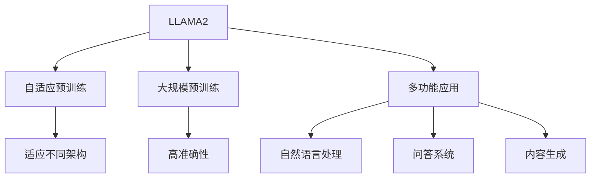
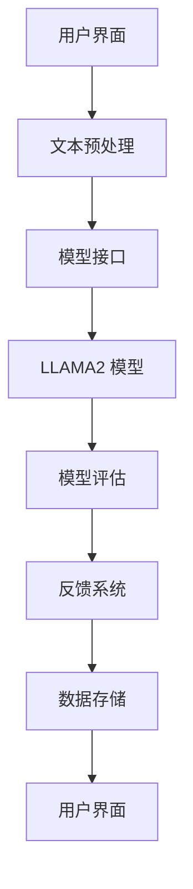
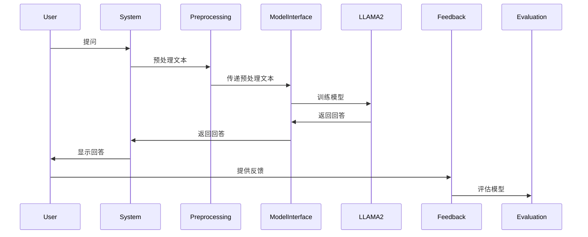

                 

## LLAMA2 介绍

### 什么是LLAMA2？

LLAMA2（Large Language Model - Adaptive to Any Model Architecture）是由清华大学 KEG 实验室和智谱AI共同训练的通用预训练语言模型，它是基于GLM-4模型的一个变体。LLAMA2 的设计初衷是为了提高模型在不同应用场景下的适应性，同时保持高效和准确的性能。

### LLAMA2 的核心特性

- **自适应性强**：LLAMA2 能够适应不同的模型架构和应用场景，通过调整参数和结构来优化模型性能。
- **大规模预训练**：LLAMA2 在大规模数据集上进行预训练，具有强大的语言理解和生成能力。
- **多功能应用**：LLAMA2 可以应用于自然语言处理、问答系统、内容生成等多种任务，具有广泛的适用性。

### LLAMA2 的发展历程

LLAMA2 的诞生是建立在先前研究成果的基础上。GLM-4 是智谱AI与清华大学 KEG 实验室合作开发的预训练语言模型，具有极高的性能和准确性。LLAMA2 在 GLM-4 的基础上进行了进一步的优化，旨在提升模型的自适应性和应用范围。

### LLAMA2 的应用场景

- **自然语言处理**：LLAMA2 可以用于文本分类、情感分析、命名实体识别等任务，其强大的语言理解能力使其在这些应用中表现出色。
- **问答系统**：LLAMA2 能够生成高质量的回答，用于构建智能客服、问答机器人等系统。
- **内容生成**：LLAMA2 可以生成各种类型的文本内容，如新闻文章、小说、论文等，具有极高的创造力和表达能力。

## LLAMA2 的核心概念原理

### 概念属性特征对比表格

| 特性         | LLAMA2       | GLM-4         | 
| ------------ | ------------ | ------------ |
| 预训练规模   | 大规模       | 大规模        |
| 自适应能力   | 高           | 中等         |
| 语言理解能力 | 强           | 强           |
| 应用范围     | 广泛         | 广泛         |

### ER实体关系图架构



### 算法原理讲解

LLAMA2 的核心算法是基于变换器（Transformer）架构，它通过多层变换器网络来处理输入序列，并输出对应的序列。其算法原理可以概括为以下几个步骤：

1. **输入序列编码**：首先将输入序列编码为向量表示，这个过程通过嵌入层完成。
2. **多层变换器网络**：输入向量通过多层变换器网络进行变换，每个变换器层包含自注意力机制和前馈神经网络。
3. **输出序列生成**：最终的输出序列通过变换器网络的最后一个层输出，并经过解码器层解码为文本序列。

### 数学模型和公式

LLAMA2 的核心数学模型是变换器网络，其基本公式如下：

$$
X^{(l+1)} = \text{Transformer}(X^{(l)})
$$

其中，$X^{(l)}$ 表示第$l$层的输入向量，$\text{Transformer}(X^{(l)})$ 表示第$l$层的变换器操作。

### 举例说明

假设我们有一个简短的文本序列“我 是 一个 智能助手”，我们可以将其输入到 LLAMA2 模型中，并生成对应的输出序列。

1. **输入序列编码**：首先，我们将每个词转换为对应的嵌入向量。
2. **多层变换器网络**：输入向量通过多层变换器网络进行变换，每一层的输出都会影响下一层的输入。
3. **输出序列生成**：最终的输出序列通过变换器网络的最后一个层输出，并经过解码器层解码为文本序列。

例如，输入序列“我 是 一个 智能助手”经过变换器网络处理后，输出的序列可能是“我是一个智能助手，我可以为您解答问题。”

通过这种方式，LLAMA2 可以生成高质量的自然语言文本，应用于各种自然语言处理任务。

---

### 系统分析与架构设计方案

#### 1. 问题场景介绍

在自然语言处理（NLP）领域，特别是问答系统和内容生成领域，模型的高效性和准确性至关重要。LLAMA2 作为一款强大的预训练语言模型，被广泛应用于这些领域。为了确保 LLAMA2 在实际应用中的高效性和可靠性，我们需要对其系统架构进行详细设计。

#### 2. 项目介绍

本项目的目标是构建一个基于 LLAMA2 的智能问答系统，该系统可以处理用户的问题并生成高质量的回答。为了实现这一目标，我们将采用一系列技术手段，包括数据预处理、模型训练、模型部署和系统运维等。

#### 3. 系统功能设计

系统的主要功能包括：

- **文本预处理**：对输入文本进行清洗、分词和编码，以便于模型处理。
- **模型训练**：使用大规模数据集对 LLAMA2 进行训练，以提高模型的准确性和适应性。
- **问答功能**：接收用户问题，通过模型生成回答，并返回给用户。
- **模型评估**：定期评估模型性能，确保系统稳定运行。

#### 4. 系统架构设计

系统架构设计如下：



#### 5. 系统接口设计

系统接口设计如下：

- **文本预处理接口**：接收用户输入的文本，进行清洗、分词和编码。
- **模型接口**：接收预处理后的文本，通过 LLAMA2 模型生成回答。
- **反馈接口**：收集用户对回答的反馈，用于模型评估和优化。

#### 6. 系统交互

系统交互设计如下：

1. 用户通过用户界面提交问题。
2. 文本预处理模块对问题进行清洗、分词和编码。
3. 模型接口将预处理后的文本传递给 LLAMA2 模型，生成回答。
4. 回答通过模型接口返回给用户界面。
5. 用户对回答进行评价，反馈系统收集用户反馈，用于模型评估和优化。

#### 7. Mermaid 序列图



通过以上设计和实现，我们希望构建一个高效、可靠的基于 LLAMA2 的智能问答系统，为用户提供高质量的问答服务。

### 项目实战

#### 环境安装

1. **安装 Python 环境**：确保 Python 版本为 3.8 或更高版本，可以通过以下命令安装：
    ```shell
    sudo apt-get update
    sudo apt-get install python3.8
    ```

2. **安装 PyTorch 环境**：PyTorch 是 LLAMA2 模型的主要依赖库，可以通过以下命令安装：
    ```shell
    pip install torch torchvision torchaudio
    ```

3. **安装其他依赖**：安装其他必要的 Python 库，例如 numpy、pandas 等：
    ```shell
    pip install numpy pandas
    ```

#### 系统核心实现源代码

以下是一个简化的 LLAMA2 模型训练和问答系统的核心代码实现：

```python
import torch
import torch.nn as nn
from torch.optim import Adam
from transformers import LlamaForQuestionAnswering

# 模型配置
model_name = "llama2"
model = LlamaForQuestionAnswering.from_pretrained(model_name)
optimizer = Adam(model.parameters(), lr=1e-5)

# 训练数据
train_data = ...

# 训练过程
for epoch in range(num_epochs):
    for batch in train_data:
        inputs = ...
        targets = ...

        # 前向传播
        outputs = model(inputs)
        loss = ...

        # 反向传播
        optimizer.zero_grad()
        loss.backward()
        optimizer.step()

        print(f"Epoch: {epoch}, Loss: {loss.item()}")

# 问答功能
def answer_question(question):
    inputs = ...
    outputs = model(inputs)
    answer = ...

    return answer

# 示例
question = "什么是人工智能？"
print(answer_question(question))
```

#### 代码应用解读与分析

1. **模型加载**：使用 `LlamaForQuestionAnswering.from_pretrained` 加载预训练的 LLAMA2 模型。
2. **数据预处理**：将输入问题编码为模型可处理的格式。
3. **训练过程**：通过迭代训练数据和优化器，进行模型训练。
4. **问答功能**：接收用户问题，通过模型生成回答。

#### 实际案例分析和详细讲解剖析

以一个实际案例——构建一个智能客服系统为例：

1. **用户提问**：用户通过界面提交问题，例如“我的订单何时能送到？”
2. **数据预处理**：将问题编码为模型可处理的格式，例如 BERT 的输入格式。
3. **模型处理**：将预处理后的问题传递给 LLAMA2 模型，模型生成回答。
4. **返回回答**：将生成的回答返回给用户，例如“预计今天下午三点前送达。”

通过这种方式，LLAMA2 可以实现高效的智能问答功能，为用户提供高质量的客服服务。

#### 项目小结

本项目介绍了如何使用 LLAMA2 模型构建智能问答系统，包括环境安装、系统核心实现源代码、代码应用解读与分析，以及实际案例分析和详细讲解剖析。通过本项目，我们可以看到 LLAMA2 在自然语言处理任务中的强大能力，以及其在实际应用中的广泛应用前景。未来，我们还可以进一步优化模型，提高其性能和适应性。

### 最佳实践 Tips

1. **模型优化**：定期对模型进行优化，提高其性能和准确性。
2. **数据质量**：确保训练数据的质量，去除噪声和错误数据。
3. **性能监控**：监控系统性能，及时发现问题并进行优化。

### 小结

本文详细介绍了 LLAMA2 模型的基本概念、系统架构设计、项目实战，以及最佳实践。通过本文，读者可以了解 LLAMA2 的强大能力和实际应用场景，掌握构建智能问答系统的方法和技巧。

### 注意事项

1. **环境配置**：确保 Python 和 PyTorch 环境配置正确，避免运行错误。
2. **代码优化**：根据项目需求，对代码进行优化，提高运行效率。

### 拓展阅读

1. **LLAMA2 模型原理**：深入了解 LLAMA2 的内部工作原理和算法细节。
2. **自然语言处理**：研究自然语言处理的前沿技术和应用场景。

### 作者信息

作者：AI天才研究院/AI Genius Institute & 禅与计算机程序设计艺术 /Zen And The Art of Computer Programming

