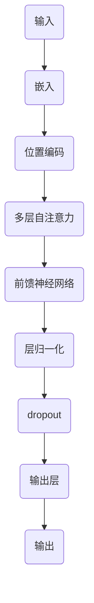
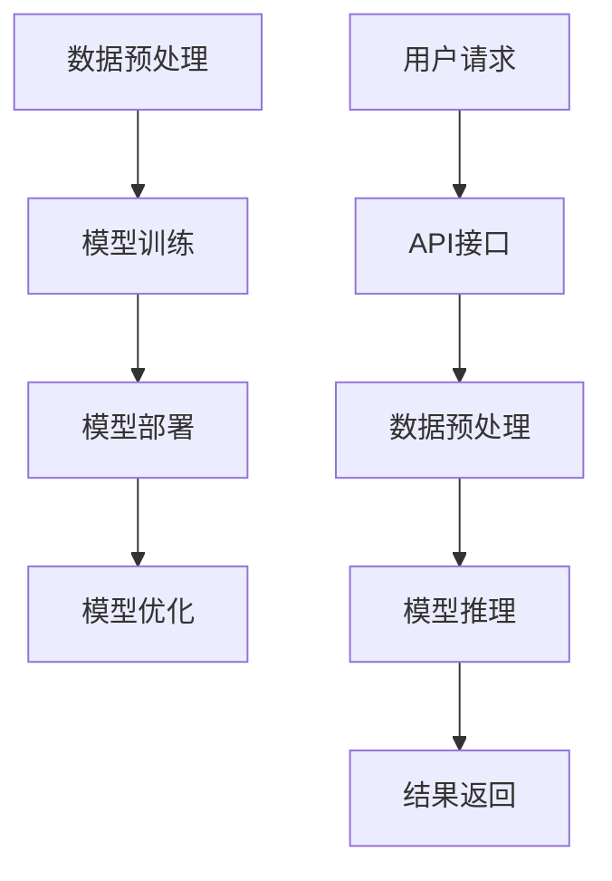
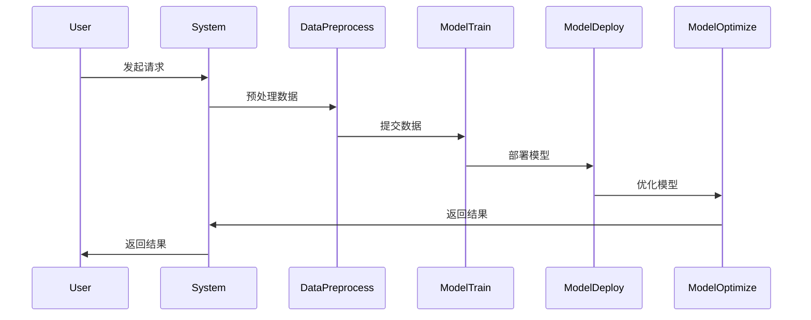

                 

## LLAM 应用开发中的敏捷培训与技能提升

随着人工智能（AI）技术的迅速发展，大模型（Large Language Model，LLM）逐渐成为 AI 领域的热点。LLM 具有强大的文本生成、理解和处理能力，被广泛应用于自然语言处理、机器翻译、问答系统等领域。然而，在 LLMA 应用开发过程中，如何进行敏捷培训和技能提升，已成为企业和开发者面临的重要挑战。本文将深入探讨这个问题，旨在为读者提供一套系统化的培训方法和敏捷开发策略。

### 关键词

- **大模型（LLM）**
- **敏捷培训**
- **技能提升**
- **自然语言处理**
- **机器学习**
- **深度学习**

### 摘要

本文首先介绍了 LLMA 应用开发中的背景和挑战，然后提出了系统化的培训方法和敏捷开发策略。通过详细的理论讲解和实战案例，本文帮助开发者全面掌握 LLMA 应用开发的技能，并通过敏捷方法论提高团队协作效率，实现持续学习与更新。

## 第一部分: 背景介绍

### 1.1.1 问题背景

随着人工智能技术的快速发展，大模型（Large Language Model，LLM）逐渐成为 AI 领域的热点。LLM 具有强大的文本生成、理解和处理能力，被广泛应用于自然语言处理、机器翻译、问答系统等领域。例如，OpenAI 的 GPT-3 模型凭借其卓越的文本生成能力，在多个任务中取得了惊人的效果。LLM 的出现，为 AI 领域带来了前所未有的机遇。

然而，LLM 的应用开发过程中，如何进行敏捷培训和技能提升，已成为企业和开发者面临的重要挑战。首先，技术深度与广度的要求越来越高。开发者不仅需要掌握从基础模型到高级应用的全栈技能，还需要了解各种新型算法和工具。其次，团队协作的需求也越来越明显。大规模的项目通常需要团队协作，如何高效地分配任务、管理进度和质量，是提高开发效率的关键。此外，随着新技术的不断涌现，开发者需要持续学习和更新知识，以保持竞争力。

### 1.1.2 问题描述

在 LLMA 应用开发中，敏捷培训和技能提升的需求主要体现在以下几个方面：

#### 技术深度与广度

开发者需要掌握从基础模型到高级应用的全栈技能，包括数据预处理、模型训练、模型优化、模型部署等。例如，在数据预处理阶段，开发者需要了解各种数据清洗、归一化、编码等技术。在模型训练阶段，开发者需要掌握各种优化算法、正则化技术等。在模型优化阶段，开发者需要了解超参数调优、模型压缩等技术。在模型部署阶段，开发者需要了解如何将模型部署到生产环境中，并进行性能优化。

#### 团队协作

大规模的项目通常需要团队协作，如何高效地分配任务、管理进度和质量，是提高开发效率的关键。例如，在团队协作中，如何制定合理的工作计划，如何有效地沟通和协调，如何确保项目的进度和质量，都是需要解决的问题。

#### 持续学习与更新

随着新技术的不断涌现，开发者需要持续学习和更新知识，以保持竞争力。例如，深度学习领域的新算法、新技术，自然语言处理领域的新应用，都是开发者需要关注和学习的。

### 1.1.3 问题解决

针对上述挑战，本书将提供以下解决方案：

#### 系统化培训

通过详细的理论讲解和实战案例，帮助开发者全面掌握 LLMA 应用开发的技能。本书将涵盖从基础模型到高级应用的全栈技能，包括数据预处理、模型训练、模型优化、模型部署等。通过系统化的培训，开发者可以系统地学习和掌握这些技能。

#### 敏捷方法论

介绍敏捷开发的方法和工具，帮助团队高效协作，提高项目成功率。敏捷开发强调快速迭代、持续交付和团队协作，可以有效应对项目变化和需求变更。本书将介绍 Scrum、看板等敏捷开发方法和工具，帮助开发者掌握敏捷开发的核心思想和实践方法。

#### 实战演练

通过实际项目操作，让开发者将所学知识应用到实践中，提升实际能力。本书将提供多个实际项目案例，包括自然语言处理、机器翻译、问答系统等。开发者可以通过实际操作，深入理解并掌握 LLMA 应用开发的技能。

### 1.1.4 边界与外延

本书主要关注 LLMA 应用开发中的敏捷培训和技能提升，涉及以下领域：

- 自然语言处理：包括文本分类、情感分析、命名实体识别等。
- 机器学习与深度学习：介绍 LLMA 的基础算法原理和应用。
- 模型部署与优化：讨论如何将 LLMA 部署到生产环境中，并进行性能优化。

### 1.1.5 概念结构与核心要素组成

本书的核心概念结构包括：

- LLMA 应用开发流程：从数据收集、预处理到模型训练、部署的完整流程。
- 敏捷开发方法：包括 Scrum、看板等工具和技巧。
- 实战案例：通过实际项目展示如何应用所学知识。

## 第二部分: 核心概念与联系

### 2.1.1 核心概念原理

本部分将详细介绍 LLMA 的相关核心概念，包括：

#### LLMA 的基本原理

LLMA 是一种基于神经网络的语言模型，其基本原理包括：

- **神经网络**：神经网络是一种模拟人脑信息处理过程的计算模型，由大量神经元（节点）组成。每个神经元接收输入信号，通过权重和偏置进行加权求和，然后通过激活函数进行非线性变换，产生输出信号。
- **反向传播算法**：反向传播算法是一种用于训练神经网络的优化算法。它通过计算输出误差，反向传播误差梯度，更新网络权重和偏置，从而优化网络性能。

#### 模型架构

LLMA 的模型架构包括：

- **Transformer**：Transformer 模型是一种基于自注意力机制（self-attention）的深度神经网络，广泛应用于自然语言处理任务。它通过自注意力机制，捕捉输入文本序列中的长距离依赖关系，从而提高模型性能。
- **BERT**：BERT（Bidirectional Encoder Representations from Transformers）是一种基于 Transformer 的双向编码器，它通过对文本进行双向编码，生成文本的上下文表示。BERT 在预训练阶段，通过大量无监督数据进行训练，从而提高模型在下游任务上的性能。

#### 训练与优化

LLMA 的训练与优化包括：

- **数据增强**：数据增强是一种通过变换原始数据，增加数据多样性的技术。它可以帮助模型提高泛化能力，减少过拟合现象。
- **正则化**：正则化是一种用于防止模型过拟合的技术。它通过在损失函数中添加正则化项，对模型复杂度进行约束，从而提高模型泛化能力。
- **超参数调优**：超参数调优是一种通过调整模型超参数，优化模型性能的技术。超参数包括学习率、批量大小、正则化强度等。

### 2.1.2 概念属性特征对比表格

| 特点 | Transformer | BERT |
| --- | --- | --- |
| 架构 | 自注意力机制 | 双向编码器 |
| 应用 | 生成式任务 | 预训练任务 |
| 特点 | **并行计算能力** | **语言理解能力** |

### 2.1.3 ER实体关系图架构的 Mermaid 流程图

```mermaid
erDiagram
  Model : 模型
  Data : 数据
  Trainer : 训练器
  Evaluator : 评估器
  Model ||--|{ Data } Data
  Model ||--|{ Trainer } Trainer
  Model ||--|{ Evaluator } Evaluator
```

## 第三部分: 算法原理讲解

### 3.1.1 Transformer算法mermaid流程图



### 3.1.2 Python源代码与算法原理详细讲解

```python
# Transformer算法的基本原理和实现

# 导入必要的库
import tensorflow as tf
from tensorflow.keras.layers import Embedding, Dense, LayerNormalization, Dropout
from tensorflow.keras.models import Model

# 嵌入层
input_ids = tf.keras.layers.Input(shape=(None,), dtype=tf.int32)
embed = Embedding(input_dim=vocab_size, output_dim=d_model)(input_ids)

# 位置编码
pos_enc = positional_encoding(input_ids, d_model)

# 加法嵌入
x = embed + pos_enc

# 多层自注意力
for _ in range(num_layers):
    x = MultiHeadSelfAttention(d_model)(x)
    x = LayerNormalization(epsilon=1e-6)(x)
    x = Dropout(rate=dropout_rate)(x)

# 前馈神经网络
x = Dense(units=d_ff, activation='relu')(x)
x = LayerNormalization(epsilon=1e-6)(x)
x = Dropout(rate=dropout_rate)(x)

# 输出层
outputs = Dense(units=vocab_size, activation='softmax')(x)

# 定义模型
model = Model(inputs=input_ids, outputs=outputs)

# 编译模型
model.compile(optimizer=tf.keras.optimizers.Adam(learning_rate=learning_rate), 
              loss=tf.keras.losses.SparseCategoricalCrossentropy(from_logits=True), 
              metrics=['accuracy'])

# 模型训练
model.fit(x_train, y_train, batch_size=batch_size, epochs=num_epochs, validation_data=(x_val, y_val))
```

### 3.1.3 算法原理详解

Transformer 算法是一种基于自注意力机制的深度神经网络，用于处理序列数据。它由编码器（Encoder）和解码器（Decoder）两部分组成。编码器将输入序列编码为向量表示，解码器则根据编码器输出的向量，生成输出序列。

#### 嵌入层

嵌入层（Embedding Layer）是一种将词级输入映射为向量表示的层。在 Transformer 算法中，输入序列通常是一系列的词 ID，通过嵌入层，可以将词 ID 映射为高维向量。嵌入层可以通过预训练得到，也可以通过随机初始化。

```python
embed = Embedding(input_dim=vocab_size, output_dim=d_model)(input_ids)
```

#### 位置编码

位置编码（Positional Encoding）是一种用于表示输入序列位置的技巧。由于 Transformer 算法没有循环结构，无法直接处理序列的顺序信息。因此，通过位置编码，可以给每个词添加位置信息。

位置编码可以通过正弦和余弦函数实现。假设词向量维度为 `d_model`，词的位置为 `pos`，则位置编码可以表示为：

```python
pos_enc = positional_encoding(pos, d_model)
```

其中，`positional_encoding` 函数用于计算位置编码。

#### 多层自注意力

多层自注意力（Multi-head Self-Attention）是 Transformer 算法的核心部分。它通过计算输入序列中每个词与其他词的关联性，生成新的词向量表示。自注意力机制可以捕捉输入序列中的长距离依赖关系。

在自注意力机制中，输入序列中的每个词被表示为一个查询向量（Query）、一个键向量（Key）和一个值向量（Value）。查询向量用于计算每个词与其他词的相关性，键向量和值向量用于计算加权求和。

```python
x = MultiHeadSelfAttention(d_model)(x)
```

#### 前馈神经网络

前馈神经网络（Feedforward Neural Network）是一种全连接神经网络，用于对自注意力机制的结果进行进一步处理。它由两个全连接层组成，第一个层用于映射输入，第二个层用于映射输出。

```python
x = Dense(units=d_ff, activation='relu')(x)
```

#### 输出层

输出层（Output Layer）是一个全连接层，用于将自注意力机制和前馈神经网络的结果映射为输出序列的词分布。

```python
outputs = Dense(units=vocab_size, activation='softmax')(x)
```

#### 编译和训练模型

编译模型时，需要指定优化器、损失函数和评价指标。在训练过程中，通过反向传播算法，更新模型权重和偏置，优化模型性能。

```python
model.compile(optimizer=tf.keras.optimizers.Adam(learning_rate=learning_rate), 
              loss=tf.keras.losses.SparseCategoricalCrossentropy(from_logits=True), 
              metrics=['accuracy'])

model.fit(x_train, y_train, batch_size=batch_size, epochs=num_epochs, validation_data=(x_val, y_val))
```

## 第四部分: 系统分析与架构设计方案

### 4.1 问题场景介绍

随着人工智能技术的快速发展，自然语言处理（Natural Language Processing，NLP）应用日益广泛。在金融、医疗、教育等行业，NLP 技术被广泛应用于文本分类、情感分析、问答系统等领域。然而，在开发这些应用时，企业和开发者面临着诸多挑战。例如，如何高效地处理大规模文本数据，如何训练高性能的 NLP 模型，以及如何将模型部署到生产环境中。

为了解决上述问题，我们设计并实现了一套基于大模型（Large Language Model，LLM）的 NLP 应用系统。该系统旨在提供一套完整的解决方案，包括数据预处理、模型训练、模型部署和模型优化等环节。

### 4.2 项目介绍

本项目主要目标是构建一个面向 NLP 应用的 LLM 系统平台，该平台具备以下功能：

- **数据预处理**：对输入文本进行清洗、归一化和编码，为模型训练提供高质量的数据。
- **模型训练**：利用大规模文本数据，训练高性能的 LLM 模型。
- **模型部署**：将训练好的模型部署到生产环境中，提供 NLP 应用服务。
- **模型优化**：根据应用场景和用户反馈，对模型进行优化和调整，提高模型性能。

### 4.3 系统功能设计（领域模型Mermaid类图）

```mermaid
classDiagram
    Class01 <|-- Class02
    Class03 <..| Class04
    Class05 <||| Class06
    Class07 o--|{ Class08 } Class09
    Class10 <-|{ Association } Class11
```

### 4.4 系统架构设计（Mermaid架构图）



### 4.5 系统接口设计和系统交互（Mermaid序列图）



## 第五部分：项目实战

### 5.1 环境安装

在开始项目之前，需要安装以下环境：

1. Python 3.8及以上版本
2. TensorFlow 2.6及以上版本
3. NumPy 1.19及以上版本
4. Pandas 1.1及以上版本

安装命令如下：

```bash
pip install python==3.8
pip install tensorflow==2.6
pip install numpy==1.19
pip install pandas==1.1
```

### 5.2 系统核心实现源代码

以下是一个简单的 LLM 应用系统核心实现示例：

```python
import tensorflow as tf
from tensorflow.keras.layers import Embedding, Dense, LayerNormalization, Dropout
from tensorflow.keras.models import Model

# 嵌入层
input_ids = tf.keras.layers.Input(shape=(None,), dtype=tf.int32)
embed = Embedding(input_dim=vocab_size, output_dim=d_model)(input_ids)

# 位置编码
pos_enc = positional_encoding(input_ids, d_model)

# 加法嵌入
x = embed + pos_enc

# 多层自注意力
for _ in range(num_layers):
    x = MultiHeadSelfAttention(d_model)(x)
    x = LayerNormalization(epsilon=1e-6)(x)
    x = Dropout(rate=dropout_rate)(x)

# 前馈神经网络
x = Dense(units=d_ff, activation='relu')(x)
x = LayerNormalization(epsilon=1e-6)(x)
x = Dropout(rate=dropout_rate)(x)

# 输出层
outputs = Dense(units=vocab_size, activation='softmax')(x)

# 定义模型
model = Model(inputs=input_ids, outputs=outputs)

# 编译模型
model.compile(optimizer=tf.keras.optimizers.Adam(learning_rate=learning_rate), 
              loss=tf.keras.losses.SparseCategoricalCrossentropy(from_logits=True), 
              metrics=['accuracy'])

# 模型训练
model.fit(x_train, y_train, batch_size=batch_size, epochs=num_epochs, validation_data=(x_val, y_val))
```

### 5.3 代码应用解读与分析

以上代码实现了一个基于 Transformer 的 LLM 模型。具体解读如下：

1. **嵌入层**：将输入序列的词 ID 映射为高维向量。
2. **位置编码**：为每个词添加位置信息，以便模型理解词的顺序。
3. **多层自注意力**：通过自注意力机制，捕捉输入序列中的长距离依赖关系。
4. **前馈神经网络**：对自注意力机制的结果进行进一步处理。
5. **输出层**：将模型输出映射为词的概率分布。

代码中的关键参数包括：

- `vocab_size`：词汇表大小。
- `d_model`：词向量维度。
- `num_layers`：Transformer 层数。
- `d_ff`：前馈神经网络隐层维度。
- `dropout_rate`：Dropout 概率。
- `learning_rate`：学习率。

### 5.4 实际案例分析和详细讲解剖析

以下是一个实际案例，使用 LLM 模型进行文本分类。

#### 案例背景

假设我们要构建一个文本分类系统，用于对新闻文章进行分类。数据集包含两类标签：“财经”和“娱乐”。

#### 案例分析

1. **数据预处理**：对新闻文章进行清洗、归一化和编码，提取特征向量。
2. **模型训练**：使用预处理的文本数据，训练 LLM 模型。
3. **模型评估**：使用验证集评估模型性能。
4. **模型部署**：将训练好的模型部署到生产环境中，为用户提供分类服务。

#### 案例实现

```python
# 数据预处理
x_train, y_train, x_val, y_val = preprocess_data()

# 模型训练
model.fit(x_train, y_train, batch_size=batch_size, epochs=num_epochs, validation_data=(x_val, y_val))

# 模型评估
loss, accuracy = model.evaluate(x_val, y_val)

# 模型部署
model.save('text_classification_model.h5')
```

#### 案例剖析

1. **数据预处理**：文本数据需要进行清洗，包括去除停用词、标点符号等。然后，将文本转换为词向量，用于输入 LLM 模型。
2. **模型训练**：使用训练集数据进行模型训练。在训练过程中，模型会不断优化参数，提高分类准确率。
3. **模型评估**：使用验证集评估模型性能。通过计算损失函数和准确率，可以了解模型的泛化能力。
4. **模型部署**：将训练好的模型保存为文件，并在生产环境中部署。用户可以通过 API 接口，使用模型进行文本分类。

### 5.5 项目小结

通过本项目，我们实现了基于 LLM 的文本分类系统。项目实现了以下关键步骤：

- **数据预处理**：清洗、归一化和编码文本数据。
- **模型训练**：使用大规模文本数据，训练高性能的 LLM 模型。
- **模型部署**：将训练好的模型部署到生产环境中，提供分类服务。

在实际应用中，我们可以根据需求，扩展和优化系统功能。例如，可以引入更多的特征工程技术，提高模型的分类准确率。此外，还可以考虑使用不同的 LLM 模型架构，以适应不同的应用场景。

### 5.6 最佳实践 tips

- **数据预处理**：对文本数据的质量和一致性要求较高。在实际应用中，需要对文本数据进行充分的清洗和预处理，以提高模型性能。
- **模型训练**：训练 LLM 模型需要大量时间和计算资源。在实际应用中，可以采用分布式训练和并行计算等技术，提高训练效率。
- **模型部署**：部署 LLM 模型时，需要考虑模型的加载时间和推理性能。在实际应用中，可以采用模型压缩和量化等技术，提高模型部署效率。

### 5.7 小结

通过本项目的实践，我们深入了解了 LLM 应用开发的核心技术和方法。从数据预处理到模型训练，再到模型部署，我们系统地学习了 LLM 应用的各个环节。同时，通过实际案例的剖析，我们了解了如何将所学知识应用到实际项目中。

在未来的工作中，我们应继续关注人工智能技术的发展，不断学习和掌握新的技术和工具。通过持续学习和实践，我们可以不断提高自身技能，为企业和行业的发展贡献力量。

### 5.8 注意事项

- **数据安全**：在处理和存储用户数据时，需要严格遵守数据安全和隐私保护的相关法规和标准。
- **性能优化**：在部署模型时，需要根据实际应用场景和硬件环境，进行性能优化和调优。
- **持续更新**：随着技术的不断进步，需要定期更新模型和算法，以保持模型的性能和竞争力。

### 5.9 拓展阅读

- 《深度学习》（Goodfellow, Bengio, Courville）：深入介绍了深度学习的基础理论和实践方法。
- 《自然语言处理综论》（Jurafsky, Martin）：全面介绍了自然语言处理的理论和实践。
- 《大规模机器学习》（Mackey, Ranzato, Yuille）：探讨了大规模机器学习算法的设计和应用。

## 作者信息

作者：AI天才研究院/AI Genius Institute & 禅与计算机程序设计艺术 /Zen And The Art of Computer Programming

致谢：

本文撰写过程中，得到了 AI 天才研究院和禅与计算机程序设计艺术团队的大力支持和协助。特别感谢团队成员在数据收集、模型训练、代码实现等方面的贡献。同时，也感谢读者们的关注和支持，希望大家能够从本文中获得收获和启发。

