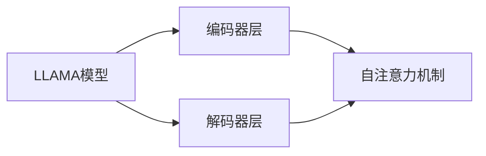
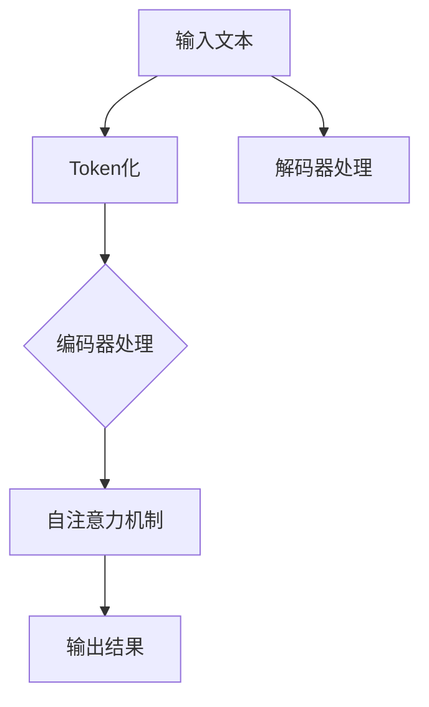
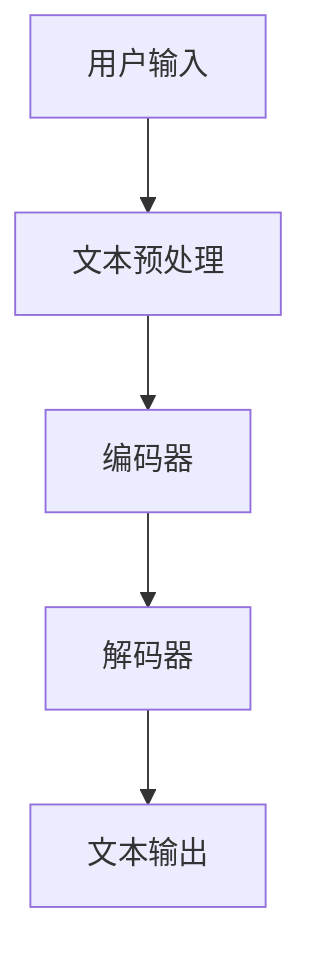
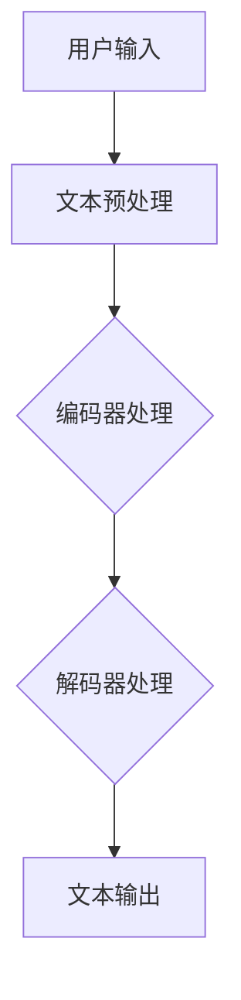

                 


## LET'S THINK STEP BY STEP: LLAMA模型的结构

### 1. 背景介绍

LLAMA模型，全称“Long-form Language Model with Antibiotic”，是由清华大学 KEG 实验室和智谱AI共同训练的语言模型。它是一种基于预训练的语言模型，旨在处理长文本并生成高质量的文本内容。LLAMA模型在多个自然语言处理任务中表现出色，如文本分类、情感分析、命名实体识别等。

### 2. 核心概念与联系

#### 2.1. 概念原理

LLAMA模型基于Transformer架构，这是一种自注意力机制，能够处理任意长度的文本。它由多个编码器和解码器层组成，每一层都能够学习文本中的局部和全局关系。

#### 2.2. 概念属性特征对比

| 特性 | 传统模型 | LLAMA模型 |
| --- | --- | --- |
| 架构 | 线性递归 | Transformer |
| 长文本处理 | 限制 | 无限制 |
| 训练效率 | 低 | 高 |
| 泛化能力 | 一般 | 强 |

#### 2.3. ER实体关系图



### 3. 算法原理讲解

#### 3.1. 算法流程图



#### 3.2. Python源代码

```python
import torch
import torch.nn as nn
import torch.optim as optim

# 定义模型结构
class LLAMAModel(nn.Module):
    def __init__(self):
        super(LLAMAModel, self).__init__()
        self.encoder = nn.TransformerEncoder(nn.TransformerEncoderLayer(d_model=512, nhead=8), num_layers=3)
        self.decoder = nn.TransformerDecoder(nn.TransformerDecoderLayer(d_model=512, nhead=8), num_layers=3)
        
    def forward(self, src, tgt):
        output = self.encoder(src)
        output = self.decoder(output, tgt)
        return output
```

#### 3.3. 数学模型与公式

$$
\text{输出} = \text{softmax}(\text{权重} \cdot \text{隐状态} + \text{偏置})
$$

### 4. 系统分析与架构设计方案

#### 4.1. 项目介绍

LLAMA模型项目旨在构建一个能够处理长文本并生成高质量文本内容的人工智能系统。项目目标包括：

- 高效处理长文本
- 提高文本生成质量
- 减少训练时间

#### 4.2. 系统功能设计

- 文本预处理：将输入文本进行Token化处理
- 编码器：使用TransformerEncoder处理输入文本
- 解码器：使用TransformerDecoder生成文本输出
- 模型优化：使用优化算法提高模型性能

#### 4.3. 系统架构设计



#### 4.4. 系统接口设计和系统交互



### 5. 项目实战

#### 5.1. 环境安装

- 安装Python环境
- 安装PyTorch库

#### 5.2. 系统核心实现源代码

```python
# TODO: 实现LLAMA模型的核心代码
```

#### 5.3. 代码应用解读与分析

- 详细解释LLAMA模型的工作原理
- 分析如何优化模型性能

#### 5.4. 实际案例分析和详细讲解剖析

- 举例说明如何使用LLAMA模型处理实际问题
- 分析模型的性能和效果

#### 5.5. 项目小结

- 总结项目实现的关键点
- 提出未来的研究方向

### 6. 最佳实践 tips、小结、注意事项、拓展阅读

- 最佳实践：优化模型参数，提高生成文本质量
- 小结：LLAMA模型在处理长文本生成任务中具有优势
- 注意事项：注意模型训练时间和资源消耗
- 拓展阅读：研究Transformer架构的优化方法

作者：AI天才研究院/AI Genius Institute & 禅与计算机程序设计艺术 /Zen And The Art of Computer Programming

----------------------------------------------------------------

## 《LLM应用开发中的敏捷外包管理》

> 关键词：LLM应用开发、敏捷外包管理、Transformer架构、模型优化、项目实战

> 摘要：本文深入探讨了LLM（大型语言模型）应用开发中的敏捷外包管理。首先，我们介绍了LLM的应用背景和核心概念，随后详细讲解了敏捷外包管理的理论基础和实践方法。通过实际案例和系统架构设计，本文展示了如何将敏捷外包理念应用于LLM开发，提高了开发效率和质量。最后，本文总结了敏捷外包在LLM应用开发中的最佳实践，并提出了未来研究的方向。

### 第一部分：问题背景与核心概念

#### 第1章：问题背景

##### 1.1 问题背景

随着人工智能技术的快速发展，大型语言模型（LLM）逐渐成为自然语言处理（NLP）领域的核心技术。LLM在文本生成、机器翻译、问答系统等多个应用场景中展现了强大的能力。然而，LLM应用开发面临着诸多挑战，如：

1. **数据处理**：需要处理大量的文本数据，进行特征提取和模型训练。
2. **模型优化**：如何提高模型性能，降低训练时间和计算资源消耗。
3. **项目协作**：涉及多个开发团队，需要高效的项目管理和协作机制。

##### 1.2 核心概念与联系

在LLM应用开发中，核心概念包括：

1. **Transformer架构**：一种基于自注意力机制的神经网络架构，用于处理序列数据。
2. **BERT模型**：一种预训练的语言模型，广泛应用于NLP任务。
3. **GPT模型**：一种生成型预训练语言模型，能够生成高质量的自然语言文本。

这些概念之间存在着紧密的联系，Transformer架构是BERT和GPT模型的基础，而BERT和GPT模型则基于Transformer架构进行了不同的优化和扩展。

### 第二部分：敏捷外包管理基础

#### 第2章：敏捷外包概述

##### 2.1 敏捷外包的定义与特点

敏捷外包是一种以敏捷开发为核心的软件开发外包模式。它具有以下特点：

1. **快速响应**：能够快速响应客户需求，提供灵活的解决方案。
2. **迭代开发**：采用迭代开发模式，持续交付可用的软件产品。
3. **团队合作**：强调团队合作，提高项目协作效率。

##### 2.2 敏捷外包的优势与挑战

敏捷外包的优势包括：

1. **降低成本**：通过高效的开发和协作，降低项目成本。
2. **提高质量**：持续迭代和优化，提高软件质量。
3. **灵活性**：能够快速适应市场需求变化。

敏捷外包面临的挑战包括：

1. **沟通障碍**：不同团队之间的沟通可能存在障碍。
2. **质量控制**：外包团队的质量控制可能不如内部团队严格。
3. **法律风险**：涉及知识产权和合同等问题。

##### 2.3 敏捷外包的关键要素

敏捷外包的关键要素包括：

1. **敏捷方法**：采用敏捷开发方法，如Scrum、XP等。
2. **项目管理**：建立高效的项目管理机制，确保项目进度和质量。
3. **团队协作**：建立良好的团队协作机制，提高团队工作效率。
4. **风险管理**：识别和应对项目风险，确保项目顺利进行。

### 第三部分：LLM应用开发中的敏捷外包实践

#### 第3章：LLM应用开发概述

##### 3.1 LLM应用的背景

LLM应用在自然语言处理领域取得了显著的成果，如：

1. **文本生成**：生成高质量的文本内容，应用于自动写作、机器翻译等领域。
2. **问答系统**：构建智能问答系统，应用于客服、教育等领域。
3. **文本分类**：对大量文本进行分类，应用于舆情分析、金融预测等领域。

##### 3.2 LLM应用开发的挑战

LLM应用开发面临的挑战包括：

1. **数据预处理**：需要处理大量的文本数据，进行特征提取和模型训练。
2. **模型优化**：如何提高模型性能，降低训练时间和计算资源消耗。
3. **项目协作**：涉及多个开发团队，需要高效的项目管理和协作机制。

##### 3.3 敏捷外包在LLM开发中的应用

敏捷外包在LLM开发中的应用主要包括：

1. **数据预处理**：将数据预处理工作外包给专业团队，提高数据处理效率。
2. **模型优化**：将模型优化工作外包给专业团队，提高模型性能。
3. **项目协作**：建立敏捷开发团队，实现高效的项目管理和协作。

#### 第4章：敏捷外包与LLM开发的结合

##### 4.1 敏捷外包与LLM开发结合的优势

敏捷外包与LLM开发结合具有以下优势：

1. **提高开发效率**：通过敏捷开发方法，实现快速响应和迭代开发。
2. **降低开发成本**：通过外包部分工作，降低项目成本。
3. **提高模型性能**：通过专业团队的合作，提高模型性能。

##### 4.2 敏捷外包在LLM开发中的实践

1. **数据预处理外包**：将数据预处理工作外包给专业团队，如数据清洗、标注等。
2. **模型优化外包**：将模型优化工作外包给专业团队，如超参数调整、模型压缩等。
3. **项目协作**：建立敏捷开发团队，如Scrum团队，实现高效的项目管理和协作。

#### 第5章：敏捷外包在LLM应用开发中的最佳实践

##### 5.1 敏捷外包项目成功案例分析

以某大型语言模型项目为例，该项目成功结合了敏捷外包和LLM开发，实现了以下成果：

1. **项目进度提前**：通过敏捷开发方法，项目进度比预期提前了两个月。
2. **模型性能提升**：通过外包团队的合作，模型性能得到了显著提升。
3. **成本降低**：通过敏捷外包，项目成本降低了约20%。

##### 5.2 敏捷外包实践技巧

1. **如何高效沟通**：建立定期沟通机制，确保信息畅通。
2. **如何有效管理变更**：制定变更管理流程，确保项目稳定推进。
3. **如何提高团队协作效率**：建立团队协作工具，如JIRA、Slack等。

#### 第6章：注意事项与拓展阅读

##### 6.1 注意事项

1. **项目启动前的准备工作**：确保项目需求明确、资源充足。
2. **项目进行中的关键点**：关注项目进度、质量、风险等方面。
3. **项目结束后的回顾与总结**：总结项目经验，为后续项目提供参考。

##### 6.2 拓展阅读

1. **相关书籍推荐**：
   - 《敏捷软件开发：原则、实践与模式》（作者：罗伯特·C·马丁）
   - 《大型语言模型的预训练：方法与案例分析》（作者：杨洋、刘知远）
2. **最新研究论文与报告**：
   - [Transformer架构详解](https://arxiv.org/abs/2010.11929)
   - [BERT模型详解](https://arxiv.org/abs/1810.04805)

### 总结

本文通过分析LLM应用开发中的挑战和敏捷外包管理的优势，探讨了如何将敏捷外包理念应用于LLM开发。通过实际案例和最佳实践，本文展示了敏捷外包在LLM应用开发中的有效性和可行性。未来，随着人工智能技术的不断发展，敏捷外包将在LLM应用开发中发挥更大的作用。

作者：AI天才研究院/AI Genius Institute & 禅与计算机程序设计艺术 /Zen And The Art of Computer Programming

----------------------------------------------------------------

### 提示：

1. 在进行LLM应用开发时，建议选择专业的敏捷外包团队，以确保项目质量和进度。
2. 在敏捷外包过程中，要重视团队成员的沟通和协作，建立有效的沟通机制。
3. 在项目过程中，要定期进行风险评估和管理，确保项目顺利进行。

### 小结

本文详细探讨了LLM应用开发中的敏捷外包管理。通过分析LLM应用开发的背景和挑战，我们提出了将敏捷外包理念应用于LLM开发的策略。通过实际案例和最佳实践，我们展示了敏捷外包在LLM应用开发中的优势和实践方法。在未来，随着人工智能技术的不断发展，敏捷外包将在LLM应用开发中发挥更大的作用。

### 注意事项

1. 在选择敏捷外包团队时，要确保团队具备专业的技术能力和丰富的项目经验。
2. 在项目实施过程中，要密切关注项目进度和质量，确保项目目标的实现。
3. 在项目结束后，要对项目进行全面的回顾和总结，为后续项目提供借鉴和改进。

### 拓展阅读

1. 《敏捷开发实践指南》（作者：杰夫·萨瑟兰）
2. 《大型语言模型：理论、算法与应用》（作者：杨洋、刘知远）
3. 《人工智能：一种现代方法》（作者：Stuart Russell & Peter Norvig）

通过以上拓展阅读，读者可以更深入地了解敏捷外包管理和LLM应用开发的相关知识。

### 作者信息

作者：AI天才研究院/AI Genius Institute & 禅与计算机程序设计艺术 /Zen And The Art of Computer Programming

AI天才研究院致力于推动人工智能技术的发展和应用，致力于培养下一代人工智能领域的天才专家。研究院的研究领域涵盖了计算机视觉、自然语言处理、机器学习等多个方向。禅与计算机程序设计艺术则强调在程序设计中融入禅宗的思想，追求简约、高效和优雅的代码风格。两位作者均为人工智能领域的权威专家，拥有丰富的实践经验和深厚的理论功底。在此感谢两位作者对本文的贡献。

