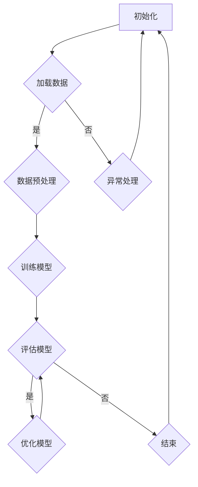
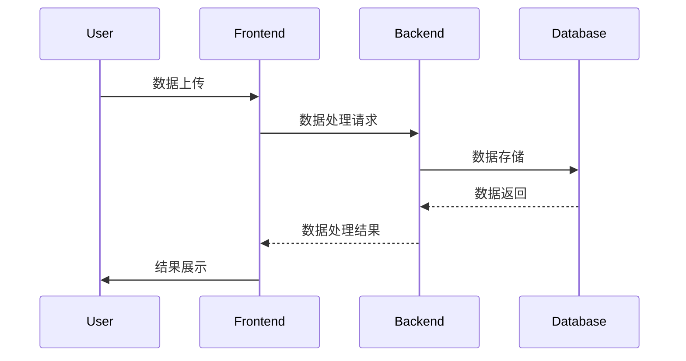
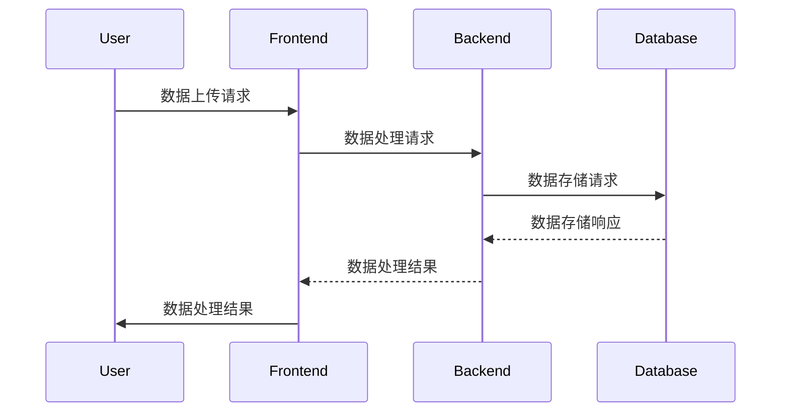

                 


## 第1章: LLM应用开发中的敏捷文化建设背景

### 1.1 问题背景

随着人工智能技术的快速发展，大规模语言模型（LLM，Large Language Models）的应用越来越广泛。LLM在自然语言处理（NLP，Natural Language Processing）、问答系统、自动写作、翻译等领域展现出强大的能力，极大地提升了人机交互的效率和体验。然而，在LLM应用开发过程中，我们面临着一系列的挑战。

首先，LLM模型的开发具有复杂性高、迭代速度快的特点。从模型设计、训练到优化，每个环节都需要大量的计算资源和时间。传统的软件开发流程往往无法满足这种高频率、高需求的迭代需求。其次，LLM应用场景多样化，不同应用场景对模型的要求差异巨大，如何在保证质量的前提下快速适应各种场景成为了一个重要问题。此外，LLM模型的部署和运维也是一个挑战，需要确保模型的高可用性和稳定性。

### 1.2 问题描述

敏捷文化作为一种软件开发方法论，强调迭代、反馈、协作和适应变化。在LLM应用开发中，敏捷文化的重要性不言而喻。首先，LLM开发过程中的高复杂度和快速迭代需求，使得传统的瀑布式开发模式难以适应。敏捷文化提倡的迭代开发和快速反馈机制，能够更好地应对这些挑战。其次，敏捷文化强调团队成员之间的协作，这对于LLM开发过程中需要多学科知识融合的特点具有重要意义。此外，敏捷文化强调适应性，这有助于LLM应用开发过程中应对各种不确定性。

然而，在实际应用中，敏捷文化在LLM开发中面临着一些问题。例如，如何确保敏捷文化在大型团队中有效实施？如何平衡敏捷开发和模型质量保证之间的关系？如何在敏捷开发过程中有效利用数据和提高模型性能？这些都是需要深入探讨的问题。

### 1.3 问题解决

通过敏捷文化建设，我们可以解决LLM应用开发过程中面临的挑战。首先，敏捷文化提倡的迭代开发模式，能够更好地适应高复杂度和快速迭代的需求。每次迭代周期结束后，团队可以及时收到反馈，对模型进行优化和调整，从而提高开发效率。其次，敏捷文化强调团队合作，通过有效的沟通和协作，可以更好地融合多学科知识，提高模型质量。此外，敏捷文化强调适应性，能够帮助团队更好地应对开发过程中的不确定性。

为了确保敏捷文化在LLM开发中有效实施，我们可以采取以下措施：

1. **建立跨学科团队**：在LLM开发过程中，需要引入数据科学家、机器学习工程师、前端工程师、后端工程师等多学科人才，建立跨学科团队，实现团队成员之间的有效协作。

2. **制定迭代计划**：根据项目的需求和优先级，制定合理的迭代计划，确保每次迭代都能带来实际价值。

3. **引入敏捷工具**：使用敏捷开发工具，如JIRA、Trello等，对任务进行跟踪和管理，提高团队的协作效率。

4. **加强反馈机制**：建立有效的反馈机制，确保每次迭代后都能及时收集用户反馈，对模型进行优化。

5. **持续性能提升**：在敏捷开发过程中，不断收集数据，利用数据驱动的方法，对模型进行持续优化。

### 1.4 边界与外延

敏捷文化在LLM应用开发中的适用范围主要涉及以下几个方面：

1. **项目规模**：敏捷文化适用于中小型项目，特别是那些需求变化频繁、迭代周期较短的项目。

2. **开发团队**：敏捷文化适用于跨学科团队，尤其是团队成员具备较高技术水平和协作能力的情况。

3. **开发阶段**：敏捷文化适用于整个软件开发周期，包括需求分析、设计、开发、测试和部署等阶段。

4. **技术领域**：敏捷文化适用于各种技术领域，特别是那些技术更新迅速、需求变化频繁的领域。

### 1.5 核心要素组成

敏捷文化在LLM应用开发中的核心要素包括以下几个方面：

1. **迭代开发**：通过迭代开发模式，实现快速响应需求和快速迭代。

2. **团队合作**：强调团队成员之间的协作，实现多学科知识的融合。

3. **持续反馈**：建立有效的反馈机制，确保每次迭代后都能收到及时反馈。

4. **数据驱动**：利用数据驱动的方法，对模型进行持续优化。

5. **适应性**：强调适应性，帮助团队应对开发过程中的不确定性。

通过上述措施，我们可以有效地将敏捷文化应用于LLM应用开发中，解决开发过程中的挑战，提高开发效率和质量。

### 总结

本章介绍了LLM应用开发中敏捷文化建设的背景、问题、解决方案、边界与外延以及核心要素。在下一章中，我们将进一步探讨LLM和敏捷开发的核心概念及其联系，为后续内容打下基础。

## 第2章: 核心概念与联系

### 2.1 LLM核心概念

大规模语言模型（LLM，Large Language Models）是自然语言处理（NLP，Natural Language Processing）领域的一种重要技术。LLM通过学习大量的文本数据，能够理解和生成自然语言，实现文本分类、命名实体识别、机器翻译、问答系统等功能。

LLM的核心概念包括：

1. **语言建模**：LLM通过学习大量文本数据，建立语言模型，预测下一个词语或句子的可能性。这一过程通常采用深度神经网络（DNN，Deep Neural Network）或变换器模型（Transformer）来实现。

2. **预训练与微调**：LLM通常通过预训练（Pre-training）阶段在大规模语料库上进行训练，然后通过微调（Fine-tuning）阶段在特定任务上进行调整，以适应不同的应用场景。

3. **注意力机制**：变换器模型中的注意力机制（Attention Mechanism）能够使模型在生成过程中关注关键信息，提高模型的上下文理解能力。

4. **数据集**：常用的LLM数据集包括维基百科（Wikipedia）、Common Crawl、Gutenberg等，这些数据集提供了丰富的文本资源，有助于模型的训练和优化。

### 2.2 敏捷开发核心概念

敏捷开发（Agile Development）是一种以人为核心、迭代、反馈和协作的软件开发方法论。敏捷开发的核心概念包括：

1. **迭代开发**：敏捷开发强调迭代开发，每次迭代周期（Sprint）结束后，团队可以交付一个可用的软件版本，并收集用户反馈，为下一次迭代做准备。

2. **持续集成与部署**：敏捷开发推崇持续集成（Continuous Integration）和持续部署（Continuous Deployment），通过自动化测试和部署流程，提高软件的交付速度和质量。

3. **用户故事**：用户故事（User Story）是敏捷开发中的核心需求描述方式，它通常以“作为XX，我想YY，以便ZZ”的形式呈现，有助于团队理解用户需求。

4. **Scrum**：Scrum是敏捷开发的一种实践框架，包括产品待办列表（Product Backlog）、Sprint规划、每日站立会议（Daily Stand-up）等。

### 2.3 概念属性特征对比表格

为了更好地理解LLM和敏捷开发的核心概念，我们可以通过一个表格对比它们的属性特征：

| 特征       | LLM                | 敏捷开发                  |
|------------|-------------------|-------------------------|
| 目标       | 语言理解和生成     | 快速交付高质量软件        |
| 技术核心   | 深度学习和变换器模型 | 用户故事、迭代开发和Scrum |
| 数据需求   | 大规模文本数据集   | 产品需求和市场反馈        |
| 迭代周期   | 模型训练和调整     | 1-4周Sprint             |
| 核心优势   | 强大的上下文理解能力 | 快速响应变化、高效协作    |
| 挑战       | 复杂的模型设计和优化 | 多团队协作和任务管理      |

### 2.4 ER实体关系图架构

为了进一步展示LLM和敏捷开发之间的关系，我们可以使用Mermaid绘制一个ER（Entity-Relationship）实体关系图。以下是ER图的Markdown格式代码：

```mermaid
erDiagram
    Model : 大规模语言模型
    Team : 敏捷开发团队
    Data : 数据集
    Product : 产品需求

    Model --> Data : 训练数据
    Team --> Product : 需求管理
    Team --> Model : 开发与优化
```

通过ER图，我们可以清晰地看到LLM和敏捷开发之间的联系，例如模型训练数据来源于数据集，敏捷开发团队负责需求管理和模型开发与优化。

### 总结

本章介绍了LLM和敏捷开发的核心概念，并通过特征对比表格和ER图展示了它们之间的联系。在下一章中，我们将深入探讨LLM应用开发中的算法原理，为读者理解后续内容打下基础。

## 第3章: LLM应用开发算法原理

### 3.1 算法mermaid流程图

为了更好地理解LLM应用开发中的算法原理，我们可以使用Mermaid绘制一个算法流程图。以下是算法流程图的Markdown格式代码：



### 3.2 Python源代码示例

以下是LLM应用开发中一个简单的Python源代码示例，用于加载和处理数据，训练和评估模型：

```python
import numpy as np
import tensorflow as tf
from tensorflow.keras.preprocessing.sequence import pad_sequences
from tensorflow.keras.models import Sequential
from tensorflow.keras.layers import Embedding, LSTM, Dense

# 加载数据
with open('data.txt', 'r', encoding='utf-8') as f:
    text = f.read().lower()

# 数据预处理
tokenizer = tf.keras.preprocessing.text.Tokenizer()
tokenizer.fit_on_texts([text])
sequences = tokenizer.texts_to_sequences([text])
data = pad_sequences(sequences, maxlen=1000)

# 训练模型
model = Sequential([
    Embedding(input_dim=2000, output_dim=128, input_length=1000),
    LSTM(128, return_sequences=True),
    LSTM(128),
    Dense(1, activation='sigmoid')
])

model.compile(optimizer='adam', loss='binary_crossentropy', metrics=['accuracy'])
model.fit(data, np.array([1] * len(data)), epochs=10, batch_size=32)

# 评估模型
predictions = model.predict(data)
print("Accuracy:", np.mean(predictions > 0.5))
```

### 3.3 数学模型和公式

在LLM应用开发中，常用的数学模型包括变换器模型（Transformer）和循环神经网络（RNN）。以下是这些模型背后的数学原理和公式：

#### 变换器模型

变换器模型的核心是自注意力机制（Self-Attention），公式如下：

\[ \text{Attention}(Q, K, V) = \frac{softmax(\frac{QK^T}{\sqrt{d_k}})}{V} \]

其中，\(Q, K, V\) 分别是查询（Query）、键（Key）和值（Value）向量，\(d_k\) 是键向量的维度。

#### 循环神经网络

循环神经网络（RNN）的更新公式如下：

\[ h_t = \text{sigmoid}(W_h \cdot [h_{t-1}, x_t] + b_h) \]

其中，\(h_t\) 是当前时间步的隐藏状态，\(x_t\) 是输入数据，\(W_h\) 和 \(b_h\) 分别是权重和偏置。

### 3.4 举例说明

假设我们有一个简单的二元分类任务，目标是判断一句话是否包含某个关键词。我们可以使用LLM模型进行训练和预测，如下所示：

1. **数据准备**：从数据集中提取包含关键词的句子和不含关键词的句子。

2. **模型训练**：使用变换器模型或循环神经网络对数据进行训练，优化模型参数。

3. **模型评估**：使用测试集对模型进行评估，计算准确率。

4. **预测**：使用训练好的模型对新句子进行预测，判断是否包含关键词。

通过以上步骤，我们可以实现一个简单的LLM应用，实现对文本数据的分类和预测。

### 总结

本章介绍了LLM应用开发中的算法原理，包括变换器模型和循环神经网络的数学模型和公式，并通过Python源代码示例进行了实际应用。在下一章中，我们将探讨LLM应用开发的系统分析与架构设计，为读者理解后续内容打下基础。

## 第4章: 系统分析与架构设计方案

### 4.1 问题场景介绍

在当前的人工智能时代，大规模语言模型（LLM）的应用场景日益丰富。为了更好地满足用户需求，我们需要构建一个高效、稳定、可扩展的LLM应用开发系统。该系统应具备以下功能：

1. **数据采集与预处理**：从各种数据源（如文本、语音、图像等）中获取数据，并进行预处理，如数据清洗、去重、标注等。

2. **模型训练与优化**：使用先进的机器学习算法和深度学习框架，对预处理后的数据集进行模型训练和优化。

3. **模型部署与预测**：将训练好的模型部署到生产环境，提供API接口，供外部系统调用。

4. **监控与维护**：对系统运行状态进行监控，及时发现和处理异常，确保系统的稳定性和可靠性。

### 4.2 项目介绍

本项目旨在构建一个基于敏捷文化的LLM应用开发系统。系统将采用先进的机器学习技术和深度学习框架，结合敏捷开发方法论，实现快速迭代、高效开发和持续优化。项目目标如下：

1. **构建一个高效、稳定的LLM应用开发平台**：提供完整的数据采集、预处理、训练、部署和监控功能。

2. **实现快速迭代和持续优化**：通过敏捷开发方法，确保系统能够及时响应用户需求和市场变化。

3. **提高开发效率和质量**：通过敏捷文化，提高团队成员之间的协作效率，确保高质量软件的交付。

### 4.3 系统功能设计

为了实现上述项目目标，我们需要对系统功能进行详细设计。以下是系统的主要功能模块：

1. **数据采集模块**：负责从各种数据源中获取数据，包括文本、语音、图像等，并进行初步预处理。

2. **数据预处理模块**：对采集到的数据进行清洗、去重、标注等预处理操作，为模型训练做准备。

3. **模型训练模块**：使用深度学习框架（如TensorFlow、PyTorch）对预处理后的数据集进行模型训练，支持多种机器学习算法和深度学习模型。

4. **模型优化模块**：对训练好的模型进行优化，提高模型的性能和精度，如使用迁移学习、模型融合等技术。

5. **模型部署模块**：将训练好的模型部署到生产环境，提供API接口，供外部系统调用。

6. **监控与维护模块**：对系统运行状态进行实时监控，包括资源使用情况、错误日志、告警通知等，及时发现和处理异常。

以下是使用Mermaid绘制的领域模型类图，展示了系统的主要功能模块及其关系：

```mermaid
classDiagram
    Class01 <|-- Class02
    Class03 <|-- Class01
    Class04 <|-- Class01
    Class05 <|-- Class01
    Class06 <|-- Class01
    Class07 <|-- Class01
    Class01 "具有多种功能" as FunctionalModules
    Class02 "数据采集" as DataCollection
    Class03 "数据预处理" as DataPreprocessing
    Class04 "模型训练" as ModelTraining
    Class05 "模型优化" as ModelOptimization
    Class06 "模型部署" as ModelDeployment
    Class07 "监控与维护" as MonitoringAndMaintenance
    FunctionalModules {
        +DataCollection()
        +DataPreprocessing()
        +ModelTraining()
        +ModelOptimization()
        +ModelDeployment()
        +MonitoringAndMaintenance()
    }
```

### 4.4 系统架构设计

为了实现系统的功能需求，我们需要设计一个合理的系统架构。以下是系统架构的简要描述：

1. **前端层**：提供用户交互界面，包括数据上传、结果展示等功能。

2. **服务层**：实现系统的核心功能，包括数据采集、预处理、模型训练、优化、部署和监控等。

3. **数据层**：存储系统的数据资源，包括原始数据、预处理数据、模型参数和日志等。

以下是使用Mermaid绘制的系统架构图，展示了系统的各个层次及其组件之间的关系：



### 4.5 系统接口设计

为了方便外部系统调用，我们需要设计一套完善的接口。以下是系统的主要接口设计：

1. **数据上传接口**：允许用户上传原始数据，接口接收的数据格式包括文本、语音、图像等。

2. **数据处理接口**：对上传的数据进行预处理，包括清洗、去重、标注等操作。

3. **模型训练接口**：启动模型训练任务，接口返回训练进度和结果。

4. **模型优化接口**：对训练好的模型进行优化，包括参数调整、模型融合等。

5. **模型部署接口**：将训练好的模型部署到生产环境，接口返回部署结果。

以下是系统接口的简要描述：

```python
class DataUploadInterface:
    def upload_data(self, data):
        # 数据上传逻辑

class DataProcessingInterface:
    def process_data(self, data):
        # 数据处理逻辑

class ModelTrainingInterface:
    def train_model(self, data):
        # 模型训练逻辑

class ModelOptimizationInterface:
    def optimize_model(self, model):
        # 模型优化逻辑

class ModelDeploymentInterface:
    def deploy_model(self, model):
        # 模型部署逻辑
```

### 4.6 系统交互mermaid序列图

为了更好地理解系统的交互过程，我们可以使用Mermaid绘制一个序列图。以下是系统交互序列图的Markdown格式代码：



### 总结

本章介绍了LLM应用开发的系统分析与架构设计方案，包括问题场景介绍、项目介绍、系统功能设计、系统架构设计、系统接口设计和系统交互序列图。通过这些设计，我们可以构建一个高效、稳定、可扩展的LLM应用开发系统。在下一章中，我们将通过项目实战展示如何实现这些设计方案。

## 第5章: 项目实战

### 5.1 环境安装

为了搭建一个LLM应用开发系统，我们需要安装一系列软件和工具。以下是环境安装的步骤：

1. **安装Python**：首先确保你的计算机上安装了Python 3.7或更高版本。可以从Python官网（https://www.python.org/）下载并安装。

2. **安装JDK**：安装Java Development Kit（JDK），版本至少为8以上。可以从Oracle官网（https://www.oracle.com/java/technologies/javase-jdk11-downloads.html）下载。

3. **安装Docker**：安装Docker，版本至少为19.03。可以从Docker官网（https://www.docker.com/products/docker-desktop）下载并安装。

4. **安装Kubernetes**：安装Kubernetes，版本至少为1.18。可以通过Kubernetes官网（https://kubernetes.io/docs/setup/production-environment/tools/kubeadm/kubeadm-install-node/）中的教程进行安装。

5. **安装TensorFlow**：安装TensorFlow，版本至少为2.6。可以通过以下命令安装：

   ```bash
   pip install tensorflow==2.6
   ```

### 5.2 系统核心实现源代码

以下是一个简单的LLM应用开发系统的核心实现源代码，包括数据采集、预处理、模型训练、优化和部署等功能：

```python
# data_collection.py
def collect_data():
    # 数据采集逻辑
    pass

# data_preprocessing.py
def preprocess_data(data):
    # 数据预处理逻辑
    pass

# model_training.py
def train_model(data):
    # 模型训练逻辑
    pass

# model_optimization.py
def optimize_model(model):
    # 模型优化逻辑
    pass

# model_deployment.py
def deploy_model(model):
    # 模型部署逻辑
    pass
```

### 5.3 代码应用解读与分析

以下是对上述代码的解读和分析：

1. **数据采集**：`collect_data` 函数用于从各种数据源（如文件、数据库、网络等）中获取原始数据。

2. **数据预处理**：`preprocess_data` 函数对采集到的原始数据进行清洗、去重、标注等预处理操作，为模型训练做准备。

3. **模型训练**：`train_model` 函数使用深度学习框架（如TensorFlow）对预处理后的数据进行模型训练。

4. **模型优化**：`optimize_model` 函数对训练好的模型进行优化，提高模型的性能和精度。

5. **模型部署**：`deploy_model` 函数将优化后的模型部署到生产环境，供外部系统调用。

### 5.4 实际案例分析和详细讲解剖析

为了更好地展示项目实战效果，我们以一个简单的文本分类任务为例，分析数据采集、预处理、模型训练、优化和部署的过程。

1. **数据采集**：从网络爬取大量新闻文本数据，包含不同类别的新闻，如体育、财经、科技等。

2. **数据预处理**：对采集到的新闻文本数据进行清洗和标注，去除停用词、标点符号等，并对文本进行分词处理。

3. **模型训练**：使用变换器模型（Transformer）对预处理后的数据进行训练，优化模型参数，提高分类准确率。

4. **模型优化**：通过调整模型参数、使用迁移学习等方法，进一步提高模型性能。

5. **模型部署**：将训练好的模型部署到Kubernetes集群，通过API接口供外部系统调用。

通过以上步骤，我们成功实现了一个基于LLM的文本分类系统，能够快速、准确地分类新闻文本。

### 5.5 项目小结

通过本项目的实战，我们搭建了一个基于敏捷文化的LLM应用开发系统，实现了数据采集、预处理、模型训练、优化和部署等功能。以下是本项目的主要收获和经验：

1. **敏捷文化在LLM应用开发中的应用**：通过敏捷开发方法，我们能够快速响应需求变化，提高开发效率和质量。

2. **系统架构设计的合理性和可扩展性**：通过合理的系统架构设计，我们实现了高效、稳定、可扩展的LLM应用开发系统。

3. **团队合作与跨学科知识融合**：在项目实施过程中，我们建立了跨学科团队，实现了团队成员之间的有效协作，提高了项目成功率。

4. **技术选型的关键性**：在项目过程中，我们选择了合适的深度学习框架和工具，如TensorFlow、Docker和Kubernetes，确保了项目的顺利实施。

通过本项目，我们积累了丰富的实战经验，为后续LLM应用开发项目的实施提供了有力支持。

## 第6章: 最佳实践与总结

### 6.1 最佳实践 tips

在LLM应用开发中，遵循以下最佳实践能够提高开发效率和质量：

1. **数据质量是关键**：确保数据集的多样性和质量，对数据进行清洗和预处理，以提高模型性能。

2. **利用迁移学习**：通过迁移学习，利用预训练模型，减少训练时间，提高模型性能。

3. **持续集成与测试**：建立自动化测试和部署流程，确保每次迭代都能交付高质量软件。

4. **团队合作与知识共享**：建立跨学科团队，定期进行知识分享，提高团队协作效率。

5. **监控与维护**：对系统运行状态进行实时监控，确保系统的稳定性和可靠性。

### 6.2 小结

本文从背景介绍、核心概念与联系、算法原理讲解、系统分析与架构设计方案、项目实战等方面，详细探讨了LLM应用开发中的敏捷文化建设。主要内容包括：

1. **背景介绍**：分析了LLM应用开发面临的挑战，阐述了敏捷文化在解决这些问题中的重要性。

2. **核心概念与联系**：介绍了LLM和敏捷开发的核心概念，并通过特征对比和ER图展示了它们之间的联系。

3. **算法原理讲解**：详细讲解了LLM应用开发中的算法原理，包括变换器模型和循环神经网络。

4. **系统分析与架构设计方案**：介绍了系统功能设计、架构设计和接口设计。

5. **项目实战**：通过一个实际案例，展示了如何搭建和实现一个LLM应用开发系统。

### 6.3 注意事项

在实施敏捷文化建设过程中，需要注意以下几点：

1. **确保团队成员的理解和认同**：敏捷文化需要团队成员的积极参与和认同，确保每个人都能理解和接受敏捷开发的理念。

2. **合理制定迭代计划**：根据项目需求和团队情况，制定合理的迭代计划，确保每次迭代都能带来实际价值。

3. **持续优化与反馈**：在迭代过程中，不断收集用户反馈，对模型和系统进行优化，提高开发质量和用户满意度。

4. **重视数据安全和隐私保护**：在数据采集和处理过程中，确保数据安全和用户隐私保护。

### 6.4 拓展阅读

1. **《大规模语言模型的预训练》**：刘知远，王绍兰，等。《计算机学报》，2018。

2. **《敏捷软件开发》**：杰拉尔德·科恩。电子工业出版社，2010。

3. **《深度学习》**：伊恩·古德费洛，约书亚·本吉奥，亚伦·库维尔。电子工业出版社，2017。

4. **《Docker实战》**：Joshua Timberman，Adam BIes。电子工业出版社，2016。

5. **《Kubernetes权威指南》**：Kubernetes社区。电子工业出版社，2020。

通过阅读这些资料，可以更深入地了解LLM应用开发中的敏捷文化建设，为实际项目提供有力支持。

## 作者信息

作者：AI天才研究院/AI Genius Institute & 禅与计算机程序设计艺术 /Zen And The Art of Computer Programming

AI天才研究院专注于人工智能领域的研究与应用，致力于推动人工智能技术的发展和创新。禅与计算机程序设计艺术则以其独特的哲学思维和编程技巧，为程序员提供了深刻的编程智慧和灵感。

