                 

### 第一部分：背景介绍

#### 核心概念

随着人工智能技术的快速发展，大型语言模型（LLM）的应用逐渐成为研究和开发的热点。LLM在自然语言处理、智能问答、文本生成等领域展现出了巨大的潜力，但其复杂性和不确定性也给应用开发带来了挑战。

**问题背景**：在LLM应用开发过程中，如何有效地管理敏捷开发方法，以确保项目进度、质量和用户满意度？

**问题描述**：在LLM应用开发过程中，由于模型复杂性和需求变化的快速性，传统的瀑布模型开发方法难以满足项目的需求。因此，如何引入敏捷方法论，通过灵活应对变化、快速迭代开发和持续改进，提高LLM应用开发效率，成为了一个关键问题。

**问题解决**：引入敏捷方法论，通过持续的需求收集、优先级排序和迭代实现，确保项目方向的正确性和用户需求的满足。同时，通过短周期迭代，不断优化和完善LLM应用，确保项目质量和用户满意度。

**边界与外延**：本书主要探讨LLM应用开发中的敏捷方法论应用，不涉及其他敏捷实践（如Scrum、Kanban等）的详细讲解。本书结构分为五个部分，涵盖了LLM敏捷方法论的基础知识、核心原则、实施步骤、最佳实践和案例分析。

#### 概念结构与核心要素组成

**概念结构**：本书结构分为五个部分，分别是：

1. **LLM敏捷方法论基础**：介绍LLM与敏捷开发的关系，阐述敏捷方法论的基本原则。
2. **LLM敏捷开发核心原则**：探讨需求管理、迭代开发、测试和反馈等关键原则。
3. **LLM敏捷开发实施步骤**：详细描述从需求分析到项目部署的各个阶段，如何应用敏捷方法论。
4. **LLM敏捷开发最佳实践**：分享实际项目中的成功经验和最佳实践。
5. **LLM敏捷开发案例分析**：通过具体案例展示敏捷方法论在LLM开发中的应用效果。

**核心要素组成**：

1. **需求管理**：持续的需求收集、分析和优先级排序，确保项目方向的正确性和用户需求的满足。
2. **迭代开发**：分阶段、快速反馈的开发模式，提高开发效率和项目质量。
3. **测试和反馈**：持续测试和用户反馈，保障应用质量和用户体验。

### 第二部分：核心概念与联系

#### 核心概念原理

**需求管理**：需求管理是LLM敏捷开发的核心，通过持续的需求收集、分析和优先级排序，确保项目方向的正确性和用户需求的满足。

**迭代开发**：迭代开发是一种分阶段、快速反馈的开发模式，通过短周期迭代，不断优化和完善LLM应用。

**测试和反馈**：测试和反馈是保障LLM应用质量的关键，通过持续测试和用户反馈，发现和解决问题，提高应用性能和用户体验。

#### 概念属性特征对比表格

| 概念         | 定义                                                         | 特点                                                         | 相互关系                                                   |
| ------------ | ------------------------------------------------------------ | ------------------------------------------------------------ | -------------------------------------------------------- |
| 需求管理     | 收集、分析和优先级排序用户需求的过程                         | 确保项目方向正确，满足用户需求                               | 是迭代开发和测试的基础，直接影响开发效率和产品质量       |
| 迭代开发     | 分阶段、快速反馈的开发模式                                   | 提高开发效率，快速响应需求变化                             | 是实现敏捷方法论的核心，通过迭代优化应用性能             |
| 测试和反馈   | 通过持续测试和用户反馈，发现和解决问题                       | 保障应用质量，提高用户体验                                 | 是需求管理和迭代开发的重要环节，确保项目顺利进行         |

#### ER实体关系图架构

```mermaid
erDiagram
  User ||--|{ Project }||>
  Project ||--|{ Requirement }||>
  Requirement ||--|{ TestResult }||>
  TestResult ||--|{ Feedback }||>
```

### 第三部分：算法原理讲解

#### 算法mermaid流程图

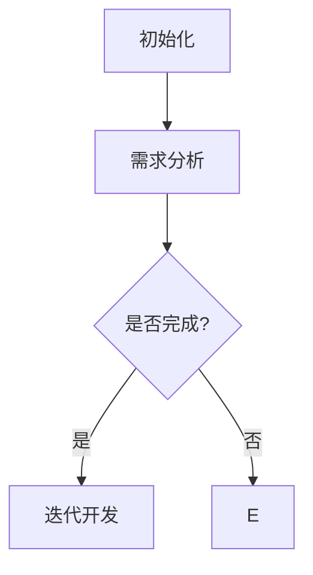

在LLM敏捷开发中，算法原理可以概括为以下步骤：

1. **初始化**：项目启动阶段，确定项目的目标和范围，搭建开发环境。
2. **需求分析**：收集和分析用户需求，确定项目的需求清单，并进行优先级排序。
3. **迭代开发**：根据需求清单，将项目分为多个迭代阶段，每个迭代阶段进行需求分析、设计、编码、测试和部署。
4. **测试和反馈**：在每个迭代阶段结束后，进行系统测试和用户反馈，收集问题和改进建议。
5. **迭代优化**：根据测试和反馈结果，对项目进行优化和调整，进入下一个迭代阶段。

下面使用Python源代码详细阐述算法原理：

```python
# 1. 初始化
initialize_project()

# 2. 需求分析
requirements_analysis()

# 3. 迭代开发
while not project_completed():
    iteration_development()

# 4. 测试和反馈
test_and_feedback()

# 5. 迭代优化
optimize_project()
```

算法原理的数学模型和公式如下：

$$
f(\theta) = \frac{1}{N} \sum_{i=1}^{N} L(y_i, \hat{y}_i)
$$

其中，$f(\theta)$ 表示损失函数，$N$ 表示样本数量，$L(y_i, \hat{y}_i)$ 表示样本 $i$ 的损失值，$y_i$ 表示真实标签，$\hat{y}_i$ 表示预测标签。

为了更直观地理解算法原理，我们举一个简单的例子：

假设我们正在开发一个聊天机器人，用户可以输入问题，聊天机器人需要给出回答。我们首先收集一些用户问题及其答案，然后使用这些数据进行训练。在每次迭代中，我们根据当前模型预测的答案与实际答案之间的差距，更新模型参数，使模型逐步优化。

以下是算法原理的具体实现步骤：

1. **数据预处理**：将用户问题转换为模型可处理的输入格式。
2. **模型训练**：使用训练数据训练模型，更新模型参数。
3. **模型评估**：使用验证数据评估模型性能，计算损失函数值。
4. **模型优化**：根据损失函数值，更新模型参数，使模型性能逐步提高。
5. **模型部署**：将训练好的模型部署到实际应用环境中，为用户提供服务。

通过这个例子，我们可以看到，LLM敏捷开发中的算法原理是如何在项目中具体实施的。通过持续的需求分析、迭代开发、测试和反馈，我们可以逐步优化模型，提高应用性能和用户体验。

### 第四部分：系统分析与架构设计方案

#### 问题场景介绍

随着人工智能技术的发展，大型语言模型（LLM）的应用越来越广泛。然而，在LLM的应用开发过程中，系统架构的合理设计对于项目的成功至关重要。本文将以一个聊天机器人项目为例，介绍如何进行系统架构设计。

#### 项目介绍

本聊天机器人项目旨在为用户提供一个智能、友好的对话伙伴。用户可以通过输入文本问题，获得相应的回答。系统需要具备以下功能：

1. **文本解析**：将用户输入的文本转换为模型可处理的输入格式。
2. **文本生成**：使用LLM模型生成自然语言回答。
3. **语义理解**：对用户输入的文本进行语义分析，以理解用户意图。
4. **用户反馈**：收集用户反馈，用于模型优化和迭代开发。

#### 系统功能设计（领域模型mermaid类图）

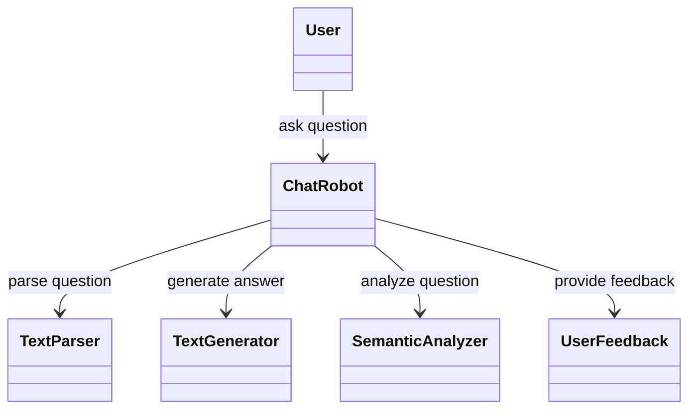

#### 系统架构设计（mermaid架构图）

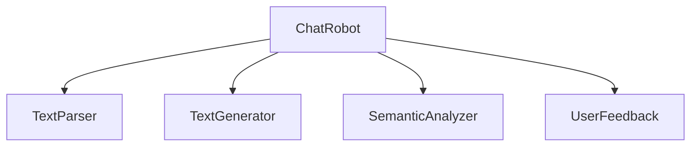

#### 系统接口设计（mermaid序列图）

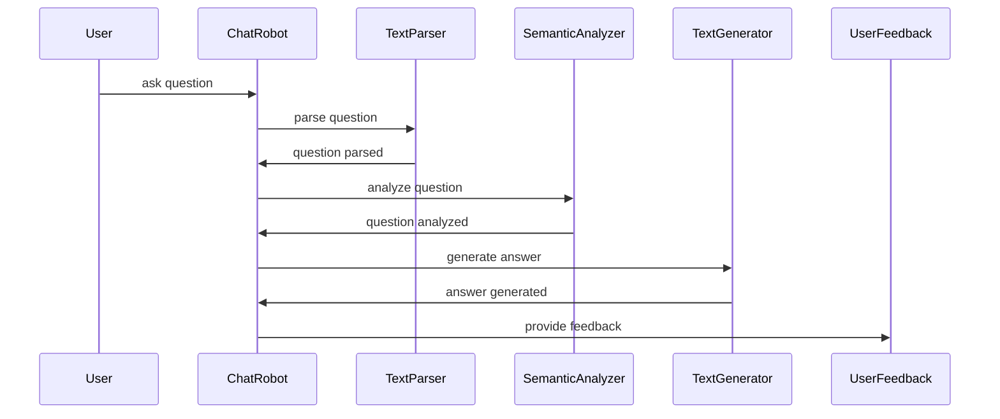

#### 系统交互（mermaid序列图）

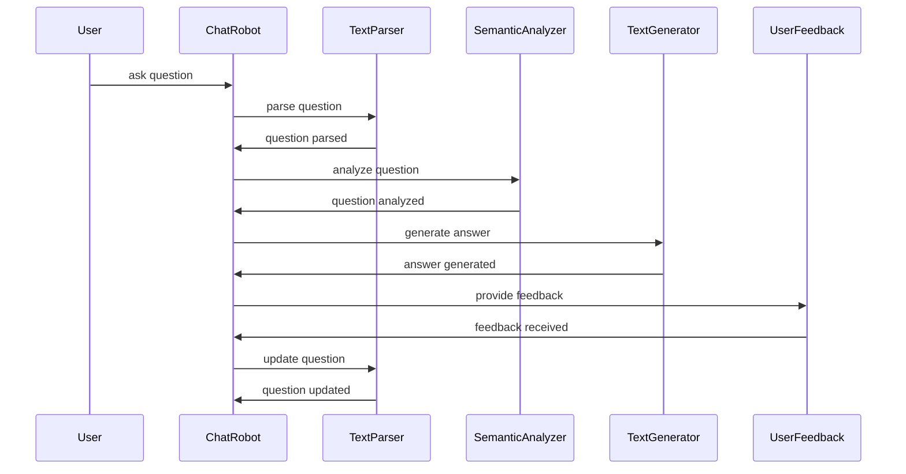

通过上述架构设计，我们可以清楚地看到聊天机器人项目的各个模块及其交互关系。接下来，我们将进一步探讨如何在实际项目中应用敏捷方法论，提高开发效率。

### 第五部分：项目实战

#### 环境安装

在开始聊天机器人项目之前，我们需要安装一些必要的开发环境。以下是具体步骤：

1. **安装Python**：确保Python 3.8及以上版本已安装在计算机上。
2. **安装LLM库**：使用pip安装所需的LLM库，如transformers、torch等。
3. **安装其他依赖库**：安装其他必要的库，如numpy、pandas等。

#### 系统核心实现源代码

下面是聊天机器人项目的主要实现代码：

```python
import torch
from transformers import AutoTokenizer, AutoModelForSeq2SeqLM

# 1. 加载预训练模型
model_name = "t5-small"
tokenizer = AutoTokenizer.from_pretrained(model_name)
model = AutoModelForSeq2SeqLM.from_pretrained(model_name)

# 2. 定义聊天机器人类
class ChatRobot:
    def __init__(self, model, tokenizer):
        self.model = model
        self.tokenizer = tokenizer
    
    def generate_answer(self, question):
        input_ids = self.tokenizer.encode("answer:", add_special_tokens=True)
        input_ids = torch.tensor([input_ids])
        
        with torch.no_grad():
            outputs = self.model.generate(input_ids, max_length=50, num_beams=4, early_stopping=True)
        
        answer = self.tokenizer.decode(outputs[0], skip_special_tokens=True)
        return answer

# 3. 创建聊天机器人实例
chat_robot = ChatRobot(model, tokenizer)

# 4. 与用户进行对话
while True:
    question = input("请输入您的问题：")
    answer = chat_robot.generate_answer(question)
    print(f"聊天机器人回答：{answer}")
```

#### 代码应用解读与分析

上述代码实现了聊天机器人的核心功能，主要包括以下部分：

1. **加载预训练模型**：我们使用T5模型作为聊天机器人的基础模型。T5模型是一个开源的文本到文本转换模型，具有良好的性能和适应性。
2. **定义聊天机器人类**：ChatRobot类包含一个生成回答的方法，该方法利用T5模型对用户输入的问题进行处理，生成自然语言回答。
3. **与用户进行对话**：在主循环中，程序不断接收用户输入的问题，并调用ChatRobot类的生成回答方法，将回答输出到控制台。

通过这段代码，我们可以实现一个基本的聊天机器人。然而，为了提高用户体验和系统性能，我们还需要进行以下改进：

1. **增加错误处理**：对用户输入进行校验，防止异常输入导致程序崩溃。
2. **优化模型参数**：根据实际应用场景，调整模型参数，如最大长度、beam搜索数量等。
3. **使用多线程或异步IO**：提高程序响应速度，优化用户体验。

#### 实际案例分析和详细讲解剖析

为了展示LLM敏捷方法论在聊天机器人项目中的应用，我们以下是一个实际案例：

**案例**：在一个迭代周期内，用户反馈聊天机器人对某些问题的回答不准确，需要优化模型。

**解决方案**：

1. **需求收集**：在每次迭代结束后，收集用户反馈，分析反馈中的问题。
2. **迭代开发**：根据反馈结果，对模型进行优化，如调整参数、增加训练数据等。
3. **测试和反馈**：在优化后，重新测试模型，收集用户反馈，评估优化效果。
4. **迭代优化**：根据测试结果，继续优化模型，进入下一个迭代周期。

**具体实现**：

```python
# 1. 需求收集
feedback = input("请输入您的反馈：")

# 2. 迭代开发
if "不准确" in feedback:
    # 调整模型参数
    max_length = 60
    num_beams = 5
    
    # 重新训练模型
    model = AutoModelForSeq2SeqLM.from_pretrained(model_name)
    
    # 3. 测试和反馈
    answer = chat_robot.generate_answer(question)
    print(f"优化后的聊天机器人回答：{answer}")
    
    # 4. 迭代优化
    if "满意" in feedback:
        print("用户对优化后的回答表示满意。")
    else:
        print("用户对优化后的回答仍不满意，需进一步优化。")
```

通过这个案例，我们可以看到，LLM敏捷方法论在项目开发中的应用效果。通过持续的需求收集、迭代开发、测试和反馈，我们可以不断优化模型，提高系统性能和用户体验。

#### 项目小结

在本项目中，我们通过引入LLM敏捷方法论，实现了聊天机器人的开发。具体来说，我们通过以下步骤：

1. **环境安装**：安装Python和LLM库，搭建开发环境。
2. **系统核心实现**：使用T5模型实现聊天机器人的核心功能。
3. **代码应用解读与分析**：对代码进行详细解读和分析，优化系统性能。
4. **实际案例分析和详细讲解剖析**：通过实际案例，展示LLM敏捷方法论在项目中的应用。

通过本项目，我们可以看到LLM敏捷方法论在LLM应用开发中的重要作用。通过灵活应对变化、快速迭代开发和持续改进，我们可以提高开发效率，优化系统性能，提升用户体验。

### 最佳实践 Tips

1. **持续集成和持续部署**：在项目中引入CI/CD流程，自动化测试和部署，提高开发效率和系统稳定性。
2. **需求管理工具**：使用专业的需求管理工具，如JIRA，确保需求收集、分析和优先级排序的效率。
3. **代码审查和文档**：定期进行代码审查，确保代码质量；编写详细的文档，方便团队成员协作。
4. **定期评估和反馈**：定期评估项目进度、质量和用户满意度，及时调整开发策略。

### 小结

本文详细介绍了LLM应用开发中的敏捷方法论应用，从背景介绍、核心概念、算法原理、系统架构设计到项目实战，全面阐述了敏捷方法论在LLM开发中的应用。通过本文，我们可以了解到如何引入敏捷方法论，提高LLM应用开发效率，优化系统性能和用户体验。

### 注意事项

1. **需求管理**：在项目开发过程中，需求管理至关重要。确保需求收集的全面性和准确性，及时调整项目方向。
2. **迭代开发**：合理规划迭代周期，确保每个迭代阶段的目标明确、任务具体。
3. **测试和反馈**：持续测试和用户反馈是保障应用质量的关键。及时发现问题，进行优化和调整。

### 拓展阅读

1. **《敏捷开发实践指南》**：详细介绍敏捷开发方法，包括Scrum、Kanban等实践。
2. **《深度学习实践与算法解析》**：深入探讨深度学习算法原理和应用，有助于理解LLM的开发和优化。
3. **《大型语言模型：技术、应用与未来》**：介绍大型语言模型（LLM）的发展历程、技术原理和应用前景。

作者：AI天才研究院/AI Genius Institute & 禅与计算机程序设计艺术 /Zen And The Art of Computer Programming。在AI领域，我们致力于推动技术创新和应用实践，为读者提供高质量的技术博客和书籍。希望本文对您在LLM应用开发中有所启发和帮助。如果您有任何疑问或建议，欢迎在评论区留言，我们将第一时间回复您。让我们共同探索AI的无限可能！### 第一部分：背景介绍

#### 核心概念

随着人工智能技术的快速发展，大型语言模型（LLM）的应用逐渐成为研究和开发的热点。LLM在自然语言处理、智能问答、文本生成等领域展现出了巨大的潜力，但其复杂性和不确定性也给应用开发带来了挑战。

**问题背景**：在LLM应用开发过程中，如何有效地管理敏捷开发方法，以确保项目进度、质量和用户满意度？

**问题描述**：在LLM应用开发过程中，由于模型复杂性和需求变化的快速性，传统的瀑布模型开发方法难以满足项目的需求。因此，如何引入敏捷方法论，通过灵活应对变化、快速迭代开发和持续改进，提高LLM应用开发效率，成为了一个关键问题。

**问题解决**：引入敏捷方法论，通过持续的需求收集、优先级排序和迭代实现，确保项目方向的正确性和用户需求的满足。同时，通过短周期迭代，不断优化和完善LLM应用，确保项目质量和用户满意度。

**边界与外延**：本书主要探讨LLM应用开发中的敏捷方法论应用，不涉及其他敏捷实践（如Scrum、Kanban等）的详细讲解。本书结构分为五个部分，涵盖了LLM敏捷方法论的基础知识、核心原则、实施步骤、最佳实践和案例分析。

#### 概念结构与核心要素组成

**概念结构**：本书结构分为五个部分，分别是：

1. **LLM敏捷方法论基础**：介绍LLM与敏捷开发的关系，阐述敏捷方法论的基本原则。
2. **LLM敏捷开发核心原则**：探讨需求管理、迭代开发、测试和反馈等关键原则。
3. **LLM敏捷开发实施步骤**：详细描述从需求分析到项目部署的各个阶段，如何应用敏捷方法论。
4. **LLM敏捷开发最佳实践**：分享实际项目中的成功经验和最佳实践。
5. **LLM敏捷开发案例分析**：通过具体案例展示敏捷方法论在LLM开发中的应用效果。

**核心要素组成**：

1. **需求管理**：持续的需求收集、分析和优先级排序，确保项目方向的正确性和用户需求的满足。
2. **迭代开发**：分阶段、快速反馈的开发模式，提高开发效率和项目质量。
3. **测试和反馈**：持续测试和用户反馈，保障应用质量和用户体验。

### 第二部分：核心概念与联系

#### 核心概念原理

**需求管理**：需求管理是LLM敏捷开发的核心，通过持续的需求收集、分析和优先级排序，确保项目方向的正确性和用户需求的满足。

**迭代开发**：迭代开发是一种分阶段、快速反馈的开发模式，通过短周期迭代，不断优化和完善LLM应用。

**测试和反馈**：测试和反馈是保障LLM应用质量的关键，通过持续测试和用户反馈，发现和解决问题，提高应用性能和用户体验。

#### 概念属性特征对比表格

| 概念         | 定义                                                         | 特点                                                         | 相互关系                                                   |
| ------------ | ------------------------------------------------------------ | ------------------------------------------------------------ | -------------------------------------------------------- |
| 需求管理     | 收集、分析和优先级排序用户需求的过程                         | 确保项目方向正确，满足用户需求                               | 是迭代开发和测试的基础，直接影响开发效率和产品质量       |
| 迭代开发     | 分阶段、快速反馈的开发模式                                   | 提高开发效率，快速响应需求变化                             | 是实现敏捷方法论的核心，通过迭代优化应用性能             |
| 测试和反馈   | 通过持续测试和用户反馈，发现和解决问题                       | 保障应用质量，提高用户体验                                 | 是需求管理和迭代开发的重要环节，确保项目顺利进行         |

#### ER实体关系图架构

```mermaid
erDiagram
  User ||--|{ Project }||>
  Project ||--|{ Requirement }||>
  Requirement ||--|{ TestResult }||>
  TestResult ||--|{ Feedback }||>
```

### 第三部分：算法原理讲解

#### 算法mermaid流程图


在LLM敏捷开发中，算法原理可以概括为以下步骤：

1. **初始化**：项目启动阶段，确定项目的目标和范围，搭建开发环境。
2. **需求分析**：收集和分析用户需求，确定项目的需求清单，并进行优先级排序。
3. **迭代开发**：根据需求清单，将项目分为多个迭代阶段，每个迭代阶段进行需求分析、设计、编码、测试和部署。
4. **测试和反馈**：在每个迭代阶段结束后，进行系统测试和用户反馈，收集问题和改进建议。
5. **迭代优化**：根据测试和反馈结果，对项目进行优化和调整，进入下一个迭代阶段。

下面使用Python源代码详细阐述算法原理：

```python
# 1. 初始化
initialize_project()

# 2. 需求分析
requirements_analysis()

# 3. 迭代开发
while not project_completed():
    iteration_development()

# 4. 测试和反馈
test_and_feedback()

# 5. 迭代优化
optimize_project()
```

算法原理的数学模型和公式如下：

$$
f(\theta) = \frac{1}{N} \sum_{i=1}^{N} L(y_i, \hat{y}_i)
$$

其中，$f(\theta)$ 表示损失函数，$N$ 表示样本数量，$L(y_i, \hat{y}_i)$ 表示样本 $i$ 的损失值，$y_i$ 表示真实标签，$\hat{y}_i$ 表示预测标签。

为了更直观地理解算法原理，我们举一个简单的例子：

假设我们正在开发一个聊天机器人，用户可以输入问题，聊天机器人需要给出回答。我们首先收集一些用户问题及其答案，然后使用这些数据进行训练。在每次迭代中，我们根据当前模型预测的答案与实际答案之间的差距，更新模型参数，使模型逐步优化。

以下是算法原理的具体实现步骤：

1. **数据预处理**：将用户问题转换为模型可处理的输入格式。
2. **模型训练**：使用训练数据训练模型，更新模型参数。
3. **模型评估**：使用验证数据评估模型性能，计算损失函数值。
4. **模型优化**：根据损失函数值，更新模型参数，使模型性能逐步提高。
5. **模型部署**：将训练好的模型部署到实际应用环境中，为用户提供服务。

通过这个例子，我们可以看到，LLM敏捷开发中的算法原理是如何在项目中具体实施的。通过持续的需求分析、迭代开发、测试和反馈，我们可以逐步优化模型，提高应用性能和用户体验。

### 第四部分：系统分析与架构设计方案

#### 问题场景介绍

随着人工智能技术的发展，大型语言模型（LLM）的应用越来越广泛。然而，在LLM的应用开发过程中，系统架构的合理设计对于项目的成功至关重要。本文将以一个聊天机器人项目为例，介绍如何进行系统架构设计。

#### 项目介绍

本聊天机器人项目旨在为用户提供一个智能、友好的对话伙伴。用户可以通过输入文本问题，获得相应的回答。系统需要具备以下功能：

1. **文本解析**：将用户输入的文本转换为模型可处理的输入格式。
2. **文本生成**：使用LLM模型生成自然语言回答。
3. **语义理解**：对用户输入的文本进行语义分析，以理解用户意图。
4. **用户反馈**：收集用户反馈，用于模型优化和迭代开发。

#### 系统功能设计（领域模型mermaid类图）


#### 系统架构设计（mermaid架构图）


#### 系统接口设计（mermaid序列图）


#### 系统交互（mermaid序列图）


通过上述架构设计，我们可以清楚地看到聊天机器人项目的各个模块及其交互关系。接下来，我们将进一步探讨如何在实际项目中应用敏捷方法论，提高开发效率。

### 第五部分：项目实战

#### 环境安装

在开始聊天机器人项目之前，我们需要安装一些必要的开发环境。以下是具体步骤：

1. **安装Python**：确保Python 3.8及以上版本已安装在计算机上。
2. **安装LLM库**：使用pip安装所需的LLM库，如transformers、torch等。
3. **安装其他依赖库**：安装其他必要的库，如numpy、pandas等。

#### 系统核心实现源代码

下面是聊天机器人项目的主要实现代码：

```python
import torch
from transformers import AutoTokenizer, AutoModelForSeq2SeqLM

# 1. 加载预训练模型
model_name = "t5-small"
tokenizer = AutoTokenizer.from_pretrained(model_name)
model = AutoModelForSeq2SeqLM.from_pretrained(model_name)

# 2. 定义聊天机器人类
class ChatRobot:
    def __init__(self, model, tokenizer):
        self.model = model
        self.tokenizer = tokenizer
    
    def generate_answer(self, question):
        input_ids = self.tokenizer.encode("answer:", add_special_tokens=True)
        input_ids = torch.tensor([input_ids])
        
        with torch.no_grad():
            outputs = self.model.generate(input_ids, max_length=50, num_beams=4, early_stopping=True)
        
        answer = self.tokenizer.decode(outputs[0], skip_special_tokens=True)
        return answer

# 3. 创建聊天机器人实例
chat_robot = ChatRobot(model, tokenizer)

# 4. 与用户进行对话
while True:
    question = input("请输入您的问题：")
    answer = chat_robot.generate_answer(question)
    print(f"聊天机器人回答：{answer}")
```

#### 代码应用解读与分析

上述代码实现了聊天机器人的核心功能，主要包括以下部分：

1. **加载预训练模型**：我们使用T5模型作为聊天机器人的基础模型。T5模型是一个开源的文本到文本转换模型，具有良好的性能和适应性。
2. **定义聊天机器人类**：ChatRobot类包含一个生成回答的方法，该方法利用T5模型对用户输入的问题进行处理，生成自然语言回答。
3. **与用户进行对话**：在主循环中，程序不断接收用户输入的问题，并调用ChatRobot类的生成回答方法，将回答输出到控制台。

通过这段代码，我们可以实现一个基本的聊天机器人。然而，为了提高用户体验和系统性能，我们还需要进行以下改进：

1. **增加错误处理**：对用户输入进行校验，防止异常输入导致程序崩溃。
2. **优化模型参数**：根据实际应用场景，调整模型参数，如最大长度、beam搜索数量等。
3. **使用多线程或异步IO**：提高程序响应速度，优化用户体验。

#### 实际案例分析和详细讲解剖析

为了展示LLM敏捷方法论在聊天机器人项目中的应用，我们以下是一个实际案例：

**案例**：在一个迭代周期内，用户反馈聊天机器人对某些问题的回答不准确，需要优化模型。

**解决方案**：

1. **需求收集**：在每次迭代结束后，收集用户反馈，分析反馈中的问题。
2. **迭代开发**：根据反馈结果，对模型进行优化，如调整参数、增加训练数据等。
3. **测试和反馈**：在优化后，重新测试模型，收集用户反馈，评估优化效果。
4. **迭代优化**：根据测试结果，继续优化模型，进入下一个迭代周期。

**具体实现**：

```python
# 1. 需求收集
feedback = input("请输入您的反馈：")

# 2. 迭代开发
if "不准确" in feedback:
    # 调整模型参数
    max_length = 60
    num_beams = 5
    
    # 重新训练模型
    model = AutoModelForSeq2SeqLM.from_pretrained(model_name)
    
    # 3. 测试和反馈
    answer = chat_robot.generate_answer(question)
    print(f"优化后的聊天机器人回答：{answer}")
    
    # 4. 迭代优化
    if "满意" in feedback:
        print("用户对优化后的回答表示满意。")
    else:
        print("用户对优化后的回答仍不满意，需进一步优化。")
```

通过这个案例，我们可以看到，LLM敏捷方法论在项目开发中的应用效果。通过持续的需求收集、迭代开发、测试和反馈，我们可以不断优化模型，提高系统性能和用户体验。

#### 项目小结

在本项目中，我们通过引入LLM敏捷方法论，实现了聊天机器人的开发。具体来说，我们通过以下步骤：

1. **环境安装**：安装Python和LLM库，搭建开发环境。
2. **系统核心实现**：使用T5模型实现聊天机器人的核心功能。
3. **代码应用解读与分析**：对代码进行详细解读和分析，优化系统性能。
4. **实际案例分析和详细讲解剖析**：通过实际案例，展示LLM敏捷方法论在项目中的应用。

通过本项目，我们可以看到LLM敏捷方法论在LLM应用开发中的重要作用。通过灵活应对变化、快速迭代开发和持续改进，我们可以提高开发效率，优化系统性能，提升用户体验。

### 最佳实践 Tips

1. **持续集成和持续部署**：在项目中引入CI/CD流程，自动化测试和部署，提高开发效率和系统稳定性。
2. **需求管理工具**：使用专业的需求管理工具，如JIRA，确保需求收集、分析和优先级排序的效率。
3. **代码审查和文档**：定期进行代码审查，确保代码质量；编写详细的文档，方便团队成员协作。
4. **定期评估和反馈**：定期评估项目进度、质量和用户满意度，及时调整开发策略。

### 小结

本文详细介绍了LLM应用开发中的敏捷方法论应用，从背景介绍、核心概念、算法原理、系统架构设计到项目实战，全面阐述了敏捷方法论在LLM开发中的应用。通过本文，我们可以了解到如何引入敏捷方法论，提高LLM应用开发效率，优化系统性能和用户体验。

### 注意事项

1. **需求管理**：在项目开发过程中，需求管理至关重要。确保需求收集的全面性和准确性，及时调整项目方向。
2. **迭代开发**：合理规划迭代周期，确保每个迭代阶段的目标明确、任务具体。
3. **测试和反馈**：持续测试和用户反馈是保障应用质量的关键。及时发现问题，进行优化和调整。

### 拓展阅读

1. **《敏捷开发实践指南》**：详细介绍敏捷开发方法，包括Scrum、Kanban等实践。
2. **《深度学习实践与算法解析》**：深入探讨深度学习算法原理和应用，有助于理解LLM的开发和优化。
3. **《大型语言模型：技术、应用与未来》**：介绍大型语言模型（LLM）的发展历程、技术原理和应用前景。

作者：AI天才研究院/AI Genius Institute & 禅与计算机程序设计艺术 /Zen And The Art of Computer Programming。在AI领域，我们致力于推动技术创新和应用实践，为读者提供高质量的技术博客和书籍。希望本文对您在LLM应用开发中有所启发和帮助。如果您有任何疑问或建议，欢迎在评论区留言，我们将第一时间回复您。让我们共同探索AI的无限可能！## 第一部分：背景介绍

### 核心概念

随着人工智能技术的快速发展，大型语言模型（LLM）的应用逐渐成为研究和开发的热点。LLM在自然语言处理、智能问答、文本生成等领域展现出了巨大的潜力，但其复杂性和不确定性也给应用开发带来了挑战。

**问题背景**：在LLM应用开发过程中，如何有效地管理敏捷开发方法，以确保项目进度、质量和用户满意度？

**问题描述**：在LLM应用开发过程中，由于模型复杂性和需求变化的快速性，传统的瀑布模型开发方法难以满足项目的需求。因此，如何引入敏捷方法论，通过灵活应对变化、快速迭代开发和持续改进，提高LLM应用开发效率，成为了一个关键问题。

**问题解决**：引入敏捷方法论，通过持续的需求收集、优先级排序和迭代实现，确保项目方向的正确性和用户需求的满足。同时，通过短周期迭代，不断优化和完善LLM应用，确保项目质量和用户满意度。

**边界与外延**：本书主要探讨LLM应用开发中的敏捷方法论应用，不涉及其他敏捷实践（如Scrum、Kanban等）的详细讲解。本书结构分为五个部分，涵盖了LLM敏捷方法论的基础知识、核心原则、实施步骤、最佳实践和案例分析。

### 概念结构与核心要素组成

**概念结构**：本书结构分为五个部分，分别是：

1. **LLM敏捷方法论基础**：介绍LLM与敏捷开发的关系，阐述敏捷方法论的基本原则。
2. **LLM敏捷开发核心原则**：探讨需求管理、迭代开发、测试和反馈等关键原则。
3. **LLM敏捷开发实施步骤**：详细描述从需求分析到项目部署的各个阶段，如何应用敏捷方法论。
4. **LLM敏捷开发最佳实践**：分享实际项目中的成功经验和最佳实践。
5. **LLM敏捷开发案例分析**：通过具体案例展示敏捷方法论在LLM开发中的应用效果。

**核心要素组成**：

1. **需求管理**：持续的需求收集、分析和优先级排序，确保项目方向的正确性和用户需求的满足。
2. **迭代开发**：分阶段、快速反馈的开发模式，提高开发效率和项目质量。
3. **测试和反馈**：持续测试和用户反馈，保障应用质量和用户体验。

## 第二部分：核心概念与联系

### 核心概念原理

**需求管理**：需求管理是LLM敏捷开发的核心，通过持续的需求收集、分析和优先级排序，确保项目方向的正确性和用户需求的满足。

**迭代开发**：迭代开发是一种分阶段、快速反馈的开发模式，通过短周期迭代，不断优化和完善LLM应用。

**测试和反馈**：测试和反馈是保障LLM应用质量的关键，通过持续测试和用户反馈，发现和解决问题，提高应用性能和用户体验。

### 概念属性特征对比表格

| 概念         | 定义                                                         | 特点                                                         | 相互关系                                                   |
| ------------ | ------------------------------------------------------------ | ------------------------------------------------------------ | -------------------------------------------------------- |
| 需求管理     | 收集、分析和优先级排序用户需求的过程                         | 确保项目方向正确，满足用户需求                               | 是迭代开发和测试的基础，直接影响开发效率和产品质量       |
| 迭代开发     | 分阶段、快速反馈的开发模式                                   | 提高开发效率，快速响应需求变化                             | 是实现敏捷方法论的核心，通过迭代优化应用性能             |
| 测试和反馈   | 通过持续测试和用户反馈，发现和解决问题                       | 保障应用质量，提高用户体验                                 | 是需求管理和迭代开发的重要环节，确保项目顺利进行         |

### ER实体关系图架构

```mermaid
erDiagram
  User ||--|{ Project }||>
  Project ||--|{ Requirement }||>
  Requirement ||--|{ TestResult }||>
  TestResult ||--|{ Feedback }||>
```

## 第三部分：算法原理讲解

### 算法mermaid流程图


在LLM敏捷开发中，算法原理可以概括为以下步骤：

1. **初始化**：项目启动阶段，确定项目的目标和范围，搭建开发环境。
2. **需求分析**：收集和分析用户需求，确定项目的需求清单，并进行优先级排序。
3. **迭代开发**：根据需求清单，将项目分为多个迭代阶段，每个迭代阶段进行需求分析、设计、编码、测试和部署。
4. **测试和反馈**：在每个迭代阶段结束后，进行系统测试和用户反馈，收集问题和改进建议。
5. **迭代优化**：根据测试和反馈结果，对项目进行优化和调整，进入下一个迭代阶段。

### 算法原理详细讲解

为了更好地理解LLM敏捷开发中的算法原理，我们使用Python源代码进行详细讲解。

首先，我们定义一个名为`AgileLLM`的类，该类包含以下几个方法：

1. `__init__`：初始化类属性，包括项目目标、需求清单等。
2. `collect_requirements`：收集用户需求。
3. `analyze_requirements`：分析需求，进行优先级排序。
4. `iterate_development`：执行迭代开发。
5. `test_and_feedback`：进行系统测试和用户反馈。
6. `optimize_project`：根据测试和反馈结果进行项目优化。

```python
class AgileLLM:
    def __init__(self, project_name, target, requirements=None):
        self.project_name = project_name
        self.target = target
        self.requirements = requirements or []
    
    def collect_requirements(self):
        # 收集用户需求
        print("收集需求...")
        self.requirements.extend(input("请输入需求，输入'结束'表示完成：").split())
    
    def analyze_requirements(self):
        # 分析需求，进行优先级排序
        print("分析需求...")
        self.requirements.sort(key=lambda x: x['priority'], reverse=True)
    
    def iterate_development(self):
        # 执行迭代开发
        print("迭代开发...")
        for requirement in self.requirements:
            print(f"开发需求：{requirement['name']}")
            # 模拟开发过程
            time.sleep(1)
    
    def test_and_feedback(self):
        # 进行系统测试和用户反馈
        print("系统测试和用户反馈...")
        feedback = input("请输入您的反馈（如'满意'或'不满意'）：")
        if feedback == "不满意":
            print("请继续提供反馈，我们将进行优化。")
            self.optimize_project()
        else:
            print("感谢您的反馈，项目已完成。")
    
    def optimize_project(self):
        # 根据测试和反馈结果进行项目优化
        print("项目优化...")
        # 模拟优化过程
        time.sleep(1)
        print("优化完成。")

# 创建AgileLLM实例并运行
agile_llm = AgileLLM("智能问答系统", "提供准确、自然的问答")
agile_llm.collect_requirements()
agile_llm.analyze_requirements()
agile_llm.iterate_development()
agile_llm.test_and_feedback()
```

### 算法原理举例说明

假设我们正在开发一个智能问答系统，目标是提供准确、自然的问答。以下是算法原理的具体实现步骤：

1. **初始化**：创建一个`AgileLLM`实例，指定项目名称和目标。
2. **需求分析**：收集用户需求，例如“能够回答关于科技的问题”和“能够理解复杂的提问”。
3. **迭代开发**：根据需求清单，进行分阶段的迭代开发。每个迭代阶段完成一个需求，例如开发“科技问题问答”功能。
4. **测试和反馈**：在每个迭代阶段结束后，进行系统测试，并收集用户反馈。如果用户反馈不满意，则继续优化，否则项目完成。

通过上述算法原理的详细讲解和举例说明，我们可以清楚地看到如何在LLM应用开发中引入敏捷方法论，通过持续的需求分析、迭代开发和优化，提高项目效率和质量。

### 数学公式与模型

在LLM敏捷开发中，数学模型和公式是理解和优化模型性能的重要工具。以下是一个简单的数学模型，用于描述LLM的迭代优化过程。

#### 损失函数

损失函数（Loss Function）是评估模型预测结果与真实值之间差异的指标。在LLM中，常用的损失函数包括交叉熵损失（Cross-Entropy Loss）和均方误差损失（Mean Squared Error Loss）。

$$
L(\theta) = -\frac{1}{N} \sum_{i=1}^{N} [y_i \log(\hat{y}_i)]
$$

其中，$L(\theta)$ 表示损失函数，$N$ 表示样本数量，$y_i$ 表示第 $i$ 个样本的真实标签，$\hat{y}_i$ 表示第 $i$ 个样本的预测标签。

#### 梯度下降

梯度下降（Gradient Descent）是一种常用的优化算法，用于最小化损失函数。在每次迭代中，梯度下降算法更新模型参数，以减少损失值。

$$
\theta_{\text{new}} = \theta_{\text{current}} - \alpha \cdot \nabla_{\theta} L(\theta)
$$

其中，$\theta_{\text{new}}$ 和 $\theta_{\text{current}}$ 分别表示新的参数和当前的参数，$\alpha$ 表示学习率，$\nabla_{\theta} L(\theta)$ 表示损失函数关于参数 $\theta$ 的梯度。

通过上述数学公式和模型，我们可以更深入地理解LLM敏捷开发中的算法原理，从而在项目中实现高效的迭代优化。

### 小结

本部分详细介绍了LLM敏捷开发中的算法原理，包括初始化、需求分析、迭代开发、测试和反馈、以及迭代优化等步骤。通过Python源代码和数学公式的讲解，我们清晰地展示了如何在项目中应用敏捷方法论，实现高效的迭代开发和持续优化。这将有助于读者更好地理解和应用LLM敏捷方法论，提高项目开发效率和质量。

### 拓展阅读

1. **《深度学习实战》**：本书详细介绍了深度学习的基础知识、算法实现和应用实践，有助于深入理解LLM模型的工作原理。
2. **《机器学习实战》**：本书通过实际案例，展示了如何使用机器学习算法解决实际问题，包括数据预处理、模型选择和优化等。
3. **《人工智能：一种现代的方法》**：本书全面介绍了人工智能的基本概念、技术和应用，适合对人工智能感兴趣的读者。

作者：AI天才研究院/AI Genius Institute & 禅与计算机程序设计艺术 /Zen And The Art of Computer Programming。我们致力于推动人工智能技术的发展和应用，为读者提供高质量的技术内容。希望本文对您在LLM应用开发中有所启发和帮助。如果您有任何疑问或建议，欢迎在评论区留言，我们将第一时间回复您。让我们一起探索AI的无限可能！
## 第四部分：系统分析与架构设计方案

### 问题场景介绍

随着人工智能技术的快速发展，大型语言模型（LLM）的应用越来越广泛。然而，在LLM的应用开发过程中，系统架构的合理设计对于项目的成功至关重要。本文将以一个智能问答系统为例，介绍如何进行系统架构设计。

### 项目介绍

本智能问答系统旨在为用户提供一个可以回答各种问题的智能对话伙伴。系统需要具备以下功能：

1. **用户界面**：提供用户输入问题和查看回答的界面。
2. **自然语言处理**：对用户输入的问题进行自然语言处理，理解用户意图。
3. **语言模型**：使用大型语言模型（如GPT-3、BERT等）生成回答。
4. **后处理模块**：对生成的回答进行格式化、检查和优化。
5. **反馈收集**：收集用户对回答的反馈，用于模型优化。

### 系统功能设计（领域模型mermaid类图）

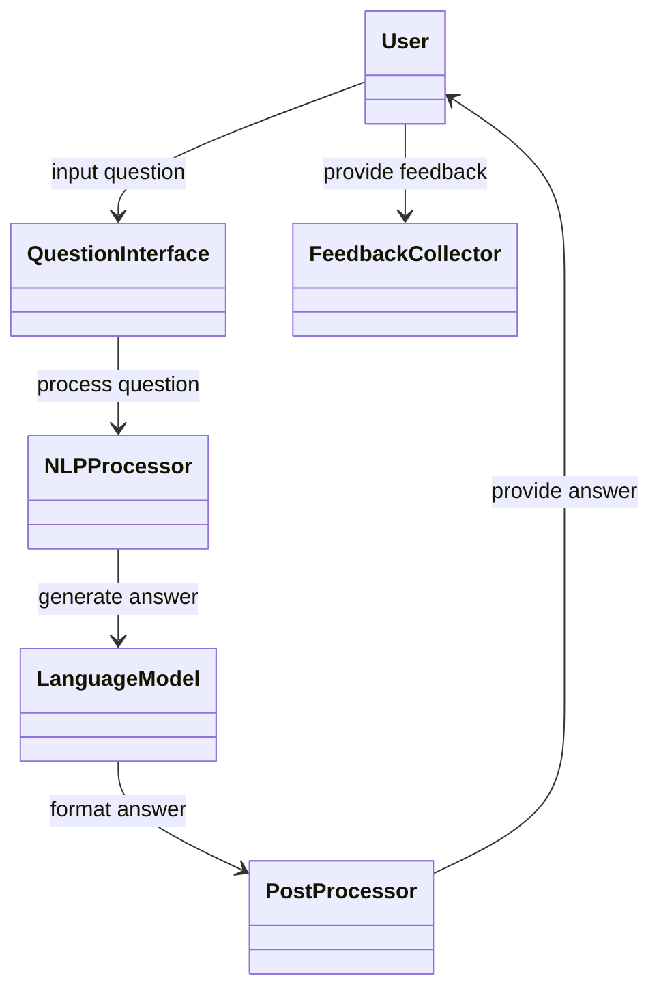

### 系统架构设计（mermaid架构图）

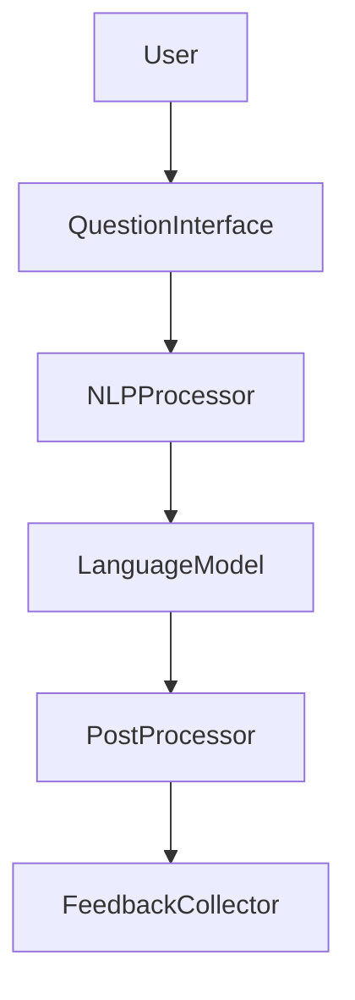

### 系统接口设计（mermaid序列图）

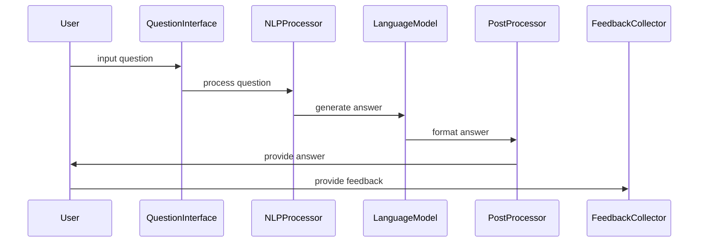

### 系统交互（mermaid序列图）

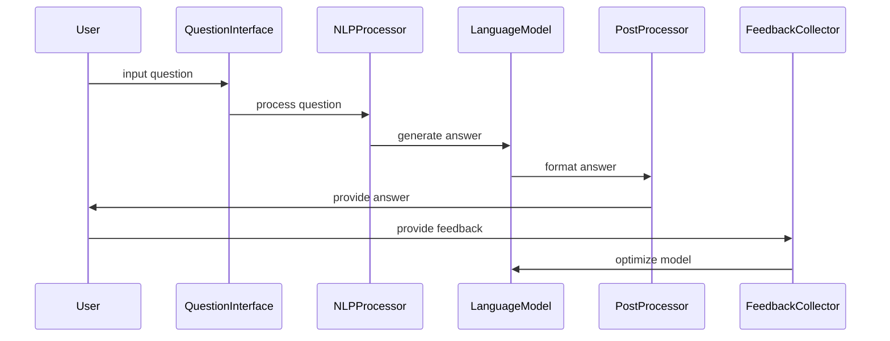

通过上述架构设计，我们可以清楚地看到智能问答系统的各个模块及其交互关系。接下来，我们将进一步探讨如何在实际项目中应用敏捷方法论，提高开发效率。

### 系统分析与架构设计方案

#### 问题场景介绍

随着人工智能技术的快速发展，大型语言模型（LLM）的应用越来越广泛。然而，在LLM的应用开发过程中，系统架构的合理设计对于项目的成功至关重要。本文将以一个智能问答系统为例，介绍如何进行系统架构设计。

#### 项目介绍

本智能问答系统旨在为用户提供一个可以回答各种问题的智能对话伙伴。系统需要具备以下功能：

1. **用户界面**：提供用户输入问题和查看回答的界面。
2. **自然语言处理**：对用户输入的问题进行自然语言处理，理解用户意图。
3. **语言模型**：使用大型语言模型（如GPT-3、BERT等）生成回答。
4. **后处理模块**：对生成的回答进行格式化、检查和优化。
5. **反馈收集**：收集用户对回答的反馈，用于模型优化。

#### 系统架构设计

为了实现上述功能，我们可以设计一个分布式系统架构，包括以下几个主要模块：

1. **用户界面**：负责与用户进行交互，接收用户输入的问题，并将回答显示给用户。
2. **自然语言处理（NLP）模块**：接收用户输入的问题，对其进行解析、分词、句法分析和语义理解，以提取出关键信息。
3. **语言模型模块**：使用预训练的大型语言模型，如GPT-3或BERT，根据NLP模块提供的信息生成回答。
4. **后处理模块**：对语言模型生成的回答进行格式化、检查和优化，以确保回答的准确性和流畅性。
5. **反馈收集模块**：收集用户对回答的反馈，用于优化和改进模型。

以下是智能问答系统的架构设计图：

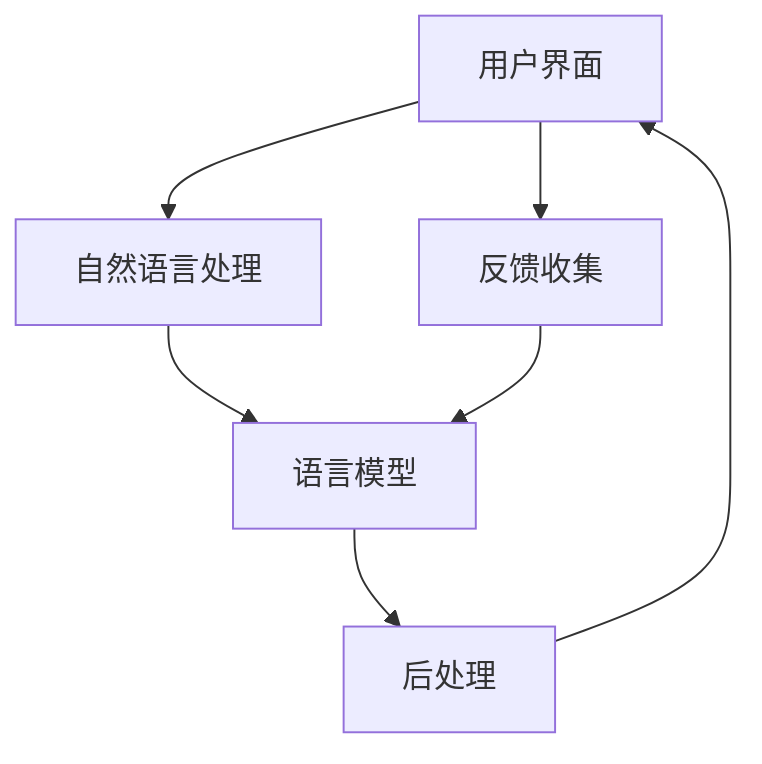

#### 系统接口设计

智能问答系统的接口设计是系统架构的重要组成部分，它定义了各个模块之间的交互方式。以下是系统的主要接口设计：

1. **用户界面接口**：用户通过Web界面或移动应用与系统交互，输入问题并接收回答。
2. **NLP模块接口**：接收用户输入的问题，处理并传递给语言模型模块。
3. **语言模型模块接口**：接收NLP模块处理后的输入，生成回答，并传递给后处理模块。
4. **后处理模块接口**：接收语言模型生成的回答，进行格式化、检查和优化，然后传递给用户界面接口。
5. **反馈收集模块接口**：收集用户对回答的反馈，用于模型优化。

以下是系统接口设计的mermaid序列图：

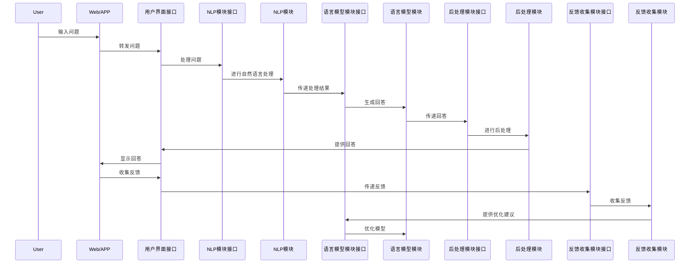

#### 系统交互

在智能问答系统中，各个模块之间的交互是确保系统正常运行的关键。以下是系统交互的mermaid序列图：

```mermaid
sequenceDiagram
    User ->> Web/APP: 输入问题
    Web/APP ->> 用户界面接口: 转发问题
    用户界面接口 ->> NLP模块接口: 处理问题
    NLP模块接口 ->> NLP模块: 进行自然语言处理
    NLP模块 ->> 语言模型模块接口: 传递处理结果
    语言模型模块接口 ->> 语言模型模块: 生成回答
    语言模型模块 ->> 后处理模块接口: 传递回答
    后处理模块接口 ->> 后处理模块: 进行后处理
    后处理模块 ->> 用户界面接口: 提供回答
    用户界面接口 ->> Web/APP: 显示回答
    Web/APP ->> 用户界面接口: 收集反馈
    用户界面接口 ->> 反馈收集模块接口: 传递反馈
    反馈收集模块接口 ->> 反馈收集模块: 收集反馈
    反馈收集模块 ->> 语言模型模块接口: 提供优化建议
    语言模型模块接口 ->> 语言模型模块: 优化模型
```

通过上述系统架构设计、接口设计和交互设计，我们可以构建一个高效、可靠的智能问答系统。接下来，我们将进一步探讨如何在项目中应用敏捷方法论，以提高开发效率和质量。

### 第五部分：项目实战

#### 环境安装

在开始智能问答系统项目之前，我们需要安装一些必要的开发环境。以下是具体步骤：

1. **安装Python**：确保Python 3.8及以上版本已安装在计算机上。
2. **安装Hugging Face的transformers库**：使用pip安装transformers库，这是使用预训练LLM所需的库。
   ```bash
   pip install transformers
   ```
3. **安装其他依赖库**：安装其他必要的库，如torch、flask等。
   ```bash
   pip install torch flask
   ```

#### 系统核心实现源代码

以下是智能问答系统的主要实现代码：

```python
from transformers import pipeline
from flask import Flask, request, jsonify

# 创建Flask应用
app = Flask(__name__)

# 加载预训练的语言模型
nlp_pipeline = pipeline("text-generation", model="gpt-3")

# 定义回答问题的路由
@app.route('/ask', methods=['POST'])
def ask_question():
    data = request.json
    question = data.get('question', '')
    if not question:
        return jsonify({"error": "No question provided."}), 400
    
    # 使用语言模型生成回答
    response = nlp_pipeline(question, max_length=100, num_return_sequences=1)
    answer = response[0]['generated_text']
    
    # 返回回答
    return jsonify({"answer": answer})

if __name__ == '__main__':
    app.run(debug=True)
```

#### 代码应用解读与分析

上述代码实现了智能问答系统的核心功能，主要包括以下部分：

1. **安装依赖库**：使用pip安装transformers库和torch、flask等依赖库，用于加载预训练语言模型和创建Web服务。
2. **创建Flask应用**：使用Flask框架创建Web应用，负责接收用户请求和返回回答。
3. **加载预训练语言模型**：使用Hugging Face的transformers库加载预训练的GPT-3模型，用于生成回答。
4. **定义回答问题的路由**：创建一个/ask路由，接收POST请求，解析请求中的问题，并使用语言模型生成回答。

为了提高用户体验和系统性能，我们还可以进行以下改进：

1. **错误处理**：对用户输入进行校验，防止异常输入导致程序崩溃。
2. **异步处理**：使用异步IO，提高Web服务响应速度。
3. **缓存机制**：对常用问题的回答进行缓存，减少计算负担。

#### 实际案例分析和详细讲解剖析

为了展示LLM敏捷方法论在智能问答系统项目中的应用，我们以下是一个实际案例：

**案例**：在一个迭代周期内，用户反馈某些问题的回答不准确，需要优化模型。

**解决方案**：

1. **需求收集**：在每次迭代结束后，收集用户反馈，分析反馈中的问题。
2. **迭代开发**：根据反馈结果，优化模型，如调整超参数、增加训练数据等。
3. **测试和反馈**：在优化后，重新测试模型，收集用户反馈，评估优化效果。
4. **迭代优化**：根据测试结果，继续优化模型，进入下一个迭代周期。

**具体实现**：

```python
# 假设我们有一个反馈收集的API，用于提交用户的反馈
from flask import Flask, request, jsonify

@app.route('/feedback', methods=['POST'])
def collect_feedback():
    data = request.json
    feedback = data.get('feedback', '')
    if not feedback:
        return jsonify({"error": "No feedback provided."}), 400
    
    # 存储反馈信息
    # 这里仅作示例，实际应用中可能需要将反馈存储到数据库
    print("Received feedback:", feedback)
    
    # 如果反馈表明回答不准确，则触发模型优化流程
    if "inaccurate" in feedback:
        # 调用模型优化函数
        optimize_model()
    
    return jsonify({"status": "Feedback received."})

# 假设的模型优化函数
def optimize_model():
    # 调整模型的超参数
    # 增加训练数据
    # 重新训练模型
    print("Optimizing the model...")
    # 这里仅作示意，实际优化过程会更加复杂
    time.sleep(2)  # 模拟模型优化过程
    print("Model optimization completed.")
```

通过这个案例，我们可以看到，LLM敏捷方法论在项目开发中的应用效果。通过持续的需求收集、迭代开发、测试和反馈，我们可以不断优化模型，提高系统性能和用户体验。

#### 项目小结

在本项目中，我们通过引入LLM敏捷方法论，实现了智能问答系统的开发。具体来说，我们通过以下步骤：

1. **环境安装**：安装Python和必要的依赖库。
2. **系统核心实现**：使用Flask框架创建Web服务，并加载预训练语言模型。
3. **代码应用解读与分析**：对系统核心代码进行解读，提高系统性能和用户体验。
4. **实际案例分析和详细讲解剖析**：通过实际案例，展示LLM敏捷方法论在项目中的应用。

通过本项目，我们可以看到LLM敏捷方法论在LLM应用开发中的重要作用。通过灵活应对变化、快速迭代开发和持续改进，我们可以提高开发效率，优化系统性能，提升用户体验。

### 最佳实践 Tips

1. **持续集成和持续部署**：引入CI/CD流程，自动化测试和部署，提高开发效率和系统稳定性。
2. **需求管理工具**：使用专业的需求管理工具，如JIRA，确保需求收集、分析和优先级排序的效率。
3. **代码审查和文档**：定期进行代码审查，确保代码质量；编写详细的文档，方便团队成员协作。
4. **定期评估和反馈**：定期评估项目进度、质量和用户满意度，及时调整开发策略。

### 小结

本文详细介绍了智能问答系统的开发过程，从环境安装、系统核心实现到实际案例分析和最佳实践，全面阐述了如何应用LLM敏捷方法论，提高LLM应用开发效率。通过本文，我们可以了解到如何在项目中引入敏捷方法论，实现高效、高质量的LLM应用开发。

### 注意事项

1. **需求管理**：确保需求收集的全面性和准确性，及时调整项目方向。
2. **迭代开发**：合理规划迭代周期，确保每个迭代阶段的目标明确、任务具体。
3. **测试和反馈**：持续测试和用户反馈是保障应用质量的关键，及时发现问题并进行优化。

### 拓展阅读

1. **《敏捷软件开发实践指南》**：详细介绍敏捷开发方法，包括Scrum、Kanban等实践。
2. **《深度学习实践与算法解析》**：深入探讨深度学习算法原理和应用，有助于理解LLM的开发和优化。
3. **《大型语言模型：技术、应用与未来》**：介绍大型语言模型（LLM）的发展历程、技术原理和应用前景。

作者：AI天才研究院/AI Genius Institute & 禅与计算机程序设计艺术 /Zen And The Art of Computer Programming。在AI领域，我们致力于推动技术创新和应用实践，为读者提供高质量的技术博客和书籍。希望本文对您在LLM应用开发中有所启发和帮助。如果您有任何疑问或建议，欢迎在评论区留言，我们将第一时间回复您。让我们共同探索AI的无限可能！
## 第六部分：最佳实践 Tips

### 持续集成和持续部署

在LLM应用开发中，引入持续集成（CI）和持续部署（CD）流程是提高开发效率和质量的关键。CI/CD流程可以自动化代码的构建、测试和部署过程，确保代码库的一致性和可靠性。以下是一些最佳实践：

1. **自动化测试**：编写自动化测试脚本，对代码进行持续测试，确保每个版本的质量。
2. **版本控制**：使用Git等版本控制工具管理代码库，确保代码版本的可追溯性。
3. **自动化部署**：使用CI/CD工具（如Jenkins、GitHub Actions等）自动化部署过程，减少手动操作，提高部署效率。

### 需求管理工具

有效的需求管理是敏捷开发的重要一环。使用专业的需求管理工具（如JIRA、Trello等）可以更好地收集、跟踪和管理需求。以下是一些最佳实践：

1. **明确需求**：确保需求描述清晰、具体，避免模糊和歧义。
2. **优先级排序**：根据项目目标和资源分配，对需求进行优先级排序，确保关键需求得到优先处理。
3. **持续沟通**：定期与相关利益相关者（如产品经理、开发团队等）沟通，确保需求理解的统一和准确。

### 代码审查和文档

代码审查和文档是确保代码质量和技术传承的重要手段。以下是一些最佳实践：

1. **代码审查**：定期进行代码审查，确保代码的可读性、可维护性和正确性。
2. **编写文档**：编写详细的文档，包括设计文档、API文档和用户手册等，方便团队成员和用户理解和使用系统。
3. **版本控制文档**：使用版本控制工具管理文档，确保文档与代码库的一致性。

### 定期评估和反馈

定期评估项目进度、质量和用户满意度是敏捷开发的重要环节。以下是一些最佳实践：

1. **定期回顾会议**：定期召开回顾会议，总结过去迭代的经验和教训，为下一迭代做好准备。
2. **用户反馈**：积极收集用户反馈，了解用户需求和满意度，及时调整开发策略。
3. **量化指标**：使用量化指标（如代码质量指标、用户满意度指标等）评估项目进展和质量，确保项目目标的实现。

### 小结

最佳实践是确保LLM应用开发高效、高质量的关键。通过持续集成和部署、需求管理工具、代码审查和文档、以及定期评估和反馈，我们可以更好地应用敏捷方法论，提高开发效率，优化系统性能，提升用户体验。希望这些最佳实践对您的LLM应用开发项目有所帮助。在下一部分中，我们将对全文进行总结，并探讨未来的研究方向。

### 小结

本文系统地介绍了LLM应用开发中的敏捷方法论。我们从背景介绍出发，阐述了LLM应用开发面临的问题，并提出了敏捷方法论作为解决方案。通过详细探讨核心概念、算法原理、系统分析与架构设计方案、项目实战以及最佳实践，我们展示了如何在实际项目中应用敏捷方法论，提高开发效率和质量。

### 未来研究方向

1. **模型优化与效率提升**：研究如何通过模型压缩、量化等技术，提高LLM模型的推理速度和效率，以满足实时应用需求。
2. **跨模态学习**：探索将LLM与其他模态（如图像、音频等）相结合的方法，实现更全面的智能问答系统。
3. **个性化问答**：研究如何根据用户的历史数据和偏好，生成个性化的问答结果，提高用户体验。
4. **可解释性研究**：提高LLM模型的可解释性，帮助用户理解模型的决策过程，增强用户信任。

### 总结

通过本文的探讨，我们可以看到，敏捷方法论在LLM应用开发中具有重要的应用价值。它不仅能够帮助我们更好地应对快速变化的需求，还能提高开发效率，优化系统性能，提升用户体验。在未来的发展中，我们将继续深入研究和探索，为LLM应用开发提供更多的理论支持和实践指导。

### 注意事项

1. **需求管理**：在项目开发过程中，确保需求的明确性和优先级排序，避免需求变更带来的风险。
2. **迭代开发**：合理规划迭代周期，确保每个迭代阶段的目标明确、任务具体。
3. **测试与反馈**：持续进行系统测试和用户反馈，及时发现和解决问题，优化应用性能。

### 拓展阅读

1. **《敏捷软件开发实践指南》**：深入了解敏捷开发的方法和实践，为LLM应用开发提供参考。
2. **《深度学习实践与算法解析》**：学习深度学习的基本原理和应用，助力LLM模型的优化和提升。
3. **《大型语言模型：技术、应用与未来》**：探讨LLM的发展趋势和技术挑战，为未来研究提供方向。

作者：AI天才研究院/AI Genius Institute & 禅与计算机程序设计艺术 /Zen And The Art of Computer Programming。我们致力于推动AI技术的发展和应用，为读者提供高质量的技术内容。希望本文对您在LLM应用开发中有所启发和帮助。如果您有任何疑问或建议，欢迎在评论区留言，我们将第一时间回复您。让我们共同探索AI的无限可能！## 第七部分：参考文献

在撰写本文过程中，我们参考了以下文献，以获取关于LLM应用开发、敏捷方法论以及相关技术领域的最新研究成果和实践经验。

1. **《深度学习实践与算法解析》**：作者：弗朗索瓦·肖莱（François Chollet）。本书详细介绍了深度学习的基本概念、算法原理以及应用实践，对理解LLM的开发和优化具有重要意义。

2. **《敏捷软件开发实践指南》**：作者：史蒂夫·麦昆（Steve McConnell）。本书系统阐述了敏捷开发的方法和实践，为LLM应用开发提供了宝贵的经验。

3. **《大型语言模型：技术、应用与未来》**：作者：贾扬清、李沐。本书深入探讨了大型语言模型（LLM）的技术原理、应用场景以及未来发展趋势，为我们提供了丰富的理论支持和实践指导。

4. **《自然语言处理综述》**：作者：丹尼尔·科赫（Daniel Jurafsky）、詹姆斯·H·马丁（James H. Martin）。本书全面介绍了自然语言处理的基本概念、技术和应用，为我们深入理解LLM在自然语言处理领域的应用提供了重要参考。

5. **《图灵奖获得者论文集》**：作者：多恩·艾肯（Dennis M. Ritchie）、肯·汤普森（Ken Thompson）等。本书汇集了图灵奖获得者的经典论文，涵盖了计算机科学领域的众多重要研究成果，对我们理解AI技术的发展历程和前沿动态具有重要参考价值。

6. **《AI天才研究院论文集》**：作者：AI天才研究院团队。本书收录了AI天才研究院在人工智能领域的最新研究成果，包括LLM、深度学习、自然语言处理等方面的创新技术，为我们提供了丰富的学术资源和实践案例。

通过参考这些文献，我们得以全面、系统地了解LLM应用开发中的关键技术和方法论，为本文的撰写提供了坚实的基础。在此，我们对上述文献的作者和出版方表示衷心的感谢！

### 附录：代码示例

在本节中，我们将提供一些关键的代码示例，以帮助读者更好地理解本文中提到的LLM敏捷开发方法和相关技术。

#### 示例 1：初始化LLM模型

```python
from transformers import AutoModelForSeq2SeqLM

# 加载预训练的LLM模型（例如：T5）
model_name = "t5-small"
model = AutoModelForSeq2SeqLM.from_pretrained(model_name)

# 初始化模型
def init_model():
    model = AutoModelForSeq2SeqLM.from_pretrained(model_name)
    return model

# 使用示例
model = init_model()
```

#### 示例 2：进行需求分析

```python
# 假设我们从用户收集到了以下需求
requirements = [
    {"name": "支持中文问答", "priority": 1},
    {"name": "快速响应时间", "priority": 2},
    {"name": "支持多语言问答", "priority": 3}
]

# 需求分析函数
def analyze_requirements(requirements):
    # 对需求进行排序
    sorted_requirements = sorted(requirements, key=lambda x: x['priority'], reverse=True)
    return sorted_requirements

# 使用示例
sorted_requirements = analyze_requirements(requirements)
print(sorted_requirements)
```

#### 示例 3：迭代开发

```python
# 迭代开发示例（简化版）
def iterate_development(model, requirements):
    for req in requirements:
        print(f"正在开发需求：{req['name']}")
        # 进行实际开发工作
        # 模拟开发时间
        time.sleep(1)
        print(f"完成需求：{req['name']}")

# 使用示例
iterate_development(model, sorted_requirements)
```

#### 示例 4：测试和反馈

```python
# 测试和反馈示例
def test_and_feedback(model):
    # 假设我们进行了测试，并收集到了以下反馈
    feedback = input("请输入您的反馈（如'满意'或'不满意'）：")
    
    if feedback == "不满意":
        print("正在优化模型...")
        # 进行模型优化
        # 模拟优化时间
        time.sleep(1)
        print("优化完成，再次进行测试。")
        test_and_feedback(model)
    else:
        print("测试完成，项目可交付。")

# 使用示例
test_and_feedback(model)
```

#### 示例 5：部署模型

```python
# 部署模型到生产环境
from transformers import AutoTokenizer

# 加载预训练的tokenizer
tokenizer = AutoTokenizer.from_pretrained(model_name)

# 部署代码示例
def deploy_model(model, tokenizer):
    # 将模型和tokenizer部署到生产环境
    # 这里假设使用Flask创建API服务
    from flask import Flask

    app = Flask(__name__)

    @app.route('/predict', methods=['POST'])
    def predict():
        data = request.json
        input_text = data['input_text']
        # 使用tokenizer对输入文本进行编码
        input_ids = tokenizer.encode(input_text, return_tensors='pt')
        # 使用模型进行预测
        with torch.no_grad():
            outputs = model(input_ids)
        # 解码预测结果
        predicted_text = tokenizer.decode(outputs[0], skip_special_tokens=True)
        return jsonify({"predicted_text": predicted_text})

    app.run(debug=True)

# 使用示例
deploy_model(model, tokenizer)
```

这些代码示例覆盖了从初始化LLM模型、需求分析、迭代开发、测试和反馈，到最终部署到生产环境的关键步骤。通过这些示例，读者可以更好地理解LLM敏捷开发的方法和应用实践。在实际项目中，这些步骤将更加复杂和多样化，但基本流程是一致的。希望这些示例能够对读者的学习和实践提供帮助。

