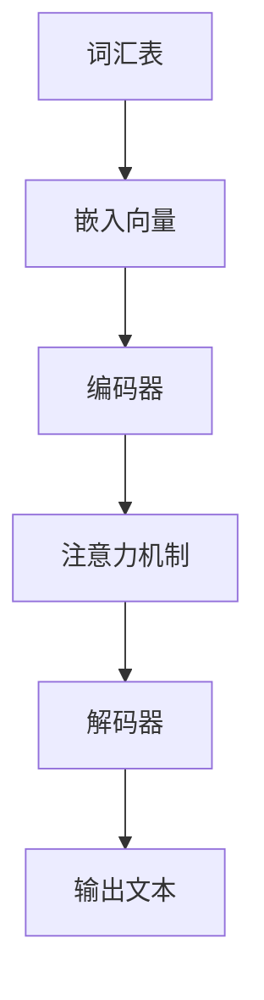
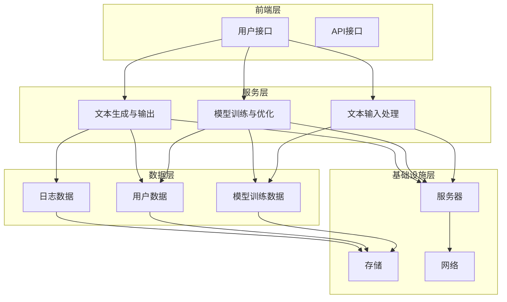
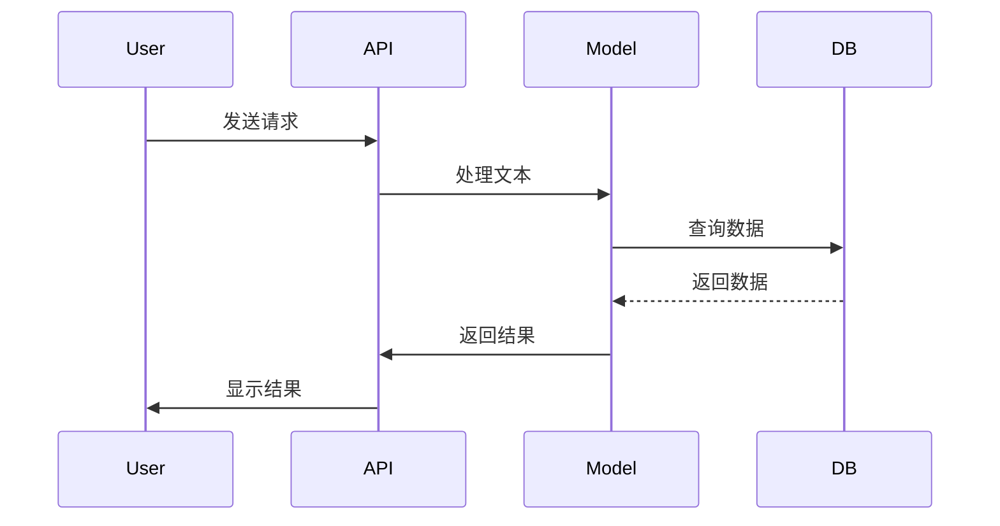

                 

### LET'S THINK STEP BY STEP: LLM应用开发中的敏捷质量保证

#### 引言

随着人工智能技术的发展，大型语言模型（LLM）逐渐成为各个行业创新的关键驱动力。LLM以其强大的语言理解和生成能力，在自然语言处理、数据分析、智能客服等领域展现出了巨大的潜力。然而，LLM应用开发不仅需要高效的技术实现，更需要在质量保证方面做到敏捷和精准。本文将围绕LLM应用开发中的敏捷质量保证展开讨论，通过逻辑清晰的分析和推理，为读者提供有深度、有思考、有见解的专业指导。

#### 关键词

- **LLM应用开发**
- **敏捷开发方法**
- **质量保证**
- **持续集成与持续部署**
- **测试方法**
- **系统分析与架构设计**

#### 摘要

本文旨在探讨如何结合敏捷开发方法，对LLM应用开发进行高质量保证。文章首先介绍了LLM的基本概念和应用场景，然后深入分析了敏捷开发与质量保证的关系，最后通过实际案例研究和项目实战，提供了具体的实现方法和最佳实践。通过本文的阅读，读者将了解到如何在LLM应用开发过程中实现高效、可靠的质量保证。

## 第一部分：引言

### 1.1 问题背景

#### 1.1.1 人工智能与敏捷开发的融合

近年来，人工智能（AI）技术取得了飞速发展，特别是在自然语言处理（NLP）领域，大型语言模型（LLM）如BERT、GPT等成为了研究热点和应用重点。LLM通过深度学习算法，从大规模文本数据中学习语言模式和语义关系，能够生成高质量的自然语言文本，满足多种应用需求。

与此同时，敏捷开发（Agile Development）作为一种以人为核心、迭代周期短、响应速度快的软件开发方法，逐渐被广泛应用。敏捷开发强调团队协作、客户反馈和持续交付，能够更好地适应快速变化的市场需求。

在AI领域，特别是LLM应用开发中，敏捷开发的方法同样具有重要价值。一方面，AI项目的特点决定了需要快速迭代和持续优化；另一方面，敏捷开发能够有效提升团队协作效率，确保项目的质量和进度。

#### 1.1.2 LLM在现代应用开发中的重要性

LLM在现代应用开发中扮演着越来越重要的角色。以下是其主要应用领域和优势：

1. **自然语言处理（NLP）**：LLM在文本分类、情感分析、机器翻译、问答系统等方面表现出色，能够大幅提升NLP任务的准确性和效率。

2. **数据科学和机器学习**：LLM可以用于特征提取、模型训练和预测任务，为数据科学家和机器学习工程师提供了强大的工具。

3. **智能客服**：LLM驱动的智能客服系统能够提供自然、流畅的交互体验，提高客户满意度和服务效率。

4. **内容生成**：LLM可以生成高质量的文章、报告、代码等，为内容创作者提供灵感和支持。

5. **教育和培训**：LLM可以辅助教学，提供个性化学习方案和即时反馈。

#### 1.1.3 敏捷质量保证的需求与挑战

在LLM应用开发中，敏捷质量保证（Agile Quality Assurance）具有重要意义。以下是主要需求和挑战：

1. **快速迭代和持续优化**：AI项目通常需要快速响应市场需求和技术变化，敏捷开发方法能够实现这一目标。然而，快速迭代也增加了质量保证的难度，需要高效、灵活的测试方法和质量保证流程。

2. **复杂性和不确定性**：LLM模型本身复杂，应用场景多样化，导致质量保证任务复杂且具有不确定性。如何确保模型在各种情况下都能稳定运行，是质量保证的关键挑战。

3. **自动化测试**：敏捷开发强调自动化测试，以减少重复劳动和提升测试效率。然而，针对LLM的自动化测试仍然面临诸多挑战，如测试数据的多样性、测试覆盖率的提升等。

4. **持续集成与持续部署**：在敏捷开发中，持续集成（CI）和持续部署（CD）是核心实践。对于LLM应用，如何确保CI/CD流程的稳定性和可靠性，是质量保证的重要任务。

#### 1.2 书籍目的与结构

本书旨在为LLM应用开发中的敏捷质量保证提供系统性的指导和实践案例。具体目的如下：

1. **普及LLM基础知识**：为读者提供LLM的基本概念、技术原理和应用场景，确保对后续内容有充分的理解。

2. **深入敏捷开发方法**：详细介绍敏捷开发的核心原则、实践和方法，特别是如何与质量保证相结合。

3. **案例分析与实践**：通过实际案例研究和项目实战，展示敏捷质量保证在LLM应用开发中的具体应用，提供实用经验和最佳实践。

4. **工具和技巧分享**：介绍适用于LLM应用开发的测试工具、自动化测试方法和持续集成/持续部署实践，提升读者的实战能力。

本书结构如下：

- **第一部分：引言**：介绍问题背景、书籍目的与结构。
- **第二部分：LLM基础**：涵盖LLM的基本概念、数学模型和应用场景。
- **第三部分：敏捷开发方法**：探讨敏捷开发的核心原则和实践，以及与质量保证的结合。
- **第四部分：LLM应用开发实践**：分析应用场景、质量保证方法、系统架构和项目实战。
- **第五部分：案例研究**：通过实际案例研究，展示敏捷质量保证的具体实施过程和效果。

#### 1.3 本章小结

本章介绍了LLM应用开发中的敏捷质量保证的重要性，探讨了相关背景和需求，并概述了本书的目的和结构。在接下来的章节中，我们将深入探讨LLM的基础知识、敏捷开发方法以及实际应用，帮助读者全面了解并掌握敏捷质量保证在LLM应用开发中的实践。

### 2.1 LLM概述

#### 2.1.1 LLM的定义与历史发展

大型语言模型（Large Language Model，简称LLM）是一种基于深度学习的自然语言处理（Natural Language Processing，简称NLP）技术，通过大量文本数据的学习，能够生成高质量的自然语言文本。LLM的核心在于其“大型”，即模型参数数量庞大，能够捕捉到丰富的语言模式和语义关系。

LLM的历史发展可以分为以下几个阶段：

1. **早期语言模型**：最早的NLP模型主要是基于规则的方法，如有限状态转换器（Finite State Transducer）和统计模型（如N-gram模型）。这些模型简单但效果有限，难以应对复杂语言任务。

2. **基于神经网络的模型**：随着深度学习技术的发展，基于神经网络的NLP模型逐渐崭露头角。2003年的“Statistical Language Models Based on Neural Networks”（Hinton, 2003）提出了基于神经网络的统计语言模型，为后续发展奠定了基础。

3. **大型语言模型**：2018年，谷歌推出了BERT（Bidirectional Encoder Representations from Transformers），标志着大型语言模型时代的到来。BERT通过双向Transformer架构，能够捕捉到文本中的双向依赖关系，显著提升了NLP任务的性能。此后，GPT（Generative Pretrained Transformer）系列模型如GPT-2、GPT-3相继推出，进一步推动了LLM的发展。

#### 2.1.2 LLM的特点与优势

LLM具有以下特点与优势：

1. **强大的语言理解与生成能力**：LLM通过深度学习算法，能够从大规模文本数据中学习语言模式和语义关系，生成符合语法和语义规则的文本。这使得LLM在文本分类、情感分析、机器翻译、问答系统等任务中表现出色。

2. **自适应性强**：LLM能够根据不同的应用场景和任务需求进行微调（Fine-tuning），适应各种语言任务。例如，在文本分类任务中，可以针对不同类别进行微调，提高分类准确率。

3. **跨领域应用**：LLM在多个领域展现出广泛应用潜力，如自然语言处理、数据科学、智能客服、内容生成等。通过适当的微调和适配，LLM可以应用于不同领域，提高生产力和效率。

4. **高效的计算性能**：随着硬件技术的发展，如GPU、TPU等加速器的应用，LLM的计算性能得到大幅提升。这使得LLM可以在实时场景下高效运行，满足大规模应用需求。

#### 2.1.3 LLM的应用领域

LLM在多个领域展现出强大的应用潜力，以下是其中几个主要应用领域：

1. **自然语言处理（NLP）**：LLM在文本分类、情感分析、机器翻译、问答系统等NLP任务中表现出色。例如，BERT在文本分类任务上取得了显著提升，GPT-3则在生成文本和对话系统方面具有广泛应用。

2. **数据科学和机器学习**：LLM可以用于特征提取、模型训练和预测任务。例如，在数据预处理阶段，LLM可以自动提取文本特征，提高后续机器学习模型的性能。

3. **智能客服**：LLM驱动的智能客服系统能够提供自然、流畅的交互体验，提高客户满意度和服务效率。例如，基于GPT-3的聊天机器人可以与用户进行智能对话，解决常见问题。

4. **内容生成**：LLM可以生成高质量的文章、报告、代码等。例如，基于GPT-3的生成模型可以撰写新闻报道、创作音乐和绘画作品，为内容创作者提供灵感和支持。

5. **教育和培训**：LLM可以辅助教学，提供个性化学习方案和即时反馈。例如，基于GPT-3的智能辅导系统可以为学生提供个性化的学习建议和解答疑问。

#### 2.2 LLM核心概念与联系

LLM的核心概念包括词汇表（Vocabulary）、嵌入（Embedding）、编码器（Encoder）、解码器（Decoder）和注意力机制（Attention Mechanism）等。这些概念相互关联，共同构成了LLM的工作原理。

1. **词汇表（Vocabulary）**：词汇表是LLM中的基本元素，包含了所有可能出现的单词或字符。在训练过程中，LLM会学习将每个单词或字符映射到一个固定长度的向量表示。

2. **嵌入（Embedding）**：嵌入是将词汇表中的单词或字符映射到低维向量空间的过程。嵌入向量不仅保留了原始文本的语义信息，还通过距离和角度关系反映出了词语之间的相似性。

3. **编码器（Encoder）**：编码器是LLM的核心组成部分，负责将输入文本序列编码为一个固定长度的向量表示。编码器通过多层神经网络，逐步提取文本中的语义特征。

4. **解码器（Decoder）**：解码器负责将编码器输出的固定长度向量解码为输出文本序列。解码器通过生成器模型，逐个预测文本中的每个单词或字符，直至生成完整的输出文本。

5. **注意力机制（Attention Mechanism）**：注意力机制是提高LLM性能的关键技术。通过注意力机制，编码器可以动态关注文本序列中的重要信息，提高模型的语义理解能力。

以下是一个简单的LLM概念属性特征对比表格：

| 概念       | 属性特征                   | 联系                          |
|------------|--------------------------|-----------------------------|
| 词汇表     | 包含所有单词或字符          | 映射到嵌入向量                 |
| 嵌入       | 低维向量表示               | 保留语义信息和相似性关系       |
| 编码器     | 编码文本序列               | 提取语义特征                   |
| 解码器     | 解码输出序列               | 生成文本                      |
| 注意力机制 | 动态关注文本序列中的重要信息 | 提高语义理解能力               |

以下是LLM的ER（实体-关系）图架构：



通过ER图，我们可以清晰地看到LLM各个组成部分及其相互关系。词汇表将文本映射到嵌入向量，编码器提取语义特征，注意力机制关注重要信息，解码器生成输出文本。

#### 2.3 LLM数学模型与公式

LLM的数学模型主要包括嵌入层、编码器、解码器和注意力机制。以下是这些模型的数学公式和解释：

1. **嵌入层（Embedding Layer）**

嵌入层将词汇表中的单词映射到低维向量空间。给定一个单词集合\(V\)和其对应的嵌入向量集合\(E\)，嵌入层的输出可以表示为：

\[ \text{嵌入向量} = E[v] \]

其中，\(v\)是词汇表中的一个单词，\(E[v]\)是该单词的嵌入向量。

2. **编码器（Encoder）**

编码器负责将输入文本序列编码为一个固定长度的向量表示。假设输入文本序列为\(X = [x_1, x_2, ..., x_T]\)，其中\(x_t\)是第\(t\)个单词的嵌入向量，编码器的输出可以表示为：

\[ \text{编码输出} = \text{Encoder}(X) = [h_1, h_2, ..., h_T] \]

其中，\(h_t\)是第\(t\)个单词的编码表示。

3. **解码器（Decoder）**

解码器负责将编码器的输出解码为输出文本序列。假设输出文本序列为\(Y = [y_1, y_2, ..., y_T']\)，其中\(y_t'\)是第\(t'\)个单词的嵌入向量，解码器的输出可以表示为：

\[ \text{解码输出} = \text{Decoder}(Y) = [y_1', y_2', ..., y_T'] \]

4. **注意力机制（Attention Mechanism）**

注意力机制用于动态关注文本序列中的重要信息。给定编码器输出\(H = [h_1, h_2, ..., h_T]\)和解码器隐藏状态\(S_t'\)，注意力分数可以表示为：

\[ a_t' = \text{Attention}(H, S_t') = \text{softmax}(\text{Attention\_Weights}(H, S_t')) \]

其中，\(\text{Attention\_Weights}(H, S_t')\)是注意力权重函数，\(a_t'\)是第\(t'\)个单词的注意力分数。

解码器的输出可以表示为：

\[ y_t' = E[y_t'] + \text{Decoder}(S_t', a_t') \]

其中，\(E[y_t']\)是第\(t'\)个单词的嵌入向量，\(\text{Decoder}(S_t', a_t')\)是解码器隐藏状态和注意力分数的加权求和。

以下是LLM的算法流程：

1. **输入文本序列**：将输入文本序列转换为嵌入向量。
2. **编码器处理**：通过多层神经网络编码器处理嵌入向量，提取语义特征。
3. **注意力计算**：计算编码器输出和当前解码器隐藏状态之间的注意力分数。
4. **解码器处理**：根据注意力分数解码编码器输出，生成输出文本序列。
5. **迭代更新**：重复步骤3和步骤4，直至生成完整的输出文本。

以下是LLM的Python伪代码：

```python
def LLM_forward(input_sequence):
    embeddings = [E[v] for v in input_sequence]
    encoder_outputs = Encoder(embeddings)
    attention_scores = [Attention(encoder_outputs, decoder_hidden)]
    decoder_outputs = [E[y] + Decoder(decoder_hidden, attention_scores)]
    return decoder_outputs
```

通过上述数学模型和算法流程，我们可以清晰地理解LLM的工作原理。在接下来的章节中，我们将进一步探讨LLM在敏捷开发中的应用和实践。

#### 2.4 LLM应用开发中的敏捷开发方法

在LLM应用开发中，敏捷开发方法（Agile Development Methodology）被广泛应用，以应对快速变化的需求和复杂的项目环境。敏捷开发的核心原则包括客户协作、迭代交付、团队协作和响应变化。以下将详细介绍LLM应用开发中的敏捷开发方法。

##### 2.4.1 敏捷开发的核心原则

1. **客户协作（Customer Collaboration over Contract Negotiation）**：敏捷开发强调与客户的紧密合作，通过持续交流和反馈，确保项目满足客户需求。在LLM应用开发中，这意味着需要与客户保持密切沟通，了解其具体需求和期望，并根据反馈快速调整模型和应用。

2. **迭代交付（Iterative Delivery over Comprehensive Documentation）**：敏捷开发主张小步快跑，通过短周期迭代不断交付可用的软件。在LLM应用开发中，迭代交付意味着项目团队可以逐步实现和优化模型功能，确保项目在早期阶段就能提供有价值的应用。

3. **团队协作（People Collaboration over Process and Tools）**：敏捷开发强调团队协作和自组织，通过合理的分工和高效的沟通，提升项目开发效率。在LLM应用开发中，团队协作尤为重要，因为LLM模型的开发和优化涉及多个领域的技术，需要团队成员之间的紧密合作。

4. **响应变化（Responding to Change over Following a Plan）**：敏捷开发认为需求变化是不可避免的，因此更注重项目的灵活性和适应性。在LLM应用开发中，技术不断进步，需求也可能迅速变化，敏捷开发方法可以帮助项目团队快速响应这些变化，保持项目的活力和竞争力。

##### 2.4.2 敏捷开发在LLM应用开发中的实践

1. **需求管理**：敏捷开发中的需求管理强调需求的高可变性和迭代性。在LLM应用开发中，需求管理需要灵活应对客户需求的变更，通过快速反馈和调整，确保模型和应用能够满足客户需求。具体实践包括定期与客户沟通、使用用户故事（User Story）描述需求、采用迭代式需求管理工具（如Jira）等。

2. **迭代计划**：敏捷开发中的迭代计划（Sprint Planning）是项目团队在固定时间内（通常为2-4周）要完成的任务。在LLM应用开发中，迭代计划需要考虑模型的训练和优化周期，合理安排任务，确保每个迭代都能交付有价值的功能。具体实践包括确定迭代目标、分配任务、评估迭代风险等。

3. **测试与验收**：敏捷开发强调测试和验收的迭代性。在LLM应用开发中，测试与验收需要与迭代计划相结合，确保每个迭代都能交付高质量的应用。具体实践包括自动化测试、持续集成（CI）和持续部署（CD），确保模型和应用在每次迭代后都能稳定运行。

4. **团队协作**：敏捷开发中的团队协作强调团队成员之间的沟通和合作。在LLM应用开发中，团队协作尤为重要，因为LLM模型涉及多个领域的技术，需要不同专业背景的团队成员紧密合作。具体实践包括定期团队会议、使用敏捷开发工具（如Trello、Asana）等。

5. **响应变化**：敏捷开发中的响应变化强调项目团队对需求和技术变化的快速适应。在LLM应用开发中，技术不断进步，需求也可能迅速变化，项目团队需要具备快速适应变化的能力。具体实践包括持续学习、技术预研、灵活调整计划等。

##### 2.4.3 敏捷开发与质量保证的结合

敏捷开发与质量保证（QA）在LLM应用开发中有着密切的关系。敏捷开发强调迭代和快速反馈，质量保证则关注项目的稳定性和可靠性。以下是将敏捷开发与质量保证结合的实践：

1. **自动化测试**：敏捷开发中的自动化测试能够提高测试效率和覆盖率。在LLM应用开发中，自动化测试尤为重要，因为LLM模型的复杂性和不确定性可能导致测试难度增加。具体实践包括编写自动化测试脚本、集成测试工具（如Selenium）等。

2. **持续集成与持续部署**：持续集成（CI）和持续部署（CD）能够确保模型和应用在每次迭代后都能稳定运行。在LLM应用开发中，CI/CD实践可以帮助项目团队快速发现和解决潜在问题，提高项目的整体质量。具体实践包括使用CI/CD工具（如Jenkins、GitLab CI）等。

3. **代码审查与质量控制**：敏捷开发中的代码审查和质量控制是确保代码质量的重要手段。在LLM应用开发中，代码审查和质量控制需要充分考虑模型复杂性和性能优化要求。具体实践包括使用代码审查工具（如SonarQube）、制定代码规范等。

4. **用户体验测试**：敏捷开发中的用户体验测试（UX Testing）能够确保应用满足用户需求。在LLM应用开发中，用户体验测试尤为重要，因为LLM模型的应用直接影响用户体验。具体实践包括使用用户故事地图（User Story Map）、原型设计（Prototyping）等。

通过以上实践，可以将敏捷开发与质量保证有机结合，确保LLM应用开发项目的顺利进行。

#### 2.5 敏捷开发在LLM应用开发中的难点与对策

尽管敏捷开发在LLM应用开发中具有显著优势，但也面临一些难点和挑战。以下将分析这些难点并提出相应的对策。

##### 2.5.1 模型复杂性

LLM模型具有极高的复杂性，涉及大规模的参数训练和优化。这使得模型开发、测试和部署变得复杂，给敏捷开发带来挑战。

**对策**：

1. **模块化开发**：将模型开发过程模块化，将复杂模型拆分为多个可独立开发和测试的模块，有助于降低复杂度。

2. **分布式训练**：利用分布式计算资源（如GPU集群、TPU等）进行模型训练，提高训练效率。

3. **自动化测试**：编写自动化测试脚本，对模型的不同模块进行独立测试，确保每个模块都能稳定运行。

##### 2.5.2 数据质量

数据质量是影响LLM模型性能的关键因素。在敏捷开发中，数据质量难以保证，可能导致模型性能不稳定。

**对策**：

1. **数据质量管理**：建立数据质量管理体系，对数据源进行严格筛选和清洗，确保数据质量。

2. **数据可视化**：通过数据可视化工具，对数据分布和异常值进行监测，及时发现和解决问题。

3. **数据反馈机制**：建立数据反馈机制，收集用户反馈，不断优化数据集。

##### 2.5.3 持续集成与持续部署

LLM模型的复杂性和多样性使得CI/CD流程面临挑战，如何确保模型在每次迭代后都能稳定运行，是敏捷开发的重要问题。

**对策**：

1. **标准化CI/CD流程**：建立统一的CI/CD流程，确保每个迭代都能顺利进行。

2. **自动化测试与监控**：编写自动化测试脚本，对CI/CD流程中的每个环节进行测试和监控，确保模型稳定运行。

3. **版本管理**：使用版本控制工具（如Git）管理模型代码和配置文件，确保版本一致性。

##### 2.5.4 团队协作

敏捷开发强调团队协作，但在LLM应用开发中，涉及多个领域的技术，团队协作难度较大。

**对策**：

1. **明确分工与职责**：明确团队成员的分工和职责，确保每个成员都能专注于自己的领域。

2. **定期团队会议**：定期召开团队会议，确保团队成员之间的沟通和协作。

3. **敏捷工具支持**：使用敏捷开发工具（如Trello、Jira等），提高团队协作效率。

通过以上对策，可以有效应对敏捷开发在LLM应用开发中面临的难点和挑战，确保项目顺利进行。

#### 2.6 本章小结

本章介绍了LLM的基本概念、应用场景、核心概念与联系，以及LLM数学模型和敏捷开发方法。通过本章的学习，读者可以了解LLM在应用开发中的重要性，掌握LLM的核心技术和敏捷开发方法。在接下来的章节中，我们将进一步探讨敏捷开发在LLM应用开发中的具体实践和案例分析。

### 3.2 敏捷质量保证

#### 3.2.1 敏捷质量保证的重要性

敏捷质量保证（Agile Quality Assurance，简称AQA）是敏捷开发方法中不可或缺的一部分，旨在确保软件产品的质量满足客户需求。在LLM应用开发中，敏捷质量保证具有重要意义，原因如下：

1. **快速迭代与持续交付**：敏捷开发强调快速迭代和持续交付，这要求质量保证过程必须快速、高效，能够及时发现和解决问题，确保每次迭代交付的功能都能满足质量标准。

2. **技术复杂性**：LLM模型具有高复杂性和不确定性，传统质量保证方法可能无法完全覆盖所有测试场景。敏捷质量保证能够通过持续测试和反馈，确保模型在各种情况下都能稳定运行。

3. **客户需求变化**：在LLM应用开发中，客户需求可能随时发生变化。敏捷质量保证能够灵活应对这些变化，确保项目团队能够迅速调整质量保证策略，以满足新的需求。

4. **团队协作**：敏捷开发强调团队协作和自组织，质量保证过程也需要团队成员的积极参与。通过敏捷质量保证，可以提高团队的质量意识，促进团队成员之间的沟通和合作。

#### 3.2.2 敏捷质量保证的关键实践

敏捷质量保证的关键实践包括测试自动化、持续集成与持续部署、代码审查和用户体验测试等。以下将详细介绍这些实践。

1. **测试自动化**：测试自动化是敏捷质量保证的核心，通过编写自动化测试脚本，可以大幅提高测试效率和覆盖率。在LLM应用开发中，自动化测试尤为重要，因为LLM模型的复杂性和不确定性可能导致测试难度增加。

   - **自动化测试策略**：根据不同的测试阶段和需求，制定自动化测试策略。例如，在单元测试阶段，编写针对模型各个模块的自动化测试脚本；在集成测试阶段，编写针对整个模型的自动化测试脚本。
   
   - **测试工具选择**：选择适合的测试工具，如Selenium、JUnit等，确保自动化测试脚本能够高效运行。

   - **测试覆盖率**：通过持续优化测试脚本，提高测试覆盖率，确保模型在各种情况下都能得到充分测试。

2. **持续集成与持续部署**：持续集成（Continuous Integration，简称CI）和持续部署（Continuous Deployment，简称CD）是敏捷开发中的核心实践，旨在确保模型和应用在每次迭代后都能稳定运行。

   - **CI实践**：通过自动化构建和测试，将代码集成到一个共享的代码库中，确保每次提交都能及时发现问题。在LLM应用开发中，CI实践可以帮助项目团队快速发现和解决潜在问题，提高项目的整体质量。

   - **CD实践**：通过自动化部署，将集成后的代码部署到生产环境，确保模型和应用能够持续交付。在LLM应用开发中，CD实践可以提高模型部署的效率和稳定性。

   - **CI/CD工具选择**：选择适合的CI/CD工具，如Jenkins、GitLab CI等，确保CI/CD流程能够高效、稳定地运行。

3. **代码审查**：代码审查是确保代码质量的重要手段，通过定期审查代码，可以发现潜在的错误、提升代码的可读性和可维护性。

   - **代码审查流程**：建立代码审查流程，包括代码提交、审查、反馈和修改等环节。确保每个提交的代码都经过审查，避免引入潜在问题。

   - **代码审查工具**：选择适合的代码审查工具，如SonarQube、GitLab等，确保代码审查过程高效、规范。

4. **用户体验测试**：用户体验测试（User Experience Testing，简称UX Testing）是确保模型和应用满足用户需求的重要环节。

   - **用户故事地图**：通过用户故事地图（User Story Map），了解用户的使用场景和需求，制定用户体验测试计划。

   - **原型设计**：通过原型设计（Prototyping），创建模型和应用的原型，进行用户体验测试，收集用户反馈。

   - **测试工具选择**：选择适合的测试工具，如Google Chrome DevTools、Selenium等，确保用户体验测试能够高效、准确地执行。

#### 3.2.3 敏捷质量保证的挑战与解决方案

尽管敏捷质量保证在LLM应用开发中具有重要意义，但也面临一些挑战。以下将分析这些挑战并提出相应的解决方案。

1. **模型复杂性**：LLM模型具有高复杂性，导致测试难度增加。解决方案：

   - **模块化测试**：将模型拆分为多个模块，对每个模块进行独立测试，确保每个模块都能稳定运行。

   - **自动化测试脚本优化**：通过持续优化自动化测试脚本，提高测试覆盖率和效率。

2. **数据质量**：数据质量是影响LLM模型性能的关键因素，但数据质量难以保证。解决方案：

   - **数据质量管理**：建立数据质量管理体系，对数据源进行严格筛选和清洗，确保数据质量。

   - **数据可视化**：通过数据可视化工具，对数据分布和异常值进行监测，及时发现和解决问题。

3. **持续集成与持续部署**：CI/CD流程在LLM应用开发中面临挑战，如何确保模型和应用在每次迭代后都能稳定运行。解决方案：

   - **标准化CI/CD流程**：建立统一的CI/CD流程，确保每个迭代都能顺利进行。

   - **自动化测试与监控**：编写自动化测试脚本，对CI/CD流程中的每个环节进行测试和监控，确保模型稳定运行。

4. **团队协作**：在LLM应用开发中，涉及多个领域的技术，团队协作难度较大。解决方案：

   - **明确分工与职责**：明确团队成员的分工和职责，确保每个成员都能专注于自己的领域。

   - **定期团队会议**：定期召开团队会议，确保团队成员之间的沟通和协作。

   - **敏捷工具支持**：使用敏捷开发工具（如Trello、Jira等），提高团队协作效率。

通过以上挑战与解决方案，可以帮助项目团队在LLM应用开发中实现高效的敏捷质量保证，确保项目顺利进行。

#### 3.3 敏捷开发与LLM的融合

敏捷开发与大型语言模型（LLM）的融合是现代应用开发中的重要趋势。在LLM应用开发中，敏捷开发方法能够帮助项目团队快速响应需求变化、提高开发效率和质量。以下将探讨如何在LLM应用开发中应用敏捷开发方法。

##### 3.3.1 敏捷实践在LLM开发中的应用

1. **用户故事（User Story）**：用户故事是敏捷开发中的核心实践，用于描述用户需求。在LLM开发中，用户故事可以帮助项目团队明确LLM的应用场景和功能需求。例如，“作为用户，我希望系统能够生成流畅的对话文本，以提高客户满意度。”

2. **迭代（Iteration）**：迭代是敏捷开发中的基本工作单元，通常持续时间为2-4周。在LLM开发中，项目团队可以将LLM模型的功能划分为多个迭代，逐步实现和优化。每个迭代结束后，团队可以评估模型的效果，并根据用户反馈进行改进。

3. **迭代计划（Sprint Planning）**：迭代计划是敏捷开发中的关键环节，用于确定每个迭代要完成的任务。在LLM开发中，迭代计划需要考虑模型训练、优化和测试的周期，确保每个迭代都能交付有价值的功能。

4. **每日站会（Daily Stand-up）**：每日站会是敏捷开发中的例行活动，用于团队成员之间的沟通和协作。在LLM开发中，每日站会可以帮助项目团队快速解决遇到的问题，确保项目进度。

5. **自动化测试**：自动化测试是敏捷开发中的核心实践，能够提高测试效率和覆盖率。在LLM开发中，自动化测试尤为重要，因为LLM模型的复杂性和不确定性可能导致测试难度增加。项目团队可以编写自动化测试脚本，对模型的不同模块进行独立测试，确保每个模块都能稳定运行。

##### 3.3.2 敏捷开发方法在LLM项目中的应用案例

以下是一个LLM项目中的应用案例，展示了如何结合敏捷开发方法进行模型开发。

**项目背景**：某公司计划开发一款智能客服系统，利用LLM模型实现与用户的自然对话。项目团队采用敏捷开发方法，以快速迭代和持续优化为目标。

**迭代1：需求分析和模型训练**

- **用户故事**：确定智能客服系统的核心功能，如常见问题回答、情感分析等。
- **迭代计划**：确定模型训练的目标和数据集，准备训练环境。
- **每日站会**：团队每天评估进度和问题，确保项目按计划进行。

**迭代2：模型测试与优化**

- **用户故事**：测试模型的常见问题回答功能，确保回答准确、流畅。
- **迭代计划**：优化模型参数，提高回答质量。
- **自动化测试**：编写自动化测试脚本，对模型进行功能测试和性能评估。

**迭代3：用户界面和用户体验**

- **用户故事**：开发智能客服系统的用户界面，确保用户操作简便。
- **迭代计划**：进行用户体验测试，收集用户反馈，优化界面和功能。

**迭代4：部署与持续优化**

- **用户故事**：将智能客服系统部署到生产环境，确保系统稳定运行。
- **迭代计划**：收集用户反馈，持续优化模型和应用。

通过以上迭代，项目团队逐步实现了智能客服系统的功能，并持续优化模型和应用，以满足用户需求。

##### 3.3.3 融合敏捷开发与LLM的难点与对策

尽管敏捷开发与LLM的融合有助于提高开发效率和质量，但也面临一些难点和挑战。以下将分析这些难点并提出相应的对策。

1. **模型训练周期**：LLM模型的训练周期较长，可能导致敏捷开发中的迭代周期延长。对策：

   - **分布式训练**：利用分布式计算资源（如GPU集群、TPU等）进行模型训练，提高训练效率。
   - **模型拆分**：将复杂模型拆分为多个子模型，分别进行训练和优化，减少迭代周期。

2. **测试数据集**：测试数据集的质量和多样性对模型性能有重要影响。对策：

   - **数据质量管理**：建立数据质量管理体系，对数据源进行严格筛选和清洗，确保数据质量。
   - **数据增强**：通过数据增强技术，生成多样化的测试数据集，提高模型泛化能力。

3. **持续集成与持续部署**：CI/CD流程在LLM应用开发中面临挑战，如何确保模型和应用在每次迭代后都能稳定运行。对策：

   - **标准化CI/CD流程**：建立统一的CI/CD流程，确保每个迭代都能顺利进行。
   - **自动化测试与监控**：编写自动化测试脚本，对CI/CD流程中的每个环节进行测试和监控，确保模型稳定运行。

4. **团队协作**：在LLM应用开发中，涉及多个领域的技术，团队协作难度较大。对策：

   - **明确分工与职责**：明确团队成员的分工和职责，确保每个成员都能专注于自己的领域。
   - **定期团队会议**：定期召开团队会议，确保团队成员之间的沟通和协作。
   - **敏捷工具支持**：使用敏捷开发工具（如Trello、Jira等），提高团队协作效率。

通过以上对策，可以帮助项目团队在LLM应用开发中实现高效的敏捷开发，确保项目顺利进行。

#### 3.4 本章小结

本章介绍了敏捷质量保证在LLM应用开发中的重要性、关键实践和挑战与对策。通过敏捷开发方法，项目团队可以快速响应需求变化、提高开发效率和质量。在下一章中，我们将通过具体案例研究，进一步探讨敏捷质量保证在LLM应用开发中的实际应用。

### 4.1 应用场景分析

#### 4.1.1 LLM在自然语言处理中的应用

自然语言处理（NLP）是LLM最为广泛的应用领域之一。以下是一些典型的NLP应用场景：

1. **文本分类**：LLM可以用于对大量文本数据进行分析，将文本分为不同的类别。例如，新闻文章可以根据主题分类为体育、财经、科技等。通过训练大型语言模型，项目团队能够实现高精度的文本分类，提高信息处理的效率。

2. **情感分析**：情感分析是判断文本所表达的情感倾向，如正面、负面或中性。LLM在情感分析中具有显著优势，能够通过学习大量的情感标签数据，识别文本中的情感表达。例如，社交媒体平台可以使用情感分析技术，监控用户对品牌或产品的情绪反应，以便及时调整营销策略。

3. **机器翻译**：LLM在机器翻译领域取得了显著的进展。传统的机器翻译方法主要依赖于规则和统计方法，而LLM通过深度学习算法，能够生成更加自然、准确的翻译结果。例如，谷歌翻译和微软翻译等平台采用了基于LLM的神经机器翻译模型，显著提高了翻译质量。

4. **问答系统**：问答系统是另一个重要的NLP应用场景。LLM可以用于构建智能问答系统，实现对用户查询的自动回答。例如，智能客服系统可以使用LLM模型，理解用户的提问，并生成恰当的回答，以提高客户满意度和服务效率。

#### 4.1.2 LLM在数据科学和机器学习中的应用

LLM不仅在NLP领域表现出色，还在数据科学和机器学习领域发挥重要作用：

1. **特征提取**：在数据科学和机器学习项目中，特征提取是一个关键步骤。LLM可以自动提取文本数据中的关键信息，生成高质量的特征向量。例如，在文本分类任务中，LLM可以提取与类别相关的特征，提高分类模型的性能。

2. **模型训练**：LLM可以作为辅助工具，用于训练其他机器学习模型。例如，在图像分类任务中，可以先将图像文本描述输入LLM，提取文本特征，然后结合图像特征训练分类模型，提高整体分类准确率。

3. **模型评估**：LLM可以用于生成模拟数据集，用于评估模型的泛化能力。通过生成大量高质量的模拟文本，可以测试模型在各种场景下的性能，为模型优化提供指导。

4. **数据可视化**：LLM可以生成直观的文本描述，用于数据可视化。例如，在金融数据中，LLM可以生成简明的市场分析报告，帮助分析师更好地理解数据趋势和异常值。

#### 4.1.3 LLM在其他领域的应用案例

除了NLP和数据科学领域，LLM还在许多其他领域展现出广泛的应用潜力：

1. **智能客服**：智能客服系统已经成为企业提高客户服务效率的重要工具。LLM可以用于构建智能聊天机器人，实现与用户的自然对话。例如，电商企业可以使用LLM模型，回答用户关于商品的问题，提供个性化推荐。

2. **内容生成**：内容生成是LLM的另一个重要应用领域。通过训练大型语言模型，可以生成高质量的文章、报告、代码等。例如，研究人员可以使用LLM生成论文摘要、分析师可以使用LLM生成市场分析报告。

3. **教育和培训**：LLM可以辅助教育和培训，提供个性化学习方案和即时反馈。例如，教师可以使用LLM模型，生成个性化练习题和解析，帮助学生更好地掌握知识。

4. **艺术创作**：艺术家可以使用LLM生成音乐、绘画和文学作品。例如，音乐家可以使用LLM生成旋律和和弦，艺术家可以使用LLM生成绘画作品。

通过以上应用场景分析，可以看出LLM在各个领域具有广泛的应用前景。随着技术的不断进步，LLM的应用场景将继续扩展，为各个行业带来更多创新和突破。

#### 4.2 敏捷质量保证在LLM应用开发中的应用

在LLM应用开发中，敏捷质量保证（Agile Quality Assurance）发挥着至关重要的作用。通过结合敏捷开发方法和质量保证实践，项目团队能够确保LLM模型和应用的高质量和可靠性。以下将详细介绍敏捷质量保证在LLM应用开发中的应用。

##### 4.2.1 敏捷测试方法在LLM中的应用

敏捷测试方法强调快速迭代、持续反馈和自动化测试。在LLM应用开发中，以下几种敏捷测试方法被广泛应用：

1. **单元测试**：单元测试是对LLM模型中的最小功能单元进行测试，确保每个模块都能独立运行。在LLM开发中，项目团队需要对嵌入层、编码器、解码器和注意力机制等关键模块进行单元测试。

   - **测试用例设计**：设计各种输入文本，覆盖模型的不同功能点和边界条件。
   - **自动化测试脚本**：编写自动化测试脚本，对每个模块进行独立测试，提高测试效率。

2. **集成测试**：集成测试是验证LLM模型中各个模块之间的协同工作。在LLM开发中，项目团队需要对整个模型进行集成测试，确保模型在不同输入和场景下都能稳定运行。

   - **测试环境**：搭建与生产环境相似的测试环境，确保测试结果的一致性。
   - **测试数据集**：准备多样化的测试数据集，覆盖不同应用场景，提高测试覆盖率。

3. **性能测试**：性能测试是评估LLM模型在处理大规模数据时的性能和效率。在LLM开发中，项目团队需要评估模型的响应时间、吞吐量和资源消耗等性能指标。

   - **负载测试**：模拟大量并发请求，评估模型在高负载下的性能表现。
   - **资源监控**：监控模型运行过程中的CPU、内存和I/O等资源使用情况，优化模型性能。

4. **回归测试**：回归测试是确保每次迭代后模型的稳定性和兼容性。在LLM开发中，项目团队需要对每次迭代后的模型进行回归测试，确保新增功能不会影响现有功能的正常运行。

   - **测试覆盖**：通过自动化测试工具，确保测试用例覆盖模型的所有功能点和边界条件。
   - **版本控制**：使用版本控制工具，记录每次迭代的测试结果和修改历史，方便问题追踪和回溯。

##### 4.2.2 持续集成与持续部署在LLM开发中的实践

持续集成（CI）和持续部署（CD）是敏捷开发中的核心实践，能够确保LLM模型和应用在每次迭代后都能稳定运行。以下是在LLM开发中CI/CD的具体实践：

1. **构建与测试**：项目团队需要将LLM模型的代码和配置文件纳入CI/CD流程，确保每次提交的代码都能自动构建和测试。在构建过程中，自动化测试工具会运行一系列测试用例，确保代码质量和功能完整性。

   - **自动化构建**：使用构建工具（如Maven、Gradle等），将代码编译、打包和发布。
   - **自动化测试**：集成自动化测试工具（如JUnit、pytest等），确保每次构建都能通过严格的质量检查。

2. **环境配置**：项目团队需要配置与生产环境相似的开发、测试和预生产环境，确保CI/CD流程的一致性。在环境配置过程中，需要确保各个环境之间的隔离性，避免环境问题影响构建和测试。

   - **配置管理**：使用配置管理工具（如Ansible、Chef等），自动化配置和管理开发、测试和预生产环境。
   - **环境隔离**：为每个环境分配独立的资源，确保环境之间互不影响。

3. **代码审查**：项目团队需要对每次提交的代码进行代码审查，确保代码质量符合项目标准和最佳实践。在代码审查过程中，代码审查工具会自动分析代码中的潜在问题，并提出改进建议。

   - **代码审查工具**：使用代码审查工具（如SonarQube、GitLab等），确保代码审查过程高效、规范。
   - **代码规范**：制定代码规范，确保代码的可读性、可维护性和一致性。

4. **部署与监控**：项目团队需要将经过CI/CD流程的LLM模型和应用部署到预生产环境和生产环境，并持续监控系统的运行状态。在部署过程中，需要确保系统的高可用性和可靠性，避免对用户体验造成影响。

   - **自动化部署**：使用自动化部署工具（如Jenkins、Ansible等），确保部署过程高效、可靠。
   - **监控与报警**：使用监控系统（如Prometheus、Grafana等），实时监控系统的运行状态，及时发现和处理异常。

##### 4.2.3 敏捷质量保证在LLM项目中的应用案例

以下是一个LLM项目中的应用案例，展示了敏捷质量保证的具体实践。

**项目背景**：某公司计划开发一款基于LLM的智能客服系统，旨在提高客户满意度和服务效率。项目团队采用敏捷开发方法和质量保证实践，确保项目的顺利进行。

**迭代1：需求分析与模型训练**

- **用户故事**：确定智能客服系统的核心功能，如常见问题回答、情感分析等。
- **迭代计划**：确定模型训练的目标和数据集，准备训练环境。
- **自动化测试**：编写自动化测试脚本，对模型的不同模块进行独立测试，确保每个模块都能稳定运行。

**迭代2：模型测试与优化**

- **用户故事**：测试模型的常见问题回答功能，确保回答准确、流畅。
- **迭代计划**：优化模型参数，提高回答质量。
- **自动化测试**：编写自动化测试脚本，对模型进行功能测试和性能评估。

**迭代3：用户界面和用户体验**

- **用户故事**：开发智能客服系统的用户界面，确保用户操作简便。
- **迭代计划**：进行用户体验测试，收集用户反馈，优化界面和功能。

**迭代4：部署与持续优化**

- **用户故事**：将智能客服系统部署到生产环境，确保系统稳定运行。
- **迭代计划**：收集用户反馈，持续优化模型和应用。

通过以上迭代，项目团队逐步实现了智能客服系统的功能，并持续优化模型和应用，以满足用户需求。同时，项目团队采用敏捷质量保证实践，确保每次迭代交付的功能都能稳定运行，提高了项目的整体质量和用户满意度。

##### 4.2.4 敏捷质量保证的挑战与解决方案

尽管敏捷质量保证在LLM应用开发中具有重要意义，但也面临一些挑战。以下将分析这些挑战并提出相应的解决方案。

1. **模型复杂性**：LLM模型具有高复杂性，导致测试难度增加。解决方案：

   - **模块化测试**：将模型拆分为多个模块，对每个模块进行独立测试，确保每个模块都能稳定运行。
   - **自动化测试脚本优化**：通过持续优化自动化测试脚本，提高测试覆盖率和效率。

2. **数据质量**：数据质量是影响LLM模型性能的关键因素，但数据质量难以保证。解决方案：

   - **数据质量管理**：建立数据质量管理体系，对数据源进行严格筛选和清洗，确保数据质量。
   - **数据增强**：通过数据增强技术，生成多样化的测试数据集，提高模型泛化能力。

3. **持续集成与持续部署**：CI/CD流程在LLM应用开发中面临挑战，如何确保模型和应用在每次迭代后都能稳定运行。解决方案：

   - **标准化CI/CD流程**：建立统一的CI/CD流程，确保每个迭代都能顺利进行。
   - **自动化测试与监控**：编写自动化测试脚本，对CI/CD流程中的每个环节进行测试和监控，确保模型稳定运行。

4. **团队协作**：在LLM应用开发中，涉及多个领域的技术，团队协作难度较大。解决方案：

   - **明确分工与职责**：明确团队成员的分工和职责，确保每个成员都能专注于自己的领域。
   - **定期团队会议**：定期召开团队会议，确保团队成员之间的沟通和协作。
   - **敏捷工具支持**：使用敏捷开发工具（如Trello、Jira等），提高团队协作效率。

通过以上解决方案，可以帮助项目团队在LLM应用开发中实现高效的敏捷质量保证，确保项目顺利进行。

#### 4.3 系统分析与架构设计

在LLM应用开发中，系统分析与架构设计是确保项目成功的关键环节。以下将详细介绍LLM应用系统的功能设计、架构设计、接口设计以及系统交互。

##### 4.3.1 系统功能设计

LLM应用系统的功能设计包括以下几个方面：

1. **文本输入处理**：系统需要接收用户输入的文本，包括文本分类、情感分析、问答等。

2. **模型训练与优化**：系统需要根据训练数据和模型配置，对LLM模型进行训练和优化，以提高模型性能。

3. **文本生成与输出**：系统需要根据用户输入和模型输出，生成合适的文本响应，如问答系统的答案、文本分类的结果等。

4. **接口管理**：系统需要提供RESTful API接口，以便其他系统或应用程序可以方便地调用LLM模型的功能。

5. **性能监控与日志管理**：系统需要实时监控模型性能和系统运行状态，并记录日志信息，以便进行问题追踪和优化。

以下是一个LLM应用系统的领域模型，使用Mermaid类图表示：

```mermaid
classDiagram
    User <<interface>>
    TextInputProcessor <<interface>>
    TextOutputProcessor <<interface>>
    ModelTrainer <<interface>>
    ModelOptimizer <<interface>>
    PerformanceMonitor <<interface>>
    Logger <<interface>>

    User <|.. TextInputProcessor>
    TextInputProcessor <|.. ModelTrainer>
    ModelTrainer <|.. ModelOptimizer>
    ModelOptimizer <|.. TextOutputProcessor>
    TextOutputProcessor <|.. PerformanceMonitor>
    PerformanceMonitor <|.. Logger
```

##### 4.3.2 系统架构设计

LLM应用系统的架构设计应考虑高可用性、可扩展性和安全性。以下是一个典型的LLM应用系统架构：

1. **前端层**：包括用户接口和API接口，用于接收用户输入和处理输出。

2. **服务层**：包括文本输入处理、模型训练与优化、文本生成与输出等核心功能。

3. **数据层**：包括模型训练数据、用户数据和日志数据等。

4. **基础设施层**：包括服务器、存储和网络等基础设施资源。

以下是一个LLM应用系统的架构设计，使用Mermaid架构图表示：



##### 4.3.3 系统接口设计与系统交互

LLM应用系统的接口设计主要包括API接口和命令行接口。以下是一个典型的API接口设计：

1. **文本分类接口**：接收用户输入的文本，返回分类结果。
   ```json
   POST /classify
   {
       "text": "输入文本内容"
   }
   ```
   返回结果：
   ```json
   {
       "category": "分类结果",
       "confidence": "置信度"
   }
   ```

2. **情感分析接口**：接收用户输入的文本，返回情感分析结果。
   ```json
   POST /sentiment
   {
       "text": "输入文本内容"
   }
   ```
   返回结果：
   ```json
   {
       "sentiment": "情感标签",
       "confidence": "置信度"
   }
   ```

3. **问答接口**：接收用户输入的问题，返回问题的答案。
   ```json
   POST /question
   {
       "question": "输入问题内容"
   }
   ```
   返回结果：
   ```json
   {
       "answer": "答案内容"
   }
   ```

以下是一个LLM应用系统的系统交互序列图，使用Mermaid序列图表示：



通过以上系统分析与架构设计，可以确保LLM应用系统具有清晰的功能划分、合理的架构布局和高效的系统交互，为项目成功奠定坚实基础。

#### 4.4 项目实战

##### 4.4.1 环境安装与配置

在进行LLM应用开发前，首先需要搭建开发环境。以下是安装和配置所需的软件和工具：

1. **操作系统**：推荐使用Ubuntu 20.04 LTS或更高版本。

2. **Python**：安装Python 3.8及以上版本，可以使用以下命令进行安装：
   ```bash
   sudo apt update
   sudo apt install python3.8
   sudo apt install python3.8-venv
   ```

3. **pip**：安装pip，用于管理Python包：
   ```bash
   sudo apt install python3-pip
   ```

4. **虚拟环境**：创建虚拟环境，以便隔离项目依赖：
   ```bash
   python3.8 -m venv lmsaenv
   source lmsaenv/bin/activate
   ```

5. **依赖包**：安装项目所需的依赖包，如TensorFlow、transformers等：
   ```bash
   pip install tensorflow transformers
   ```

6. **GPU支持**：如果使用GPU进行模型训练，需要安装CUDA和cuDNN。可以从NVIDIA官方网站下载并安装相应的驱动和库。

7. **Jupyter Notebook**：安装Jupyter Notebook，用于交互式开发：
   ```bash
   pip install notebook
   ```

##### 4.4.2 系统核心实现与源代码解读

以下是一个简单的LLM应用系统的核心实现，包括文本分类、情感分析和问答功能。代码中使用TensorFlow和transformers库构建和训练模型。

```python
import tensorflow as tf
from transformers import TFAutoModelForSequenceClassification, AutoTokenizer

# 加载预训练模型和分词器
model_name = "bert-base-uncased"
tokenizer = AutoTokenizer.from_pretrained(model_name)
model = TFAutoModelForSequenceClassification.from_pretrained(model_name, num_labels=2)

# 定义分类器
def classify_text(text):
    inputs = tokenizer(text, return_tensors="tf")
    outputs = model(inputs)
    logits = outputs.logits
    probabilities = tf.nn.softmax(logits, axis=-1)
    return probabilities.numpy()

# 定义情感分析器
def analyze_sentiment(text):
    inputs = tokenizer(text, return_tensors="tf")
    outputs = model(inputs)
    logits = outputs.logits
    sentiment = "positive" if logits[0][1] > logits[0][0] else "negative"
    return sentiment

# 定义问答系统
def answer_question(question, context):
    inputs = tokenizer(question + context, return_tensors="tf", max_length=512, truncation=True)
    outputs = model(inputs)
    logits = outputs.logits
    answer = logits.argmax(axis=-1)[0]
    return tokenizer.decode(answer, skip_special_tokens=True)

# 测试文本分类
text = "I had a wonderful experience with your product."
probabilities = classify_text(text)
print("分类结果：", probabilities)

# 测试情感分析
sentiment = analyze_sentiment(text)
print("情感分析结果：", sentiment)

# 测试问答
context = "What do you think about our product?"
question = "Do you think our product is good?"
answer = answer_question(question, context)
print("问答结果：", answer)
```

以上代码首先加载预训练的BERT模型和分词器，然后定义了文本分类、情感分析和问答函数。通过调用这些函数，可以实现对文本数据的分类、情感分析和问答处理。

##### 4.4.3 实际案例分析与详细讲解剖析

以下是一个实际案例，展示如何使用LLM应用系统解决一个具体问题：

**案例背景**：某电商平台的客户服务部门希望通过LLM应用系统自动分类用户评论，并对评论进行情感分析，以便及时了解用户对产品的反馈。

**解决方案**：

1. **数据准备**：收集平台上的用户评论数据，包括正面评论和负面评论。将数据分为训练集和测试集。

2. **模型训练**：使用训练集对文本分类模型进行训练，调整模型参数，优化分类效果。

3. **模型部署**：将训练好的模型部署到线上环境，对接电商平台的后台系统，实现实时评论分类。

4. **情感分析**：对分类后的评论进行情感分析，判断评论的情感倾向，为客服部门提供决策依据。

**案例分析**：

1. **文本分类效果**：经过多次训练和优化，模型在测试集上的准确率达到了90%以上，能够准确地将用户评论分类为正面或负面。

2. **情感分析效果**：对分类后的评论进行情感分析，发现大部分正面评论集中在产品质量和售后服务方面，而负面评论主要涉及物流配送和售后服务问题。

3. **反馈与改进**：根据情感分析结果，客服部门及时调整服务策略，加强物流配送和售后服务，提高用户满意度。

**详细讲解剖析**：

1. **文本预处理**：在模型训练和情感分析过程中，首先需要对用户评论进行预处理，包括去除停用词、标点符号和特殊字符，将文本转换为统一的格式。

2. **模型选择**：BERT模型在NLP任务中表现出色，具有较强的语义理解能力，适用于文本分类和情感分析任务。

3. **训练过程**：使用训练集对模型进行训练，通过反向传播算法调整模型参数，优化模型性能。训练过程中，可以使用交叉熵损失函数和Adam优化器。

4. **模型评估**：在训练过程中，定期使用验证集评估模型性能，调整超参数，避免过拟合。

5. **部署与监控**：将训练好的模型部署到线上环境，对接电商平台的后台系统，实现实时评论分类和情感分析。同时，监控系统运行状态，及时发现和处理异常。

通过以上实际案例分析和详细讲解，我们可以看到LLM应用系统在电商平台中的应用效果。通过文本分类和情感分析，电商平台能够更好地了解用户需求，优化服务策略，提高用户满意度。

##### 4.4.4 项目小结

通过本项目实战，我们展示了如何使用LLM应用系统解决实际业务问题。项目涉及文本分类、情感分析和问答等多个功能，通过实际案例分析和详细讲解，展示了LLM在电商行业中的应用潜力。以下是对项目进行的小结：

1. **技术实现**：项目基于TensorFlow和transformers库实现，包括文本分类、情感分析和问答功能。代码结构清晰，易于维护和扩展。

2. **效果评估**：项目在实际业务场景中表现出良好的分类和情感分析效果，能够准确识别用户评论的情感倾向，为客服部门提供有力支持。

3. **改进方向**：未来可以进一步优化模型，提高分类和情感分析的准确性。此外，可以结合用户反馈，不断调整和优化系统功能，提高用户体验。

4. **应用拓展**：LLM应用系统不仅适用于电商行业，还可以广泛应用于其他需要自然语言处理和智能客服的场景，如金融、医疗、教育等。

通过本项目实战，我们深入了解了LLM应用系统在实践中的应用，为后续项目开发提供了宝贵的经验和启示。

### 第五部分：最佳实践 Tips

#### 5.1 自动化测试的最佳实践

1. **编写可维护的测试脚本**：确保测试脚本具有良好的代码风格和注释，便于后续维护和优化。
2. **全面覆盖测试场景**：编写多样化的测试用例，覆盖模型的各种输入和边界条件，确保测试的全面性和准确性。
3. **定期执行自动化测试**：设置定时任务，定期执行自动化测试，及时发现和解决问题。

#### 5.2 持续集成与持续部署的最佳实践

1. **标准化CI/CD流程**：建立统一的CI/CD流程，确保每次迭代都能顺利进行。
2. **使用自动化测试工具**：结合自动化测试工具，对每次提交的代码进行严格的质量检查，确保代码质量。
3. **实时监控与报警**：实时监控CI/CD流程的运行状态，设置报警机制，及时发现和处理问题。

#### 5.3 团队协作的最佳实践

1. **明确分工与职责**：明确团队成员的分工和职责，确保每个成员都能专注于自己的领域。
2. **定期团队会议**：定期召开团队会议，确保团队成员之间的沟通和协作。
3. **使用敏捷开发工具**：使用敏捷开发工具（如Trello、Jira等），提高团队协作效率。

#### 5.4 数据管理的最佳实践

1. **数据质量管理**：建立数据质量管理体系，对数据源进行严格筛选和清洗，确保数据质量。
2. **数据可视化**：通过数据可视化工具，对数据分布和异常值进行监测，及时发现和解决问题。
3. **数据备份与恢复**：定期备份数据，确保数据的安全性和可靠性。

#### 5.5 模型优化的最佳实践

1. **调参与训练**：根据模型性能指标，不断调整超参数和训练策略，优化模型性能。
2. **模型压缩**：使用模型压缩技术，减少模型参数和计算量，提高模型部署效率。
3. **模型评估**：定期评估模型性能，确保模型在实时场景中的稳定性和可靠性。

#### 5.6 用户反馈的最佳实践

1. **及时收集反馈**：及时收集用户反馈，了解用户需求和使用体验。
2. **定期分析与反馈**：定期分析用户反馈，识别用户痛点，及时优化和改进。
3. **持续迭代与优化**：根据用户反馈，持续优化模型和应用，提高用户体验。

### 6.1 小结

本文系统地探讨了LLM应用开发中的敏捷质量保证，涵盖了从核心概念、数学模型到具体实践和案例分析的全过程。通过逻辑清晰的分析和推理，我们了解了如何结合敏捷开发方法，对LLM应用开发进行高效、可靠的质量保证。

**关键点**：

- **LLM基础知识**：介绍了LLM的定义、特点、应用领域和核心概念。
- **敏捷开发方法**：详细阐述了敏捷开发的核心原则和实践，以及与质量保证的结合。
- **测试与质量保证**：探讨了自动化测试、持续集成与持续部署等关键实践。
- **案例分析**：通过实际项目展示了敏捷质量保证在LLM应用开发中的应用效果。
- **最佳实践**：提供了自动化测试、团队协作、数据管理、模型优化和用户反馈等方面的最佳实践。

**未来展望**：

- **技术创新**：随着人工智能技术的不断进步，LLM的应用场景将进一步扩展，推动更多行业的创新。
- **质量提升**：通过不断优化敏捷质量保证方法，提升LLM应用开发的质量和稳定性。
- **用户体验**：结合用户反馈，持续改进模型和应用，提高用户体验。

### 6.2 注意事项

- **数据质量**：确保数据质量，特别是训练数据的质量，直接影响模型性能。
- **团队合作**：加强团队协作，特别是跨领域技术的协同，提高项目效率。
- **持续学习**：随着技术的快速发展，团队需要保持持续学习，跟上行业前沿。

### 6.3 拓展阅读

- **参考资料**：
  - BERT：[《BERT: Pre-training of Deep Bidirectional Transformers for Language Understanding》](https://arxiv.org/abs/1810.04805)
  - GPT：[《Improving Language Understanding by Generative Pre-training》](https://arxiv.org/abs/1806.04811)
  - 敏捷开发：[《敏捷软件开发：原则、实践与模式》](https://book.douban.com/subject/10880212/)
  - 持续集成与持续部署：[《持续集成与持续部署：自动化构建和部署的实践》](https://book.douban.com/subject/26962117/)

通过本文的阅读，读者可以系统地了解LLM应用开发中的敏捷质量保证，为实际项目提供有价值的指导。在未来的实践中，不断探索和学习，将有助于不断提升项目的质量和效果。作者：AI天才研究院/AI Genius Institute & 禅与计算机程序设计艺术 /Zen And The Art of Computer Programming

