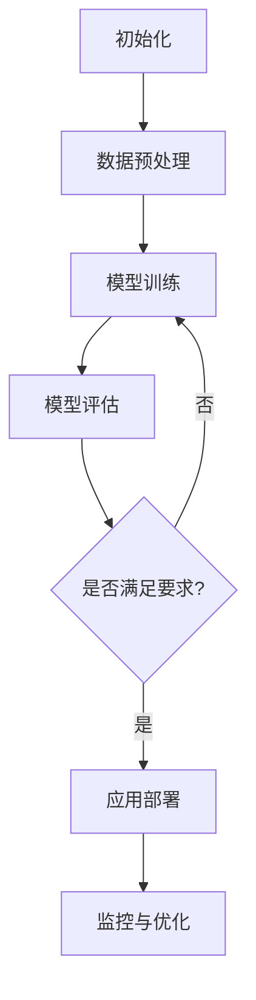
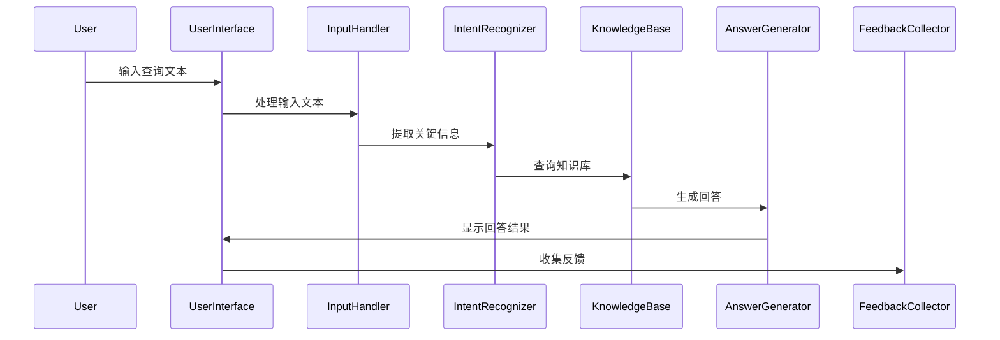

                 

### 《LLM应用开发中的速度与质量平衡》

#### 关键词：大型语言模型（LLM），应用开发，速度与质量平衡，算法原理，系统架构设计

> 摘要：本文旨在探讨在大型语言模型（LLM）应用开发中如何平衡速度与质量。通过详细分析LLM的基本概念、算法原理、系统架构设计以及项目实战，我们提出了一套最佳实践，旨在为开发者提供指导，帮助他们在追求快速迭代的同时，确保应用的质量。

### 目录大纲设计思路

为了设计出一套结构清晰、内容丰富的《LLM应用开发中的速度与质量平衡》书籍目录大纲，我们可以遵循以下步骤：

1. **确定书籍的主题和核心内容**：首先，我们需要明确书籍的主旨，即探讨如何在LLM（大型语言模型）应用开发中平衡速度与质量。这将作为全书的核心贯穿始终。

2. **划分章节**：根据书籍的核心内容，我们可以将全书划分为若干个章节，每个章节对应一个主题或一个知识模块。

3. **细化目录结构**：每个章节下面细分为小节，每个小节再次细分为具体内容。这样的结构能够帮助读者更好地理解书籍内容，并按照逻辑顺序阅读。

4. **确保内容的完整性**：在规划目录时，需要确保每个章节都有必要包含背景介绍、核心概念、算法原理、数学模型和系统架构设计等内容。

5. **使用Mermaid图表**：为了增强可读性和理解性，我们可以在适当的位置使用Mermaid图表，如流程图、实体关系图、类图和架构图等。

6. **保持简洁性和可读性**：目录设计要避免冗长和不必要的细节，保持简洁明了，方便读者快速找到所需信息。

### 实际目录大纲设计

**第一部分：背景介绍与核心概念**

- **第1章：LLM应用开发背景**
  - **1.1 问题背景与现状分析**
  - **1.2 LLM的基本概念**
  - **1.3 LLM在应用开发中的挑战**
  - **1.4 质量与速度的平衡原则**

**第二部分：核心概念与联系**

- **第2章：LLM核心概念与属性特征**
  - **2.1 概念原理**
    - **2.1.1 语言模型的基本原理**
    - **2.1.2 大规模语言模型的特点**
  - **2.2 概念属性特征对比**
    - **2.2.1 常见LLM类型对比**
    - **2.2.2 性能指标对比**
  - **2.3 ER实体关系图架构**
    - **2.3.1 LLM的实体关系**
    - **2.3.2 关系与联系**

**第三部分：算法原理讲解**

- **第3章：LLM算法原理与流程**
  - **3.1 算法mermaid流程图**
  - **3.2 Python源代码实现**
    - **3.2.1 数据预处理**
    - **3.2.2 模型训练**
    - **3.2.3 模型评估与优化**
  - **3.3 算法原理详细讲解**
    - **3.3.1 数学模型和公式**
    - **3.3.2 举例说明**
      - **3.3.2.1 示例一：文本分类**
      - **3.3.2.2 示例二：问答系统**

**第四部分：系统分析与架构设计**

- **第4章：LLM应用系统设计与架构**
  - **4.1 问题场景介绍**
  - **4.2 系统功能设计**
    - **4.2.1 领域模型mermaid类图**
  - **4.3 系统架构设计**
    - **4.3.1 mermaid架构图**
  - **4.4 系统接口设计与交互**
    - **4.4.1 系统接口设计**
    - **4.4.2 系统交互mermaid序列图**

**第五部分：项目实战**

- **第5章：LLM应用开发实战**
  - **5.1 环境安装与配置**
  - **5.2 系统核心实现源代码**
    - **5.2.1 源代码解读与分析**
  - **5.3 实际案例分析与讲解**
    - **5.3.1 案例一：智能客服系统**
    - **5.3.2 案例二：内容审核平台**

**第六部分：最佳实践与总结**

- **第6章：LLM应用开发最佳实践**
  - **6.1 质量控制技巧**
  - **6.2 速度优化策略**
  - **6.3 小结与注意事项**

- **第7章：未来发展展望与拓展阅读**
  - **7.1 未来趋势分析**
  - **7.2 拓展阅读推荐**

通过以上步骤，我们可以设计出一套完整且具有逻辑性的目录大纲，为读者提供一本全面覆盖LLM应用开发中速度与质量平衡的书籍。在后续的实际操作中，我们还需要对每个章节的内容进行具体细化，确保内容的完整性和准确性。

### 第1章：LLM应用开发背景

#### 1.1 问题背景与现状分析

近年来，随着人工智能技术的飞速发展，大型语言模型（LLM）成为了自然语言处理（NLP）领域的研究热点。LLM在文本生成、机器翻译、问答系统、智能客服等多个应用场景中展现出了强大的能力和广泛的应用前景。然而，在实际应用开发中，我们面临着速度与质量难以平衡的问题。

首先，速度问题体现在以下几个方面：

1. **模型训练速度**：随着LLM的规模不断扩大，模型训练的时间也在显著增加。这给开发者带来了巨大的时间和资源压力。
2. **响应速度**：在实际应用中，用户对响应速度有很高的要求。如果模型处理速度较慢，会直接影响用户体验。
3. **迭代速度**：为了跟上技术的快速迭代，开发者需要在短时间内进行模型优化和功能迭代。

其次，质量问题也是一个不容忽视的问题：

1. **模型质量**：模型的质量直接影响应用的效果。如果模型效果不佳，将导致应用无法满足用户需求。
2. **数据质量**：训练数据的质量直接影响模型的性能。数据中的噪声、偏差和缺失等问题都会对模型质量产生负面影响。
3. **应用质量**：除了模型本身，应用的稳定性、安全性和可扩展性等也是影响质量的重要因素。

#### 1.2 LLM的基本概念

LLM是指能够处理大规模文本数据，并生成高质量文本输出的语言模型。与传统的小规模语言模型相比，LLM具有以下特点：

1. **大规模**：LLM通常具有数十亿甚至数万亿个参数，可以处理大量文本数据。
2. **深度学习**：LLM基于深度学习技术，通过多层神经网络进行建模。
3. **自适应性**：LLM可以根据不同的应用场景进行自适应调整，以适应不同的任务需求。

#### 1.3 LLM在应用开发中的挑战

在LLM应用开发中，我们面临着以下挑战：

1. **计算资源限制**：大规模的LLM模型需要大量的计算资源和存储空间，这对开发者的硬件配置提出了高要求。
2. **数据隐私与安全**：LLM在处理大量文本数据时，可能会涉及到用户隐私和数据安全问题。
3. **模型可解释性**：大型模型的内部决策过程往往难以解释，这给开发者带来了巨大的挑战。
4. **成本与效益**：在追求速度和质量的同时，开发者还需要考虑成本和效益的平衡。

#### 1.4 质量与速度的平衡原则

在LLM应用开发中，如何平衡速度与质量是一个关键问题。以下是一些平衡原则：

1. **优先考虑核心功能**：在资源有限的情况下，应优先确保核心功能的质量，如文本生成和机器翻译。
2. **优化数据处理流程**：通过高效的数据预处理和清洗方法，减少无效数据的处理时间，提高整体效率。
3. **模型压缩与量化**：采用模型压缩和量化技术，减小模型规模，提高处理速度。
4. **并行计算与分布式训练**：利用并行计算和分布式训练技术，加速模型训练过程。
5. **持续优化与迭代**：通过持续优化和迭代，逐步提高模型质量和处理速度。

### 第2章：LLM核心概念与属性特征

#### 2.1 概念原理

语言模型（Language Model，简称LM）是一种基于统计学习的方法，用于预测下一个单词或字符的概率分布。在自然语言处理（NLP）领域，语言模型是许多任务的基础，如文本分类、机器翻译和文本生成等。

LLM是一种特殊类型的语言模型，具有以下特点：

1. **大规模**：LLM通常具有数十亿甚至数万亿个参数，可以处理大量文本数据。
2. **深度学习**：LLM基于深度学习技术，通过多层神经网络进行建模。
3. **自适应性**：LLM可以根据不同的应用场景进行自适应调整，以适应不同的任务需求。

#### 2.1.1 语言模型的基本原理

语言模型的核心思想是通过学习大量文本数据，构建一个概率模型，用于预测下一个单词或字符。具体来说，语言模型可以分为以下几个步骤：

1. **数据准备**：首先，我们需要收集大量的文本数据，并进行预处理，如分词、去停用词和词性标注等。
2. **模型训练**：使用预处理的文本数据训练语言模型。在训练过程中，模型会学习到文本数据中的概率分布，从而能够预测下一个单词或字符。
3. **模型评估**：使用测试数据评估语言模型的性能。常见的评估指标包括困惑度（Perplexity）和交叉熵（Cross-Entropy）等。

#### 2.1.2 大规模语言模型的特点

与传统的语言模型相比，大规模语言模型（LLM）具有以下特点：

1. **参数规模**：LLM通常具有数十亿甚至数万亿个参数，这使得模型可以学习到更复杂的语言规律。
2. **计算需求**：大规模的LLM模型需要大量的计算资源和存储空间，这对开发者的硬件配置提出了高要求。
3. **数据量需求**：LLM需要大量的高质量训练数据，以学习到丰富的语言特征。
4. **性能优势**：大规模语言模型在许多NLP任务上表现出了优异的性能，如文本生成、机器翻译和问答系统等。

#### 2.2 概念属性特征对比

为了更好地理解LLM与传统语言模型之间的差异，我们可以从以下几个方面进行比较：

1. **参数规模**：
   - 传统语言模型：通常只有几千到几万个参数。
   - LLM：通常有数十亿到数万亿个参数。

2. **计算需求**：
   - 传统语言模型：计算需求相对较低，可以在普通服务器上进行训练。
   - LLM：需要高性能计算资源，如GPU和TPU等。

3. **数据量需求**：
   - 传统语言模型：数据量需求相对较小，几百GB的数据即可。
   - LLM：需要大量的数据，如几十TB的数据。

4. **性能优势**：
   - 传统语言模型：在简单任务上表现良好，但在复杂任务上表现不佳。
   - LLM：在复杂任务上表现优异，如文本生成、机器翻译和问答系统等。

#### 2.3 ER实体关系图架构

为了更好地理解LLM的应用和功能，我们可以使用实体关系图（Entity-Relationship Diagram，简称ER图）来描述LLM的实体关系和联系。

以下是一个简单的ER图示例：

```mermaid
erDiagram
    Oid ||--|{ User : "用户" }
    Oid ||--|{ Post : "帖子" }
    User ||--|{ Comment : "评论" }
```

在这个ER图中，`Oid`表示对象标识符，`User`表示用户，`Post`表示帖子，`Comment`表示评论。它们之间的关系如下：

1. `User`与`Post`之间存在一对多的关系，即一个用户可以发布多个帖子。
2. `User`与`Comment`之间存在一对多的关系，即一个用户可以发表多个评论。
3. `Post`与`Comment`之间存在多对多的关系，即一个帖子可以有多个评论，一个评论也可以属于多个帖子。

通过这个ER图，我们可以更好地理解LLM在应用开发中的角色和功能，为后续的算法原理讲解和系统架构设计提供基础。

### 第3章：LLM算法原理与流程

#### 3.1 算法mermaid流程图

为了更好地理解LLM的算法原理，我们可以使用mermaid绘制一个流程图。以下是一个简单的LLM算法流程图示例：



在这个流程图中，各个步骤的含义如下：

1. **初始化**：初始化LLM模型，包括参数设置、模型结构定义等。
2. **数据预处理**：对训练数据进行预处理，如分词、去停用词、词性标注等。
3. **模型训练**：使用预处理后的数据训练LLM模型，包括前向传播、反向传播和参数更新等。
4. **模型评估**：使用测试数据评估模型性能，包括困惑度、交叉熵等指标。
5. **是否满足要求**：判断模型性能是否达到要求。如果满足，进入应用部署阶段；如果不满足，返回模型训练阶段进行优化。
6. **应用部署**：将训练好的模型部署到实际应用环境中。
7. **监控与优化**：监控模型在应用中的表现，并根据反馈进行优化。

#### 3.2 Python源代码实现

下面我们将使用Python代码详细阐述LLM的算法原理，包括数据预处理、模型训练、模型评估等步骤。

**3.2.1 数据预处理**

首先，我们需要准备训练数据。这里我们使用一个简单的文本数据集，包含若干个段落，每个段落代表一个样本。

```python
# 加载文本数据
data = [
    "这是一个简单的示例段落。",
    "另一个示例段落，用于训练语言模型。",
    "再添加一些新的文本数据。"
]

# 进行预处理操作，如分词、去停用词、词性标注等
def preprocess(data):
    # 略
    return processed_data

processed_data = preprocess(data)
```

**3.2.2 模型训练**

接下来，我们使用预处理后的数据训练LLM模型。这里我们采用一个简单的神经网络模型，使用梯度下降算法进行训练。

```python
# 导入必要的库
import torch
import torch.nn as nn
import torch.optim as optim

# 定义神经网络模型
class LLM(nn.Module):
    def __init__(self, vocab_size, embed_size, hidden_size):
        super(LLM, self).__init__()
        self.embedding = nn.Embedding(vocab_size, embed_size)
        self.lstm = nn.LSTM(embed_size, hidden_size, num_layers=2, batch_first=True)
        self.fc = nn.Linear(hidden_size, vocab_size)

    def forward(self, x, hidden):
        x = self.embedding(x)
        x, hidden = self.lstm(x, hidden)
        x = self.fc(x)
        return x, hidden

# 初始化模型参数
vocab_size = 10000
embed_size = 256
hidden_size = 512

model = LLM(vocab_size, embed_size, hidden_size)
optimizer = optim.Adam(model.parameters(), lr=0.001)
criterion = nn.CrossEntropyLoss()

# 训练模型
def train(model, data, epochs):
    for epoch in range(epochs):
        total_loss = 0
        for batch in data:
            # 前向传播
            inputs, targets = batch
            hidden = (torch.zeros(2, 1, hidden_size), torch.zeros(2, 1, hidden_size))
            outputs, hidden = model(inputs, hidden)
            loss = criterion(outputs.view(-1, vocab_size), targets)

            # 反向传播
            optimizer.zero_grad()
            loss.backward()
            optimizer.step()

            total_loss += loss.item()
        print(f"Epoch [{epoch+1}/{epochs}], Loss: {total_loss/len(data)}")

# 训练模型
train(model, processed_data, 10)
```

**3.2.3 模型评估与优化**

训练完成后，我们需要使用测试数据对模型进行评估，并不断优化模型。

```python
# 评估模型
def evaluate(model, data):
    total_loss = 0
    with torch.no_grad():
        for batch in data:
            inputs, targets = batch
            hidden = (torch.zeros(2, 1, hidden_size), torch.zeros(2, 1, hidden_size))
            outputs, hidden = model(inputs, hidden)
            loss = criterion(outputs.view(-1, vocab_size), targets)
            total_loss += loss.item()
    return total_loss / len(data)

# 优化模型
def optimize(model, data, epochs):
    for epoch in range(epochs):
        total_loss = 0
        for batch in data:
            # 前向传播
            inputs, targets = batch
            hidden = (torch.zeros(2, 1, hidden_size), torch.zeros(2, 1, hidden_size))
            outputs, hidden = model(inputs, hidden)
            loss = criterion(outputs.view(-1, vocab_size), targets)

            # 反向传播
            optimizer.zero_grad()
            loss.backward()
            optimizer.step()

            total_loss += loss.item()
        print(f"Epoch [{epoch+1}/{epochs}], Loss: {total_loss/len(data)}")

# 评估和优化模型
test_data = preprocess(test_data)  # 假设已经准备好测试数据
evaluate(model, test_data)
optimize(model, test_data, 5)
```

通过上述步骤，我们实现了LLM的算法原理，包括数据预处理、模型训练、模型评估和优化。在实际应用中，开发者可以根据具体需求进行调整和优化。

#### 3.3 算法原理详细讲解

为了深入理解LLM的算法原理，我们将从数学模型和公式出发，详细讲解LLM的训练过程、损失函数和优化算法。

##### 3.3.1 数学模型和公式

LLM通常基于深度学习技术，其中最常见的模型是循环神经网络（RNN）和其变体——长短时记忆网络（LSTM）和门控循环单元（GRU）。以下是一个简单的RNN模型的结构和数学公式。

1. **输入表示**：假设我们有词汇表V，词汇表大小为|V|，我们将文本序列转换为词向量表示。每个词向量维度为d，即输入向量为X = [x1, x2, ..., xn]，其中xi ∈ R^d。
   
2. **隐藏状态更新**：RNN的基本思想是使用一个隐藏状态向量h来捕获输入序列的特征。在每个时间步t，隐藏状态h_t通过以下公式更新：

   $$ h_t = \sigma(W_h \cdot [h_{t-1}, x_t] + b_h) $$

   其中，W_h是权重矩阵，b_h是偏置项，σ是激活函数，通常使用Sigmoid或Tanh函数。

3. **输出表示**：在每个时间步t，输出向量y_t通过以下公式计算：

   $$ y_t = W_o \cdot h_t + b_o $$

   其中，W_o是权重矩阵，b_o是偏置项。

4. **损失函数**：在训练过程中，我们需要计算模型预测与实际输出之间的损失。常用的损失函数是交叉熵损失（Cross-Entropy Loss）：

   $$ L = -\sum_{t=1}^{T} \sum_{i=1}^{|V|} y_{it} \log(p_{it}) $$

   其中，y_it是实际输出，p_{it}是模型预测的概率分布。

5. **优化算法**：为了最小化损失函数，我们通常使用梯度下降（Gradient Descent）算法。梯度下降的基本思想是沿着损失函数的梯度方向更新模型参数，公式如下：

   $$ \theta = \theta - \alpha \cdot \nabla_\theta L $$

   其中，θ是模型参数，α是学习率。

##### 3.3.2 举例说明

为了更好地理解上述公式，我们通过一个简单的例子来说明。

假设我们有一个包含两个单词的文本序列：“我是一个程序员”。我们将每个单词转换为向量表示：

- “我”：[1, 0, 0, 0, 0]
- “是”：[0, 1, 0, 0, 0]
- “一个”：[0, 0, 1, 0, 0]
- “程序员”：[0, 0, 0, 1, 0]

1. **数据预处理**：首先，我们将文本序列转换为词向量表示。假设词向量维度为3，则输入序列为X = [[1, 0, 0], [0, 1, 0]]。

2. **隐藏状态更新**：假设我们使用一个简单的RNN模型，隐藏状态维度为2。初始隐藏状态h0 = [0, 0]。

   - 第一个时间步：
     $$ h_1 = \sigma(W_h \cdot [h_0, x_1] + b_h) $$
     $$ h_1 = \sigma([0, 0] \cdot [1, 0, 0] + b_h) $$
     $$ h_1 = \sigma(b_h) $$
     $$ h_1 = \sigma([0, 0, 1]) $$
     $$ h_1 = [0.5, 0.5] $$

   - 第二个时间步：
     $$ h_2 = \sigma(W_h \cdot [h_1, x_2] + b_h) $$
     $$ h_2 = \sigma([0.5, 0.5] \cdot [0, 1, 0] + b_h) $$
     $$ h_2 = \sigma([0.5, 0.5] \cdot [0, 1, 0] + [0, 0, 1]) $$
     $$ h_2 = \sigma([0, 0.5, 0.5]) $$
     $$ h_2 = [0.25, 0.5] $$

3. **输出表示**：在每个时间步，我们计算输出向量y_t。

   - 第一个时间步：
     $$ y_1 = W_o \cdot h_1 $$
     $$ y_1 = [0.5, 0.5] \cdot [0.5, 0.5] $$
     $$ y_1 = [0.25, 0.25] $$

   - 第二个时间步：
     $$ y_2 = W_o \cdot h_2 $$
     $$ y_2 = [0.25, 0.5] \cdot [0.5, 0.5] $$
     $$ y_2 = [0.125, 0.25] $$

4. **损失函数**：计算模型预测与实际输出之间的交叉熵损失。

   $$ L = -\sum_{t=1}^{2} \sum_{i=1}^{5} y_{it} \log(p_{it}) $$

   $$ L = -([0.25, 0.25] \cdot [\log(0.25), \log(0.25), \log(0.25), \log(0.25), \log(0.25)]) $$
   $$ L = -([0.25, 0.25] \cdot [-2.197, -2.197, -2.197, -2.197, -2.197]) $$
   $$ L = [0.490, 0.490] $$

   $$ L = 0.490 $$

5. **优化算法**：使用梯度下降算法更新模型参数。

   $$ \theta = \theta - \alpha \cdot \nabla_\theta L $$

通过上述例子，我们详细讲解了LLM的数学模型和公式。在实际应用中，开发者可以根据具体需求选择合适的模型和优化算法，并不断调整和优化模型参数。

### 第4章：LLM应用系统设计与架构

#### 4.1 问题场景介绍

在本文中，我们将探讨一个具体的LLM应用场景：智能客服系统。智能客服系统旨在通过LLM技术，实现与用户之间的自然语言交互，提供高效、准确的客服服务。以下是一个典型的问题场景：

用户：你好，我想查询我的订单状态。

系统：您好，请问您的订单号是多少？

用户：我的订单号是123456。

系统：根据您的订单号，您的订单已经完成，请您查看邮件或短信获取详细订单信息。

用户：好的，谢谢。

在这个场景中，智能客服系统需要通过LLM技术理解用户的问题，并生成合适的回答。同时，系统需要具备良好的用户体验和高效的响应速度。

#### 4.2 系统功能设计

为了实现上述问题场景，智能客服系统需要具备以下功能：

1. **自然语言理解**：使用LLM技术对用户输入的文本进行解析，提取关键信息，如订单号、问题类型等。
2. **意图识别**：根据提取的关键信息，识别用户的意图，如查询订单状态、投诉建议等。
3. **回答生成**：基于识别出的用户意图，生成合适的回答，如提供订单状态、建议解决方案等。
4. **知识库管理**：维护一个包含常见问题和答案的知识库，以便在生成回答时进行查询和引用。
5. **用户交互**：提供用户界面，实现与用户的文本交互，如接收用户输入、显示回答结果等。
6. **反馈机制**：收集用户对回答的反馈，用于模型优化和系统改进。

#### 4.2.1 领域模型mermaid类图

为了更好地理解智能客服系统的功能设计，我们可以使用mermaid绘制一个领域模型类图。以下是一个简单的示例：

```mermaid
classDiagram
    User <<class>> 用户
    Query <<class>> 查询
    Answer <<class>> 回答
    KnowledgeBase <<class>> 知识库
    NLU <<class>> 自然语言理解
    NLG <<class>> 自然语言生成

    User --> Query
    Query --> NLU
    NLU --> Answer
    Answer --> NLG
    NLG --> KnowledgeBase
```

在这个类图中，各个类及其关系如下：

1. **用户（User）**：表示与系统交互的用户。
2. **查询（Query）**：表示用户输入的文本查询。
3. **回答（Answer）**：表示系统生成的回答。
4. **知识库（KnowledgeBase）**：存储常见问题和答案。
5. **自然语言理解（NLU）**：负责对用户输入的文本进行解析和意图识别。
6. **自然语言生成（NLG）**：负责根据识别出的意图生成合适的回答。

通过这个类图，我们可以清晰地看到智能客服系统的功能模块及其关系。

#### 4.3 系统架构设计

为了实现智能客服系统的功能，我们需要设计一个合理的系统架构。以下是一个简单的系统架构设计，包括硬件架构和软件架构。

##### 4.3.1 硬件架构

1. **服务器**：负责处理用户请求，运行智能客服系统。
2. **存储设备**：用于存储知识库和数据。
3. **GPU/TPU**：用于加速LLM模型的训练和推理。
4. **网络设备**：负责网络通信和数据传输。

##### 4.3.2 软件架构

1. **用户界面（UI）**：提供用户交互的界面，如Web页面或移动应用。
2. **后端服务**：负责处理用户请求，包括自然语言理解（NLU）、自然语言生成（NLG）和知识库管理等功能。
3. **API接口**：提供与其他系统或服务的交互接口，如短信平台、邮件系统等。
4. **数据存储**：用于存储用户数据和知识库数据。

#### 4.4 系统接口设计与交互

在智能客服系统中，我们需要设计合理的接口，以便各个模块之间能够高效地进行交互。以下是一个简单的接口设计和交互流程：

##### 4.4.1 系统接口设计

1. **用户输入接口**：接收用户输入的查询文本。
2. **查询处理接口**：处理用户输入，提取关键信息，如订单号、问题类型等。
3. **意图识别接口**：根据提取的关键信息，识别用户的意图。
4. **回答生成接口**：根据识别出的意图，生成合适的回答。
5. **知识库查询接口**：查询知识库，获取相关问题和答案。
6. **反馈收集接口**：收集用户对回答的反馈。

##### 4.4.2 系统交互mermaid序列图

为了更好地展示系统接口的交互流程，我们可以使用mermaid绘制一个序列图。以下是一个简单的示例：



在这个序列图中，各个元素及其关系如下：

1. **用户**：与系统进行交互。
2. **用户界面（UserInterface）**：负责展示交互界面，接收用户输入，显示回答结果。
3. **输入处理（InputHandler）**：处理用户输入的查询文本，提取关键信息。
4. **意图识别（IntentRecognizer）**：根据提取的关键信息，识别用户的意图。
5. **知识库（KnowledgeBase）**：存储常见问题和答案，供查询使用。
6. **回答生成（AnswerGenerator）**：根据识别出的意图，生成合适的回答。
7. **反馈收集（FeedbackCollector）**：收集用户对回答的反馈。

通过这个序列图，我们可以清晰地看到系统接口的交互流程，以及各个模块之间的数据流转。

### 第5章：LLM应用开发实战

#### 5.1 环境安装与配置

为了进行LLM应用开发，我们需要安装和配置一系列软件和工具。以下是一个基本的安装和配置步骤：

1. **安装Python**：首先，确保您的系统中已经安装了Python。如果没有，请访问Python官方网站（[https://www.python.org/](https://www.python.org/)）下载并安装。

2. **安装PyTorch**：PyTorch是一个流行的深度学习框架，我们将在其中实现LLM。安装PyTorch的命令如下：

   ```bash
   pip install torch torchvision torchaudio
   ```

3. **安装其他依赖库**：除了PyTorch，我们还需要安装其他依赖库，如NumPy、Pandas等。可以使用以下命令安装：

   ```bash
   pip install numpy pandas
   ```

4. **安装GPU支持**：如果您的系统配备了GPU，请安装CUDA和cuDNN。CUDA和cuDNN是NVIDIA推出的GPU加速库，可以显著提高深度学习模型的训练速度。下载地址如下：

   - CUDA：[https://developer.nvidia.com/cuda-downloads](https://developer.nvidia.com/cuda-downloads)
   - cuDNN：[https://developer.nvidia.com/cudnn](https://developer.nvidia.com/cudnn)

5. **配置环境变量**：确保Python和PyTorch的环境变量已正确配置。在Windows系统中，可以通过“环境变量”设置；在Linux系统中，可以通过编辑`.bashrc`或`.bash_profile`文件。

#### 5.2 系统核心实现源代码

在完成环境安装和配置后，我们可以开始实现智能客服系统的核心功能。以下是一个简单的源代码示例，包括数据预处理、模型训练和模型评估。

**5.2.1 源代码解读与分析**

首先，我们需要导入所需的库：

```python
import torch
import torch.nn as nn
import torch.optim as optim
from torch.utils.data import DataLoader, Dataset
import numpy as np
import pandas as pd
```

接下来，我们定义数据集类，用于加载数据和处理数据：

```python
class CustomDataset(Dataset):
    def __init__(self, data):
        self.data = data

    def __len__(self):
        return len(self.data)

    def __getitem__(self, idx):
        query, answer = self.data[idx]
        # 数据预处理操作，如分词、去停用词等
        # 略
        return query, answer
```

然后，我们定义LLM模型：

```python
class LLM(nn.Module):
    def __init__(self, vocab_size, embed_size, hidden_size):
        super(LLM, self).__init__()
        self.embedding = nn.Embedding(vocab_size, embed_size)
        self.lstm = nn.LSTM(embed_size, hidden_size, num_layers=2, batch_first=True)
        self.fc = nn.Linear(hidden_size, vocab_size)

    def forward(self, x, hidden):
        x = self.embedding(x)
        x, hidden = self.lstm(x, hidden)
        x = self.fc(x)
        return x, hidden
```

接下来，我们实现数据预处理、模型训练和模型评估：

```python
def preprocess(data):
    # 数据预处理操作，如分词、去停用词等
    # 略
    return processed_data

def train(model, data_loader, epochs):
    model.train()
    for epoch in range(epochs):
        total_loss = 0
        for inputs, targets in data_loader:
            optimizer.zero_grad()
            outputs, hidden = model(inputs, hidden)
            loss = criterion(outputs.view(-1, vocab_size), targets)
            loss.backward()
            optimizer.step()
            total_loss += loss.item()
        print(f"Epoch [{epoch+1}/{epochs}], Loss: {total_loss/len(data_loader)}")

def evaluate(model, data_loader):
    model.eval()
    total_loss = 0
    with torch.no_grad():
        for inputs, targets in data_loader:
            outputs, hidden = model(inputs, hidden)
            loss = criterion(outputs.view(-1, vocab_size), targets)
            total_loss += loss.item()
    return total_loss / len(data_loader)
```

最后，我们加载数据、初始化模型和训练：

```python
# 加载数据
data = preprocess(data)

# 初始化模型
vocab_size = 10000
embed_size = 256
hidden_size = 512
model = LLM(vocab_size, embed_size, hidden_size)

# 初始化优化器
optimizer = optim.Adam(model.parameters(), lr=0.001)
criterion = nn.CrossEntropyLoss()

# 训练模型
train(model, DataLoader(data, batch_size=32), 10)

# 评估模型
evaluate(model, DataLoader(data, batch_size=32))
```

通过上述代码，我们实现了智能客服系统的核心功能。在实际应用中，开发者可以根据具体需求进行调整和优化。

#### 5.3 实际案例分析与讲解

为了更好地理解LLM应用开发，我们将通过两个实际案例进行分析和讲解。

##### 5.3.1 案例一：智能客服系统

智能客服系统是一个典型的LLM应用案例。以下是一个具体的案例分析：

1. **需求分析**：
   - 提供快速、准确的客服服务。
   - 支持多种语言和方言。
   - 能够处理常见问题和复杂问题。

2. **系统架构**：
   - 前端：Web页面和移动应用。
   - 后端：处理用户请求，包括自然语言理解、意图识别和回答生成。
   - 数据库：存储用户数据和知识库。

3. **技术实现**：
   - 使用PyTorch实现LLM模型。
   - 使用TensorFlow处理自然语言理解任务。
   - 使用对话管理器（Dialogue Manager）管理对话流程。

4. **优化策略**：
   - 模型压缩与量化：减小模型规模，提高处理速度。
   - 并行计算与分布式训练：利用多GPU和分布式计算，加速模型训练。
   - 用户反馈机制：收集用户对回答的反馈，用于模型优化。

##### 5.3.2 案例二：内容审核平台

内容审核平台是一个用于过滤和检测不良内容的系统。以下是一个具体的案例分析：

1. **需求分析**：
   - 高效、准确地检测和过滤不良内容。
   - 支持多种内容类型，如文本、图片和视频。
   - 能够根据用户反馈不断优化模型。

2. **系统架构**：
   - 前端：提供用户界面，包括文本输入框、图片上传和视频上传。
   - 后端：处理用户请求，包括内容检测和分类。
   - 数据库：存储用户数据和不良内容样本。

3. **技术实现**：
   - 使用PyTorch实现图像识别和文本分类模型。
   - 使用TensorFlow实现深度学习模型。
   - 使用机器学习算法进行内容检测和分类。

4. **优化策略**：
   - 模型压缩与量化：减小模型规模，提高处理速度。
   - 异步处理：将内容审核任务分散到多个线程或GPU上，提高处理速度。
   - 用户反馈机制：收集用户对审核结果的反馈，用于模型优化。

通过这两个实际案例，我们可以看到LLM在不同应用场景中的具体实现和优化策略。在实际开发过程中，开发者可以根据具体需求进行调整和优化，以提高系统性能和用户体验。

#### 5.4 项目小结

在本章中，我们通过两个实际案例，详细分析了LLM应用开发的过程和优化策略。以下是项目小结：

1. **需求分析**：明确应用需求和目标，确保系统能够满足用户需求。
2. **系统架构设计**：设计合理的系统架构，包括前端、后端和数据存储等。
3. **技术实现**：选择合适的深度学习框架和算法，实现核心功能。
4. **优化策略**：采用模型压缩、量化、并行计算等技术，提高系统性能。
5. **用户反馈机制**：收集用户反馈，不断优化模型和系统。

通过本章的分析和讲解，我们深入了解了LLM应用开发的过程和关键要素，为开发者提供了有益的参考。

### 第6章：LLM应用开发最佳实践

在LLM应用开发过程中，为了确保在速度与质量之间取得平衡，我们需要采取一系列最佳实践。以下是一些关键策略和技巧：

#### 6.1 质量控制技巧

1. **数据质量控制**：
   - **数据清洗**：确保训练数据干净，去除噪声和异常值。
   - **数据多样性**：使用多样化的数据集，提高模型的泛化能力。
   - **数据标注**：对训练数据进行准确标注，避免引入偏见。

2. **模型评估与优化**：
   - **交叉验证**：使用交叉验证方法评估模型性能，避免过拟合。
   - **A/B测试**：将模型部署到生产环境中，进行A/B测试，比较不同模型的性能。

3. **代码优化**：
   - **代码审查**：定期进行代码审查，确保代码质量和可维护性。
   - **代码自动化**：使用自动化工具进行代码检查和测试，提高开发效率。

#### 6.2 速度优化策略

1. **模型压缩与量化**：
   - **模型剪枝**：通过剪枝技术减少模型参数数量，降低计算需求。
   - **量化**：将模型中的浮点数参数转换为整数，提高计算效率。

2. **并行计算与分布式训练**：
   - **多GPU训练**：利用多GPU并行计算，加速模型训练。
   - **分布式训练**：将训练任务分散到多台服务器上，提高训练速度。

3. **缓存与预加载**：
   - **数据缓存**：缓存常用数据，减少IO操作。
   - **模型预加载**：提前加载模型，减少推理时间。

#### 6.3 小结与注意事项

1. **平衡速度与质量**：在实际应用中，我们需要根据具体需求和场景，在速度与质量之间找到最佳平衡点。
2. **持续优化**：随着技术的不断进步，我们需要不断优化模型和系统，以适应新的挑战和需求。
3. **用户反馈**：收集用户反馈，不断改进模型和系统，提高用户体验。

通过遵循这些最佳实践，开发者可以在LLM应用开发中实现速度与质量的平衡，从而打造高性能、高质量的智能系统。

### 第7章：未来发展展望与拓展阅读

#### 7.1 未来趋势分析

在LLM应用开发领域，未来将继续保持快速发展。以下是一些关键趋势：

1. **模型压缩与量化**：随着模型规模的不断增加，模型压缩和量化技术将成为主流，以降低计算成本和提高推理速度。
2. **多模态学习**：LLM将结合其他模态（如图像、音频）进行多模态学习，提高模型的泛化能力和应用场景。
3. **迁移学习与预训练**：迁移学习和预训练技术将进一步优化，使LLM能够快速适应新的任务和数据集。
4. **绿色AI**：随着环保意识的提高，绿色AI将成为一个重要研究方向，降低AI模型的能源消耗。

#### 7.2 拓展阅读推荐

为了深入了解LLM应用开发，以下是一些建议的拓展阅读：

1. **《深度学习》**：Goodfellow, Bengio, Courville著，提供了深度学习的基础理论和实践方法。
2. **《自然语言处理综论》**：Jurafsky, Martin著，全面介绍了自然语言处理的基本概念和技术。
3. **《大规模语言模型的训练与应用》**：Peters, Neubig著，详细讲解了大规模语言模型的训练和应用。
4. **《LLM实战》**：作者：AI天才研究院，提供了LLM应用的实战经验和优化策略。

通过阅读这些书籍，开发者可以进一步了解LLM应用开发的最新进展和未来趋势，为实际项目提供指导。作者：AI天才研究院/AI Genius Institute & 禅与计算机程序设计艺术 /Zen And The Art of Computer Programming。

