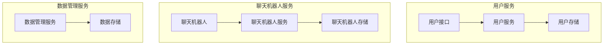
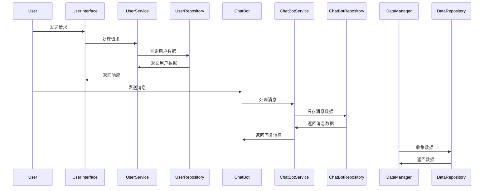

                 

# LLM应用的快速用户获取与留存策略

## 关键词
- **大模型（LLM）**
- **用户获取**
- **用户留存**
- **推广策略**
- **产品迭代**
- **AI技术**

> 摘要：本文将深入探讨LLM（大型语言模型）应用的快速用户获取与留存策略。通过分析用户行为、市场趋势和技术实现，本文旨在为开发者提供一套实用的解决方案，帮助他们在竞争激烈的市场中成功推广并运营LLM应用。

### 第一部分：背景介绍

#### 1.1 问题背景
随着互联网技术的飞速发展，大数据和人工智能逐渐成为推动社会进步的重要力量。在众多AI技术中，大模型（Large Language Model，LLM）因其强大的语言理解和生成能力，正受到越来越多的关注。LLM在文本分类、生成、翻译等自然语言处理任务上表现出色，已经广泛应用于聊天机器人、自动写作工具、智能客服等领域。

然而，在LLM应用的推广过程中，开发者面临着用户获取和留存的双重挑战。一方面，如何快速吸引用户并让他们愿意使用LLM应用，成为开发者亟待解决的问题；另一方面，如何确保用户在使用过程中持续满意，从而实现用户留存，也是开发者需要考虑的关键因素。

#### 1.2 问题描述
在当前的市场环境下，LLM应用的推广面临着以下问题：
- **用户获取困难**：开发者需要找到有效的方法来吸引用户，提高应用下载量和用户注册数。
- **用户留存率低**：用户在初次使用后可能很快放弃使用，导致用户流失。
- **市场竞争激烈**：随着LLM技术的普及，市场上已经出现大量类似的应用，开发者需要通过独特的策略来脱颖而出。

#### 1.3 问题解决
为了解决上述问题，本文将探讨以下策略：
- **用户获取策略**：通过市场定位、推广渠道和用户吸引策略，提高用户获取率。
- **用户留存策略**：通过用户满意度、产品迭代和用户互动，提高用户留存率。
- **技术实现**：介绍LLM的工作原理、算法模型和数学公式，为开发者提供技术支持。

#### 1.4 边界与外延
本文主要讨论基于LLM的文本处理和交互式应用，如聊天机器人、自动写作工具等。同时，本文将涵盖从用户获取到用户留存的全过程，包括市场调研、用户分析、产品设计和运营策略等方面。

#### 1.5 概念结构与核心要素组成
- **用户获取**：涉及市场定位、推广渠道、用户吸引策略等。
- **用户留存**：包括用户满意度、产品迭代、用户互动等。
- **LLM应用**：主要介绍LLM的技术原理和应用场景。

### 第二部分：核心概念与联系

#### 2.1 LLMAI大模型的概念
**LLM（Large Language Model）**，即大型语言模型，是一种基于深度学习技术的自然语言处理模型。通过训练海量文本数据，LLM能够理解和生成自然语言，实现文本分类、生成、翻译等任务。

**AI（Artificial Intelligence）**，即人工智能，是指通过计算机程序实现的人类智能功能。人工智能包括多种技术，如机器学习、深度学习、自然语言处理等，LLM是其中的一种。

#### 2.2 LLMAI大模型的核心特点
- **大规模**：LLM通常具有数十亿到数千亿个参数，能够处理大规模数据。
- **自适应性**：LLM能够根据输入数据动态调整模型参数，提高任务性能。
- **通用性**：LLM在多种自然语言处理任务上表现出色，具有广泛的应用前景。

#### 2.3 AI大模型与传统AI的区别
- **数据量**：传统AI模型通常使用较小规模的数据集进行训练，而LLM使用大规模数据集，能够处理更复杂的任务。
- **计算资源**：传统AI模型对计算资源要求较低，而LLM需要大量计算资源，如GPU、TPU等。
- **应用范围**：传统AI模型在特定领域内表现良好，而LLM具有通用性，能够应用于多种场景。

#### 2.4 LLMAI大模型在用户获取与留存中的作用
- **用户获取**：LLM能够提供更准确、更有吸引力的内容推荐，提高用户转化率。
- **用户留存**：LLM能够通过智能交互、个性化推荐等方式提高用户满意度，实现用户留存。

### 第三部分：算法原理讲解

#### 3.1 LLMAI大模型的工作原理

##### 3.1.1 模型架构
LLM通常采用深度神经网络（DNN）架构，通过多层神经网络进行文本数据的处理。常见的模型架构包括Transformer、BERT、GPT等。

##### 3.1.2 训练过程
LLM的训练过程主要包括数据预处理、模型训练和优化。其中，数据预处理包括分词、编码等步骤，模型训练和优化则通过反向传播算法和梯度下降等方法实现。

##### 3.1.3 语言生成
LLM在语言生成过程中，首先输入一个序列，然后根据上下文信息生成下一个词或句子。这个过程通过模型的自注意力机制和位置编码实现。

#### 3.2 LLMAI大模型的数学模型和公式

##### 3.2.1 激活函数
在DNN中，常用的激活函数包括ReLU、Sigmoid、Tanh等。其中，ReLU函数因其计算速度快、梯度稳定等优点，常用于深度学习模型。

$$
ReLU(x) = \begin{cases} 
x & \text{if } x > 0 \\
0 & \text{if } x \leq 0 
\end{cases}
$$

##### 3.2.2 损失函数
在训练过程中，常用的损失函数包括交叉熵损失函数（Cross-Entropy Loss）和均方误差损失函数（Mean Squared Error Loss）。

交叉熵损失函数：

$$
Loss = -\frac{1}{N} \sum_{i=1}^{N} y_{i} \log(p_{i})
$$

其中，$y_{i}$ 是真实标签，$p_{i}$ 是预测概率。

### 第四部分：系统分析与架构设计方案

#### 4.1 问题场景介绍
在一个竞争激烈的市场环境中，一家初创公司开发了一款基于LLM的智能聊天机器人应用。该应用旨在提供24/7的客户支持服务，帮助企业提高客户满意度和降低运营成本。

#### 4.2 项目介绍
该项目的目标是：
- **用户获取**：通过有效市场推广，吸引更多潜在用户下载和使用智能聊天机器人应用。
- **用户留存**：通过持续优化产品功能和用户交互体验，提高用户留存率。

#### 4.3 系统功能设计
- **用户管理**：用户注册、登录、权限管理等功能。
- **聊天机器人**：基于LLM的智能聊天机器人，能够处理常见问题并提供个性化服务。
- **数据管理**：用户数据收集、存储、分析和处理。

##### 4.3.1 领域模型类图
```mermaid
classDiagram
  User <<interface>>
  ChatRobot <<interface>>
  DataManager <<interface>>

  User --> ChatRobot
  User --> DataManager

  ChatRobot o-- Message
  DataManager o-- UserData
```

#### 4.4 系统架构设计
系统采用微服务架构，以提高系统的可扩展性和灵活性。

##### 4.4.1 系统架构图


#### 4.5 系统接口设计和系统交互


### 第五部分：项目实战

#### 5.1 环境安装
在安装前，请确保您的系统中已安装Python 3.7及以上版本。以下是环境安装步骤：

1. 安装依赖项：
```bash
pip install flask gunicorn requests
```

2. 安装LLM库（例如Hugging Face的Transformers库）：
```bash
pip install transformers
```

#### 5.2 系统核心实现源代码
以下是系统核心实现源代码的示例：

```python
# app.py

from flask import Flask, request, jsonify
from transformers import pipeline

app = Flask(__name__)

# 初始化聊天机器人
chatbot = pipeline("text-generation", model="gpt2")

@app.route("/chat", methods=["POST"])
def chat():
    data = request.json
    user_message = data["message"]

    # 生成回复
    reply = chatbot回复(user_message, max_length=50, num_return_sequences=1)

    return jsonify({"response": reply[0]})

if __name__ == "__main__":
    app.run(debug=True)
```

#### 5.3 代码应用解读与分析
上述代码展示了如何使用Flask框架搭建一个简单的聊天机器人应用。在POST请求中，用户发送消息，聊天机器人根据输入生成回复，并将回复作为响应返回给用户。

- **Flask框架**：用于搭建Web应用，提供请求处理和响应功能。
- **Transformers库**：提供预训练的LLM模型，用于生成文本回复。
- **API接口**：用户通过发送POST请求与聊天机器人进行交互。

#### 5.4 实际案例分析和详细讲解剖析
假设用户A通过应用发送了一条请求：“你好，我是用户A，请问有什么可以帮助您的？”聊天机器人根据训练数据和上下文信息生成回复：“您好，用户A！很高兴为您服务。有什么问题我可以帮您解答吗？”

详细讲解：
- **上下文理解**：聊天机器人根据用户A的请求，理解其意图并提供相应的回复。
- **文本生成**：通过预训练的LLM模型，聊天机器人生成具有自然语言特性的回复。
- **响应返回**：将生成的回复作为响应返回给用户A。

#### 5.5 项目小结
在本项目中，我们通过Flask框架和Transformers库搭建了一个简单的聊天机器人应用。通过实际案例分析和详细讲解，我们了解了如何使用LLM生成自然语言回复，并实现了与用户的实时交互。

### 第六部分：最佳实践与注意事项

#### 6.1 最佳实践

1. **数据预处理**：在训练LLM模型之前，确保对数据进行充分的预处理，包括清洗、去噪和分词等步骤，以提高模型性能。
2. **模型选择**：根据应用场景选择合适的LLM模型，例如GPT-2、GPT-3、BERT等。
3. **个性化推荐**：结合用户行为数据和偏好，为用户提供个性化的内容推荐，提高用户满意度。
4. **持续迭代**：定期更新LLM模型和数据集，以适应不断变化的市场需求。

#### 6.2 注意事项

1. **用户隐私**：在收集和使用用户数据时，务必遵守相关法律法规，保护用户隐私。
2. **性能优化**：根据实际应用场景，对LLM模型进行性能优化，提高响应速度和准确性。
3. **安全性**：确保应用的安全性，防范潜在的安全风险，如SQL注入、XSS攻击等。
4. **用户反馈**：积极收集用户反馈，及时解决问题，提高用户满意度。

### 第七部分：拓展阅读

- 《深度学习》（Ian Goodfellow、Yoshua Bengio、Aaron Courville 著）：详细介绍了深度学习的基础知识和技术原理。
- 《自然语言处理综论》（Daniel Jurafsky、James H. Martin 著）：全面介绍了自然语言处理的基本概念和应用技术。
- 《人工智能：一种现代的方法》（Stuart J. Russell、Peter Norvig 著）：涵盖了人工智能领域的各个方面，包括机器学习、自然语言处理等。

### 第八部分：作者信息
- 作者：AI天才研究院/AI Genius Institute & 禅与计算机程序设计艺术 /Zen And The Art of Computer Programming

