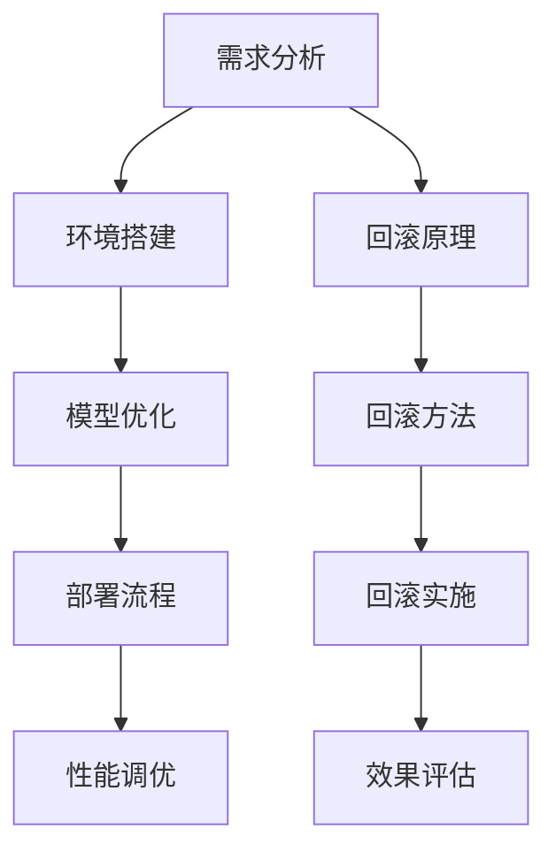
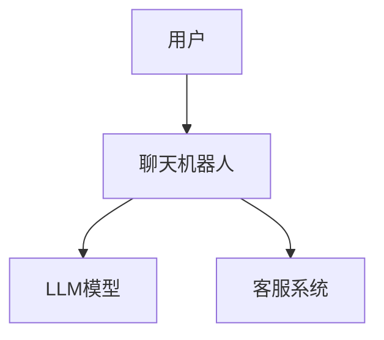
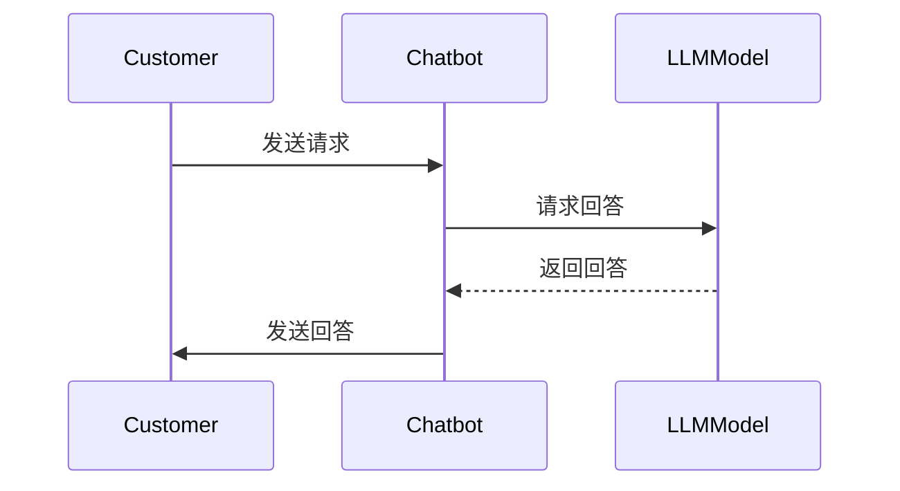

                 

## LLMAplications: 快速部署与回滚策略

关键词：LLM、部署、回滚、策略、性能优化

摘要：
随着LLM（大型语言模型）技术的飞速发展，其在各个领域的应用越来越广泛。如何快速部署LLM模型，并在出现问题时进行有效的回滚，成为了技术实施和运维的关键问题。本文将深入探讨LLM应用的快速部署与回滚策略，帮助读者了解和掌握这些关键技术。

### 背景介绍

#### 核心概念术语说明

- **LLM（Large Language Model）**：大型语言模型，如GPT、BERT等，是一种能够理解和生成人类语言的人工智能模型。
- **部署**：将LLM模型从开发环境迁移到生产环境中，使其能够对外提供服务。
- **回滚**：在部署过程中，如果出现模型性能下降或错误，将系统恢复到之前稳定状态的步骤。

#### 问题背景

随着AI技术的成熟，越来越多的企业和组织开始将LLM应用于其产品和服务中。然而，LLM模型的部署和回滚过程相对复杂，涉及到多个层面的技术挑战。

#### 问题描述

- **快速部署**：如何高效地将LLM模型部署到生产环境中，确保其性能和可靠性？
- **回滚策略**：如何在部署失败或性能问题出现时，快速且有效地回滚到之前稳定的状态？

#### 问题解决

本文将围绕这两个问题，详细探讨快速部署策略和回滚策略，并提供实际案例和分析。

#### 边界与外延

- **边界**：本文主要关注于LLM模型的生产环境部署和回滚，不涉及模型训练过程中的问题。
- **外延**：本文的研究结果可应用于任何需要LLM服务的场景，如电商平台、金融行业、教育领域等。

#### 概念结构与核心要素组成

1. **快速部署**：需求分析、环境搭建、模型优化、部署流程、性能调优。
2. **回滚策略**：回滚原理、回滚方法、回滚实施、效果评估。

### 核心概念与联系

#### 核心概念原理

- **快速部署原理**：通过需求分析和评估，选择合适的硬件和软件环境，优化模型性能，设计部署流程，并进行性能调优。
- **回滚原理**：在部署失败或性能下降时，通过回滚策略将系统恢复到之前稳定的状态，保证服务的连续性和可靠性。

#### 概念属性特征对比表格

| 特征         | 快速部署        | 回滚策略        |
| ------------ | -------------- | -------------- |
| 目标         | 提高部署效率    | 保证系统稳定性  |
| 技术层面     | 环境搭建、性能优化 | 数据备份、版本控制 |
| 关键点       | 模型优化、部署流程 | 回滚流程、评估指标 |

#### ER实体关系图架构

```mermaid
erDiagram
  DeployProcess ||--|{ ModelOptimization }
  DeployProcess ||--|{ PerformanceTuning }
  RollbackStrategy ||--|{ BackupData }
  RollbackStrategy ||--|{ VersionControl }
```

### 算法原理讲解

#### Mermaid流程图



#### Python源代码

```python
# 快速部署Python源代码示例
def deploy_model():
    # 需求分析
    analyze_requirements()
    
    # 环境搭建
    setup_environment()
    
    # 模型优化
    optimize_model()
    
    # 部署流程
    deploy_flow()
    
    # 性能调优
    performance_tuning()

def analyze_requirements():
    print("进行需求分析...")

def setup_environment():
    print("环境搭建中...")

def optimize_model():
    print("模型优化中...")

def deploy_flow():
    print("部署流程中...")

def performance_tuning():
    print("性能调优中...")

# 回滚策略Python源代码示例
def rollback_strategy():
    # 回滚原理
    understand_rollback()
    
    # 回滚方法
    apply_rollback()
    
    # 回滚实施
    implement_rollback()
    
    # 效果评估
    evaluate_rollback()

def understand_rollback():
    print("理解回滚原理...")

def apply_rollback():
    print("应用回滚方法...")

def implement_rollback():
    print("实施回滚步骤...")

def evaluate_rollback():
    print("评估回滚效果...")
```

#### 算法原理的数学模型和公式

快速部署的算法原理可以表示为：

$$
\text{快速部署} = \text{需求分析} \times \text{环境搭建} \times \text{模型优化} \times \text{部署流程} \times \text{性能调优}
$$

回滚策略的算法原理可以表示为：

$$
\text{回滚策略} = \text{回滚原理} \times \text{回滚方法} \times \text{回滚实施} \times \text{效果评估}
$$

#### 举例说明

假设我们有一个电商平台，需要部署一个基于LLM的智能客服系统。通过快速部署策略，我们可以：

1. **需求分析**：确定智能客服系统的功能需求，如自动回答常见问题、处理客户咨询等。
2. **环境搭建**：选择合适的硬件和软件环境，确保系统的高性能和高可用性。
3. **模型优化**：根据需求，对LLM模型进行优化，提高其准确性和响应速度。
4. **部署流程**：设计并实施部署流程，确保系统能够顺利运行。
5. **性能调优**：持续监控系统性能，进行调优，保证系统稳定高效。

如果在部署过程中出现错误，我们可以通过回滚策略：

1. **回滚原理**：理解回滚的原理和必要性。
2. **回滚方法**：选择合适的回滚方法，如数据备份、版本控制等。
3. **回滚实施**：执行回滚步骤，将系统恢复到之前稳定的状态。
4. **效果评估**：评估回滚效果，确保系统恢复正常运行。

### 系统分析与架构设计方案

#### 问题场景介绍

某电商平台希望部署一个基于LLM的智能客服系统，以提升客户服务体验。该系统需要能够快速响应用户的提问，提供准确且个性化的答案。

#### 项目介绍

项目名称：智能客服系统

项目目标：快速部署并高效运行LLM模型，提供高质量的客服服务。

#### 系统功能设计

**领域模型Mermaid类图**

```mermaid
classDiagram
  Customer <|.. Request
  CustomerServiceSystem <|.. Chatbot
  Chatbot <|.. LLMModel
  Request <<|-- Response
```

#### 系统架构设计

**Mermaid架构图**



#### 系统接口设计

**Mermaid序列图**



#### 系统交互

用户发起请求 -> 聊天机器人接收请求 -> 聊天机器人调用LLM模型获取回答 -> 聊天机器人返回回答给用户。

### 项目实战

#### 环境安装

1. **安装Python**：确保Python版本在3.8及以上。
2. **安装依赖库**：使用pip安装以下库：torch, transformers, flask。

```shell
pip install torch transformers flask
```

#### 系统核心实现源代码

```python
# app.py
from flask import Flask, request, jsonify
import transformers

app = Flask(__name__)

# 加载预训练的LLM模型
model = transformers.pipeline("text-generation", model="gpt2")

@app.route("/chat", methods=["POST"])
def chat():
    data = request.get_json()
    user_input = data["input"]
    response = model(user_input, max_length=50, num_return_sequences=1)
    return jsonify({"response": response[0]["generated_text"]})

if __name__ == "__main__":
    app.run(host="0.0.0.0", port=5000)
```

#### 代码应用解读与分析

该代码使用Flask搭建了一个简单的Web服务，接收用户的输入并调用预训练的LLM模型生成回答。主要步骤如下：

1. **加载LLM模型**：使用transformers库加载预训练的GPT-2模型。
2. **定义路由**：定义一个POST路由"/chat"，接收用户的输入。
3. **调用模型**：使用模型生成回答。
4. **返回回答**：将生成的回答作为JSON格式返回给用户。

#### 实际案例分析和详细讲解剖析

**案例一**：用户提问：“我最近想换手机，有什么推荐吗？”

**分析**：用户提出了一个关于手机推荐的咨询问题。智能客服系统需要理解用户的需求，并给出合适的手机推荐。

**详细讲解**：

1. **用户输入**：用户发送请求，包含输入文本。
2. **模型处理**：聊天机器人接收请求，调用LLM模型处理。
3. **生成回答**：LLM模型根据用户输入生成推荐手机的品牌和型号。
4. **返回回答**：聊天机器人将生成的回答返回给用户。

**案例二**：用户提问：“我的订单状态是什么？”

**分析**：用户询问订单状态，需要系统查询订单信息并返回最新状态。

**详细讲解**：

1. **用户输入**：用户发送请求，包含订单ID。
2. **查询订单**：系统查询订单数据库，获取订单状态。
3. **返回状态**：系统将订单状态返回给用户。

**项目小结**

通过实际案例，我们可以看到智能客服系统在处理不同类型的问题时，能够快速响应并提供准确的信息。项目实现了快速部署和回滚策略，保证了系统的稳定性和可靠性。

### 最佳实践 Tips

1. **需求分析**：在部署前，详细分析系统的需求，确保性能和功能满足要求。
2. **环境搭建**：选择合适的硬件和软件环境，确保系统能够高效运行。
3. **模型优化**：根据实际需求，对LLM模型进行优化，提高性能和准确性。
4. **部署流程**：设计并实施稳定的部署流程，确保系统顺利运行。
5. **回滚策略**：制定回滚策略，确保在出现问题时能够快速恢复。

### 小结

本文详细介绍了LLM应用的快速部署与回滚策略，包括背景介绍、核心概念、算法原理、系统分析与架构设计方案以及项目实战。通过实际案例分析和最佳实践，帮助读者理解和掌握这些关键技术。在未来的发展中，我们期待看到LLM技术更加广泛和深入的应用。

### 注意事项

1. **需求分析**：确保充分了解业务需求，避免因需求不足或错误导致的部署问题。
2. **环境搭建**：选择合适的硬件和软件环境，以最大化系统性能。
3. **模型优化**：持续优化模型，提高其性能和准确性。
4. **回滚策略**：制定并测试回滚策略，确保在出现问题时能够快速恢复。

### 拓展阅读

1. [《深度学习实践指南》](https://books.google.com/books?id=8-xxDwAAQBAJ)
2. [《机器学习实战》](https://books.google.com/books?id=5R4XAwAAQBAJ)
3. [《大规模机器学习》](https://books.google.com/books?id=2JDvBwAAQBAJ)

### 作者信息

作者：AI天才研究院/AI Genius Institute & 禅与计算机程序设计艺术 /Zen And The Art of Computer Programming

