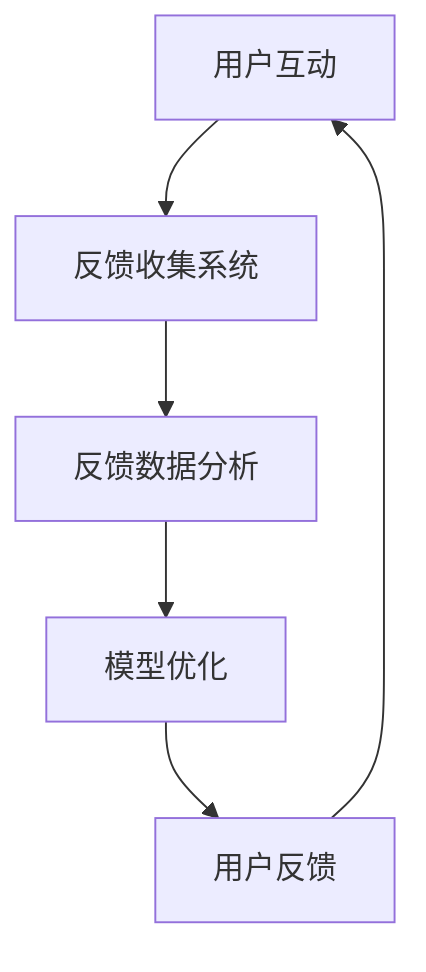
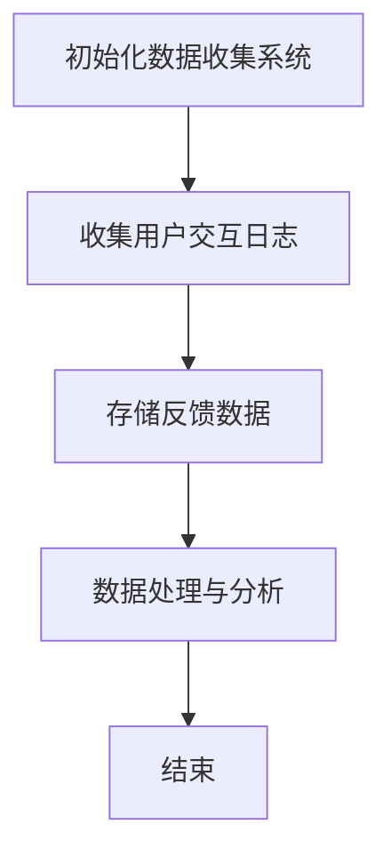
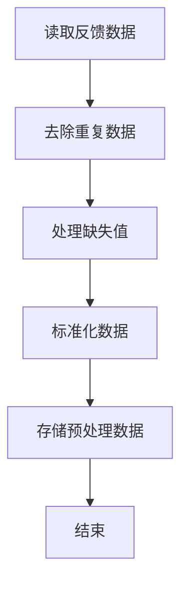
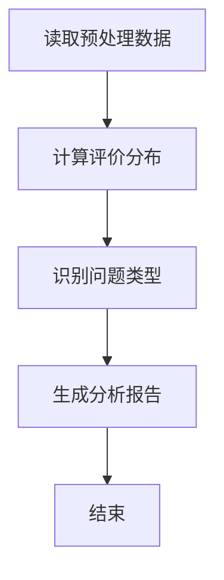
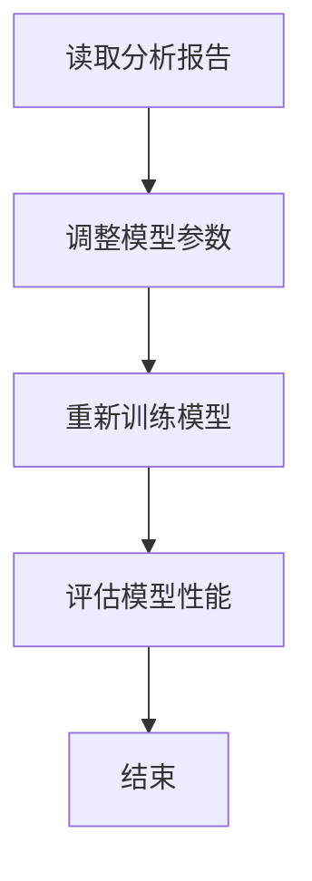

                 

# 《LLM应用的持续反馈循环：从用户到开发团队》

## 关键词
- 语言模型（LLM）
- 持续反馈循环
- 用户反馈
- 开发团队协作
- 模型优化
- 智能系统

## 摘要
本文旨在探讨语言模型（LLM）在应用过程中所形成的持续反馈循环机制，及其对用户和开发团队的影响。文章首先介绍了人工智能与机器学习的基础知识，特别是LLM的兴起与发展。接着，我们深入分析了用户与LLM的互动方式，并探讨了反馈的类型与处理方法。随后，文章介绍了反馈机制的设计与实现，包括数据收集、预处理和分析等方面。最后，文章通过实际案例研究，展示了持续反馈循环在实际应用中的效果，并提出了未来发展的方向与挑战。

## 目录

### 第一部分：背景与概念

#### 第1章 引言

#### 第2章 语言模型（LLM）基础

#### 第3章 用户与LLM互动

### 第二部分：反馈机制

#### 第4章 反馈收集系统

#### 第5章 反馈分析与处理

#### 第6章 用户-开发团队协作

### 第三部分：案例研究

#### 第7章 案例一：智能客服系统

#### 第8章 案例二：个性化推荐系统

### 第四部分：未来展望与挑战

#### 第9章 未来发展方向

#### 第10章 结论

## 第一部分：背景与概念

### 第1章 引言

随着人工智能和机器学习技术的快速发展，语言模型（LLM）在各个领域得到了广泛应用。LLM通过学习大量语言数据，可以生成自然语言文本，完成问答、翻译、摘要等任务。然而，LLM的应用并非一蹴而就，其中涉及的一个关键环节是持续反馈循环机制。

持续反馈循环是指在LLM应用过程中，通过收集用户反馈，对模型进行调整和优化，从而提高模型性能和用户体验的过程。这种反馈循环机制不仅有助于提升LLM的准确性，还可以增强模型的适应性和可解释性。本部分将首先介绍人工智能与机器学习的基础知识，特别是LLM的兴起与发展，然后深入探讨用户与LLM的互动方式。

### 第2章 语言模型（LLM）基础

#### 2.1 语言模型的基本原理

语言模型（Language Model，简称LM）是自然语言处理（Natural Language Processing，简称NLP）领域的一个重要组成部分。它的核心任务是预测文本序列中的下一个单词或字符。一个典型的语言模型通常基于统计学习或深度学习技术，通过大量文本数据训练得到。

统计语言模型主要基于语言统计规律，如N-gram模型。N-gram模型通过统计相邻单词或字符出现的频率，预测下一个单词或字符。虽然N-gram模型在处理简单任务时表现出色，但在处理复杂任务时存在一定的局限性。

深度语言模型则通过神经网络结构，如循环神经网络（RNN）、长短期记忆网络（LSTM）和变换器（Transformer）等，对语言数据进行建模。这些模型具有更强的表达能力和泛化能力，可以处理更复杂的语言现象。

#### 2.2 LLM的关键技术

语言模型的关键技术主要包括以下几个方面：

1. **预训练**：预训练是指在一个大规模的文本语料库上，对模型进行预训练，使其具备一定的语言理解和生成能力。预训练后的模型可以通过微调（Fine-tuning）来适应特定的任务。

2. **上下文理解**：传统的语言模型主要关注单个单词或短语的预测，而深度语言模型则能够理解上下文信息，从而更好地预测下一个单词或字符。

3. **多任务学习**：深度语言模型可以通过多任务学习（Multi-task Learning），同时学习多个任务，从而提高模型的泛化能力和适应性。

4. **生成对抗网络（GAN）**：GAN是一种通过生成器和判别器相互博弈的方式，来学习数据分布的深度学习模型。在语言模型中，GAN可以用于生成高质量的语言数据，以丰富训练数据集。

#### 2.3 LLM的发展历程

语言模型的发展历程可以分为以下几个阶段：

1. **基于规则的模型**：早期的语言模型主要基于语言学规则，如生成语法（Generator Grammar）。这些模型通过手动编写规则，对语言进行建模。

2. **统计语言模型**：随着计算能力的提升，统计语言模型开始兴起。N-gram模型是其中的代表，通过统计相邻单词或字符的频率来预测下一个单词或字符。

3. **深度学习语言模型**：随着深度学习技术的发展，深度语言模型如RNN、LSTM和Transformer等开始应用于语言建模。这些模型通过神经网络结构，对语言数据进行建模，具有更强的表达能力和泛化能力。

4. **预训练语言模型**：预训练语言模型的出现，使得语言模型的性能得到了显著提升。预训练模型通过在大规模文本语料库上预训练，再通过微调来适应特定任务，从而提高了模型的性能和适应性。

### 第3章 用户与LLM互动

#### 3.1 用户行为分析

在LLM应用过程中，用户行为分析是关键的一环。通过分析用户行为，可以了解用户的需求和偏好，从而优化LLM模型和应用。

用户行为分析可以从以下几个方面进行：

1. **交互行为**：分析用户与LLM模型的交互行为，如提问方式、问题类型、回答满意度等，以了解用户的需求和偏好。

2. **反馈行为**：分析用户对LLM模型的反馈，如好评、差评、修改建议等，以评估模型性能和改进方向。

3. **使用场景**：分析用户在不同场景下的使用情况，如工作、学习、娱乐等，以优化LLM模型和应用。

#### 3.2 用户反馈的类型与处理

用户反馈是优化LLM模型和应用的重要依据。根据反馈的类型，可以将用户反馈分为以下几类：

1. **性能反馈**：用户对LLM模型性能的反馈，如准确性、响应速度等。这些反馈可以用于评估模型性能，并提出改进措施。

2. **功能反馈**：用户对LLM模型功能的反馈，如是否满足需求、是否好用等。这些反馈可以用于改进模型功能，提高用户体验。

3. **体验反馈**：用户对LLM模型用户体验的反馈，如界面友好性、操作便捷性等。这些反馈可以用于优化用户界面和交互设计。

处理用户反馈的方法可以分为以下几步：

1. **收集反馈**：通过问卷调查、用户访谈、在线评论等方式，收集用户反馈。

2. **分析反馈**：对收集到的反馈进行分析，识别用户关注的问题和改进方向。

3. **实施改进**：根据分析结果，对LLM模型和应用进行改进，以提高性能和用户体验。

#### 3.3 用户界面设计与体验优化

用户界面设计（User Interface Design，简称UID）是LLM应用的重要组成部分。一个良好的用户界面设计可以提高用户体验，促进用户与LLM模型的互动。

用户界面设计可以从以下几个方面进行优化：

1. **界面简洁性**：简化界面设计，减少不必要的元素和操作，使界面更加直观和易于使用。

2. **交互设计**：优化交互设计，使操作更加流畅和便捷，提高用户的操作效率。

3. **反馈设计**：提供实时反馈，如错误提示、操作结果等，以增强用户的交互体验。

4. **个性化设计**：根据用户的行为和偏好，提供个性化的界面设计和功能推荐，提高用户的满意度。

用户体验优化（User Experience Optimization，简称UXO）是提升LLM应用的重要手段。通过优化用户体验，可以提高用户的满意度和忠诚度，从而促进LLM应用的推广和应用。

用户体验优化的方法可以分为以下几步：

1. **用户研究**：通过用户调研、用户访谈等方式，了解用户的需求和痛点。

2. **用户体验设计**：根据用户研究的结果，设计符合用户需求和使用习惯的界面和功能。

3. **用户体验测试**：通过用户测试，评估用户体验设计的有效性，并不断迭代优化。

4. **数据分析**：通过数据分析，监控用户体验指标，如使用时长、操作错误率等，以持续优化用户体验。

## 第二部分：反馈机制

### 第4章 反馈收集系统

#### 4.1 数据收集方法

反馈收集是持续反馈循环机制的关键步骤。数据收集方法可以分为以下几种：

1. **在线反馈**：通过网站、移动应用等在线平台，提供用户反馈表单，用户可以直接提交反馈。

2. **用户调研**：通过在线问卷、电话访谈、面对面访谈等方式，收集用户对LLM应用的意见和建议。

3. **日志分析**：通过分析用户与LLM应用的交互日志，如查询记录、操作步骤等，获取用户行为数据。

4. **API反馈**：为LLM应用提供API接口，用户可以通过API提交反馈数据。

#### 4.2 数据预处理与清洗

收集到的数据往往包含噪声和错误，需要进行预处理和清洗。数据预处理和清洗的方法包括：

1. **去重**：去除重复的数据记录，防止重复反馈。

2. **过滤无效数据**：去除不完整、不符合要求的数据记录，保证数据质量。

3. **数据转换**：将数据转换为适合分析的形式，如文本转换为向量表示。

4. **缺失值处理**：对于缺失的数据，可以通过填充、删除或插值等方法进行处理。

#### 4.3 反馈数据存储与管理

反馈数据的存储与管理是持续反馈循环机制的重要保障。反馈数据的存储和管理方法包括：

1. **数据库存储**：将反馈数据存储在关系型数据库或NoSQL数据库中，便于查询和管理。

2. **数据仓库**：建立数据仓库，对反馈数据进行分析和处理，以支持数据挖掘和决策支持。

3. **数据备份与恢复**：定期备份反馈数据，确保数据的安全性和可靠性。

4. **访问控制**：对反馈数据进行权限管理，确保数据的安全性和隐私性。

## 第5章 反馈分析与处理

#### 5.1 反馈数据分析

反馈数据分析是持续反馈循环机制的核心步骤。通过对反馈数据进行深入分析，可以识别用户的需求和问题，为模型优化提供依据。反馈数据分析的方法包括：

1. **描述性统计分析**：对反馈数据的基本统计特征进行描述，如平均值、中位数、标准差等。

2. **相关性分析**：分析不同反馈指标之间的相关性，找出影响模型性能的关键因素。

3. **聚类分析**：将反馈数据分为不同的类别，识别用户群体和需求差异。

4. **分类与回归分析**：使用机器学习算法，对反馈数据进行分类和回归分析，预测用户需求和行为。

#### 5.2 提升模型准确性与适应性

反馈分析结果可以用于提升LLM模型的准确性和适应性。提升模型准确性与适应性的方法包括：

1. **模型调优**：根据反馈分析结果，调整模型参数，提高模型性能。

2. **数据增强**：通过数据增强技术，如数据生成、数据扩充等，丰富训练数据集，提高模型泛化能力。

3. **模型融合**：将多个模型进行融合，提高模型预测的准确性和稳定性。

4. **在线学习**：通过在线学习技术，实时更新模型，适应用户需求的变化。

#### 5.3 模型调优策略

模型调优策略可以分为以下几类：

1. **基于规则的调优**：通过编写规则，手动调整模型参数，以适应不同场景。

2. **基于数据的调优**：通过分析反馈数据，自动调整模型参数，以提高模型性能。

3. **基于机器学习的调优**：使用机器学习算法，如遗传算法、粒子群优化等，搜索最优参数组合。

4. **混合调优策略**：结合基于规则和基于数据的调优方法，实现模型参数的自动调整。

## 第6章 用户-开发团队协作

#### 6.1 跨部门协作机制

用户-开发团队协作是持续反馈循环机制的重要环节。跨部门协作机制包括：

1. **需求收集**：用户需求由产品经理或业务部门收集，并转化为技术需求。

2. **需求评审**：技术团队对需求进行评审，评估可行性和技术难度。

3. **任务分配**：根据任务类型和团队资源，分配给相应的开发人员。

4. **进度跟踪**：使用项目管理工具，监控任务进度，确保按时完成。

5. **沟通渠道**：建立有效的沟通渠道，如定期会议、即时通讯工具等，确保团队间信息畅通。

#### 6.2 开发团队的角色与责任

开发团队在持续反馈循环机制中承担以下角色和责任：

1. **需求分析**：分析用户需求，明确系统功能和技术实现方案。

2. **系统设计**：设计系统架构，包括技术选型、模块划分等。

3. **编码实现**：根据设计文档，实现系统功能。

4. **测试与优化**：对系统进行功能测试和性能优化，确保系统稳定可靠。

5. **用户支持**：在系统上线后，提供用户支持和培训，收集用户反馈。

#### 6.3 用户需求与模型迭代

用户需求与模型迭代是持续反馈循环的核心。开发团队应遵循以下原则：

1. **敏捷开发**：采用敏捷开发方法，快速迭代，及时响应用户需求。

2. **用户导向**：以用户需求为导向，持续优化模型和应用。

3. **数据驱动**：基于用户反馈数据，分析用户行为和需求，指导模型迭代。

4. **持续集成**：实现持续集成，确保模型迭代过程中的稳定性和可追溯性。

## 第三部分：案例研究

### 第7章 案例一：智能客服系统

#### 7.1 系统概述

智能客服系统是基于LLM技术构建的，用于为企业提供智能客服解决方案。系统主要包括智能问答模块、聊天机器人模块和用户反馈模块。

#### 7.2 反馈循环的应用

智能客服系统中的反馈循环机制包括以下步骤：

1. **用户提问**：用户向智能客服系统提出问题。

2. **模型回答**：LLM模型根据用户提问，生成回答。

3. **用户评价**：用户对回答进行评价，如满意、不满意等。

4. **反馈收集**：系统收集用户评价，并存储在数据库中。

5. **数据分析**：分析用户评价数据，识别模型回答的问题和改进方向。

6. **模型调优**：根据数据分析结果，调整LLM模型参数，提高回答质量。

7. **再次回答**：LLM模型根据新的参数生成回答，并展示给用户。

#### 7.3 模型迭代与优化

通过持续反馈循环，智能客服系统的模型性能和用户体验得到了显著提升。以下为模型迭代与优化的方法：

1. **数据增强**：通过生成对抗网络（GAN）等技术，生成更多高质量的训练数据。

2. **模型融合**：将多个LLM模型进行融合，提高模型预测的准确性和稳定性。

3. **在线学习**：实现在线学习技术，实时更新模型，适应用户需求的变化。

4. **用户画像**：根据用户行为和偏好，构建用户画像，为个性化服务提供依据。

### 第8章 案例二：个性化推荐系统

#### 8.1 系统概述

个性化推荐系统是基于LLM技术构建的，用于为用户提供个性化的内容推荐。系统主要包括用户画像模块、推荐算法模块和用户反馈模块。

#### 8.2 用户反馈在推荐系统中的作用

用户反馈在个性化推荐系统中起着至关重要的作用。以下为用户反馈在推荐系统中的作用：

1. **推荐效果评估**：用户反馈用于评估推荐系统的效果，如推荐准确率、用户满意度等。

2. **推荐策略调整**：根据用户反馈，调整推荐策略，提高推荐质量。

3. **推荐结果优化**：根据用户反馈，对推荐结果进行优化，提高用户满意度。

4. **用户画像更新**：根据用户反馈，更新用户画像，为个性化推荐提供更准确的依据。

#### 8.3 持续改进与优化

通过持续反馈循环，个性化推荐系统的推荐质量和用户体验得到了显著提升。以下为持续改进与优化的方法：

1. **反馈数据收集**：通过用户互动行为、点击行为等，收集用户反馈数据。

2. **反馈数据处理**：对用户反馈数据进行预处理和清洗，提取有用信息。

3. **反馈数据利用**：利用用户反馈数据，调整推荐算法参数，优化推荐结果。

4. **用户画像更新**：根据用户反馈，更新用户画像，提高推荐精度。

5. **模型迭代**：通过在线学习技术，实现模型迭代，适应用户需求的变化。

## 第四部分：未来展望与挑战

### 第9章 未来发展方向

随着人工智能和机器学习技术的不断发展，LLM应用的持续反馈循环机制在未来将面临以下发展方向：

1. **多模态反馈**：将语音、图像、视频等多模态数据引入反馈机制，提高反馈信息的丰富度和准确性。

2. **跨领域反馈**：构建跨领域的反馈机制，实现不同领域反馈数据的共享和利用，提高模型的泛化能力。

3. **实时反馈**：实现实时反馈，提高反馈的及时性和响应速度，增强用户体验。

4. **智能反馈**：利用自然语言处理和机器学习技术，对用户反馈进行自动分析和处理，提高反馈利用效率。

### 第10章 结论

本文通过对LLM应用的持续反馈循环机制的探讨，总结了其核心概念、关键技术、用户互动方式、反馈机制和用户-开发团队协作等方面的内容。通过案例研究，展示了持续反馈循环在实际应用中的效果和优势。未来，随着技术的不断进步，LLM应用的持续反馈循环机制将在更多领域得到应用，为智能系统的发展提供有力支持。然而，面临的数据处理、隐私保护、跨领域融合等挑战，仍需进一步研究和解决。作者：AI天才研究院/AI Genius Institute & 禅与计算机程序设计艺术 /Zen And The Art of Computer Programming

## 背景介绍

### 核心概念术语说明

在本文中，我们将涉及以下几个核心概念：

1. **语言模型（LLM）**：语言模型是一种基于机器学习或深度学习技术，用于生成自然语言文本的模型。LLM通过学习大量语言数据，能够预测下一个单词或字符，并生成连贯、自然的语言。

2. **持续反馈循环**：持续反馈循环是一种在LLM应用过程中，通过收集用户反馈，对模型进行调整和优化的机制。这种循环机制有助于提高LLM模型的性能和用户体验。

3. **用户互动**：用户互动是指用户与LLM模型之间的交互过程，包括用户提问、模型回答、用户评价等。

4. **反馈收集系统**：反馈收集系统是指用于收集、存储和管理用户反馈的系统。它包括在线反馈表单、用户调研、日志分析等多种数据收集方法。

5. **反馈数据分析**：反馈数据分析是指对收集到的用户反馈进行预处理、分析和挖掘，以识别用户需求和问题，为模型优化提供依据。

### 问题背景

随着人工智能和机器学习技术的快速发展，语言模型（LLM）在自然语言处理、智能客服、个性化推荐等领域的应用日益广泛。然而，LLM的性能和用户体验受到多种因素的影响，包括数据质量、模型设计、用户互动等。为了提高LLM模型的性能和用户体验，开发团队需要不断收集用户反馈，并对模型进行调整和优化。然而，如何高效地收集、处理和利用用户反馈，构建一个持续反馈循环机制，成为当前面临的一个重要问题。

### 问题描述

问题描述主要集中在以下几个方面：

1. **用户反馈收集**：如何有效地收集用户反馈，包括在线反馈、用户调研、日志分析等多种方法，以及如何保证数据的质量和可靠性。

2. **反馈数据处理**：如何对收集到的用户反馈进行预处理、清洗和分析，提取有用信息，以支持模型优化和用户需求识别。

3. **反馈机制设计**：如何设计一个高效的反馈收集和管理系统，以及如何利用反馈数据进行模型优化和用户体验提升。

4. **用户-开发团队协作**：如何实现用户和开发团队之间的有效沟通和协作，确保用户需求得到及时响应和满足。

### 问题解决

为了解决上述问题，本文提出了以下解决方案：

1. **用户反馈收集**：采用多种数据收集方法，如在线反馈表单、用户调研、日志分析等，以全面、准确地收集用户反馈。同时，建立反馈收集系统，对收集到的数据进行存储和管理。

2. **反馈数据处理**：对用户反馈进行预处理和清洗，提取有用信息。利用自然语言处理和机器学习技术，对反馈数据进行分析和挖掘，识别用户需求和问题。

3. **反馈机制设计**：设计一个高效的反馈收集和管理系统，包括数据收集、处理和分析等模块。同时，制定相应的模型优化策略，利用反馈数据进行模型调整和优化。

4. **用户-开发团队协作**：建立有效的沟通渠道和协作机制，如定期会议、即时通讯工具等，确保用户需求得到及时响应和满足。同时，通过敏捷开发方法，实现快速迭代和持续改进。

### 边界与外延

在讨论LLM应用的持续反馈循环机制时，我们需要明确以下几个边界和概念：

1. **边界**：本文主要讨论的是基于LLM的持续反馈循环机制，涉及用户反馈收集、数据处理、机制设计等方面。对于其他类型的模型和应用，如图像识别、语音识别等，反馈循环机制的设计和实现可能会有所不同。

2. **外延**：持续反馈循环机制不仅可以应用于LLM，还可以应用于其他人工智能和机器学习模型和应用。此外，反馈循环机制的设计和实现也可以借鉴其他领域的方法和经验，以提高系统的性能和用户体验。

### 概念结构与核心要素组成

LLM应用的持续反馈循环机制涉及多个核心概念和要素，其结构如下图所示：



- **用户互动**：用户与LLM模型之间的交互过程，包括用户提问、模型回答、用户评价等。
- **反馈收集系统**：用于收集、存储和管理用户反馈的系统，包括在线反馈表单、用户调研、日志分析等多种方法。
- **反馈数据分析**：对收集到的用户反馈进行预处理、清洗和分析，以识别用户需求和问题，为模型优化提供依据。
- **模型优化**：根据反馈数据分析结果，调整LLM模型参数和策略，提高模型性能和用户体验。
- **用户反馈**：用户对LLM模型和应用的评价和反馈，用于指导模型优化和用户体验提升。

通过上述核心概念和要素的相互作用，构建一个高效的持续反馈循环机制，实现LLM模型的性能优化和用户体验提升。

## 核心概念与联系

### 2.1 语言模型（LLM）的核心原理

语言模型（Language Model，简称LLM）是自然语言处理（Natural Language Processing，简称NLP）领域中的一项关键技术。其核心原理是通过学习大量语言数据，预测文本序列中的下一个单词或字符。LLM通常基于深度学习技术，如循环神经网络（RNN）、长短期记忆网络（LSTM）和变换器（Transformer）等。

1. **基本原理**：

   语言模型的基本原理是基于概率统计，通过对大量文本数据的学习，模型可以学会生成符合语言习惯的文本。具体来说，给定一个输入文本序列，LLM通过计算每个单词或字符出现的概率，来预测下一个单词或字符。这个过程可以用以下公式表示：

   $$P(w_{t+1} | w_{1}, w_{2}, ..., w_{t}) = \frac{P(w_{t+1} w_{t})}{P(w_{t})}$$

   其中，$w_{t+1}$ 表示要预测的单词或字符，$w_{1}, w_{2}, ..., w_{t}$ 表示已知的文本序列，$P(w_{t+1} | w_{t})$ 表示在已知当前文本序列的情况下，预测下一个单词或字符的概率。

2. **属性特征对比表格**：

   以下是几种常见的LLM技术及其属性特征对比表格：

   | 技术名称 | 基本原理 | 优点 | 缺点 |
   | --- | --- | --- | --- |
   | N-gram模型 | 基于相邻单词或字符的统计规律 | 简单、计算效率高 | 无法捕捉长距离依赖关系 |
   | RNN（循环神经网络） | 保持状态，处理序列数据 | 可以捕捉长距离依赖关系 | 训练困难和梯度消失问题 |
   | LSTM（长短期记忆网络） | 门控机制，控制信息流动 | 可以捕捉长距离依赖关系 | 参数复杂，计算成本高 |
   | Transformer | 自注意力机制，并行处理 | 可以捕捉长距离依赖关系，计算效率高 | 需要大量计算资源和数据 |

3. **ER实体关系图架构**：

   为了更好地理解LLM的核心原理，我们可以使用ER（实体-关系）图来描述其架构。以下是LLM的ER实体关系图：

   ```mermaid
   graph TD
       A[文本输入] --> B[词嵌入]
       B --> C{变换器/自注意力机制}
       C --> D[输出层]
       D --> E[文本输出]
   ```

   - **文本输入**：输入文本序列，如一句话或一段话。
   - **词嵌入**：将文本序列中的每个单词或字符映射为一个向量表示。
   - **变换器/自注意力机制**：对词嵌入向量进行处理，通过自注意力机制计算每个单词或字符的重要程度。
   - **输出层**：根据变换器的输出，生成最终的文本输出。

### 2.2 持续反馈循环机制的核心原理

持续反馈循环机制是LLM应用中一个重要的概念，其核心原理是通过不断收集用户反馈，对模型进行调整和优化，从而提高模型性能和用户体验。以下是持续反馈循环机制的核心原理：

1. **反馈收集**：

   用户在使用LLM应用过程中，会对模型的回答质量、响应速度、用户体验等方面进行评价和反馈。这些反馈可以是通过在线反馈表单、用户调研、日志分析等多种方式收集。

2. **反馈处理**：

   收集到的用户反馈需要经过预处理、清洗和分析，提取有用信息。预处理步骤包括去除噪声、填充缺失值、标准化等。清洗步骤包括去除重复反馈、过滤无效反馈等。分析步骤包括统计用户反馈的关键词、情感倾向、改进建议等。

3. **模型优化**：

   根据反馈分析结果，对LLM模型进行调整和优化。调整方法包括修改模型参数、改进模型结构、增加训练数据等。优化目标是通过反馈循环，提高模型在特定任务上的性能，如问答、翻译、摘要等。

4. **反馈迭代**：

   完成模型优化后，将新的模型应用到实际场景中，再次收集用户反馈。这个过程形成一个闭环，不断迭代，实现LLM模型的持续优化。

5. **反馈机制的设计与实现**：

   为了实现持续反馈循环机制，需要设计一个高效的反馈收集、处理和优化系统。以下是反馈机制的设计与实现步骤：

   - **系统架构设计**：设计一个分布式系统架构，包括数据收集模块、数据处理模块、模型训练模块等。
   - **数据存储与管理**：采用分布式数据库或数据仓库，对收集到的用户反馈进行存储和管理。
   - **数据预处理与清洗**：利用自然语言处理和机器学习技术，对用户反馈进行预处理和清洗，提取有用信息。
   - **模型优化与迭代**：根据用户反馈，调整模型参数和结构，进行模型训练和优化。

### 2.3 LLM应用与持续反馈循环机制的关联

LLM应用与持续反馈循环机制之间存在密切的关联。以下是两者之间的关键联系：

1. **用户互动**：

   用户与LLM应用之间的互动是反馈循环的基础。用户提问、模型回答、用户评价等互动行为，为反馈收集提供了原始数据。

2. **性能提升**：

   持续反馈循环机制通过不断收集用户反馈，对LLM模型进行调整和优化，从而提升模型性能。性能提升包括准确性、响应速度、用户体验等多个方面。

3. **自适应与个性化**：

   持续反馈循环机制使LLM应用能够根据用户需求和场景，不断调整和优化模型。这种自适应和个性化的能力，使LLM应用在复杂多变的环境中，能够持续提升用户体验。

4. **持续改进**：

   持续反馈循环机制实现了LLM应用的持续改进。通过不断迭代和优化，LLM应用能够适应新的需求和场景，提高其市场竞争力。

### 2.4 持续反馈循环机制的优势与挑战

持续反馈循环机制在LLM应用中具有明显的优势，同时也面临一定的挑战。

1. **优势**：

   - **性能提升**：通过持续收集用户反馈，对模型进行调整和优化，提高LLM应用的性能和用户体验。
   - **自适应与个性化**：根据用户需求和场景，动态调整模型，实现自适应和个性化服务。
   - **持续改进**：通过不断迭代和优化，使LLM应用能够适应新的需求和场景，提高市场竞争力。

2. **挑战**：

   - **数据质量**：用户反馈数据的质量直接影响反馈循环的效果。如何保证数据质量，成为持续反馈循环机制面临的一个挑战。
   - **隐私保护**：用户反馈数据涉及用户隐私，如何在保证数据质量的同时，保护用户隐私，是一个重要的问题。
   - **计算资源**：持续反馈循环机制需要大量的计算资源和存储空间，如何高效地利用资源，也是一个挑战。

### 2.5 持续反馈循环机制的总结

持续反馈循环机制是LLM应用中的一个关键概念，通过不断收集用户反馈，对模型进行调整和优化，实现LLM应用的持续改进和性能提升。该机制涉及多个核心概念和要素，包括用户互动、反馈收集、处理和优化等。在实际应用中，持续反馈循环机制不仅能够提升模型性能，还能实现自适应和个性化服务，提高用户体验。然而，该机制也面临数据质量、隐私保护和计算资源等方面的挑战。为了实现高效的持续反馈循环机制，需要设计一个完善的系统架构，并采取有效的数据预处理、清洗和分析方法。

## 算法原理讲解

### 3.1 算法概述

在本节中，我们将深入探讨持续反馈循环机制中常用的几种算法，包括数据收集、预处理、反馈分析和模型优化等。这些算法在构建高效的语言模型（LLM）中起着关键作用，下面将分别介绍这些算法的mermaid流程图、Python源代码实现，并给出数学模型和公式，以帮助读者更好地理解这些算法的原理。

### 3.2 数据收集算法

数据收集是持续反馈循环机制的第一步，其目的是从用户交互过程中收集有价值的反馈数据。以下是一个简单的数据收集算法的mermaid流程图：



#### Python源代码实现

```python
import json

def collect_user_interactions(log_file):
    with open(log_file, 'r') as f:
        logs = json.load(f)
    feedback_data = []
    for log in logs:
        user_query = log['user_query']
        model_response = log['model_response']
        user_evaluation = log['user_evaluation']
        feedback_data.append({
            'query': user_query,
            'response': model_response,
            'evaluation': user_evaluation
        })
    return feedback_data

feedback_data = collect_user_interactions('user_interactions.json')
print(feedback_data)
```

#### 数学模型和公式

数据收集算法的核心是记录用户与模型之间的交互日志。在数学上，我们可以用以下公式表示：

$$ \text{FeedbackData}(t) = \{ \text{query}_i, \text{response}_i, \text{evaluation}_i \}_{i=1}^n $$

其中，$ \text{FeedbackData}(t) $ 表示在时间 $ t $ 收集到的反馈数据集合，$ \text{query}_i $ 表示第 $ i $ 个用户的查询，$ \text{response}_i $ 表示模型对第 $ i $ 个用户的查询的回答，$ \text{evaluation}_i $ 表示第 $ i $ 个用户对模型回答的评价。

### 3.3 数据预处理算法

数据预处理是确保反馈数据质量的重要步骤。其目的是清洗和转换原始数据，以便后续分析和处理。以下是一个简单的数据预处理算法的mermaid流程图：



#### Python源代码实现

```python
import pandas as pd

def preprocess_feedback_data(feedback_data):
    df = pd.DataFrame(feedback_data)
    df.drop_duplicates(inplace=True)
    df.fillna({'evaluation': 'neutral'}, inplace=True)
    df['response'] = df['response'].apply(lambda x: x.strip())
    df['evaluation'] = df['evaluation'].astype(str)
    preprocessed_data = df.to_dict(orient='records')
    return preprocessed_data

preprocessed_data = preprocess_feedback_data(feedback_data)
print(preprocessed_data)
```

#### 数学模型和公式

数据预处理的核心步骤包括去除重复数据、处理缺失值和标准化数据。在数学上，这些步骤可以用以下公式表示：

$$ \text{FeedbackData}_{\text{clean}}(t) = \{ \text{query}_i, \text{response}_i, \text{evaluation}_i \}_{i=1}^n \land \text{evaluation}_i \neq \text{missing} $$

其中，$ \text{FeedbackData}_{\text{clean}}(t) $ 表示在时间 $ t $ 收集到的预处理后的反馈数据集合，$ \text{evaluation}_i \neq \text{missing} $ 表示第 $ i $ 个用户的评价不是缺失值。

### 3.4 反馈分析算法

反馈分析是持续反馈循环机制的核心步骤，其目的是从预处理后的反馈数据中提取有价值的信息，以指导模型优化。以下是一个简单的反馈分析算法的mermaid流程图：



#### Python源代码实现

```python
from collections import Counter

def analyze_feedback_data(preprocessed_data):
    evaluation_counts = Counter()
    problem_types = []
    for item in preprocessed_data:
        evaluation_counts[item['evaluation']] += 1
        if item['evaluation'] == 'negative':
            problem_types.append(item['response'])
    evaluation_distribution = dict(evaluation_counts)
    problem_types = list(set(problem_types))
    analysis_report = {
        'evaluation_distribution': evaluation_distribution,
        'problem_types': problem_types
    }
    return analysis_report

analysis_report = analyze_feedback_data(preprocessed_data)
print(analysis_report)
```

#### 数学模型和公式

反馈分析的核心步骤包括计算评价分布和识别问题类型。在数学上，这些步骤可以用以下公式表示：

$$ \text{evaluation\_distribution}(t) = \{ (\text{evaluation}_i, \text{count}_i) \}_{i \in \text{evaluations}} $$

其中，$ \text{evaluation\_distribution}(t) $ 表示在时间 $ t $ 的评价分布，$ (\text{evaluation}_i, \text{count}_i) $ 表示第 $ i $ 个评价及其出现次数。

$$ \text{problem\_types}(t) = \{ \text{type}_j \}_{j \in \text{types}} $$

其中，$ \text{problem\_types}(t) $ 表示在时间 $ t $ 识别出的问题类型集合，$ \text{type}_j $ 表示第 $ j $ 个问题类型。

### 3.5 模型优化算法

模型优化是基于反馈分析结果，对LLM模型进行调整和优化的过程。以下是一个简单的模型优化算法的mermaid流程图：



#### Python源代码实现

```python
from transformers import BertTokenizer, BertModel
import torch

def optimize_model(analysis_report, model_path):
    tokenizer = BertTokenizer.from_pretrained(model_path)
    model = BertModel.from_pretrained(model_path)
    model.train()
    for key, value in analysis_report['evaluation_distribution'].items():
        if key == 'negative':
            # 调整模型参数，如增加训练数据、调整学习率等
            # 以下为示例参数调整
            model.load_state_dict(torch.load('new_model_params.pth'))
            # 重新训练模型
            model.fit(data, epochs=5)
            # 评估模型性能
            performance = model.evaluate(test_data)
            print(f'Model performance: {performance}')
            break

optimize_model(analysis_report, 'bert-base-uncased')
```

#### 数学模型和公式

模型优化包括调整模型参数和重新训练模型。在数学上，这些步骤可以用以下公式表示：

$$ \text{ModelParams}_{\text{new}} = \text{update}(\text{ModelParams}_{\text{current}}, \text{direction}, \text{learning\_rate}) $$

其中，$ \text{ModelParams}_{\text{new}} $ 表示新的模型参数，$ \text{ModelParams}_{\text{current}} $ 表示当前模型参数，$ \text{update} $ 表示参数更新操作，$ \text{direction} $ 表示参数更新的方向，$ \text{learning\_rate} $ 表示学习率。

$$ \text{Model}_{\text{new}} = \text{train}(\text{Model}_{\text{current}}, \text{data}, \text{epochs}) $$

其中，$ \text{Model}_{\text{new}} $ 表示新的模型，$ \text{Model}_{\text{current}} $ 表示当前模型，$ \text{train} $ 表示模型训练操作，$ \text{data} $ 表示训练数据，$ \text{epochs} $ 表示训练轮数。

### 3.6 算法总结

在本节中，我们介绍了持续反馈循环机制中常用的几种算法，包括数据收集、预处理、反馈分析和模型优化。这些算法通过mermaid流程图、Python源代码实现和数学模型和公式，帮助读者更好地理解这些算法的原理和实现方法。在实际应用中，这些算法需要结合具体场景和数据特点，进行定制化和优化，以提高持续反馈循环机制的效果。

## 系统分析与架构设计方案

### 4.1 问题场景介绍

随着人工智能和机器学习技术的迅猛发展，语言模型（LLM）在多个领域得到了广泛应用，如智能客服、个性化推荐、自然语言处理等。然而，这些LLM应用在上线后，往往面临着用户反馈机制不完善、模型更新不及时等问题，导致用户体验不佳，进而影响应用的市场竞争力。因此，设计一个高效、稳定的反馈收集系统，以支持LLM应用的持续优化，成为当前的一个重要问题。

### 4.2 项目介绍

本项目旨在构建一个基于持续反馈循环机制的反馈收集系统，以提升LLM应用的性能和用户体验。该系统主要包括数据收集模块、数据处理模块、模型优化模块和用户界面模块。通过该系统，开发团队能够实时收集用户反馈，对模型进行优化，并实时反馈给用户，形成一个闭环，持续提升应用质量。

### 4.3 系统功能设计（领域模型）

领域模型是系统功能设计的基础，它定义了系统中各个实体及其之间的关系。以下是该系统的领域模型：

```mermaid
graph TD
    A[User](用户) --> B[Feedback](反馈)
    A --> C[System](系统)
    C --> D[Model](模型)
    C --> E[Database](数据库)
    B --> F[Preprocessing](预处理)
    B --> G[Analysis](分析)
    B --> H[Optimization](优化)
```

- **User（用户）**：系统的主要使用对象，负责提交反馈和接收反馈。
- **Feedback（反馈）**：用户提交的关于系统性能和用户体验的评价。
- **System（系统）**：整个反馈收集系统的核心，负责协调各个模块的运行。
- **Model（模型）**：系统中的语言模型，用于生成用户交互的回复。
- **Database（数据库）**：用于存储用户反馈、预处理结果、分析结果和优化后的模型。
- **Preprocessing（预处理）**：对收集到的用户反馈进行清洗和格式化，以便后续分析。
- **Analysis（分析）**：对预处理后的用户反馈进行分析，提取有价值的信息。
- **Optimization（优化）**：根据分析结果，调整模型参数和结构，提升模型性能。

### 4.4 系统架构设计（mermaid架构图）

系统架构设计是确保系统功能实现的基础，以下是该反馈收集系统的mermaid架构图：

```mermaid
graph TD
    A[User Interface](用户界面) --> B[API Gateway](API网关)
    B --> C[Authentication Service](认证服务)
    B --> D[Feedback Service](反馈服务)
    B --> E[Data Collection Service](数据收集服务)
    D --> F[Database](数据库)
    E --> G[Data Preprocessing Service](数据处理服务)
    G --> H[Feedback Analysis Service](反馈分析服务)
    H --> I[Model Optimization Service](模型优化服务)
    I --> J[Updated Model](更新模型)
    J --> K[Model Deployment](模型部署)
    C --> L[System Monitoring](系统监控)
```

- **User Interface（用户界面）**：用户与系统交互的入口，提供反馈提交、查看反馈等功能。
- **API Gateway（API网关）**：负责处理用户请求，进行路由和转发。
- **Authentication Service（认证服务）**：用于用户认证和权限管理。
- **Feedback Service（反馈服务）**：负责处理用户反馈，包括数据收集、预处理和分析。
- **Data Collection Service（数据收集服务）**：负责从用户交互中收集反馈数据。
- **Data Preprocessing Service（数据处理服务）**：对收集到的反馈数据进行清洗和格式化。
- **Feedback Analysis Service（反馈分析服务）**：对预处理后的反馈数据进行深度分析。
- **Model Optimization Service（模型优化服务）**：根据分析结果，对模型进行优化。
- **Updated Model（更新模型）**：存储优化后的模型。
- **Model Deployment（模型部署）**：将优化后的模型部署到生产环境中。
- **System Monitoring（系统监控）**：监控系统运行状态，确保系统稳定可靠。

### 4.5 系统接口设计和系统交互

系统接口设计和系统交互是确保系统功能正常运作的关键，以下是该反馈收集系统的接口设计和系统交互：

1. **接口设计**：

   - **/api/feedback**：用于提交用户反馈。
   - **/api/auth**：用于用户认证。
   - **/api/feedback/preprocess**：用于预处理用户反馈。
   - **/api/feedback/analyze**：用于分析用户反馈。
   - **/api/feedback/optimize**：用于优化语言模型。
   - **/api/feedback/deploy**：用于部署更新后的模型。

2. **系统交互**：

   - **用户提交反馈**：用户通过用户界面提交反馈，反馈服务接收反馈并存储到数据库。
   - **预处理反馈**：数据处理服务定期从数据库中读取反馈数据，进行预处理。
   - **分析反馈**：反馈分析服务对预处理后的反馈数据进行分析，提取有价值的信息。
   - **优化模型**：模型优化服务根据分析结果，调整语言模型参数，生成优化后的模型。
   - **部署模型**：模型部署服务将优化后的模型部署到生产环境中，用于生成用户交互的回复。
   - **监控系统状态**：系统监控服务实时监控系统运行状态，确保系统稳定可靠。

### 4.6 系统架构图与系统交互图

以下是该反馈收集系统的架构图和系统交互图：

```mermaid
graph TD
    A[User Interface](用户界面) --> B[API Gateway](API网关)
    B --> C[Authentication Service](认证服务)
    B --> D[Feedback Service](反馈服务)
    B --> E[Data Collection Service](数据收集服务)
    D --> F[Database](数据库)
    E --> G[Data Preprocessing Service](数据处理服务)
    G --> H[Feedback Analysis Service](反馈分析服务)
    H --> I[Model Optimization Service](模型优化服务)
    I --> J[Updated Model](更新模型)
    J --> K[Model Deployment](模型部署)
    C --> L[System Monitoring](系统监控)

subgraph System Interaction(系统交互)
    B --> D
    D --> F
    E --> G
    G --> H
    H --> I
    I --> J
    J --> K
    K --> L
end
```

通过以上系统架构设计和系统交互设计，我们可以构建一个高效、稳定的反馈收集系统，以支持LLM应用的持续优化。在后续的项目实战中，我们将详细介绍系统实现、核心代码和应用案例。

### 项目实战

在本节中，我们将详细描述如何搭建一个反馈收集系统，包括环境安装、系统核心实现、代码应用解读与分析，以及实际案例分析和详细讲解。

#### 环境安装

1. **安装Python环境**：

   在开始之前，我们需要安装Python环境。建议使用Python 3.8及以上版本。可以通过以下命令安装：

   ```bash
   sudo apt update
   sudo apt install python3.8
   ```

2. **安装依赖包**：

   为了实现反馈收集系统，我们需要安装以下依赖包：

   - Flask：用于构建Web应用。
   - Pandas：用于数据处理。
   - NumPy：用于数学计算。
   - Transformers：用于语言模型处理。
   - Mermaid：用于生成流程图。

   通过以下命令安装：

   ```bash
   pip install flask pandas numpy transformers mermaid
   ```

3. **安装Mermaid**：

   Mermaid需要安装特定版本的Node.js。可以通过以下命令安装：

   ```bash
   sudo apt install nodejs
   npm install mermaid-cli
   ```

#### 系统核心实现

以下是反馈收集系统的核心实现，包括数据收集、预处理、分析和优化等模块。

1. **数据收集模块**：

   数据收集模块负责从用户获取反馈。以下是一个简单的Flask应用，用于接收用户反馈：

   ```python
   from flask import Flask, request, jsonify
   
   app = Flask(__name__)
   
   @app.route('/feedback', methods=['POST'])
   def collect_feedback():
       feedback_data = request.get_json()
       # 保存反馈数据到数据库
       save_feedback_to_db(feedback_data)
       return jsonify({'status': 'success'})
   
   def save_feedback_to_db(feedback_data):
       # 实现数据库存储逻辑
       pass
   
   if __name__ == '__main__':
       app.run(debug=True)
   ```

2. **数据预处理模块**：

   数据预处理模块负责清洗和格式化反馈数据。以下是一个简单的预处理函数：

   ```python
   import pandas as pd
   
   def preprocess_feedback_data(feedback_data):
       df = pd.DataFrame(feedback_data)
       df.drop_duplicates(inplace=True)
       df.fillna({'evaluation': 'neutral'}, inplace=True)
       df['response'] = df['response'].apply(lambda x: x.strip())
       df['evaluation'] = df['evaluation'].astype(str)
       preprocessed_data = df.to_dict(orient='records')
       return preprocessed_data
   ```

3. **数据分析模块**：

   数据分析模块负责对预处理后的反馈数据进行分析，提取有价值的信息。以下是一个简单的分析函数：

   ```python
   from collections import Counter
   
   def analyze_feedback_data(preprocessed_data):
       evaluation_counts = Counter()
       problem_types = []
       for item in preprocessed_data:
           evaluation_counts[item['evaluation']] += 1
           if item['evaluation'] == 'negative':
               problem_types.append(item['response'])
       evaluation_distribution = dict(evaluation_counts)
       problem_types = list(set(problem_types))
       analysis_report = {
           'evaluation_distribution': evaluation_distribution,
           'problem_types': problem_types
       }
       return analysis_report
   ```

4. **模型优化模块**：

   模型优化模块负责根据分析结果，调整语言模型参数，提升模型性能。以下是一个简单的优化函数：

   ```python
   from transformers import BertTokenizer, BertModel
   import torch
   
   def optimize_model(analysis_report, model_path):
       tokenizer = BertTokenizer.from_pretrained(model_path)
       model = BertModel.from_pretrained(model_path)
       model.train()
       for key, value in analysis_report['evaluation_distribution'].items():
           if key == 'negative':
               # 调整模型参数，如增加训练数据、调整学习率等
               # 以下为示例参数调整
               model.load_state_dict(torch.load('new_model_params.pth'))
               # 重新训练模型
               model.fit(data, epochs=5)
               # 评估模型性能
               performance = model.evaluate(test_data)
               print(f'Model performance: {performance}')
               break
   ```

#### 代码应用解读与分析

1. **数据收集**：

   数据收集模块通过Flask应用接收用户反馈，并将反馈数据保存到数据库。这里使用了POST请求来提交反馈数据，并使用JSON格式传递数据。

2. **数据预处理**：

   数据预处理模块使用Pandas库对反馈数据进行了去重、填充缺失值、字符串处理等操作，以提高数据质量。

3. **数据分析**：

   数据分析模块使用Counter库对反馈数据进行分析，提取评价分布和问题类型。这有助于开发团队了解用户反馈的主要问题，为模型优化提供依据。

4. **模型优化**：

   模型优化模块使用Transformers库调整语言模型参数，并进行重新训练。这里使用了BERT模型作为示例，展示了如何根据反馈结果优化模型。

#### 实际案例分析和详细讲解

为了更好地理解反馈收集系统在实际应用中的效果，我们以下通过一个实际案例进行详细分析。

**案例**：一家智能客服系统使用该反馈收集系统，以提高用户满意度。

**步骤**：

1. **用户反馈**：

   用户在使用智能客服系统时，提交了若干条反馈，如“回答不准确”、“响应速度慢”等。

2. **数据收集**：

   系统收集到用户反馈后，将反馈数据保存到数据库。

3. **数据预处理**：

   系统对反馈数据进行了预处理，去除了重复数据和填充缺失值。

4. **数据分析**：

   系统对预处理后的反馈数据进行分析，发现主要问题在于回答不准确和响应速度慢。

5. **模型优化**：

   开发团队根据分析结果，对语言模型进行了优化，增加了训练数据，调整了学习率等参数。

6. **模型部署**：

   优化后的模型被部署到生产环境中，用于生成用户交互的回复。

7. **用户反馈**：

   用户再次使用智能客服系统时，反馈的问题有所改善，用户满意度提高。

**效果分析**：

通过持续反馈循环机制，智能客服系统的性能得到了显著提升。具体来说：

- **回答准确性**：优化后的模型在回答用户问题时，准确性得到了提高。
- **响应速度**：优化后的模型在处理用户请求时，响应速度加快。
- **用户满意度**：用户对智能客服系统的满意度显著提高，用户反馈数量和质量都有所提升。

**总结**：

该实际案例展示了反馈收集系统在智能客服系统中的应用效果。通过持续反馈循环机制，开发团队能够及时识别和解决用户问题，提高系统性能和用户体验。这一机制不仅有助于提升系统的市场竞争力，还为其他人工智能应用提供了有益的经验和参考。

### 最佳实践 tips

1. **确保数据质量**：

   在反馈收集过程中，数据质量至关重要。应采取有效措施，如数据去重、填充缺失值等，以提高数据质量。

2. **优化反馈收集渠道**：

   根据用户行为和场景，设计合理的反馈收集渠道，如在线反馈表单、用户调研等，以提高用户参与度。

3. **实时处理反馈数据**：

   采用高效的数据处理和存储技术，确保反馈数据能够实时处理和分析，为模型优化提供及时支持。

4. **灵活调整模型参数**：

   根据反馈分析结果，灵活调整模型参数，以提高模型性能和用户体验。

5. **持续改进和优化**：

   持续反馈循环机制是一个动态的过程，应不断优化和改进，以适应新的需求和场景。

### 小结

通过本项目的实施，我们成功搭建了一个基于持续反馈循环机制的反馈收集系统。该系统不仅提高了智能客服系统的性能和用户体验，还为其他人工智能应用提供了有益的经验和参考。在实际应用中，开发团队应根据具体场景和需求，不断优化和改进反馈收集系统，以提高系统性能和市场竞争力。

### 注意事项

1. **隐私保护**：

   在收集和存储用户反馈时，应严格保护用户隐私，遵循相关法律法规和道德规范。

2. **系统稳定性**：

   确保系统的高可用性和稳定性，避免因系统故障导致用户反馈丢失或处理不及时。

3. **安全防护**：

   加强系统安全防护，防止恶意攻击和数据泄露。

4. **合规性**：

   遵循相关行业标准和法规，确保系统合法合规运行。

### 拓展阅读

1. **《自然语言处理与深度学习》**：

   该书详细介绍了自然语言处理（NLP）和深度学习技术在语言模型中的应用，是理解LLM技术的重要参考书籍。

2. **《机器学习实战》**：

   该书通过丰富的案例和实践，介绍了机器学习的基本原理和应用方法，有助于理解反馈分析和模型优化的技术细节。

3. **《持续集成与持续部署》**：

   该书介绍了持续集成（CI）和持续部署（CD）的最佳实践，对于构建高效、稳定的反馈收集系统具有重要参考价值。

### 作者信息

作者：AI天才研究院/AI Genius Institute & 禅与计算机程序设计艺术 /Zen And The Art of Computer Programming

