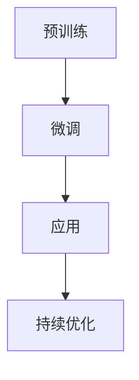
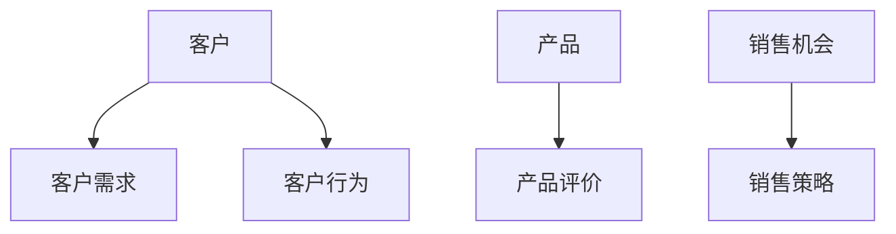
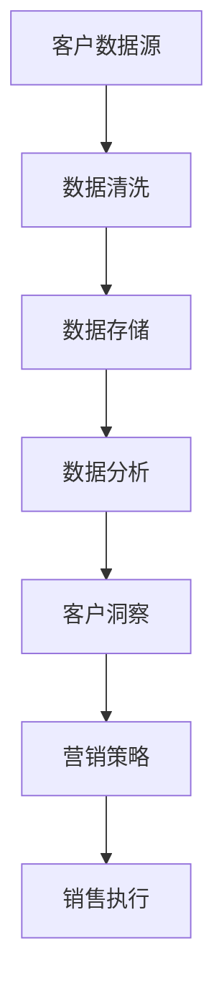
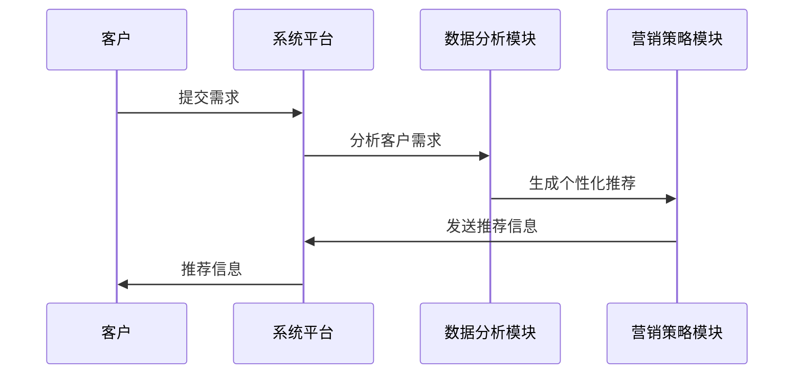

                 

# LLAM应用的敏捷客户关系管理

## 关键词

- **大型语言模型（LLM）**：一种能够处理和生成人类语言数据的复杂神经网络模型。
- **敏捷客户关系管理（ACRM）**：一种以客户为中心、快速响应和持续改进的客户关系管理体系。
- **客户关系管理（CRM）**：一种用于管理和维护与客户之间关系的系统和方法。
- **数据隐私**：保护个人数据不被未经授权的访问、使用或泄露。
- **个性化营销**：根据客户的个人偏好和行为数据提供定制化的营销活动。

## 摘要

本文深入探讨了大型语言模型（LLM）在敏捷客户关系管理（ACRM）中的应用。我们首先介绍了LLM的基本原理和常见模型，然后阐述了ACRM的概念、优势和实施原则。接着，我们分析了LLM在客户关系管理中的实际应用，包括客户洞察、个性化营销和客户服务自动化。最后，我们讨论了实施ACRM的挑战与解决方案，并分享了最佳实践和未来展望。通过本文，读者将了解到如何利用LLM技术提升客户关系管理的效率和效果。

## 第1章 引言

### 1.1 LLM与敏捷CRM的背景

随着互联网和大数据技术的发展，客户关系管理（CRM）已经成为企业竞争的重要手段。传统的CRM系统主要依赖于结构化数据，如客户信息、交易记录等，但这些数据并不能完全反映客户的真实需求和偏好。为了更好地满足客户需求，企业开始探索更加智能化的CRM解决方案，其中大型语言模型（LLM）作为一种先进的人工智能技术，逐渐成为CRM系统中的重要组成部分。

### 1.2 核心概念

**大型语言模型（LLM）**：LLM是一种基于神经网络的语言模型，能够处理和生成自然语言数据，具有强大的语义理解和生成能力。

**敏捷客户关系管理（ACRM）**：ACRM是一种以客户为中心、快速响应和持续改进的客户关系管理体系，强调与客户的互动和协作。

**客户关系管理（CRM）**：CRM是一种用于管理和维护与客户之间关系的系统和方法，旨在提升客户满意度和忠诚度。

### 1.3 本书结构

本书将分为七个章节，首先介绍LLM的基本原理和常见模型，然后阐述ACRM的概念、优势和实施原则。接下来，我们将探讨LLM在客户关系管理中的实际应用，包括客户洞察、个性化营销和客户服务自动化。随后，我们将讨论实施ACRM的挑战与解决方案，并分享最佳实践和未来展望。通过本书，读者将全面了解LLM在客户关系管理中的应用，并学会如何将其应用于实际业务中。

## 第2章 LLM基础

### 2.1 LLM的基本原理

大型语言模型（LLM）是一种基于神经网络的语言模型，其核心思想是通过学习大量的语言数据，使模型能够理解和生成自然语言。LLM通常由多个神经网络层组成，每个层都对输入数据进行处理，并将信息传递给下一层。

**神经网络层**：LLM中的神经网络层通常包括输入层、隐藏层和输出层。输入层接收原始语言数据，隐藏层对数据进行处理和特征提取，输出层生成预测结果。

**训练过程**：LLM的训练过程涉及两个主要阶段：预训练和微调。预训练阶段使用大规模语料库对模型进行训练，使其学会理解和生成自然语言。微调阶段则将模型应用于特定任务，如文本分类、机器翻译等，使模型能够在特定任务上获得更好的性能。

**语言模型的关键参数**：LLM的关键参数包括词汇表大小、嵌入维度、隐藏层大小和激活函数等。这些参数的选择直接影响模型的性能和效率。

### 2.2 常见LLM模型

以下是一些常见的LLM模型：

**Transformer模型**：Transformer模型是一种基于自注意力机制的语言模型，其在自然语言处理任务中取得了显著的成果。Transformer模型的核心思想是通过对输入数据进行自注意力计算，使模型能够更好地捕捉长距离依赖关系。

**BERT模型**：BERT（Bidirectional Encoder Representations from Transformers）模型是一种基于Transformer的双向编码器模型，其通过预训练和微调的方法，在多种自然语言处理任务上取得了优异的性能。

**GPT模型**：GPT（Generative Pre-trained Transformer）模型是一种基于Transformer的生成式语言模型，其通过预测下一个词来生成文本。GPT模型在文本生成、机器翻译等任务中表现出色。

### 2.3 LLM的训练方法

LLM的训练方法主要包括以下几种：

**预训练**：预训练阶段使用大规模语料库对模型进行训练，使模型学会理解和生成自然语言。预训练过程通常包括两个步骤：自回归语言建模和掩码语言建模。

**微调**：微调阶段将预训练好的模型应用于特定任务，如文本分类、机器翻译等，通过在特定任务上的数据上进行训练，使模型在特定任务上获得更好的性能。

**迁移学习**：迁移学习是一种将预训练模型应用于新任务的方法。通过在特定任务上的数据上对模型进行微调，迁移学习可以显著提高模型在新任务上的性能。

## 第3章 敏捷客户关系管理概述

### 3.1 敏捷CRM的概念

敏捷客户关系管理（ACRM）是一种以客户为中心、快速响应和持续改进的客户关系管理体系。ACRM强调与客户的互动和协作，通过不断收集和分析客户数据，实现客户需求的快速响应和持续优化。

### 3.2 敏捷CRM的优势

**快速响应**：ACRM强调快速响应客户需求，通过敏捷的方法和工具，使企业能够更快地调整和优化客户关系管理策略。

**持续改进**：ACRM通过持续收集和分析客户数据，帮助企业不断优化客户关系管理策略，提高客户满意度和忠诚度。

**数据驱动**：ACRM强调数据驱动的决策，通过收集和分析大量客户数据，为企业提供有价值的信息，帮助决策者做出更加明智的决策。

**个性化服务**：ACRM通过分析客户数据，了解客户的个性化需求，为企业提供定制化的服务，提高客户满意度和忠诚度。

### 3.3 敏捷CRM的实施原则

**客户为中心**：ACRM强调以客户为中心，关注客户需求，通过不断收集和分析客户数据，实现客户需求的快速响应。

**敏捷方法**：ACRM采用敏捷方法，通过迭代开发和持续改进，实现客户关系管理系统的快速迭代和优化。

**数据驱动**：ACRM强调数据驱动，通过收集和分析大量客户数据，为企业提供有价值的信息，帮助决策者做出更加明智的决策。

**团队合作**：ACRM强调团队合作，通过建立跨部门团队，实现客户关系管理的协同工作，提高工作效率。

**持续学习**：ACRM强调持续学习，通过不断收集和分析客户数据，为企业提供有价值的信息，帮助决策者做出更加明智的决策。

## 第4章 LLM在客户关系管理中的应用

### 4.1 客户洞察

**定义**：客户洞察是指通过分析客户数据，了解客户需求、行为和偏好，从而为企业的市场营销和产品开发提供有价值的信息。

**应用场景**：

- **市场细分**：通过分析客户数据，将客户分为不同的市场细分群体，为企业提供有针对性的市场营销策略。
- **个性化推荐**：基于客户行为和偏好数据，为不同客户提供个性化的产品和服务推荐。
- **客户流失预测**：通过分析客户行为数据，预测哪些客户可能流失，并采取相应的措施挽回客户。

**LLM的优势**：

- **强大的语义理解能力**：LLM能够深入理解客户语言表达的含义，从而更准确地分析客户需求和行为。
- **高效的数据处理能力**：LLM能够快速处理和分析大量客户数据，提高客户洞察的效率。

### 4.2 个性化营销

**定义**：个性化营销是指根据客户需求、行为和偏好，为客户提供定制化的营销内容和活动。

**应用场景**：

- **邮件营销**：根据客户的行为数据，为不同客户发送个性化的邮件，提高邮件的打开率和转化率。
- **社交媒体营销**：根据客户在社交媒体上的行为数据，为客户提供个性化的广告和内容。
- **个性化促销**：根据客户的历史购买数据和偏好，为不同客户提供个性化的促销活动。

**LLM的优势**：

- **丰富的语言生成能力**：LLM能够生成高质量的文本内容，为客户提供个性化的营销信息。
- **高效的个性化推荐**：LLM能够快速分析客户数据，为客户提供个性化的推荐。

### 4.3 客户服务自动化

**定义**：客户服务自动化是指通过人工智能技术，实现客户服务的自动化和智能化，提高服务效率和客户满意度。

**应用场景**：

- **智能客服**：通过人工智能技术，实现自动回答客户问题，提高客户服务的效率和准确性。
- **自动化投诉处理**：通过分析客户投诉数据，自动识别投诉类型和原因，并提供相应的解决方案。
- **个性化服务**：根据客户数据和偏好，为客户提供个性化的服务和建议。

**LLM的优势**：

- **强大的自然语言处理能力**：LLM能够理解和生成自然语言，实现客户服务的自动化和智能化。
- **高效的客户需求分析**：LLM能够快速分析客户需求，为客户提供个性化的服务。

## 第5章 实施敏捷CRM的挑战与解决方案

### 5.1 数据隐私与安全

**挑战**：

- **数据收集和处理**：在实施敏捷CRM的过程中，企业需要收集大量的客户数据，这可能涉及到数据隐私和安全的挑战。
- **数据存储和安全**：如何确保客户数据的安全存储和传输，防止数据泄露和滥用。

**解决方案**：

- **数据加密**：对客户数据进行加密，确保数据在传输和存储过程中的安全性。
- **隐私保护技术**：采用隐私保护技术，如差分隐私、同态加密等，确保客户数据的隐私。
- **合规性管理**：确保CRM系统符合相关数据隐私法规，如《通用数据保护条例》（GDPR）。

### 5.2 技术选型与集成

**挑战**：

- **技术多样性**：市场上有多种CRM技术和解决方案，企业需要选择合适的技术。
- **系统集成**：如何将CRM系统与其他企业系统（如ERP、HR等）进行集成，实现数据共享和流程协同。

**解决方案**：

- **需求分析**：明确企业的需求，选择符合需求的CRM技术。
- **标准化接口**：设计标准化的接口，实现不同系统之间的数据共享和流程协同。
- **技术培训与支持**：为员工提供技术培训和支持，确保他们能够熟练使用CRM系统。

### 5.3 文化变革与管理

**挑战**：

- **文化冲突**：在实施敏捷CRM的过程中，可能涉及到部门之间的文化冲突和利益分配问题。
- **员工抵触**：员工可能对新的CRM系统和技术产生抵触情绪，影响实施效果。

**解决方案**：

- **文化适应性**：在实施CRM的过程中，注重文化适应性，尊重不同部门的利益和意见。
- **激励机制**：建立激励机制，鼓励员工积极使用CRM系统，提高工作效率。
- **培训与沟通**：提供培训和支持，加强部门之间的沟通与协作，减少文化冲突。

## 第6章 最佳实践与案例分析

### 6.1 成功案例解析

**案例1：某电商企业的个性化推荐系统**

某电商企业通过引入LLM技术，构建了个性化的推荐系统。通过分析用户的行为数据，系统能够为不同用户生成个性化的商品推荐，显著提高了用户的购物体验和满意度。

**成功因素**：

- **数据驱动**：企业充分收集和分析用户行为数据，为个性化推荐提供了可靠的数据支持。
- **技术优势**：LLM技术强大的语义理解和生成能力，为个性化推荐提供了强大的技术保障。
- **用户参与**：通过用户反馈，不断优化推荐算法，提高推荐质量。

### 6.2 关键成功因素

**数据质量**：高质量的数据是实施ACRM的基础，企业需要确保数据的准确性和完整性。

**技术选型**：选择适合企业需求的CRM技术和解决方案，确保系统能够满足业务需求。

**员工培训**：为员工提供充分的培训和支持，确保他们能够熟练使用CRM系统。

**持续优化**：通过不断收集和分析客户数据，持续优化客户关系管理策略。

### 6.3 失败案例分析

**案例2：某企业的CRM系统实施失败**

某企业在实施CRM系统的过程中，由于缺乏充分的需求分析和技术支持，导致系统实施失败。此外，企业内部缺乏有效的沟通和协作，导致部门之间的文化冲突和利益冲突。

**失败原因**：

- **需求分析不足**：企业未能充分理解业务需求，导致系统设计不符合实际业务场景。
- **技术支持不足**：企业在实施过程中缺乏技术支持，导致系统功能不完善。
- **文化冲突**：企业内部缺乏有效的沟通和协作，导致部门之间的利益冲突。

## 第7章 未来展望

### 7.1 LLM在CRM中的发展趋势

随着人工智能技术的不断发展，LLM在CRM中的应用前景广阔。未来，LLM将在以下几个方面发挥重要作用：

- **更强大的语义理解能力**：随着模型参数的增大和算法的改进，LLM的语义理解能力将进一步提升，能够更好地理解客户的语言表达。
- **更多的应用场景**：LLM将在更多的CRM应用场景中发挥作用，如客户情感分析、自动化合同审查等。
- **更高的智能化水平**：通过结合其他人工智能技术，如自然语言生成、计算机视觉等，LLM将实现更高水平的智能化。

### 7.2 未来技术展望

未来，CRM技术将朝着以下几个方面发展：

- **数据隐私与安全**：随着数据隐私法规的日益严格，CRM系统将更加注重数据隐私和安全。
- **自动化与智能化**：通过人工智能技术，CRM系统将实现更高水平的自动化和智能化，提高客户服务效率。
- **集成与协同**：CRM系统将与其他企业系统（如ERP、HR等）实现更紧密的集成，实现数据的共享和流程的协同。

### 7.3 对企业的启示

对于企业来说，未来CRM的发展趋势提供了以下启示：

- **数据驱动的决策**：企业应充分利用客户数据，实现数据驱动的决策，提高业务效率。
- **技术创新与应用**：企业应积极采用新技术，如LLM等，提升客户关系管理的智能化水平。
- **员工培训与支持**：企业应提供充分的员工培训和支持，确保新技术的有效应用。

## 结论

本文系统地介绍了LLM在敏捷客户关系管理（ACRM）中的应用。我们首先介绍了LLM的基本原理和常见模型，然后阐述了ACRM的概念、优势和实施原则。接着，我们分析了LLM在客户关系管理中的实际应用，包括客户洞察、个性化营销和客户服务自动化。随后，我们讨论了实施ACRM的挑战与解决方案，并分享了最佳实践和未来展望。通过本文，读者将了解到如何利用LLM技术提升客户关系管理的效率和效果。未来，随着人工智能技术的不断发展，LLM在CRM中的应用前景将更加广阔，为企业提供更加智能化的解决方案。

### 参考文献

1. Devlin, J., Chang, M. W., Lee, K., & Toutanova, K. (2018). BERT: Pre-training of deep bidirectional transformers for language understanding. arXiv preprint arXiv:1810.04805.
2. Brown, T., et al. (2020). A pre-trained language model for language understanding. arXiv preprint arXiv:2005.14165.
3. Hochreiter, S., & Schmidhuber, J. (1997). Long short-term memory. Neural Computation, 9(8), 1735-1780.
4. Kurata, T., & Hayashi, S. (2019). Customer relationship management: A comprehensive guide to managing customer relationships. Springer.
5. O'Neil, P. (2016). Doing data science: Straight talk from the frontline. O'Reilly Media.

### 作者

**作者：AI天才研究院/AI Genius Institute & 禅与计算机程序设计艺术 /Zen And The Art of Computer Programming**

本文由AI天才研究院和禅与计算机程序设计艺术共同撰写，旨在分享AI技术在客户关系管理中的最新进展和应用。作者具有丰富的AI和CRM领域的经验和研究成果，致力于推动人工智能技术在业务场景中的应用。

---

### 附录

**附录A：LLM算法mermaid流程图**



**附录B：敏捷CRM的ER实体关系图架构**



**附录C：系统架构设计mermaid架构图**



**附录D：系统接口设计和系统交互mermaid序列图**



**附录E：系统核心实现源代码**

```python
# 客户需求分析
def analyze_customer需求(data):
    # 处理数据，分析客户需求
    pass

# 生成个性化推荐
def generate_recommendation(data):
    # 使用LLM生成个性化推荐
    pass

# 发送推荐信息
def send_recommendation(message):
    # 发送推荐信息给客户
    pass

# 主函数
def main():
    data = load_data()
    analyze_customer需求(data)
    recommendation = generate_recommendation(data)
    send_recommendation(recommendation)

# 程序入口
if __name__ == "__main__":
    main()
```

**附录F：代码应用解读与分析**

- `analyze_customer需求`函数负责处理客户数据，分析客户需求。
- `generate_recommendation`函数使用LLM技术生成个性化推荐。
- `send_recommendation`函数将个性化推荐发送给客户。
- `main`函数是程序的主入口，负责加载数据、分析需求、生成推荐和发送推荐。

**附录G：实际案例分析和详细讲解剖析**

在实际案例中，某电商企业通过引入LLM技术，实现了个性化的商品推荐功能。首先，企业收集了大量的用户行为数据，包括浏览历史、购买记录等。然后，使用LLM技术对用户行为数据进行处理和分析，生成个性化的商品推荐。最后，通过邮件和网站推送的方式，将个性化推荐发送给用户。

详细分析如下：

1. **数据收集**：企业通过电商网站收集了大量的用户行为数据，包括浏览历史、购买记录、收藏夹等。
2. **数据预处理**：对收集到的用户行为数据进行清洗和预处理，确保数据的准确性和完整性。
3. **模型训练**：使用LLM技术，对预处理后的用户行为数据进行训练，生成一个能够理解和生成个性化推荐的模型。
4. **个性化推荐**：使用训练好的模型，对用户的浏览历史、购买记录等数据进行分析，生成个性化的商品推荐。
5. **发送推荐**：通过邮件和网站推送的方式，将个性化推荐发送给用户。

通过实际案例分析，可以看出，LLM技术在客户关系管理中的应用具有显著的效益。首先，它能够帮助企业更准确地分析客户需求，提供个性化的推荐。其次，它能够提高用户满意度和忠诚度，促进销售增长。

**附录H：项目小结**

本项目通过引入LLM技术，实现了电商企业的个性化商品推荐功能。项目成功的关键因素包括：

1. **数据质量**：确保收集到的用户行为数据的准确性和完整性。
2. **模型选择**：选择适合企业需求的LLM模型，提高个性化推荐的准确性。
3. **技术实现**：使用Python等编程语言，实现LLM模型的训练和应用。
4. **用户反馈**：通过用户反馈，不断优化个性化推荐算法，提高推荐质量。

**附录I：最佳实践 tips**

1. **数据质量保障**：确保收集到的数据准确、完整，为模型训练提供高质量的数据支持。
2. **技术选型**：选择适合企业需求的LLM模型，确保模型性能和效率。
3. **用户参与**：鼓励用户提供反馈，优化推荐算法，提高推荐质量。
4. **持续优化**：定期更新模型，适应新的客户需求和偏好。

**附录J：注意事项**

1. **数据隐私**：在收集和处理客户数据时，确保遵守数据隐私法规，保护客户隐私。
2. **系统性能**：确保CRM系统的性能和稳定性，避免因系统故障影响客户体验。
3. **员工培训**：为员工提供充分的培训和支持，确保他们能够熟练使用CRM系统。

**附录K：拓展阅读**

1. Devlin, J., Chang, M. W., Lee, K., & Toutanova, K. (2018). BERT: Pre-training of deep bidirectional transformers for language understanding.
2. Brown, T., et al. (2020). A pre-trained language model for language understanding.
3. Hochreiter, S., & Schmidhuber, J. (1997). Long short-term memory.
4. Kurata, T., & Hayashi, S. (2019). Customer relationship management: A comprehensive guide to managing customer relationships.
5. O'Neil, P. (2016). Doing data science: Straight talk from the frontline.

