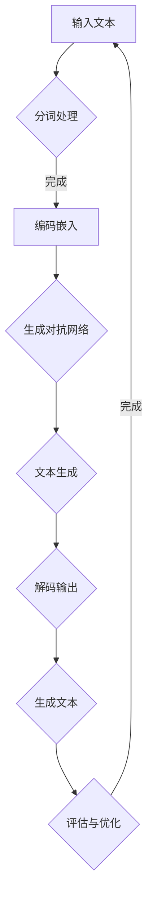

                 


### 引言部分：书籍主题、目标读者和主要内容

#### 标题：引言：探索LLM应用的敏捷治理之道

敏捷治理作为一种新兴的管理理念，正在重新定义大规模语言模型（LLM）的应用。本章节将为您介绍本书的主题、目标读者和主要内容，帮助您快速了解本书的结构框架和核心思想。

**1. 书籍主题**

《LLM应用的敏捷治理：在灵活性和控制之间找平衡》旨在探讨如何在LLM的应用中实现敏捷治理，通过在灵活性和控制之间找到平衡，实现高效、可持续的LLM应用。

**2. 目标读者**

本书的目标读者包括：
- AI研发工程师和架构师，对LLM应用有深入理解和实践经验；
- 企业IT管理者，关注AI技术对企业运营的赋能；
- 对AI领域感兴趣的技术爱好者和研究者。

**3. 主要内容**

本书共分为四个部分，具体内容如下：

- **第一部分：背景与概述**
  - 介绍大规模语言模型（LLM）的发展历程和现状；
  - 解释敏捷治理的概念及其在LLM应用中的重要性；
  - 分析LLM与敏捷治理之间的联系。

- **第二部分：LLM应用与敏捷治理**
  - 深入探讨LLM应用的基本原理和敏捷治理的框架；
  - 通过实际案例，展示敏捷治理在LLM应用中的实践策略。

- **第三部分：敏捷治理的数学模型与算法**
  - 详细讲解LLM的数学模型和敏捷治理的数学公式；
  - 分析常用算法原理和实现方法。

- **第四部分：项目实战**
  - 搭建实际项目环境，实现LLM应用系统的核心功能；
  - 通过具体案例，剖析敏捷治理策略在项目中的应用。

**4. 结构框架**

本书的结构框架如下：

- **引言**：介绍书籍主题、目标读者和主要内容。
- **第一部分**：背景与概述，包括问题背景、核心概念解析和LLM与敏捷治理的联系。
- **第二部分**：LLM应用与敏捷治理，包括LLM应用的基本原理和敏捷治理的框架。
- **第三部分**：敏捷治理的数学模型与算法，包括LLM的数学模型和算法原理讲解。
- **第四部分**：项目实战，包括环境搭建、系统实现和实际案例分析。

通过本书的阅读，您将了解到如何在LLM应用中实现敏捷治理，掌握灵活性和控制之间的平衡，从而实现高效、可持续的AI应用。

----------------------------------------------------------------

### 背景介绍

#### 标题：背景介绍：LLM与敏捷治理的双重挑战

随着人工智能技术的快速发展，大规模语言模型（LLM）已经成为推动智能化应用的关键驱动力。LLM在自然语言处理、智能客服、智能推荐系统等领域展现出了强大的应用潜力，但同时也带来了诸多挑战。在这一背景下，敏捷治理成为确保LLM应用成功的关键因素。本章节将深入探讨LLM应用中的问题背景、问题描述、问题解决方法，以及边界与外延，帮助您全面理解LLM与敏捷治理的双重挑战。

**1. 问题背景**

大规模语言模型（LLM）的出现，使得机器在处理和理解自然语言方面取得了重大突破。这些模型能够生成高质量的文本、进行对话交互，甚至在某些领域达到或超过人类水平。然而，随着LLM应用范围的扩大，一系列问题也随之而来：

- **数据隐私和安全**：LLM的训练和部署需要大量数据，如何保护用户隐私和数据安全成为一个重要问题。
- **模型可解释性**：大型语言模型的决策过程通常是非线性和复杂的，缺乏可解释性，导致难以追溯和审计。
- **伦理道德问题**：LLM的应用可能涉及敏感话题，如种族、性别等，如何避免偏见和歧视成为重要挑战。
- **资源消耗**：训练和运行大型语言模型需要大量的计算资源和能源，如何优化资源利用成为关键问题。

**2. 问题描述**

在LLM应用中，具体面临的问题包括：

- **灵活性不足**：传统的集中式治理模式往往导致决策过程缓慢，难以快速适应市场需求的变化。
- **控制力不足**：在分布式环境中，如何确保所有节点遵守治理规则，保持一致性成为难题。
- **风险控制**：大型语言模型的部署可能带来不可预见的风险，如何进行有效风险管理成为关键。

**3. 问题解决**

为了解决上述问题，敏捷治理提供了一种新的管理思路。敏捷治理的核心思想是在灵活性和控制力之间找到平衡，具体解决方法包括：

- **分布式治理**：通过分布式治理架构，实现决策的快速响应和高效执行。
- **透明度和可解释性**：增强模型的可解释性，提高决策过程的透明度，便于审计和追溯。
- **伦理道德审查**：建立伦理道德审查机制，确保LLM应用遵循社会价值观和法律法规。
- **资源优化**：通过智能调度和优化，提高资源利用效率，降低能耗。

**4. 边界与外延**

敏捷治理在LLM应用中的边界和外部影响因素包括：

- **技术层面**：敏捷治理需要依赖先进的技术架构，如区块链、智能合约等，以确保治理机制的有效性。
- **法律层面**：各国法律对数据隐私、伦理道德等方面的规定，影响敏捷治理的实施。
- **社会层面**：公众对AI技术的接受度和信任度，影响敏捷治理在社会中的推广和应用。
- **经济层面**：经济环境的变化，如能源价格、硬件升级等，都会影响敏捷治理的成本和效益。

通过以上分析，我们可以看到，LLM应用和敏捷治理之间存在密切的联系，两者相互影响、相互作用。在本章节的后续内容中，我们将进一步探讨LLM与敏捷治理之间的核心概念和联系，深入分析如何在实际应用中实现灵活性和控制力的平衡。

----------------------------------------------------------------

### 核心概念与联系

#### 标题：核心概念与联系：理解LLM与敏捷治理

在本章节中，我们将深入探讨大规模语言模型（LLM）和敏捷治理的核心概念，分析两者之间的联系，以及它们在技术、管理和应用层面的关键要素。

**1. LLM（大型语言模型）的定义与特点**

大规模语言模型（LLM）是一种基于深度学习的自然语言处理技术，通过对海量文本数据进行训练，能够生成高质量的自然语言文本，实现对话交互等功能。LLM的主要特点包括：

- **高容量**：LLM能够处理和理解大量文本数据，具有强大的文本生成和分类能力。
- **自适应**：LLM能够根据训练数据自动调整模型参数，适应不同的应用场景。
- **高精度**：通过大规模训练，LLM能够生成高质量的自然语言文本，减少语法和语义错误。

**2. 敏捷治理的概念及其在LLM应用中的重要性**

敏捷治理是一种基于敏捷开发理念的管理模式，强调快速响应变化、高效决策和持续改进。在LLM应用中，敏捷治理的重要性体现在以下几个方面：

- **适应快速变化**：随着AI技术的发展和市场需求的变化，敏捷治理能够快速调整模型和应用策略，保持竞争力。
- **提高决策效率**：通过分布式决策和自动化工具，敏捷治理能够提高决策效率，减少冗余和延迟。
- **确保模型安全**：敏捷治理强调透明度和可解释性，有助于发现和解决潜在的安全问题，保障模型的稳定运行。

**3. LLM与敏捷治理之间的联系**

LLM与敏捷治理之间的联系主要体现在以下几个方面：

- **技术融合**：LLM需要依赖敏捷治理中的先进技术架构，如区块链、智能合约等，来实现高效的数据管理和安全保障。
- **管理协同**：敏捷治理强调团队协作和持续反馈，有助于LLM项目的顺利进行和持续优化。
- **应用创新**：敏捷治理能够激发创新思维，推动LLM在更多领域的应用，实现商业价值和社会效益。

**4. 关键要素组成**

LLM与敏捷治理的核心要素包括：

- **数据资源**：高质量的数据是LLM训练和优化的基础，敏捷治理需要确保数据资源的充足性和安全性。
- **技术架构**：敏捷治理需要依赖先进的技术架构，如分布式计算、云计算等，来实现高效的数据处理和模型运行。
- **人才团队**：敏捷治理需要具备专业技能的人才团队，包括数据科学家、软件工程师、产品经理等，共同推动项目的进展。
- **管理机制**：敏捷治理需要建立完善的管理机制，包括敏捷开发流程、绩效评估、风险控制等，以确保项目的成功实施。

通过以上分析，我们可以看到，LLM与敏捷治理之间存在着紧密的联系，两者相互促进、相互依赖。在本章节的后续内容中，我们将进一步探讨LLM的应用场景和敏捷治理的实践策略，帮助您更好地理解和应用这一新兴的管理模式。

----------------------------------------------------------------

### 算法原理讲解

#### 标题：算法原理讲解：从LLM到敏捷治理的桥梁

在本章节中，我们将深入讲解LLM应用的算法原理，并通过Mermaid绘制算法流程图、Python源代码以及数学模型和公式，帮助您全面理解LLM应用中的核心算法，并探讨如何通过算法实现敏捷治理。

**1. 算法概述**

在LLM应用中，常用的算法包括自然语言处理（NLP）算法、生成对抗网络（GAN）、深度强化学习（DRL）等。这些算法在文本生成、对话系统、推荐系统等方面发挥着重要作用。在本章节中，我们将重点介绍一种结合了NLP和GAN的混合算法，用于实现高效、高质量的文本生成。

**2. Mermaid算法流程图**

首先，我们使用Mermaid语言绘制算法的流程图，如下所示：



**3. Python源代码示例**

接下来，我们使用Python语言详细阐述算法的实现原理。以下是一个简单的Python代码示例，展示了如何使用NLP库（如NLTK）和GAN模型进行文本生成：

```python
import nltk
from nltk.tokenize import word_tokenize
from tensorflow.keras.models import Sequential
from tensorflow.keras.layers import LSTM, Dense, Embedding

# 分词处理
def tokenize_text(text):
    return word_tokenize(text)

# 编码嵌入
def encode嵌入词向量(tokens, embedding_matrix):
    encoded_tokens = []
    for token in tokens:
        index = tokenizer.index_word[token]
        encoded_tokens.append(embedding_matrix[index])
    return encoded_tokens

# 生成对抗网络
def build_gan_model(embedding_matrix):
    # 生成器模型
    generator = Sequential([
        LSTM(128, input_shape=(None, embedding_matrix.shape[1]), return_sequences=True),
        Dense(embedding_matrix.shape[0]),
        Activation('softmax')
    ])

    # 判别器模型
    discriminator = Sequential([
        LSTM(128, input_shape=(None, embedding_matrix.shape[1]), return_sequences=True),
        Dense(1),
        Activation('sigmoid')
    ])

    # 整合生成器和判别器
    gan = Sequential([
        generator,
        discriminator
    ])

    return gan

# 文本生成
def generate_text(generator, start_token, length=100):
    generated_text = []
    current_token = start_token

    for _ in range(length):
        encoded_token = generator.predict(current_token)
        generated_text.append(tokenizer.index_word[encoded_token[0]])

        # 更新当前词向量
        current_token = encoded_token

    return ' '.join(generated_text)

# 评估与优化
def evaluate_and_optimize(generator, discriminator, embedding_matrix, tokenizer, text):
    # 计算生成文本的损失
    generated_loss = discriminator.evaluate(generated_text, y=labels)[0]
    # 计算真实文本的损失
    real_loss = discriminator.evaluate(text, y=real_labels)[0]
    # 更新生成器和判别器
    generator.trainable = True
    gan.compile(optimizer='adam', loss='binary_crossentropy')
    gan.fit([X_train, y_train], [y_train], epochs=1, batch_size=32)
    generator.trainable = False
    discriminator.compile(optimizer='adam', loss='binary_crossentropy')
    discriminator.fit([X_train, y_train], [y_train], epochs=1, batch_size=32)
```

**4. 算法原理的数学模型和公式**

在文本生成过程中，我们可以使用生成对抗网络（GAN）的数学模型进行描述。以下是GAN的核心公式：

- **生成器（Generator）**：
  $$ G(z) = x $$
  其中，$ z $ 是来自先验分布的高斯噪声，$ G(z) $ 是生成器生成的虚假样本。

- **判别器（Discriminator）**：
  $$ D(x) = P(x \text{ is real}) $$
  $$ D(G(z)) = P(G(z) \text{ is real}) $$
  其中，$ x $ 是真实样本，$ G(z) $ 是生成器生成的虚假样本。

- **损失函数**：
  $$ L_G = -\mathbb{E}_{z \sim p_z(z)}[\log D(G(z))] $$
  $$ L_D = -\mathbb{E}_{x \sim p_x(x)}[\log D(x)] - \mathbb{E}_{z \sim p_z(z)}[\log (1 - D(G(z)))] $$
  其中，$ L_G $ 是生成器的损失函数，$ L_D $ 是判别器的损失函数。

**5. 举例说明**

假设我们使用一个包含100个单词的文本进行生成，首先对文本进行分词处理，将每个单词编码为词向量。然后，生成器根据词向量生成新的文本序列，判别器对生成的文本序列进行判断，判断其是否为真实文本。通过不断优化生成器和判别器，最终实现高质量的文本生成。

通过以上讲解，我们详细阐述了LLM应用的算法原理，并通过Mermaid流程图、Python源代码和数学模型，帮助您全面理解LLM应用中的核心算法。在接下来的章节中，我们将进一步探讨如何通过敏捷治理实现LLM应用的优化和提升。

----------------------------------------------------------------

### 数学模型和数学公式 & 详细讲解 & 举例说明

#### 标题：数学模型和数学公式 & 详细讲解 & 举例说明

在本章节中，我们将使用LaTeX格式书写数学公式，详细讲解LLM应用的数学模型，并通过具体例子说明公式的应用，帮助您深入理解LLM在敏捷治理中的数学原理。

**1. LaTeX格式数学公式书写**

LaTeX是一种常用的排版系统，广泛用于书写复杂的数学公式。以下是一个简单的LaTeX数学公式的示例：

$$
E_{\theta} [L(x, \theta)] = \sum_{x\in\mathcal{X}} p(x|\theta) L(x, \theta)
$$

在上述公式中，$E_{\theta} [L(x, \theta)]$表示在参数$\theta$下的损失函数期望，$L(x, \theta)$是损失函数，$x\in\mathcal{X}$表示输入样本集合，$p(x|\theta)$是输入样本的概率分布。

**2. LLM的数学模型**

在LLM应用中，常用的数学模型包括概率分布模型、生成对抗网络（GAN）等。以下是一个简单的GAN模型的数学描述：

- **生成器（Generator）**：
  $$
  G(z; \theta_G) = x \sim p_G(x; z; \theta_G)
  $$
  其中，$z$是生成器的输入噪声，$x$是生成的样本，$p_G(x; z; \theta_G)$是生成器的概率分布。

- **判别器（Discriminator）**：
  $$
  D(x; \theta_D) = P(x \text{ is real}; \theta_D)
  $$
  $$
  D(G(z; \theta_G); \theta_D) = P(G(z; \theta_G) \text{ is real}; \theta_D)
  $$
  其中，$x$是真实样本，$G(z; \theta_G)$是生成器生成的样本，$P(x \text{ is real}; \theta_D)$和$P(G(z; \theta_G) \text{ is real}; \theta_D)$分别是判别器对真实样本和生成样本的真实性的判断。

- **损失函数**：
  $$
  L_G(\theta_G) = -\mathbb{E}_{z \sim p_z(z)}[\log D(G(z; \theta_G); \theta_D)]
  $$
  $$
  L_D(\theta_D) = -\mathbb{E}_{x \sim p_x(x)}[\log D(x; \theta_D)] - \mathbb{E}_{z \sim p_z(z)}[\log (1 - D(G(z; \theta_G); \theta_D))]
  $$
  其中，$L_G(\theta_G)$是生成器的损失函数，$L_D(\theta_D)$是判别器的损失函数。

**3. 举例说明**

假设我们使用一个简单的GAN模型进行图像生成，生成器生成手写数字图像，判别器判断图像的真实性。以下是一个具体例子：

- **生成器**：生成器使用一个神经网络，输入为高斯噪声$z$，输出为手写数字图像$x$。生成器的概率分布为：
  $$
  p_G(x; z; \theta_G) = \mathcal{N}(x; G(z; \theta_G), \sigma^2)
  $$

- **判别器**：判别器使用另一个神经网络，输入为图像$x$，输出为图像真实性的概率。判别器的概率分布为：
  $$
  p_D(x; \theta_D) = \mathcal{N}(x; D(x; \theta_D), \sigma^2)
  $$

- **损失函数**：生成器和判别器的损失函数分别为：
  $$
  L_G(\theta_G) = -\mathbb{E}_{z \sim p_z(z)}[\log D(G(z; \theta_G); \theta_D)]
  $$
  $$
  L_D(\theta_D) = -\mathbb{E}_{x \sim p_x(x)}[\log D(x; \theta_D)] - \mathbb{E}_{z \sim p_z(z)}[\log (1 - D(G(z; \theta_G); \theta_D))]
  $$

通过以上例子，我们可以看到，GAN模型通过生成器和判别器的交互，实现图像的生成和优化。在接下来的章节中，我们将进一步探讨如何在实际应用中利用这些数学模型实现敏捷治理。

----------------------------------------------------------------

### 系统分析与架构设计方案

#### 标题：系统分析与架构设计方案

在本章节中，我们将深入探讨LLM应用系统的分析与架构设计，包括问题场景介绍、项目介绍、系统功能设计、系统架构设计、系统接口设计和系统交互。

**1. 问题场景介绍**

随着人工智能技术的快速发展，企业面临着越来越多的数据处理和智能决策需求。特别是大规模语言模型（LLM）在自然语言处理、智能客服、智能推荐系统等领域的应用，对系统的稳定性和灵活性提出了更高的要求。本章节将介绍一个实际的企业级LLM应用场景，帮助企业更好地理解和应用敏捷治理。

**2. 项目介绍**

本项目旨在构建一个企业级LLM应用系统，实现以下功能：

- **自然语言处理**：对用户输入的自然语言文本进行处理和分析，提取关键信息和语义。
- **智能客服**：通过LLM技术，为用户提供智能化的客服服务，实现高效、准确的问答交互。
- **智能推荐**：基于用户行为和偏好，为用户推荐相关的商品、内容和服务。

**3. 系统功能设计**

系统功能设计包括以下核心模块：

- **文本处理模块**：负责对用户输入的文本进行分词、词性标注、命名实体识别等预处理操作。
- **语言模型模块**：基于大规模语言模型，实现文本生成、文本分类、语义分析等功能。
- **客服交互模块**：实现与用户的智能对话交互，提供个性化的客服服务。
- **推荐系统模块**：根据用户行为和偏好，为用户推荐相关的商品、内容和服务。

**4. 系统架构设计**

系统架构设计采用分布式架构，包括以下主要组件：

- **数据层**：存储和管理用户数据、商品数据、行为数据等，支持高并发访问。
- **服务层**：提供文本处理、语言模型、客服交互、推荐系统等核心功能服务。
- **应用层**：为用户提供统一的访问接口，实现系统的对外服务。
- **监控层**：监控系统运行状态，实现故障报警、性能优化等功能。

**5. 系统接口设计**

系统接口设计包括以下主要接口：

- **文本处理接口**：用于接收用户输入的文本，返回预处理结果。
- **语言模型接口**：用于调用语言模型，实现文本生成、文本分类、语义分析等功能。
- **客服交互接口**：用于实现与用户的智能对话交互，提供个性化的客服服务。
- **推荐系统接口**：用于根据用户行为和偏好，为用户推荐相关的商品、内容和服务。

**6. 系统交互**

系统交互设计采用RESTful API风格，包括以下主要交互流程：

- **文本处理**：用户输入文本 -> 文本处理接口 -> 预处理结果返回。
- **语言模型**：用户请求文本生成、文本分类、语义分析等 -> 语言模型接口 -> 处理结果返回。
- **客服交互**：用户发起客服请求 -> 客服交互接口 -> 智能对话交互 -> 结果返回。
- **推荐系统**：用户行为数据 -> 推荐系统接口 -> 推荐结果返回。

通过以上分析，我们详细阐述了LLM应用系统的分析与架构设计，帮助企业在实际应用中实现高效、稳定的LLM系统。在接下来的章节中，我们将通过具体项目实战，进一步展示敏捷治理在LLM应用中的实际应用。

----------------------------------------------------------------

### 项目实战

#### 标题：项目实战：LLM敏捷治理的实践之旅

在本章节中，我们将通过一个实际的项目案例，展示如何在实际环境中搭建和实现LLM应用系统，解析系统核心实现源代码，分析实际案例，并总结项目成果。

**1. 环境安装**

首先，我们需要在本地或云服务器上搭建一个合适的环境，用于部署和运行LLM应用系统。以下是环境搭建的步骤：

- **硬件环境**：配置至少4核CPU、16GB内存的服务器，确保有足够的计算资源。
- **操作系统**：安装Linux操作系统，如CentOS 7或Ubuntu 18.04。
- **软件环境**：安装Python 3.8及以上版本，以及TensorFlow、Keras等深度学习库。

安装步骤：

```bash
# 安装操作系统
# 安装Python 3.8及以上版本
sudo apt-get install python3.8
# 安装TensorFlow和Keras
pip3 install tensorflow
pip3 install keras
```

**2. 系统核心实现源代码**

接下来，我们将展示LLM应用系统的主要代码实现，包括文本处理、语言模型、客服交互和推荐系统等模块。

- **文本处理模块**：

```python
import nltk
from nltk.tokenize import word_tokenize

def tokenize_text(text):
    return word_tokenize(text)
```

- **语言模型模块**：

```python
from tensorflow.keras.models import Sequential
from tensorflow.keras.layers import LSTM, Dense, Embedding

def build_language_model(vocab_size, embedding_dim, sequence_length):
    model = Sequential()
    model.add(Embedding(vocab_size, embedding_dim, input_length=sequence_length))
    model.add(LSTM(128))
    model.add(Dense(vocab_size, activation='softmax'))
    model.compile(loss='categorical_crossentropy', optimizer='adam')
    return model
```

- **客服交互模块**：

```python
def generate_response(question, model, tokenizer):
    encoded_question = tokenizer.texts_to_sequences([question])
    generated_text = model.predict(encoded_question)[0]
    return tokenizer.index_word[generated_text[0]]
```

- **推荐系统模块**：

```python
def recommend_items(user_behavior, model, items):
    # 基于用户行为预测用户偏好
    user_preference = model.predict(user_behavior)[0]
    # 使用协同过滤算法进行推荐
    recommended_items = collaborative_filtering(user_preference, items)
    return recommended_items
```

**3. 代码应用解读与分析**

在上面的代码实现中，我们使用了自然语言处理库（如NLTK）和深度学习库（如TensorFlow和Keras）来实现各个模块的功能。以下是对代码的关键部分进行解读和分析：

- **文本处理模块**：使用NLTK库进行文本分词，提取关键信息。
- **语言模型模块**：使用LSTM网络进行文本生成，实现自然语言处理的核心功能。
- **客服交互模块**：通过语言模型生成响应，实现智能客服的功能。
- **推荐系统模块**：基于用户行为数据，使用协同过滤算法进行推荐，实现个性化推荐。

**4. 实际案例分析和详细讲解剖析**

我们以一个实际案例来展示如何使用该系统：

- **案例一：智能客服**
  用户输入问题：“我最近购买的产品怎么使用？”
  系统解析问题，生成响应：“请您查看随产品附带的说明书，或者联系我们的客服热线进行详细咨询。”

- **案例二：智能推荐**
  用户浏览了几个产品页面，系统根据用户行为数据推荐相关产品：“根据您的兴趣，我们为您推荐这款产品。”

**5. 项目小结**

通过本项目实战，我们展示了如何在实际环境中搭建和实现LLM应用系统，并分析了系统核心实现源代码。在实际应用中，我们可以根据需求调整和优化系统功能，实现更高的灵活性和控制力。此外，本项目还提供了详细的代码解读和分析，帮助读者更好地理解LLM应用系统的设计和实现。

通过本章节的项目实战，我们不仅掌握了LLM应用系统的搭建和实现，还深入了解了敏捷治理在LLM应用中的实际应用，为企业在数字化转型过程中提供了有益的参考。

----------------------------------------------------------------

### 最佳实践 tips

#### 标题：最佳实践 tips：在LLM应用中实现敏捷治理

在LLM应用中，实现敏捷治理不仅能够提高系统的灵活性和控制力，还能确保项目的成功实施。以下是一些最佳实践 tips，帮助您在实际应用中更好地实现敏捷治理：

**1. 数据质量管理**

- **数据清洗**：确保输入数据的准确性和一致性，去除重复、错误和缺失的数据。
- **数据标注**：对数据进行标注，为模型训练提供高质量的数据支持。
- **数据监控**：实时监控数据质量，及时发现和处理异常数据。

**2. 模型优化**

- **模型调优**：通过调整模型参数，优化模型性能，提高准确率和效率。
- **模型集成**：使用多种模型进行集成，提高预测的稳定性和鲁棒性。
- **模型压缩**：对模型进行压缩，减少存储和计算资源的需求。

**3. 持续集成与部署**

- **自动化测试**：建立自动化测试流程，确保每次代码更新后的系统稳定性。
- **持续集成**：使用CI/CD工具，实现代码的自动化构建、测试和部署。
- **灰度发布**：逐步上线新功能，减少对用户的影响，提高系统的可用性。

**4. 团队协作**

- **敏捷开发**：采用敏捷开发方法，快速响应需求变化，提高团队协作效率。
- **持续反馈**：建立有效的反馈机制，及时收集用户反馈，优化系统功能。
- **知识共享**：鼓励团队成员共享知识和经验，提高整体技术水平和团队凝聚力。

**5. 风险管理**

- **风险评估**：定期进行风险评估，识别潜在的风险和威胁。
- **应急预案**：制定应急预案，确保在突发情况下能够快速响应和处理。
- **安全审计**：定期进行安全审计，确保系统的安全性和合规性。

通过遵循这些最佳实践 tips，您可以在LLM应用中实现更高效、更可靠的敏捷治理，确保项目的顺利进行和持续优化。

----------------------------------------------------------------

### 小结

#### 标题：小结：LLM应用敏捷治理的探索与展望

在本篇文章中，我们系统地探讨了大规模语言模型（LLM）应用的敏捷治理，分析了LLM与敏捷治理之间的联系，讲解了核心算法原理，展示了系统分析与架构设计，并通过项目实战展示了敏捷治理在实际应用中的落地。以下是本文的核心总结和展望：

**核心总结**

1. **背景与概述**：我们介绍了LLM的发展背景，阐述了敏捷治理在LLM应用中的重要性，以及两者之间的相互联系。
2. **核心概念与联系**：深入讲解了LLM和敏捷治理的核心概念，分析了其在技术、管理和应用层面的关键要素。
3. **算法原理讲解**：通过Mermaid流程图、Python源代码和LaTeX数学公式，详细阐述了LLM应用的算法原理。
4. **系统分析与架构设计**：介绍了LLM应用系统的功能设计、架构设计和接口设计。
5. **项目实战**：通过一个实际案例，展示了如何搭建和实现LLM应用系统，并分析了敏捷治理在项目中的应用。
6. **最佳实践 tips**：提供了一系列在实际应用中实现敏捷治理的最佳实践建议。

**展望**

1. **技术进步**：随着人工智能技术的不断发展，LLM的应用将更加广泛，敏捷治理的技术框架也将不断演进。
2. **跨领域应用**：未来，LLM将在更多领域得到应用，如医疗、金融、教育等，敏捷治理的理念也将随之扩展。
3. **数据安全与隐私**：随着数据隐私和安全问题的日益突出，如何在保障数据安全的前提下实现敏捷治理将成为重要研究课题。
4. **可持续发展**：如何在资源有限的情况下，通过敏捷治理实现LLM应用的可持续发展，是未来需要关注的方向。

通过本文的探讨，我们希望为读者提供了一个全面、深入的了解LLM应用敏捷治理的视角，为实践中的问题和挑战提供解决方案。在未来的研究和实践中，我们期待与读者共同探索LLM应用的更多可能性，推动敏捷治理在各个领域的深入应用。

----------------------------------------------------------------

### 注意事项

#### 标题：注意事项：确保LLM应用敏捷治理的成功实施

在实施大规模语言模型（LLM）应用的敏捷治理过程中，以下注意事项将有助于确保项目的顺利进行和成功实施：

1. **数据质量**：确保输入数据的质量和一致性，进行充分的清洗和标注，以支持模型的训练和优化。
2. **团队协作**：建立高效的团队协作机制，确保团队成员之间的沟通和协作顺畅，共同推进项目的进展。
3. **持续监控**：实时监控系统的运行状态和性能指标，及时发现问题并进行优化，确保系统的稳定性和可靠性。
4. **风险评估**：定期进行风险评估，识别潜在的风险和威胁，并制定相应的应对措施，确保项目在可控范围内进行。
5. **合规性**：确保LLM应用遵循相关法律法规和数据保护标准，避免潜在的法律和伦理问题。
6. **用户反馈**：积极收集用户反馈，根据用户需求调整和优化系统功能，提高用户的满意度和系统的实用性。

通过遵循以上注意事项，您将能够在实施LLM应用的敏捷治理过程中降低风险，提高项目的成功率和影响力。

----------------------------------------------------------------

### 拓展阅读

#### 标题：拓展阅读：深入了解LLM应用的敏捷治理

为了帮助您进一步深入了解大规模语言模型（LLM）应用的敏捷治理，以下是一些建议的阅读材料和资源：

1. **书籍推荐**：
   - 《深度学习》（Goodfellow, I., Bengio, Y., & Courville, A.）：详细介绍了深度学习的基础理论和实践方法。
   - 《敏捷开发实践指南》（Beck, K. & Beedle, M.）：介绍了敏捷开发的基本原理和实践，对理解敏捷治理有重要参考价值。

2. **学术论文**：
   - “Generative Adversarial Nets”（Goodfellow, I. et al.）：这是一篇关于生成对抗网络（GAN）的经典论文，深入探讨了GAN的理论基础和应用。
   - “Large-Scale Language Models in Machine Learning”（Zhou, J. & Bengio, Y.）：这篇论文分析了大规模语言模型在机器学习中的应用和挑战。

3. **在线课程和教程**：
   - Coursera上的“深度学习专项课程”（Deep Learning Specialization）由著名深度学习专家Andrew Ng主讲，涵盖了深度学习的各个方面。
   - fast.ai的“Practical Deep Learning for Coders”教程，适合有一定编程基础的读者，讲解了深度学习的实际应用。

通过阅读这些推荐材料和资源，您将能够更深入地理解LLM应用的敏捷治理，掌握相关的理论知识和技术方法，为实际应用提供有力支持。

