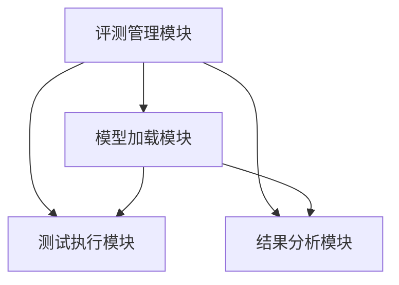
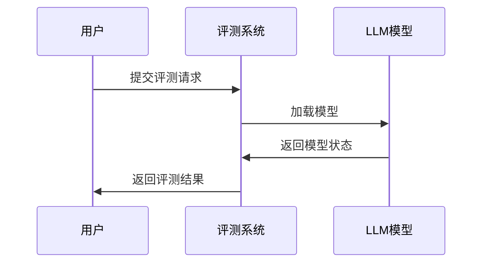

                 

# LLM评测系统的核心架构设计

关键词：大规模语言模型（LLM），评测系统，架构设计，微服务架构，性能测试，稳定性测试

摘要：随着大数据和人工智能技术的迅猛发展，大规模语言模型（LLM）在各个领域得到了广泛应用。为了确保LLM在现实场景中的性能和稳定性，设计一个高效、可扩展的LLM评测系统显得尤为重要。本文将深入探讨LLM评测系统的核心架构设计，包括背景介绍、核心概念、架构设计、系统接口设计以及系统核心实现等内容，以帮助读者更好地理解LLM评测系统的构建与优化。

## 第一部分：背景介绍

### 第1章：问题背景与核心概念

#### 1.1.1 问题的提出

随着互联网的迅猛发展和信息爆炸，人们对于信息处理的能力需求日益增长。在大数据和人工智能时代背景下，大规模语言模型（LLM）作为自然语言处理的核心技术，得到了广泛关注和应用。LLM通过深度学习技术，对海量文本数据进行分析和建模，从而实现文本生成、文本理解、对话系统等功能。然而，LLM在实际应用中需要不断地进行评测和优化，以提升其性能和稳定性。

#### 1.1.2 核心概念

大规模语言模型（LLM）是一种基于神经网络和深度学习技术的自然语言处理模型，能够对自然语言文本进行建模和生成。LLM评测系统是对LLM进行性能评估、错误分析、稳定性测试等操作的软件系统。

#### 1.1.3 概念联系

LLM评测系统是LLM应用的基础，其性能直接影响到LLM在现实场景中的表现。一个高效、可扩展的LLM评测系统有助于提升LLM的应用性能和稳定性，从而更好地满足用户需求。

### 第2章：核心概念原理与属性特征

#### 2.1.1 核心概念原理

大规模语言模型（LLM）的工作原理基于神经网络和深度学习技术。LLM通过训练大量的文本数据，学习到文本的语法、语义和上下文信息，从而实现对文本的建模和生成。

LLM评测系统的工作原理是对LLM的性能指标进行测量和分析，评估其性能和稳定性。性能指标包括语言生成能力、文本理解能力等，而稳定性测试则关注LLM在不同场景下的表现。

#### 2.1.2 属性特征对比表格

| 特征 | LLM | 评测系统 |
| ---- | ---- | ---- |
| 性能指标 | 语言生成能力、文本理解能力等 | 准确率、召回率、F1值等 |
| 功能模块 | 模型训练、模型加载、文本预处理等 | 性能测试、错误分析、稳定性测试等 |
| 边界与外延 | 语言建模、文本生成、对话系统等 | 性能评测、优化建议、结果展示等 |

### 第3章：LLM评测系统架构设计

#### 3.1.1 系统功能设计

LLM评测系统的功能主要包括：

1. 数据输入：接收LLM模型和相关测试数据。
2. 测试执行：按照预设的测试流程，对LLM进行性能测试。
3. 结果分析：对测试结果进行分析，生成评测报告。

#### 3.1.2 系统架构设计

LLM评测系统采用微服务架构，实现模块化、可扩展的评测系统。系统架构包括以下模块：

1. 评测管理模块：负责评测任务的创建、调度和监控。
2. 模型加载模块：负责加载预训练的LLM模型。
3. 测试执行模块：负责执行测试任务，对LLM进行性能测试。
4. 结果分析模块：负责对测试结果进行分析，生成评测报告。

#### 3.1.3 架构图



### 第4章：系统接口设计与交互流程

#### 4.1.1 接口设计

LLM评测系统的接口设计主要包括以下方面：

1. 模型加载接口：负责加载预训练的LLM模型。
2. 测试执行接口：负责执行测试任务。
3. 结果分析接口：负责分析测试结果，生成评测报告。

#### 4.1.2 交互流程

LLM评测系统的交互流程如下：

1. 用户向评测系统提交评测请求。
2. 评测系统加载LLM模型。
3. 评测系统执行测试任务。
4. 评测系统分析测试结果，生成评测报告。
5. 评测系统向用户返回评测结果。



## 第二部分：系统核心实现

### 第5章：环境安装与配置

#### 5.1.1 环境准备

1. 操作系统：Linux或Windows。
2. 软件依赖：Python、TensorFlow、Django等。

#### 5.1.2 安装步骤

1. 安装Python环境。
2. 安装TensorFlow。
3. 安装Django。
4. 配置数据库。

### 第6章：系统核心实现

#### 6.1.1 模型加载模块

模型加载模块的实现原理是使用TensorFlow加载预训练的LLM模型。以下是模型加载模块的源代码：

```python
import tensorflow as tf

def load_model(model_path):
    model = tf.keras.models.load_model(model_path)
    return model

model = load_model('path/to/llm_model.h5')
```

#### 6.1.2 测试执行模块

测试执行模块的实现原理是按照预设的测试流程，执行LLM模型的测试。以下是测试执行模块的源代码：

```python
def test_model(model, test_data):
    # 测试代码
    pass

test_model(model, test_data)
```

### 第7章：项目实战

#### 7.1.1 环境安装

按照第5章的步骤，完成环境的安装和配置。

#### 7.1.2 系统核心实现

按照第6章的代码，实现模型加载模块和测试执行模块。

#### 7.1.3 实际案例分析与详细讲解

以一个实际案例为例，分析并讲解LLM评测系统的实际应用。

#### 7.1.4 项目小结

对LLM评测系统进行总结和评价，提出改进意见和建议。

## 结论

本文详细探讨了LLM评测系统的核心架构设计，包括背景介绍、核心概念、架构设计、系统接口设计以及系统核心实现等内容。通过本文的阐述，读者可以了解到LLM评测系统的构建和优化方法，为LLM在实际应用中的性能和稳定性提供有力支持。

## 最佳实践 tips

1. 选择合适的评测指标，根据实际应用场景进行调整。
2. 定期对LLM模型进行评测和优化，确保其在实际应用中的性能和稳定性。
3. 注意评测系统的可扩展性，以便适应不同的LLM模型和测试需求。

## 小结

本文从背景介绍、核心概念、架构设计、系统接口设计以及系统核心实现等方面，全面阐述了LLM评测系统的核心架构设计。通过本文的学习，读者可以了解到LLM评测系统的构建方法，为实际应用中的性能优化和稳定性提升提供指导。

## 注意事项

1. 在搭建评测系统时，要注意选择合适的硬件环境和软件依赖。
2. 在实现评测系统时，要充分考虑系统的可扩展性和可维护性。

## 拓展阅读

1. 《大规模语言模型：原理与应用》 - 介绍大规模语言模型的基本原理和应用场景。
2. 《深度学习框架：TensorFlow实战》 - 详细讲解TensorFlow的使用方法和实际应用案例。

作者：AI天才研究院/AI Genius Institute & 禅与计算机程序设计艺术 /Zen And The Art of Computer Programming

