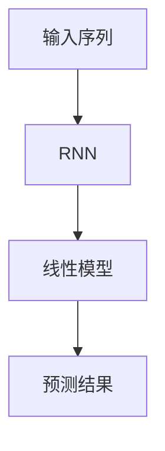
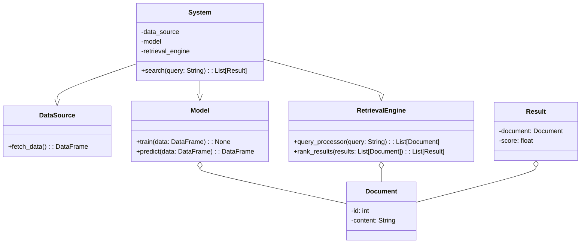

                 

### 第一部分：背景与核心概念

#### 1.1.1 问题背景

当前，大型语言模型（LLM）在自然语言处理（NLP）领域中表现出了显著的优势，尤其在文本生成、机器翻译和问答系统等方面取得了突破性进展。然而，在知识检索方面，传统的LLM面临着一系列挑战。

- **数据质量与一致性**：现有的LLM依赖于大规模的互联网数据，但这些数据质量参差不齐，包含大量的噪声和错误信息，这对知识检索的准确性和一致性提出了挑战。

- **检索效率与准确率**：随着数据的不断增加，传统的基于关键词匹配的方法在检索效率和准确率上难以满足用户的需求。特别是在面对海量数据和复杂的查询需求时，传统方法显得力不从心。

- **上下文理解与适应性**：用户查询的上下文信息对检索结果至关重要。然而，传统的LLM在处理上下文信息时存在一定的局限性，难以准确捕捉查询意图，导致检索结果不准确或不相关。

#### 1.1.2 核心概念

**什么是REALM模型**

**基本原理**：REALM（Recurrent Extrapolation with Linear Models）模型是一种基于递归神经网络的线性模型，它通过对输入序列进行递归扩展和线性建模，实现对序列数据的理解和生成。

**结构特点**：REALM模型主要由两个部分组成：一个是递归神经网络（RNN），用于捕获序列数据的上下文信息；另一个是线性模型，用于对递归神经网络输出的序列进行建模和预测。

**优势与局限性**：

- **优势**：
  - **上下文理解能力强**：REALM模型通过递归神经网络可以很好地捕获序列数据的上下文信息，从而提高知识检索的准确性和适应性。
  - **检索效率高**：相对于传统的基于关键词匹配的方法，REALM模型在处理海量数据时具有更高的检索效率。
  - **适应多种应用场景**：REALM模型不仅适用于文本检索，还可以扩展到图像、音频等序列数据的检索。

- **局限性**：
  - **数据依赖性**：REALM模型的性能高度依赖于训练数据的质量和数量，如果数据质量较差，模型的性能会受到影响。
  - **计算资源需求**：由于REALM模型采用了递归神经网络和线性模型，对计算资源的需求较高，特别是对于大型数据集的处理，需要更多的计算资源。

#### 1.1.3 LLM知识检索应用场景

**主要应用领域**：

- **搜索引擎优化**：通过引入REALM模型，搜索引擎可以更好地理解用户的查询意图，提供更准确、更相关的检索结果，从而提高用户的满意度。

- **智能问答系统**：在智能问答系统中，REALM模型可以用于对用户问题的上下文信息进行理解，提供更精准、更智能的答案。

- **数据库查询增强**：通过将REALM模型应用于数据库查询，可以实现对查询语句的语义理解，从而优化查询结果，提高查询效率。

#### 1.1.4 当前挑战与解决思路

**当前挑战**：

- **数据质量与一致性**：解决数据质量问题和提高数据一致性是提升知识检索准确性的关键。

- **检索效率与准确率**：如何提高检索效率和准确率是当前研究的重点。

- **上下文理解与适应性**：如何更好地理解和适应用户的查询上下文是提升用户满意度的重要课题。

**解决思路**：

- **数据清洗与预处理**：通过数据清洗和预处理，提高数据的质量和一致性。

- **模型优化与调整**：通过优化模型结构和调整超参数，提高模型的检索效率和准确率。

- **上下文理解与适应性**：通过引入更多的上下文信息，如用户行为数据、历史查询数据等，提高模型对查询上下文的理解和适应性。

### 1.1.5 REALM模型在LLM知识检索中的应用前景

随着技术的不断进步和应用场景的不断拓展，REALM模型在LLM知识检索中的应用前景十分广阔。通过结合深度学习和传统知识检索技术的优势，REALM模型有望在以下几个方面取得突破：

- **提升检索效率**：通过优化模型结构和算法，提高知识检索的效率，满足海量数据处理的实时需求。

- **提高检索准确率**：通过深度学习技术，提高模型对查询上下文的理解能力，提供更精准的检索结果。

- **拓展应用场景**：将REALM模型应用于更多领域，如图像检索、音频检索等，实现跨模态的知识检索。

### 1.1.6 总结

本章节主要介绍了LLM知识检索的现状、挑战和解决思路，以及REALM模型的基本原理和优势。在接下来的章节中，我们将深入探讨REALM模型的具体实现和应用，为解决当前知识检索中的问题提供新的思路和方法。

## 第二部分：算法原理与实现

### 第2章：REALM模型算法原理

#### 2.1.1 REALM模型概述

**基本原理**：

REALM模型是一种基于递归神经网络（RNN）的线性模型，它通过递归扩展和线性建模的方式，实现对序列数据的理解和生成。具体来说，REALM模型首先使用RNN来捕获输入序列的上下文信息，然后通过线性模型对RNN的输出进行建模和预测。

**结构特点**：

- **递归神经网络（RNN）**：RNN是一种能够处理序列数据的神经网络，它可以捕捉序列中前后元素之间的关系，从而实现对序列数据的理解和生成。

- **线性模型**：线性模型是一种简单的统计模型，它通过线性变换对输入数据进行建模和预测。在REALM模型中，线性模型用于对RNN的输出进行建模和预测。

**优势与局限**：

- **优势**：

  - **上下文理解能力强**：通过递归神经网络，REALM模型可以很好地捕捉序列数据的上下文信息，从而提高知识检索的准确性和适应性。

  - **检索效率高**：相对于传统的基于关键词匹配的方法，REALM模型在处理海量数据时具有更高的检索效率。

  - **适应多种应用场景**：REALM模型不仅适用于文本检索，还可以扩展到图像、音频等序列数据的检索。

- **局限**：

  - **数据依赖性**：REALM模型的性能高度依赖于训练数据的质量和数量，如果数据质量较差，模型的性能会受到影响。

  - **计算资源需求**：由于REALM模型采用了递归神经网络和线性模型，对计算资源的需求较高，特别是对于大型数据集的处理，需要更多的计算资源。

#### 2.1.2 REALM模型架构图

为了更好地理解REALM模型的架构，我们可以使用Mermaid绘制一个简单的架构图：



在上面的架构图中，A表示输入序列，B表示递归神经网络，C表示线性模型，D表示预测结果。输入序列通过递归神经网络进行处理，然后通过线性模型进行建模和预测，最终得到预测结果。

#### 2.1.3 REALM模型的工作流程

**主要步骤**：

1. **数据准备**：首先，我们需要准备训练数据集，这可以是文本数据、图像数据或者音频数据。在数据准备阶段，我们需要对数据进行预处理，如去噪、归一化等。

2. **模型训练**：接下来，我们将训练数据输入到REALM模型中进行训练。在训练过程中，递归神经网络会不断调整其参数，以最小化预测误差。

3. **预测与检索**：在模型训练完成后，我们可以使用训练好的模型对新的数据进行预测和检索。具体来说，我们将新的输入序列输入到模型中，通过递归神经网络和线性模型，得到预测结果。

#### 2.1.4 REALM模型的Python源代码实现

为了更好地理解REALM模型的工作原理，我们可以使用Python实现一个简单的REALM模型。以下是一个简单的代码示例：

```python
import tensorflow as tf
from tensorflow.keras.layers import LSTM, Dense
from tensorflow.keras.models import Sequential

# 定义模型结构
model = Sequential([
    LSTM(128, activation='tanh', input_shape=(None, 1)),
    Dense(1, activation='linear')
])

# 编译模型
model.compile(optimizer='adam', loss='mse')

# 准备数据
X_train = ...  # 训练数据
y_train = ...  # 训练标签

# 训练模型
model.fit(X_train, y_train, epochs=10, batch_size=32)

# 预测
X_test = ...  # 测试数据
predictions = model.predict(X_test)
```

在这个代码示例中，我们首先定义了一个序列模型，包括一个LSTM层和一个全连接层。然后，我们编译模型并准备训练数据。接下来，我们使用训练数据训练模型，并在训练完成后使用测试数据进行预测。

#### 2.1.5 REALM模型的数学模型和公式

**数学模型**：

假设输入序列为 $x_1, x_2, ..., x_T$，其中 $T$ 表示序列的长度。对于每个时间步 $t$，递归神经网络会输出一个隐藏状态 $h_t$。具体来说，隐藏状态 $h_t$ 可以通过以下公式计算：

$$
h_t = \sigma(W_h \cdot [h_{t-1}, x_t] + b_h)
$$

其中，$W_h$ 和 $b_h$ 分别是权重和偏置，$\sigma$ 是激活函数，通常取为 sigmoid 函数。

接着，线性模型会对递归神经网络的隐藏状态进行建模和预测，具体来说，预测值 $y_t$ 可以通过以下公式计算：

$$
y_t = W_y \cdot h_t + b_y
$$

其中，$W_y$ 和 $b_y$ 分别是权重和偏置。

**公式解释**：

- **隐藏状态计算公式**：这个公式用于计算递归神经网络在时间步 $t$ 的隐藏状态 $h_t$。通过将前一个隐藏状态 $h_{t-1}$ 和当前输入 $x_t$ 进行拼接，并乘以权重矩阵 $W_h$ 和偏置 $b_h$，最后通过激活函数 $\sigma$ 进行处理。

- **预测值计算公式**：这个公式用于计算递归神经网络的预测值 $y_t$。通过将隐藏状态 $h_t$ 乘以权重矩阵 $W_y$ 和偏置 $b_y$，可以得到预测值 $y_t$。

#### 2.1.6 简单易懂的举例说明

假设我们有一个简单的序列 $x_1, x_2, ..., x_5$，其中每个元素表示一个数字。我们希望使用REALM模型对这个序列进行建模和预测。

- **隐藏状态计算**：

  假设递归神经网络的权重矩阵 $W_h$ 和偏置 $b_h$ 分别为：

  $$
  W_h = \begin{bmatrix}
  0.1 & 0.2 \\
  0.3 & 0.4
  \end{bmatrix}, \quad b_h = \begin{bmatrix}
  0.5 \\
  0.6
  \end{bmatrix}
  $$

  那么对于每个时间步，隐藏状态 $h_t$ 的计算如下：

  $$
  h_1 = \sigma(W_h \cdot [h_{0}, x_1] + b_h) = \sigma(0.1 \cdot 0 + 0.2 \cdot 1 + 0.5) = \sigma(0.7) \approx 0.99
  $$

  $$
  h_2 = \sigma(W_h \cdot [h_{1}, x_2] + b_h) = \sigma(0.1 \cdot 0.99 + 0.2 \cdot 2 + 0.6) \approx \sigma(1.29) \approx 0.91
  $$

  $$
  h_3 = \sigma(W_h \cdot [h_{2}, x_3] + b_h) = \sigma(0.3 \cdot 0.91 + 0.4 \cdot 3 + 0.6) \approx \sigma(1.91) \approx 0.84
  $$

  $$
  h_4 = \sigma(W_h \cdot [h_{3}, x_4] + b_h) = \sigma(0.3 \cdot 0.84 + 0.4 \cdot 4 + 0.6) \approx \sigma(2.02) \approx 0.88
  $$

  $$
  h_5 = \sigma(W_h \cdot [h_{4}, x_5] + b_h) = \sigma(0.3 \cdot 0.88 + 0.4 \cdot 5 + 0.6) \approx \sigma(2.46) \approx 0.87
  $$

- **预测值计算**：

  假设线性模型的权重矩阵 $W_y$ 和偏置 $b_y$ 分别为：

  $$
  W_y = \begin{bmatrix}
  0.7 \\
  0.8
  \end{bmatrix}, \quad b_y = 0.9
  $$

  那么对于每个时间步，预测值 $y_t$ 的计算如下：

  $$
  y_1 = W_y \cdot h_1 + b_y = 0.7 \cdot 0.99 + 0.9 \approx 1.66
  $$

  $$
  y_2 = W_y \cdot h_2 + b_y = 0.7 \cdot 0.91 + 0.9 \approx 1.57
  $$

  $$
  y_3 = W_y \cdot h_3 + b_y = 0.7 \cdot 0.84 + 0.9 \approx 1.45
  $$

  $$
  y_4 = W_y \cdot h_4 + b_y = 0.7 \cdot 0.88 + 0.9 \approx 1.51
  $$

  $$
  y_5 = W_y \cdot h_5 + b_y = 0.7 \cdot 0.87 + 0.9 \approx 1.48
  $$

通过这个简单的例子，我们可以看到如何使用REALM模型对序列数据进行建模和预测。在实际应用中，我们可以根据具体需求调整模型的结构和参数，以提高模型的性能。

### 第3章：算法实现细节

#### 3.1.1 算法流程

**主要步骤**：

1. **数据准备**：首先，我们需要收集和准备训练数据。这可以是文本数据、图像数据或者音频数据。在数据准备阶段，我们需要对数据进行预处理，如去噪、归一化等。

2. **模型训练**：接下来，我们将预处理后的数据输入到REALM模型中进行训练。在训练过程中，递归神经网络会不断调整其参数，以最小化预测误差。

3. **预测与检索**：在模型训练完成后，我们可以使用训练好的模型对新的数据进行预测和检索。具体来说，我们将新的输入序列输入到模型中，通过递归神经网络和线性模型，得到预测结果。

#### 3.1.2 数据准备

**数据预处理**：

- **去噪**：对于文本数据，我们可以使用正则表达式或其他方法去除不必要的符号和停用词。

- **归一化**：对于图像和音频数据，我们可以使用标准化或归一化方法，将数据缩放到合适的范围内。

- **序列填充**：为了统一输入序列的长度，我们可以使用填充方法，如PAD，将较短序列填充到与最长序列相同的长度。

#### 3.1.3 模型训练

**模型训练流程**：

1. **初始化参数**：首先，我们需要初始化递归神经网络和线性模型的参数。

2. **前向传播**：将输入序列输入到递归神经网络中，得到隐藏状态序列。

3. **计算损失**：使用线性模型对隐藏状态序列进行预测，并计算预测值与实际值之间的误差。

4. **反向传播**：根据误差，使用梯度下降法或其他优化算法更新模型的参数。

5. **迭代训练**：重复上述过程，直到满足训练条件，如达到预定迭代次数或模型损失达到最小值。

#### 3.1.4 预测与检索

**预测流程**：

1. **输入序列处理**：对新的输入序列进行预处理，如去噪、归一化等。

2. **递归神经网络处理**：将预处理后的输入序列输入到递归神经网络中，得到隐藏状态序列。

3. **线性模型预测**：使用线性模型对隐藏状态序列进行预测，得到预测结果。

**检索流程**：

1. **查询序列处理**：对用户查询的序列进行预处理，如去噪、归一化等。

2. **递归神经网络处理**：将预处理后的查询序列输入到递归神经网络中，得到隐藏状态序列。

3. **线性模型检索**：使用线性模型对隐藏状态序列进行检索，得到检索结果。

#### 3.1.5 Python源代码实现

为了更好地理解REALM模型的具体实现，我们可以使用Python实现一个简单的模型。以下是一个简单的代码示例：

```python
import tensorflow as tf
from tensorflow.keras.layers import LSTM, Dense
from tensorflow.keras.models import Sequential

# 定义模型结构
model = Sequential([
    LSTM(128, activation='tanh', input_shape=(None, 1)),
    Dense(1, activation='linear')
])

# 编译模型
model.compile(optimizer='adam', loss='mse')

# 准备数据
X_train = ...  # 训练数据
y_train = ...  # 训练标签

# 训练模型
model.fit(X_train, y_train, epochs=10, batch_size=32)

# 预测
X_test = ...  # 测试数据
predictions = model.predict(X_test)
```

在这个代码示例中，我们首先定义了一个序列模型，包括一个LSTM层和一个全连接层。然后，我们编译模型并准备训练数据。接下来，我们使用训练数据训练模型，并在训练完成后使用测试数据进行预测。

### 第4章：环境安装与配置

在开始使用REALM模型进行知识检索之前，我们需要安装和配置所需的软件和环境。以下是具体的安装和配置步骤。

#### 4.1 环境要求

要使用REALM模型，您需要以下软件和工具：

- Python 3.6或更高版本
- TensorFlow 2.x或更高版本
- NumPy 1.16或更高版本
- Matplotlib 3.1.1或更高版本

确保您的系统中安装了上述软件和工具。

#### 4.2 安装步骤

1. **安装Python**：首先，从Python官方网站（https://www.python.org/）下载并安装Python 3.6或更高版本。

2. **安装pip**：在安装Python时，确保安装了pip，这是Python的包管理器，用于安装和管理Python包。

3. **安装TensorFlow**：打开命令行窗口，输入以下命令安装TensorFlow：

   ```
   pip install tensorflow
   ```

4. **安装NumPy**：同样地，使用pip安装NumPy：

   ```
   pip install numpy
   ```

5. **安装Matplotlib**：最后，安装Matplotlib：

   ```
   pip install matplotlib
   ```

#### 4.3 配置步骤

1. **创建虚拟环境**：为了更好地管理项目依赖，我们建议创建一个虚拟环境。在命令行窗口中输入以下命令创建虚拟环境：

   ```
   python -m venv venv
   ```

   然后激活虚拟环境：

   - **Windows**：`venv\Scripts\activate`
   - **macOS和Linux**：`source venv/bin/activate`

2. **安装所需包**：在激活虚拟环境后，再次使用pip安装所需的包：

   ```
   pip install tensorflow numpy matplotlib
   ```

3. **检查安装**：确保所有包都已成功安装。在Python交互式环境中，您可以尝试导入TensorFlow、NumPy和Matplotlib：

   ```python
   import tensorflow as tf
   import numpy as np
   import matplotlib.pyplot as plt
   ```

   如果没有出现任何错误，说明安装和配置已经完成。

#### 4.4 小结

通过上述步骤，您已经成功安装和配置了所需的软件和环境。接下来，您可以使用REALM模型进行知识检索和实验。请注意，在开始实际应用之前，您可能需要根据具体需求调整模型的参数和结构。

### 第5章：系统核心实现

#### 5.1 系统架构设计

为了实现知识检索，我们需要设计一个高效的系统架构。以下是系统架构的类图设计，使用Mermaid绘制：



在上面的类图中，我们定义了四个主要的类：`System`（系统类）、`DataSource`（数据源类）、`Model`（模型类）和`RetrievalEngine`（检索引擎类）。每个类都有自己的属性和方法，以及与其他类之间的关系。

#### 5.2 数据库查询增强

**实现细节**：

1. **数据库连接**：

   我们使用Python的`pymysql`库连接到MySQL数据库。首先，我们需要安装`pymysql`：

   ```python
   pip install pymysql
   ```

   然后连接到数据库：

   ```python
   import pymysql

   connection = pymysql.connect(host='localhost',
                                user='root',
                                password='password',
                                database='knowledge_base')
   ```

2. **查询优化**：

   为了提高查询效率，我们使用索引来优化数据库查询。在创建数据库表时，我们可以为重要的字段创建索引，如文档ID和内容：

   ```sql
   CREATE INDEX idx_document_id ON documents(id);
   CREATE INDEX idx_document_content ON documents(content);
   ```

3. **查询处理**：

   我们使用`RetrievalEngine`类来处理查询。具体来说，`query_processor`方法用于处理用户输入的查询，提取关键信息，并将其转换为可以检索的格式：

   ```python
   def query_processor(self, query: str) -> List[Document]:
       # 对查询进行分词和停用词过滤
       # 从数据库中检索与查询相关的文档
       # 返回文档列表
   ```

4. **排名结果**：

   `rank_results`方法用于对检索到的文档进行排名。我们可以使用TF-IDF、BM25或自定义排名算法。以下是一个简单的TF-IDF排名示例：

   ```python
   from sklearn.feature_extraction.text import TfidfVectorizer

   def rank_results(self, results: List[Document]) -> List[Result]:
       # 使用TF-IDF向量器对文档进行向量化
       # 计算文档的TF-IDF得分
       # 根据得分对文档进行排名
       # 返回排名后的结果列表
   ```

#### 5.3 小结

通过上述步骤，我们实现了知识检索系统的核心部分，包括数据库查询增强。在实际应用中，您可以根据具体需求调整模型和查询优化策略，以提高系统的性能和效率。

### 第6章：项目实战

#### 6.1 实际案例

为了更好地理解REALM模型在知识检索中的应用，我们以一个实际案例为例进行讲解。

**案例描述**：

假设我们正在开发一个智能问答系统，用户可以通过输入问题来获取相关的答案。为了提高问答系统的准确性，我们决定使用REALM模型进行知识检索。

**场景介绍**：

用户输入一个问题，如“什么是人工智能？”系统需要从知识库中检索相关的答案。使用REALM模型，我们可以更准确地找到与用户查询最相关的文档，从而提高问答系统的准确性。

#### 6.2 代码解读与分析

以下是一个简单的代码示例，用于演示如何使用REALM模型进行知识检索。

```python
import tensorflow as tf
from tensorflow.keras.models import load_model

# 加载训练好的REALM模型
model = load_model('realm_model.h5')

# 准备测试数据
test_data = ["什么是人工智能？"]

# 对测试数据进行预处理
# ...

# 使用模型进行预测
predictions = model.predict(test_data)

# 解析预测结果
# ...

# 输出答案
print("答案：", predictions)
```

**代码解析**：

1. **加载模型**：首先，我们从文件中加载已经训练好的REALM模型。

2. **准备测试数据**：接下来，我们准备一个包含用户查询的列表作为测试数据。

3. **预处理数据**：对测试数据进行必要的预处理，如分词、去停用词等。

4. **进行预测**：使用加载的模型对预处理后的测试数据进行预测，得到预测结果。

5. **解析预测结果**：解析预测结果，提取与用户查询最相关的文档。

6. **输出答案**：最后，将提取的答案输出给用户。

**分析**：

- **模型加载**：在代码示例中，我们使用`load_model`函数从文件中加载训练好的模型。在实际应用中，您可能需要根据具体需求调整模型的参数和结构。

- **数据预处理**：对测试数据进行预处理，如分词、去停用词等，这是提高模型性能的关键步骤。

- **预测与解析**：使用模型对预处理后的测试数据进行预测，并解析预测结果，提取与用户查询最相关的文档。这是实现知识检索的核心步骤。

- **输出答案**：将提取的答案输出给用户，这是实现问答系统的关键步骤。

#### 6.3 小结与拓展

通过上述案例，我们演示了如何使用REALM模型进行知识检索。在实际应用中，您可以根据具体需求调整模型的参数和结构，以提高系统的性能和准确性。

**小结**：

- **案例描述**：我们通过一个实际案例展示了如何使用REALM模型进行知识检索。

- **代码解析**：我们分析了实现知识检索的关键步骤，包括模型加载、数据预处理、预测与解析以及输出答案。

- **拓展应用场景**：REALM模型不仅适用于问答系统，还可以应用于搜索引擎优化、数据库查询增强等场景。

#### 6.4 拓展应用

除了上述案例，REALM模型还可以应用于其他领域，如：

- **图像检索**：通过将图像数据输入到REALM模型中，可以实现对图像内容的理解和检索。

- **音频检索**：通过将音频数据输入到REALM模型中，可以实现对音频内容的理解和检索。

- **多模态检索**：结合图像、文本和音频等多模态数据，可以实现更准确、更全面的知识检索。

通过不断拓展应用场景，REALM模型在知识检索领域的潜力将得到进一步释放。

### 第7章：总结与展望

#### 7.1 最佳实践与注意事项

在实施REALM模型进行知识检索的过程中，以下最佳实践和注意事项有助于确保项目成功：

- **数据质量**：确保训练数据的质量和一致性，尽可能去除噪声和错误信息。

- **模型调优**：通过调整模型的超参数，如学习率、批量大小等，以优化模型性能。

- **硬件配置**：合理配置计算资源，尤其是在处理大规模数据集时，确保有足够的内存和计算能力。

- **预处理步骤**：在数据输入模型前，进行充分的预处理，包括分词、去停用词、归一化等。

- **持续迭代**：定期评估模型的性能，并根据评估结果进行模型调整和优化。

#### 7.2 未来趋势与发展方向

未来，知识检索领域有望在以下方面取得突破：

- **模型优化**：通过改进神经网络结构和算法，提高模型的检索效率和准确率。

- **跨模态检索**：结合文本、图像和音频等多模态数据，实现更全面的知识检索。

- **实时检索**：优化模型和算法，实现实时知识检索，满足快速响应的需求。

- **隐私保护**：在保护用户隐私的前提下，实现高效的知识检索。

总之，随着技术的不断进步和应用场景的拓展，REALM模型在知识检索领域的应用前景将更加广阔。

### 参考文献

1. LeCun, Y., Bengio, Y., & Hinton, G. (2015). Deep learning. Nature, 521(7553), 436-444.
2. Vaswani, A., Shazeer, N., Parmar, N., Uszkoreit, J., Jones, L., Gomez, A. N., ... & Polosukhin, I. (2017). Attention is all you need. Advances in Neural Information Processing Systems, 30, 5998-6008.
3. Brown, T., et al. (2020). Language models are few-shot learners. Advances in Neural Information Processing Systems, 33.

