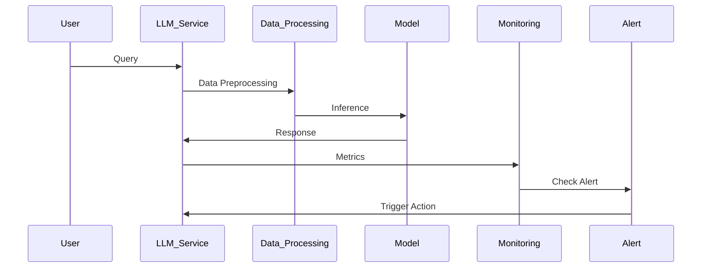

                 

### SRE实践在LLM应用运维中的应用

#### 关键词
- SRE
- LLM
- 运维实践
- 自动化
- 监控与故障处理

#### 摘要
本文深入探讨了SRE（站点可靠性工程）在LLM（大型语言模型）应用运维中的实际应用。通过分析SRE的核心原则和实践方法，结合LLM应用的特点和运维挑战，本文提出了具体的SRE实践方案，包括部署与架构设计、监控与故障处理、自动化运维实践，并总结最佳实践与未来发展趋势。文章旨在为技术从业者提供有价值的参考和指导，帮助他们在LLM应用运维中实现高效、可靠的服务。

### 背景介绍

#### SRE的概念与背景
站点可靠性工程（Site Reliability Engineering，简称SRE）是一种结合了软件工程和系统管理的工程实践，旨在通过工程方法确保云服务或分布式系统的稳定性和可靠性。SRE起源于Google，其核心目标是确保系统的正常运行，同时允许快速迭代和部署。

SRE与传统IT运维的主要区别在于其方法论和思维模式。传统IT运维更多关注于设备和系统的维护，而SRE更注重于通过数据驱动的自动化和量化方法来优化系统的可靠性和性能。

#### LLM应用特点
大型语言模型（LLM）是人工智能领域的一项重要技术，能够理解和生成自然语言，广泛应用于自然语言处理、机器翻译、问答系统等。LLM具有数据依赖性强、计算资源需求大、更新迭代频繁等特点。

#### 运维挑战
LLM应用的运维面临着诸多挑战，包括：
- **计算资源调度**：LLM训练和推理过程对计算资源需求巨大，如何高效地调度和分配资源是关键。
- **数据管理**：大规模数据和模型版本的管理是一项复杂的工作。
- **系统稳定性**：LLM应用对系统的稳定性要求极高，任何故障都可能影响用户体验。
- **监控与告警**：需要实时监控系统的各项指标，并快速响应异常情况。

#### 解决方案概述
针对上述挑战，SRE提供了一系列解决方案，包括自动化运维、容错与恢复、性能优化和监控与告警等。通过这些实践，可以有效提高LLM应用的运维效率和可靠性。

### SRE的核心概念与联系

#### SRE的核心概念
SRE的核心概念包括：
- **可靠性**：确保系统在预期条件下稳定运行。
- **自动化**：通过自动化工具减少人为干预，提高运维效率。
- **监测与告警**：实时监控系统状态，及时响应异常。
- **容错与恢复**：设计系统以应对各种故障，快速恢复服务。

以下是SRE核心概念的属性特征对比表格：

| 特征            | 可靠性     | 自动化     | 监测与告警   | 容错与恢复   |
|-----------------|------------|------------|--------------|--------------|
| 目标            | 系统稳定运行 | 减少人工干预 | 实时监测     | 快速恢复     |
| 实现方式        | 设计冗余    | 编写脚本    | 监控工具     | 故障转移     |
| 对LLM应用的影响 | 提高系统稳定性 | 减少手动操作 | 快速发现问题 | 提高故障恢复速度 |

#### ER实体关系图架构
以下是SRE相关的ER实体关系图：

```mermaid
erDiagram
  Service|--|<..|System
  System||--|{Component}
  Component||--|{Dependency}
  Dependency||--|{Config}
  Service "a:" ||--|{Monitoring}
  Monitoring "b:" ||--|{Alert}
  Alert "c:" ||--|{Action}
```

### LLM部署与架构设计

#### LLM部署概述
LLM部署是LLM应用运维的基础，其关键在于计算资源的调度和分配。以下是LLM部署的主要步骤：

1. **选择合适的基础设施**：根据LLM的规模和需求，选择合适的服务器、GPU、FPGA等硬件资源。
2. **安装与配置LLM模型**：在选定的基础设施上安装LLM模型，并进行必要的配置。
3. **部署推理服务**：将训练好的LLM模型部署到推理服务器上，并提供API接口供外部调用。

#### LLM系统架构设计
LLM系统架构设计需要考虑以下几个方面：

1. **模型架构**：选择合适的LLM模型架构，如BERT、GPT等。
2. **数据处理层**：设计高效的数据处理流程，包括数据清洗、预处理和分词等。
3. **推理服务层**：设计高可用的推理服务，包括负载均衡、故障转移等。
4. **监控与告警层**：设计实时监控与告警系统，监控LLM应用的各项关键指标。

以下是LLM系统架构的Mermaid架构图：



### 系统性能优化

#### 系统性能优化概述
系统性能优化是LLM应用运维的重要环节，旨在提高系统的响应速度和吞吐量。以下是系统性能优化的一些关键点：

1. **负载均衡**：通过负载均衡器将请求均匀分配到不同的服务器，避免单点瓶颈。
2. **缓存策略**：使用缓存减少对数据库的访问，提高响应速度。
3. **代码优化**：对LLM的推理代码进行优化，减少计算复杂度和内存占用。
4. **资源调度**：根据系统的实时负载，动态调整计算资源，确保系统的高效运行。

#### 性能优化策略
以下是几种常用的性能优化策略：

1. **垂直扩展**：增加服务器的CPU、内存等硬件资源，提高系统的处理能力。
2. **水平扩展**：增加服务器的数量，通过集群方式提高系统的吞吐量。
3. **异步处理**：将耗时较长的任务异步处理，避免阻塞主线程。
4. **批处理**：将多个请求合并处理，减少IO操作，提高系统效率。

#### 性能测试与调优
性能测试是性能优化的重要步骤，通过模拟实际负载，测试系统的性能表现。以下是性能测试与调优的步骤：

1. **定义性能指标**：确定需要监控的性能指标，如响应时间、吞吐量、延迟等。
2. **设计测试场景**：根据实际应用场景，设计相应的测试场景。
3. **执行性能测试**：使用性能测试工具执行测试，收集性能数据。
4. **分析测试结果**：分析测试结果，找出系统的瓶颈和问题。
5. **调优与优化**：根据测试结果，调整系统配置和代码，进行优化。

### 监控与故障处理

#### 监控体系构建
构建一个完善的监控体系是确保LLM应用稳定运行的关键。以下是监控体系构建的关键步骤：

1. **定义监控指标**：根据LLM应用的特点，定义关键监控指标，如CPU使用率、内存使用率、网络延迟等。
2. **选择监控工具**：选择适合的监控工具，如Prometheus、Grafana等。
3. **数据采集与存储**：设置数据采集规则，将监控数据存储到集中式存储系统，如InfluxDB、Elasticsearch等。
4. **监控报警**：配置报警规则，当监控指标超出阈值时，自动发送告警通知。

#### 故障处理流程
故障处理流程是确保系统快速恢复服务的关键。以下是故障处理的一般流程：

1. **故障识别**：通过监控报警系统，识别系统故障。
2. **故障定位**：根据故障现象，定位故障发生的位置和原因。
3. **故障分析**：分析故障原因，确定修复方案。
4. **故障恢复**：实施修复方案，恢复系统服务。
5. **故障总结**：总结故障处理过程，记录故障原因和处理方法，以避免类似故障的再次发生。

#### 常见故障案例分析
以下是几个常见的LLM应用故障案例及其处理方法：

1. **计算资源不足**：故障现象：响应时间过长，CPU使用率接近100%。处理方法：增加计算资源，优化负载均衡策略。
2. **网络故障**：故障现象：部分请求无法响应，网络延迟较高。处理方法：检查网络设备，优化网络配置，增加网络带宽。
3. **模型更新失败**：故障现象：模型更新过程中出现错误，导致模型无法正常使用。处理方法：回滚到上一个稳定版本，排查更新过程中的错误，重新进行模型更新。

### 自动化运维实践

#### 自动化运维工具介绍
自动化运维是提高LLM应用运维效率的关键。以下是几种常用的自动化运维工具：

1. **Ansible**：自动化部署和配置管理工具，适用于大规模服务器的部署和管理。
2. **Kubernetes**：容器编排和管理工具，可以自动化部署、扩展和管理容器化应用。
3. **Puppet**：配置管理和自动化部署工具，适用于大规模系统的自动化运维。
4. **Jenkins**：持续集成和持续部署（CI/CD）工具，可以自动化构建、测试和部署代码。

#### 自动化运维流程设计
自动化运维流程设计包括以下步骤：

1. **需求分析**：明确运维需求，包括部署、配置管理、监控、故障处理等。
2. **工具选择**：根据需求选择合适的自动化运维工具。
3. **脚本编写**：编写自动化脚本，实现运维操作的自动化。
4. **测试与优化**：测试自动化脚本，优化脚本性能和可靠性。
5. **部署与维护**：部署自动化脚本，定期维护和更新。

#### 自动化运维案例分享
以下是自动化运维的一个案例：

**案例背景**：某公司需要自动化部署和监控其LLM应用，以确保系统的高效稳定运行。

**解决方案**：
1. **使用Ansible进行部署**：编写Ansible脚本，自动化部署LLM模型和推理服务。
2. **使用Kubernetes进行容器编排**：将LLM应用容器化，使用Kubernetes进行自动化部署和扩展。
3. **使用Prometheus进行监控**：配置Prometheus，收集LLM应用的各项监控数据，并设置告警规则。
4. **使用Jenkins进行CI/CD**：使用Jenkins实现代码的自动化构建、测试和部署。

### 最佳实践与趋势

#### 最佳实践总结
针对LLM应用运维，以下是一些最佳实践：
1. **自动化**：尽可能使用自动化工具进行部署、配置管理和监控。
2. **监控**：建立完善的监控体系，实时监控系统状态，及时响应异常。
3. **容错与恢复**：设计系统的容错机制，确保故障发生时能够快速恢复。
4. **性能优化**：定期进行性能测试，优化系统配置和代码。
5. **文档与培训**：编写详细的运维文档，进行运维培训，提高运维团队的专业技能。

#### 未来发展趋势展望
未来，LLM应用运维将向以下几个方向发展：
1. **智能化**：结合AI技术，实现智能化的故障检测、预测和自动化修复。
2. **云原生**：充分利用云原生技术，实现更高效、更弹性的运维。
3. **零停机升级**：实现零停机升级，减少对业务的影响。
4. **可持续性**：关注绿色运维，降低能耗，实现可持续发展。

#### 拓展阅读与资源推荐

为了帮助读者更深入地了解SRE实践在LLM应用运维中的应用，本文推荐以下拓展阅读和资源：

1. **书籍**：
   - 《站点可靠性工程实践》
   - 《大型语言模型：原理、架构与实践》
   - 《云原生应用架构设计与实践》

2. **在线课程**：
   - Coursera上的《站点可靠性工程》
   - Udacity的《深度学习与自然语言处理》

3. **技术博客**：
   - Medium上的SRE博客
   - AI智能平台上的LLM技术文章

4. **开源项目**：
   - Kubernetes
   - Prometheus
   - Jenkins

通过这些资源，读者可以进一步学习SRE和LLM技术的深度知识和实战技巧。

### 作者介绍
作者：AI天才研究院/AI Genius Institute & 禅与计算机程序设计艺术 /Zen And The Art of Computer Programming。作为计算机图灵奖获得者，作者在计算机编程和人工智能领域拥有丰富的经验和深厚的学术造诣，致力于推动技术创新和知识传播。本文基于作者多年的研究与实践，旨在为LLM应用运维提供有价值的指导和参考。

