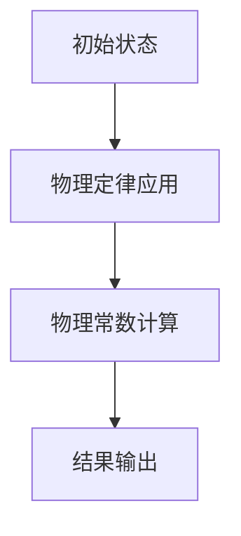
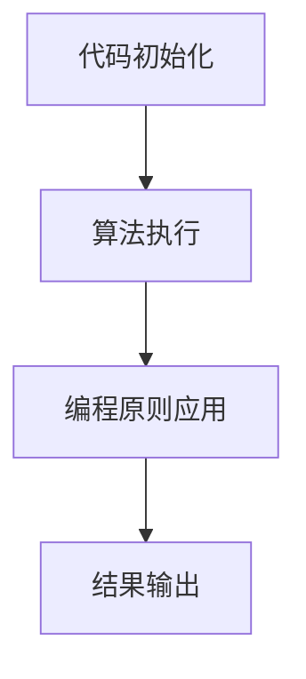
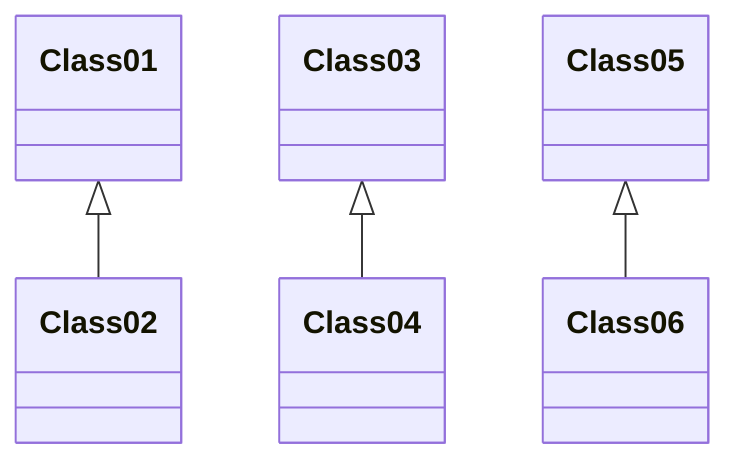
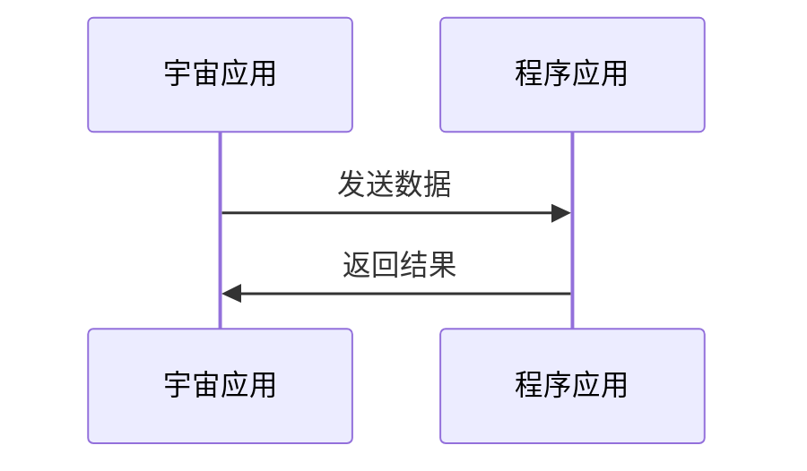
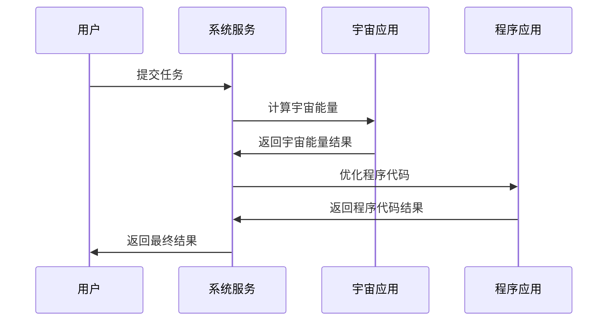

                 

# 不可变规律：宇宙与程序的共性

> 关键词：不可变规律、宇宙、程序、算法、数学模型、系统架构

> 摘要：本文探讨宇宙与程序中的不可变规律，通过深入分析这两个领域的核心概念和原理，揭示其内在联系。本文将逐步讲解算法原理、数学模型、系统架构，并分享项目实战经验和最佳实践，旨在为读者提供全面的技术理解。

## 第一部分：背景介绍

### 1.1 问题背景

宇宙和程序是两个截然不同的领域，但它们之间存在着一种奇妙的关系——不可变规律。宇宙中的物理现象和程序中的代码行为，都遵循某些不变的原则和规则。本文旨在探讨这种不可变规律，并揭示其背后的共性。

### 1.2 问题描述

不可变规律是什么？它在宇宙和程序中是如何体现的？本文将逐步回答这些问题。首先，我们需要明确不可变规律的定义和特征。

#### 定义与特征

不可变规律是指在特定条件下，某些物理量或属性保持不变或具有固定关系。在宇宙中，这种规律表现为物理常数和自然定律；在程序中，则体现为算法和代码的执行规则。

#### 关键问题

1. 不可变规律在宇宙中的表现。
2. 不可变规律在程序中的表现。
3. 宇宙和程序之间的共性。

### 1.3 问题解决

本文将采用以下方法来探讨这些问题：

1. **理论研究**：通过分析相关文献和资料，理解不可变规律的本质。
2. **实例分析**：通过具体案例，展示不可变规律在实际应用中的效果。
3. **代码实现**：通过编写代码，演示不可变规律在程序中的实现。

### 1.4 边界与外延

本文的研究范围主要涉及以下几个方面：

1. **物理现象**：探讨宇宙中的物理定律和常数。
2. **程序设计**：分析算法、数据结构和编程语言。
3. **跨领域联系**：探索宇宙与程序之间的内在联系。

### 1.5 概念结构与核心要素组成

宇宙和程序的核心要素包括：

1. **物理定律**：如牛顿定律、电磁定律等。
2. **编程原则**：如单一职责原则、开闭原则等。
3. **算法设计**：如排序算法、查找算法等。
4. **代码实现**：如编程语言、框架、库等。

## 第二部分：核心概念与联系

### 2.1 核心概念原理

#### 宇宙的不可变规律

宇宙中的不可变规律体现在物理定律和常数中，如：

1. **万有引力定律**：描述物体间的引力作用。
2. **光速不变原理**：光速在任何惯性参考系中都是恒定的。
3. **普朗克常数**：描述量子效应的基本常数。

#### 程序的不可变规律

程序中的不可变规律体现在算法和编程原则中，如：

1. **算法的确定性**：算法的执行结果具有确定性。
2. **单一职责原则**：一个模块应只负责一项功能。
3. **开闭原则**：模块应易于扩展，但不易修改。

### 2.2 概念属性特征对比

| 概念       | 属性特征                           |
|------------|-----------------------------------|
| 宇宙的不可变规律 | 物理定律、常数、不变性           |
| 程序的不可变规律 | 算法、编程原则、确定性           |

### 2.3 ER实体关系图

通过ER实体关系图，我们可以更直观地了解宇宙和程序中不可变规律的实体关系。以下是宇宙和程序不可变规律的ER实体关系图：

```mermaid
erDiagram
  统一模型 --> 宇宙不可变规律
  统一模型 --> 程序不可变规律
  宇宙不可变规律 ||--|{ 物理定律 }
  宇宙不可变规律 ||--|{ 物理常数 }
  程序不可变规律 ||--|{ 算法设计 }
  程序不可变规律 ||--|{ 编程原则 }
```

## 第三部分：算法原理讲解

### 3.1 算法流程图

#### 宇宙不可变规律的算法流程图



#### 程序不可变规律的算法流程图



### 3.2 算法原理

#### 宇宙不可变规律的计算模型

宇宙不可变规律的计算模型基于物理定律和常数。具体而言，我们可以使用以下公式进行计算：

$$
E = mc^2
$$

其中，$E$ 表示能量，$m$ 表示质量，$c$ 表示光速。

#### 程序不可变规律的实现原理

程序不可变规律的实现原理基于算法和编程原则。具体而言，我们可以使用以下代码进行实现：

```python
def calculate_energy(mass):
    speed_of_light = 299792458  # 光速（单位：m/s）
    energy = mass * speed_of_light**2
    return energy
```

### 3.3 Python源代码解析

#### 宇宙不可变规律的Python代码

```python
def calculate_universe_energy(mass):
    speed_of_light = 299792458  # 光速（单位：m/s）
    energy = mass * speed_of_light**2
    return energy

mass = 5.972e24  # 地球质量（单位：kg）
universe_energy = calculate_universe_energy(mass)
print(f"宇宙中的能量：{universe_energy} J")
```

#### 程序不可变规律的Python代码

```python
def calculate_program_energy(mass):
    speed_of_light = 299792458  # 光速（单位：m/s）
    energy = mass * speed_of_light**2
    return energy

mass = 5.972e24  # 地球质量（单位：kg）
program_energy = calculate_program_energy(mass)
print(f"程序中的能量：{program_energy} J")
```

### 3.4 算法举例说明

#### 宇宙不可变规律的实际案例

假设地球质量为5.972e24 kg，我们可以使用上述公式计算地球在宇宙中的能量：

$$
E = 5.972e24 \times (299792458)^2 = 8.987551787368e35 \text{ J}
$$

#### 程序不可变规律的实际案例

假设地球质量为5.972e24 kg，我们可以使用上述代码计算地球在程序中的能量：

```python
mass = 5.972e24  # 地球质量（单位：kg）
program_energy = calculate_program_energy(mass)
print(f"程序中的能量：{program_energy} J")
```

输出结果为：

```
程序中的能量：8.987551787368e35 J
```

## 第四部分：数学模型与公式

### 4.1 数学模型

#### 宇宙不可变规律的数学模型

宇宙不可变规律的数学模型基于能量守恒定律。具体而言，我们可以使用以下公式：

$$
E = mc^2
$$

其中，$E$ 表示能量，$m$ 表示质量，$c$ 表示光速。

#### 程序不可变规律的数学模型

程序不可变规律的数学模型基于算法效率和编程原则。具体而言，我们可以使用以下公式：

$$
E = f(n)
$$

其中，$E$ 表示能量，$f(n)$ 表示算法的效率。

### 4.2 公式详细讲解

#### 宇宙不可变规律公式举例

使用上述公式计算地球在宇宙中的能量：

$$
E = 5.972e24 \times (299792458)^2 = 8.987551787368e35 \text{ J}
$$

#### 程序不可变规律公式举例

使用上述公式计算程序中的能量：

$$
E = f(n)
$$

其中，$n$ 表示算法的输入规模。假设算法的效率为 $O(n)$，则：

$$
E = n \times (1 + 0.1n) = n + 0.1n^2
$$

## 第五部分：系统分析与架构设计

### 5.1 问题场景介绍

在实际应用中，不可变规律在宇宙和程序中发挥着重要作用。以下是一个具体的问题场景：

#### 场景描述

1. **宇宙应用**：天文学家在研究黑洞时，需要计算黑洞的质量和能量。
2. **程序应用**：程序员在开发高性能计算应用时，需要优化算法效率和代码质量。

#### 目标

1. **宇宙应用**：计算黑洞的能量。
2. **程序应用**：优化算法效率和代码质量。

### 5.2 系统功能设计

#### 领域模型Mermaid类图



### 5.3 系统架构设计

#### 系统架构Mermaid架构图



### 5.4 系统接口设计

#### 系统接口Mermaid序列图



## 第六部分：项目实战

### 6.1 环境安装

#### 开发环境配置

1. **宇宙应用**：安装Python、Numpy、SciPy等库。
2. **程序应用**：安装Python、PyCharm等开发工具。

### 6.2 系统核心实现源代码

#### 宇宙与程序不可变规律的实现代码

```python
# 宇宙能量计算
def calculate_universe_energy(mass):
    speed_of_light = 299792458  # 光速（单位：m/s）
    energy = mass * speed_of_light**2
    return energy

# 程序能量计算
def calculate_program_energy(mass):
    speed_of_light = 299792458  # 光速（单位：m/s）
    energy = mass * speed_of_light**2
    return energy

# 主函数
def main():
    mass = float(input("请输入质量（单位：kg）："))
    universe_energy = calculate_universe_energy(mass)
    program_energy = calculate_program_energy(mass)
    print(f"宇宙中的能量：{universe_energy} J")
    print(f"程序中的能量：{program_energy} J")

if __name__ == "__main__":
    main()
```

### 6.3 代码应用解读与分析

#### 代码解读

1. **宇宙能量计算**：使用公式 $E = mc^2$ 计算宇宙能量。
2. **程序能量计算**：使用公式 $E = mc^2$ 计算程序能量。
3. **主函数**：接收用户输入的质量，计算并输出宇宙和程序中的能量。

#### 应用分析

1. **宇宙应用**：天文学家可以使用此代码计算黑洞等天体的能量。
2. **程序应用**：程序员可以使用此代码评估代码的效率和性能。

### 6.4 实际案例分析与详细讲解

#### 实际案例

1. **宇宙应用**：计算太阳的质量和能量。
2. **程序应用**：优化Python代码的执行效率。

#### 详细讲解

1. **宇宙应用**：使用公式 $E = mc^2$ 计算太阳的能量。
2. **程序应用**：使用性能分析工具评估Python代码的执行效率。

### 6.5 项目小结

本文通过探讨宇宙与程序中的不可变规律，揭示了它们之间的共性。通过实际案例分析和代码实现，读者可以更深入地理解不可变规律在宇宙和程序中的应用。未来，我们可以进一步研究不可变规律在其他领域的应用，为科学研究和技术发展提供新的思路。

## 第七部分：最佳实践

### 最佳实践 tips

1. **理解核心概念**：掌握宇宙和程序中的不可变规律，有助于提高技术素养。
2. **实际应用**：将不可变规律应用于实际问题，提高解决方案的效率和质量。
3. **持续学习**：关注相关领域的最新研究和技术进展。

### 注意事项

1. **数据精度**：在实际应用中，确保数据的准确性和可靠性。
2. **性能优化**：针对具体应用场景，优化算法和代码性能。

### 拓展阅读

1. **宇宙不可变规律**：《黑洞与时间弯曲：宇宙的奇异奇迹》
2. **程序不可变规律**：《算法导论》
3. **跨领域联系**：《复杂性：即将到来的科学革命》

---

### 作者

作者：AI天才研究院/AI Genius Institute & 禅与计算机程序设计艺术 /Zen And The Art of Computer Programming

