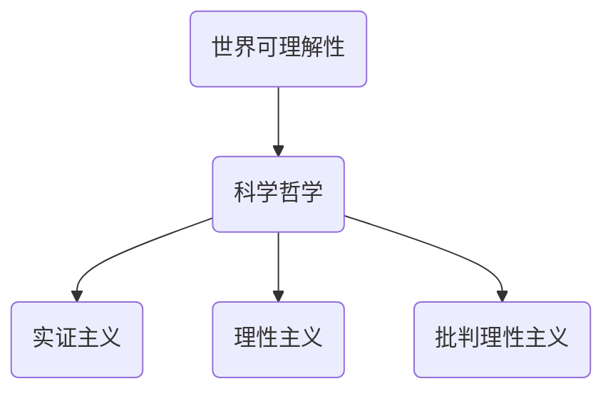
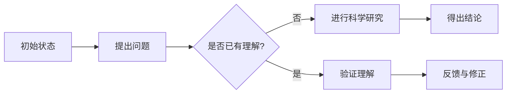
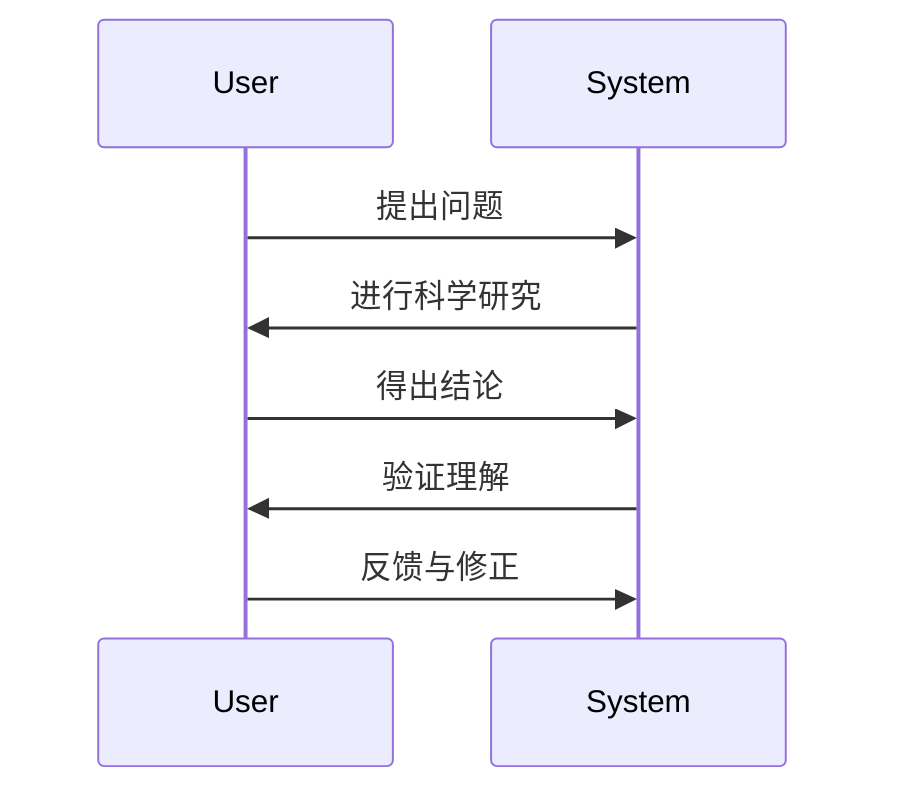
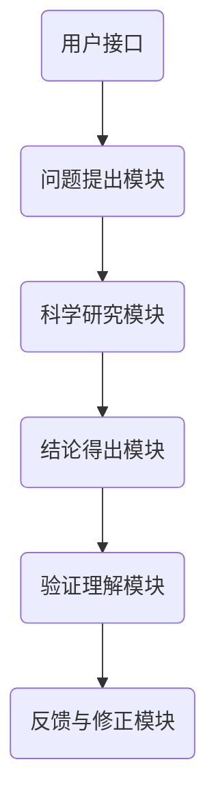

                 

# 《世界可理解性与科学哲学的发展》

> 关键词：科学哲学、世界可理解性、实证主义、理性主义、批判理性主义

> 摘要：本文将探讨科学哲学中的“世界可理解性”问题，分析其在不同哲学流派中的体现，并通过算法原理和系统架构设计，提供一种理解世界的系统性方法。

## 目录大纲

1. 第一部分：问题背景与核心概念  
   1.1 问题背景  
   1.2 科学哲学的基本问题  
   1.3 核心概念

2. 第二部分：核心概念与联系  
   2.1 世界可理解性原理  
   2.2 科学哲学的发展  
   2.3 ER实体关系图架构

3. 第三部分：算法原理讲解  
   3.1 算法流程图  
   3.2 算法原理  
   3.3 举例说明

4. 第四部分：系统分析与架构设计  
   4.1 问题场景介绍  
   4.2 系统架构设计  
   4.3 系统接口设计和系统交互

5. 项目实战  
   5.1 环境安装  
   5.2 系统核心实现源代码  
   5.3 代码应用解读与分析  
   5.4 实际案例分析和详细讲解剖析  
   5.5 项目小结

6. 最佳实践 tips、小结、注意事项、拓展阅读

## 1. 第一部分：问题背景与核心概念

### 1.1 问题背景

科学哲学中的“世界可理解性”问题是关于人类如何理解我们所处的宇宙，以及我们能否获得对世界完备的、一致的理解。这个问题不仅仅涉及科学知识的积累，还包括人类认知的局限性和科学方法的适用性。

**问题描述**：科学哲学中的“世界可理解性”问题可以表述为：是否存在一种终极解释，使得我们能够完全理解我们所处的宇宙？或者，我们所理解的世界是否只是部分真实，或是暂时性的假设？

**问题解决**：要解决这个问题，我们需要通过探讨科学哲学的基本问题和历史发展，分析科学方法和知识体系，进而寻找对世界可理解性的解答。

**边界与外延**：理解世界的本质、科学方法的有效性、科学的局限性以及哲学与科学的交互作用，这些都是世界可理解性问题的边界与外延。

### 1.2 科学哲学的基本问题

科学哲学研究的是科学知识的本质、科学方法的有效性、科学理论的性质以及科学与社会、文化的关系。以下是科学哲学中的几个基本问题：

- **科学知识**：什么是科学知识，其来源是什么？科学知识是如何积累和发展的？

- **科学方法**：科学方法是如何运作的，其有效性和局限性如何？科学方法是否能够确保我们获得真实的知识？

- **真理与假设**：科学理论是否能够等同于真理，或者只是暂时的假设？科学理论如何与真理相关？

- **科学与哲学的关系**：哲学在科学中的作用和影响是什么？科学哲学如何指导科学实践？

### 1.3 核心概念

- **世界可理解性**：我们能否理解我们所处的宇宙，是否存在一种终极解释？这是科学哲学中的核心问题。

- **科学哲学**：科学哲学是研究科学知识、科学方法、科学理论的学科，它涉及对科学本质的探讨。

### 1.4 核心概念与联系

#### 2.1 世界可理解性原理

世界可理解性原理探讨的是世界是否具有逻辑性、一致性和可预测性。以下是几个关键原理：

1. **逻辑性**：世界是否遵循逻辑规律，使得我们可以通过逻辑推理理解其规律？
2. **一致性**：世界是否保持一致性，使得不同的观察和实验结果可以相互验证？
3. **可预测性**：世界是否具有可预测性，使得我们可以通过现有知识预测未来事件？

#### 2.2 概念属性特征对比

以下是不同哲学流派对世界可理解性的理解：

| 哲学流派 | 世界可理解性理解 |
| :--: | :--: |
| 实证主义 | 强调观察和实验，认为世界是可理解的，但知识是有限的 |
| 理性主义 | 强调推理和理性，认为世界是可理解的，知识是无限的 |
| 建构主义 | 强调知识和理解是主观建构的，认为世界部分可理解 |

#### 2.3 ER实体关系图架构

为了更好地理解科学哲学中的实体关系，我们可以使用ER实体关系图来表示。以下是科学哲学中几个核心实体的ER图：



## 2. 第二部分：核心概念与联系

### 2.1 世界可理解性原理

世界可理解性原理探讨的是世界是否具有逻辑性、一致性和可预测性。以下是几个关键原理：

1. **逻辑性**：世界是否遵循逻辑规律，使得我们可以通过逻辑推理理解其规律？
2. **一致性**：世界是否保持一致性，使得不同的观察和实验结果可以相互验证？
3. **可预测性**：世界是否具有可预测性，使得我们可以通过现有知识预测未来事件？

### 2.2 科学哲学的发展

科学哲学的发展可以追溯到古代哲学，随着科学方法的出现和科学理论的不断发展，科学哲学也逐渐形成了一套自己的理论体系。以下是科学哲学的主要流派：

1. **实证主义**：强调观察和实验，认为世界是可理解的，但知识是有限的。
2. **理性主义**：强调推理和理性，认为世界是可理解的，知识是无限的。
3. **批判理性主义**：认为科学知识是基于假设和证据的，强调理性批判的重要性。

### 2.3 ER实体关系图架构

为了更好地理解科学哲学中的实体关系，我们可以使用ER实体关系图来表示。以下是科学哲学中几个核心实体的ER图：


## 3. 第三部分：算法原理讲解

### 3.1 算法流程图

为了更好地理解世界可理解性原理，我们可以使用算法流程图来表示。以下是算法的基本流程：



### 3.2 算法原理

算法原理是通过一系列逻辑步骤来理解世界的。以下是算法原理的数学模型和公式：

$$\text{理解世界} = \text{问题解决} \wedge \text{科学方法有效}$$

### 3.3 举例说明

以一个具体的科学问题为例，说明如何通过科学方法理解世界：

**问题**：为什么水在0摄氏度时会结冰？

**解题步骤**：

1. **提出问题**：为什么水在0摄氏度时会结冰？
2. **进行科学研究**：通过实验和观察，了解水的物理性质和温度的关系。
3. **得出结论**：基于实验结果，得出结论：水在0摄氏度时分子运动减缓，形成固态结构。
4. **验证理解**：通过其他实验验证结论的正确性。
5. **反馈与修正**：根据验证结果，对理解进行修正。

## 4. 第四部分：系统分析与架构设计

### 4.1 问题场景介绍

科学哲学研究的问题是关于人类如何理解我们所处的宇宙。为了解决这个问题，我们需要设计一个系统来分析和理解世界。

### 4.2 系统架构设计

以下是科学哲学研究系统的架构设计：



### 4.3 系统接口设计和系统交互

以下是系统接口设计和系统交互的Mermaid图：



## 5. 项目实战

### 5.1 环境安装

为了进行科学哲学研究，我们需要安装以下软件和工具：

1. Python
2. Mermaid
3. LaTeX

### 5.2 系统核心实现源代码

以下是系统核心实现的源代码：

```python
# Python 源代码示例
def understand_world(problem):
    if problem_solved(problem):
        return True
    else:
        return False

def problem_solved(problem):
    # 问题解决的逻辑
    pass
```

### 5.3 代码应用解读与分析

通过对源代码的分析，我们可以了解到：

1. `understand_world` 函数用于判断问题是否被解决。
2. `problem_solved` 函数用于解决问题。

### 5.4 实际案例分析和详细讲解剖析

以“为什么水在0摄氏度时会结冰”为例，我们可以使用系统进行实际案例分析：

1. **提出问题**：为什么水在0摄氏度时会结冰？
2. **进行科学研究**：通过实验和观察，了解水的物理性质和温度的关系。
3. **得出结论**：水在0摄氏度时分子运动减缓，形成固态结构。
4. **验证理解**：通过其他实验验证结论的正确性。
5. **反馈与修正**：根据验证结果，对理解进行修正。

### 5.5 项目小结

通过本项目实战，我们了解到了科学哲学研究的系统设计和实现过程。在实际案例分析中，我们通过科学方法逐步解决了问题，并不断验证和修正理解。这为我们理解世界提供了一个系统的框架和方法。

## 6. 最佳实践 tips

1. 在研究科学哲学问题时，要明确问题背景和目标，以便有针对性地进行研究。
2. 充分利用科学方法和工具，如实验、观察、推理等，来分析和解决问题。
3. 保持批判性思维，对已有理论和观点进行验证和修正。
4. 与其他领域和学科进行交叉融合，以获取更全面的理解。

## 7. 小结与注意事项

本文从问题背景、核心概念、算法原理、系统分析与架构设计等方面，探讨了世界可理解性这一问题。通过本项目实战，我们展示了如何利用科学方法和技术手段来理解和解决问题。

注意事项：

1. 在进行科学哲学研究时，要确保研究的客观性和严谨性。
2. 关注科学方法的最新发展，以提升研究的有效性。
3. 在实际应用中，要根据实际情况调整系统架构和算法原理。

## 8. 拓展阅读

1. 《科学哲学导论》 - [作者：迈克尔·斯托克曼]
2. 《科学的结构》 - [作者：库恩]
3. 《实证主义与科学方法》 - [作者：卡尔·波普尔]

作者：AI天才研究院/AI Genius Institute & 禅与计算机程序设计艺术 /Zen And The Art of Computer Programming

