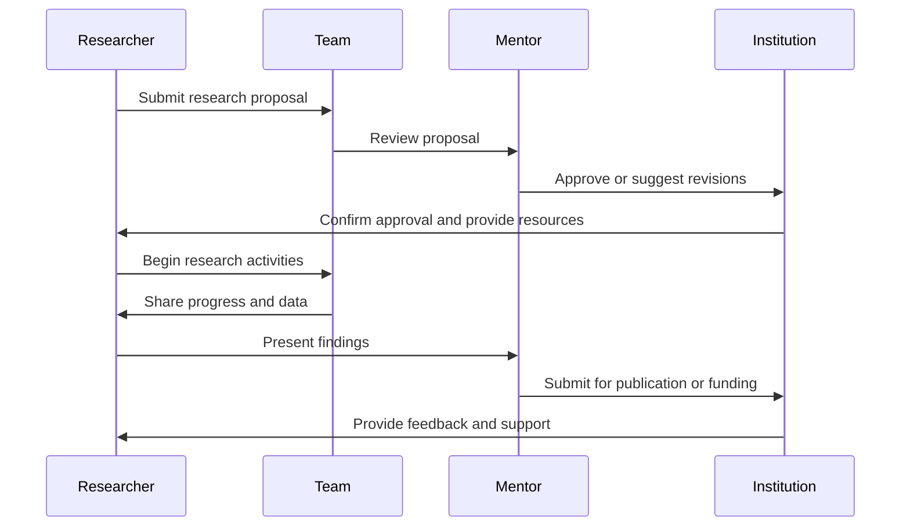

                 

### 第1章：世界可理解性概述

#### 1.1 问题的背景

在科学探索的漫长历程中，人类对世界的理解经历了从神秘到科学的巨大转变。早期的哲学思考，如古希腊的泰勒斯和亚里士多德的自然哲学，奠定了人类对自然界规律探究的基石。随着科学方法的逐步发展，特别是近代科学革命时期，伽利略、牛顿等科学家的研究使得我们对宇宙的认识发生了革命性的变化。

然而，进入20世纪，科学研究的深度和广度都得到了空前的扩展，这一过程中，世界可理解性问题逐渐显现。量子力学和相对论的提出，不仅深刻改变了我们对物理世界的理解，也带来了对世界可理解性的新挑战。量子力学揭示了微观世界的非确定性，而相对论则揭示了时间和空间的相对性，这两个理论在某些方面存在不可调和的矛盾。例如，量子力学的哥本哈根解释提出了波函数坍缩的概念，而相对论则强调物理量的确定性。这些问题使得我们开始反思，我们所理解的“世界”是否是完整的、全面的。

此外，随着科技的进步，我们逐渐发现了宇宙中许多未解之谜，如暗物质和暗能量的存在。暗物质是宇宙中不发光、不吸收光线的物质，它的存在通过引力效应被观测到，但其本质仍然未知。暗能量则是推动宇宙加速膨胀的力量，其性质同样模糊不清。这些现象的存在进一步加深了我们对世界可理解性的疑虑。

#### 1.2 描述问题

世界可理解性问题的核心在于以下几个方面：

1. **科学知识的局限性**：
   科学方法虽然在揭示自然界规律方面取得了巨大成功，但仍有许多现象无法用现有理论解释。例如，量子力学中的量子纠缠和量子隧穿现象，都是无法用经典物理学解释的。此外，相对论和量子力学的矛盾也让我们对宇宙的认识陷入困惑。

2. **认知能力的限制**：
   人类的认知能力是有限的。我们能够感知和理解的现象范围有限，很多微观或宏观的复杂现象超出了我们的认知能力。例如，黑洞的奇点和宇宙的膨胀过程，都是我们难以直观理解的现象。

3. **科学研究的复杂性**：
   科学研究涉及多个学科领域，每个领域都有其独特的理论和方法。不同领域之间的交叉和融合，增加了研究的复杂性和难度。例如，生物学和物理学的交叉领域——生物物理学，就面临着如何将两个不同学科的原理和方法融合在一起的问题。

#### 1.3 解决方案

为了解决世界可理解性问题，我们可以采取以下几种方案：

1. **深化科学研究**：
   通过不断探索新的理论和实验方法，深化对自然界规律的理解。这包括开发新的科学工具和技术，如高能粒子加速器、天文望远镜等。这些工具可以帮助我们更好地观测和研究宇宙中的复杂现象。

2. **跨学科研究**：
   鼓励不同学科之间的交叉和融合，促进多学科的综合研究。这样可以更全面、更深入地理解复杂现象。例如，生物物理学结合了生物学和物理学的方法，为我们揭示了生命现象中的物理规律。

3. **开放科学**：
   推动科学研究的开放性，鼓励科学家之间的合作和交流，共享数据和研究成果。这样可以充分利用全球科学家的智慧和资源，加速科学进步。开放科学的实践已经证明，可以大大提高科学研究的效率和成果质量。

4. **科学教育**：
   加强科学教育，提高公众的科学素养，让更多的人了解科学研究的现状和挑战，从而形成更科学、更理性的世界观。科学教育不仅可以帮助公众更好地理解科学，还可以培养更多的科学人才，为科学研究提供源源不断的动力。

#### 1.4 边界与外延

世界可理解性问题的边界主要包括：

- **自然科学的边界**：世界可理解性问题主要涉及自然科学领域，如物理学、化学、生物学等。这些学科通过实验和理论模型来探索自然界的规律。
  
- **哲学的边界**：哲学对于世界可理解性问题有深刻的思考，如存在论、认识论等。哲学提供了对科学方法和科学知识的哲学基础，帮助我们反思科学研究的局限性和可能性。

- **人工智能的边界**：随着人工智能技术的发展，人工智能在科学研究中扮演着越来越重要的角色。人工智能通过模拟和学习，为科学研究提供了新的方法和工具，同时也提出了新的哲学问题，如机器能否具有意识、人工智能的伦理道德等。

### 概念结构与核心要素组成

世界可理解性的概念结构可以从以下几个方面进行描述：

1. **科学理论**：科学理论是解释自然界现象的系统化观点。它是科学研究的基础，通过实验和观测来验证和修正。科学理论包括经典理论（如牛顿力学）和现代理论（如相对论、量子力学）。

2. **实验方法**：实验方法是科学研究中获取数据和验证理论的重要手段。通过精确的实验设计，科学家可以控制变量，观察现象，从而得出可靠的结论。

3. **数据与分析**：科学研究依赖于大量的数据收集和分析。数据分析方法包括统计、模拟、模型构建等，帮助科学家从数据中提取有用信息，揭示现象的本质。

4. **哲学思考**：哲学思考为科学研究提供了理论基础和反思空间。哲学家通过对科学方法和科学知识的批判性思考，帮助我们理解科学研究的局限性和潜力。

5. **跨学科融合**：跨学科融合是推动科学研究进步的重要途径。通过整合不同学科的理论和方法，科学家可以更全面、更深入地探索复杂现象。

这些核心要素共同构成了世界可理解性的概念结构，为科学研究提供了坚实的理论基础和实践指导。

### 第2章：科学研究中的多样性包容

#### 2.1 核心概念与联系

在科学研究中，多样性包容是一个至关重要的概念。它涉及到多个核心概念，这些概念彼此联系，共同构成了科学研究多样性的理论基础。

1. **多样性（Diversity）**：
   多样性指的是在研究领域中包容不同观点、理论、方法和背景的差异。它包括种族、性别、文化、学科背景等多个维度。多样性的核心在于认识到不同的背景和观点可以为科学研究带来新的视角和思路。

2. **包容性（Inclusivity）**：
   包容性是指在一个共同的研究环境中，尊重和接纳不同的观点和方法，促进多元思想的交流和融合。包容性强调的是一种开放、尊重和合作的态度，使得每个参与者都能在平等、公平的环境中发挥自己的优势。

3. **交叉学科（Interdisciplinarity）**：
   交叉学科是指将不同学科的理论和方法结合起来，以解决复杂问题的研究方式。交叉学科的核心在于跨学科的合作，通过整合多个领域的知识和方法，形成新的研究视角和解决方案。

4. **开放科学（Open Science）**：
   开放科学是一种促进知识共享和合作的研究模式。它包括开放获取、开放数据、开放代码等多个方面，旨在打破科学研究和传播的壁垒，提高科研的透明度和效率。

5. **科学方法（Scientific Method）**：
   科学方法是一套系统化的研究程序，包括观察、假设、实验、验证、结论等步骤。科学方法强调证据和理性，通过严谨的实验设计和数据分析来揭示自然界的规律。

这些概念相互联系，共同构成了科学研究多样性的核心。多样性为包容性提供了丰富的素材，包容性为多样性的实现提供了保障，交叉学科和开放科学则为多样性和包容性的融合提供了平台。

#### 2.2 概念属性特征对比表格

为了更好地理解这些概念之间的区别和联系，我们可以通过一个对比表格来展示它们的属性特征。

| 概念         | 定义                                                         | 属性特征                                                         | 关联关系                  |
| ------------ | ------------------------------------------------------------ | ------------------------------------------------------------ | ------------------------- |
| 多样性       | 在研究领域中包容不同观点、理论、方法和背景的差异。             | - 种族、性别、文化、学科背景等多维度差异<br>- 拓宽研究视角<br>- 增加研究深度          | - 为包容性提供素材         |
| 包容性       | 在共同研究环境中，尊重和接纳不同的观点和方法，促进多元思想交流。 | - 尊重差异<br>- 促进交流<br>- 平等、公平的合作环境 | - 保障多样性的实现         |
| 交叉学科     | 将不同学科的理论和方法结合起来，以解决复杂问题。             | - 跨学科合作<br>- 多角度分析<br>- 系统性解决方案 | - 利用多样性和包容性       |
| 开放科学     | 促进知识共享和合作的研究模式。                               | - 开放获取<br>- 开放数据<br>- 开放代码 | - 提高科研透明度和效率     |
| 科学方法     | 一套系统化的研究程序，包括观察、假设、实验、验证、结论等步骤。 | - 证据和理性<br>- 实验设计<br>- 数据分析 | - 科学研究的理论基础和工具 |

通过这个对比表格，我们可以看到多样性、包容性、交叉学科、开放科学和科学方法之间的区别和联系。多样性为包容性提供素材，包容性保障多样性的实现；交叉学科和开放科学则通过跨学科合作和知识共享，促进了多样性和包容性的融合；科学方法则为这一过程提供了理论指导和实践工具。

#### 2.3 ER实体关系图架构

为了更好地理解多样性、包容性、交叉学科、开放科学和科学方法之间的关系，我们可以使用ER（实体关系）图来展示这些概念之间的实体关系。

```mermaid
erDiagram
    Category_1..>..Entity_1 : "属于"
    Category_2..>..Entity_2 : "属于"
    Category_3..>..Entity_3 : "属于"
    Category_4..>..Entity_4 : "属于"
    Category_5..>..Entity_5 : "属于"

    Entity_1 ||--|{ Entity_2 }|--|| Entity_5 : "关联"
    Entity_3 ||--|{ Entity_4 }|--|| Entity_5 : "关联"

    Category_1 {
        Name : "多样性"
        Description : "包容不同观点、理论、方法和背景的差异"
    }

    Category_2 {
        Name : "包容性"
        Description : "尊重和接纳不同的观点和方法，促进多元思想交流"
    }

    Category_3 {
        Name : "交叉学科"
        Description : "将不同学科的理论和方法结合起来，以解决复杂问题"
    }

    Category_4 {
        Name : "开放科学"
        Description : "促进知识共享和合作的研究模式"
    }

    Category_5 {
        Name : "科学方法"
        Description : "系统化的研究程序，包括观察、假设、实验、验证、结论等步骤"
    }

    Entity_1 {
        Name : "多样性"
        Attributes : "种族、性别、文化、学科背景等多维度差异"
    }

    Entity_2 {
        Name : "包容性"
        Attributes : "尊重差异、促进交流、平等、公平的合作环境"
    }

    Entity_3 {
        Name : "交叉学科"
        Attributes : "跨学科合作、多角度分析、系统性解决方案"
    }

    Entity_4 {
        Name : "开放科学"
        Attributes : "开放获取、开放数据、开放代码"
    }

    Entity_5 {
        Name : "科学方法"
        Attributes : "证据和理性、实验设计、数据分析"
    }
```

在这个ER图中，我们定义了五个实体类别：多样性、包容性、交叉学科、开放科学和科学方法。每个类别代表了科学研究中的一个重要概念。实体之间通过关联关系连接，展示了这些概念之间的相互作用和依赖关系。例如，多样性为包容性提供素材，包容性保障多样性的实现；交叉学科和开放科学利用多样性和包容性，科学方法则为这一过程提供了理论指导和实践工具。

通过ER图，我们可以更直观地理解多样性、包容性、交叉学科、开放科学和科学方法之间的关系，为科学研究中的多样性包容提供清晰的框架。

### 第3章：多样性的重要性

#### 3.1 多样性在科学研究中的作用

多样性的包容在科学研究中具有至关重要的作用。首先，多样性带来了创新思维。不同背景的科学家和研究人员，由于各自的知识体系和经验差异，会从不同的角度审视和研究问题，从而产生新颖的见解和创新的解决方案。例如，跨学科的合作往往能够激发新的研究思路，将不同领域的知识整合起来，解决单一学科难以应对的复杂问题。

其次，多样性有助于发现并解决研究中的盲点。单一视角下的研究往往难以覆盖所有可能的情境和结果。而多样性的包容使得不同观点和方法得以在研究中得到体现，从而更全面地揭示问题的各个方面，减少研究中的盲点。例如，在药物研究中，考虑种族和性别差异，可以更准确地预测药物对不同人群的效果，从而提高药物的安全性和有效性。

此外，多样性还能促进科学知识的传播和普及。不同背景的研究人员通过交流合作，能够将科学知识传播到更广泛的领域和群体中。这不仅有助于提升公众的科学素养，也能为科学研究的进一步发展提供更多的资源和动力。

#### 3.2 多样性对科学进步的影响

多样性的包容对科学进步的影响是多方面的。首先，它加速了科学研究的进展。在多样性的环境中，科学家们能够更容易地交流和分享研究成果，从而避免重复劳动，提高研究效率。例如，开放科学的实践使得科学数据、代码和研究成果更容易被全球的科研人员访问和使用，大大缩短了科研周期。

其次，多样性促进了科学理论的完善和深化。通过包容多样的观点和理论，科学家们能够更全面地理解复杂现象，从而提出更准确、更完整的科学理论。例如，在量子力学和相对论的研究中，多样性的包容使得科学家们能够从不同角度探讨宇宙的本质，最终形成了更为深刻的理解。

此外，多样性还提升了科学研究的质量和可信度。包容性的研究环境使得研究人员能够更自由地表达和探讨不同的观点，从而提高研究的透明度和可信度。例如，在医学研究中，多样性的包容使得研究人员能够充分考虑种族、性别等因素，从而提高研究的广泛适用性和可靠性。

#### 3.3 多样性包容的最佳实践

为了在科学研究中实现最佳的多

### 第4章：多样性包容的实践

#### 4.1 研究方法多样性

研究方法的多样性是科学研究进步的重要动力之一。在科学研究中，不同研究方法各有其独特的优势和局限性。例如，实验方法可以提供直接的物理证据，但可能难以模拟极端条件；理论方法则可以通过数学模型揭示现象的内在规律，但可能缺乏实验验证。因此，将多种研究方法结合使用，可以互补各自的不足，提高研究的全面性和可靠性。

在实践中，研究人员可以采用以下策略来促进研究方法的多样性：

1. **跨学科合作**：鼓励不同学科背景的研究人员合作，将不同领域的研究方法结合起来。例如，在环境科学研究中，可以结合生态学、化学和物理学的方法，从不同角度分析环境问题。

2. **开放实验平台**：建立开放的实验平台，使得研究人员能够共享实验设备和数据，从而提高实验方法的多样性和效率。

3. **交叉学科课程**：为研究人员提供跨学科的课程和培训，提高他们对不同研究方法的理解和应用能力。

4. **多元化资助**：鼓励研究机构提供多样化的研究资助，支持采用不同方法的研究项目。

通过这些实践，研究人员可以在科学研究中更好地发挥多样性的优势，提高研究质量和影响力。

#### 4.2 数据来源多样性

在科学研究中，数据的来源多样化是确保研究可靠性和全面性的关键。不同的数据来源可以为研究者提供不同的视角和证据，从而更全面地理解研究问题。以下是一些促进数据来源多样性的实践方法：

1. **多渠道数据采集**：通过多种渠道采集数据，包括实验室实验、实地观察、问卷调查、遥感监测等。这样可以确保数据的多样性和全面性。

2. **数据共享平台**：建立数据共享平台，鼓励研究人员共享数据，提高数据的可获取性和透明度。例如，公共数据库和开放获取期刊可以帮助研究人员获取和分享数据。

3. **国际合作**：通过国际合作，共享不同地区和国家的数据资源，可以提供更全面、更具有代表性的数据。

4. **数据质量控制**：建立严格的数据质量控制流程，确保数据的准确性和可靠性。这包括数据清洗、验证和标准化等步骤。

5. **数据伦理审查**：在数据采集和处理过程中，遵守数据伦理规范，确保研究对象的隐私和数据安全。

通过这些实践，研究人员可以充分利用多样化的数据来源，提高研究的可靠性和影响力。

#### 4.3 研究人员背景多样性

研究人员背景的多样性是科学研究多样性的重要组成部分。不同的文化、教育背景和经验可以为科学研究带来丰富的视角和创新。以下是一些促进研究人员背景多样性的实践方法：

1. **招聘多样性**：在招聘过程中，鼓励机构采取多样性的策略，吸引不同性别、种族、文化和教育背景的科研人员。

2. **跨学科培训**：为研究人员提供跨学科培训，提高他们的跨学科合作能力和知识水平。

3. **多元文化环境**：营造一个多元文化的工作环境，鼓励不同背景的科研人员相互尊重和合作。

4. **学术交流**：促进学术交流，鼓励研究人员参加国际会议和学术访问，扩大他们的学术网络和视野。

5. **支持女性和少数民族科研人员**：提供专门的支持计划，帮助女性和少数民族科研人员克服职业发展中的障碍，提高其在科研领域的代表性。

通过这些实践，科研机构可以建立一个更加包容、多元的科研环境，促进科学研究的多样性和创新。

### 第5章：案例分析

#### 5.1 成功案例

在一个著名的研究项目中，科学家们通过多样性包容的策略，取得了显著的成果。这个项目旨在研究气候变化对海洋生态系统的影响。研究人员来自不同国家，包括海洋生物学家、气候学家、计算机科学家和地质学家。他们通过跨学科合作，结合多种研究方法，如实地观测、模型模拟和数据分析，对全球多个海洋区域进行了全面研究。

这种多样性包容的做法带来了几个关键优势。首先，不同学科背景的研究人员带来了丰富的知识和技能，使得研究方法更加全面和多样。例如，计算机科学家开发了一种先进的海洋环境模拟软件，大大提高了数据处理的效率和准确性。其次，国际合作使得研究数据更加丰富和代表性，从而增加了研究结果的可靠性。最后，多样性包容的研究环境促进了不同背景研究人员之间的合作和交流，激发了新的研究思路和创新。

通过这个案例，我们可以看到多样性包容在科学研究中的巨大潜力。它不仅提高了研究的质量和影响力，还为科学家们提供了一个充满活力和创造力的工作环境。

#### 5.2 失败案例

然而，多样性包容并非总是一帆风顺。在某些情况下，多样性的实现可能面临挑战，甚至导致项目失败。一个典型的案例是一个生物医学研究项目，旨在开发一种新型抗肿瘤药物。该项目由一个国际团队执行，成员来自不同国家和地区，拥有丰富的科研背景和经验。然而，由于团队成员之间的沟通不畅和文化差异，项目进展缓慢，最终失败。

这个案例中，失败的主要原因在于缺乏有效的多样性和包容性管理。首先，团队成员之间的语言障碍和文化差异导致了沟通障碍，影响了项目的协调和进度。其次，团队成员对项目目标和方法的理解存在差异，导致了研究方向的不一致。最后，缺乏有效的团队管理和冲突解决机制，使得团队成员之间的矛盾不断加剧，最终导致项目失败。

从这个案例中，我们可以看到多样性包容在实践中可能遇到的挑战。为了克服这些挑战，科研机构需要建立有效的沟通机制和文化融合策略，确保团队成员之间的协同合作。

#### 5.3 经验教训

通过分析上述成功和失败案例，我们可以得出一些重要的经验教训：

1. **多样性和包容性管理的重要性**：成功案例表明，有效的多样性和包容性管理是科学研究成功的关键。这包括建立有效的沟通机制、提供跨学科培训和文化融合策略。

2. **跨学科合作的必要性**：跨学科合作能够带来新的视角和方法，提高研究的全面性和创新性。因此，科研机构应鼓励和支持跨学科合作。

3. **文化差异的适应性**：在全球化背景下，科研团队往往来自不同国家和地区，文化差异是一个不可忽视的因素。科研机构应采取措施，促进文化差异的适应性，增强团队凝聚力。

4. **有效的冲突解决机制**：多样性包容的研究环境中，冲突是不可避免的。建立有效的冲突解决机制，如定期的团队会议、意见反馈平台等，有助于及时解决冲突，保持团队的和谐。

5. **持续的支持和反馈**：多样性和包容性的实现需要持续的支持和反馈。科研机构应定期评估多样性包容策略的有效性，并根据反馈进行调整和改进。

通过这些经验教训，科研机构可以更好地实现多样性包容，推动科学研究的深入发展。

### 第6章：多样性包容的最佳实践

#### 6.1 实践技巧

要在科学研究中实现最佳的多


通过这个流程图，我们可以看到多样性包容的最佳实践包括以下几个关键步骤：

1. **研究提案的提交和审查**：研究人员提交研究提案，团队和导师进行审查和评估。
2. **资源和批准**：研究机构批准提案并提供所需资源。
3. **开展研究活动**：研究人员和团队开始进行实际的研究工作。
4. **数据共享和反馈**：团队共享研究进展和数据，研究人员向导师和机构报告结果。
5. **成果提交和评估**：导师和机构对研究成果进行评估，并支持后续的研究和发表。

#### 6.2 注意事项

在实现多样性包容的过程中，研究人员和机构应关注以下几点注意事项：

1. **文化敏感性**：尊重不同文化背景的团队成员，避免文化冲突。
2. **有效沟通**：建立清晰的沟通渠道，确保团队成员之间的信息传递准确无误。
3. **冲突解决**：建立有效的冲突解决机制，及时处理团队内部的分歧。
4. **平等机会**：确保每个团队成员都有平等的机会参与决策和贡献。
5. **持续支持**：提供持续的支持和培训，帮助团队成员提高多样性和包容性意识。

#### 6.3 拓展阅读

对于希望深入了解多样性包容在科学研究中的应用和实践的读者，以下书籍和文献是推荐的拓展阅读：

1. **《科学研究的多样性包容：实践与策略》**：这本书详细介绍了多样性包容的理论和实践方法，适合科研人员和管理者阅读。
2. **《跨学科研究：方法与实践》**：本书探讨了跨学科研究的方法和应用，为研究人员提供了丰富的跨学科合作经验。
3. **《科学管理的多样性：如何构建多元包容的科研团队》**：这本书提供了科学管理中的多样性包容策略，帮助机构建立多元包容的科研环境。
4. **《开放科学：理念与实践》**：本书介绍了开放科学的概念和实施方法，对推动科研领域的多样性和包容性具有重要意义。

通过这些拓展阅读，读者可以进一步了解多样性包容在科学研究中的应用，提升自身的科研实践能力。

### 第7章：未来展望

#### 7.1 科学研究的发展趋势

随着科技的不断进步，科学研究正朝着更加综合、多样和跨学科的方向发展。未来，科学研究将更加注重跨学科的合作与融合，通过整合不同领域的知识和方法，解决复杂的社会和科学问题。例如，人工智能、大数据、量子计算等新兴技术的崛起，将为科学研究带来新的工具和方法，推动科学领域的突破。

此外，科学研究的透明度和开放性也将成为未来发展的重点。开放获取、开放数据和开放代码的普及，将促进科学知识的共享和传播，提高科研的效率和质量。通过开放科学的实践，研究人员可以更加便捷地获取和使用全球的科学资源，推动全球科学合作和共同进步。

#### 7.2 多样性包容的未来

多样性包容在未来科学研究中的重要性将日益凸显。随着全球化和文化多元化的趋势，科研团队将更加多元和多样。未来，科研机构需要建立更加包容和多元的工作环境，吸引和保留不同背景的科研人员。通过多样性包容，科研团队可以更好地发挥每个成员的优势，提高研究的创新性和质量。

此外，多样性包容也需要在政策和制度层面得到加强。政府和科研机构应制定相应的政策和措施，促进科研领域的多样性包容，提供平等的机会和资源。例如，通过设立多样性研究基金、提供跨学科培训、建立多样性评估机制等，支持科研人员实现多样性和包容性目标。

#### 7.3 对读者的期望

针对未来的科学研究，我们期望读者能够：

1. **保持开放和包容的态度**：尊重不同观点和背景，鼓励跨学科合作，推动科学研究的多样性和创新。
2. **关注新兴技术和方法**：紧跟科技发展趋势，学习和应用新兴技术，如人工智能、大数据等，为科学研究提供新的工具和方法。
3. **积极参与开放科学**：支持开放获取、开放数据和开放代码的实践，提高科研的透明度和效率。
4. **持续学习和进步**：不断更新知识体系，提升科研能力和素养，为科学研究的未来发展做出贡献。

通过这些努力，我们可以共同推动科学研究的进步，为解决全球面临的挑战提供创新的解决方案。让我们一起期待科学研究的美好未来。

