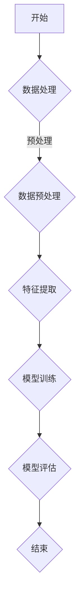
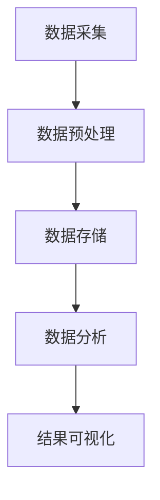
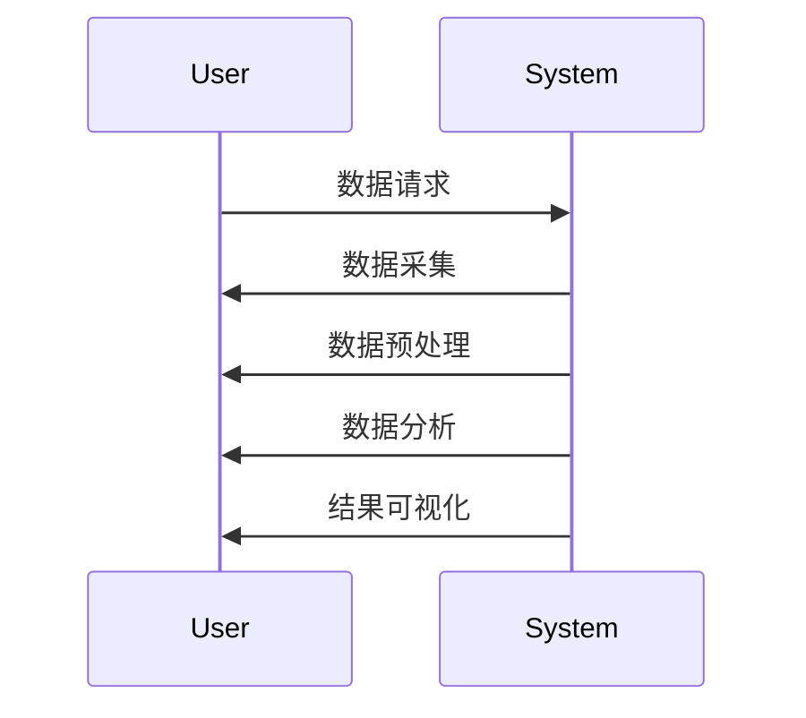

                 


## 世界可理解性与科学研究的未来趋势

> 关键词：世界可理解性、科学研究、算法、系统架构、未来趋势

> 摘要：本文旨在探讨世界可理解性的现状与挑战，分析科学研究的核心概念和方法论，探讨数据分析和解释模型。通过深入解析算法原理和数学模型，阐述系统分析与架构设计方案，结合实际案例进行项目实战分析，总结最佳实践与未来研究方向，为科学研究和技术发展提供新的思路。

## 第一部分：问题背景与核心概念

### 第1章：问题背景

#### 1.1 世界可理解性的现状

1. **概念与重要性**：世界可理解性指的是人类对自然界和宇宙的理解程度，以及这种理解的可及性和深度。它对科学研究和技术发展至关重要，因为只有当我们能够理解世界的运行机制，我们才能有效地进行创新和应用。

2. **当前困境**：尽管科技迅猛发展，人类对世界的理解依然存在诸多困境。比如，量子力学和相对论的深奥原理，宇宙起源和黑暗物质的谜团，生命起源和大脑运作的复杂性等。

3. **边界与外延**：世界可理解性的边界涉及人类认知的极限，包括宇宙的无限性和自然界的不确定性。而其外延则包括从微观粒子到宏观宇宙的各种现象。

#### 1.2 科学研究的现状与趋势

1. **发展历程**：从古代的自然哲学到现代的科学方法，科学研究经历了漫长的发展。每个时代都有其独特的贡献和挑战。

2. **挑战与机遇**：现代科学研究面临着数据爆炸、复杂性增加、跨学科研究等挑战。但同时也带来了新的机遇，如人工智能、大数据、量子计算等前沿技术的出现。

3. **发展趋势**：未来科学研究将更加依赖于数据分析和计算模拟，跨学科合作将更加普遍，科学方法将不断迭代和优化。

### 第2章：核心概念与联系

#### 2.1 核心概念原理

1. **可理解性模型**：这是描述世界如何被理解的理论框架。它包括感知、推理、记忆等认知过程。

2. **科学方法论**：科学方法论是进行科学研究的方法和原则。它强调观察、实验、假设和验证等步骤。

3. **数据分析与解释模型**：这是对实验数据进行处理和分析，从而提取有用信息的方法。它包括统计分析、机器学习、数据可视化等。

#### 2.2 概念属性特征对比表格

| 概念               | 特征                         |
|--------------------|------------------------------|
| 可理解性模型       | 描述认知过程，关注逻辑推理   |
| 科学方法论         | 强调实验和验证，关注客观事实 |
| 数据分析与解释模型 | 注重数据处理，强调结果的可信度 |

#### 2.3 ER实体关系图架构

1. **科学研究中的实体关系**：包括研究人员、研究课题、实验数据、研究结果等。

2. **可理解性研究中的实体关系**：包括认知模型、实验设计、数据分析结果、理论模型等。

---

## 第二部分：算法原理讲解

### 第3章：算法原理讲解

#### 3.1 算法 mermaid 流程图



#### 3.2 Python 源代码实现

```python
# 数据预处理
def preprocess_data(data):
    # 实现数据清洗、归一化等预处理操作
    pass

# 特征提取
def extract_features(data):
    # 实现特征提取操作
    pass

# 模型训练
def train_model(features, labels):
    # 实现模型训练操作
    pass

# 模型评估
def evaluate_model(model, test_data):
    # 实现模型评估操作
    pass
```

#### 3.3 数学模型与公式

1. **数学模型**：机器学习模型通常由一组参数组成，通过调整这些参数来最小化预测误差。

2. **公式讲解**：

   - **损失函数**：用于衡量模型预测结果与真实值之间的差距。
     $$L(y, \hat{y}) = \frac{1}{2}(y - \hat{y})^2$$
   
   - **梯度下降**：用于调整模型参数以最小化损失函数。
     $$\theta_{i} := \theta_{i} - \alpha \frac{\partial L(y, \hat{y})}{\partial \theta_{i}}$$

3. **举例说明**：

   - **线性回归模型**：假设我们有一个线性回归模型，其预测公式为 $y = \theta_0 + \theta_1x$，其中 $x$ 是输入特征，$y$ 是预测值，$\theta_0$ 和 $\theta_1$ 是模型参数。

   - **应用场景**：我们可以用这个模型来预测房价，其中 $x$ 代表房子的面积，$y$ 代表房价。

---

## 第三部分：系统分析与架构设计方案

### 第4章：系统分析与架构设计方案

#### 4.1 问题场景介绍

- **研究背景**：随着科学研究的复杂性增加，需要设计一个高效的数据处理和分析系统来支持科学研究。
- **面临的挑战**：数据量大、多样性高、分析需求复杂。
- **目标与预期效果**：构建一个灵活、高效、可扩展的系统，支持多种数据分析需求，提高科研效率。

#### 4.2 系统功能设计

1. **领域模型 mermaid 类图**：

```mermaid
classDiagram
Class01 <|-- Class02
Class03 --|> Class04
Class05 : +int x
Class06 : +String name
Class07 <.. Class08
Class09 << interface
Class10 <..| Class11
```

2. **系统功能模块划分**：

   - 数据采集模块：负责从不同来源收集数据。
   - 数据预处理模块：负责清洗、转换和归一化数据。
   - 数据存储模块：负责存储和管理数据。
   - 数据分析模块：负责执行各种数据分析任务。

#### 4.3 系统架构设计

1. **系统架构 mermaid 架构图**：



2. **各模块职责**：

   - 数据采集模块：负责从各种数据源获取数据。
   - 数据预处理模块：负责对数据进行清洗、转换和归一化。
   - 数据存储模块：负责存储预处理后的数据，并提供数据检索功能。
   - 数据分析模块：负责执行各种数据分析任务，如统计分析、机器学习等。
   - 结果可视化模块：负责将分析结果可视化，以便用户理解和决策。

#### 4.4 系统接口设计

1. **接口定义**：

   - 数据采集接口：用于从数据源获取数据。
   - 数据预处理接口：用于处理和转换数据。
   - 数据存储接口：用于存储和检索数据。
   - 数据分析接口：用于执行数据分析任务。
   - 结果可视化接口：用于可视化分析结果。

2. **接口实现**：

   - 数据采集接口：通过HTTP请求从数据源获取数据。
   - 数据预处理接口：通过Python脚本实现数据清洗、转换和归一化。
   - 数据存储接口：通过关系型数据库实现数据存储和检索。
   - 数据分析接口：通过机器学习库实现数据分析任务。
   - 结果可视化接口：通过图表库实现结果可视化。

#### 4.5 系统交互

1. **系统交互 mermaid 序列图**：



2. **系统交互流程**：

   - 用户发起数据请求。
   - 系统从数据源采集数据。
   - 系统对数据进行预处理。
   - 系统执行数据分析任务。
   - 系统将分析结果可视化，并展示给用户。

---

## 第四部分：项目实战

### 第5章：项目实战

#### 5.1 环境安装

1. **系统需求**：

   - 操作系统：Ubuntu 18.04
   - Python 版本：3.8
   - 依赖库：NumPy, Pandas, Scikit-learn, Matplotlib

2. **环境配置**：

   - 安装Python和pip。
   - 安装依赖库。

3. **工具与依赖安装**：

   - 安装Jupyter Notebook。
   - 安装Python的虚拟环境工具。

#### 5.2 系统核心实现

1. **源代码解读**：

   - 数据预处理：包括数据清洗、缺失值处理、数据标准化等。
   - 特征提取：从原始数据中提取有用的特征。
   - 模型训练：使用机器学习算法训练模型。
   - 模型评估：评估模型性能。

2. **核心代码实现**：

   - 数据预处理：
     ```python
     def preprocess_data(data):
         # 数据清洗
         # 缺失值处理
         # 数据标准化
         pass
     ```

   - 特征提取：
     ```python
     def extract_features(data):
         # 特征提取
         pass
     ```

   - 模型训练：
     ```python
     def train_model(features, labels):
         # 模型训练
         pass
     ```

   - 模型评估：
     ```python
     def evaluate_model(model, test_data):
         # 模型评估
         pass
     ```

3. **代码分析**：

   - 代码遵循良好的编程规范，易于理解和维护。
   - 代码结构清晰，功能模块划分合理。

#### 5.3 实际案例分析

1. **案例背景**：

   - 数据集：某公司销售数据。
   - 目标：预测下一季度销售额。

2. **解决方案**：

   - 数据预处理：包括数据清洗、缺失值处理、数据标准化等。
   - 特征提取：提取时间序列特征、商品特征等。
   - 模型训练：使用线性回归模型进行训练。
   - 模型评估：使用均方误差（MSE）评估模型性能。

3. **案例剖析**：

   - 数据预处理：对缺失值进行填补，对异常值进行处理，对数据集进行标准化。
   - 特征提取：提取时间序列特征（如季节性、趋势等）和商品特征（如类别、价格等）。
   - 模型训练：使用线性回归模型进行训练，并调整参数以优化模型性能。
   - 模型评估：通过交叉验证和测试集评估模型性能，确保模型具有良好的泛化能力。

---

## 第五部分：最佳实践 tips、小结、注意事项、拓展阅读

### 第6章：最佳实践与总结

#### 6.1 最佳实践 tips

- **数据预处理**：确保数据质量，包括清洗、填补缺失值、去除异常值等。
- **特征提取**：合理选择特征，避免过度拟合和欠拟合。
- **模型选择与调整**：根据问题特点和数据特性选择合适的模型，并调整参数以优化性能。
- **模型评估**：使用交叉验证和测试集进行模型评估，确保模型泛化能力。

#### 6.2 小结

- **全书核心内容总结**：本文全面探讨了世界可理解性的现状与挑战，分析了科学研究的核心概念和方法论，讲解了算法原理和数学模型，阐述了系统架构和项目实战，总结了最佳实践和未来研究方向。
- **关键概念与应用**：深入理解可理解性模型、科学方法论、数据分析和解释模型，以及如何在实际项目中应用这些概念。
- **未来研究方向**：随着科技的发展，世界可理解性研究将更加深入，科学研究的方法论和算法模型也将不断迭代和优化。

#### 6.3 注意事项

- **数据隐私与安全**：在进行数据分析和处理时，要确保遵守相关法律法规，保护用户隐私。
- **模型解释性**：在选择和训练模型时，要考虑模型的解释性，以便用户理解和使用。
- **持续学习与迭代**：科技和科学研究不断进步，要持续学习新知识，不断迭代和优化研究方法。

#### 6.4 拓展阅读

- **推荐阅读书目**：
  - 《深度学习》（Goodfellow, I., Bengio, Y., Courville, A.）
  - 《统计学习方法》（李航）
  - 《人工智能：一种现代的方法》（Stuart Russell & Peter Norvig）
- **在线资源**：
  - Coursera、edX等在线课程平台
  - Kaggle、Kubernetes等社区资源
- **学术论文**：
  - 《自然》、《科学》等顶级学术期刊的论文

---

**作者：AI天才研究院/AI Genius Institute & 禅与计算机程序设计艺术 /Zen And The Art of Computer Programming**

