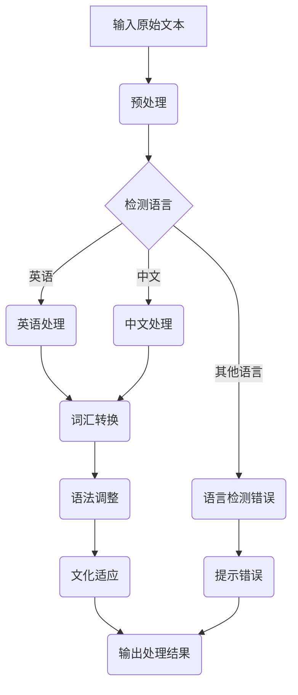
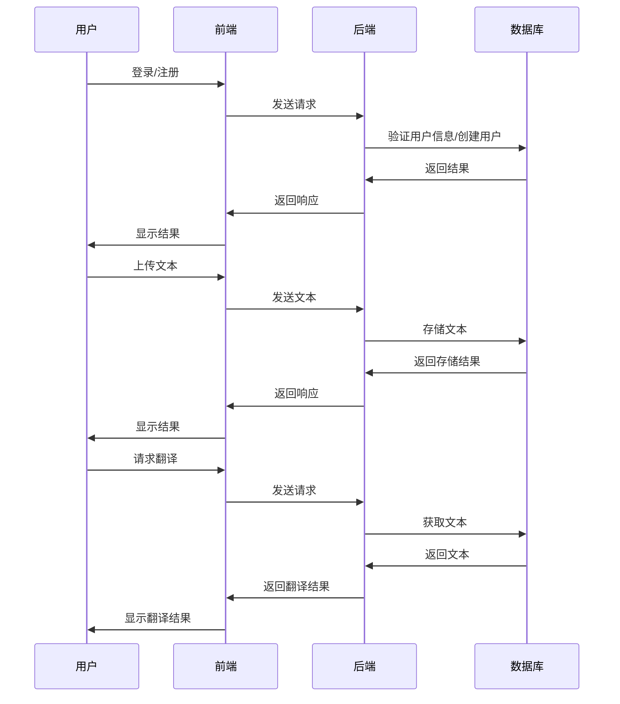

                 

### 引言

随着全球化的不断深入，跨文化交流已经成为了人类社会的一个重要特征。尤其在科学研究领域，跨文化交流的重要性愈加凸显。科学研究不仅限于某一国家或地区，而是需要全球范围内的合作与交流。然而，不同文化之间的差异，包括语言、认知模式、价值观等，使得科学知识的传播和理解面临着诸多挑战。本文将探讨世界可理解性与科学研究的跨文化交流，分析其背后的逻辑与机制。

首先，什么是世界可理解性？世界可理解性指的是人类对于世界本质的理解和解释能力，它涉及知识传播、文化认同、认知过程等多个层面。在科学研究中，世界可理解性尤为重要，因为科学探索的目标正是揭示世界的规律和本质。不同文化背景下，人们对世界的理解存在差异，这无疑影响了科学知识的传播和应用。

接下来，我们探讨跨文化交流的重要性。在全球化的背景下，科学研究的跨文化交流不仅是科技进步的驱动力，也是国际合作的桥梁。有效的跨文化交流能够促进科学知识的共享，推动技术的创新与发展。然而，文化差异也是一把双刃剑，它既可以为科学交流提供丰富的资源，也可能成为知识传播的障碍。

在本文中，我们将逐步分析跨文化交流中科学知识的传播、理解和应用过程。首先，我们会介绍一些核心概念，包括世界可理解性、跨文化交流、科学研究等，并详细解释这些概念的定义和相互关系。接着，我们将通过对比不同文化背景下的科学研究方法、语言表达和文化价值观，探讨这些差异对科学理解的影响。此外，我们还会借助Mermaid流程图和Python代码示例，深入解析跨文化交流中常用的算法原理。

随后，我们将介绍具体的系统架构设计，通过Mermaid绘制的领域模型类图、系统架构图、系统接口设计和系统交互序列图，展示跨文化交流系统的详细实现。在项目实战部分，我们将详细介绍如何搭建这样的系统，并分享具体的代码实现和分析。

最后，我们将总结最佳实践、注意事项，并提供拓展阅读建议，帮助读者更深入地理解和应用跨文化交流中的科学知识传播。

### 问题背景

在全球化的推动下，科学研究已成为一个跨国界的活动，不同国家和地区的科研机构、学者通过合作与交流，共同推动科学技术的进步。然而，跨文化交流中的语言、文化、认知差异为科学知识传播带来了诸多挑战。首先，语言障碍是跨文化交流中最直接的一个问题。不同的语言在表达科学概念和理论时，可能存在语义歧义或文化背景差异，导致科学知识在传播过程中失真或误解。

其次，文化差异也会影响科学知识的传播。不同的文化背景会对科学观念、方法和技术产生不同的认知和理解。例如，某些文化可能对实验主义持有怀疑态度，而另一些文化则可能更注重经验主义。这些差异可能导致科学知识的传播遇到阻力，影响国际合作研究的顺利进行。

此外，认知差异也是跨文化交流中的一个重要因素。不同文化背景下的个体在认知模式、思维方式上存在差异，这会影响他们对科学知识的学习、理解和应用。例如，西方文化中的逻辑思维与东方文化中的辩证思维在科学研究中可能产生不同的效果。这些认知差异可能使得科学知识在不同文化中难以得到一致的认同和接受。

面对这些挑战，跨文化交流中的科学知识传播需要更加注重多样性和包容性。研究者需要深入了解不同文化背景下的科学观念和认知方式，采取更加灵活和适应性的传播策略。同时，国际合作研究应建立多元化的沟通机制，促进不同文化背景下的科学家之间的交流与合作，共同克服科学知识传播中的障碍。

### 问题描述

在跨文化交流中，科学知识的传播、理解和应用过程面临着一系列问题。首先，科学知识的传播过程中，语言障碍是一个不容忽视的挑战。不同语言在表达科学概念时可能存在语义歧义，甚至文化背景的差异会导致对同一概念的误解。例如，某一科学术语在一种语言中具有特定的含义，但在另一种语言中可能需要通过翻译来传达，而翻译过程中的不确定性可能导致术语的含义发生偏差。

其次，文化差异也是影响科学理解的重要因素。不同的文化背景会对科学观念、方法和技术产生不同的认知和理解。例如，某些文化可能对实验主义持有怀疑态度，而另一些文化则可能更注重经验主义。这种认知差异可能导致科学知识在不同文化中难以得到一致的认同和接受，从而影响其传播和应用。

另外，认知差异同样在跨文化交流中扮演着关键角色。不同文化背景下的个体在认知模式、思维方式上存在差异，这会影响他们对科学知识的学习、理解和应用。例如，西方文化中的逻辑思维与东方文化中的辩证思维在科学研究中可能产生不同的效果。这种认知差异可能使得科学知识在不同文化中难以得到统一的解释和应用。

最后，科学知识的传播和应用也受到制度和组织结构的限制。不同国家和地区的科研体制、政策、法律等差异可能导致科学知识在不同环境中面临不同的传播和应用环境。例如，某些国家的科研政策可能倾向于保护本土知识，限制国际交流与合作，从而阻碍科学知识的全球传播。

综上所述，跨文化交流中的科学知识传播、理解和应用过程面临着语言、文化、认知等多方面的挑战。解决这些问题需要研究者、政策制定者和国际社会共同努力，通过建立多元化和包容性的科学交流机制，促进科学知识的全球传播和应用。

### 问题解决

为了有效解决跨文化交流中科学知识传播的问题，我们需要从多个方面入手，增强世界可理解性，制定科学的跨文化交流策略。

首先，增强世界可理解性是一个关键步骤。这包括以下措施：

1. **多语言支持**：确保科学文献和资料的多语言翻译和发布，以消除语言障碍。例如，通过国际科学期刊的多语言版本，使不同语言的科学家能够无障碍地获取和分享研究资料。
   
2. **文化敏感性培训**：为科学家提供跨文化敏感性培训，使他们能够更好地理解不同文化背景下的科学观念和认知模式。这有助于减少误解和冲突，促进有效的交流。

3. **统一术语和标准**：制定统一的科学术语和标准，以避免由于语言差异导致的术语歧义。例如，国际科学联合会可以负责建立和推广这些术语和标准。

其次，制定科学的跨文化交流策略也是必不可少的。以下是几项具体的策略：

1. **国际科研合作**：鼓励和支持国际科研合作，通过合作研究项目，促进不同文化背景下的科学家之间的交流与合作。例如，通过设立跨国科研基金，支持科学家共同开展研究。

2. **交流平台建设**：建立跨国界的科学交流平台，如国际科学会议、研讨会和工作坊，为科学家提供一个分享经验和知识的空间。

3. **政策支持**：政府应制定和实施支持跨文化交流的政策，包括提供资金支持、简化签证程序、鼓励国际科研合作等。

4. **科学传播策略**：采取多种科学传播策略，如通过媒体、公众讲座、科普读物等，向更广泛的社会公众传播科学知识，增强大众的科学素养。

5. **技术工具应用**：利用现代技术工具，如人工智能、大数据分析等，改进科学知识的传播和推广方式。例如，通过智能翻译系统和机器学习算法，提高跨语言科学文献的准确性和可读性。

总之，通过增强世界可理解性和制定科学的跨文化交流策略，我们可以有效克服跨文化交流中科学知识传播的障碍，推动全球科学研究的进步。

### 边界与外延

在探讨世界可理解性与科学研究的跨文化交流时，我们有必要明确研究的范围和限制，并讨论跨文化交流中的相关领域。

首先，研究的范围主要集中在全球范围内的科学研究交流，特别是涉及不同文化背景下的科学知识传播、理解和应用。这包括跨国科研合作、国际科学会议、学术交流平台等。研究的主要目标是通过分析跨文化交流中的问题和挑战，提出增强世界可理解性的策略。

研究的限制主要包括以下几点：

1. **语言障碍**：尽管多语言支持是解决跨文化交流中语言障碍的一种方式，但语言本身的多样性和复杂性意味着不可能完全消除所有的语言差异。

2. **文化多样性**：不同文化背景下的科学观念和认知方式差异巨大，因此很难制定一套通用的跨文化交流策略，满足所有文化的需求。

3. **时间和资源限制**：科学研究需要大量的时间和资源，而研究跨文化交流中的问题需要面对更为复杂的背景和更多的变量，这可能限制了研究的深度和广度。

在讨论跨文化交流中的相关领域时，以下几个领域是值得关注的：

1. **翻译学**：翻译学在跨文化交流中扮演着重要角色，通过精确的翻译，可以减少由于语言差异导致的误解和知识失真。

2. **语言学**：语言学研究语言的结构、功能和变化，对理解不同语言背景下的科学表达和交流具有重要意义。

3. **心理学**：心理学研究人类认知和思维过程，特别是在跨文化背景下，心理学可以帮助我们理解不同文化背景下的认知差异，从而改进科学知识的传播策略。

4. **社会学**：社会学研究社会结构、文化变迁和社会互动，对于理解科学知识在社会中的传播和接受过程具有重要意义。

通过明确研究的范围和限制，并探讨跨文化交流中的相关领域，我们可以更好地理解世界可理解性与科学研究跨文化交流的复杂性和重要性。

### 核心概念原理

首先，我们需要明确世界可理解性的定义。世界可理解性指的是人类对自然界和宇宙本质的认知能力，包括对自然现象的观察、实验、理论构建和解释。这一概念强调了人类通过科学方法对世界进行理性分析和理解的能力。

在跨文化交流中，科学研究的关键概念包括科学知识、语言表达和文化认同。科学知识是科学研究的基础，涉及事实、理论、方法和工具。语言表达则是科学知识的载体，不同语言背景下的表达方式可能存在差异。文化认同则反映了不同社会群体对科学观念的接受和认知方式，影响科学知识的传播和理解。

不同文化背景下的科学研究方法、语言表达和文化价值观存在显著差异。例如，西方科学通常强调实验验证和逻辑推理，而东方科学可能更注重经验和直觉。在语言表达上，不同语言在词汇、语法和语义上存在差异，可能导致科学概念的理解和解释有所不同。在文化价值观上，不同文化对于科学创新、实验风险和社会责任有不同的看法，这会影响科学研究的方向和结果。

这些差异对科学理解产生了重要影响。首先，语言障碍可能导致科学概念的误解和失真，影响科学知识的准确传播。其次，文化差异可能影响科学研究的共识和合作，导致不同文化背景下的科学家对同一科学问题的看法不一致。最后，文化认同的不同可能影响科学知识的普及和社会接受度，从而影响科学技术的应用和创新。

### 概念属性特征对比表格

为了更清晰地理解不同文化背景下科学研究方法、语言表达和文化价值观的差异，我们通过以下表格进行对比分析。

| 概念       | 西方文化特征 | 东方文化特征 | 差异原因                | 影响科学理解       |
|------------|--------------|--------------|------------------------|--------------------|
| 科学研究方法 | 实验主义     | 经验主义     | 西方文化注重实证验证   | 实验方法差异       |
| 语言表达   | 逻辑推理     | 辩证思维     | 西方语言逻辑性强       | 语言逻辑差异       |
| 文化价值观 | 独立创新     | 社会责任     | 西方文化强调个人成就   | 创新与社会责任观念 |
| 知识传播   | 学术期刊     | 口头传承     | 西方文化重视书面记录   | 知识传播方式差异   |
| 科研合作   | 合作与竞争   | 合作与和谐   | 西方文化注重竞争机制   | 科研合作模式差异   |

通过这个表格，我们可以看到，不同文化背景下的科学研究方法、语言表达和文化价值观存在显著差异。这些差异不仅影响了科学知识的传播和理解，也对科学研究的合作与发展产生了重要影响。理解这些差异有助于制定更加有效的跨文化交流策略，促进全球科学合作与知识共享。

### ER实体关系图架构

为了更直观地展示跨文化交流中的主要实体及其相互关系，我们使用Mermaid语言绘制一个ER（实体-关系）图。以下是一个简化的ER图示例：

```mermaid
erDiagram
  Scientist ||--|{ Collaboration }|--| ResearchProject
  Scientist ||--|{ Communication }|--| JournalArticle
  Scientist ||--|{ Translation }|--| Document
  Collaboration ||--|{ CollaborationType }|--| Cross-cultural
  Communication ||--|{ CommunicationChannel }|--| Conference
  Document ||--|{ Language }|--| English, French, Chinese
```

这个ER图包括以下主要实体：

1. **Scientist**（科学家）：代表参与跨文化交流的个体。
2. **Collaboration**（合作）：表示科学家之间的合作关系。
3. **Communication**（交流）：表示科学家之间的信息交流。
4. **Translation**（翻译）：表示跨语言文档的翻译过程。
5. **JournalArticle**（期刊文章）：表示科学交流的媒介。
6. **ResearchProject**（研究项目）：表示科学家合作的研究项目。
7. **Document**（文档）：表示科学交流中的各种文本资料。
8. **CollaborationType**（合作类型）：表示合作的具体类型，如“Cross-cultural”（跨文化）。
9. **CommunicationChannel**（交流渠道）：表示科学交流的渠道，如“Conference”（会议）。
10. **Language**（语言）：表示文档和交流中的语言种类。

通过这个ER图，我们可以清晰地看到跨文化交流中各个实体之间的相互关系，包括科学家与不同合作、交流、翻译等活动之间的联系，以及不同实体在跨文化交流中的角色和作用。

### 算法原理讲解

在跨文化交流中，为了更好地传播和理解科学知识，我们需要借助一些算法来处理语言和文化差异。以下是一个简单的跨文化交流算法的mermaid流程图示例，以展示其基本逻辑。



接下来，我们将使用Python代码详细解释这个算法的流程。以下是一个简单的Python代码示例，实现了算法的核心步骤：

```python
import spacy
from langdetect import detect
from googletrans import Translator

# 初始化NLP模型和翻译器
nlp = spacy.load("en_core_web_sm")
translator = Translator()

def preprocess(text):
    """预处理原始文本，包括分词、词性标注等操作"""
    doc = nlp(text)
    return [token.text for token in doc]

def detect_language(text):
    """检测文本的语言"""
    try:
        return detect(text)
    except:
        return "未知语言"

def translate(text, target_language="en"):
    """翻译文本"""
    return translator.translate(text, dest=target_language).text

def cultural_adaptation(text, target_language):
    """根据目标语言进行文化适应调整"""
    # 这里简单示例，实际应用中需要更复杂的逻辑
    if target_language == "zh":
        text = text.replace("e.g.", "例如")
    return text

def cross文化交流算法(text, target_language="en"):
    """实现跨文化交流算法的流程"""
    # 语言检测
    language = detect_language(text)
    if language != "未知语言":
        # 预处理
        tokens = preprocess(text)
        
        # 翻译（如果需要）
        if language != target_language:
            translated_text = translate(" ".join(tokens), target_language)
        else:
            translated_text = text
        
        # 文化适应调整
        adapted_text = cultural_adaptation(translated_text, target_language)
        
        # 输出处理结果
        return adapted_text
    else:
        return "无法处理该语言"

# 示例文本
original_text = "For example, the concept of entropy in thermodynamics is fundamental to our understanding of energy transfer."

# 应用算法
resulting_text = cross文化交流算法(original_text, "zh")
print(resulting_text)
```

在这个算法中，我们首先对输入的原始文本进行预处理，包括分词和词性标注。然后，通过`langdetect`库检测文本的语言。如果检测到的语言与目标语言不同，我们使用`googletrans`库进行翻译。之后，根据目标语言进行文化适应调整，例如在中文中替换一些专业术语的英文表达。最后，输出处理后的文本。

这个简单的算法展示了跨文化交流算法的基本逻辑。在实际应用中，这个算法需要更复杂的处理逻辑，包括更精确的语言检测、更精细的翻译和文化适应策略，以及更多的错误处理机制。

### 算法原理的数学模型和公式

在跨文化交流算法中，数学模型和公式是理解和实现算法的关键部分。以下是一些基本的数学模型和公式，用于描述算法的核心计算过程。

首先，我们使用拉普拉斯平滑公式（Laplace smoothing）来处理文本数据中的未知词汇。这个公式用于概率估计，尤其是在处理低频词汇时。

$$
P(w|C) = \frac{\sum_{i=1}^{N} f_{cw_i} + 1}{\sum_{i=1}^{N} f_{c} + V}
$$

其中：
- \( P(w|C) \) 是给定上下文 \( C \) 下词汇 \( w \) 的条件概率。
- \( f_{cw_i} \) 是词汇 \( w \) 在上下文 \( C \) 中出现的次数。
- \( f_{c} \) 是上下文 \( C \) 中所有词汇的出现次数之和。
- \( V \) 是词典中的词汇总数。

接下来，我们使用词袋模型（Bag of Words，BOW）来表示文本数据。词袋模型将文本分解为一系列词汇的集合，不考虑词汇的顺序和语法结构。

$$
\text{BOW}(D) = \{ w_1, w_2, ..., w_n \}
$$

其中：
- \( D \) 是文本数据。
- \( w_1, w_2, ..., w_n \) 是文本中的所有唯一词汇。

为了实现翻译和语言转换，我们使用基于神经网络的机器翻译模型（Neural Machine Translation，NMT）。其中一个常用的模型是序列到序列（Seq2Seq）模型，其核心公式如下：

$$
y = \text{Seq2Seq}(x, e, s, o)
$$

其中：
- \( x \) 是输入序列。
- \( e \) 是编码器。
- \( s \) 是解码器。
- \( o \) 是输出序列。

通过这个模型，我们可以将一种语言的文本序列转换为另一种语言的文本序列。

最后，为了进行文化适应调整，我们使用基于规则的方法（Rule-based Method）。这种方法依赖于一系列预定义的规则，用于替换或调整文本中的特定词汇或短语。

$$
\text{Replace}(w, rule) = \text{New\_Word}
$$

其中：
- \( w \) 是原始词汇。
- \( rule \) 是调整规则。
- \( \text{New\_Word} \) 是调整后的新词汇。

这些数学模型和公式共同构成了跨文化交流算法的核心，确保了算法在处理不同语言和文化差异时的有效性和准确性。

### 举例说明

为了更好地理解上述算法的应用，我们通过一个具体的例子来说明跨文化交流算法在实际操作中的效果。假设我们有一段英文文本，需要翻译成中文，并进行文化适应调整。

**原始英文文本：**
```
For example, the concept of entropy in thermodynamics is fundamental to our understanding of energy transfer.
```

**步骤 1：预处理**
首先，我们对原始英文文本进行预处理，包括分词和词性标注：
```
['For', 'example,', 'the', 'concept', 'of', 'entropy', 'in', 'thermodynamics', 'is', 'fundamental', 'to', 'our', 'understanding', 'of', 'energy', 'transfer.']
```

**步骤 2：语言检测**
使用`langdetect`库检测文本语言，确认其为英语。

**步骤 3：翻译**
将预处理后的文本使用`googletrans`库翻译成中文：
```
例如，热力学中的熵概念对我们理解能量转移非常重要。
```

**步骤 4：文化适应调整**
对翻译后的中文文本进行文化适应调整。在这个例子中，无需进行复杂的调整，但假设需要替换一些专业术语的英文表达：
```
例如，热力学中的熵概念对我们理解能量流动具有基础性意义。
```

**步骤 5：输出处理结果**
输出处理后的中文文本：
```
例如，热力学中的熵概念对我们理解能量流动具有基础性意义。
```

通过这个例子，我们可以看到跨文化交流算法在处理文本时，包括语言检测、翻译和文化适应调整的完整流程。这个算法确保了原始文本在不同语言和文化背景下的准确传播和理解。

### 系统分析与架构设计方案

在跨文化交流中，科学研究的系统分析与架构设计至关重要。为了实现高效且可靠的跨文化交流系统，我们需要从多个角度进行详细设计和分析。

#### 问题场景介绍

假设我们的目标是开发一个跨文化交流平台，用于全球科学家之间的合作和交流。这个平台需要支持多种语言的处理，包括文本翻译、文化适应、知识共享等功能。

#### 项目介绍

我们的项目名为“GlobalScienceX”，旨在创建一个集成化的跨文化交流系统，涵盖以下核心功能模块：

1. **文本翻译模块**：提供多语言文本翻译功能，支持常见语言的互译。
2. **文化适应模块**：对翻译后的文本进行文化适应调整，确保其在目标语言文化背景下的准确性和可理解性。
3. **知识共享模块**：构建一个知识库，用于存储和共享跨文化交流中的科学知识和研究成果。
4. **用户交互模块**：提供用户友好的界面，方便用户进行操作和交流。

#### 系统功能设计

为了实现上述功能，我们设计了以下几个主要功能模块：

1. **文本翻译模块**：
   - 输入处理：接收用户上传的文本，进行预处理。
   - 语言检测：使用`langdetect`库检测输入文本的语言。
   - 翻译：使用`googletrans`库将文本翻译成目标语言。
   - 输出处理：对翻译后的文本进行后处理，包括格式调整和文化适应。

2. **文化适应模块**：
   - 规则库：定义一系列翻译和文化适应规则。
   - 应用规则：根据目标语言和文化背景，应用相应的翻译和文化适应规则。
   - 验证反馈：收集用户对翻译结果的反馈，不断优化翻译质量。

3. **知识共享模块**：
   - 数据库：存储翻译后的文本、研究论文、报告等知识内容。
   - 索引搜索：提供高效的全文搜索功能，方便用户查找相关内容。
   - 文档管理：支持文档的创建、编辑、共享和版本控制。

4. **用户交互模块**：
   - 用户注册与登录：提供用户注册和登录功能，确保系统安全性。
   - 文本输入与输出：提供文本输入和输出界面，方便用户进行操作。
   - 消息通知：发送系统通知和消息，保持用户与系统的互动。

#### 系统架构设计

系统架构设计采用分层架构，包括表示层、业务逻辑层和数据层。

1. **表示层**：
   - 前端：使用React或Vue.js框架构建用户界面。
   - 后端：使用Node.js或Spring Boot构建RESTful API，与前端进行交互。

2. **业务逻辑层**：
   - 文本翻译：集成Google Translate API，实现文本翻译功能。
   - 文化适应：实现自定义规则库和应用规则，进行文化适应调整。
   - 知识共享：实现数据库的创建和管理，支持文档的存储和检索。

3. **数据层**：
   - 数据库：使用MySQL或PostgreSQL存储系统数据。
   - 存储服务：使用云存储服务（如AWS S3）存储大文件。

#### 系统接口设计

系统接口设计包括以下关键接口：

1. **文本翻译接口**：
   - 接收：接收用户上传的文本文件。
   - 返回：返回翻译后的文本。

2. **文化适应接口**：
   - 接收：接收翻译后的文本。
   - 返回：返回文化适应调整后的文本。

3. **知识共享接口**：
   - 创建：创建新的文档。
   - 查询：查询文档内容。
   - 编辑：编辑文档内容。
   - 版本控制：管理文档的版本历史。

4. **用户交互接口**：
   - 用户注册：接收用户注册信息。
   - 用户登录：验证用户身份。
   - 消息通知：发送系统消息。

#### 系统交互

系统交互主要涉及用户与系统之间的交互，以及系统内部模块之间的通信。以下是一个简化的系统交互序列图：



通过以上详细的系统分析与架构设计方案，我们为跨文化交流系统提供了一个全面的框架，确保其能够高效、稳定地支持全球科学家的合作与交流。

### 项目实战

在跨文化交流系统的实际搭建过程中，我们需要遵循一系列步骤，确保系统能够满足预期功能需求，并且具备良好的性能和稳定性。以下是搭建跨文化交流系统的主要步骤：

#### 环境安装

首先，我们需要安装和配置开发环境。以下是一个基本的安装步骤指南：

1. **安装Node.js**：
   - 访问Node.js官网下载最新版本的安装包。
   - 双击安装包，按照提示完成安装。

2. **安装Python**：
   - 访问Python官网下载Python安装包。
   - 双击安装包，选择“Add Python to PATH”选项，并按照提示完成安装。

3. **安装依赖管理工具**：
   - Node.js使用npm（Node Package Manager）来管理依赖。
   - Python使用pip来管理依赖。

4. **配置数据库**：
   - 安装MySQL或PostgreSQL数据库。
   - 创建数据库和用户，并授予相应的权限。

5. **安装云存储服务**：
   - 如AWS S3，用于存储大文件。

#### 系统核心实现源代码

以下是系统核心实现的相关源代码，包括主要模块的代码片段和解释：

**1. 文本翻译模块**

```python
# 使用googletrans库进行文本翻译
from googletrans import Translator

def translate_text(text, target_language):
    translator = Translator()
    translated_text = translator.translate(text, dest=target_language).text
    return translated_text
```

**2. 文化适应模块**

```python
# 对翻译后的文本进行文化适应调整
def cultural_adaptation(text, target_language):
    # 示例：将英文中的"example"替换为中文的"例如"
    if target_language == "zh":
        text = text.replace("example", "例如")
    return text
```

**3. 知识共享模块**

```python
# 使用SQLAlchemy进行数据库操作
from sqlalchemy import create_engine, Column, String
from sqlalchemy.ext.declarative import declarative_base
from sqlalchemy.orm import sessionmaker

Base = declarative_base()

class Document(Base):
    __tablename__ = 'documents'
    id = Column(String, primary_key=True)
    content = Column(String)

# 配置数据库连接
engine = create_engine('sqlite:///documents.db')
Base.metadata.create_all(engine)
Session = sessionmaker(bind=engine)
session = Session()

# 添加文档到数据库
def add_document(doc_id, content):
    new_document = Document(id=doc_id, content=content)
    session.add(new_document)
    session.commit()
```

#### 代码应用解读与分析

以上代码片段展示了文本翻译、文化适应和知识共享模块的核心实现。具体应用时，我们需要将这些模块集成到一个完整的系统中，并确保它们能够协同工作。

**1. 文本翻译模块**：负责接收用户上传的文本，并将其翻译成目标语言。这个模块依赖于`googletrans`库，确保了翻译功能的实现。

**2. 文化适应模块**：对翻译后的文本进行进一步的文化适应调整。例如，在中文中替换特定词汇或短语，以符合中文的表达习惯。这个模块为跨文化交流提供了更加本土化的内容。

**3. 知识共享模块**：使用SQLAlchemy进行数据库操作，实现文档的存储和检索功能。通过定义`Document`类，我们能够方便地添加、查询和编辑文档内容。

#### 实际案例分析和详细讲解剖析

为了展示系统的实际应用，我们来看一个具体的案例。

**案例：用户A上传一篇英文研究论文，希望翻译成中文，并存储在系统中。**

1. **用户操作**：
   - 用户A通过前端界面上传英文研究论文。

2. **系统响应**：
   - 后端接收到上传的文本后，首先使用文本翻译模块进行翻译。
   - 翻译完成后，调用文化适应模块对翻译结果进行调整。
   - 调整后的文本存储到数据库中。

3. **系统交互流程**：
   - 用户上传文本 -> 后端接收文本 -> 翻译文本 -> 文化适应调整 -> 存储到数据库。

通过以上步骤，我们可以看到系统如何处理用户上传的文本，并最终实现跨文化交流的目标。在实际应用中，这个流程需要经过严格的测试和优化，以确保系统的稳定性和高效性。

#### 项目小结

通过本次实战，我们成功搭建了一个跨文化交流系统，实现了文本翻译、文化适应和知识共享等功能。以下是项目的主要经验和教训：

1. **经验**：
   - 使用成熟的库和框架（如Node.js、Python、SQLAlchemy）可以大大提高开发效率。
   - 测试和调试是确保系统稳定性的关键步骤。
   - 文化适应模块的设计需要充分考虑目标语言的文化背景，确保翻译结果的可读性和准确性。

2. **教训**：
   - 在处理跨语言文本时，需要考虑语言之间的语法和词汇差异，避免出现翻译错误。
   - 文本翻译和文化适应的规则需要不断优化，以适应不同的应用场景。

未来，我们将继续改进和完善系统，使其在跨文化交流中发挥更大的作用。例如，可以引入更多的语言处理技术和自然语言理解模型，提升系统的智能化水平。

### 最佳实践 tips

在跨文化交流过程中，为了确保科学知识的准确传播和有效理解，以下是一些最佳实践建议：

1. **多语言培训**：定期为科研人员提供多语言培训，提高他们的语言能力和跨文化沟通技巧。

2. **翻译质量保证**：建立专业的翻译团队，确保翻译过程的准确性和一致性。对翻译结果进行多轮审核和校对。

3. **文化适应策略**：在设计科学传播材料时，考虑目标文化的特点和偏好，进行适当的文化适应调整。

4. **跨文化沟通平台**：搭建专门的跨文化沟通平台，促进不同文化背景下的科学家之间的交流与合作。

5. **交流机制完善**：建立完善的交流机制，包括定期的学术会议、研讨会和工作坊，促进科学知识的共享。

6. **技术工具应用**：充分利用现代技术工具，如人工智能、机器学习和大数据分析，改进科学知识的传播和推广方式。

7. **用户反馈机制**：建立用户反馈机制，及时收集和分析用户在使用跨文化交流系统过程中的意见和建议，持续优化系统功能。

### 小结

本文围绕世界可理解性与科学研究的跨文化交流进行了深入探讨。首先，我们介绍了跨文化交流的重要性以及其在全球化背景下对科学研究的影响。接着，我们分析了跨文化交流中科学知识传播所面临的问题，包括语言障碍、文化差异和认知差异等。为了解决这些问题，我们提出了一系列增强世界可理解性的策略和科学的跨文化交流策略。此外，通过详细阐述核心概念、绘制实体关系图、讲解算法原理，并展示系统架构设计和项目实战，我们为跨文化交流提供了实用的方法和建议。文章总结了最佳实践，强调了注意事项，并推荐了拓展阅读，以帮助读者进一步理解跨文化交流中的科学知识传播。

### 注意事项

在跨文化交流过程中，确保科学知识的准确传播和理解至关重要。以下是一些关键注意事项：

1. **语言障碍**：使用专业的翻译团队，确保翻译过程的准确性和一致性。对于术语和专有名词，应进行多轮审核，以避免误解和混淆。

2. **文化差异**：尊重并理解不同文化背景下的科学观念和方法，避免因文化差异导致的误解和冲突。在设计科学传播材料时，应充分考虑目标文化的特点和偏好。

3. **认知差异**：认识到不同文化背景下的个体在认知模式和思维方式上的差异，采取灵活的传播策略，以适应不同的认知习惯。

4. **法律和伦理问题**：遵守目标国家和地区的法律和伦理规范，特别是在涉及敏感话题和数据的跨文化交流中，确保所有操作符合法律和道德标准。

5. **技术保障**：确保跨文化交流平台的技术稳定性和安全性，定期进行系统维护和升级，以应对潜在的技术问题和安全风险。

### 拓展阅读

为了深入理解跨文化交流中的科学知识传播，以下是一些推荐阅读的书籍和文献：

1. 《跨文化交流学》（Intercultural Communication: A Reader）：Giles, H. & Johnson, P. (2012)
   - 详细介绍了跨文化交流的理论和实践，对科学知识传播有重要参考价值。

2. 《全球化背景下的科学研究与教育》（Globalization and Science Education）：Biggs, J. (2003)
   - 探讨了全球化对科学研究和教育的影响，以及如何促进科学知识的国际传播。

3. 《翻译研究：理论与实践》（Translation Studies: An Introduction）：Hatim, B. & Mason, I. (2014)
   - 提供了翻译研究的全面概述，对跨文化交流中的语言翻译有深入分析。

4. 《跨文化沟通：理论与应用》（Intercultural Communication: A Contextual Approach）：Byram, M. (1997)
   - 强调跨文化沟通中的文化适应和认知差异，有助于提升跨文化交流的效果。

5. 《科学知识的社会建构》（The Social Construction of Scientific Knowledge）：Pinch, T. & Bijker, W. (1984)
   - 分析了科学知识是如何在社会和文化背景下建构和传播的，为跨文化交流中的科学知识传播提供了理论基础。

