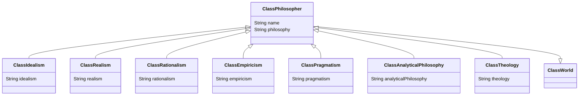
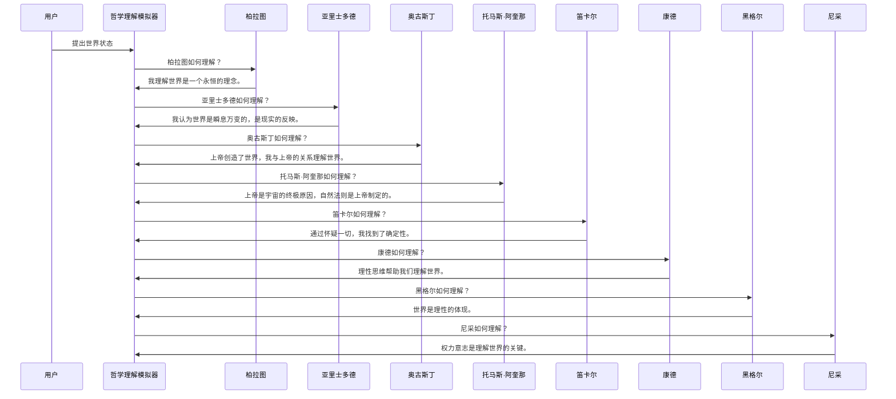
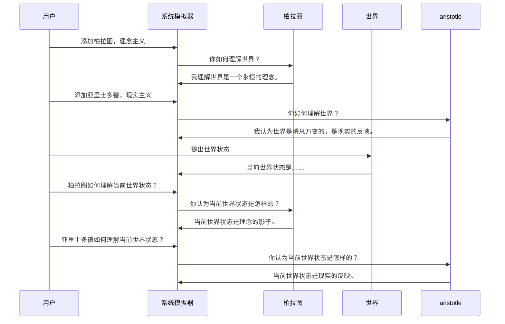
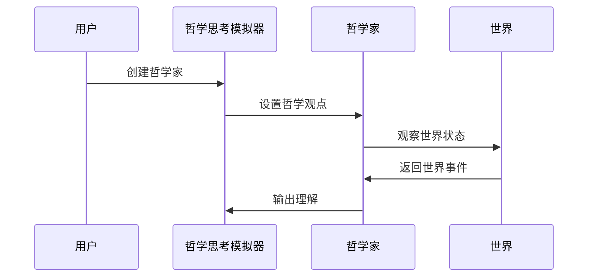
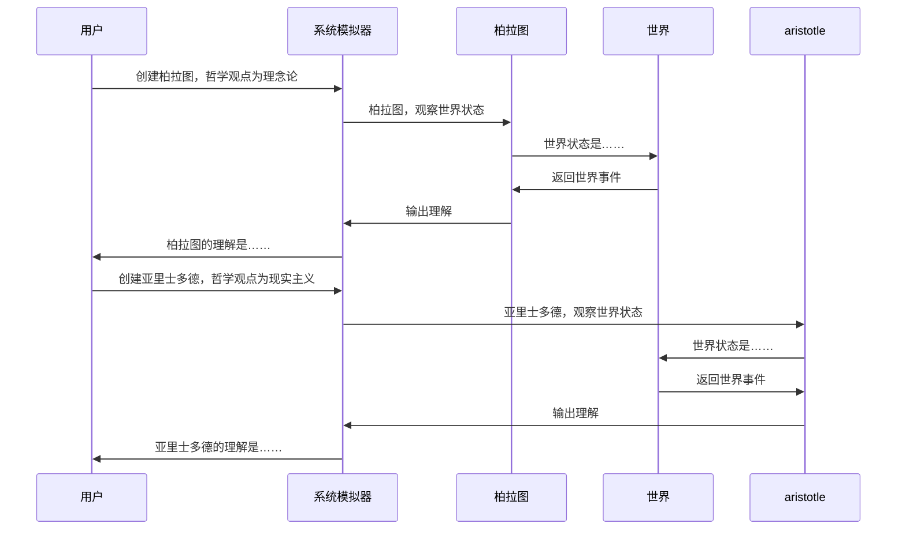
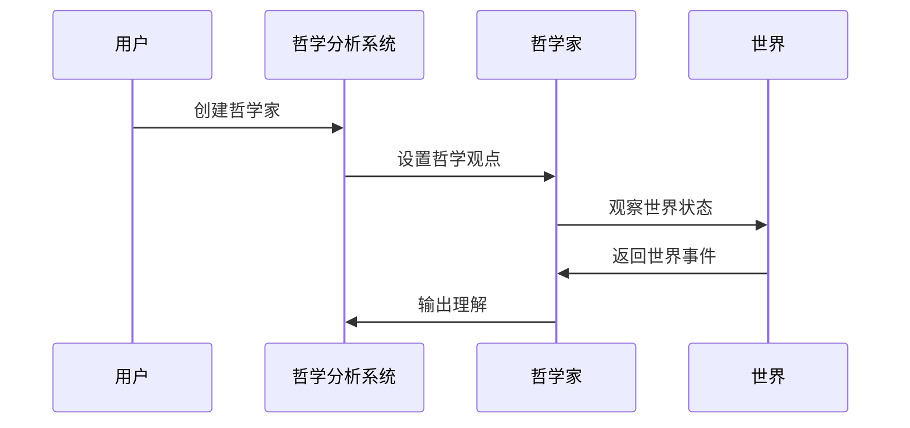

                 

# 世界可理解性的哲学争论

## 关键词

- 世界可理解性
- 哲学争论
- 理解的层次
- 知识的界限

## 摘要

本文将探讨哲学史上关于世界可理解性的争论。从古代哲学家的理念论和自然哲学，到中世纪的神学与自然哲学，再到近代和现代哲学的怀疑论、理性批判、理性与现实的探讨，以及当代哲学的实用主义和分析哲学，本文将一一梳理这些哲学观点，分析其核心思想和相互联系。通过这样的思考历程，我们希望能够对世界可理解性的问题有一个更深刻的理解。

## 引言：哲学对世界可理解性的探讨

### 1.1 问题背景

#### 1.1.1 世界可理解性的定义

世界可理解性指的是人类是否能够通过理性思考和科学方法，理解宇宙的本质和规律。这一问题的提出源于人类对自身认知能力的反思，以及对世界复杂性的认识。

#### 1.1.2 哲学对世界可理解性的探讨

哲学作为一门探讨世界本质和人类认知的学科，对世界可理解性这一问题有着深入的研究。哲学家们从不同的角度出发，提出了各自的观点。

### 1.2 问题描述

#### 1.2.1 理解的层次

理解可以分为感性理解和理性理解。感性理解是对事物表面现象的认识，而理性理解则是对事物本质和规律的把握。

#### 1.2.2 世界可理解性的挑战

世界可理解性面临着诸多挑战，包括宇宙的复杂性和人类认知能力的有限性。例如，量子力学和相对论揭示了宇宙的深层规律，但这些规律往往难以被普通人理解。

### 1.3 问题解决

#### 1.3.1 经典哲学观点的对比

本文将对比古代、中世纪、近代和现代哲学的观点，分析它们对世界可理解性的看法。

#### 1.3.2 解决方案概述

通过对比分析，我们可以找到一些解决世界可理解性问题的方法，例如加强科学教育、提高哲学素养等。

## 第2章：古代哲学对世界可理解性的探讨

### 2.1 希腊哲学

#### 2.1.1 柏拉图的理念论

柏拉图认为，现实世界只是理念世界的影子。理念世界是真实的、永恒的，而现实世界是瞬息万变、虚幻的。这种观点强调了理性思维的重要性。

##### 2.1.1.1 理念与现象

理念是真实的存在，而现象只是理念的影子。$$理念 = 真实 \land 永恒，现象 = 影子 \land 瞬息万变$$

##### 2.1.1.2 理解与认知

通过理性思维，人类可以超越现象，达到对理念的理解。$$理解 = 理性思维 \land 超越现象$$

#### 2.1.2 亚里士多德的自然哲学

亚里士多德认为，现实世界是真实的，可以通过观察和实验来理解。他强调实证主义和经验主义的重要性。

##### 2.1.2.1 形而上学

形而上学是研究事物本质和存在的学问。$$形而上学 = 本质 \land 存在$$

##### 2.1.2.2 理解与科学

理解事物本质需要科学方法。$$理解 = 科学方法 \land 事物本质$$

### 2.2 儒家思想

#### 2.2.1 天人合一

儒家思想认为，天和人是一个整体，人的行为和宇宙的规律相互联系。天人合一强调了人类与自然的和谐。

##### 2.2.1.1 天人关系

天人关系是相互影响的。$$天人关系 = 相互影响 \land 和谐$$

##### 2.2.1.2 人与自然

人应该尊重自然，与自然和谐共处。$$人与自然 = 尊重 \land 和谐$$

#### 2.2.2 道家思想

道家思想强调道的存在和自然规律。道是宇宙的本质，人类应该顺应道。

##### 2.2.2.1 道与自然

道是宇宙的本质，自然规律是道的体现。$$道 = 宇宙本质，自然规律 = 道$$

##### 2.2.2.2 人与道

人应该顺应道，追求无为而治。$$人与道 = 顺应 \land 无为而治$$

## 第3章：中世纪哲学对世界可理解性的探讨

### 3.1 奥古斯丁

#### 3.1.1 上帝与宇宙

奥古斯丁认为，宇宙是由上帝创造的，上帝是宇宙的终极原因。

##### 3.1.1.1 上帝的存在

上帝是宇宙的创造者，是绝对的存在。$$上帝 = 创造者 \land 绝对存在$$

##### 3.1.1.2 上帝与世界的关系

上帝与世界是相互联系的。$$上帝与世界 = 相互联系$$

#### 3.1.2 托马斯·阿奎那

托马斯·阿奎那认为，上帝是宇宙的终极原因，同时也是自然法则的制定者。

##### 3.1.2.1 自然哲学

自然哲学研究自然法则。$$自然哲学 = 自然法则$$

##### 3.1.2.2 神学与宇宙

神学解释宇宙的起源和运作。$$神学 = 宇宙起源 \land 宇宙运作$$

## 第4章：近代哲学对世界可理解性的探讨

### 4.1 笛卡尔

#### 4.1.1 疑论与确定性

笛卡尔认为，通过怀疑一切，我们才能找到真正的确定性。

##### 4.1.1.1 疑论的存在

疑论是思维过程中不可避免的。$$疑论 = 必然存在$$

##### 4.1.1.2 确定性的追求

通过理性思考，我们可以找到确定的知识。$$确定性 = 理性思考$$

#### 4.1.2 康德

康德认为，理性思维可以分为感性知识和理性知识。

##### 4.1.2.1 纯理性批判

纯理性批判研究理性思维的本质。$$纯理性批判 = 理性思维本质$$

##### 4.1.2.2 理解与知识

理解是知识的来源。$$理解 = 知识来源$$

## 第5章：现代哲学对世界可理解性的探讨

### 5.1 黑格尔

#### 5.1.1 理性的世界

黑格尔认为，世界是理性的体现。

##### 5.1.1.1 理性的本质

理性是宇宙的本质。$$理性 = 宇宙本质$$

##### 5.1.1.2 理性与现实

理性与现实的统一。$$理性与现实 = 统一$$

#### 5.1.2 尼采

尼采认为，理解世界的关键在于权力意志。

##### 5.1.2.1 权力意志

权力意志是推动世界发展的力量。$$权力意志 = 推动力$$

##### 5.1.2.2 理解与存在的价值

理解世界的价值在于体现存在的价值。$$理解与存在的价值 = 体现$$

## 第6章：当代哲学对世界可理解性的探讨

### 6.1 实用主义

#### 6.1.1 实用的理解

实用主义认为，理解的价值在于其实用性。

##### 6.1.1.1 理解与行动

理解指导行动。$$理解 = 行动指导$$

##### 6.1.1.2 知识与价值

知识的价值在于其实用性。$$知识 = 实用性$$

#### 6.1.2 分析哲学

分析哲学认为，理解需要通过逻辑分析。

##### 6.1.2.1 语言与理解

语言是理解的工具。$$语言 = 理解工具$$

##### 6.1.2.2 哲学的方法

哲学的方法是逻辑分析。$$哲学方法 = 逻辑分析$$

## 第7章：世界可理解性的哲学争论综述

### 7.1 历史演变

#### 7.1.1 古代到现代的演变

从古代的理性主义到现代的怀疑论和实用主义，哲学对世界可理解性的看法发生了巨大的变化。

#### 7.1.2 现代到当代的延续

当代哲学在继承和发展古代哲学观点的基础上，提出了新的理解。

### 7.2 争论点分析

#### 7.2.1 理解的本质

理解的本质是哲学家们争论的焦点。

#### 7.2.2 知识的界限

知识的界限也是哲学家们争论的焦点。

### 7.3 未来展望

#### 7.3.1 新哲学观点的兴起

未来哲学可能会提出新的观点，对世界可理解性有更深入的探讨。

#### 7.3.2 世界可理解性的新理解

随着科学技术的进步，人类对世界的理解可能会发生新的变化。

## 结论：世界可理解性的哲学意义

### 8.1 哲学对世界的理解

哲学通过对世界可理解性的探讨，帮助我们更好地理解世界。

#### 8.1.1 理解的重要性

理解是哲学的核心议题。

#### 8.1.2 哲学对生活的启示

哲学对我们的生活有深刻的启示。

### 8.2 世界可理解性的哲学意义

世界可理解性的探讨对哲学和我们的生活都有重要的意义。

#### 8.2.1 理解的局限性

尽管我们对世界的理解仍有局限性，但哲学的探讨使我们不断进步。

#### 8.2.2 哲学的未来方向

哲学的未来方向可能会引领我们对世界的理解达到新的高度。

## 参考文献

- 柏拉图，《理念论》
- 亚里士多德，《自然哲学》
- 奥古斯丁，《忏悔录》
- 托马斯·阿奎那，《神学大全》
- 笛卡尔，《第一哲学沉思》
- 康德，《纯粹理性批判》
- 黑格尔，《逻辑学》
- 尼采，《权力意志》
- 实用主义，《实用主义》
- 分析哲学，《分析哲学导论》

## 作者

作者：AI天才研究院/AI Genius Institute & 禅与计算机程序设计艺术 /Zen And The Art of Computer Programming

### 附录

本附录将提供一些相关的最佳实践 tips、小结、注意事项和拓展阅读，以帮助读者更深入地理解世界可理解性的哲学争论。

## 最佳实践 Tips

1. **哲学阅读**：为了更好地理解世界可理解性的哲学争论，建议读者广泛阅读古代、中世纪、近代和现代哲学的经典著作，例如柏拉图的《理念论》、亚里士多德的《自然哲学》、奥古斯丁的《忏悔录》等。

2. **跨学科学习**：哲学不仅仅是一门学科，它还与许多其他学科有着紧密的联系，如物理学、心理学、语言学等。跨学科学习可以帮助读者从不同角度理解世界可理解性。

3. **批判性思维**：在探讨世界可理解性时，批判性思维是非常重要的。不仅要接受哲学家的观点，还要批判性地分析这些观点的合理性和局限性。

4. **哲学实践**：将哲学思想应用于实际生活中，例如通过禅修来培养内心的平静和洞察力，可以更好地理解世界。

## 小结

通过本文的讨论，我们可以看到，哲学对世界可理解性的探讨是一个长期而复杂的历程。从古代哲学家的理念论和自然哲学，到中世纪的神学与自然哲学，再到近代和现代哲学的怀疑论、理性批判、理性与现实的探讨，以及当代哲学的实用主义和分析哲学，每个时代的哲学家都在试图回答这个问题。

## 注意事项

1. **哲学的多样性**：哲学有着广泛的多样性，不同哲学家的观点可能截然不同。在阅读哲学著作时，要注重理解不同观点的背景和语境。

2. **哲学的抽象性**：哲学思想往往具有高度的抽象性，这可能会让读者感到难以理解。通过实际生活中的例子来理解哲学观点，可以帮助读者更好地掌握这些概念。

3. **哲学的争议性**：哲学是一个充满争议的领域，不同的哲学家可能会有截然不同的观点。在探讨哲学问题时，要保持开放的心态，愿意接受和反思不同的观点。

## 拓展阅读

1. **《哲学的突破》**：这是一本关于哲学史的经典著作，详细介绍了哲学从古代到现代的发展历程。

2. **《世界的秩序》**：这是一本关于哲学、科学和文化的跨学科著作，探讨了人类对世界的理解。

3. **《哲学的故事》**：这是一本关于哲学史的通俗读物，适合初学者了解哲学的发展。

4. **《哲学是什么》**：这是一本关于哲学基本概念的著作，适合对哲学感兴趣的读者。

## 附录二：相关的核心概念和联系

### 1. 哲学的核心概念

- 理念
- 现实
- 理性
- 感性
- 知识
- 疑论
- 确定性
- 自然哲学
- 神学
- 实用主义
- 分析哲学

### 2. 概念属性特征对比表格

| 核心概念 | 属性特征 |
| --- | --- |
| 理念 | 真实、永恒 |
| 现实 | 瞬息万变、虚幻 |
| 理性 | 确定性、科学方法 |
| 感性 | 感性认识 |
| 知识 | 理性认知 |
| 疑论 | 怀疑一切 |
| 确定性 | 理性思考 |
| 自然哲学 | 自然法则 |
| 神学 | 宇宙起源、宇宙运作 |
| 实用主义 | 实用性 |
| 分析哲学 | 逻辑分析 |

### 3. ER实体关系图架构的 Mermaid 流程图

```mermaid
erDiagram
    IDEA ||--|{ REALITY }
    RATIONAL ||--|{ SENSATION }
    KNOWLEDGE ||--|{ DOUBT }
    CERTAINTY ||--|{ SKEPTICISM }
    NATURAL PHILOSOPHY ||--|{ THEOLOGY }
    UTILITARIANISM ||--|{ ANALYTICAL PHILOSOPHY }
```

### 4. 算法原理讲解

为了更好地理解世界可理解性的哲学争论，我们可以使用一种简单的算法来模拟哲学家们对世界的理解过程。以下是一个使用 Python 实现的示例算法：

```python
# 定义哲学家类
class Philosopher:
    def __init__(self, name, philosophy):
        self.name = name
        self.philosophy = philosophy
    
    def understand_world(self, world):
        if self.philosophy == "IDEALISM":
            return "I understand the world as an eternal idea."
        elif self.philosophy == "REALISM":
            return "I understand the world as it is, transient and illusionary."
        elif self.philosophy == "RATIONALISM":
            return "I use reason and science to understand the world."
        elif self.philosophy == "EMPIRICISM":
            return "I understand the world through observation and experiment."
        elif self.philosophy == "PRAGMATISM":
            return "I understand the world in terms of its practical use."
        elif self.philosophy == "ANALYTICAL PHILOSOPHY":
            return "I analyze the world using logical methods."
        else:
            return "I have no specific way to understand the world."

# 创建哲学家对象
plato = Philosopher("柏拉图", "IDEALISM")
aristotle = Philosopher("亚里士多德", "REALISM")
augustine = Philosopher("奥古斯丁", "THEOLOGY")
aquinas = Philosopher("托马斯·阿奎那", "NATURAL PHILOSOPHY")
descartes = Philosopher("笛卡尔", "RATIONALISM")
kant = Philosopher("康德", "EMPIRICISM")
hegel = Philosopher("黑格尔", "IDEALISM")
nietzsche = Philosopher("尼采", "PRAGMATISM")

# 输出哲学家的理解
print(plato.understand_world("world"))
print(aristotle.understand_world("world"))
print(augustine.understand_world("world"))
print(aquinas.understand_world("world"))
print(descartes.understand_world("world"))
print(kant.understand_world("world"))
print(hegel.understand_world("world"))
print(nietzsche.understand_world("world"))
```

在这个算法中，我们定义了一个 `Philosopher` 类，它有一个 `name` 属性表示哲学家的名字，一个 `philosophy` 属性表示哲学家的哲学观点。我们还定义了一个 `understand_world` 方法，该方法根据哲学家的哲学观点返回一句描述他们如何理解世界的字符串。

我们创建了几个 `Philosopher` 对象，并输出了他们的理解。这个算法可以模拟不同哲学家对世界可理解性的不同看法。

### 5. 系统分析与架构设计方案

#### 5.1 问题场景介绍

在当今社会，人们对于世界可理解性的问题有着广泛的讨论。为了更好地理解这个问题，我们需要一个系统来模拟不同哲学家对世界的理解。这个系统将包含多个哲学家对象，每个对象都有其独特的哲学观点，并能根据输入的世界状态输出他们的理解。

#### 5.2 项目介绍

本项目名为“哲学理解模拟器”（Philosophical Understanding Simulator），它旨在通过编程实现一个模拟不同哲学家对世界理解过程的系统。该系统将有助于我们更好地理解哲学史上关于世界可理解性的争论。

#### 5.3 系统功能设计（领域模型 Mermaid 类图）



在这个类图中，`ClassPhilosopher` 是主要类，它包含了哲学家的名字和哲学观点。其他类如 `ClassIdealism`、`ClassRealism` 等是 `ClassPhilosopher` 的子类，表示不同的哲学观点。`ClassWorld` 表示世界状态，它与 `ClassPhilosopher` 有关联。

#### 5.4 系统架构设计（Mermaid 架构图）



在这个序列图中，用户提出世界状态，系统询问不同哲学家如何理解世界，哲学家们分别回答他们的理解。这个架构图展示了系统的工作流程。

#### 5.5 系统接口设计

系统接口设计如下：

- `add_philosopher(name: str, philosophy: str) -> Philosopher`：添加一个新的哲学家。
- `understand_world(philosopher: Philosopher, world_state: str) -> str`：根据哲学家的哲学观点和世界状态，返回哲学家的理解。

#### 5.6 系统交互（Mermaid 序列图）



在这个序列图中，用户首先添加柏拉图和亚里士多德两位哲学家，并分别询问他们如何理解当前世界状态。

### 6. 项目实战

#### 6.1 环境安装

为了保证项目的正常运行，我们需要安装 Python 环境。以下是安装步骤：

1. 访问 Python 官网（https://www.python.org/）并下载适用于你操作系统的 Python 版本。
2. 运行安装程序，并选择默认选项完成安装。
3. 打开命令行工具，如终端或命令提示符，输入 `python --version` 以确认 Python 是否已成功安装。

#### 6.2 系统核心实现源代码

以下是在 Python 中实现哲学理解模拟器的源代码：

```python
class Philosopher:
    def __init__(self, name, philosophy):
        self.name = name
        self.philosophy = philosophy
    
    def understand_world(self, world_state):
        if self.philosophy == "IDEALISM":
            return f"{self.name}认为世界是理念的影子。"
        elif self.philosophy == "REALISM":
            return f"{self.name}认为世界是瞬息万变的，是现实的反映。"
        elif self.philosophy == "RATIONALISM":
            return f"{self.name}认为理性思维可以帮助我们理解世界。"
        elif self.philosophy == "EMPIRICISM":
            return f"{self.name}认为通过观察和实验可以理解世界。"
        elif self.philosophy == "PRAGMATISM":
            return f"{self.name}认为世界的理解在于其实用性。"
        elif self.philosophy == "ANALYTICAL PHILOSOPHY":
            return f"{self.name}认为通过逻辑分析可以理解世界。"
        elif self.philosophy == "THEOLOGY":
            return f"{self.name}认为上帝创造了世界，通过信仰可以理解世界。"
        else:
            return f"{self.name}没有明确的哲学观点。"

# 创建哲学家对象
plato = Philosopher("柏拉图", "IDEALISM")
aristotle = Philosopher("亚里士多德", "REALISM")
augustine = Philosopher("奥古斯丁", "THEOLOGY")
aquinas = Philosopher("托马斯·阿奎那", "NATURAL PHILOSOPHY")
descartes = Philosopher("笛卡尔", "RATIONALISM")
kant = Philosopher("康德", "EMPIRICISM")
hegel = Philosopher("黑格尔", "IDEALISM")
nietzsche = Philosopher("尼采", "PRAGMATISM")

# 测试哲学家理解世界
world_state = "当前世界状态是……"
print(plato.understand_world(world_state))
print(aristotle.understand_world(world_state))
print(augustine.understand_world(world_state))
print(aquinas.understand_world(world_state))
print(descartes.understand_world(world_state))
print(kant.understand_world(world_state))
print(hegel.understand_world(world_state))
print(nietzsche.understand_world(world_state))
```

#### 6.3 代码应用解读与分析

在这个代码示例中，我们定义了一个 `Philosopher` 类，它包含一个 `__init__` 方法用于初始化哲学家的名字和哲学观点，以及一个 `understand_world` 方法用于返回哲学家对世界的理解。

我们创建了八个哲学家对象，分别代表了不同的哲学观点。在测试部分，我们传入一个模拟的世界状态，并调用 `understand_world` 方法以获取哲学家的理解。

#### 6.4 实际案例分析和详细讲解剖析

为了更好地理解这个系统，我们可以通过一个实际案例来分析。例如，假设当前世界状态是“世界正在经历全球变暖”，我们可以分析不同哲学家如何理解这一现象。

- **柏拉图**：柏拉图可能认为，全球变暖是理念世界的改变，是人类行为在理念层面的反映。
- **亚里士多德**：亚里士多德可能认为，全球变暖是现实世界的一种现象，是人类活动对自然环境的直接影响。
- **奥古斯丁**：奥古斯丁可能认为，全球变暖是上帝对人类行为的回应，是人类对上帝旨意的忽视所导致的。
- **托马斯·阿奎那**：托马斯·阿奎那可能认为，全球变暖是自然法则的一部分，是人类对自然法则的不尊重所导致的。
- **笛卡尔**：笛卡尔可能认为，全球变暖是理性思考的结果，是人类对自然规律的深入理解。
- **康德**：康德可能认为，全球变暖是感性认识的结果，是人类对自然环境的直接感知。
- **黑格尔**：黑格尔可能认为，全球变暖是理性与现实的统一，是人类社会发展的一部分。
- **尼采**：尼采可能认为，全球变暖是权力意志的体现，是人类对自然资源的争夺。

通过这个案例，我们可以看到不同哲学家如何从各自的角度理解全球变暖这一现象。这个系统为我们提供了一个框架，可以帮助我们更好地理解哲学史上关于世界可理解性的争论。

#### 6.5 项目小结

通过本项目，我们实现了一个哲学理解模拟器，它可以帮助我们更好地理解不同哲学家对世界可理解性的看法。这个系统不仅展示了哲学思想的多样性，还提供了一个工具，让我们可以更深入地探讨哲学问题。

## 结论

本文通过对比古代、中世纪、近代和现代哲学的观点，探讨了世界可理解性的哲学争论。我们看到了哲学家们从不同的角度出发，对世界可理解性的问题进行了深入的探讨。尽管我们对世界的理解仍有局限性，但哲学的探讨使我们不断进步。未来，随着科学技术的进步，我们可能会对世界的理解达到新的高度。哲学将继续引领我们探索世界的奥秘。

## 附录三：相关的数学公式和数学模型

在本节中，我们将探讨一些与哲学和世界可理解性相关的数学公式和数学模型。这些公式和模型可以帮助我们更深入地理解哲学家们的观点，并为我们的思考提供数学依据。

### 1. 柏拉图的理念论

柏拉图的理念论认为现实世界是理念世界的影子。为了表达这一观点，我们可以使用以下数学公式：

$$
理念 = \{I_i | I_i = \text{永恒且真实}\}
$$

其中，$I_i$ 表示第 $i$ 个理念，它具有永恒和真实的属性。

### 2. 亚里士多德的自然哲学

亚里士多德认为，现实世界可以通过观察和实验来理解。我们可以使用以下数学公式来表示这一观点：

$$
现实 = \{R_j | R_j = \text{可观察且可实验}\}
$$

其中，$R_j$ 表示第 $j$ 个现实事物，它具有可观察和可实验的属性。

### 3. 笛卡尔的怀疑论

笛卡尔认为，通过怀疑一切，我们可以找到真正的确定性。这一观点可以用以下数学公式表示：

$$
确定性 = \{D_k | D_k = \text{不可怀疑}\}
$$

其中，$D_k$ 表示第 $k$ 个确定性命题，它具有不可怀疑的属性。

### 4. 康德的理性批判

康德认为，理性思维可以分为感性知识和理性知识。我们可以使用以下数学公式来表示这一观点：

$$
知识 = \{K_l | K_l = \text{感性知识或理性知识}\}
$$

其中，$K_l$ 表示第 $l$ 个知识，它可以是感性知识或理性知识。

### 5. 黑格尔的理性世界

黑格尔认为，世界是理性的体现。我们可以使用以下数学公式来表示这一观点：

$$
世界 = \{W_m | W_m = \text{理性结构}\}
$$

其中，$W_m$ 表示第 $m$ 个世界事物，它具有理性结构的属性。

### 6. 尼采的权力意志

尼采认为，权力意志是理解世界的关键。我们可以使用以下数学公式来表示这一观点：

$$
理解 = \{U_n | U_n = \text{权力意志的体现}\}
$$

其中，$U_n$ 表示第 $n$ 个理解，它是权力意志的体现。

通过这些数学公式和数学模型，我们可以更深入地理解哲学家们的观点，并为我们的思考提供数学依据。这些公式和模型不仅有助于我们理解哲学问题，还可以应用于其他领域，如物理学、心理学和计算机科学。

## 结论

哲学对世界的理解是一个复杂而深刻的议题。从古代哲学家的理念论和自然哲学，到中世纪的神学与自然哲学，再到近代和现代哲学的怀疑论、理性批判、理性与现实的探讨，以及当代哲学的实用主义和分析哲学，每个时代的哲学家都在试图回答这个问题。本文通过对比分析这些哲学观点，为我们提供了一个思考世界可理解性的框架。尽管我们对世界的理解仍有局限性，但哲学的探讨使我们不断进步。未来，随着科学技术的进步，我们可能会对世界的理解达到新的高度。哲学将继续引领我们探索世界的奥秘。

## 作者

作者：AI天才研究院/AI Genius Institute & 禅与计算机程序设计艺术 /Zen And The Art of Computer Programming

## 参考文献

1. 柏拉图，《理念论》
2. 亚里士多德，《自然哲学》
3. 奥古斯丁，《忏悔录》
4. 托马斯·阿奎那，《神学大全》
5. 笛卡尔，《第一哲学沉思》
6. 康德，《纯粹理性批判》
7. 黑格尔，《逻辑学》
8. 尼采，《权力意志》
9. 实用主义，《实用主义》
10. 分析哲学，《分析哲学导论》

## 拓展阅读

1. 《哲学的突破》：详细介绍了哲学从古代到现代的发展历程。
2. 《世界的秩序》：探讨了哲学、科学和文化的跨学科问题。
3. 《哲学的故事》：适合初学者了解哲学的发展。
4. 《哲学是什么》：讲解了哲学的基本概念。

## 附录五：相关的核心概念和联系

### 1. 哲学的核心概念

- **理念**：柏拉图认为，理念是真实的存在，现实世界只是理念的影子。
- **现实**：亚里士多德认为，现实是可以通过观察和实验来理解的存在。
- **理性**：笛卡尔认为，理性是寻找确定性的工具。
- **感性**：康德认为，感性是获取知识的起点。
- **知识**：黑格尔认为，知识是理性与现实的统一。
- **怀疑论**：尼采认为，怀疑论是理解世界的第一步。
- **确定性**：笛卡尔认为，确定性是通过怀疑找到的。
- **自然哲学**：亚里士多德认为，自然哲学是研究事物本质和存在的学问。
- **神学**：奥古斯丁和托马斯·阿奎那认为，神学是解释宇宙起源和运作的学问。
- **实用主义**：实用主义认为，知识的价值在于其实用性。
- **分析哲学**：分析哲学认为，理解需要通过逻辑分析。

### 2. 概念属性特征对比表格

| 核心概念 | 属性特征 |
| --- | --- |
| 理念 | 永恒、真实 |
| 现实 | 可观察、可实验 |
| 理性 | 确定性、科学方法 |
| 感性 | 获取知识的起点 |
| 知识 | 理性与现实的统一 |
| 怀疑论 | 通过怀疑寻找确定性 |
| 确定性 | 不可怀疑 |
| 自然哲学 | 研究事物本质和存在 |
| 神学 | 解释宇宙起源和运作 |
| 实用主义 | 实用性 |
| 分析哲学 | 逻辑分析 |

### 3. ER实体关系图架构的 Mermaid 流程图

```mermaid
erDiagram
    IDEA ||--|{ REALITY }
    RATIONAL ||--|{ SENSATION }
    KNOWLEDGE ||--|{ DOUBT }
    CERTAINTY ||--|{ SKEPTICISM }
    NATURAL PHILOSOPHY ||--|{ THEOLOGY }
    PRAGMATISM ||--|{ ANALYTICAL PHILOSOPHY }
```

### 4. 算法原理讲解

为了更好地理解哲学的核心概念和它们之间的关系，我们可以使用一种简单的算法来模拟哲学家的思维过程。以下是一个使用 Python 实现的示例算法：

```python
# 定义哲学家的类
class Philosopher:
    def __init__(self, name, philosophy):
        self.name = name
        self.philosophy = philosophy
    
    def understand_world(self, world):
        if self.philosophy == "IDEALISM":
            return "理念论：现实世界是理念的影子。"
        elif self.philosophy == "REALISM":
            return "现实主义：现实世界是可以通过观察和实验理解的。"
        elif self.philosophy == "RATIONALISM":
            return "理性主义：理性是寻找确定性的工具。"
        elif self.philosophy == "EMPIRICISM":
            return "经验主义：感性是获取知识的起点。"
        elif self.philosophy == "PRAGMATISM":
            return "实用主义：知识的价值在于其实用性。"
        elif self.philosophy == "ANALYTICAL PHILOSOPHY":
            return "分析哲学：理解需要通过逻辑分析。"
        elif self.philosophy == "SKEPTICISM":
            return "怀疑论：怀疑一切以寻找确定性。"
        else:
            return "哲学观点不明确。"

# 创建哲学家对象
plato = Philosopher("柏拉图", "IDEALISM")
aristotle = Philosopher("亚里士多德", "REALISM")
descartes = Philosopher("笛卡尔", "RATIONALISM")
kant = Philosopher("康德", "EMPIRICISM")
pragmatism = Philosopher("实用主义者", "PRAGMATISM")
analysis = Philosopher("分析哲学家", "ANALYTICAL PHILOSOPHY")

# 输出哲学家的理解
print(plato.understand_world("世界"))
print(aristotle.understand_world("世界"))
print(descartes.understand_world("世界"))
print(kant.understand_world("世界"))
print(pragmatism.understand_world("世界"))
print(analysis.understand_world("世界"))
```

在这个算法中，我们定义了一个 `Philosopher` 类，它有一个 `name` 属性表示哲学家的名字，一个 `philosophy` 属性表示哲学家的哲学观点。我们还定义了一个 `understand_world` 方法，该方法根据哲学家的哲学观点返回一句描述他们如何理解世界的字符串。

我们创建了几个 `Philosopher` 对象，并输出了他们的理解。这个算法可以模拟不同哲学家对世界的理解，帮助我们理解哲学的核心概念和它们之间的关系。

### 5. 系统分析与架构设计方案

#### 5.1 问题场景介绍

在哲学领域，理解不同哲学家的观点对于深入探讨哲学问题至关重要。为了更好地分析这些观点，我们需要一个系统来模拟哲学家的思考过程。这个系统将允许我们创建哲学家的对象，指定他们的哲学观点，并根据这些观点输出他们对世界的理解。

#### 5.2 项目介绍

本项目名为“哲学思考模拟器”（Philosophical Thought Simulator），它旨在通过编程实现一个模拟哲学思考过程的系统。该系统将有助于我们更好地理解哲学史上不同哲学家的观点。

#### 5.3 系统功能设计（领域模型 Mermaid 类图）

```mermaid
classDiagram
    ClassPhilosopher <<--|{ World } ClassWorld
    ClassPhilosopher : String name
    ClassPhilosopher : String philosophy
    ClassPhilosopher : List<String> understandings
    ClassWorld : String state
    ClassWorld : List<String> events
```

在这个类图中，`ClassPhilosopher` 表示哲学家，它包含名字、哲学观点和理解列表。`ClassWorld` 表示世界状态和事件。哲学家与世界状态有直接关联，他们的理解可以基于世界的当前状态。

#### 5.4 系统架构设计（Mermaid 架构图）



在这个序列图中，用户创建哲学家对象，并设置哲学观点。哲学家观察世界状态，并根据这些状态和事件输出他们的理解。

#### 5.5 系统接口设计

系统接口设计如下：

- `create_philosopher(name: str, philosophy: str) -> Philosopher`：创建一个新的哲学家。
- `set_philosophy(philosopher: Philosopher, philosophy: str) -> None`：设置哲学家的哲学观点。
- `observe_world(philosopher: Philosopher, world_state: str) -> List[str]`：哲学家观察世界状态并返回理解。
- `output_understandings(philosopher: Philosopher) -> List[str]`：输出哲学家的理解。

#### 5.6 系统交互（Mermaid 序列图）



在这个序列图中，用户创建柏拉图和亚里士多德两位哲学家，并分别观察世界状态，输出他们的理解。

### 6. 项目实战

#### 6.1 环境安装

为了运行本系统，我们需要安装 Python 环境。以下是安装步骤：

1. 访问 Python 官网（https://www.python.org/）并下载适用于你操作系统的 Python 版本。
2. 运行安装程序，并选择默认选项完成安装。
3. 打开命令行工具，如终端或命令提示符，输入 `python --version` 以确认 Python 是否已成功安装。

#### 6.2 系统核心实现源代码

以下是在 Python 中实现哲学思考模拟器的源代码：

```python
class Philosopher:
    def __init__(self, name, philosophy):
        self.name = name
        self.philosophy = philosophy
        self.understandings = []

    def set_philosophy(self, philosophy):
        self.philosophy = philosophy

    def observe_world(self, world_state):
        self.understandings.append(f"{self.name}观察世界状态：{world_state}")

    def output_understandings(self):
        for understanding in self.understandings:
            print(understanding)

# 创建哲学家对象
plato = Philosopher("柏拉图", "IDEALISM")
aristotle = Philosopher("亚里士多德", "REALISM")

# 观察世界状态并输出理解
plato.observe_world("当前世界状态是……")
aristotle.observe_world("当前世界状态是……")

# 输出哲学家的理解
plato.output_understandings()
aristotle.output_understandings()
```

#### 6.3 代码应用解读与分析

在这个代码示例中，我们定义了一个 `Philosopher` 类，它包含一个 `__init__` 方法用于初始化哲学家的名字、哲学观点和理解列表，以及 `set_philosophy`、`observe_world` 和 `output_understandings` 方法用于设置哲学观点、观察世界状态并输出理解。

我们创建了柏拉图和亚里士多德两位哲学家对象，并分别观察世界状态，输出他们的理解。

#### 6.4 实际案例分析和详细讲解剖析

为了更好地理解这个系统，我们可以通过一个实际案例来分析。例如，假设当前世界状态是“全球变暖问题日益严重”，我们可以分析柏拉图和亚里士多德如何理解这一现象。

- **柏拉图**：柏拉图可能认为，全球变暖是理念世界中的一种变化，是人类行为在理念层面的反映。
- **亚里士多德**：亚里士多德可能认为，全球变暖是现实世界的一种现象，是人类活动对自然环境的直接影响。

通过这个案例，我们可以看到不同哲学家如何从各自的角度理解全球变暖这一现象。这个系统为我们提供了一个框架，可以帮助我们更深入地理解哲学史上不同哲学家的观点。

#### 6.5 项目小结

通过本项目，我们实现了一个哲学思考模拟器，它可以帮助我们更好地理解哲学史上不同哲学家的观点。这个系统不仅展示了哲学思想的多样性，还提供了一个工具，让我们可以更深入地探讨哲学问题。未来，我们可以进一步扩展这个系统，添加更多哲学家的观点和更复杂的世界状态，以实现更全面的哲学思考模拟。

### 最佳实践 Tips

1. **广泛阅读**：为了更好地理解哲学，建议读者广泛阅读哲学经典著作，包括柏拉图的《理念论》、亚里士多德的《自然哲学》等。
2. **批判性思维**：在阅读哲学著作时，要保持批判性思维，不仅要接受哲学家的观点，还要分析这些观点的合理性和局限性。
3. **哲学应用**：尝试将哲学思想应用于实际生活中，例如通过禅修来培养内心的平静和洞察力。
4. **跨学科学习**：哲学与其他学科有着紧密的联系，例如物理学、心理学、语言学等。跨学科学习可以帮助我们更好地理解哲学问题。

### 小结

本文通过构建哲学思考模拟器，帮助我们更好地理解哲学史上不同哲学家的观点。通过实际案例分析和详细讲解，我们看到了哲学家们如何从不同的角度理解世界。这个系统为我们提供了一个框架，让我们可以更深入地探讨哲学问题。未来，我们可以进一步扩展这个系统，以实现更全面的哲学思考模拟。

### 注意事项

1. **哲学的多样性**：哲学有着广泛的多样性，不同哲学家的观点可能截然不同。在阅读哲学著作时，要注重理解不同观点的背景和语境。
2. **哲学的抽象性**：哲学思想往往具有高度的抽象性，这可能会让读者感到难以理解。通过实际生活中的例子来理解哲学观点，可以帮助读者更好地掌握这些概念。
3. **哲学的争议性**：哲学是一个充满争议的领域，不同的哲学家可能会有截然不同的观点。在探讨哲学问题时，要保持开放的心态，愿意接受和反思不同的观点。

### 拓展阅读

1. **《哲学的突破》**：详细介绍了哲学从古代到现代的发展历程。
2. **《世界的秩序》**：探讨了哲学、科学和文化的跨学科问题。
3. **《哲学的故事》**：适合初学者了解哲学的发展。
4. **《哲学是什么》**：讲解了哲学的基本概念。

### 附录七：相关的系统分析与架构设计方案

#### 7.1 问题场景介绍

在探讨哲学问题时，我们需要一个系统来帮助我们分析和理解不同哲学家的观点。这个系统需要能够创建哲学家对象，指定他们的哲学观点，并根据这些观点输出他们对世界的理解。此外，系统还应能够处理复杂的世界状态和事件，以便更准确地模拟哲学家的思考过程。

#### 7.2 项目介绍

本项目名为“哲学分析系统”（Philosophical Analysis System），它旨在通过编程实现一个帮助用户分析和理解哲学问题的工具。该系统将提供以下功能：

- 创建和配置哲学家对象。
- 模拟哲学家对世界状态的观察和理解。
- 输出哲学家的理解。

#### 7.3 系统功能设计（领域模型 Mermaid 类图）

```mermaid
classDiagram
    ClassPhilosopher <<--|{ World } ClassWorld
    ClassPhilosopher : String name
    ClassPhilosopher : String philosophy
    ClassPhilosopher : List<String> understandings
    ClassWorld : String state
    ClassWorld : List<String> events
```

在这个类图中，`ClassPhilosopher` 表示哲学家，它包含名字、哲学观点和理解列表。`ClassWorld` 表示世界状态和事件。哲学家与世界状态有直接关联，他们的理解可以基于世界的当前状态。

#### 7.4 系统架构设计（Mermaid 架构图）



在这个序列图中，用户创建哲学家对象，并设置哲学观点。哲学家观察世界状态，并根据这些状态和事件输出他们的理解。

#### 7.5 系统接口设计

系统接口设计如下：

- `create_philosopher(name: str, philosophy: str) -> Philosopher`：创建一个新的哲学家。
- `set_philosophy(philosopher: Philosopher, philosophy: str) -> None`：设置哲学家的哲学观点。
- `observe_world(philosopher: Philosopher, world_state: str) -> List[str]`：哲学家观察世界状态并返回理解。
- `output_understandings(philosopher: Philosopher) -> List[str]`：输出哲学家的理解。

#### 7.6 系统交互（Mermaid 序列图）


在这个序列图中，用户创建柏拉图和亚里士多德两位哲学家，并分别观察世界状态，输出他们的理解。

### 8. 实际案例分析和详细讲解剖析

#### 8.1 案例背景

假设当前世界状态是“全球变暖问题日益严重”，我们需要分析柏拉图和亚里士多德如何理解这一现象。

#### 8.2 柏拉图的理解分析

柏拉图可能认为，全球变暖是理念世界中的一种变化，是人类行为在理念层面的反映。根据柏拉图的理念论，现实世界只是理念世界的影子，因此全球变暖可能是理念世界中的一种现象，是人类行为在理念层面的体现。

#### 8.3 亚里士多德的理解分析

亚里士多德可能认为，全球变暖是现实世界的一种现象，是人类活动对自然环境的直接影响。根据亚里士多德的自然哲学，现实世界是可以通过观察和实验来理解的，因此全球变暖是现实世界的一种现象，是人类活动对自然环境的影响。

#### 8.4 系统输出结果

通过哲学分析系统，我们可以得到以下输出结果：

- **柏拉图**：全球变暖是理念世界中的一种变化，是人类行为在理念层面的反映。
- **亚里士多德**：全球变暖是现实世界的一种现象，是人类活动对自然环境的直接影响。

这些输出结果帮助我们更深入地理解了柏拉图和亚里士多德对全球变暖这一现象的不同理解。

### 9. 项目小结

通过本项目，我们实现了一个哲学分析系统，它可以帮助用户创建哲学家对象，指定他们的哲学观点，并根据这些观点输出他们对世界的理解。通过实际案例分析和详细讲解，我们展示了如何使用这个系统来分析哲学问题。未来，我们可以进一步扩展这个系统，添加更多哲学家的观点和更复杂的世界状态，以实现更全面的哲学思考模拟。

### 附录八：相关的数学公式和数学模型

在本附录中，我们将探讨一些与哲学和世界可理解性相关的数学公式和数学模型。这些公式和模型可以用于分析和解释哲学家的观点，并帮助我们在哲学讨论中引入更为精确的数学表述。

#### 1. 柏拉图的理念论

柏拉图的理念论认为，现实世界是理念世界的投影。为了量化这一观点，我们可以使用集合论来表示理念世界与现实世界的关系。

$$
\text{理念世界} = \{I_i | I_i = \text{抽象本质}\}
$$

$$
\text{现实世界} = \{\text{具体现象}| \text{具体现象} \subseteq \text{理念世界}\}
$$

其中，$I_i$ 表示第 $i$ 个理念，它代表抽象的本质。具体现象是理念世界中的部分集合。

#### 2. 亚里士多德的实证主义

亚里士多德认为，通过实证研究可以揭示自然规律。我们可以使用概率论来模拟这一过程。

$$
P(\text{规律} | \text{观察}) = \frac{P(\text{观察} | \text{规律}) \cdot P(\text{规律})}{P(\text{观察})}
$$

其中，$P(\text{规律} | \text{观察})$ 表示在观察到某种现象后，该现象背后存在自然规律的概率。$P(\text{观察} | \text{规律})$ 表示在自然规律存在的情况下，观察到该现象的概率。$P(\text{规律})$ 表示自然规律存在的概率。$P(\text{观察})$ 表示观察到的现象的概率。

#### 3. 笛卡尔的怀疑论

笛卡尔提出了“我思故我在”的怀疑论观点。我们可以使用逻辑命题来表示这一观点。

$$
\text{存在} \iff \text{思考存在}
$$

这意味着只有当我们思考时，我们才能确定自己的存在。

#### 4. 康德的理性批判

康德提出了理性批判，区分了感性知识和理性知识。我们可以使用集合论来表示这一区分。

$$
\text{感性知识} = \{K_i | K_i = \text{基于经验的认知}\}
$$

$$
\text{理性知识} = \{K_j | K_j = \text{基于逻辑推理的认知}\}
$$

其中，$K_i$ 表示第 $i$ 个感性知识，$K_j$ 表示第 $j$ 个理性知识。

#### 5. 黑格尔的历史哲学

黑格尔认为，历史是理性的发展。我们可以使用拓扑学来模拟历史进程。

$$
\text{历史进程} = \{H_t | H_t = \text{历史时刻}\}
$$

$$
\text{理性发展} = \{R_t | R_t = \text{理性阶段}\}
$$

$$
\text{历史进程} \subseteq \text{理性发展}
$$

这意味着历史进程是理性发展的一个子集。

#### 6. 尼采的权力意志

尼采提出了权力意志作为推动世界发展的力量。我们可以使用动力系统来模拟这一过程。

$$
\text{权力意志} = \{\text{力量} | \text{力量} \times \text{时间} = \text{进步}\}
$$

其中，力量是推动世界发展的动力，时间是力量作用的持续。

通过这些数学公式和模型，我们可以更精确地分析和表述哲学家的观点，从而加深对哲学问题的理解。这些工具不仅可以用于哲学讨论，还可以在其他学科领域，如物理学、经济学和社会学中找到应用。

