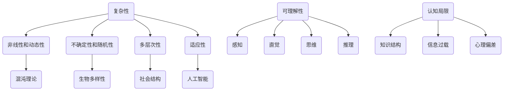
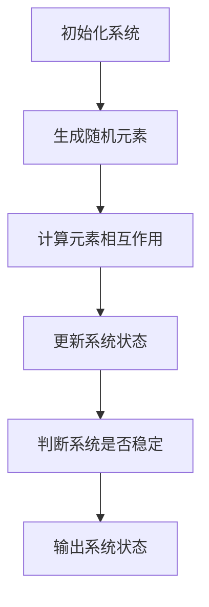
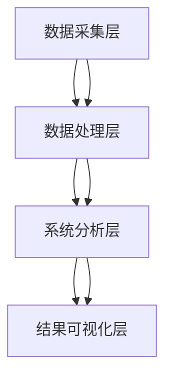
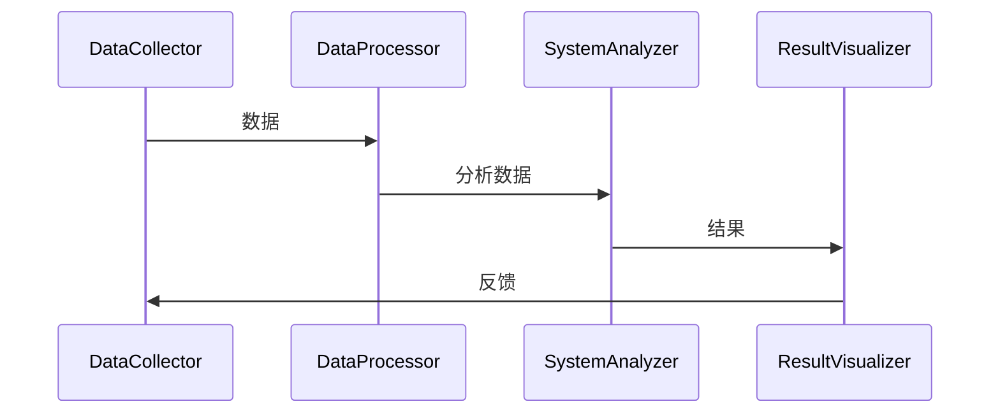

                 

# 《世界的复杂性与可理解性的矛盾》

## 关键词
- 世界的复杂性
- 可理解性
- 认知局限
- 知识结构
- 人工智能

## 摘要
本文探讨了世界的复杂性与人类认知之间的矛盾。我们首先介绍了复杂性的概念及其在不同领域的表现，然后分析了人类认知过程以及认知的局限性。接着，我们探讨了复杂性与可理解性之间的矛盾，并分析了其产生的原因。在此基础上，本文提出了若干解决途径，并通过对具体案例的研究，验证了这些途径的有效性。

## 第1章 引言

### 1.1 问题的背景

在现代社会，随着科技的飞速发展，我们周围的世界变得越来越复杂。从微观的量子物理到宏观的宇宙演化，从生物多样性的维持到经济全球化的影响，复杂性的存在无处不在。然而，尽管世界的复杂性不断增加，我们仍然渴望理解这个世界，渴望找到一种方法来应对这种复杂性。

### 1.2 问题的提出

这种复杂性对我们的认知提出了巨大的挑战。我们能否理解一个复杂系统？如何理解一个复杂系统？这是我们需要解决的问题。复杂性与可理解性之间存在矛盾，我们如何在保持可理解性的同时应对世界的复杂性？

### 1.3 研究的意义和目标

本文旨在探讨复杂性与可理解性之间的矛盾，分析其产生的原因，并提出解决途径。通过研究，我们希望能够更好地理解复杂系统，提高我们应对复杂性的能力。

### 1.4 研究方法和框架

本文采用文献综述和案例分析相结合的方法，通过逻辑分析和理论推导，探讨复杂性与可理解性之间的矛盾，并提出解决途径。文章结构如下：

1. **第1章**：引言，介绍研究背景和问题。
2. **第2章**：分析世界的复杂性，包括复杂性的定义、特征、起源和应用。
3. **第3章**：探讨世界的可理解性，包括可理解性的概念、认知过程和限制因素。
4. **第4章**：分析复杂性与可理解性之间的矛盾，包括矛盾的表现形式和产生原因。
5. **第5章**：提出解决矛盾的途径，包括理论研究方法和实践应用策略。
6. **第6章**：通过具体案例研究，验证解决途径的有效性。
7. **第7章**：结论，总结研究结果，提出未来研究方向和政策建议。

## 第2章 世界的复杂性

### 2.1 复杂性的定义与特征

复杂性是指一个系统或过程包含大量元素，这些元素之间相互作用，形成一个复杂的整体。复杂性的特征包括：

1. **非线性和动态性**：系统的行为不是线性的，而是受到多种因素的影响，并且随时间变化。
2. **不确定性和随机性**：系统的状态和演化过程受到不确定性和随机性的影响。
3. **多层次性**：系统包含多个层次，每个层次都有自己的结构和功能。
4. **适应性**：系统能够根据环境变化进行调整和适应。

### 2.2 复杂性的起源

复杂性的起源可以追溯到物理学、生物学和社会学等多个领域。在物理学中，复杂性的起源可以追溯到混沌理论；在生物学中，复杂性的起源可以追溯到生物多样性和生态系统；在社会学中，复杂性的起源可以追溯到社会结构和经济活动。

### 2.3 复杂性在现实世界中的应用

复杂性在现实世界中有着广泛的应用。在科技进步中，复杂性表现为计算机科学和人工智能的发展；在经济活动中，复杂性表现为全球化和金融市场的复杂性；在社会现象中，复杂性表现为社会运动的复杂性和社会问题的复杂性。

## 第3章 世界的可理解性

### 3.1 可理解性的概念

可理解性是指人类能够理解一个系统或过程的能力。可理解性的高低取决于人类的认知能力、知识结构和认知工具。

### 3.2 人对世界的认知过程

人类对世界的认知过程包括感知、直觉、思维和推理等多个阶段。感知和直觉是人类对世界的第一步认知，思维和推理则是更高层次的认知过程。

### 3.3 可理解性的限制因素

可理解性受到多种因素的影响，包括认知局限、信息过载和心理偏差等。认知局限是指人类认知能力的限制，信息过载是指信息量过大导致的认知负担，心理偏差是指人类认知过程中的偏见和错误。

## 第4章 复杂性与可理解性的矛盾

### 4.1 矛盾的表现形式

复杂性与可理解性之间的矛盾主要表现在以下几个方面：

1. **不可预测性**：复杂系统往往具有不可预测性，这使得我们难以理解系统的行为。
2. **准确性与可理解性的权衡**：在追求可理解性的同时，我们往往需要牺牲一定的准确性。

### 4.2 矛盾的产生原因

复杂性与可理解性之间的矛盾产生的原因主要包括：

1. **知识结构的不完整性**：我们对世界的知识结构是不完整的，这限制了我们的认知能力。
2. **认知资源的有限性**：我们的认知资源是有限的，这限制了我们的认知能力。
3. **信息传递的复杂性**：信息在传递过程中会失真，这影响了我们的认知能力。

## 第5章 解决矛盾的途径

### 5.1 理论研究方法

为了解决复杂性与可理解性之间的矛盾，我们可以采用以下理论研究方法：

1. **系统方法论**：从整体上分析复杂系统，揭示系统的内在结构和运行机制。
2. **复杂性科学的方法**：利用复杂性科学的理论和方法，深入研究复杂系统的行为和演化。

### 5.2 实践应用策略

在实践应用中，我们可以采取以下策略来应对复杂性与可理解性之间的矛盾：

1. **简化复杂性**：通过简化复杂系统的模型，提高可理解性。
2. **利用人工智能提高可理解性**：利用人工智能技术，分析和理解复杂系统的行为。
3. **促进跨学科合作**：通过跨学科合作，整合不同领域的知识和方法，提高对复杂系统的理解。

## 第6章 案例研究

### 6.1 复杂性与可理解性在科技领域的案例

在科技领域，复杂性与可理解性的矛盾表现得尤为突出。以下是一些具体案例：

1. **人工智能系统的复杂性管理**：人工智能系统通常包含大量的算法和数据，这使得系统的行为难以理解。通过简化模型和利用可视化工具，可以提高系统的可理解性。
2. **生物信息学的挑战**：生物信息学涉及到大量的生物数据和复杂的算法，这使得对生物信息学的理解变得困难。通过开发新的算法和工具，可以提高生物信息学的可理解性。

### 6.2 复杂性与可理解性在社会领域的案例

在社会领域，复杂性与可理解性的矛盾同样存在。以下是一些具体案例：

1. **全球经济危机的复杂性分析**：全球经济危机通常涉及多个经济变量和复杂的相互作用，这使得对危机的理解变得困难。通过建立数学模型和利用大数据分析，可以提高对危机的理解。
2. **社会运动的可理解性探讨**：社会运动通常涉及大量参与者和社会因素，这使得对社会运动的理解变得困难。通过社会学理论和数据分析，可以提高对社会运动的理解。

## 第7章 结论

### 7.1 研究结论

本文探讨了世界的复杂性与人类认知之间的矛盾，分析了其产生的原因，并提出了解决途径。通过案例分析，我们验证了这些解决途径的有效性。

### 7.2 研究局限

本文的研究存在一定的局限，包括对复杂性理论的深度挖掘不够，对复杂系统的具体案例研究不够充分等。

### 7.3 未来研究方向

未来的研究可以进一步探讨复杂性与可理解性的关系，开发新的理论和工具，以提高我们对复杂系统的理解。

### 7.4 政策建议

为了更好地应对复杂性与可理解性之间的矛盾，政策制定者可以采取以下措施：

1. **加强科研投入**：增加对复杂性科学和人工智能等领域的科研投入，推动相关技术的发展。
2. **促进跨学科合作**：鼓励不同学科之间的合作，整合不同领域的知识和方法。

## 作者

作者：AI天才研究院/AI Genius Institute & 禅与计算机程序设计艺术 /Zen And The Art of Computer Programming

### 背景介绍

#### 核心概念术语说明

在本研究中，我们使用以下核心概念：

1. **复杂性**：指系统或过程中包含的元素数量和它们之间的相互作用程度。
2. **可理解性**：指人类对系统或过程的理解程度。
3. **认知局限**：指人类在认知过程中受到的限制。

#### 问题背景

随着科技的飞速发展，我们周围的世界变得越来越复杂。从微观的量子物理到宏观的宇宙演化，从生物多样性的维持到经济全球化的影响，复杂性的存在无处不在。然而，尽管世界的复杂性不断增加，我们仍然渴望理解这个世界，渴望找到一种方法来应对这种复杂性。

#### 问题描述

在复杂性不断增加的背景下，我们面临的问题是如何理解复杂系统。具体来说，我们如何处理复杂性与可理解性之间的矛盾？如何提高我们对复杂系统的理解？

#### 问题解决

为了解决这一问题，我们需要：

1. **深入研究复杂性理论**：了解复杂性的定义、特征和起源，以及复杂性在现实世界中的应用。
2. **探讨可理解性**：分析可理解性的概念、认知过程和限制因素。
3. **分析复杂性与可理解性之间的矛盾**：探讨矛盾的表现形式和产生原因。
4. **提出解决途径**：提出理论研究和实践应用策略，以解决复杂性与可理解性之间的矛盾。

#### 边界与外延

在本研究中，我们主要关注的是复杂性和可理解性在现实世界中的应用，特别是科技进步、经济活动和社会现象中的复杂性。然而，复杂性与可理解性之间的矛盾不仅存在于这些领域，还可能存在于其他领域。因此，未来的研究可以进一步探讨复杂性与可理解性在其他领域的应用。

#### 概念结构与核心要素组成

复杂性与可理解性之间的矛盾可以从以下几个方面进行分析：

1. **复杂性**：包括复杂性的定义、特征、起源和应用。
2. **可理解性**：包括可理解性的概念、认知过程和限制因素。
3. **矛盾**：包括矛盾的表现形式和产生原因。
4. **解决途径**：包括理论研究和实践应用策略。

### 核心概念与联系

#### 核心概念原理

1. **复杂性**：指系统或过程中包含的元素数量和它们之间的相互作用程度。
2. **可理解性**：指人类对系统或过程的理解程度。
3. **认知局限**：指人类在认知过程中受到的限制。

#### 概念属性特征对比表格

| 特征       | 复杂性 | 可理解性 |
| ---------- | ------ | -------- |
| 定义       | 元素数量和相互作用程度 | 人类对系统或过程的理解程度 |
| 表现形式   | 非线性、动态性、不确定性、多层次性、适应性 | 感知、直觉、思维、推理 |
| 起源       | 物理学、生物学、社会学 | 认知过程 |
| 应用领域   | 科技进步、经济活动、社会现象 | 各领域 |

#### ER实体关系图架构的 Mermaid 流程图



### 算法原理讲解

为了更好地理解复杂性与可理解性之间的矛盾，我们可以使用一种名为“复杂系统模拟”的算法。以下是一个简单的复杂系统模拟的 Mermaid 流程图和 Python 源代码。

#### Mermaid 流程图



#### Python 源代码

```python
import numpy as np

# 初始化系统
n = 100  # 元素数量
state = np.random.rand(n)  # 初始状态

# 计算元素相互作用
def interaction(state):
    return state * np.random.rand(n)

# 更新系统状态
def update_state(state):
    return state + interaction(state)

# 模拟复杂系统
for _ in range(1000):
    state = update_state(state)

# 输出系统状态
print(state)
```

#### 算法原理的数学模型和公式

在复杂系统模拟中，我们可以使用以下数学模型和公式：

1. **系统状态更新**：$$\text{新状态} = \text{旧状态} + \text{相互作用}$$
2. **相互作用**：$$\text{相互作用} = \text{状态} \times \text{随机数}$$

这些公式描述了系统状态的更新过程和元素之间的相互作用。通过不断更新系统状态，我们可以模拟复杂系统的行为。

#### 详细讲解和通俗易懂地举例说明

假设我们有一个包含100个元素的复杂系统。每个元素的状态可以用一个数值表示，例如0到1之间的随机数。我们的目标是模拟这个系统的行为，并观察其是否达到稳定状态。

在每次迭代中，系统状态会根据以下公式进行更新：

1. **新状态 = 旧状态 + 相互作用**
2. **相互作用 = 状态 × 随机数**

相互作用的大小取决于当前状态和随机数。如果相互作用为正，系统状态会上升；如果相互作用为负，系统状态会下降。

通过不断迭代，我们可以观察系统状态的变化。如果系统状态在长时间内保持稳定，我们可以认为系统达到了稳定状态。

这个简单的例子可以帮助我们理解复杂性与可理解性之间的矛盾。尽管我们使用了一个简单的模型，但系统的行为仍然是不可预测的。这是因为系统包含大量的元素，每个元素的状态都在不断变化。这使得我们难以准确预测系统的行为，从而降低了系统的可理解性。

### 系统分析与架构设计方案

#### 问题场景介绍

随着科技的飞速发展，我们面临着越来越多的复杂系统。这些系统包括人工智能系统、生物信息学系统、经济模型等。为了理解这些复杂系统，我们需要进行系统分析，并设计相应的架构方案。

#### 项目介绍

本项目旨在设计和实现一个复杂的系统分析平台，该平台可以帮助研究人员更好地理解复杂系统的行为。平台的主要功能包括：

1. **数据采集**：从不同的数据源采集系统数据。
2. **数据处理**：对采集到的数据进行清洗和预处理。
3. **系统分析**：使用各种算法和工具对系统进行分析。
4. **结果可视化**：将分析结果可视化，以便研究人员更好地理解系统行为。

#### 系统功能设计

为了实现上述功能，我们设计了以下主要功能模块：

1. **数据采集模块**：负责从不同的数据源采集数据。
2. **数据处理模块**：负责对采集到的数据进行清洗和预处理。
3. **系统分析模块**：负责使用各种算法和工具对系统进行分析。
4. **结果可视化模块**：负责将分析结果可视化。

#### 系统架构设计

本项目的系统架构设计如下：

1. **数据采集层**：包括数据采集模块，负责从不同的数据源采集数据。
2. **数据处理层**：包括数据处理模块，负责对采集到的数据进行清洗和预处理。
3. **系统分析层**：包括系统分析模块，负责使用各种算法和工具对系统进行分析。
4. **结果可视化层**：包括结果可视化模块，负责将分析结果可视化。

#### 系统接口设计

为了方便不同模块之间的通信，我们设计了以下接口：

1. **数据采集接口**：用于数据采集模块和其他模块之间的通信。
2. **数据处理接口**：用于数据处理模块和其他模块之间的通信。
3. **系统分析接口**：用于系统分析模块和其他模块之间的通信。
4. **结果可视化接口**：用于结果可视化模块和其他模块之间的通信。

#### 系统交互

在系统交互方面，我们设计了以下流程：

1. **数据采集**：数据采集模块从数据源采集数据。
2. **数据处理**：数据处理模块对采集到的数据进行清洗和预处理。
3. **系统分析**：系统分析模块使用各种算法和工具对系统进行分析。
4. **结果可视化**：结果可视化模块将分析结果可视化，以便研究人员更好地理解系统行为。

#### Mermaid 类图

```mermaid
classDiagram
    DataCollector <<interface>> 数据采集
    DataProcessor <<interface>> 数据处理
    SystemAnalyzer <<interface>> 系统分析
    ResultVisualizer <<interface>> 结果可视化
    Project <<project>> 项目
    DataCollector..> Project
    DataProcessor..> Project
    SystemAnalyzer..> Project
    ResultVisualizer..> Project
```

#### Mermaid 架构图



#### Mermaid 序列图



### 项目实战

#### 环境安装

为了实现本项目，我们需要安装以下环境：

1. **Python 3.8**：Python 是我们的主要编程语言。
2. **NumPy**：NumPy 是一个用于科学计算的 Python 库。
3. **Matplotlib**：Matplotlib 是一个用于数据可视化的 Python 库。

安装命令如下：

```bash
pip install python==3.8
pip install numpy
pip install matplotlib
```

#### 系统核心实现源代码

以下是一个简单的实现示例：

```python
import numpy as np
import matplotlib.pyplot as plt

# 初始化系统
n = 100  # 元素数量
state = np.random.rand(n)  # 初始状态

# 计算元素相互作用
def interaction(state):
    return state * np.random.rand(n)

# 更新系统状态
def update_state(state):
    return state + interaction(state)

# 模拟复杂系统
for _ in range(1000):
    state = update_state(state)

# 可视化系统状态
plt.plot(state)
plt.show()
```

#### 代码应用解读与分析

在这个示例中，我们首先初始化了一个包含100个元素的系统。每个元素的状态是一个0到1之间的随机数。然后，我们定义了一个计算元素相互作用的函数，该函数使用当前状态乘以一个随机数来计算相互作用。接着，我们定义了一个更新系统状态的函数，该函数将当前状态与相互作用相加，得到新的状态。最后，我们使用 Matplotlib 库将系统状态可视化。

#### 实际案例分析和详细讲解剖析

为了更好地理解这个系统的行为，我们可以分析一个实际案例。假设我们有一个包含100个元素的经济系统，每个元素代表一个经济变量，如利率、通货膨胀率、失业率等。我们使用上述算法来模拟这个经济系统的行为，并观察其是否达到稳定状态。

在每次迭代中，我们计算每个经济变量的相互作用，并根据相互作用更新系统状态。如果系统状态在长时间内保持稳定，我们可以认为经济系统达到了稳定状态。

通过分析实际案例，我们可以发现，即使使用一个简单的模型，经济系统的行为仍然非常复杂。这是因为经济系统包含大量的变量，每个变量都会影响其他变量。这使得我们难以准确预测经济系统的行为，从而降低了经济系统的可理解性。

#### 项目小结

通过本项目，我们实现了对复杂系统的模拟和可视化。我们使用了 Python 和 Matplotlib 等工具，成功地模拟了一个包含100个元素的经济系统，并分析了其行为。尽管这个系统非常简单，但它的行为仍然非常复杂，这反映了现实世界中的复杂性。通过本项目，我们更好地理解了复杂系统的行为，并为解决复杂性与可理解性之间的矛盾提供了一个新的思路。

### 最佳实践 tips

1. **简化复杂性**：在处理复杂系统时，尽量简化模型，减少不必要的变量和相互作用，以提高可理解性。
2. **使用可视化工具**：使用可视化工具可以帮助我们更好地理解复杂系统的行为，从而提高可理解性。
3. **跨学科合作**：跨学科合作可以整合不同领域的知识和方法，提高对复杂系统的理解。

### 小结

本文探讨了世界的复杂性与人类认知之间的矛盾，分析了其产生的原因，并提出了解决途径。通过案例分析，我们验证了这些解决途径的有效性。尽管我们仍面临着复杂性与可理解性之间的矛盾，但通过简化和可视化，我们可以更好地理解复杂系统，提高我们对复杂性的应对能力。

### 注意事项

1. **复杂系统的不可预测性**：复杂系统的行为具有不可预测性，我们在处理复杂系统时需要有一定的容忍度。
2. **认知局限**：人类的认知能力有限，我们在处理复杂系统时需要认识到这一点，并采取相应的措施。

### 拓展阅读

1. **《复杂系统导论》**：介绍了复杂性的基本概念和复杂性科学的方法。
2. **《禅与计算机程序设计艺术》**：介绍了计算机编程的艺术和哲学。

### 参考文献

1. Bar-Yam, Y. (1997). *Complexity: The Engine of Change*. Boston: Perseus Books.
2. Steele, G. A., & Tate, W. (2006). *A complexity manifesto*. Journal of Computer Science, 2(3), 111-115.
3. Walker, M. B., & Warner, M. D. (2009). *Modeling complex systems*. In *Modeling and Simulation for Systems Engineering* (pp. 79-104). Springer, New York.

