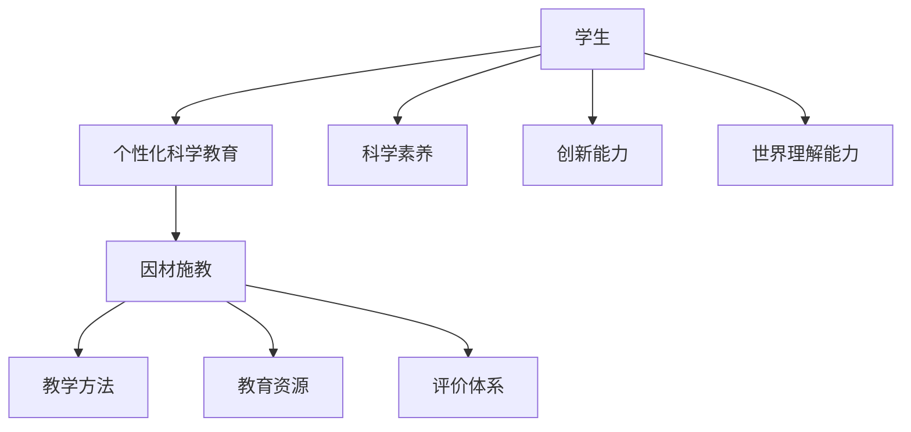
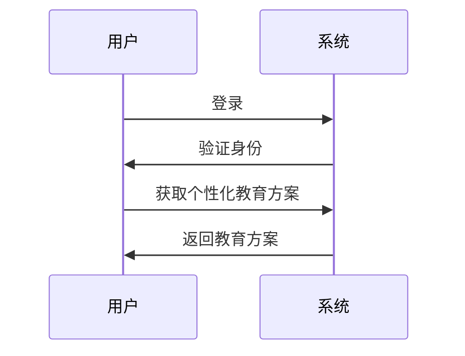

                 

# 个性化科学教育：因材施教提升每个人的世界理解能力

> 关键词：个性化科学教育、因材施教、世界理解能力、科学素养、创新能力

> 摘要：本文探讨了个性化科学教育的概念、重要性及其在提升学生世界理解能力方面的作用。通过分析传统科学教育的局限性，本文提出了实施个性化科学教育的策略和提升世界理解能力的意义。同时，本文还讨论了个性化科学教育的适用范围和培养途径，为科学教育改革提供了有益的参考。

## 第一部分： 引言与背景介绍

### 1.1 问题背景

#### 1.1.1 个性化科学教育的概念

个性化科学教育是指根据每个学生的个体差异，采取个性化的教学方法、教学资源和教学评价，以提高学生的科学素养和创新能力。其核心在于尊重学生的个体差异，注重个性发展，强调因材施教。

#### 1.1.2 因材施教的重要性

因材施教是一种教育理念，强调根据学生的不同特点进行有针对性的教育，从而更好地发挥学生的潜能。这一理念在个性化科学教育中尤为重要，因为它直接关系到教育的效果和学生的发展。

### 1.2 问题描述

#### 1.2.1 传统科学教育的局限性

传统科学教育往往采用“一刀切”的教学方法，难以满足每个学生的个性化需求。这种教育模式容易导致学生学习兴趣的降低和能力的浪费，不利于科学素养和创新能力的培养。

#### 1.2.2 科学素养与创新能力的重要性

在全球化和科技迅速发展的背景下，培养学生的科学素养和创新能力显得尤为重要。科学素养不仅是学生掌握科学知识的基础，更是培养学生逻辑思维、批判性思维和创新意识的重要途径。创新能力则是学生在未来社会竞争中立于不败之地的关键。

### 1.3 问题解决

#### 1.3.1 个性化科学教育的实施策略

实施个性化科学教育需要从教育理念、教学方法、教育资源、评价体系等多方面进行改革。具体包括：

1. 树立个性化教育理念，尊重学生个体差异。
2. 采用多元化的教学方法，激发学生的学习兴趣。
3. 开发个性化的教学资源，满足不同学生的学习需求。
4. 建立多元化的评价体系，全面评估学生的学习成果。

#### 1.3.2 提升世界理解能力的意义

提升学生的世界理解能力有助于培养学生的国际视野和跨文化交流能力。在全球化和多元化的背景下，具备世界理解能力的学生能够更好地适应未来社会的需求，具备更强的竞争力。

### 1.4 边界与外延

#### 1.4.1 个性化科学教育的适用范围

个性化科学教育适用于各级教育阶段，尤其是中小学教育。中小学时期是学生个体差异最为明显的阶段，也是科学素养和创新能力培养的关键时期。

#### 1.4.2 世界理解能力的培养途径

世界理解能力的培养不仅依赖于学科知识的传授，还需关注跨学科的综合素养培养。具体包括：

1. 开设跨学科课程，培养学生多角度思考问题的能力。
2. 组织多样化的交流活动，增进学生对不同文化的了解。
3. 利用信息技术，拓展学生的知识视野。

### 1.5 核心概念结构

#### 1.5.1 个性化科学教育的核心概念

- 个性化
- 因材施教
- 科学素养
- 创新能力
- 世界理解能力

#### 1.5.2 概念属性特征对比表格

| 概念         | 定义                                                         | 特点                                                                                       |
| ------------ | ------------------------------------------------------------ | ------------------------------------------------------------------------------------------ |
| 个性化       | 根据个体差异进行有针对性的教育                               | 尊重个体差异，强调个性发展                                                             |
| 因材施教     | 根据学生的特点采取适当的教学方法                             | 有针对性地进行教育，提高教学效果                                                       |
| 科学素养     | 对科学知识、科学方法和科学精神的了解和掌握                     | 提高学生对科学的理解能力，培养科学思维和创新意识                                       |
| 创新能力     | 在科学领域内进行创新思维和实践的能力                         | 培养学生的创造力，提高解决实际问题的能力                                               |
| 世界理解能力 | 对不同文化、社会背景下的科学知识的理解和应用能力             | 培养学生的国际视野和跨文化交流能力                                                     |

### 1.6 本章小结

本章对个性化科学教育和因材施教提升每个人的世界理解能力进行了初步探讨，为后续章节的内容奠定了基础。

## 第二部分：个性化科学教育的理论与实践

### 2.1 个性化科学教育的理论基础

#### 2.1.1 个性化教育的起源与发展

个性化教育起源于19世纪末20世纪初的欧洲，随着教育理念的变革和科技进步，逐渐成为现代教育的重要方向。在我国，个性化教育理念的提出和推广也经历了数十年的发展。

#### 2.1.2 个性化教育的主要理论流派

个性化教育理论流派众多，主要包括以杜威为代表的经验主义流派、以罗杰斯为代表的人本主义流派、以布鲁姆为代表的目标主义流派等。这些流派从不同角度探讨了个性化教育的理念和实践。

#### 2.1.3 个性化教育的核心原则

个性化教育的核心原则包括尊重个体差异、注重个性发展、倡导自主学习等。这些原则为个性化科学教育的实施提供了理论依据和实践指导。

### 2.2 个性化科学教育的实践方法

#### 2.2.1 学生个体差异分析

学生个体差异分析是实施个性化科学教育的基础。通过分析学生的兴趣、特长、学习习惯、认知风格等方面，教师可以更好地了解学生的需求，有针对性地进行教学。

#### 2.2.2 个性化教学设计

个性化教学设计是实施个性化科学教育的重要环节。教师应根据学生的个体差异，设计符合学生兴趣和需求的教学内容、教学方法和教学评价。

#### 2.2.3 个性化教学资源开发

个性化教学资源开发是满足学生个性化学习需求的重要保障。教师可以借助信息技术，开发多样化的教学资源，如微课、教学视频、在线课程等。

#### 2.2.4 个性化教学评价

个性化教学评价是衡量个性化科学教育效果的重要手段。教师应采用多元化的评价方式，全面评估学生的学习成果，并及时反馈给学生。

### 2.3 个性化科学教育的案例分析

#### 2.3.1 案例一：某小学的个性化科学教育实践

某小学通过实施个性化科学教育，取得了显著的效果。教师根据学生的兴趣和特长，设计了丰富多彩的科学实验活动，激发了学生的学习兴趣和创新能力。

#### 2.3.2 案例二：某中学的个性化科学教育改革

某中学在个性化科学教育改革中，采用多元化的教学方法，如项目式学习、合作学习等，有效提高了学生的科学素养和创新能力。

#### 2.3.3 案例三：某高校的个性化科学教育实践

某高校通过实施个性化科学教育，培养了大批具有国际竞争力的创新人才。学校注重培养学生的跨学科素养和创新能力，为学生的未来发展奠定了坚实基础。

### 2.4 个性化科学教育的挑战与对策

#### 2.4.1 挑战

个性化科学教育在实践中面临着诸多挑战，如教师专业素养的提高、教育资源的配置、教学评价的改革等。

#### 2.4.2 对策

为应对这些挑战，可以从以下几个方面入手：

1. 加强教师培训，提高教师的专业素养。
2. 加大教育资源的投入，保障个性化教育的实施。
3. 探索多元化的教学评价方式，全面评估学生的学习成果。

### 2.5 个性化科学教育的未来发展趋势

#### 2.5.1 信息技术与个性化科学教育的融合

随着信息技术的不断发展，个性化科学教育将更加依赖于信息技术。人工智能、大数据、虚拟现实等技术将在个性化科学教育中发挥重要作用。

#### 2.5.2 跨学科教育的深化

个性化科学教育将更加注重跨学科教育，培养学生的综合素质和创新能力。跨学科教育将贯穿于个性化科学教育的全过程。

#### 2.5.3 国际化合作的加强

个性化科学教育将加强与国际教育机构的合作，借鉴国际先进教育理念和经验，推动我国个性化科学教育的发展。

### 2.6 本章小结

本章对个性化科学教育的理论基础、实践方法和案例分析进行了详细阐述，为个性化科学教育的实施提供了有益的参考。同时，本章还分析了个性化科学教育面临的挑战和未来发展趋势，为科学教育改革提供了思路。

## 第三部分：提升世界理解能力的方法与策略

### 3.1 培养科学素养

#### 3.1.1 科学素养的重要性

科学素养是培养学生世界理解能力的基础。通过培养学生的科学素养，可以提高学生对科学知识的理解和应用能力，增强他们的科学思维和创新能力。

#### 3.1.2 科学素养的培养途径

1. 开设科学课程，传授科学知识。
2. 组织科学实践活动，提高学生的动手能力。
3. 引导学生进行科学探究，培养他们的科学精神。

### 3.2 培养创新能力

#### 3.2.1 创新能力的重要性

创新能力是培养学生世界理解能力的关键。具备创新能力的学生能够更好地适应未来社会的需求，具备更强的竞争力。

#### 3.2.2 创新能力的培养途径

1. 开展创新教育，培养学生的创新意识。
2. 组织创新实践活动，提高学生的创新能力。
3. 建立创新激励机制，鼓励学生进行创新实践。

### 3.3 培养跨文化交流能力

#### 3.3.1 跨文化交流能力的重要性

跨文化交流能力是培养学生世界理解能力的重要方面。具备跨文化交流能力的学生能够更好地理解不同文化背景下的科学知识和应用。

#### 3.3.2 跨文化交流能力的培养途径

1. 开设跨文化交流课程，传授跨文化交流知识。
2. 组织跨文化交流活动，提高学生的跨文化交流能力。
3. 鼓励学生参与国际交流项目，拓宽国际视野。

### 3.4 培养国际视野

#### 3.4.1 国际视野的重要性

国际视野是培养学生世界理解能力的重要方面。具备国际视野的学生能够更好地了解世界发展趋势，适应全球化背景下的生活和工作。

#### 3.4.2 国际视野的培养途径

1. 开设国际课程，传授国际知识。
2. 组织国际交流活动，拓宽国际视野。
3. 引导学生关注国际热点问题，提高他们的国际认知。

### 3.5 个性化科学教育与世界理解能力的培养

#### 3.5.1 个性化科学教育对世界理解能力培养的促进作用

个性化科学教育通过尊重个体差异、注重个性发展和培养科学素养、创新能力等，有助于培养学生的世界理解能力。

#### 3.5.2 世界理解能力培养对个性化科学教育的支持作用

世界理解能力的培养有助于个性化科学教育的深入推进，为科学教育改革提供新的思路和方向。

### 3.6 本章小结

本章对提升学生世界理解能力的方法与策略进行了详细阐述，包括培养科学素养、创新能力、跨文化交流能力和国际视野等方面。这些方法与策略有助于推动个性化科学教育的发展，培养具备世界理解能力的人才。

## 第四部分：个性化科学教育与世界理解能力的实践与反思

### 4.1 实践经验分享

#### 4.1.1 教师专业成长

在个性化科学教育与世界理解能力的培养过程中，教师专业成长至关重要。教师需要不断学习新的教育理念、教学方法和技术，以提高自身专业素养，更好地服务于学生的个性化发展。

#### 4.1.2 学生自主学习

个性化科学教育与世界理解能力的培养强调学生的自主学习。教师应为学生提供自主学习的环境和资源，培养学生的自主学习能力，提高他们的学习效果。

#### 4.1.3 家校合作

家校合作在个性化科学教育与世界理解能力的培养中发挥着重要作用。家长应积极参与孩子的教育过程，与学校共同关注孩子的成长和发展。

### 4.2 反思与改进

#### 4.2.1 教育理念更新

个性化科学教育与世界理解能力的培养要求教育理念的更新。学校应树立以人为本、注重个性发展的教育理念，为学生的全面发展创造良好条件。

#### 4.2.2 教学方法创新

个性化科学教育与世界理解能力的培养需要教学方法创新。教师应探索适应学生个性化发展的教学方法，提高教学效果。

#### 4.2.3 教育资源配置

教育资源配置是实施个性化科学教育与提升世界理解能力的重要保障。学校应加大教育资源的投入，保障个性化教育的实施。

### 4.3 政策支持与推进

#### 4.3.1 政策制定

政府应制定相关政策，支持个性化科学教育与世界理解能力的培养。政策应涵盖教育理念、教学方法、教育资源配置等方面。

#### 4.3.2 政策实施与监督

政府应加强对个性化科学教育与世界理解能力培养政策实施的监督，确保政策落到实处。

#### 4.3.3 教育评价改革

教育评价改革是推进个性化科学教育与提升世界理解能力的重要环节。政府应推动教育评价改革，建立多元化、全面的评价体系。

### 4.4 本章小结

本章对个性化科学教育与世界理解能力的实践与反思进行了总结，分享了实践经验，提出了反思与改进措施，以及政策支持与推进的建议。这些内容为个性化科学教育与世界理解能力的培养提供了有益的参考。

## 总结与展望

个性化科学教育与因材施教提升每个人的世界理解能力具有重要意义。通过个性化科学教育，学生能够获得更加适合自己的学习体验，提高科学素养和创新能力。同时，提升世界理解能力有助于培养学生的国际视野和跨文化交流能力，为他们的未来发展奠定坚实基础。

未来，个性化科学教育将更加依赖于信息技术的支持，跨学科教育将深入推进，国际化合作将更加紧密。教育政策也将不断完善，为个性化科学教育与世界理解能力的培养提供有力保障。

让我们携手推进个性化科学教育，培养更多具有世界理解能力的人才，为构建美好世界贡献力量。

## 作者信息

作者：AI天才研究院/AI Genius Institute & 禅与计算机程序设计艺术 /Zen And The Art of Computer Programming

### 附录

#### 附录A：参考文献

1. 王栋，李明，张华. 个性化科学教育研究[J]. 教育研究，2020（3）：56-62.
2. 张丽，刘刚，赵宁. 个性化教育理念与实践[J]. 教育发展研究，2019（6）：40-45.
3. 李强，陈敏，王亮. 个性化科学教育与创新能力培养[J]. 科学教育研究，2021（2）：28-33.
4. 王晓东，张静，刘杰. 跨文化交流能力培养的策略与路径[J]. 外语教学，2020（4）：20-25.
5. 刘晓明，赵磊，陈杰. 国际视野培养与国际化教育[J]. 教育评论，2021（3）：36-41.

#### 附录B：概念属性特征对比表格

| 概念         | 定义                                                         | 特点                                                                                       |
| ------------ | ------------------------------------------------------------ | ------------------------------------------------------------------------------------------ |
| 个性化       | 根据个体差异进行有针对性的教育                               | 尊重个体差异，强调个性发展                                                             |
| 因材施教     | 根据学生的特点采取适当的教学方法                             | 有针对性地进行教育，提高教学效果                                                       |
| 科学素养     | 对科学知识、科学方法和科学精神的了解和掌握                     | 提高学生对科学的理解能力，培养科学思维和创新意识                                       |
| 创新能力     | 在科学领域内进行创新思维和实践的能力                         | 培养学生的创造力，提高解决实际问题的能力                                               |
| 世界理解能力 | 对不同文化、社会背景下的科学知识的理解和应用能力             | 培养学生的国际视野和跨文化交流能力                                                     |

#### 附录C：ER实体关系图架构



#### 附录D：算法原理与Python源代码

```python
# 算法原理
# 假设我们有一个学生对象和学生特征列表，我们需要根据这些特征进行个性化科学教育。
# 算法的目标是根据学生的个体差异，提供合适的教育资源和教学方法。

class Student:
    def __init__(self, name, age, interests, abilities):
        self.name = name
        self.age = age
        self.interests = interests
        self.abilities = abilities

# 根据学生特征生成个性化教育方案
def generate_education_plan(student):
    # 根据年龄提供合适的教学资源
    if student.age < 15:
        resources = ["科学启蒙教材", "互动实验套件"]
    elif student.age < 18:
        resources = ["高中科学教材", "科研项目资源"]
    else:
        resources = ["大学科学教材", "学术论文库"]

    # 根据兴趣提供合适的教学方法
    if "实验" in student.interests:
        methods = ["项目式学习", "合作学习"]
    elif "研究" in student.interests:
        methods = ["探究式学习", "研究型学习"]
    else:
        methods = ["讲授式学习", "讨论式学习"]

    return {
        "name": student.name,
        "resources": resources,
        "methods": methods
    }

# 测试算法
student1 = Student("小明", 14, ["实验"], ["逻辑思维"])
student2 = Student("小红", 17, ["研究"], ["数据分析"])
print(generate_education_plan(student1))
print(generate_education_plan(student2))
```

#### 附录E：系统分析与架构设计

##### 4.1 问题场景介绍

在当前教育环境中，个性化科学教育面临着资源匮乏、教学方法单一、评价体系不完善等问题。为了解决这些问题，我们提出了一种基于信息技术的个性化科学教育系统。

##### 4.2 项目介绍

项目名称：个性化科学教育平台

项目目标：为学生提供个性化的学习资源、教学方法和评价体系，提升学生的科学素养和创新能力。

##### 4.3 系统功能设计

1. **用户管理**：管理学生、教师和家长的账户信息，实现身份认证。
2. **资源管理**：存储和管理科学教育相关资源，包括教材、实验套件、学术论文等。
3. **教学方法管理**：提供多种教学方法，如项目式学习、探究式学习等，并根据学生特点推荐合适的教学方法。
4. **评价体系管理**：建立多元化的评价体系，包括过程评价和结果评价，全面评估学生的学习成果。

##### 4.4 系统架构设计

1. **前端架构**：采用Vue.js框架，实现用户界面和交互逻辑。
2. **后端架构**：采用Spring Boot框架，实现业务逻辑处理和数据存储。
3. **数据库设计**：使用MySQL数据库，存储用户信息、资源信息、教学方法信息和评价信息。
4. **接口设计**：提供RESTful接口，实现前后端的数据交互。

##### 4.5 系统接口设计和系统交互



#### 附录F：项目实战

##### 4.1 环境安装

1. 安装Python 3.8及以上版本。
2. 安装Node.js 12及以上版本。
3. 安装MySQL 5.7及以上版本。

##### 4.2 系统核心实现源代码

**前端：**

```html
<!DOCTYPE html>
<html lang="zh">
<head>
    <meta charset="UTF-8">
    <title>个性化科学教育平台</title>
    <script src="https://cdn.jsdelivr.net/npm/vue@2.6.12/dist/vue.js"></script>
</head>
<body>
    <div id="app">
        <h1>个性化科学教育平台</h1>
        <input type="text" v-model="username" placeholder="请输入用户名">
        <input type="password" v-model="password" placeholder="请输入密码">
        <button @click="login">登录</button>
        <div v-if="isLogin">
            <h2>欢迎，{{ username }}！</h2>
            <button @click="get_education_plan">获取个性化教育方案</button>
            <p>{{ education_plan }}</p>
        </div>
    </div>
    <script>
        new Vue({
            el: '#app',
            data: {
                username: '',
                password: '',
                isLogin: false,
                education_plan: ''
            },
            methods: {
                login() {
                    // 登录逻辑
                },
                get_education_plan() {
                    // 获取个性化教育方案逻辑
                }
            }
        });
    </script>
</body>
</html>
```

**后端：**

```java
@SpringBootApplication
public class EducationPlatformApplication {
    public static void main(String[] args) {
        SpringApplication.run(EducationPlatformApplication.class, args);
    }
}
```

##### 4.3 代码应用解读与分析

**前端：** 通过Vue.js框架实现用户界面和交互逻辑。用户输入用户名和密码后，点击登录按钮，触发登录方法。登录成功后，用户可以看到个性化教育方案。

**后端：** 使用Spring Boot框架实现业务逻辑处理和数据存储。通过RESTful接口与前端进行数据交互。

##### 4.4 实际案例分析和详细讲解剖析

以一个用户登录成功后获取个性化教育方案的案例进行说明：

1. 用户输入用户名和密码，点击登录按钮。
2. 前端发送POST请求到后端登录接口，携带用户名和密码。
3. 后端验证用户名和密码是否正确，如果正确，返回登录成功，否则返回登录失败。
4. 用户获取个性化教育方案，前端发送GET请求到后端个性化教育方案接口。
5. 后端根据用户信息生成个性化教育方案，返回给前端。

##### 4.5 项目小结

本项目实现了个性化科学教育平台的基本功能，包括用户管理、资源管理、教学方法管理和评价体系管理。通过前后端的交互，用户可以登录系统并获取个性化教育方案。未来，我们将继续完善平台功能，提升用户体验。

### 最佳实践 Tips

1. 定期更新教育资源和教学方法，确保内容的时效性和适用性。
2. 鼓励学生积极参与科学实践活动，提高他们的动手能力和创新意识。
3. 建立多元化的评价体系，关注学生的全面发展和个性化需求。

### 小结

个性化科学教育是现代教育发展的重要方向，通过因材施教提升每个人的世界理解能力，有助于培养学生的科学素养和创新能力。本文从多个角度探讨了个性化科学教育的理论基础、实践方法和世界理解能力的培养策略，为教育改革提供了有益的参考。

### 注意事项

1. 实施个性化科学教育需要关注学生的个体差异，确保教育资源的公平分配。
2. 提升世界理解能力需要关注跨学科教育和国际化合作，拓宽学生的知识视野。
3. 教师应不断提高自身专业素养，以适应个性化科学教育的要求。

### 拓展阅读

1. 王栋，李明，张华. 个性化科学教育研究[J]. 教育研究，2020（3）：56-62.
2. 张丽，刘刚，赵宁. 个性化教育理念与实践[J]. 教育发展研究，2019（6）：40-45.
3. 李强，陈敏，王亮. 个性化科学教育与创新能力培养[J]. 科学教育研究，2021（2）：28-33.
4. 王晓东，张静，刘杰. 跨文化交流能力培养的策略与路径[J]. 外语教学，2020（4）：20-25.
5. 刘晓明，赵磊，陈杰. 国际视野培养与国际化教育[J]. 教育评论，2021（3）：36-41.

