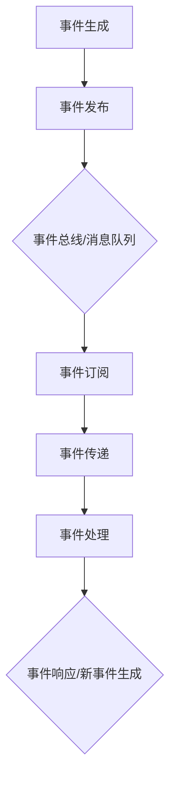

                 

### 引言

#### 事件驱动架构的概念与特点

事件驱动架构（Event-Driven Architecture, EDA）是一种系统设计和实现方法，它通过事件来驱动应用程序的行为，而不是传统的基于轮询或状态机的模式。事件驱动架构的核心特点是事件中心化，即系统中的组件通过发布和订阅事件来通信。一个事件可以是任何数据变化、系统状态更新或者外部环境的改变。事件发布者不关心谁会订阅这些事件，而事件订阅者则可以独立地处理它们感兴趣的事件。

事件驱动架构具有以下几个显著特点：

1. **高解耦性**：由于组件之间的通信是通过事件进行的，这使得它们可以独立开发、部署和更新，而不影响其他组件。
2. **灵活性**：事件驱动的系统可以动态扩展和重构，因为组件之间的依赖性较低。
3. **异步处理**：事件可以异步处理，这可以显著提高系统的吞吐量和响应能力。
4. **可伸缩性**：系统可以根据需要添加新的事件处理组件，从而实现水平扩展。

#### LLM应用的背景与现状

大型语言模型（Large Language Model, LLM）如GPT-3、ChatGLM和BERT等，已经在自然语言处理（Natural Language Processing, NLP）领域取得了巨大的成功。LLM应用广泛用于智能客服、文本生成、机器翻译、问答系统等场景。然而，随着应用场景的复杂化和多样化，LLM应用面临以下几个挑战：

1. **耦合性高**：传统架构中，LLM与其他系统组件之间的紧密耦合导致系统难以维护和扩展。
2. **性能瓶颈**：传统的轮询和同步处理模式难以应对高并发和大数据量的场景。
3. **扩展性差**：系统在面对新增或变更功能时，往往需要大规模重构。

#### 事件驱动架构在LLM应用中的重要性

事件驱动架构为LLM应用提供了一种解耦、灵活和可扩展的解决方案。通过事件驱动架构，LLM可以与其他系统组件独立交互，降低了系统的耦合性。此外，事件驱动架构支持异步处理，可以显著提升系统的性能和响应能力。在扩展性方面，事件驱动架构允许系统动态添加和更新事件处理组件，从而适应不断变化的应用需求。

总结而言，事件驱动架构不仅能够解决LLM应用当前面临的耦合性高、性能瓶颈和扩展性差等问题，还为未来的发展提供了新的可能性。本文将深入探讨事件驱动架构在LLM应用中的具体应用，包括其基础概念、实现方法、性能优化和未来展望。

### 事件驱动架构基础

事件驱动架构（Event-Driven Architecture, EDA）是一种以事件为核心，通过事件发布和订阅实现系统间通信的架构设计方法。EDA的核心思想是组件之间通过异步的事件流进行通信，而不是通过共享内存或同步调用。理解事件驱动架构的基础概念对于深入探讨其在LLM应用中的重要性至关重要。

#### 事件的概念

在事件驱动架构中，事件是一个具有时间戳的数据对象，它描述了一个发生的事件以及与该事件相关的数据。事件可以由系统内部组件产生，也可以由外部环境触发。例如，在一个电商系统中，当用户完成一次购买时，系统会生成一个“订单完成”事件，并包含订单号、用户ID、购买时间等详细信息。

事件具有以下基本属性：

1. **唯一性**：每个事件都有唯一的标识符，用于区分不同的事件。
2. **时间戳**：事件发生的时间戳用于记录事件的发生时间。
3. **数据内容**：事件携带的数据内容描述了事件的具体信息。

#### 事件驱动模型

事件驱动模型（Event-Driven Model）是一种系统行为模型，它描述了系统如何响应事件。在事件驱动模型中，系统的行为是由事件触发的，而不是由固定的程序流程决定的。事件驱动模型的核心组件包括事件发布者、事件订阅者和事件处理程序。

事件驱动模型的工作流程如下：

1. **事件发布**：当发生一个特定的事件时，事件发布者会生成一个事件对象，并将其发布到事件总线或消息队列中。
2. **事件订阅**：事件订阅者通过订阅特定的事件，将自身与事件总线或消息队列关联起来。
3. **事件处理**：事件总线或消息队列将发布的事件传递给相应的事件订阅者，事件订阅者根据事件类型执行相应的处理程序。

事件驱动模型具有以下几个关键特点：

1. **异步通信**：事件发布者和订阅者之间通常是异步通信，这可以显著提高系统的并发处理能力和性能。
2. **高解耦性**：由于组件之间的交互是通过事件进行的，这使得组件可以独立开发、部署和更新，而不影响其他组件。
3. **动态性**：事件驱动架构支持动态添加和删除事件处理程序，从而适应系统的变化。

#### 事件处理流程

事件处理流程是事件驱动架构中的核心环节，它描述了事件从发布到处理的全过程。一个典型的事件处理流程包括以下几个步骤：

1. **事件生成**：系统中的某个组件检测到一个特定的事件发生，生成一个事件对象。
2. **事件发布**：事件发布者将事件发布到事件总线或消息队列。
3. **事件订阅**：事件订阅者通过订阅事件，将自身与事件总线或消息队列关联起来。
4. **事件传递**：事件总线或消息队列将事件传递给相应的事件订阅者。
5. **事件处理**：事件订阅者根据事件类型执行相应的处理程序。
6. **事件响应**：事件处理程序执行完成后，可能产生新的事件，从而继续触发后续的事件处理。

事件处理流程的图示如下（使用Mermaid流程图表示）：

通过事件驱动架构，系统能够实现高解耦、高灵活性和高性能，这对于解决LLM应用的耦合性高、性能瓶颈和扩展性差等问题具有重要意义。

#### LLM与事件驱动架构的结合

大型语言模型（Large Language Model, LLM）在自然语言处理（Natural Language Processing, NLP）领域具有广泛的应用，然而，其复杂性和对性能的高要求使得传统架构面临诸多挑战。结合事件驱动架构（Event-Driven Architecture, EDA），可以为LLM应用提供一种解耦、灵活且可扩展的解决方案。

##### LLM在事件驱动架构中的应用

在事件驱动架构中，LLM作为一个关键组件，可以通过发布和订阅事件来实现与其他系统组件的交互。具体应用场景包括：

1. **交互式问答系统**：用户输入问题后，LLM接收并处理该问题，生成回答。然后，LLM将回答事件发布到事件总线，其他系统组件如前端界面、数据库等可以订阅并显示回答。
2. **文本生成应用**：在自动生成报告、文章等场景中，LLM可以接收到数据源的事件，如新数据到来事件，LLM根据这些数据进行文本生成，并将生成的文本事件发布到相应的系统组件。

##### 事件驱动架构对LLM的影响

事件驱动架构对LLM的应用带来了以下几个方面的积极影响：

1. **解耦**：事件驱动架构通过事件传递实现了LLM与其他系统组件的解耦。LLM不需要直接访问其他组件的内部状态，只需关注事件本身和处理结果，从而降低了系统整体的耦合度。
   
2. **性能提升**：事件驱动架构支持异步处理，LLM可以在处理事件时不必等待其他组件的响应。这种方式提高了系统的吞吐量和响应能力，特别是在高并发场景下，可以有效降低系统的负载。

3. **可扩展性**：由于事件驱动架构具有良好的解耦性，LLM可以轻松地扩展功能或更换其他组件，而不需要对整个系统进行大规模重构。例如，可以动态添加新的问答模块或数据源处理模块。

4. **灵活性**：事件驱动架构使得系统可以灵活地适应不同的应用场景。通过订阅不同类型的事件，LLM可以针对特定的需求进行定制化的处理，从而提高系统的适应性和灵活性。

##### 实例分析

以一个智能客服系统为例，该系统利用LLM来处理用户的问题。传统架构下，客服系统中的各个模块如数据库、用户界面和LLM紧密耦合，导致系统维护困难、扩展性差。采用事件驱动架构后：

1. 用户界面生成用户提问事件，并将其发布到事件总线。
2. 事件总线将用户提问事件传递给LLM处理模块。
3. LLM处理用户提问事件，生成回答事件，并将其发布到事件总线。
4. 事件总线将回答事件传递回用户界面，显示给用户。

这种解耦的方式使得各个模块可以独立开发、测试和部署，从而大大提高了系统的可维护性和可扩展性。

通过结合事件驱动架构，LLM应用能够实现更好的解耦、性能提升和灵活性，为自然语言处理领域带来了新的发展可能性。

### LLM应用解耦分析

在大型语言模型（LLM）的实际应用中，解耦是一个至关重要的概念。解耦（Decoupling）指的是通过将系统中紧密耦合的组件分离，从而减少相互依赖，提高系统的灵活性和可维护性。在LLM应用中，解耦需求尤为突出，因为LLM通常与其他系统组件如数据库、前端界面和中间件紧密集成，导致系统在扩展和更新时面临巨大挑战。

#### 解耦的定义与重要性

解耦是一种设计原则，通过减少组件之间的依赖关系，使得系统可以独立运作。在LLM应用中，解耦的定义可以具体化为：

1. **数据解耦**：LLM与数据源的交互不应直接依赖于特定数据的格式或存储方式。
2. **功能解耦**：LLM的不同功能模块应独立实现，相互之间不应有直接的调用关系。
3. **接口解耦**：LLM与其他系统组件的交互应通过统一的接口进行，而不是直接访问内部实现。

解耦的重要性体现在以下几个方面：

1. **提高可维护性**：通过解耦，各个组件可以独立开发和维护，降低了系统的复杂度，使得代码更加清晰和易于理解。
2. **增强可扩展性**：解耦允许系统在不影响其他组件的情况下，单独扩展或替换某个组件，从而提高了系统的灵活性和适应性。
3. **减少故障传播**：当一个组件出现问题时，通过解耦，问题不会迅速扩散到整个系统，从而降低了系统的风险。

#### LLM应用中存在的问题

在LLM应用中，存在以下问题，这些问题表明了解耦的迫切需求：

1. **紧耦合导致的维护困难**：LLM与数据库、中间件和其他系统组件紧密集成，任何一个小改动都可能需要重新测试和部署整个系统，使得维护工作变得复杂且耗时。
2. **性能瓶颈**：传统架构中，LLM与其他组件的紧耦合导致在高并发场景下，系统性能受到影响，难以处理大量请求。
3. **扩展性差**：当需要新增功能或变更需求时，由于各个组件之间的强依赖关系，系统往往需要进行大规模重构，增加了项目风险和成本。
4. **故障传播**：一旦某个组件出现故障，由于紧密耦合，可能会影响整个系统的正常运行，导致用户体验下降。

#### 事件驱动架构在解耦中的作用

事件驱动架构（EDA）通过事件发布和订阅机制，实现了LLM应用中组件之间的解耦。以下是事件驱动架构在解耦中的具体作用：

1. **异步通信**：EDA通过异步方式传递事件，使得LLM无需直接等待其他组件的响应，从而减少组件之间的同步依赖。这种异步处理方式可以提高系统的性能和响应能力。
2. **统一接口**：事件驱动架构提供了统一的接口，如事件总线或消息队列，作为组件之间通信的媒介。所有组件通过这些接口进行通信，而不是直接调用其他组件的内部实现，从而实现了接口解耦。
3. **模块化设计**：事件驱动架构鼓励模块化设计，各个组件可以独立开发、测试和部署，这有助于提高系统的可维护性和可扩展性。

#### 解耦带来的优势

通过事件驱动架构实现LLM应用的解耦，可以带来以下几个显著的优势：

1. **提高可维护性**：解耦后，各个组件独立运行，维护工作更加简单和高效。开发者只需关注特定组件的代码，而不需要了解整个系统的复杂性。
2. **增强可扩展性**：解耦使得系统可以灵活扩展，新增或替换组件时不会对其他部分产生重大影响，从而降低了项目风险和成本。
3. **提升性能**：异步处理和模块化设计有助于提高系统的性能和响应速度，特别是在高并发场景下，系统能够更好地应对大量请求。
4. **降低故障风险**：由于组件之间的耦合性降低，单个组件的故障不会迅速扩散到整个系统，从而提高了系统的稳定性和可靠性。

总之，事件驱动架构在LLM应用中通过实现解耦，不仅解决了传统的紧耦合问题，还带来了显著的性能提升和扩展性增强，为LLM应用的稳定运行和持续发展提供了有力保障。

### 事件驱动架构在LLM应用中的实现

事件驱动架构（Event-Driven Architecture, EDA）在大型语言模型（LLM）应用中扮演着至关重要的角色，它不仅提升了系统的解耦性，还显著改善了系统的性能和扩展性。在LLM应用中，实现事件驱动架构需要细致的规划和设计，以下将详细讨论实现这一架构的具体步骤和关键细节。

#### LLM应用场景分析

LLM应用场景可以分为两大类：通用场景和行业应用场景。通用场景包括文本生成、智能问答和机器翻译等，而行业应用场景则更加多样化，如金融行业的智能投顾、医疗领域的疾病诊断等。

##### 通用场景

在通用场景中，LLM作为核心组件，需要与其他系统组件如数据库、前端界面和消息队列进行交互。以下是一个典型的通用场景分析：

1. **用户输入**：用户通过前端界面输入问题或请求。
2. **事件生成**：前端界面生成一个“用户请求”事件，并将其发布到事件总线。
3. **事件处理**：事件总线接收到“用户请求”事件后，将其传递给LLM处理模块。
4. **LLM响应**：LLM处理用户请求，生成回答事件，并将其发布到事件总线。
5. **事件传递**：事件总线将LLM的响应事件传递回前端界面。
6. **结果展示**：前端界面接收到LLM的响应事件后，将回答展示给用户。

##### 行业应用场景

在行业应用场景中，LLM的交互更加复杂，可能涉及到多个系统和多层级的数据处理。以下是一个金融行业的智能投顾场景分析：

1. **数据收集**：系统从金融市场上获取股票、基金等数据，并将其转换为事件。
2. **事件发布**：数据源将数据事件发布到事件总线。
3. **数据处理**：事件总线将数据事件传递给LLM处理模块，LLM分析这些数据，生成投资建议事件。
4. **事件传递**：投资建议事件被传递到前端界面。
5. **决策生成**：前端界面根据LLM的建议生成投资决策事件，并将其发送到交易平台。
6. **结果反馈**：交易平台处理投资决策事件，并将结果反馈给事件总线，事件总线再传递给LLM和前端界面。

#### 事件驱动架构设计

实现事件驱动架构的关键在于架构设计。以下讨论架构设计原则、要素和实现细节。

##### 架构设计原则

1. **高内聚、低耦合**：确保每个组件内部功能独立且紧密相关，而组件之间的依赖性较低。
2. **模块化**：系统应划分为多个模块，每个模块具有明确的职责和功能。
3. **灵活性**：架构应支持动态扩展和更新，以适应不同的应用场景和需求变化。
4. **性能优化**：架构设计应考虑性能优化，如异步处理、并发控制和负载均衡等。

##### 架构设计要素

1. **事件总线**：事件总线的核心功能是事件传输和分发，它是整个事件驱动架构的中枢。常见的事件总线实现包括RabbitMQ、Kafka等消息队列系统。
2. **事件发布者**：事件发布者是系统中产生和发布事件的组件，如前端界面、数据源等。
3. **事件订阅者**：事件订阅者是接收和响应事件的组件，如LLM处理模块、数据库等。
4. **事件处理程序**：事件处理程序是具体处理事件的逻辑，如LLM如何处理用户请求事件等。

##### 实现细节

1. **事件生成与处理**：在LLM应用中，事件生成和处理是关键环节。事件生成通常由前端界面或数据源完成，而事件处理则由LLM处理模块执行。事件处理程序应包括预处理、核心处理和后处理等步骤。

2. **LLM集成与优化**：在事件驱动架构中，LLM的集成和优化至关重要。集成LLM时，需要考虑LLM的规模、计算资源和延迟等因素。优化策略包括分布式计算、缓存机制和并行处理等。

3. **事件流管理**：事件流管理是确保事件在系统中高效传递和处理的重要环节。事件流管理应包括事件过滤、事件排序、事件聚合等机制，以确保事件处理的高效性和准确性。

4. **监控与日志**：为了确保事件驱动架构的稳定运行，应建立全面的监控和日志系统。监控系统可以实时监控事件流量、处理时间和错误率等指标，日志系统则记录事件处理过程中的详细信息，便于问题追踪和调试。

通过详细规划和设计，事件驱动架构在LLM应用中可以实现高效、灵活和可扩展的系统架构，从而满足日益复杂的应用需求。

### 事件驱动架构在LLM应用扩展中的实践

在LLM应用中，随着业务需求的增长和系统复杂性的提升，扩展性成为了一个关键需求。事件驱动架构（EDA）因其高解耦性和灵活性，为LLM应用的扩展提供了有效的解决方案。以下将探讨LLM应用扩展的需求、扩展设计原则、实现策略及实际案例。

#### LLM应用扩展的需求

LLM应用扩展的需求主要包括以下几个方面：

1. **功能扩展**：随着用户需求的多样化，系统需要新增或修改功能模块，例如增加新的问答场景、扩展文本生成功能等。
2. **数据扩展**：系统需要处理更多的数据源和更复杂的数据类型，例如实时金融市场数据、医疗健康数据等。
3. **性能扩展**：系统需要应对更高的并发请求和更大的数据量，确保在扩展后的环境下仍然能够高效运行。
4. **用户量扩展**：随着用户量的增加，系统需要能够支持更多用户同时访问和使用服务，保证用户体验。

#### 扩展的定义与类型

扩展（Expansion）是指系统在原有架构的基础上，通过增加组件、优化资源利用或重构架构，来满足更高需求或实现更复杂功能的过程。扩展通常分为以下几种类型：

1. **垂直扩展**：通过增加硬件资源（如更强大的服务器、更大内存等）来提升系统性能。
2. **水平扩展**：通过增加节点或副本来提升系统处理能力和负载均衡能力。
3. **功能扩展**：通过增加新功能模块或集成第三方服务来扩展系统的功能。
4. **性能优化**：通过改进算法、优化资源利用或增加缓存等手段来提升系统性能。

#### LLM应用扩展的挑战

在LLM应用扩展过程中，可能会面临以下挑战：

1. **高耦合性**：传统架构中，LLM与其他组件的高耦合性使得扩展变得复杂和风险大。
2. **性能瓶颈**：扩展后的系统可能会遇到性能瓶颈，特别是在高并发场景下。
3. **资源管理**：扩展后需要高效管理资源，包括计算资源、存储资源和网络资源等。
4. **系统稳定性**：扩展后的系统需要保证在高负载下仍然稳定运行，避免故障和崩溃。

#### 事件驱动架构在扩展中的应用

事件驱动架构（EDA）在LLM应用扩展中具有显著优势，主要体现在以下几个方面：

1. **高解耦性**：EDA通过事件发布和订阅机制，降低了LLM与其他组件之间的耦合性，使得扩展变得更加简单和灵活。
2. **动态性**：EDA支持动态扩展，允许系统在运行时动态添加或删除事件处理组件，从而实现按需扩展。
3. **高性能**：EDA支持异步处理，可以有效提升系统的并发处理能力和响应速度，尤其是在高并发场景下。

#### 扩展设计原则

1. **模块化设计**：系统应采用模块化设计，确保每个模块具有独立的功能和清晰的接口，便于扩展和替换。
2. **标准化接口**：组件之间应通过标准化接口进行通信，减少直接的依赖关系，提高系统的解耦性和可扩展性。
3. **动态配置**：系统应支持动态配置，允许开发者在运行时调整组件的数量和类型，以适应不同的扩展需求。
4. **弹性扩展**：系统应具备弹性扩展能力，能够在需要时自动扩展资源，以满足业务增长需求。

#### 扩展实现策略

1. **事件路由**：通过事件路由器（Event Router）实现事件的转发和管理，确保事件能够正确地传递到相应的处理组件。
2. **负载均衡**：采用负载均衡器（Load Balancer）来分配事件处理任务，确保系统在不同负载下保持稳定运行。
3. **分布式处理**：通过分布式计算框架（如Apache Kafka、RabbitMQ等）实现事件的分布式处理，提高系统的并发处理能力和扩展性。
4. **缓存机制**：引入缓存机制（如Redis、Memcached等），减少重复计算和数据访问，提高系统的响应速度和性能。

#### 实际案例

以下是一个具体的LLM应用扩展案例：

**案例背景**：某公司开发了一款基于GPT-3的智能问答系统，随着用户量的增加，系统面临高并发和性能瓶颈的挑战。

**扩展实践**：

1. **功能扩展**：新增了多语言支持、情感分析等新功能模块。
2. **数据扩展**：引入了实时金融数据接口，以支持金融领域的问答需求。
3. **性能优化**：通过分布式处理和负载均衡，提高了系统的并发处理能力。
4. **资源管理**：利用Kubernetes进行容器编排，实现计算资源的动态分配和管理。

通过上述扩展实践，系统不仅满足了日益增长的用户需求，还在高并发场景下保持了稳定运行，显著提升了用户体验和系统性能。

综上所述，事件驱动架构在LLM应用的扩展中提供了有效的解决方案，通过解耦、动态性和高性能等特点，使得系统可以灵活应对扩展需求，从而实现持续稳定的发展。

### 事件驱动架构在LLM应用中的性能优化

在大型语言模型（LLM）应用中，性能优化是一个至关重要的环节。事件驱动架构（EDA）由于其异步处理和模块化设计，具有显著的性能优势，但在实际应用中，仍可能面临一些性能瓶颈。以下将讨论事件驱动架构在LLM应用中的性能瓶颈及优化策略。

#### 性能优化的重要性

性能优化在LLM应用中的重要性主要体现在以下几个方面：

1. **响应速度**：优化后的系统应能够快速响应用户请求，提高用户体验。
2. **吞吐量**：系统应能够处理更多的事件，以支持高并发场景。
3. **资源利用率**：优化后的系统应能够高效利用计算资源、存储资源和网络资源，避免资源浪费。
4. **稳定性**：优化后的系统应在高负载下保持稳定运行，避免出现故障或崩溃。

#### 事件驱动架构的性能瓶颈

尽管事件驱动架构具有很多优点，但在LLM应用中，仍可能面临以下性能瓶颈：

1. **事件积压**：在高并发场景下，事件队列可能会出现积压，导致事件处理延迟。
2. **资源争用**：多个事件处理组件可能会争夺相同的资源（如内存、CPU等），导致性能下降。
3. **网络延迟**：事件在分布式系统中的传输可能受到网络延迟的影响，降低系统的整体性能。
4. **数据库访问**：事件处理过程中可能需要频繁访问数据库，数据库的访问速度直接影响系统的性能。
5. **单点故障**：事件总线或消息队列作为系统的核心组件，一旦发生故障，可能会影响整个系统的正常运行。

#### 优化策略

针对上述性能瓶颈，以下是一些优化策略：

1. **事件流管理**：
   - **事件过滤**：通过事件过滤机制，提前筛选出不需要处理的事件，减少事件处理量。
   - **事件聚合**：将多个相似的事件合并处理，减少事件处理的次数。
   - **事件优先级**：对事件进行优先级排序，优先处理重要或紧急的事件。

2. **负载均衡**：
   - **分布式处理**：通过分布式处理框架（如Kafka、RabbitMQ等），将事件分发到多个处理节点，实现负载均衡。
   - **动态负载均衡**：根据系统负载动态调整事件处理节点的数量和资源分配。

3. **缓存机制**：
   - **本地缓存**：在事件处理节点上使用本地缓存，减少对数据库的访问频率。
   - **分布式缓存**：使用分布式缓存系统（如Redis、Memcached等），提高数据的访问速度和系统的整体性能。

4. **数据库优化**：
   - **索引优化**：合理设计数据库索引，提高查询效率。
   - **读写分离**：将数据库读写操作分离，提高系统的读写性能。

5. **网络优化**：
   - **网络延迟优化**：通过优化网络拓扑结构、使用CDN（内容分发网络）等手段，减少网络延迟。
   - **数据压缩**：对传输的数据进行压缩，减少数据传输量。

6. **系统监控**：
   - **实时监控**：实时监控系统性能指标，如事件处理延迟、资源利用率等，及时发现和处理性能瓶颈。
   - **日志分析**：分析系统日志，定位性能问题并进行优化。

#### 实际案例

以下是一个性能优化的实际案例：

**案例背景**：某公司开发的基于GPT-3的智能问答系统在高峰期出现了大量请求积压，导致响应时间过长。

**优化实践**：

1. **事件过滤与聚合**：通过过滤和聚合机制，将相似的事件合并处理，减少了事件处理量。
2. **分布式处理与负载均衡**：使用Kafka进行事件传输，并将事件处理任务分配到多个节点，实现负载均衡。
3. **本地缓存与分布式缓存**：在事件处理节点上使用本地缓存，并使用Redis进行分布式缓存，减少对数据库的访问。
4. **数据库索引优化**：优化数据库索引，提高查询效率。
5. **实时监控与日志分析**：实时监控系统性能指标，并通过日志分析定位性能问题。

通过上述优化措施，系统的响应时间显著降低，吞吐量提高，整体性能得到了大幅提升。

总之，事件驱动架构在LLM应用中的性能优化需要综合考虑事件流管理、负载均衡、缓存机制、数据库优化和网络优化等多个方面。通过合理的优化策略，可以有效提升系统的性能和稳定性，为用户提供更优质的服务。

### 未来展望与挑战

在展望未来时，事件驱动架构（EDA）在大型语言模型（LLM）应用中的发展趋势和面临的挑战同样引人关注。随着技术的发展和应用的深入，EDA在LLM领域展现出了巨大的潜力，同时也面临诸多挑战。

#### 发展趋势分析

1. **智能化与自动化**：未来的EDA将进一步集成智能化和自动化技术，如机器学习和人工智能，以实现事件处理的自适应和自动化优化。
2. **分布式架构**：随着云计算和边缘计算的发展，EDA将更加依赖分布式架构，以支持大规模、跨地域的数据处理和事件流管理。
3. **微服务架构**：微服务架构与EDA的结合将成为趋势，通过微服务实现事件驱动的模块化、可扩展和分布式服务，提升系统的灵活性和可靠性。
4. **跨平台与跨语言**：EDA将在更多平台上得到应用，包括IoT、区块链和5G等新兴技术领域，同时支持多种编程语言和开发框架，以实现更广泛的技术融合。

#### 未来发展方向

1. **性能优化**：未来的研究将集中在如何进一步优化EDA的性能，特别是在高并发、大数据量的场景下，提高事件处理的速度和效率。
2. **安全与隐私保护**：随着数据隐私法规的日益严格，如何保障事件驱动架构中的数据安全和隐私保护将成为一个重要研究方向。
3. **智能事件处理**：利用机器学习算法，实现智能的事件识别、分类和优先级分配，提高事件处理的智能化水平。
4. **标准化与生态构建**：推动EDA的标准化，构建一个涵盖开发、测试、部署和运营的全生命周期生态体系，以降低开发门槛，提升开发效率。

#### 挑战与应对策略

1. **复杂性管理**：随着EDA的复杂度增加，如何有效地管理和维护系统架构将成为一个挑战。应对策略包括开发可复用组件、采用微服务架构和实施自动化测试等。
2. **系统稳定性**：在高并发和分布式环境下，如何确保系统的稳定性是一个关键问题。应对策略包括负载均衡、容错机制和实时监控等。
3. **性能瓶颈**：如何突破性能瓶颈，特别是在大规模数据处理和实时事件处理方面，将是未来研究的一个重要方向。应对策略包括分布式计算、缓存机制和优化算法等。
4. **跨平台兼容性**：实现EDA在多种平台和设备上的兼容性是一个挑战。应对策略包括采用跨平台开发框架和标准化接口，提高系统的可移植性和兼容性。

总之，事件驱动架构在LLM应用中的未来发展充满潜力，但也面临诸多挑战。通过技术创新和策略优化，可以不断推动EDA的发展，为LLM应用提供更高效、灵活和可靠的解决方案。

### 总结

本文深入探讨了事件驱动架构（EDA）在大型语言模型（LLM）应用中的重要性和具体实现。首先，我们介绍了事件驱动架构的基本概念和特点，包括事件的概念、事件驱动模型和事件处理流程。接着，分析了LLM应用在传统架构中面临的高耦合性、性能瓶颈和扩展性差等问题，并探讨了EDA在这些方面的优势。通过具体的实现方法和优化策略，我们展示了如何将EDA应用于LLM应用中的解耦、性能优化和扩展。

#### 对LLM应用的影响

事件驱动架构为LLM应用带来了显著的改进：

1. **解耦**：通过事件发布和订阅机制，LLM与其他系统组件之间的耦合性大大降低，提高了系统的灵活性和可维护性。
2. **性能优化**：EDA支持异步处理和分布式架构，提高了系统的吞吐量和响应能力，有效解决了传统架构中的性能瓶颈。
3. **扩展性**：EDA允许系统按需扩展和动态调整，使得LLM应用能够灵活适应不断变化的需求和场景。

#### 对未来研究的建议

为了进一步推动事件驱动架构在LLM应用中的发展，未来研究可以从以下几个方面展开：

1. **智能化与自动化**：结合人工智能和机器学习技术，实现智能事件识别和处理，提高系统的自适应性和自动化水平。
2. **标准化与生态建设**：推动EDA的标准化，构建一个统一的生态体系，降低开发门槛，提升开发效率。
3. **性能优化**：深入研究高并发、大数据量场景下的性能优化策略，特别是实时事件处理的算法和架构设计。
4. **安全性**：加强事件驱动架构中的安全性和隐私保护措施，确保数据的安全和合规性。

通过这些研究方向的探索，事件驱动架构有望在LLM应用中发挥更大的作用，推动自然语言处理技术的不断进步和应用拓展。作者：AI天才研究院/AI Genius Institute & 禅与计算机程序设计艺术 /Zen And The Art of Computer Programming。

