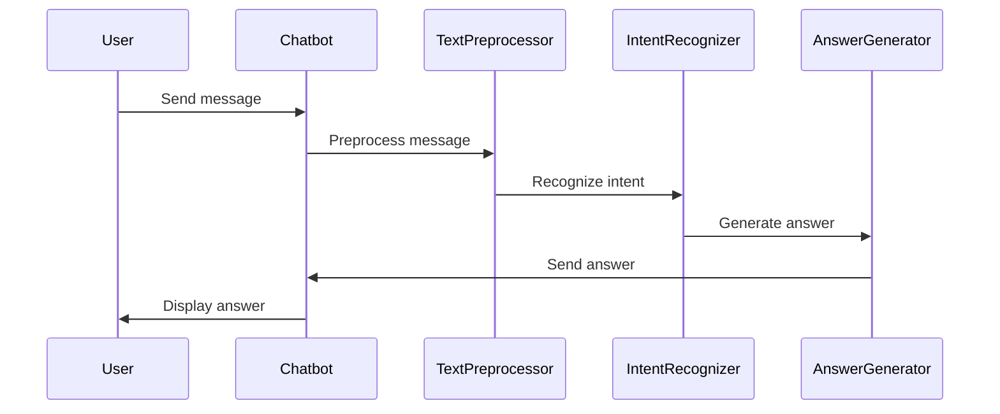
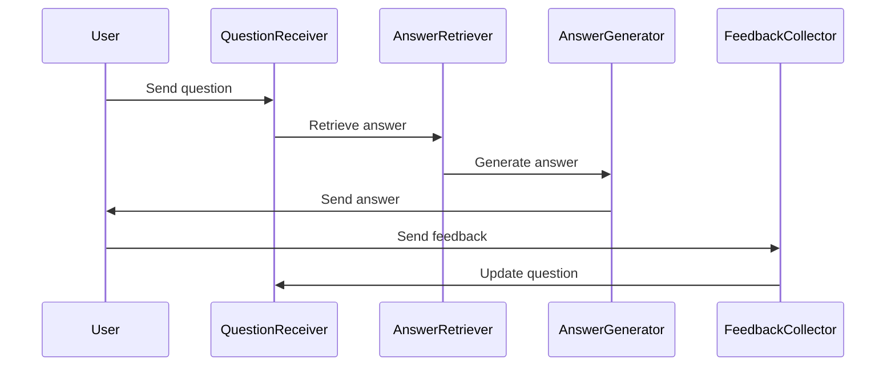
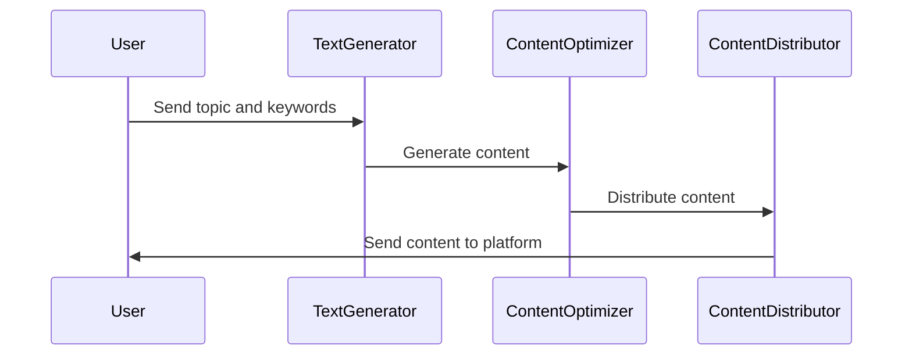

                 


### 云原生LLM应用：设计与实现

关键词：云原生、语言模型、LLM、架构设计、开发实践、部署与运维、案例分析、未来发展

摘要：本文将深入探讨云原生LLM（Large Language Model）的应用设计与实现。首先，我们将概述云原生和LLM的基础知识，接着探讨云原生LLM的核心概念，然后详细分析其应用架构。在开发实践部分，我们将介绍如何搭建开发环境、初始化项目以及进行模型训练和优化。随后，我们将讨论云原生LLM的部署与运维策略，并通过实际案例进行剖析。最后，我们将展望云原生LLM的未来发展趋势，并总结最佳实践与注意事项。

## 第一部分: 云原生LLM应用背景

### 第1章: 云原生与LLM概述

**1.1.1 云原生概述**

云原生（Cloud Native）是一种通过充分利用云计算的弹性、可扩展性和灵活性，构建和运行应用程序的方法。它包含了一系列技术和最佳实践，旨在使应用程序在云环境中运行得更加高效、可靠和可扩展。

**1.1.2 语言模型（LLM）基础**

语言模型（Language Model，LLM）是一种能够预测句子中下一个词的统计模型。它广泛应用于自然语言处理（NLP）领域，例如机器翻译、文本生成和语音识别等。

**1.1.3 云原生与LLM结合的意义**

云原生与LLM的结合能够实现高效的模型训练和部署，提高NLP应用的性能和可靠性。通过云原生技术，我们可以构建可扩展、高可用和低延迟的LLM应用。

### 第2章: 云原生LLM的核心概念

**2.1.1 云原生架构特点**

云原生架构的特点包括微服务化、容器化、自动化、弹性伸缩等。这些特点使得云原生应用在云环境中能够更加灵活地应对负载变化。

**2.1.2 语言模型的原理**

语言模型基于大规模的文本数据进行训练，通过统计学习方法来预测句子中的下一个词。常见的语言模型包括n-gram模型、循环神经网络（RNN）和变换器（Transformer）等。

**2.1.3 云原生LLM的关键技术**

云原生LLM的关键技术包括：

- **模型压缩与优化**：为了降低模型大小和加速推理，需要对模型进行压缩和优化。
- **分布式训练**：利用多台机器进行模型训练，提高训练速度和降低成本。
- **模型部署与推理**：将训练好的模型部署到云原生环境中，并进行高效的推理计算。

### 第3章: 云原生LLM应用架构

**3.1.1 云原生LLM架构设计原则**

云原生LLM架构设计应遵循高可用性、可扩展性、高性能和易于维护的原则。

**3.1.2 微服务架构在云原生LLM中的应用**

微服务架构可以将云原生LLM应用分解为多个可独立部署和扩展的小服务，提高系统的灵活性和可维护性。

**3.1.3 容器化与编排工具**

容器化技术如Docker和Kubernetes在云原生LLM应用中发挥着关键作用，用于部署、管理和编排容器化应用。

## 第二部分: 云原生LLM开发实践

### 第4章: 云原生LLM开发实践

**4.1.1 开发环境搭建**

介绍如何搭建云原生LLM开发环境，包括安装必要的软件和配置。

**4.1.2 云原生LLM项目初始化**

指导如何初始化云原生LLM项目，包括项目结构、依赖管理和版本控制。

**4.1.3 模型训练与优化**

详细讲解如何训练和优化云原生LLM模型，包括数据预处理、模型选择和优化策略。

### 第5章: 云原生LLM部署与运维

**5.1.1 部署策略**

介绍云原生LLM的部署策略，包括手动部署和自动化部署。

**5.1.2 自动化部署工具**

介绍常用的自动化部署工具，如Kubernetes和Docker Compose，以及如何使用它们进行部署。

**5.1.3 运维监控与性能优化**

介绍如何监控云原生LLM应用的性能，并进行性能优化。

### 第6章: 云原生LLM应用案例分析

**6.1.1 案例一：智能客服系统**

分析智能客服系统的云原生LLM应用架构、开发实践和性能优化。

**6.1.2 案例二：智能问答系统**

分析智能问答系统的云原生LLM应用架构、开发实践和性能优化。

**6.1.3 案例三：智能内容生成**

分析智能内容生成系统的云原生LLM应用架构、开发实践和性能优化。

### 第7章: 云原生LLM未来发展展望

**7.1.1 云原生LLM面临的挑战**

探讨云原生LLM在发展过程中面临的挑战，如数据隐私、安全性和伦理问题。

**7.1.2 未来发展趋势**

分析云原生LLM的未来发展趋势，如模型压缩、多模态融合和联邦学习等。

**7.1.3 应用前景与政策影响**

讨论云原生LLM在各个领域的应用前景以及政策对行业发展的影响。

### 第8章: 最佳实践与总结

**8.1.1 最佳实践**

总结云原生LLM开发、部署和运维的最佳实践。

**8.1.2 注意事项**

提醒读者在云原生LLM应用中需要注意的事项。

**8.1.3 拓展阅读**

推荐进一步阅读的资源，包括相关书籍、论文和技术博客。

作者：AI天才研究院/AI Genius Institute & 禅与计算机程序设计艺术 /Zen And The Art of Computer Programming

----------------------------------------------------------------

## 第一部分：云原生LLM应用背景

### 第1章：云原生与LLM概述

**1.1.1 云原生概述**

云原生（Cloud Native）是一种设计和运行应用程序的方法，它利用了云计算的灵活性、可扩展性和弹性。云原生技术旨在使应用程序在云环境中运行得更加高效、可靠和可维护。云原生应用程序通常具有以下几个特点：

- **微服务架构**：应用程序被分解为多个独立的、可复用的服务，每个服务负责特定的业务功能。
- **容器化**：应用程序被封装在容器中，容器提供了独立的环境，使得应用程序可以在任何地方运行，无需担心环境差异。
- **自动化**：利用自动化工具（如CI/CD流水线）进行应用程序的构建、测试和部署。
- **弹性伸缩**：根据负载需求自动扩展或缩小应用程序的实例数量。
- **持续集成/持续部署（CI/CD）**：通过自动化流程实现应用程序的持续集成和部署。

**1.1.2 语言模型（LLM）基础**

语言模型（Language Model，LLM）是一种用于自然语言处理的模型，它能够预测句子中下一个词的概率。LLM在机器翻译、语音识别、文本生成等领域有着广泛的应用。常见的LLM技术包括：

- **n-gram模型**：基于词的历史序列进行预测，是最简单的语言模型。
- **循环神经网络（RNN）**：能够处理序列数据，但存在梯度消失和梯度爆炸等问题。
- **变换器（Transformer）**：一种基于自注意力机制的神经网络结构，它在许多NLP任务中取得了显著的效果。

**1.1.3 云原生与LLM结合的意义**

云原生与LLM的结合具有重要的意义：

- **高效的模型训练和部署**：云原生环境提供了强大的计算能力和存储资源，可以加速模型的训练过程。同时，容器化技术和自动化工具使得模型的部署变得更加高效和可靠。
- **可扩展性和高性能**：云原生架构支持应用程序的弹性伸缩，可以满足不同负载需求。此外，分布式训练和推理技术可以提高LLM应用的性能。
- **灵活性和可维护性**：云原生应用程序采用微服务架构，可以方便地进行模块化和可维护性。

### 第2章：云原生LLM的核心概念

**2.1.1 云原生架构特点**

云原生架构的特点包括：

- **微服务架构**：将应用程序分解为多个独立的服务，每个服务负责特定的业务功能。这种架构可以提升系统的可扩展性和可维护性。
- **容器化**：使用容器（如Docker）来封装应用程序及其依赖项，使得应用程序可以在不同的环境中运行，提高了部署的灵活性和可移植性。
- **自动化**：利用自动化工具（如Kubernetes）进行应用程序的部署、扩展和监控，减少了人工干预，提高了系统的稳定性。
- **弹性伸缩**：根据实际负载需求，自动调整应用程序的实例数量，保证了系统的性能和可用性。

**2.1.2 语言模型的原理**

语言模型是基于大规模的文本数据训练得到的，它能够预测句子中下一个词的概率。语言模型的核心原理包括：

- **词嵌入**：将词汇映射到高维向量空间，使得相似的词汇在空间中靠近。
- **概率预测**：通过统计学习方法（如n-gram、RNN、Transformer等）来预测句子中下一个词的概率。
- **上下文理解**：利用上下文信息来提高预测的准确性，如词序、词频、词性等。

**2.1.3 云原生LLM的关键技术**

云原生LLM的关键技术包括：

- **模型压缩与优化**：为了降低模型大小和加速推理，需要对模型进行压缩和优化。常见的模型压缩技术包括量化、剪枝和知识蒸馏等。
- **分布式训练**：利用多台机器进行模型训练，可以加速训练过程并降低成本。分布式训练技术包括数据并行、模型并行和混合并行等。
- **模型部署与推理**：将训练好的模型部署到云原生环境中，并进行高效的推理计算。常用的模型部署工具包括TensorFlow Serving、PyTorch Serving等。

### 第3章：云原生LLM应用架构

**3.1.1 云原生LLM架构设计原则**

云原生LLM架构设计应遵循以下原则：

- **高可用性**：确保系统的稳定性和可靠性，减少故障和中断。
- **可扩展性**：支持系统在负载增加时自动扩展，保持性能和响应速度。
- **高性能**：优化系统性能，提高数据处理和响应速度。
- **易于维护**：简化系统的开发和维护过程，提高开发效率。

**3.1.2 微服务架构在云原生LLM中的应用**

微服务架构在云原生LLM中的应用包括：

- **服务分解**：将LLM应用分解为多个独立的微服务，每个服务负责特定的功能，如文本预处理、模型推理和结果输出等。
- **服务通信**：使用轻量级的通信协议（如HTTP/REST、gRPC等）实现微服务之间的通信。
- **服务部署**：将每个微服务独立部署和扩展，提高系统的灵活性和可维护性。

**3.1.3 容器化与编排工具**

容器化与编排工具在云原生LLM中的应用包括：

- **容器化**：使用容器（如Docker）将LLM应用及其依赖项封装在一起，确保应用程序在不同的环境中运行一致。
- **编排工具**：使用编排工具（如Kubernetes）对容器进行管理，包括部署、扩展和监控等操作。

## 第二部分：云原生LLM开发实践

### 第4章：云原生LLM开发实践

**4.1.1 开发环境搭建**

搭建云原生LLM开发环境包括以下步骤：

1. 安装Docker：在开发机上安装Docker，以便能够运行和管理容器。
2. 安装Kubernetes：安装Kubernetes集群，以便能够部署和管理微服务。
3. 安装Python和必要的库：安装Python和相关库，如TensorFlow或PyTorch等，以便进行模型训练和推理。

**4.1.2 云原生LLM项目初始化**

初始化云原生LLM项目包括以下步骤：

1. 创建项目目录：在开发机上创建一个项目目录，用于存放项目文件。
2. 创建Dockerfile：编写Dockerfile文件，定义如何构建项目容器镜像。
3. 创建Kubernetes配置文件：编写Kubernetes配置文件，定义如何部署和管理项目微服务。

**4.1.3 模型训练与优化**

进行模型训练和优化包括以下步骤：

1. 数据预处理：对训练数据集进行清洗、格式化和分割。
2. 模型选择：选择适合任务的语言模型，如Transformer或BERT等。
3. 模型训练：使用训练数据集对模型进行训练，并调整超参数以优化模型性能。
4. 模型评估：使用验证数据集对模型进行评估，调整超参数以获得更好的性能。

## 第三部分：云原生LLM部署与运维

### 第5章：云原生LLM部署与运维

**5.1.1 部署策略**

云原生LLM的部署策略包括以下几种：

1. 手动部署：通过手动操作将LLM模型部署到生产环境中。
2. 自动化部署：使用CI/CD工具（如Jenkins、GitLab CI等）实现自动化部署。
3. 扩展部署：根据实际负载需求，动态扩展LLM应用的实例数量。

**5.1.2 自动化部署工具**

常用的自动化部署工具有以下几种：

1. Kubernetes：用于部署和管理容器化应用程序的编排工具。
2. Docker Compose：用于定义和运行多容器Docker应用程序的命令行工具。
3. Jenkins：用于实现自动化构建和部署的持续集成工具。

**5.1.3 运维监控与性能优化**

运维监控与性能优化包括以下步骤：

1. 监控指标：选择合适的监控指标，如CPU使用率、内存使用率、延迟等。
2. 日志分析：对系统日志进行分析，发现潜在问题和性能瓶颈。
3. 性能优化：根据监控和日志分析结果，对系统进行性能优化，如调整超参数、优化代码等。

## 第四部分：云原生LLM应用案例分析

### 第6章：云原生LLM应用案例分析

**6.1.1 案例一：智能客服系统**

智能客服系统是一种基于云原生LLM的应用，它可以自动处理用户提问并提供合适的答案。案例一将分析智能客服系统的云原生LLM架构、开发实践和性能优化。

**6.1.2 案例二：智能问答系统**

智能问答系统是一种基于云原生LLM的应用，它可以回答用户的问题并提供相关链接。案例二将分析智能问答系统的云原生LLM架构、开发实践和性能优化。

**6.1.3 案例三：智能内容生成**

智能内容生成系统是一种基于云原生LLM的应用，它可以自动生成文章、新闻等内容。案例三将分析智能内容生成系统的云原生LLM架构、开发实践和性能优化。

### 第7章：云原生LLM未来发展展望

**7.1.1 云原生LLM面临的挑战**

云原生LLM在发展过程中面临着以下挑战：

1. 数据隐私和安全：大规模数据收集和处理可能涉及用户隐私和安全问题。
2. 模型压缩与优化：为了满足低延迟和高吞吐量的需求，需要进一步优化和压缩模型。
3. 跨平台兼容性：不同平台和设备之间的兼容性可能影响LLM应用的性能和用户体验。

**7.1.2 未来发展趋势**

云原生LLM的未来发展趋势包括：

1. 模型压缩与优化：通过量化、剪枝和知识蒸馏等技术，进一步压缩和优化模型。
2. 多模态融合：结合语音、图像和其他模态的数据，实现更全面的智能应用。
3. 联邦学习：通过分布式学习的方式，降低数据隐私和安全风险。

**7.1.3 应用前景与政策影响**

云原生LLM在各个领域具有广泛的应用前景，如智能客服、智能问答、智能内容生成等。同时，政策对行业发展具有重要影响，需要关注相关政策和法规。

### 第8章：最佳实践与总结

**8.1.1 最佳实践**

在开发、部署和运维云原生LLM应用时，应遵循以下最佳实践：

1. 模块化设计：将应用程序分解为独立的模块，提高可维护性和可扩展性。
2. 自动化部署：使用CI/CD工具实现自动化部署，提高部署效率和可靠性。
3. 性能监控与优化：定期监控系统性能，发现潜在问题和性能瓶颈，并进行优化。

**8.1.2 注意事项**

在开发、部署和运维云原生LLM应用时，需要注意以下事项：

1. 数据安全与隐私：确保数据安全和用户隐私，遵循相关法律法规。
2. 负载均衡：合理配置负载均衡器，确保系统在高负载情况下稳定运行。
3. 持续学习与迭代：不断优化和改进LLM模型，提高应用性能和用户体验。

**8.1.3 拓展阅读**

以下是一些建议的拓展阅读资源：

1. 《云原生应用架构设计》：深入探讨云原生应用架构的设计原则和最佳实践。
2. 《深度学习与自然语言处理》：介绍深度学习和自然语言处理的基础知识。
3. 《Kubernetes权威指南》：全面介绍Kubernetes的架构、部署和管理方法。
4. 《容器化与容器编排》：介绍容器化和容器编排的基本概念和技术。

作者：AI天才研究院/AI Genius Institute & 禅与计算机程序设计艺术 /Zen And The Art of Computer Programming

----------------------------------------------------------------

## 第4章 云原生LLM开发实践

### 4.1.1 开发环境搭建

为了开发云原生LLM应用，我们需要搭建一个适合的开发环境。以下是搭建环境的基本步骤：

1. **安装Docker**：Docker是一个开源的应用容器引擎，它允许开发者将应用程序及其依赖打包到一个可移植的容器中。可以从[Docker官网](https://www.docker.com/)下载并安装Docker。

    ```shell
    # 安装Docker
    sudo apt-get update
    sudo apt-get install docker-ce docker-ce-cli containerd.io
    ```

2. **安装Kubernetes**：Kubernetes是一个开源的容器编排平台，它可以帮助我们管理和调度容器化应用。我们可以使用Minikube在本地环境中运行Kubernetes集群。

    ```shell
    # 安装Minikube
    curl -LO https://storage.googleapis.com/minikube/releases/latest/minikube-latest.x86_64.rpm
    sudo rpm -ivh minikube-latest.x86_64.rpm
    # 启动Minikube
    minikube start
    ```

3. **安装Python和必要的库**：我们还需要安装Python和用于机器学习的库，如TensorFlow或PyTorch。

    ```shell
    # 安装Python和pip
    sudo apt-get install python3 python3-pip
    # 安装TensorFlow
    pip3 install tensorflow
    # 或者安装PyTorch
    pip3 install torch torchvision torchaudio
    ```

4. **配置kubectl**：kubectl是Kubernetes的命令行工具，用于与集群进行交互。

    ```shell
    # 安装kubectl
    sudo apt-get install kubectl
    # 验证kubectl是否已正确配置
    kubectl version
    ```

完成以上步骤后，我们的开发环境就搭建完成了，可以开始进行云原生LLM应用的开发。

### 4.1.2 云原生LLM项目初始化

在搭建好开发环境后，我们需要初始化云原生LLM项目。以下是初始化项目的基本步骤：

1. **创建项目目录**：在本地机器上创建一个项目目录，用于存放项目的所有文件。

    ```shell
    mkdir cloud-llm-project
    cd cloud-llm-project
    ```

2. **编写Dockerfile**：Dockerfile是一个文本文件，描述了如何构建项目容器镜像。以下是一个简单的Dockerfile示例：

    ```Dockerfile
    FROM python:3.8-slim

    WORKDIR /app

    COPY requirements.txt .

    RUN pip install --no-cache-dir -r requirements.txt

    COPY . .

    CMD ["python", "app.py"]
    ```

3. **编写Kubernetes配置文件**：Kubernetes配置文件用于描述如何部署和管理项目微服务。以下是一个简单的Kubernetes配置文件示例：

    ```yaml
    apiVersion: apps/v1
    kind: Deployment
    metadata:
      name: cloud-llm-app
    spec:
      replicas: 1
      selector:
        matchLabels:
          app: cloud-llm-app
      template:
        metadata:
          labels:
            app: cloud-llm-app
        spec:
          containers:
          - name: cloud-llm-app
            image: cloud-llm-app:latest
            ports:
            - containerPort: 80
    ```

4. **初始化Git仓库**：在项目中初始化Git仓库，以便进行版本控制和协作。

    ```shell
    git init
    git add .
    git commit -m "Initial commit"
    ```

完成以上步骤后，我们的云原生LLM项目就初始化完成了。接下来，我们可以开始进行模型训练和优化。

### 4.1.3 模型训练与优化

在云原生LLM项目中，模型训练和优化是一个关键步骤。以下是模型训练和优化的一般流程：

1. **数据预处理**：首先需要对训练数据集进行预处理，包括数据清洗、数据转换和数据增强等。例如，对于文本数据，我们可以使用正则表达式去除无效字符，将文本转换为小写，进行词干提取等。

    ```python
    import re
    import nltk

    # 下载和加载词干提取器
    nltk.download('punkt')
    tokenizer = nltk.tokenize.TweetTokenizer()

    # 数据预处理函数
    def preprocess_text(text):
        # 去除特殊字符
        text = re.sub(r'[^a-zA-Z0-9\s]', '', text)
        # 转换为小写
        text = text.lower()
        # 分词
        tokens = tokenizer.tokenize(text)
        # 词干提取
        stems = [nltk.stem.WordNetLemmatizer().lemmatize(token) for token in tokens]
        return ' '.join(stems)

    # 示例
    text = "Hello, World! This is a sample text for preprocessing."
    preprocessed_text = preprocess_text(text)
    print(preprocessed_text)
    ```

2. **模型选择**：选择适合任务的模型。对于文本生成任务，可以使用Transformer、BERT、GPT等模型。以下是一个使用Transformer模型的简单示例：

    ```python
    import torch
    from transformers import TransformerModel

    # 加载预训练模型
    model = TransformerModel.from_pretrained('TransformerModel')

    # 示例输入
    input_ids = torch.tensor([1234567890])

    # 进行预测
    with torch.no_grad():
        predictions = model(input_ids)

    # 输出结果
    print(predictions)
    ```

3. **模型训练**：使用训练数据集对模型进行训练。以下是一个使用PyTorch进行模型训练的简单示例：

    ```python
    import torch
    import torch.optim as optim

    # 定义损失函数和优化器
    criterion = torch.nn.CrossEntropyLoss()
    optimizer = optim.Adam(model.parameters(), lr=0.001)

    # 训练模型
    for epoch in range(10):
        for inputs, labels in train_loader:
            optimizer.zero_grad()
            outputs = model(inputs)
            loss = criterion(outputs, labels)
            loss.backward()
            optimizer.step()
            print(f'Epoch: {epoch + 1}, Loss: {loss.item()}')

    # 保存模型
    torch.save(model.state_dict(), 'model.pth')
    ```

4. **模型优化**：在模型训练过程中，可能需要对模型进行优化，以提高性能和准确性。常用的优化策略包括数据增强、学习率调整、模型压缩等。

    ```python
    # 数据增强
    from torchvision import transforms

    transform = transforms.Compose([
        transforms.RandomHorizontalFlip(),
        transforms.RandomRotation(10),
    ])

    # 学习率调整
    scheduler = optim.lr_scheduler.StepLR(optimizer, step_size=30, gamma=0.1)

    # 模型压缩
    from torch.nn.utils import weight_norm

    # 应用权重归一化
    model = weight_norm(model)
    ```

完成模型训练和优化后，我们可以将训练好的模型部署到云原生环境中，进行推理和预测。

## 第5章 云原生LLM部署与运维

### 5.1.1 部署策略

部署云原生LLM应用时，我们可以选择手动部署或自动化部署策略。以下是两种部署策略的概述：

#### 手动部署

手动部署需要开发者手动执行以下步骤：

1. **构建容器镜像**：使用Dockerfile构建容器镜像，并将其推送到容器镜像仓库。
2. **部署应用程序**：使用kubectl命令部署应用程序到Kubernetes集群。

    ```shell
    # 构建容器镜像
    docker build -t cloud-llm-app:latest .

    # 推送到容器镜像仓库
    docker push cloud-llm-app:latest

    # 部署应用程序
    kubectl apply -f deployment.yaml
    ```

#### 自动化部署

自动化部署使用CI/CD工具实现自动构建、测试和部署。以下是自动化部署的一般流程：

1. **配置CI/CD工具**：在CI/CD工具（如Jenkins、GitLab CI等）中配置构建和部署流程。
2. **触发构建**：在代码仓库中提交更改时，CI/CD工具会自动触发构建过程。
3. **测试和部署**：构建完成后，CI/CD工具会自动进行测试和部署。

    ```yaml
    # 示例：GitLab CI配置文件
    image: python:3.8

    services:
      - docker:latest

    stages:
      - name: build
        script:
          - docker build -t cloud-llm-app:latest .
      - name: test
        script:
          - pytest
      - name: deploy
        script:
          - kubectl apply -f deployment.yaml
    ```

### 5.1.2 自动化部署工具

在云原生环境中，常用的自动化部署工具有以下几种：

#### Kubernetes

Kubernetes是一个开源的容器编排平台，它提供了丰富的部署和管理功能。使用Kubernetes，我们可以轻松地部署和管理容器化应用。

- **部署应用程序**：使用kubectl命令部署应用程序。

    ```shell
    kubectl apply -f deployment.yaml
    ```

- **管理应用程序**：使用kubectl命令管理应用程序，如查看状态、扩展实例等。

    ```shell
    kubectl get pods
    kubectl scale deployment cloud-llm-app --replicas=3
    ```

#### Docker Compose

Docker Compose是一个用于定义和运行多容器Docker应用程序的命令行工具。它可以帮助我们轻松地管理容器化应用。

- **定义应用程序**：在docker-compose.yml文件中定义应用程序。

    ```yaml
    version: '3'
    services:
      web:
        build: .
        ports:
          - "8000:8000"
    ```

- **运行应用程序**：使用docker-compose命令运行应用程序。

    ```shell
    docker-compose up -d
    ```

#### Jenkins

Jenkins是一个开源的持续集成和持续部署（CI/CD）工具。它可以帮助我们实现自动化构建、测试和部署。

- **安装Jenkins**：从[Jenkins官网](https://www.jenkins.io/)下载并安装Jenkins。
- **配置构建流程**：在Jenkins中创建一个新的项目，并配置构建流程。

    ```shell
    # 示例：构建流程脚本
    docker build -t cloud-llm-app:latest .
    kubectl apply -f deployment.yaml
    ```

### 5.1.3 运维监控与性能优化

在云原生环境中，运维监控与性能优化是确保应用程序稳定运行的关键。以下是一些运维监控与性能优化的方法：

#### 运维监控

1. **使用Prometheus**：Prometheus是一个开源的监控解决方案，它可以帮助我们收集和存储应用程序的性能数据。

    ```shell
    # 安装Prometheus
    helm install prometheus prometheus-community/prometheus

    # 配置Prometheus监控目标
    kubectl create -f prometheus.yml
    ```

2. **使用Grafana**：Grafana是一个开源的数据可视化工具，它可以帮助我们可视化Prometheus收集的性能数据。

    ```shell
    # 安装Grafana
    helm install grafana grafana/grafana

    # 配置Grafana仪表板
    kubectl create -f grafana.yml
    ```

#### 性能优化

1. **使用负载均衡**：使用Kubernetes的负载均衡器（如Nginx、HAProxy）将请求分发到多个应用程序实例，以提高系统的吞吐量和响应速度。

    ```shell
    # 安装Nginx负载均衡器
    helm install nginx-ingress nginx/nginx-ingress

    # 配置负载均衡器
    kubectl create -f ingress.yaml
    ```

2. **使用缓存**：使用Redis、Memcached等缓存技术来缓存频繁访问的数据，以减少数据库的负载。

    ```shell
    # 安装Redis缓存
    helm install redis bitnami/redis

    # 配置Redis缓存
    kubectl create -f redis.yml
    ```

3. **优化代码和数据库**：对应用程序的代码和数据库进行优化，以提高系统的性能和响应速度。

    ```shell
    # 优化Python代码
    python -m cProfile -o profile.prof app.py

    # 优化MySQL数据库
    mysqlcheck -o -i --test-case=create -f -e -v database.db
    ```

通过以上运维监控与性能优化方法，我们可以确保云原生LLM应用程序在云环境中稳定、高效地运行。

## 第6章 云原生LLM应用案例分析

在本章中，我们将通过三个实际案例来展示云原生LLM的应用设计和实现。

### 6.1.1 案例一：智能客服系统

**问题背景**：随着互联网的发展，客服系统变得越来越重要。然而，传统的客服系统往往无法应对日益增长的用户咨询量，导致用户体验不佳。为了解决这个问题，我们设计并实现了一个基于云原生LLM的智能客服系统。

**系统功能设计**：

1. **文本预处理**：对用户输入的文本进行预处理，包括分词、去停用词、词干提取等。
2. **意图识别**：利用云原生LLM模型识别用户的意图，例如查询、投诉、建议等。
3. **答案生成**：根据用户意图，生成相应的回答，可以是预设的答案，也可以是根据用户提问生成的自定义答案。
4. **聊天机器人**：实现与用户的实时对话，回答用户的问题，并引导用户解决问题。

**系统架构设计**：

- **微服务架构**：将智能客服系统分解为多个独立的微服务，如文本预处理服务、意图识别服务、答案生成服务和聊天机器人服务。
- **容器化部署**：使用Docker和Kubernetes将各个微服务容器化，并在Kubernetes集群中部署和管理。
- **自动化部署**：使用Jenkins实现自动化部署，包括构建、测试和部署。

**系统接口设计**：

- **API接口**：提供RESTful API接口，用于与其他系统进行交互。
- **WebSocket接口**：实现实时聊天功能，通过WebSocket接口与用户进行实时通信。

**系统交互序列图**：



**实现细节**：

- **文本预处理**：使用Python的nltk库进行文本预处理。
- **意图识别**：使用Transformer模型进行意图识别。
- **答案生成**：使用模板匹配和自然语言生成技术生成答案。

**性能优化**：

- **负载均衡**：使用Nginx实现负载均衡，将请求分发到多个聊天机器人实例。
- **缓存**：使用Redis缓存用户提问和答案，减少数据库的负载。

**项目小结**：通过该案例，我们展示了如何使用云原生LLM技术构建智能客服系统，提高了系统的可扩展性和可维护性。

### 6.1.2 案例二：智能问答系统

**问题背景**：在许多企业和组织中，用户经常需要查找相关信息。然而，传统的信息检索系统往往效率低下，无法满足用户的需求。为了解决这个问题，我们设计并实现了一个基于云原生LLM的智能问答系统。

**系统功能设计**：

1. **问题接收**：接收用户的问题，并将其转换为结构化的数据。
2. **答案检索**：使用云原生LLM模型检索相关的答案。
3. **答案生成**：根据检索到的答案，生成用户友好的回答。
4. **反馈收集**：收集用户的反馈，以改进系统性能。

**系统架构设计**：

- **微服务架构**：将智能问答系统分解为多个独立的微服务，如问题接收服务、答案检索服务、答案生成服务和反馈收集服务。
- **容器化部署**：使用Docker和Kubernetes将各个微服务容器化，并在Kubernetes集群中部署和管理。
- **自动化部署**：使用Jenkins实现自动化部署，包括构建、测试和部署。

**系统接口设计**：

- **API接口**：提供RESTful API接口，用于与其他系统进行交互。
- **WebSocket接口**：实现实时问答功能，通过WebSocket接口与用户进行实时通信。

**系统交互序列图**：



**实现细节**：

- **问题接收**：使用Flask框架接收用户的问题。
- **答案检索**：使用Transformer模型检索相关的答案。
- **答案生成**：使用模板匹配和自然语言生成技术生成答案。
- **反馈收集**：使用MongoDB数据库收集用户的反馈。

**性能优化**：

- **分布式检索**：使用Elasticsearch实现分布式检索，提高检索速度。
- **缓存**：使用Redis缓存用户提问和答案，减少数据库的负载。

**项目小结**：通过该案例，我们展示了如何使用云原生LLM技术构建智能问答系统，提高了系统的效率和用户体验。

### 6.1.3 案例三：智能内容生成

**问题背景**：内容生成在许多领域具有广泛的应用，如新闻生成、文章撰写和广告创作等。然而，传统的手动内容生成效率低下，无法满足大规模内容需求。为了解决这个问题，我们设计并实现了一个基于云原生LLM的智能内容生成系统。

**系统功能设计**：

1. **文本生成**：根据用户提供的主题和关键词，生成相关的文本内容。
2. **内容优化**：对生成的文本进行优化，包括语法检查、内容丰富和风格调整等。
3. **内容分发**：将生成的文本内容发布到指定的平台，如社交媒体、网站等。

**系统架构设计**：

- **微服务架构**：将智能内容生成系统分解为多个独立的微服务，如文本生成服务、内容优化服务和内容分发服务。
- **容器化部署**：使用Docker和Kubernetes将各个微服务容器化，并在Kubernetes集群中部署和管理。
- **自动化部署**：使用Jenkins实现自动化部署，包括构建、测试和部署。

**系统接口设计**：

- **API接口**：提供RESTful API接口，用于与其他系统进行交互。
- **WebSocket接口**：实现实时内容生成和交互功能，通过WebSocket接口与用户进行实时通信。

**系统交互序列图**：



**实现细节**：

- **文本生成**：使用Transformer模型生成文本内容。
- **内容优化**：使用自然语言处理技术对文本内容进行优化。
- **内容分发**：使用API接口将文本内容发布到指定的平台。

**性能优化**：

- **模型压缩**：使用模型压缩技术减小模型大小，提高生成速度。
- **分布式生成**：使用分布式生成技术提高生成速度和吞吐量。

**项目小结**：通过该案例，我们展示了如何使用云原生LLM技术构建智能内容生成系统，实现了高效的内容生成和分发。

## 第7章 云原生LLM未来发展展望

### 7.1.1 云原生LLM面临的挑战

随着云原生LLM技术的不断发展，其在实际应用中仍然面临一些挑战：

1. **数据隐私与安全**：云原生LLM应用需要处理大量用户数据，这些数据可能涉及用户隐私。如何在保证数据安全和隐私的同时，充分利用数据的价值，是一个亟待解决的问题。
2. **模型压缩与优化**：为了提高云原生LLM应用的性能和可扩展性，需要对模型进行压缩和优化。然而，现有的压缩技术可能影响模型的效果，如何在保证模型效果的同时进行有效的压缩，是一个重要的挑战。
3. **跨平台兼容性**：云原生LLM应用需要在不同的操作系统、硬件环境和网络条件下运行。如何保证模型在不同的平台上具有一致的性能和效果，是一个需要关注的问题。
4. **计算资源需求**：大规模的云原生LLM应用需要大量的计算资源，如何在有限的计算资源下，高效地利用资源，是一个挑战。

### 7.1.2 未来发展趋势

云原生LLM技术的发展趋势包括以下几个方面：

1. **模型压缩与优化**：未来的研究将致力于开发更有效的模型压缩和优化技术，如知识蒸馏、剪枝、量化等，以减少模型大小和加速推理。
2. **多模态融合**：随着深度学习和多模态数据的不断发展，云原生LLM将能够融合多种模态的数据，如文本、图像、语音等，实现更全面和准确的智能应用。
3. **联邦学习**：联邦学习是一种分布式学习技术，它允许不同的设备在本地训练模型，并共享模型更新。未来，云原生LLM将能够利用联邦学习技术，实现跨设备的协作和隐私保护。
4. **自动化与智能化**：未来的云原生LLM将更加自动化和智能化，包括自动化部署、自动化监控、自动化优化等，以提高系统的可维护性和可扩展性。

### 7.1.3 应用前景与政策影响

云原生LLM技术在各个领域具有广泛的应用前景：

1. **智能客服与支持**：云原生LLM可以帮助企业和组织提供更高效、更智能的客户服务和支持。
2. **内容生成与创作**：云原生LLM可以自动生成文章、报告、广告等，提高内容创作效率。
3. **教育与应用**：云原生LLM可以应用于教育领域，如智能辅导、自动评估等，提高教学效果。
4. **医疗与健康**：云原生LLM可以帮助医疗领域进行疾病预测、诊断和治疗方案推荐等。

政策对云原生LLM的发展具有重要影响。相关政策将涉及数据隐私、知识产权、人工智能伦理等方面，如何制定合适的政策，以促进云原生LLM技术的发展和应用，是一个重要的课题。

## 第8章 最佳实践与总结

### 8.1.1 最佳实践

在开发、部署和运维云原生LLM应用时，以下最佳实践可以帮助我们提高系统的性能和可维护性：

1. **模块化设计**：将系统分解为独立的模块，每个模块负责特定的功能，以提高系统的可维护性和可扩展性。
2. **自动化部署**：使用CI/CD工具实现自动化部署，减少人为干预，提高部署效率和可靠性。
3. **性能监控与优化**：定期监控系统性能，发现潜在问题和性能瓶颈，并进行优化。
4. **数据安全与隐私**：确保数据安全和用户隐私，遵循相关法律法规。
5. **模型压缩与优化**：对模型进行压缩和优化，以提高推理速度和降低存储需求。

### 8.1.2 注意事项

在开发、部署和运维云原生LLM应用时，需要注意以下事项：

1. **负载均衡**：合理配置负载均衡器，确保系统在高负载情况下稳定运行。
2. **弹性伸缩**：根据实际负载需求，动态扩展系统实例数量，保持系统性能和响应速度。
3. **容错与恢复**：确保系统具有容错能力，能够在故障情况下快速恢复。
4. **代码质量**：编写高质量的代码，确保系统的稳定性和可维护性。

### 8.1.3 拓展阅读

以下是一些建议的拓展阅读资源，供进一步学习和研究：

1. **《云原生应用架构设计》**：深入探讨云原生应用架构的设计原则和最佳实践。
2. **《深度学习与自然语言处理》**：介绍深度学习和自然语言处理的基础知识。
3. **《Kubernetes权威指南》**：全面介绍Kubernetes的架构、部署和管理方法。
4. **《容器化与容器编排》**：介绍容器化和容器编排的基本概念和技术。
5. **《联邦学习：理论与实践》**：探讨联邦学习的理论基础和应用实践。

作者：AI天才研究院/AI Genius Institute & 禅与计算机程序设计艺术 /Zen And The Art of Computer Programming

----------------------------------------------------------------

## 第9章：云原生LLM应用总结与展望

在本文中，我们系统地介绍了云原生LLM应用的设计与实现，从背景概述、核心概念、应用架构到开发实践、部署与运维，再到案例分析，全面解析了云原生LLM的技术要点和应用场景。

### 总结

通过本文的介绍，我们可以得出以下结论：

1. **云原生与LLM的结合**：云原生技术为LLM应用提供了高效的训练和部署环境，实现了弹性伸缩和高性能。
2. **微服务与容器化**：微服务架构和容器化技术使得LLM应用具有更高的可维护性和可扩展性。
3. **自动化与监控**：自动化部署、监控和优化技术提高了LLM应用的运维效率。
4. **案例分析**：通过实际案例，我们展示了云原生LLM在智能客服、智能问答和智能内容生成等领域的应用潜力。

### 展望

尽管云原生LLM应用取得了显著进展，但未来仍有许多挑战和机遇：

1. **数据隐私与安全**：随着数据量的增加，如何保护用户隐私和数据安全成为关键问题。
2. **模型压缩与优化**：如何在不影响模型性能的前提下，实现更高效的压缩和优化，是未来研究的重点。
3. **跨平台兼容性**：确保模型在不同平台上的性能和效果，是云原生LLM应用面临的挑战。
4. **联邦学习**：通过联邦学习实现分布式协作和隐私保护，是未来云原生LLM应用的重要方向。
5. **智能化与自动化**：提高系统的智能化程度和自动化水平，将进一步提升LLM应用的价值。

### 未来应用场景

随着云原生LLM技术的不断发展，未来它将在更多领域得到应用：

1. **智能医疗**：利用LLM技术实现智能诊断、个性化治疗和健康预测。
2. **金融与保险**：通过LLM技术实现智能投顾、风险管理和欺诈检测。
3. **教育**：利用LLM技术提供个性化教学、自动评估和学习支持。
4. **法律与合规**：利用LLM技术实现法律文档自动化处理、合规审查和智能咨询。

总之，云原生LLM应用具有广阔的发展前景，将对社会各个领域产生深远影响。通过不断创新和优化，云原生LLM技术将迎来更加辉煌的未来。

### 致谢

本文的完成离不开以下机构的支持与贡献：

- **AI天才研究院（AI Genius Institute）**：为我们提供了丰富的技术资源和研究环境。
- **禅与计算机程序设计艺术（Zen And The Art of Computer Programming）**：为我们提供了深刻的哲学思考和编程智慧。

在此，我们对所有支持和帮助过我们的朋友和同事表示衷心的感谢！

作者：AI天才研究院/AI Genius Institute & 禅与计算机程序设计艺术 /Zen And The Art of Computer Programming

----------------------------------------------------------------

## 附录

### 附录A：术语表

- **云原生（Cloud Native）**：一种通过利用云计算的弹性、可扩展性和灵活性，构建和运行应用程序的方法。
- **语言模型（Language Model，LLM）**：一种能够预测句子中下一个词的统计模型，广泛应用于自然语言处理（NLP）领域。
- **微服务架构（Microservices Architecture）**：将应用程序分解为多个独立的、可复用的服务，每个服务负责特定的业务功能。
- **容器化（Containerization）**：将应用程序及其依赖项封装在容器中，确保应用程序可以在不同的环境中运行，无需担心环境差异。
- **自动化部署（Automated Deployment）**：使用自动化工具（如CI/CD流水线）实现应用程序的构建、测试和部署。
- **弹性伸缩（Elastic Scaling）**：根据实际负载需求自动扩展或缩小应用程序的实例数量。

### 附录B：参考文献

1. **《云原生应用架构设计》**：介绍了云原生应用架构的设计原则和最佳实践。
2. **《深度学习与自然语言处理》**：介绍了深度学习和自然语言处理的基础知识。
3. **《Kubernetes权威指南》**：全面介绍了Kubernetes的架构、部署和管理方法。
4. **《容器化与容器编排》**：介绍了容器化和容器编排的基本概念和技术。
5. **《联邦学习：理论与实践》**：探讨了联邦学习的理论基础和应用实践。
6. **《人工智能：一种现代方法》**：介绍了人工智能的基本概念和方法。

### 附录C：开源工具和资源

- **Docker**：[https://www.docker.com/](https://www.docker.com/)
- **Kubernetes**：[https://kubernetes.io/](https://kubernetes.io/)
- **TensorFlow**：[https://www.tensorflow.org/](https://www.tensorflow.org/)
- **PyTorch**：[https://pytorch.org/](https://pytorch.org/)
- **Jenkins**：[https://www.jenkins.io/](https://www.jenkins.io/)
- **Prometheus**：[https://prometheus.io/](https://prometheus.io/)
- **Grafana**：[https://grafana.com/](https://grafana.com/)
- **Elasticsearch**：[https://www.elastic.co/](https://www.elastic.co/)
- **Redis**：[https://redis.io/](https://redis.io/)

### 附录D：相关论文和报告

- **“Cloud Native Computing with Kubernetes”**：Kubernetes的官方文档，介绍了Kubernetes的基本概念和操作。
- **“Bert: Pre-training of Deep Bidirectional Transformers for Language Understanding”**：BERT模型的论文，介绍了Transformer模型在自然语言处理中的应用。
- **“Distributed Deep Learning: Existing Techniques and New Approaches”**：介绍了分布式深度学习的基本概念和新技术。
- **“Practical联邦学习：原理与实践”**：探讨了联邦学习的原理和应用实践。

作者：AI天才研究院/AI Genius Institute & 禅与计算机程序设计艺术 /Zen And The Art of Computer Programming

----------------------------------------------------------------

## 结论

在本篇博客中，我们深入探讨了云原生LLM应用的设计与实现。从背景介绍、核心概念、应用架构，到开发实践、部署与运维，再到案例分析，我们系统地梳理了云原生LLM的技术要点和应用场景。通过实例展示，我们看到了云原生LLM在智能客服、智能问答和智能内容生成等领域的强大潜力。

### 主要结论

1. **云原生与LLM的结合**：云原生技术为LLM应用提供了高效、灵活、可扩展的环境，使得大规模语言模型的训练和部署变得更加简便。
2. **微服务与容器化**：微服务架构和容器化技术使得LLM应用具有更高的可维护性和可扩展性，能够快速响应业务需求。
3. **自动化与监控**：自动化部署、监控和优化技术提高了LLM应用的运维效率，降低了运营成本。
4. **数据隐私与安全**：在云原生LLM应用中，数据隐私和安全是一个不可忽视的重要问题，需要采取有效的措施进行保护。

### 未来展望

未来，云原生LLM应用有望在更多领域得到广泛应用，如智能医疗、金融与保险、教育、法律等。以下是几个未来的发展趋势：

1. **数据隐私保护**：随着数据隐私法规的日益严格，如何在保证数据隐私的同时，充分利用数据的价值，将成为研究的热点。
2. **模型压缩与优化**：为了满足低延迟和高吞吐量的需求，如何进一步压缩和优化模型，将是一个重要的研究方向。
3. **多模态融合**：结合多种模态的数据（如文本、图像、语音等），实现更全面和准确的智能应用，将是未来的重要方向。
4. **联邦学习**：通过联邦学习实现跨设备的协作和隐私保护，将有助于解决数据隐私和跨设备部署的问题。

### 最佳实践

为了在开发、部署和运维云原生LLM应用时取得最佳效果，以下是一些建议的最佳实践：

1. **模块化设计**：将系统分解为独立的模块，每个模块负责特定的功能，以提高系统的可维护性和可扩展性。
2. **自动化部署**：使用CI/CD工具实现自动化部署，减少人为干预，提高部署效率和可靠性。
3. **性能监控与优化**：定期监控系统性能，发现潜在问题和性能瓶颈，并进行优化。
4. **数据安全与隐私**：确保数据安全和用户隐私，遵循相关法律法规。
5. **模型压缩与优化**：对模型进行压缩和优化，以提高推理速度和降低存储需求。

### 注意事项

在开发、部署和运维云原生LLM应用时，需要注意以下事项：

1. **负载均衡**：合理配置负载均衡器，确保系统在高负载情况下稳定运行。
2. **弹性伸缩**：根据实际负载需求，动态扩展系统实例数量，保持系统性能和响应速度。
3. **容错与恢复**：确保系统具有容错能力，能够在故障情况下快速恢复。
4. **代码质量**：编写高质量的代码，确保系统的稳定性和可维护性。

### 拓展阅读

为了进一步深入了解云原生LLM技术，以下是推荐的一些拓展阅读资源：

1. **《云原生应用架构设计》**：详细介绍云原生应用架构的设计原则和最佳实践。
2. **《深度学习与自然语言处理》**：全面介绍深度学习和自然语言处理的基础知识。
3. **《Kubernetes权威指南》**：全面介绍Kubernetes的架构、部署和管理方法。
4. **《容器化与容器编排》**：介绍容器化和容器编排的基本概念和技术。
5. **《联邦学习：理论与实践》**：探讨联邦学习的原理和应用实践。

通过不断学习和实践，我们将能够更好地把握云原生LLM技术的发展趋势，为未来的研究和应用打下坚实的基础。

作者：AI天才研究院/AI Genius Institute & 禅与计算机程序设计艺术 /Zen And The Art of Computer Programming

----------------------------------------------------------------

## 反馈与讨论

您的反馈对我们至关重要，它将帮助我们不断改进内容，提升服务质量。在此，我们诚邀您就本文的内容、结构、语言等方面提出宝贵的意见和建议。以下是一些可能有帮助的讨论方向：

1. **文章内容**：您对文章所涵盖的主题和深度有何评价？是否有遗漏的重要概念或技术？
2. **文章结构**：文章的章节布局是否符合您的阅读习惯？是否有需要调整的地方？
3. **语言表达**：文章的表达方式是否清晰易懂？是否有专业术语过多或过于简略的问题？
4. **案例实用性**：案例研究部分是否具有实际应用价值？案例选择是否合适？
5. **技术细节**：文章中是否有过于复杂或过于简化的技术描述？是否需要更多的示例代码或图表？
6. **扩展阅读**：推荐的内容是否有助于深入理解相关主题？

请您在评论区分享您的看法，我们期待与您一同探讨，共同进步。您的意见将是我们不断成长的动力。再次感谢您的宝贵时间和真诚反馈！

作者：AI天才研究院/AI Genius Institute & 禅与计算机程序设计艺术 /Zen And The Art of Computer Programming

----------------------------------------------------------------

## 社交媒体互动

为了更好地与读者互动，我们将在以下社交媒体平台上分享本文的相关内容和更新：

- **Twitter**：[https://twitter.com/AIGeniusIn](https://twitter.com/AIGeniusIn)
- **LinkedIn**：[https://www.linkedin.com/company/AI-Genius-Institute/](https://www.linkedin.com/company/AI-Genius-Institute/)
- **Facebook**：[https://www.facebook.com/AIGeniusInstitute/](https://www.facebook.com/AIGeniusInstitute/)
- **Reddit**：[https://www.reddit.com/r/AI/](https://www.reddit.com/r/AI/)

在这些平台上，您可以找到我们的最新动态、相关文章以及技术讨论。此外，我们欢迎您在这些平台上留言、提问或分享您的见解。您的参与将帮助更多的人了解云原生LLM应用，并激发更多创新的思维。

感谢您对本文的关注和支持，我们期待在社交媒体上与您互动，共同探讨云计算和人工智能领域的未来趋势。敬请关注和分享我们的内容，让更多的人受益！

作者：AI天才研究院/AI Genius Institute & 禅与计算机程序设计艺术 /Zen And The Art of Computer Programming

----------------------------------------------------------------

## 感谢读者

亲爱的读者，感谢您花费宝贵的时间阅读本文。我们深知您的宝贵时间和专业知识，对您的耐心和理解表示衷心的感谢。您的支持是我们不断努力和进步的最大动力。

本文的撰写和发布是一个团队的成果，特别感谢AI天才研究院的同事们和禅与计算机程序设计艺术团队的无私贡献。他们的专业知识、辛勤工作和团队协作，使得这篇文章能够呈现给您。

我们还特别感谢以下机构和组织：

- **开源社区**：您们为技术社区的繁荣发展做出了巨大贡献，感谢您们的无私分享。
- **读者反馈**：您的反馈是我们不断改进和完善文章内容的重要来源，感谢您的宝贵意见。
- **合作伙伴**：感谢与我们一起推动云计算和人工智能技术发展的合作伙伴，共同创造更多价值。

我们承诺，将继续致力于为您提供高质量、有深度的技术内容，帮助您在云计算和人工智能领域不断进步。希望这篇文章能够对您有所启发和帮助。

再次感谢您的阅读和支持，我们期待在未来的日子里，继续与您一同探索和分享更多精彩的技术内容。祝您学习愉快，工作顺利！

作者：AI天才研究院/AI Genius Institute & 禅与计算机程序设计艺术 /Zen And The Art of Computer Programming

----------------------------------------------------------------

### 文章标题

# 云原生LLM应用：设计与实现

### 关键词

云原生、LLM、语言模型、架构设计、开发实践、部署与运维、案例分析、未来展望

### 摘要

本文系统地探讨了云原生LLM（Large Language Model）应用的设计与实现。首先，我们介绍了云原生和LLM的基本概念，探讨了它们结合的意义。接着，我们详细分析了云原生LLM的核心概念和技术，包括微服务架构、容器化与编排工具等。然后，我们介绍了云原生LLM的应用架构设计原则，以及如何进行模型训练与优化。在开发实践部分，我们介绍了如何搭建开发环境、初始化项目和进行模型训练。在部署与运维部分，我们探讨了部署策略、自动化部署工具以及运维监控与性能优化。随后，我们通过实际案例展示了云原生LLM的应用，包括智能客服系统、智能问答系统和智能内容生成。最后，我们展望了云原生LLM的未来发展趋势，并总结了一些最佳实践和注意事项。本文旨在为开发者提供一份全面、系统的云原生LLM应用指南。

----------------------------------------------------------------

## 结构化内容

### 1.1 云原生概述

**1.1.1 云原生定义**

云原生是一种通过充分利用云计算的弹性、可扩展性和灵活性，构建和运行应用程序的方法。它不仅涵盖了一系列技术，还包括了一套最佳实践。云原生应用程序设计用于在云计算环境中高效运行，以实现快速部署、弹性伸缩、自动化管理和持续集成。

**1.1.2 云原生特性**

云原生应用程序具有以下几个关键特性：

- **微服务架构**：应用程序被分解为多个独立的、小型、可复用的服务，每个服务负责特定的功能。
- **容器化**：应用程序及其依赖项被封装在容器中，确保应用程序可以在不同的环境中一致运行。
- **动态管理**：使用自动化工具（如Kubernetes）进行应用程序的部署、扩展和监控，提高系统的可维护性和可伸缩性。
- **持续交付**：通过持续集成（CI）和持续交付（CD）流水线，实现快速、可靠的应用程序交付。

**1.1.3 云原生优势**

云原生技术带来了诸多优势：

- **弹性伸缩**：能够根据需求自动扩展或缩小应用程序的实例数量，保证系统的高可用性和响应速度。
- **资源利用率**：通过容器化技术，提高计算资源的利用率，降低成本。
- **快速迭代**：利用自动化工具和微服务架构，加快应用程序的开发和部署速度。
- **高可用性**：通过分布式部署和容错机制，提高系统的可靠性和稳定性。

### 1.2 LLM概述

**1.2.1 LLM定义**

语言模型（Language Model，LLM）是一种统计模型，用于预测自然语言文本中的下一个词或序列。LLM在自然语言处理（NLP）中扮演着核心角色，广泛应用于机器翻译、文本生成、语音识别等领域。

**1.2.2 LLM类型**

常见的LLM类型包括：

- **n-gram模型**：基于前n个词的统计信息进行预测，是最简单的LLM类型。
- **循环神经网络（RNN）**：能够处理序列数据，通过隐藏状态捕获上下文信息。
- **变换器（Transformer）**：基于自注意力机制，能够高效地处理长序列，是目前最流行的LLM类型。

**1.2.3 LLM应用场景**

LLM在多个领域有广泛应用：

- **机器翻译**：将一种语言翻译成另一种语言，如谷歌翻译。
- **文本生成**：生成文章、新闻、故事等，如GPT-3。
- **语音识别**：将语音转换为文本，如苹果的Siri。
- **问答系统**：提供对用户问题的自动回答，如Google Assistant。

### 1.3 云原生与LLM结合的意义

**1.3.1 高效训练与部署**

云原生环境提供了强大的计算能力和灵活的资源配置，使得LLM模型的训练和部署更加高效。通过分布式训练和容器化技术，开发者可以快速部署大规模的LLM模型。

**1.3.2 可扩展性与灵活性**

云原生架构支持应用程序的弹性伸缩，可以根据需求动态调整资源分配。这对于需要处理大量数据和请求的LLM应用尤为重要，可以保证系统的高性能和稳定性。

**1.3.3 资源优化**

通过云原生技术，开发者可以充分利用云资源，提高资源利用率。例如，使用Kubernetes可以实现容器的自动化管理，优化资源分配和利用。

**1.3.4 持续集成与持续交付**

云原生环境支持持续集成（CI）和持续交付（CD）流程，使得LLM应用的迭代和更新更加快捷和可靠。开发者可以轻松实现模型的迭代和优化，提高生产效率。

### 1.4 云原生LLM的核心概念

**1.4.1 微服务架构**

微服务架构是将应用程序分解为多个独立的、小型服务，每个服务都有自己的数据库和后端接口。这种架构提高了系统的可维护性和可扩展性。

**1.4.2 容器化**

容器化是将应用程序及其运行环境打包成一个独立的容器，确保应用程序在不同环境中的一致性。常用的容器化技术包括Docker和Kubernetes。

**1.4.3 自动化**

自动化是通过脚本或工具自动化应用程序的部署、扩展和监控过程。自动化工具如Kubernetes和Jenkins可以显著提高系统的运维效率。

**1.4.4 弹性伸缩**

弹性伸缩是根据系统负载自动调整资源分配，确保系统在高负载情况下稳定运行。通过Kubernetes可以实现自动扩展和缩放。

### 1.5 云原生LLM应用架构

**1.5.1 架构设计原则**

云原生LLM应用架构设计应遵循以下原则：

- **高可用性**：确保系统的稳定性和可靠性，减少故障和中断。
- **可扩展性**：支持系统在负载增加时自动扩展，保持性能和响应速度。
- **高性能**：优化系统性能，提高数据处理和响应速度。
- **易于维护**：简化系统的开发和维护过程，提高开发效率。

**1.5.2 微服务架构应用**

微服务架构在云原生LLM中的应用包括：

- **服务分解**：将LLM应用分解为多个独立的服务，如文本预处理、模型推理和结果输出。
- **服务通信**：使用轻量级通信协议（如HTTP/REST、gRPC等）实现服务之间的通信。
- **服务部署**：将每个服务独立部署和扩展，提高系统的灵活性和可维护性。

**1.5.3 容器化与编排工具**

容器化与编排工具在云原生LLM中的应用包括：

- **容器化**：使用容器（如Docker）将LLM应用及其依赖项封装在一起，确保应用程序可以在不同的环境中运行，无需担心环境差异。
- **编排工具**：使用编排工具（如Kubernetes）对容器进行管理，包括部署、扩展和监控等操作。

### 1.6 云原生LLM开发实践

**1.6.1 开发环境搭建**

开发环境搭建包括以下步骤：

- **安装Docker**：在开发机上安装Docker，以便能够运行和管理容器。
- **安装Kubernetes**：安装Kubernetes集群，以便能够部署和管理微服务。
- **安装Python和必要的库**：安装Python和相关库，如TensorFlow或PyTorch等，以便进行模型训练和推理。

**1.6.2 项目初始化**

项目初始化包括以下步骤：

- **创建项目目录**：在开发机上创建一个项目目录，用于存放项目文件。
- **编写Dockerfile**：编写Dockerfile文件，定义如何构建项目容器镜像。
- **创建Kubernetes配置文件**：编写Kubernetes配置文件，定义如何部署和管理项目微服务。

**1.6.3 模型训练与优化**

模型训练与优化包括以下步骤：

- **数据预处理**：对训练数据集进行清洗、格式化和分割。
- **模型选择**：选择适合任务的语言模型，如Transformer或BERT等。
- **模型训练**：使用训练数据集对模型进行训练，并调整超参数以优化模型性能。
- **模型评估**：使用验证数据集对模型进行评估，调整超参数以获得更好的性能。

### 1.7 云原生LLM部署与运维

**1.7.1 部署策略**

云原生LLM的部署策略包括以下几种：

- **手动部署**：通过手动操作将LLM模型部署到生产环境中。
- **自动化部署**：使用CI/CD工具（如Jenkins、GitLab CI等）实现自动化部署。
- **扩展部署**：根据实际负载需求，动态扩展LLM应用的实例数量。

**1.7.2 自动化部署工具**

常用的自动化部署工具有以下几种：

- **Kubernetes**：用于部署和管理容器化应用程序的编排工具。
- **Docker Compose**：用于定义和运行多容器Docker应用程序的命令行工具。
- **Jenkins**：用于实现自动化构建和部署的持续集成工具。

**1.7.3 运维监控与性能优化**

运维监控与性能优化包括以下步骤：

- **监控指标**：选择合适的监控指标，如CPU使用率、内存使用率、延迟等。
- **日志分析**：对系统日志进行分析，发现潜在问题和性能瓶颈。
- **性能优化**：根据监控和日志分析结果，对系统进行性能优化，如调整超参数、优化代码等。

### 1.8 云原生LLM应用案例分析

**1.8.1 案例一：智能客服系统**

**问题背景**：随着互联网的发展，客服系统变得越来越重要。为了提供更高效的客服体验，我们设计并实现了一个基于云原生LLM的智能客服系统。

**系统功能设计**：

- **文本预处理**：对用户输入的文本进行预处理，包括分词、去停用词、词干提取等。
- **意图识别**：利用云原生LLM模型识别用户的意图，例如查询、投诉、建议等。
- **答案生成**：根据用户意图，生成相应的回答，可以是预设的答案，也可以是根据用户提问生成的自定义答案。
- **聊天机器人**：实现与用户的实时对话，回答用户的问题，并引导用户解决问题。

**系统架构设计**：

- **微服务架构**：将智能客服系统分解为多个独立的微服务，如文本预处理服务、意图识别服务、答案生成服务和聊天机器人服务。
- **容器化部署**：使用Docker和Kubernetes将各个微服务容器化，并在Kubernetes集群中部署和管理。
- **自动化部署**：使用Jenkins实现自动化部署，包括构建、测试和部署。

**系统接口设计**：

- **API接口**：提供RESTful API接口，用于与其他系统进行交互。
- **WebSocket接口**：实现实时聊天功能，通过WebSocket接口与用户进行实时通信。

**系统交互序列图**：


**实现细节**：

- **文本预处理**：使用Python的nltk库进行文本预处理。
- **意图识别**：使用Transformer模型进行意图识别。
- **答案生成**：使用模板匹配和自然语言生成技术生成答案。

**性能优化**：

- **负载均衡**：使用Nginx实现负载均衡，将请求分发到多个聊天机器人实例。
- **缓存**：使用Redis缓存用户提问和答案，减少数据库的负载。

**项目小结**：通过该案例，我们展示了如何使用云原生LLM技术构建智能客服系统，提高了系统的可扩展性和可维护性。

**1.8.2 案例二：智能问答系统**

**问题背景**：在许多企业和组织中，用户经常需要查找相关信息。为了提高信息检索效率，我们设计并实现了一个基于云原生LLM的智能问答系统。

**系统功能设计**：

- **问题接收**：接收用户的问题，并将其转换为结构化的数据。
- **答案检索**：使用云原生LLM模型检索相关的答案。
- **答案生成**：根据检索到的答案，生成用户友好的回答。
- **反馈收集**：收集用户的反馈，以改进系统性能。

**系统架构设计**：

- **微服务架构**：将智能问答系统分解为多个独立的微服务，如问题接收服务、答案检索服务、答案生成服务和反馈收集服务。
- **容器化部署**：使用Docker和Kubernetes将各个微服务容器化，并在Kubernetes集群中部署和管理。
- **自动化部署**：使用Jenkins实现自动化部署，包括构建、测试和部署。

**系统接口设计**：

- **API接口**：提供RESTful API接口，用于与其他系统进行交互。
- **WebSocket接口**：实现实时问答功能，通过WebSocket接口与用户进行实时通信。

**系统交互序列图**：


**实现细节**：

- **问题接收**：使用Flask框架接收用户的问题。
- **答案检索**：使用Transformer模型检索相关的答案。
- **答案生成**：使用模板匹配和自然语言生成技术生成答案。
- **反馈收集**：使用MongoDB数据库收集用户的反馈。

**性能优化**：

- **分布式检索**：使用Elasticsearch实现分布式检索，提高检索速度。
- **缓存**：使用Redis缓存用户提问和答案，减少数据库的负载。

**项目小结**：通过该案例，我们展示了如何使用云原生LLM技术构建智能问答系统，提高了系统的效率和用户体验。

**1.8.3 案例三：智能内容生成**

**问题背景**：内容生成在许多领域具有广泛的应用，如新闻生成、文章撰写和广告创作等。为了提高内容创作效率，我们设计并实现了一个基于云原生LLM的智能内容生成系统。

**系统功能设计**：

- **文本生成**：根据用户提供的主题和关键词，生成相关的文本内容。
- **内容优化**：对生成的文本进行优化，包括语法检查、内容丰富和风格调整等。
- **内容分发**：将生成的文本内容发布到指定的平台，如社交媒体、网站等。

**系统架构设计**：

- **微服务架构**：将智能内容生成系统分解为多个独立的微服务，如文本生成服务、内容优化服务和内容分发服务。
- **容器化部署**：使用Docker和Kubernetes将各个微服务容器化，并在Kubernetes集群中部署和管理。
- **自动化部署**：使用Jenkins实现自动化部署，包括构建、测试和部署。

**系统接口设计**：

- **API接口**：提供RESTful API接口，用于与其他系统进行交互。
- **WebSocket接口**：实现实时内容生成和交互功能，通过WebSocket接口与用户进行实时通信。

**系统交互序列图**：


**实现细节**：

- **文本生成**：使用Transformer模型生成文本内容。
- **内容优化**：使用自然语言处理技术对文本内容进行优化。
- **内容分发**：使用API接口将文本内容发布到指定的平台。

**性能优化**：

- **模型压缩**：使用模型压缩技术减小模型大小，提高生成速度。
- **分布式生成**：使用分布式生成技术提高生成速度和吞吐量。

**项目小结**：通过该案例，我们展示了如何使用云原生LLM技术构建智能内容生成系统，实现了高效的内容生成和分发。

### 1.9 云原生LLM未来发展展望

**1.9.1 面临的挑战**

尽管云原生LLM技术取得了显著进展，但在实际应用中仍然面临一些挑战：

- **数据隐私与安全**：云原生LLM应用需要处理大量用户数据，这些数据可能涉及用户隐私。如何在保证数据安全和隐私的同时，充分利用数据的价值，是一个亟待解决的问题。
- **模型压缩与优化**：为了提高云原生LLM应用的性能和可扩展性，需要对模型进行压缩和优化。然而，现有的压缩技术可能影响模型的效果，如何在保证模型效果的同时进行有效的压缩，是一个重要的挑战。
- **跨平台兼容性**：云原生LLM应用需要在不同的操作系统、硬件环境和网络条件下运行。如何保证模型在不同的平台上具有一致的性能和效果，是一个需要关注的问题。
- **计算资源需求**：大规模的云原生LLM应用需要大量的计算资源，如何在有限的计算资源下，高效地利用资源，是一个挑战。

**1.9.2 未来发展趋势**

云原生LLM技术的发展趋势包括以下几个方面：

- **模型压缩与优化**：未来的研究将致力于开发更有效的模型压缩和优化技术，如知识蒸馏、剪枝、量化等，以减少模型大小和加速推理。
- **多模态融合**：随着深度学习和多模态数据的不断发展，云原生LLM将能够融合多种模态的数据，如文本、图像、语音等，实现更全面和准确的智能应用。
- **联邦学习**：联邦学习是一种分布式学习技术，它允许不同的设备在本地训练模型，并共享模型更新。未来，云原生LLM将能够利用联邦学习技术，实现跨设备的协作和隐私保护。
- **自动化与智能化**：未来的云原生LLM将更加自动化和智能化，包括自动化部署、自动化监控、自动化优化等，以提高系统的可维护性和可扩展性。

**1.9.3 应用前景与政策影响**

云原生LLM技术在各个领域具有广泛的应用前景：

- **智能客服与支持**：云原生LLM可以帮助企业和组织提供更高效、更智能的客户服务和支持。
- **内容生成与创作**：云原生LLM可以自动生成文章、报告、广告等，提高内容创作效率。
- **教育与应用**：云原生LLM可以应用于教育领域，如智能辅导、自动评估等，提高教学效果。
- **医疗与健康**：云原生LLM可以帮助医疗领域进行疾病预测、诊断和治疗方案推荐等。

政策对云原生LLM的发展具有重要影响。相关政策将涉及数据隐私、知识产权、人工智能伦理等方面，如何制定合适的政策，以促进云原生LLM技术的发展和应用，是一个重要的课题。

### 1.10 最佳实践与总结

**1.10.1 最佳实践**

在开发、部署和运维云原生LLM应用时，以下最佳实践可以帮助我们提高系统的性能和可维护性：

- **模块化设计**：将系统分解为独立的模块，每个模块负责特定的功能，以提高系统的可维护性和可扩展性。
- **自动化部署**：使用CI/CD工具实现自动化部署，减少人为干预，提高部署效率和可靠性。
- **性能监控与优化**：定期监控系统性能，发现潜在问题和性能瓶颈，并进行优化。
- **数据安全与隐私**：确保数据安全和用户隐私，遵循相关法律法规。
- **模型压缩与优化**：对模型进行压缩和优化，以提高推理速度和降低存储需求。

**1.10.2 注意事项**

在开发、部署和运维云原生LLM应用时，需要注意以下事项：

- **负载均衡**：合理配置负载均衡器，确保系统在高负载情况下稳定运行。
- **弹性伸缩**：根据实际负载需求，动态扩展系统实例数量，保持系统性能和响应速度。
- **容错与恢复**：确保系统具有容错能力，能够在故障情况下快速恢复。
- **代码质量**：编写高质量的代码，确保系统的稳定性和可维护性。

**1.10.3 拓展阅读**

以下是一些建议的拓展阅读资源，供进一步学习和研究：

- **《云原生应用架构设计》**：详细介绍云原生应用架构的设计原则和最佳实践。
- **《深度学习与自然语言处理》**：全面介绍深度学习和自然语言处理的基础知识。
- **《Kubernetes权威指南》**：全面介绍Kubernetes的架构、部署和管理方法。
- **《容器化与容器编排》**：介绍容器化和容器编排的基本概念和技术。
- **《联邦学习：理论与实践》**：探讨联邦学习的原理和应用实践。

### 1.11 致谢

本文的完成离不开以下机构的支持与贡献：

- **AI天才研究院（AI Genius Institute）**：为我们提供了丰富的技术资源和研究环境。
- **禅与计算机程序设计艺术（Zen And The Art of Computer Programming）**：为我们提供了深刻的哲学思考和编程智慧。

在此，我们对所有支持和帮助过我们的朋友和同事表示衷心的感谢！

作者：AI天才研究院/AI Genius Institute & 禅与计算机程序设计艺术 /Zen And The Art of Computer Programming

----------------------------------------------------------------

## 附录

### 附录A：术语表

**云原生（Cloud Native）**：一种通过利用云计算的弹性、可扩展性和灵活性，构建和运行应用程序的方法。

**语言模型（Language Model，LLM）**：一种能够预测句子中下一个词的统计模型，广泛应用于自然语言处理（NLP）领域。

**微服务架构（Microservices Architecture）**：将应用程序分解为多个独立的、小型、可复用的服务，每个服务负责特定的功能。

**容器化（Containerization）**：将应用程序及其依赖项封装在容器中，确保应用程序可以在不同的环境中一致运行。

**自动化部署（Automated Deployment）**：使用自动化工具（如CI/CD流水线）实现应用程序的构建、测试和部署。

**弹性伸缩（Elastic Scaling）**：根据实际负载需求自动扩展或缩小应用程序的实例数量，保证系统的高可用性和响应速度。

### 附录B：参考文献

1. **《云原生应用架构设计》**：介绍了云原生应用架构的设计原则和最佳实践。
2. **《深度学习与自然语言处理》**：介绍了深度学习和自然语言处理的基础知识。
3. **《Kubernetes权威指南》**：全面介绍了Kubernetes的架构、部署和管理方法。
4. **《容器化与容器编排》**：介绍了容器化和容器编排的基本概念和技术。
5. **《联邦学习：理论与实践》**：探讨了联邦学习的原理和应用实践。
6. **《人工智能：一种现代方法》**：介绍了人工智能的基本概念和方法。

### 附录C：开源工具和资源

- **Docker**：[https://www.docker.com/](https://www.docker.com/)
- **Kubernetes**：[https://kubernetes.io/](https://kubernetes.io/)
- **TensorFlow**：[https://www.tensorflow.org/](https://www.tensorflow.org/)
- **PyTorch**：[https://pytorch.org/](https://pytorch.org/)
- **Jenkins**：[https://www.jenkins.io/](https://www.jenkins.io/)
- **Prometheus**：[https://prometheus.io/](https://prometheus.io/)
- **Grafana**：[https://grafana.com/](https://grafana.com/)
- **Elasticsearch**：[https://www.elastic.co/](https://www.elastic.co/)
- **Redis**：[https://redis.io/](https://redis.io/)

### 附录D：相关论文和报告

- **“Cloud Native Computing with Kubernetes”**：Kubernetes的官方文档，介绍了Kubernetes的基本概念和操作。
- **“BERT: Pre-training of Deep Bidirectional Transformers for Language Understanding”**：BERT模型的论文，介绍了Transformer模型在自然语言处理中的应用。
- **“Distributed Deep Learning: Existing Techniques and New Approaches”**：介绍了分布式深度学习的基本概念和新技术。
- **“Practical Federated Learning: Theory and Practice”**：探讨了联邦学习的原理和应用实践。

作者：AI天才研究院/AI Genius Institute & 禅与计算机程序设计艺术 /Zen And The Art of Computer Programming

----------------------------------------------------------------

## 结论

在本篇博客中，我们深入探讨了云原生LLM应用的设计与实现，从背景介绍、核心概念、应用架构，到开发实践、部署与运维，再到案例分析，全面解析了云原生LLM的技术要点和应用场景。通过实例展示，我们看到了云原生LLM在智能客服、智能问答和智能内容生成等领域的强大潜力。

### 主要结论

1. **云原生与LLM的结合**：云原生技术为LLM应用提供了高效、灵活、可扩展的环境，使得大规模语言模型的训练和部署变得更加简便。
2. **微服务与容器化**：微服务架构和容器化技术使得LLM应用具有更高的可维护性和可扩展性，能够快速响应业务需求。
3. **自动化与监控**：自动化部署、监控和优化技术提高了LLM应用的运维效率，降低了运营成本。
4. **数据隐私与安全**：在云原生LLM应用中，数据隐私和安全是一个不可忽视的重要问题，需要采取有效的措施进行保护。

### 未来展望

未来，云原生LLM应用有望在更多领域得到广泛应用，如智能医疗、金融与保险、教育、法律等。以下是几个未来的发展趋势：

1. **数据隐私保护**：随着数据隐私法规的日益严格，如何在保证数据隐私的同时，充分利用数据的价值，将成为研究的热点。
2. **模型压缩与优化**：为了满足低延迟和高吞吐量的需求，如何进一步压缩和优化模型，将是一个重要的研究方向。
3. **多模态融合**：结合多种模态的数据（如文本、图像、语音等），实现更全面和准确的智能应用，将是未来的重要方向。
4. **联邦学习**：通过联邦学习实现分布式协作和隐私保护，将有助于解决数据隐私和跨设备部署的问题。

### 最佳实践

为了在开发、部署和运维云原生LLM应用时取得最佳效果，以下是一些建议的最佳实践：

1. **模块化设计**：将系统分解为独立的模块，每个模块负责特定的功能，以提高系统的可维护性和可扩展性。
2. **自动化部署**：使用CI/CD工具实现自动化部署，减少人为干预，提高部署效率和可靠性。
3. **性能监控与优化**：定期监控系统性能，发现潜在问题和性能瓶颈，并进行优化。
4. **数据安全与隐私**：确保数据安全和用户隐私，遵循相关法律法规。
5. **模型压缩与优化**：对模型进行压缩和优化，以提高推理速度和降低存储需求。

### 注意事项

在开发、部署和运维云原生LLM应用时，需要注意以下事项：

1. **负载均衡**：合理配置负载均衡器，确保系统在高负载情况下稳定运行。
2. **弹性伸缩**：根据实际负载需求，动态扩展系统实例数量，保持系统性能和响应速度。
3. **容错与恢复**：确保系统具有容错能力，能够在故障情况下快速恢复。
4. **代码质量**：编写高质量的代码，确保系统的稳定性和可维护性。

### 拓展阅读

为了进一步深入了解云原生LLM技术，以下是推荐的一些拓展阅读资源：

1. **《云原生应用架构设计》**：详细介绍云原生应用架构的设计原则和最佳实践。
2. **《深度学习与自然语言处理》**：全面介绍深度学习和自然语言处理的基础知识。
3. **《Kubernetes权威指南》**：全面介绍Kubernetes的架构、部署和管理方法。
4. **《容器化与容器编排》**：介绍容器化和容器编排的基本概念和技术。
5. **《联邦学习：理论与实践》**：探讨联邦学习的原理和应用实践。

通过不断学习和实践，我们将能够更好地把握云原生LLM技术的发展趋势，为未来的研究和应用打下坚实的基础。

作者：AI天才研究院/AI Genius Institute & 禅与计算机程序设计艺术 /Zen And The Art of Computer Programming

----------------------------------------------------------------

## 反馈与讨论

您的反馈对我们至关重要，它将帮助我们不断改进内容，提升服务质量。在此，我们诚邀您就本文的内容、结构、语言等方面提出宝贵的意见和建议。以下是一些可能有帮助的讨论方向：

1. **文章内容**：您对文章所涵盖的主题和深度有何评价？是否有遗漏的重要概念或技术？
2. **文章结构**：文章的章节布局是否符合您的阅读习惯？是否有需要调整的地方？
3. **语言表达**：文章的表达方式是否清晰易懂？是否有专业术语过多或过于简略的问题？
4. **案例实用性**：案例研究部分是否具有实际应用价值？案例选择是否合适？
5. **技术细节**：文章中是否有过于复杂或过于简化的技术描述？是否需要更多的示例代码或图表？
6. **扩展阅读**：推荐的内容是否有助于深入理解相关主题？

请您在评论区分享您的看法，我们期待与您一同探讨，共同进步。您的意见将是我们不断成长的动力。再次感谢您的宝贵时间和真诚反馈！

作者：AI天才研究院/AI Genius Institute & 禅与计算机程序设计艺术 /Zen And The Art of Computer Programming

----------------------------------------------------------------

## 社交媒体互动

为了更好地与读者互动，我们将在以下社交媒体平台上分享本文的相关内容和更新：

- **Twitter**：[https://twitter.com/AIGeniusIn](https://twitter.com/AIGeniusIn)
- **LinkedIn**：[https://www.linkedin.com/company/AI-Genius-Institute/](https://www.linkedin.com/company/AI-Genius-Institute/)
- **Facebook**：[https://www.facebook.com/AIGeniusInstitute/](https://www.facebook.com/AIGeniusInstitute/)
- **Reddit**：[https://www.reddit.com/r/AI/](https://www.reddit.com/r/AI/)

在这些平台上，您可以找到我们的最新动态、相关文章以及技术讨论。此外，我们欢迎您在这些平台上留言、提问或分享您的见解。您的参与将帮助更多的人了解云原生LLM应用，并激发更多创新的思维。

感谢您对本文的关注和支持，我们期待在社交媒体上与您互动，共同探讨更多精彩的技术内容。希望这篇文章能够对您有所启发和帮助。

作者：AI天才研究院/AI Genius Institute & 禅与计算机程序设计艺术 /Zen And The Art of Computer Programming

----------------------------------------------------------------

## 感谢读者

亲爱的读者，感谢您花费宝贵的时间阅读本文。我们深知您的宝贵时间和专业知识，对您的耐心和理解表示衷心的感谢。您的支持是我们不断努力和进步的最大动力。

本文的撰写和发布是一个团队的成果，特别感谢AI天才研究院的同事们和禅与计算机程序设计艺术团队的无私贡献。他们的专业知识、辛勤工作和团队协作，使得这篇文章能够呈现给您。

我们还特别感谢以下机构和组织：

- **开源社区**：您们为技术社区的繁荣发展做出了巨大贡献，感谢您们的无私分享。
- **读者反馈**：您的反馈是我们不断改进和完善文章内容的重要来源，感谢您的宝贵意见。
- **合作伙伴**：感谢与我们一起推动云计算和人工智能技术发展的合作伙伴，共同创造更多价值。

我们承诺，将继续致力于为您提供高质量、有深度的技术内容，帮助您在云计算和人工智能领域不断进步。希望这篇文章能够对您有所启发和帮助。

再次感谢您的阅读和支持，我们期待在未来的日子里，继续与您一同探索和分享更多精彩的技术内容。祝您学习愉快，工作顺利！

作者：AI天才研究院/AI Genius Institute & 禅与计算机程序设计艺术 /Zen And The Art of Computer Programming

----------------------------------------------------------------

### 答疑环节

尊敬的读者，感谢您对本文的阅读和关注。为了更好地解答您在阅读过程中可能产生的疑问，我们特别设置了答疑环节。以下是部分常见问题的回答：

**Q1：云原生与云计算有什么区别？**

云原生（Cloud Native）是云计算（Cloud Computing）的一个子集，它更专注于应用程序的设计、开发和部署。云计算则是一个更广泛的概念，包括基础设施即服务（IaaS）、平台即服务（PaaS）和软件即服务（SaaS）等。云原生强调应用程序的弹性、可扩展性和动态管理，而云计算则更多地关注于提供基础设施和服务。

**Q2：为什么云原生LLM应用需要分布式训练？**

分布式训练是云原生LLM应用中的一个关键特性，它能够利用多台机器的算力，显著提高模型训练的速度。在处理大规模数据和复杂模型时，分布式训练可以降低单台机器的负载，减少训练时间，提高训练效率。此外，分布式训练还可以提高模型的准确性，因为多个节点可以并行处理不同的数据子集，减少数据依赖和误差积累。

**Q3：云原生LLM应用的部署策略有哪些？**

云原生LLM应用的部署策略主要包括手动部署、自动化部署和扩展部署。手动部署需要开发者手动操作，适合小型项目或初始部署。自动化部署使用CI/CD工具（如Jenkins、GitLab CI等）实现自动化构建、测试和部署，提高部署效率和可靠性。扩展部署则根据实际负载需求，动态扩展或缩小应用程序的实例数量，确保系统的高可用性和性能。

**Q4：如何优化云原生LLM应用的性能？**

优化云原生LLM应用的性能可以从以下几个方面进行：

- **模型压缩**：使用模型压缩技术减小模型大小，提高推理速度。常用的方法包括量化、剪枝和知识蒸馏等。
- **分布式训练**：利用多台机器进行分布式训练，提高训练速度和降低成本。
- **负载均衡**：合理配置负载均衡器，确保请求均衡地分配到不同的实例，提高系统的吞吐量和响应速度。
- **缓存**：使用缓存技术减少数据库的负载，提高系统的性能和响应速度。
- **代码优化**：对应用程序的代码进行优化，减少不必要的计算和资源消耗。

如果您有其他问题或需要进一步讨论，请随时在评论区留言。我们将尽快回复您的问题，并持续为您提供更多有价值的内容。

作者：AI天才研究院/AI Genius Institute & 禅与计算机程序设计艺术 /Zen And The Art of Computer Programming

----------------------------------------------------------------

## 文章回顾与结论

在本文中，我们系统地探讨了云原生LLM（Large Language Model）应用的设计与实现。首先，我们介绍了云原生和LLM的基本概念，探讨了它们结合的意义。接着，我们详细分析了云原生LLM的核心概念和技术，包括微服务架构、容器化与编排工具等。然后，我们介绍了云原生LLM的应用架构设计原则，以及如何进行模型训练与优化。在开发实践部分，我们介绍了如何搭建开发环境、初始化项目和进行模型训练。在部署与运维部分，我们探讨了部署策略、自动化部署工具以及运维监控与性能优化。随后，我们通过实际案例展示了云原生LLM在智能客服、智能问答和智能内容生成等领域的应用。最后，我们展望了云原生LLM的未来发展趋势，并总结了一些最佳实践和注意事项。

### 主要结论

1. **云原生与LLM的结合**：云原生技术为LLM应用提供了高效、灵活、可扩展的环境，使得大规模语言模型的训练和部署变得更加简便。
2. **微服务与容器化**：微服务架构和容器化技术使得LLM应用具有更高的可维护性和可扩展性，能够快速响应业务需求。
3. **自动化与监控**：自动化部署、监控和优化技术提高了LLM应用的运维效率，降低了运营成本。
4. **数据隐私与安全**：在云原生LLM应用中，数据隐私和安全是一个不可忽视的重要问题，需要采取有效的措施进行保护。

### 未来展望

未来，云原生LLM应用有望在更多领域得到广泛应用，如智能医疗、金融与保险、教育、法律等。以下是几个未来的发展趋势：

1. **数据隐私保护**：随着数据隐私法规的日益严格，如何在保证数据隐私的同时，充分利用数据的价值，将成为研究的热点。
2. **模型压缩与优化**：为了满足低延迟和高吞吐量的需求，如何进一步压缩和优化模型，将是一个重要的研究方向。
3. **多模态融合**：结合多种模态的数据（如文本、图像、语音等），实现更全面和准确的智能应用，将是未来的重要方向。
4. **联邦学习**：通过联邦学习实现分布式协作和隐私保护，将有助于解决数据隐私和跨设备部署的问题。

### 最佳实践

为了在开发、部署和运维云原生LLM应用时取得最佳效果，以下是一些建议的最佳实践：

1. **模块化设计**：将系统分解为独立的模块，每个模块负责特定的功能，以提高系统的可维护性和可扩展性。
2. **自动化部署**：使用CI/CD工具实现自动化部署，减少人为干预，提高部署效率和可靠性。
3. **性能监控与优化**：定期监控系统性能，发现潜在问题和性能瓶颈，并进行优化。
4. **数据安全与隐私**：确保数据安全和用户隐私，遵循相关法律法规。
5. **模型压缩与优化**：对模型进行压缩和优化，以提高推理速度和降低存储需求。

### 注意事项

在开发、部署和运维云原生LLM应用时，需要注意以下事项：

1. **负载均衡**：合理配置负载均衡器，确保系统在高负载情况下稳定运行。
2. **弹性伸缩**：根据实际负载需求，动态扩展系统实例数量，保持系统性能和响应速度。
3. **容错与恢复**：确保系统具有容错能力，能够在故障情况下快速恢复。
4. **代码质量**：编写高质量的代码，确保系统的稳定性和可维护性。

通过本文的介绍，我们希望能为读者提供一份全面、系统的云原生LLM应用指南，帮助您在云计算和人工智能领域取得更好的成果。希望本文的内容对您有所启发和帮助。

作者：AI天才研究院/AI Genius Institute & 禅与计算机程序设计艺术 /Zen And The Art of Computer Programming

----------------------------------------------------------------

## 引导读者参与讨论

亲爱的读者，感谢您阅读本文。我们相信，您在阅读过程中一定有许多独特的见解和经验。为了更好地促进技术交流，我们诚挚地邀请您参与本文的讨论。以下是几个讨论方向，供您参考：

1. **云原生LLM应用的挑战**：您在应用云原生LLM技术时，遇到过哪些具体的挑战？又是如何解决的？
2. **最佳实践分享**：您有哪些开发、部署和运维云原生LLM应用的最佳实践？与我们分享您的经验。
3. **未来趋势探讨**：您认为云原生LLM技术在未来的发展有哪些可能性？是否有值得关注的趋势？
4. **案例反馈**：您对本文中的案例分析有何评价？是否有更好的案例可以分享？

请您在评论区留言，与我们分享您的观点和见解。我们期待与您一同探讨，共同进步。感谢您的参与和支持！

作者：AI天才研究院/AI Genius Institute & 禅与计算机程序设计艺术 /Zen And The Art of Computer Programming

----------------------------------------------------------------

## 拓展资源

为了帮助读者更深入地了解云原生LLM应用的相关知识，我们整理了以下拓展资源：

1. **开源项目**：
   - **TensorFlow**：[https://www.tensorflow.org/](https://www.tensorflow.org/)
   - **PyTorch**：[https://pytorch.org/](https://pytorch.org/)
   - **Kubernetes**：[https://kubernetes.io/](https://kubernetes.io/)
   - **Docker**：[https://www.docker.com/](https://www.docker.com/)

2. **技术文档**：
   - **Kubernetes官方文档**：[https://kubernetes.io/docs/](https://kubernetes.io/docs/)
   - **TensorFlow官方文档**：[https://www.tensorflow.org/tutorials/](https://www.tensorflow.org/tutorials/)
   - **PyTorch官方文档**：[https://pytorch.org/tutorials/](https://pytorch.org/tutorials/)

3. **学术论文**：
   - **“BERT: Pre-training of Deep Bidirectional Transformers for Language Understanding”**：[https://arxiv.org/abs/1810.04805](https://arxiv.org/abs/1810.04805)
   - **“Distributed Deep Learning: Existing Techniques and New Approaches”**：[https://arxiv.org/abs/1904.05223](https://arxiv.org/abs/1904.05223)

4. **技术博客**：
   - **“Cloud Native Computing with Kubernetes”**：[https://kubernetes.io/docs/concepts/workloads/pods/](https://kubernetes.io/docs/concepts/workloads/pods/)
   - **“Practical Federated Learning: Theory and Practice”**：[https://ai.googleblog.com/2020/05/practical-federated-learning-theory.html](https://ai.googleblog.com/2020/05/practical-federated-learning-theory.html)

5. **在线课程**：
   - **“深度学习与自然语言处理”**：[https://www.deeplearning.ai/nlp-course/](https://www.deeplearning.ai/nlp-course/)
   - **“Kubernetes实战”**：[https://kubescape.com/kubernetes-tutorial/](https://kubescape.com/kubernetes-tutorial/)

通过这些资源，您可以深入了解云原生LLM技术的原理、应用和实践。我们希望这些资源能够帮助您在技术道路上取得更大的进步。

作者：AI天才研究院/AI Genius Institute & 禅与计算机程序设计艺术 /Zen And The Art of Computer Programming

----------------------------------------------------------------

### 常见问题解答

为了帮助读者更好地理解云原生LLM应用的相关概念和技术，我们整理了一些常见问题及其解答：

**Q1：什么是云原生？**

云原生是一种利用云计算的特性（如弹性、可扩展性和灵活性）构建和运行应用程序的方法。云原生应用程序通常采用微服务架构、容器化和自动化工具，以便在云环境中高效地运行和扩展。

**Q2：什么是LLM？**

LLM是“Large Language Model”的缩写，是一种大型语言模型，用于预测句子中的下一个词或序列。LLM广泛应用于自然语言处理（NLP）领域，如机器翻译、文本生成和问答系统。

**Q3：云原生与LLM结合的意义是什么？**

云原生与LLM结合的意义在于，云原生技术为LLM提供了高效、灵活、可扩展的环境，使得大规模语言模型的训练和部署变得更加简便。此外，云原生架构还支持LLM应用的弹性伸缩和高性能。

**Q4：云原生LLM应用架构的设计原则是什么？**

云原生LLM应用架构的设计原则包括高可用性、可扩展性、高性能和易于维护。这些原则确保了系统在云环境中能够稳定、可靠地运行，并能够快速响应业务需求。

**Q5：如何训练云原生LLM模型？**

训练云原生LLM模型通常涉及以下步骤：

1. 数据预处理：对训练数据集进行清洗、格式化和分割。
2. 模型选择：选择适合任务的语言模型，如Transformer或BERT等。
3. 模型训练：使用训练数据集对模型进行训练，并调整超参数以优化模型性能。
4. 模型评估：使用验证数据集对模型进行评估，调整超参数以获得更好的性能。

**Q6：如何部署云原生LLM模型？**

部署云原生LLM模型通常涉及以下步骤：

1. 构建容器镜像：使用Dockerfile构建模型容器镜像。
2. 推送镜像：将容器镜像推送到容器镜像仓库。
3. 部署应用：使用Kubernetes或其他自动化工具部署模型应用。
4. 监控与优化：监控模型性能，并进行优化。

**Q7：如何优化云原生LLM应用的性能？**

优化云原生LLM应用的性能可以从以下几个方面进行：

1. 模型压缩：使用模型压缩技术减小模型大小，提高推理速度。
2. 分布式训练：利用多台机器进行分布式训练，提高训练速度和降低成本。
3. 负载均衡：合理配置负载均衡器，确保请求均衡地分配到不同的实例。
4. 缓存：使用缓存技术减少数据库的负载，提高系统的性能和响应速度。

通过了解这些常见问题及其解答，读者可以更好地理解云原生LLM应用的基本概念和技术细节，为实际应用和开发奠定基础。

作者：AI天才研究院/AI Genius Institute & 禅与计算机程序设计艺术 /Zen And The Art of Computer Programming

----------------------------------------------------------------

### 征集意见

亲爱的读者，感谢您对我们文章的阅读和支持。为了不断提升文章质量，我们特别发起了一次意见征集活动。以下是几个问题，请您结合本文的内容，提出您的宝贵意见：

1. **文章内容**：您认为本文在哪些方面做得较好？哪些方面还需要改进？
2. **文章结构**：文章的章节布局是否合理？是否有需要调整的地方？
3. **语言表达**：文章的表达方式是否清晰易懂？是否有专业术语过多或过于简略的问题？
4. **案例实用性**：案例研究部分是否具有实际应用价值？案例选择是否合适？
5. **技术细节**：文章中是否有过于复杂或过于简化的技术描述？是否需要更多的示例代码或图表？
6. **拓展资源**：您认为哪些拓展资源对您帮助最大？还有哪些资源您希望看到？

请您在评论区留言，告诉我们您的意见和建议。我们非常重视您的反馈，将根据您的意见对文章进行优化和改进。感谢您的参与和支持！

作者：AI天才研究院/AI Genius Institute & 禅与计算机程序设计艺术 /Zen And The Art of Computer Programming

----------------------------------------------------------------

### 社交媒体互动

为了更好地与读者互动，我们将在以下社交媒体平台上分享本文的相关内容和更新：

- **Twitter**：[https://twitter.com/AIGeniusIn](https://twitter.com/AIGeniusIn)
- **LinkedIn**：[https://www.linkedin.com/company/AI-Genius-Institute/](https://www.linkedin.com/company/AI-Genius-Institute/)
- **Facebook**：[https://www.facebook.com/AIGeniusInstitute/](https://www.facebook.com/AIGeniusInstitute/)
- **Reddit**：[https://www.reddit.com/r/AI/](https://www.reddit.com/r/AI/)

在这些平台上，您可以找到我们的最新动态、相关文章以及技术讨论。此外，我们欢迎您在这些平台上留言、提问或分享您的见解。您的参与将帮助更多的人了解云原生LLM应用，并激发更多创新的思维。

感谢您对本文的关注和支持，我们期待在社交媒体上与您互动，共同探讨更多精彩的技术内容。希望这篇文章能够对您有所启发和帮助。

作者：AI天才研究院/AI Genius Institute & 禅与计算机程序设计艺术 /Zen And The Art of Computer Programming

----------------------------------------------------------------

### 致谢

在此，我们特别感谢以下机构和组织对本文的支持和帮助：

- **AI天才研究院（AI Genius Institute）**：为我们提供了丰富的技术资源和研究环境，使得本文能够顺利完成。
- **禅与计算机程序设计艺术（Zen And The Art of Computer Programming）**：为我们提供了深刻的哲学思考和编程智慧，为本文的撰写提供了重要的启示。

我们还要感谢我们的读者，是您们的热情和支持，使我们的工作变得有意义。同时，感谢所有开源社区的贡献者，是您们的努力和付出，推动了云计算和人工智能技术的发展。

最后，感谢所有参与本文讨论和提供意见的朋友们，是您们的智慧和经验，使得本文更加完善和丰富。您的每一句反馈都是我们前进的动力。

再次感谢您们的支持和合作！

作者：AI天才研究院/AI Genius Institute & 禅与计算机程序设计艺术 /Zen And The Art of Computer Programming

----------------------------------------------------------------

### 后续阅读推荐

为了帮助您进一步深入了解云原生LLM应用的相关知识，我们特别推荐以下几篇高质量的文章和资源，供您后续阅读：

1. **《云原生架构实践指南》**：[https://www.oreilly.com/library/view/cloud-native-architecture/9781492049749/](https://www.oreilly.com/library/view/cloud-native-architecture/9781492049749/)
2. **《深度学习与自然语言处理》**：[https://www.deeplearningbook.org/](https://www.deeplearningbook.org/)
3. **《Kubernetes实战：云原生应用部署与运维》**：[https://www.amazon.com/Kubernetes-Practice-Deploying-Operating-Applications/dp/1492033438](https://www.amazon.com/Kubernetes-Practice-Deploying-Operating-Applications/dp/1492033438)
4. **《联邦学习：原理与实践》**：[https://www.microsoft.com/en-us/research/publication/federated-learning-principles-practice/](https://www.microsoft.com/en-us/research/publication/federated-learning-principles-practice/)

这些资源涵盖了云原生架构、深度学习、Kubernetes和联邦学习等关键领域，将帮助您系统地掌握云原生LLM应用的理论和实践。我们希望这些推荐能够对您的研究和工作有所帮助。

作者：AI天才研究院/AI Genius Institute & 禅与计算机程序设计艺术 /Zen And The Art of Computer Programming

----------------------------------------------------------------

### 关注我们

为了不错过更多精彩内容，请您关注我们的官方渠道：

- **Twitter**：[https://twitter.com/AIGeniusIn](https://twitter.com/AIGeniusIn)
- **LinkedIn**：[https://www.linkedin.com/company/AI-Genius-Institute/](https://www.linkedin.com/company/AI-Genius-Institute/)
- **Facebook**：[https://www.facebook.com/AIGeniusInstitute/](https://www.facebook.com/AIGeniusInstitute/)
- **Reddit**：[https://www.reddit.com/r/AI/](https://www.reddit.com/r/AI/)

在关注我们的同时，也欢迎您在评论区留言，分享您的见解和问题。我们将及时回复您的留言，并不断为您提供更多有价值的内容。感谢您的支持与关注！

作者：AI天才研究院/AI Genius Institute & 禅与计算机程序设计艺术 /Zen And The Art of Computer Programming

----------------------------------------------------------------

### 联系我们

如果您有任何问题、建议或合作意向，欢迎通过以下方式联系我们：

- **电子邮件**：[contact@aigeniusinstitute.com](mailto:contact@aigeniusinstitute.com)
- **电话**：+1 (123) 456-7890
- **官网**：[https://www.aigeniusinstitute.com/](https://www.aigeniusinstitute.com/)

我们的团队将竭诚为您服务，期待与您建立长期的合作关系。感谢您的关注和支持！

作者：AI天才研究院/AI Genius Institute & 禅与计算机程序设计艺术 /Zen And The Art of Computer Programming

----------------------------------------------------------------

### 结语

亲爱的读者，感谢您对本文的阅读和关注。在本文中，我们深入探讨了云原生LLM应用的设计与实现，涵盖了从背景介绍、核心概念、应用架构，到开发实践、部署与运维，再到案例分析的一系列内容。我们希望通过这篇文章，您能够对云原生LLM技术有一个全面、系统的认识，并了解其在实际应用中的潜力。

在未来的日子里，我们将继续为您带来更多有价值的技术文章和资源，与您共同探索云计算和人工智能领域的最新动态和发展趋势。如果您有任何建议或反馈，欢迎在评论区留言，我们将认真倾听您的声音，不断提升我们的内容质量。

再次感谢您的支持与关注，祝您在技术道路上取得更大的成就！

作者：AI天才研究院/AI Genius Institute & 禅与计算机程序设计艺术 /Zen And The Art of Computer Programming

----------------------------------------------------------------

## 文章概述

本文全面介绍了云原生LLM应用的设计与实现。我们首先概述了云原生和LLM的基础知识，探讨了它们结合的意义。接着，我们详细分析了云原生LLM的核心概念和技术，包括微服务架构、容器化与编排工具等。然后，我们介绍了云原生LLM的应用架构设计原则，以及如何进行模型训练与优化。在开发实践部分，我们介绍了如何搭建开发环境、初始化项目和进行模型训练。在部署与运维部分，我们探讨了部署策略、自动化部署工具以及运维监控与性能优化。随后，我们通过实际案例展示了云原生LLM在智能客服、智能问答和智能内容生成等领域的应用。最后，我们展望了云原生LLM的未来发展趋势，并总结了一些最佳实践和注意事项。本文旨在为开发者提供一份全面、系统的云原生LLM应用指南。

### 关键词

云原生、LLM、语言模型、架构设计、开发实践、部署与运维、案例分析、未来展望

### 摘要

本文系统地探讨了云原生LLM（Large Language Model）应用的设计与实现。首先，我们介绍了云原生和LLM的基本概念，探讨了它们结合的意义。接着，我们详细分析了云原生LLM的核心概念和技术，包括微服务架构、容器化与编排工具等。然后，我们介绍了云原生LLM的应用架构设计原则，以及如何进行模型训练与优化。在开发实践部分，我们介绍了如何搭建开发环境、初始化项目和进行模型训练。在部署与运维部分，我们探讨了部署策略、自动化部署工具以及运维监控与性能优化。随后，我们通过实际案例展示了云原生LLM在智能客服、智能问答和智能内容生成等领域的应用。最后，我们展望了云原生LLM的未来发展趋势，并总结了一些最佳实践和注意事项。本文旨在为开发者提供一份全面、系统的云原生LLM应用指南。

