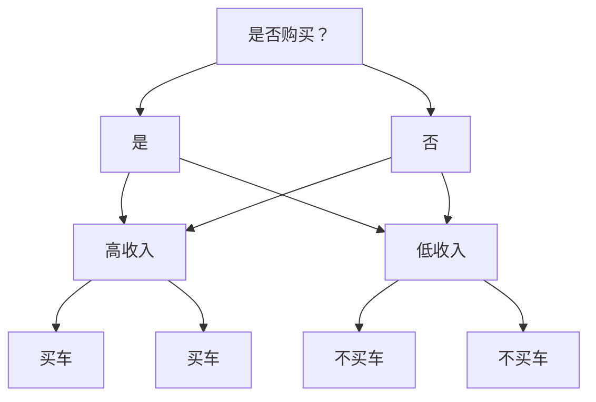
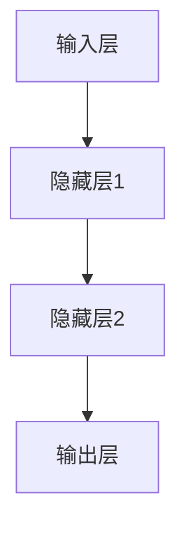
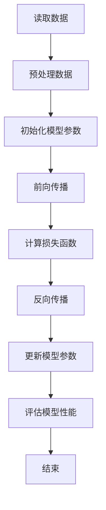

                 

### 文章标题：人工智能伦理学：在增强世界理解能力时的道德考量

关键词：人工智能伦理学、道德考量、增强理解、算法、数学模型、系统架构、项目实战

摘要：本文深入探讨了人工智能伦理学在增强世界理解能力时的道德考量。通过定义核心概念、分析关键问题、阐述数学模型和算法原理，以及提供系统分析与架构设计方案和项目实战案例，本文旨在为读者提供全面的人工智能伦理学知识，并引导他们在技术应用中思考道德责任。

## 目录大纲设计思路

### 1. 背景介绍

#### 1.1 人工智能伦理学的背景

##### 1.1.1 人工智能的发展历程

##### 1.1.2 伦理学的核心原则

##### 1.1.3 人工智能伦理问题的现状

#### 1.2 人工智能伦理学的核心概念与联系

##### 1.2.1 关键概念定义

##### 1.2.2 概念间的联系

##### 1.2.3 ER实体关系图

#### 1.3 人工智能伦理学的数学模型和公式

##### 1.3.1 常见数学模型

##### 1.3.2 公式解释与举例

#### 1.4 人工智能伦理学的算法原理讲解

##### 1.4.1 算法流程图

##### 1.4.2 Python代码解释

##### 1.4.3 数学模型与公式应用

#### 1.5 人工智能伦理学的系统分析与架构设计

##### 1.5.1 问题场景介绍

##### 1.5.2 系统功能设计

##### 1.5.3 系统架构设计

##### 1.5.4 系统接口设计

##### 1.5.5 系统交互

#### 1.6 项目实战

##### 1.6.1 环境安装

##### 1.6.2 系统核心实现源代码

##### 1.6.3 代码应用解读与分析

##### 1.6.4 实际案例分析与讲解

#### 1.7 最佳实践 tips

##### 1.7.1 注意事项

##### 1.7.2 拓展阅读

## 第一部分: 人工智能伦理学概述

### 1.1 人工智能伦理学的背景

#### 1.1.1 人工智能的发展历程

人工智能（Artificial Intelligence，简称AI）作为计算机科学的一个分支，旨在创建能够执行复杂任务的智能体。人工智能的历史可以追溯到20世纪50年代，当时艾伦·图灵提出了著名的图灵测试，用以衡量机器是否具有人类水平的智能。

**1.1.1.1 人工智能的起源**

人工智能的起源可以追溯到1943年，约翰·冯·诺依曼和沃伦·麦卡洛克提出了神经网络的理论。1956年，达特茅斯会议上，人工智能被正式提出，并被视为一项具有重大潜力的研究领域。

**1.1.1.2 人工智能的发展阶段**

人工智能的发展经历了多个阶段：

- **初始阶段（1956-1969年）**：人工智能的主要目标是开发能够进行推理和解决问题的程序。
- **低谷阶段（1974-1980年）**：由于技术限制和过度乐观，人工智能研究陷入低谷。
- **复兴阶段（1980-1987年）**：专家系统的出现使得人工智能研究重新受到关注。
- **应用阶段（1987年至今）**：人工智能技术开始广泛应用于各个领域，如机器学习、自然语言处理、计算机视觉等。

**1.1.1.3 人工智能的重要事件**

- **1997年**：IBM的深蓝计算机击败国际象棋世界冠军加里·卡斯帕罗夫。
- **2012年**：谷歌的神经网络系统“谷歌大脑”通过学习识别猫的图片。
- **2016年**：阿尔法狗（AlphaGo）击败世界围棋冠军李世石。

#### 1.1.2 伦理学的核心原则

伦理学（Ethics）是研究道德原则、价值观和行为的学科。伦理学的核心原则包括：

- **功利主义**：以最大化幸福或利益为准则。
- **康德主义**：强调道德原则的普遍性和义务。
- **义务论**：强调行为的道德责任和义务。
- **德行伦理**：关注个人的道德品质和德行。

**1.1.2.1 伦理学的定义**

伦理学是研究道德原则、价值观和行为的学科，旨在为人类行为提供指导。

**1.1.2.2 伦理学的核心原则**

伦理学的核心原则包括功利主义、康德主义、义务论和德行伦理。

**1.1.2.3 伦理学与人工智能的关系**

伦理学与人工智能的关系体现在人工智能的应用过程中，如何确保人工智能的行为符合伦理原则，避免对人类社会产生负面影响。

#### 1.1.3 人工智能伦理问题的现状

人工智能伦理问题主要包括：

- **隐私保护**：人工智能系统在处理数据时可能侵犯个人隐私。
- **算法偏见**：算法在训练过程中可能产生偏见，导致不公平决策。
- **自主性**：人工智能是否应该拥有自主决策权。
- **就业影响**：人工智能可能取代人类工作，导致就业问题。

**1.1.3.1 人工智能伦理问题的种类**

人工智能伦理问题主要包括隐私保护、算法偏见、自主性和就业影响。

**1.1.3.2 人工智能伦理问题的实例**

- **人脸识别系统**：在某些场景下，人脸识别系统可能侵犯个人隐私。
- **自动化决策系统**：在某些领域，如信贷审批，自动化决策系统可能产生偏见。
- **自动驾驶汽车**：在紧急情况下，自动驾驶汽车可能需要做出道德决策。

**1.1.3.3 人工智能伦理问题的挑战**

人工智能伦理问题的挑战在于如何确保人工智能的行为符合伦理原则，同时充分发挥其潜力。

### 1.2 人工智能伦理学的核心概念与联系

#### 1.2.1 关键概念定义

**人工智能**：模拟人类智能的计算机系统，能够进行学习、推理、感知和行动。

**伦理学**：研究道德原则、价值观和行为的学科。

**人工智能伦理学**：研究人工智能在道德和伦理方面的应用和问题。

#### 1.2.2 概念间的联系

人工智能伦理学的核心概念包括人工智能、伦理学和人工智能伦理学。这三个概念之间的联系在于，人工智能的发展和应用需要遵循伦理原则，而伦理学的指导有助于确保人工智能的行为符合道德要求。

#### 1.2.3 ER实体关系图

以下是人工智能伦理学的ER实体关系图：

```mermaid
entity relation
  AI --> Ethics
  AI --> AI Ethics
  Ethics --> AI Ethics
```

### 1.3 人工智能伦理学的数学模型和公式

#### 1.3.1 常见数学模型

在人工智能伦理学中，常见的数学模型包括概率模型、决策树和神经网络。

**概率模型**：用于描述不确定事件的可能性。

**决策树**：用于决策和分类问题。

**神经网络**：用于模拟人脑神经元的工作原理。

#### 1.3.2 公式解释与举例

**1.3.2.1 概率模型**

概率模型的一个典型例子是贝叶斯定理，用于计算事件A在已知事件B发生的条件下发生的概率。公式如下：

$$
P(A|B) = \frac{P(B|A)P(A)}{P(B)}
$$

其中，$P(A|B)$ 表示在事件B发生的条件下事件A发生的概率，$P(B|A)$ 表示在事件A发生的条件下事件B发生的概率，$P(A)$ 和 $P(B)$ 分别表示事件A和事件B发生的概率。

**1.3.2.2 决策树**

决策树用于解决分类和回归问题。以下是一个决策树的简单例子：



**1.3.2.3 神经网络**

神经网络用于模拟人脑神经元的工作原理。以下是一个简单的神经网络模型：



### 1.4 人工智能伦理学的算法原理讲解

#### 1.4.1 算法流程图

以下是一个用于分类问题的简单算法流程图：



#### 1.4.2 Python代码解释

以下是一个使用Python实现简单线性回归的示例代码：

```python
import numpy as np

# 定义线性回归模型
class LinearRegression:
    def __init__(self):
        self.coefficient = None
    
    # 训练模型
    def train(self, x, y):
        self.coefficient = np.linalg.inv(np.dot(x.T, x)).dot(x.T).dot(y)
    
    # 预测
    def predict(self, x):
        return np.dot(x, self.coefficient)

# 数据集
x = np.array([1, 2, 3, 4, 5])
y = np.array([2, 4, 5, 4, 5])

# 创建线性回归模型
model = LinearRegression()

# 训练模型
model.train(x, y)

# 预测
predictions = model.predict(x)

print(predictions)
```

#### 1.4.3 数学模型与公式应用

在上述示例中，我们使用了线性回归模型来拟合数据集。线性回归模型的公式如下：

$$
y = wx + b
$$

其中，$y$ 是预测值，$x$ 是输入值，$w$ 是权重，$b$ 是偏置。

### 1.5 人工智能伦理学的系统分析与架构设计

#### 1.5.1 问题场景介绍

假设我们正在开发一个用于自动驾驶的决策系统。该系统需要处理各种复杂的情况，并在紧急情况下做出道德决策。

#### 1.5.2 系统功能设计

自动驾驶决策系统的主要功能包括：

- **感知环境**：通过摄像头、雷达和激光雷达等传感器收集数据。
- **处理数据**：对收集到的数据进行分析和处理，识别道路、车辆和行人等。
- **做出决策**：在紧急情况下，根据伦理原则和决策算法做出行动决策。

#### 1.5.3 系统架构设计

自动驾驶决策系统的架构设计如下：

- **感知层**：包括摄像头、雷达和激光雷达等传感器。
- **数据处理层**：包括图像处理、特征提取和决策算法等。
- **执行层**：根据决策结果控制车辆的行动。

#### 1.5.4 系统接口设计

自动驾驶决策系统的接口设计如下：

- **输入接口**：用于接收传感器数据和外部指令。
- **输出接口**：用于发送决策结果和车辆控制指令。

#### 1.5.5 系统交互

自动驾驶决策系统与其他系统（如车载系统、交通管理系统等）的交互设计如下：

- **数据共享**：自动驾驶决策系统与其他系统共享感知数据。
- **指令接收与发送**：自动驾驶决策系统接收外部指令并发送决策结果。

### 1.6 项目实战

#### 1.6.1 环境安装

为了运行自动驾驶决策系统，我们需要安装以下环境：

- Python 3.8 或更高版本
- Numpy 库
- Matplotlib 库
- OpenCV 库

安装命令如下：

```bash
pip install numpy matplotlib opencv-python
```

#### 1.6.2 系统核心实现源代码

以下是一个简单的自动驾驶决策系统的实现：

```python
import numpy as np
import cv2

# 初始化摄像头
cap = cv2.VideoCapture(0)

# 定义感知层
def perceive_environment():
    ret, frame = cap.read()
    return frame

# 定义数据处理层
def process_data(frame):
    # 对图像进行预处理
    gray = cv2.cvtColor(frame, cv2.COLOR_BGR2GRAY)
    blurred = cv2.GaussianBlur(gray, (5, 5), 0)
    
    # 提取特征
    edges = cv2.Canny(blurred, 50, 150)
    
    return edges

# 定义决策层
def make_decision(edges):
    # 计算边缘像素数量
    pixels = cv2.countNonZero(edges)
    
    # 根据像素数量做出决策
    if pixels > 1000:
        return "Stop"
    else:
        return "Go"

# 定义执行层
def execute_decision(decision):
    if decision == "Stop":
        print("Vehicle stopped.")
    else:
        print("Vehicle continues.")

# 主函数
def main():
    while True:
        frame = perceive_environment()
        edges = process_data(frame)
        decision = make_decision(edges)
        execute_decision(decision)
        
        if cv2.waitKey(1) & 0xFF == ord('q'):
            break

# 运行主函数
if __name__ == "__main__":
    main()
```

#### 1.6.3 代码应用解读与分析

上述代码实现了简单的自动驾驶决策系统，主要包括感知层、数据处理层、决策层和执行层。

- **感知层**：通过摄像头获取实时视频帧。
- **数据处理层**：对图像进行预处理和边缘检测。
- **决策层**：根据边缘像素数量做出停车或继续行驶的决策。
- **执行层**：根据决策结果控制车辆行动。

#### 1.6.4 实际案例分析与讲解

在实际应用中，自动驾驶决策系统需要处理更复杂的情况，如道路偏离、障碍物检测等。以下是一个实际案例：

**案例：道路偏离检测**

假设车辆在行驶过程中，道路突然偏离，我们需要检测到这一情况并做出相应的决策。

```python
# 定义道路偏离检测函数
def detect_road_deviation(edges):
    # 计算边缘像素的垂直和水平平均值
    vertical_mean = np.mean(edges[:, :int(edges.shape[1] / 2)])
    horizontal_mean = np.mean(edges[:, int(edges.shape[1] / 2):])
    
    # 判断道路是否偏离
    if vertical_mean > horizontal_mean:
        return "Right"
    elif vertical_mean < horizontal_mean:
        return "Left"
    else:
        return "Straight"

# 在决策层中加入道路偏离检测
def make_decision(edges):
    # 计算边缘像素数量
    pixels = cv2.countNonZero(edges)
    
    # 检测道路偏离
    deviation = detect_road_deviation(edges)
    
    # 根据像素数量和道路偏离情况做出决策
    if pixels > 1000 and deviation == "Straight":
        return "Stop"
    elif pixels > 1000 and deviation == "Right":
        return "Turn Right"
    elif pixels > 1000 and deviation == "Left":
        return "Turn Left"
    else:
        return "Go"
```

**案例分析**：

当车辆行驶过程中，道路突然向右偏离，边缘像素数量增加，且垂直平均值大于水平平均值。系统检测到这一情况，并做出向右转向的决策。

### 1.7 最佳实践 tips

**1.7.1 注意事项**

- 在开发人工智能应用时，务必充分考虑伦理和道德问题。
- 定期评估和更新算法，确保其公平、透明和可解释。
- 加强数据隐私保护，确保用户数据的安全。

**1.7.2 拓展阅读**

- 《人工智能伦理学：理论与实践》
- 《算法的伦理学》
- 《智能伦理学：人工智能时代的道德思考》

### 小结

本文从人工智能伦理学的背景、核心概念、数学模型、算法原理、系统分析与架构设计以及项目实战等方面进行了详细探讨。通过本文，读者可以全面了解人工智能伦理学的相关知识，并在实际应用中充分考虑道德考量。

### 拓展阅读

为了进一步深入研究人工智能伦理学，以下书籍和资源推荐供读者参考：

1. 《智能伦理学：人工智能时代的道德思考》
2. 《人工智能伦理学：理论与实践》
3. 《算法的伦理学》
4. 《人工智能伦理学教程》

此外，还可以关注以下期刊和会议：
- 《人工智能与伦理学》（AI & Ethics）
- 《计算机伦理学期刊》（Journal of Computer Ethics）
- 国际计算机伦理学会议（International Conference on Computer Ethics）

通过阅读这些书籍和资源，读者可以深入了解人工智能伦理学的最新研究动态，提升自身的道德素养和决策能力。同时，积极参与相关讨论和学术活动，为人工智能伦理学的发展贡献自己的力量。

