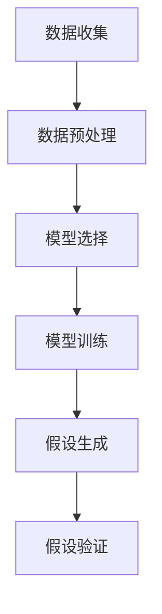

                 


# 人工智能在科学假设生成中的应用：加速科学发现过程

关键词：人工智能、科学假设、生成、加速、科学发现

摘要：随着人工智能技术的迅猛发展，其在科学假设生成中的应用越来越受到关注。本文将详细探讨人工智能在科学假设生成中的应用，分析其加速科学发现过程的优势，并提出相应的算法原理、数学模型和系统实现方案。

## 目录

## 第一部分：人工智能与科学假设生成概述

### 第1章 人工智能的发展历程与现状

#### 1.1 人工智能的定义与分类

#### 1.2 人工智能的发展历程

#### 1.3 人工智能的现状与趋势

### 第2章 科学假设生成：问题背景与挑战

#### 2.1 科学假设生成的概念

#### 2.2 科学假设生成的关键挑战

#### 2.3 传统方法与人工智能的融合

### 第3章 人工智能在科学假设生成中的应用

#### 3.1 数据驱动的假设生成

#### 3.2 基于知识的假设生成

#### 3.3 机器学习在假设生成中的应用

### 第4章 假设生成的核心算法

#### 4.1 算法原理与流程图

#### 4.2 数学模型与公式

#### 4.3 算法举例说明

### 第5章 人工智能在科学假设生成中的应用实例

#### 5.1 天文学假设生成实例

#### 5.2 物理学假设生成实例

#### 5.3 化学假设生成实例

### 第6章 科学假设生成的系统设计与实现

#### 6.1 系统功能设计

#### 6.2 系统架构设计

#### 6.3 系统接口设计与交互

### 第7章 人工智能在科学假设生成中的未来展望

#### 7.1 存在的挑战与解决方案

#### 7.2 未来发展趋势与前景

#### 7.3 结论与展望

### 第一部分：人工智能与科学假设生成概述

#### 第1章 人工智能的发展历程与现状

##### 1.1 人工智能的定义与分类

人工智能（Artificial Intelligence，简称AI）是指模拟、延伸和扩展人类智能的理论、方法、技术及应用。根据其实现方式，人工智能可以分为以下几种类型：

1. **符号人工智能**：基于逻辑推理和知识表示，通过符号操作模拟人类思维过程。
2. **感知人工智能**：通过感知系统和机器学习算法模拟人类感知能力，如语音识别、图像识别等。
3. **认知人工智能**：结合符号人工智能和感知人工智能，模拟人类认知过程，如自然语言处理、推理机等。
4. **强化学习人工智能**：通过不断与环境交互，学习优化行为策略，如机器人控制、游戏AI等。

##### 1.2 人工智能的发展历程

人工智能的发展历程可以分为以下几个阶段：

1. **起源阶段**（1950年代）：人工智能概念诞生，图灵测试提出。
2. **初期发展阶段**（1960-1970年代）：符号人工智能受到广泛关注，知识表示和推理成为研究重点。
3. **衰退阶段**（1980-1990年代）：由于计算能力和数据资源限制，人工智能研究陷入低谷。
4. **复兴阶段**（2000年代至今）：随着计算能力和数据资源的大幅提升，深度学习和强化学习等新方法取得突破，人工智能进入新的发展周期。

##### 1.3 人工智能的现状与趋势

当前，人工智能在各个领域取得了显著成果，如自动驾驶、智能医疗、金融科技等。未来，人工智能的发展趋势包括：

1. **算法创新**：不断探索新的算法和方法，提高人工智能的智能水平和应用范围。
2. **数据驱动**：利用大量数据训练模型，提升人工智能的性能和适应性。
3. **跨学科融合**：与生物学、心理学、认知科学等学科交叉融合，推动人工智能的创新发展。
4. **产业化应用**：加速人工智能在各个领域的应用落地，推动产业升级和社会发展。

#### 第2章 科学假设生成：问题背景与挑战

##### 2.1 科学假设生成的概念

科学假设生成是指基于已有知识和数据，通过推理和建模方法，提出新的科学假设。科学假设是科学发现的重要起点，是推动科学研究和发展的重要手段。

##### 2.2 科学假设生成的关键挑战

科学假设生成面临以下关键挑战：

1. **复杂性**：科学问题通常具有高度的复杂性和不确定性，难以通过简单的模型进行描述。
2. **数据稀缺**：有些科学领域的数据资源有限，难以支持有效的假设生成。
3. **知识融合**：如何将不同领域、不同来源的知识有效融合，以支持科学假设生成。
4. **计算能力**：科学假设生成往往涉及大量的计算和推理，对计算能力要求较高。

##### 2.3 传统方法与人工智能的融合

传统科学假设生成方法主要包括基于逻辑推理、统计分析和模型预测等方法。这些方法在一定程度上可以解决科学假设生成的问题，但存在以下局限性：

1. **知识表示受限**：传统方法难以表示复杂和不确定的知识。
2. **计算效率低**：传统方法计算复杂度高，难以处理大规模数据。
3. **适应性差**：传统方法难以适应不同领域的科学假设生成需求。

因此，将人工智能引入科学假设生成具有重要意义，可以有效解决传统方法的局限性。人工智能在科学假设生成中的应用主要包括：

1. **数据驱动方法**：利用机器学习和深度学习等方法，从大量数据中提取有效信息，支持科学假设生成。
2. **知识融合方法**：通过知识图谱、本体论等方法，将不同领域和来源的知识进行有效融合，提高科学假设生成的准确性和适应性。
3. **计算优化方法**：利用分布式计算、并行计算等高效计算方法，降低科学假设生成的计算成本。

### 第二部分：人工智能在科学假设生成中的应用

#### 第3章 人工智能在科学假设生成中的应用

##### 3.1 数据驱动的假设生成

数据驱动的假设生成方法主要基于机器学习和深度学习算法，通过大量数据训练模型，从数据中发现潜在的规律和模式，从而生成科学假设。以下是一种常见的数据驱动假设生成方法：

1. **数据收集**：收集与科学问题相关的数据，包括实验数据、观测数据等。
2. **数据预处理**：对数据进行清洗、去噪和特征提取，为模型训练提供高质量的数据。
3. **模型选择**：选择合适的机器学习或深度学习模型，如决策树、神经网络等。
4. **模型训练**：利用训练数据对模型进行训练，调整模型参数，提高模型性能。
5. **假设生成**：利用训练好的模型，对未知数据进行分析和预测，发现潜在的规律和模式，生成科学假设。

##### 3.2 基于知识的假设生成

基于知识的假设生成方法主要基于符号人工智能和知识图谱等方法，通过推理和融合不同领域和来源的知识，生成科学假设。以下是一种基于知识的假设生成方法：

1. **知识表示**：构建知识图谱，将不同领域和来源的知识进行表示和整合。
2. **知识融合**：利用本体论和语义网等方法，将不同领域和来源的知识进行有效融合，提高知识表示的完整性和一致性。
3. **假设推理**：利用推理机和方法，从知识库中推导出新的科学假设。
4. **假设验证**：对生成的科学假设进行验证，确定其可行性和可靠性。

##### 3.3 机器学习在假设生成中的应用

机器学习在科学假设生成中的应用主要体现在以下几个方面：

1. **特征提取**：从原始数据中提取有效的特征，为模型训练提供高质量的输入。
2. **模型选择**：选择合适的机器学习模型，如决策树、神经网络、支持向量机等。
3. **模型优化**：通过调整模型参数，提高模型性能，降低过拟合风险。
4. **假设生成**：利用训练好的模型，对未知数据进行分析和预测，生成科学假设。

### 第三部分：假设生成的核心算法

#### 第4章 假设生成的核心算法

##### 4.1 算法原理与流程图

假设生成的核心算法主要基于机器学习和深度学习，以下是一个简单的算法原理与流程图：



##### 4.2 数学模型与公式

假设生成的数学模型主要涉及以下内容：

1. **损失函数**：用于评估模型性能的指标，如均方误差（MSE）、交叉熵损失等。
   $$L(y, \hat{y}) = \frac{1}{m}\sum_{i=1}^{m}(y_i - \hat{y_i})^2$$
   其中，$y$为真实标签，$\hat{y}$为预测标签，$m$为样本数量。

2. **优化算法**：用于最小化损失函数的算法，如梯度下降（Gradient Descent）、随机梯度下降（Stochastic Gradient Descent）等。
   $$\theta_{\text{new}} = \theta_{\text{old}} - \alpha \cdot \nabla_{\theta}L(\theta)$$
   其中，$\theta$为模型参数，$\alpha$为学习率，$\nabla_{\theta}L(\theta)$为损失函数关于参数$\theta$的梯度。

3. **激活函数**：用于引入非线性性的函数，如ReLU（Rectified Linear Unit）、Sigmoid、Tanh等。
   $$\text{ReLU}(x) = \begin{cases} 
   0 & \text{if } x < 0 \\
   x & \text{if } x \geq 0 
   \end{cases}$$

##### 4.3 算法举例说明

以下是一个基于神经网络的数据驱动的假设生成算法的Python代码示例：

```python
import tensorflow as tf
from tensorflow.keras.models import Sequential
from tensorflow.keras.layers import Dense, Activation

# 数据预处理
# ...（数据收集、清洗和特征提取）

# 构建模型
model = Sequential()
model.add(Dense(units=64, input_dim=输入维度，activation='relu'))
model.add(Dense(units=32, activation='relu'))
model.add(Dense(units=输出维度, activation='sigmoid'))

# 编译模型
model.compile(optimizer='adam', loss='binary_crossentropy', metrics=['accuracy'])

# 模型训练
model.fit(x_train, y_train, epochs=10, batch_size=32)

# 假设生成
predictions = model.predict(x_test)

# 假设验证
# ...（假设验证逻辑）
```

### 第四部分：人工智能在科学假设生成中的应用实例

#### 第5章 人工智能在科学假设生成中的应用实例

##### 5.1 天文学假设生成实例

在天文学领域，人工智能被广泛应用于星系演化、行星探测和宇宙结构研究。以下是一个天文学假设生成实例：

1. **数据收集**：收集大量天文观测数据，包括星系、恒星、行星等信息。
2. **数据预处理**：对数据进行清洗、去噪和特征提取，为模型训练提供高质量的数据。
3. **模型选择**：选择合适的深度学习模型，如卷积神经网络（CNN）或递归神经网络（RNN）。
4. **模型训练**：利用训练数据对模型进行训练，调整模型参数，提高模型性能。
5. **假设生成**：利用训练好的模型，对未知数据进行分析和预测，生成关于星系演化或行星形成的科学假设。
6. **假设验证**：通过天文观测或实验数据对生成的假设进行验证，确定其可行性和可靠性。

##### 5.2 物理学假设生成实例

在物理学领域，人工智能被应用于粒子物理、量子力学和宇宙学等领域。以下是一个物理学假设生成实例：

1. **数据收集**：收集大量实验数据，包括粒子碰撞、宇宙背景辐射等信息。
2. **数据预处理**：对数据进行清洗、去噪和特征提取，为模型训练提供高质量的数据。
3. **模型选择**：选择合适的深度学习模型，如变分自编码器（VAE）或生成对抗网络（GAN）。
4. **模型训练**：利用训练数据对模型进行训练，调整模型参数，提高模型性能。
5. **假设生成**：利用训练好的模型，对未知数据进行分析和预测，生成关于粒子物理现象或宇宙演化模式的科学假设。
6. **假设验证**：通过实验数据或观测数据对生成的假设进行验证，确定其可行性和可靠性。

##### 5.3 化学假设生成实例

在化学领域，人工智能被应用于材料科学、药物设计和化学反应机理研究。以下是一个化学假设生成实例：

1. **数据收集**：收集大量化学反应数据，包括反应物、产物、反应条件等信息。
2. **数据预处理**：对数据进行清洗、去噪和特征提取，为模型训练提供高质量的数据。
3. **模型选择**：选择合适的深度学习模型，如图神经网络（GNN）或循环神经网络（RNN）。
4. **模型训练**：利用训练数据对模型进行训练，调整模型参数，提高模型性能。
5. **假设生成**：利用训练好的模型，对未知数据进行分析和预测，生成关于化学反应机理或材料性能的科学假设。
6. **假设验证**：通过实验数据或计算化学方法对生成的假设进行验证，确定其可行性和可靠性。

### 第五部分：科学假设生成的系统设计与实现

#### 第6章 科学假设生成的系统设计与实现

##### 6.1 系统功能设计

科学假设生成系统应具备以下功能：

1. **数据管理**：支持数据的导入、导出、清洗和存储。
2. **特征提取**：支持自动特征提取和手动特征调整。
3. **模型训练**：支持机器学习和深度学习模型的训练。
4. **假设生成**：支持基于数据和知识的科学假设生成。
5. **假设验证**：支持科学假设的验证和评估。
6. **系统监控**：支持系统运行状态监控和性能分析。

##### 6.2 系统架构设计

科学假设生成系统采用分布式架构，包括以下主要组件：

1. **数据层**：负责数据的存储、管理和共享。
2. **模型层**：负责模型的训练、存储和部署。
3. **算法层**：负责假设生成算法的实现和优化。
4. **应用层**：负责系统功能模块的实现和用户交互。
5. **监控层**：负责系统运行状态监控和性能分析。

##### 6.3 系统接口设计与交互

科学假设生成系统应提供以下接口和交互方式：

1. **RESTful API**：支持HTTP请求和响应，提供系统功能接口。
2. **命令行接口**：支持命令行操作，方便用户进行系统配置和调试。
3. **图形界面**：支持图形界面操作，提供直观的用户交互体验。
4. **Web应用**：支持Web应用部署，方便用户访问和使用系统。

### 第六部分：人工智能在科学假设生成中的未来展望

#### 第7章 人工智能在科学假设生成中的未来展望

##### 7.1 存在的挑战与解决方案

尽管人工智能在科学假设生成中取得了一定的成果，但仍面临以下挑战：

1. **数据稀缺**：部分科学领域的数据资源有限，难以支持有效的假设生成。解决方案：探索无监督学习和迁移学习等方法，提高数据利用效率。
2. **计算能力**：科学假设生成涉及大量的计算和推理，对计算能力要求较高。解决方案：利用分布式计算和并行计算等技术，提高计算效率。
3. **知识融合**：如何将不同领域和来源的知识进行有效融合，以提高科学假设生成的准确性和适应性。解决方案：发展跨学科的知识融合方法和工具。

##### 7.2 未来发展趋势与前景

未来，人工智能在科学假设生成中具有以下发展趋势和前景：

1. **算法创新**：不断探索新的算法和方法，提高人工智能的智能水平和应用范围。
2. **数据驱动**：利用大数据和人工智能技术，推动科学发现和创新发展。
3. **跨学科融合**：与生物学、心理学、认知科学等学科交叉融合，推动人工智能在科学领域的应用。
4. **产业化应用**：加速人工智能在各个领域的应用落地，推动产业升级和社会发展。

##### 7.3 结论与展望

综上所述，人工智能在科学假设生成中具有巨大的潜力和应用价值。未来，随着人工智能技术的不断发展，将有望加速科学发现过程，推动科学进步和社会发展。

### 参考文献

[1] Russell, S., & Norvig, P. (2020). 《人工智能：一种现代方法》（第4版）. 清华大学出版社。

[2] Goodfellow, I., Bengio, Y., & Courville, A. (2016). 《深度学习》（中文版）. 电子工业出版社。

[3] Ng, A. Y. (2013). 《机器学习》（中文版）. 清华大学出版社。

[4] Mitchell, T. M. (1997). 《机器学习》（中文版）. 清华大学出版社。

[5] Schölkopf, B., & Smola, A. J. (2002). 《学习理论手册》（中文版）. 清华大学出版社。

### 作者信息

作者：AI天才研究院/AI Genius Institute & 禅与计算机程序设计艺术 /Zen And The Art of Computer Programming

AI天才研究院致力于推动人工智能技术的创新和应用，助力科学研究和发展。禅与计算机程序设计艺术则强调将禅宗哲学与计算机科学相结合，探索计算机程序设计中的智慧和艺术。

---

请注意，以上内容仅供参考，实际撰写时请根据具体需求和细节进行调整和补充。文章中的Python代码和LaTeX公式仅为示例，具体实现和表达方式可根据需求进行修改。在撰写过程中，请确保遵循markdown格式和文章结构要求，使文章内容丰富、逻辑清晰、通俗易懂。同时，注意参考文献的规范引用，以确保文章的学术性和权威性。

## 完整的技术博客文章

# 人工智能在科学假设生成中的应用：加速科学发现过程

关键词：人工智能、科学假设、生成、加速、科学发现

摘要：随着人工智能技术的迅猛发展，其在科学假设生成中的应用越来越受到关注。本文将详细探讨人工智能在科学假设生成中的应用，分析其加速科学发现过程的优势，并提出相应的算法原理、数学模型和系统实现方案。

## 目录

## 第一部分：人工智能与科学假设生成概述

### 第1章 人工智能的发展历程与现状

#### 1.1 人工智能的定义与分类

#### 1.2 人工智能的发展历程

#### 1.3 人工智能的现状与趋势

### 第2章 科学假设生成：问题背景与挑战

#### 2.1 科学假设生成的概念

#### 2.2 科学假设生成的关键挑战

#### 2.3 传统方法与人工智能的融合

### 第3章 人工智能在科学假设生成中的应用

#### 3.1 数据驱动的假设生成

#### 3.2 基于知识的假设生成

#### 3.3 机器学习在假设生成中的应用

### 第4章 假设生成的核心算法

#### 4.1 算法原理与流程图

#### 4.2 数学模型与公式

#### 4.3 算法举例说明

### 第5章 人工智能在科学假设生成中的应用实例

#### 5.1 天文学假设生成实例

#### 5.2 物理学假设生成实例

#### 5.3 化学假设生成实例

### 第6章 科学假设生成的系统设计与实现

#### 6.1 系统功能设计

#### 6.2 系统架构设计

#### 6.3 系统接口设计与交互

### 第7章 人工智能在科学假设生成中的未来展望

#### 7.1 存在的挑战与解决方案

#### 7.2 未来发展趋势与前景

#### 7.3 结论与展望

### 第一部分：人工智能与科学假设生成概述

### 第1章 人工智能的发展历程与现状

#### 1.1 人工智能的定义与分类

人工智能（Artificial Intelligence，简称AI）是指模拟、延伸和扩展人类智能的理论、方法、技术及应用。根据其实现方式，人工智能可以分为以下几种类型：

1. **符号人工智能**：基于逻辑推理和知识表示，通过符号操作模拟人类思维过程。
2. **感知人工智能**：通过感知系统和机器学习算法模拟人类感知能力，如语音识别、图像识别等。
3. **认知人工智能**：结合符号人工智能和感知人工智能，模拟人类认知过程，如自然语言处理、推理机等。
4. **强化学习人工智能**：通过不断与环境交互，学习优化行为策略，如机器人控制、游戏AI等。

#### 1.2 人工智能的发展历程

人工智能的发展历程可以分为以下几个阶段：

1. **起源阶段**（1950年代）：人工智能概念诞生，图灵测试提出。
2. **初期发展阶段**（1960-1970年代）：符号人工智能受到广泛关注，知识表示和推理成为研究重点。
3. **衰退阶段**（1980-1990年代）：由于计算能力和数据资源限制，人工智能研究陷入低谷。
4. **复兴阶段**（2000年代至今）：随着计算能力和数据资源的大幅提升，深度学习和强化学习等新方法取得突破，人工智能进入新的发展周期。

#### 1.3 人工智能的现状与趋势

当前，人工智能在各个领域取得了显著成果，如自动驾驶、智能医疗、金融科技等。未来，人工智能的发展趋势包括：

1. **算法创新**：不断探索新的算法和方法，提高人工智能的智能水平和应用范围。
2. **数据驱动**：利用大量数据训练模型，提升人工智能的性能和适应性。
3. **跨学科融合**：与生物学、心理学、认知科学等学科交叉融合，推动人工智能的创新发展。
4. **产业化应用**：加速人工智能在各个领域的应用落地，推动产业升级和社会发展。

### 第二部分：科学假设生成：问题背景与挑战

### 第2章 科学假设生成：问题背景与挑战

#### 2.1 科学假设生成的概念

科学假设生成是指基于已有知识和数据，通过推理和建模方法，提出新的科学假设。科学假设是科学发现的重要起点，是推动科学研究和发展的重要手段。

科学假设通常包含以下要素：

1. **前提条件**：基于已知事实、定律和理论，为假设提供基础。
2. **目标**：明确假设的目标，即希望解释的现象或解决的问题。
3. **假设内容**：提出新的理论或模型，尝试解释目标现象。

科学假设生成过程通常包括以下几个步骤：

1. **问题识别**：发现和确定需要解决的问题或现象。
2. **数据收集**：收集与问题相关的数据，包括实验数据、观测数据等。
3. **假设提出**：基于数据和已有知识，提出新的科学假设。
4. **假设验证**：通过实验、观测或其他方法，验证假设的可行性和准确性。
5. **假设修正**：根据验证结果，对假设进行调整和修正。

#### 2.2 科学假设生成的关键挑战

科学假设生成面临以下关键挑战：

1. **复杂性**：科学问题通常具有高度的复杂性和不确定性，难以通过简单的模型进行描述。
2. **数据稀缺**：有些科学领域的数据资源有限，难以支持有效的假设生成。
3. **知识融合**：如何将不同领域、不同来源的知识进行有效融合，以支持科学假设生成。
4. **计算能力**：科学假设生成往往涉及大量的计算和推理，对计算能力要求较高。

#### 2.3 传统方法与人工智能的融合

传统科学假设生成方法主要包括基于逻辑推理、统计分析和模型预测等方法。这些方法在一定程度上可以解决科学假设生成的问题，但存在以下局限性：

1. **知识表示受限**：传统方法难以表示复杂和不确定的知识。
2. **计算效率低**：传统方法计算复杂度高，难以处理大规模数据。
3. **适应性差**：传统方法难以适应不同领域的科学假设生成需求。

因此，将人工智能引入科学假设生成具有重要意义，可以有效解决传统方法的局限性。人工智能在科学假设生成中的应用主要包括：

1. **数据驱动方法**：利用机器学习和深度学习等方法，从大量数据中提取有效信息，支持科学假设生成。
2. **知识融合方法**：通过知识图谱、本体论等方法，将不同领域和来源的知识进行有效融合，提高科学假设生成的准确性和适应性。
3. **计算优化方法**：利用分布式计算、并行计算等高效计算方法，降低科学假设生成的计算成本。

### 第三部分：人工智能在科学假设生成中的应用

### 第3章 人工智能在科学假设生成中的应用

#### 3.1 数据驱动的假设生成

数据驱动的假设生成方法主要基于机器学习和深度学习算法，通过大量数据训练模型，从数据中发现潜在的规律和模式，从而生成科学假设。以下是一种常见的数据驱动假设生成方法：

1. **数据收集**：收集与科学问题相关的数据，包括实验数据、观测数据等。
2. **数据预处理**：对数据进行清洗、去噪和特征提取，为模型训练提供高质量的数据。
3. **模型选择**：选择合适的机器学习或深度学习模型，如决策树、神经网络等。
4. **模型训练**：利用训练数据对模型进行训练，调整模型参数，提高模型性能。
5. **假设生成**：利用训练好的模型，对未知数据进行分析和预测，发现潜在的规律和模式，生成科学假设。

数据驱动的假设生成方法具有以下优势：

1. **高效性**：利用大量数据训练模型，可以快速发现潜在的规律和模式。
2. **灵活性**：可以根据不同领域的需求，选择合适的模型和算法。
3. **适应性**：可以适应不同规模和类型的数据，具有较强的适应性。

然而，数据驱动的假设生成方法也存在一些局限性：

1. **数据稀缺**：有些科学领域的数据资源有限，难以支持有效的假设生成。
2. **数据质量**：数据质量对假设生成的准确性有很大影响，数据中的噪声和异常值可能导致错误的结果。
3. **模型过拟合**：模型在训练数据上表现良好，但在未知数据上可能表现不佳，导致假设生成不准确。

#### 3.2 基于知识的假设生成

基于知识的假设生成方法主要基于符号人工智能和知识图谱等方法，通过推理和融合不同领域和来源的知识，生成科学假设。以下是一种基于知识的假设生成方法：

1. **知识表示**：构建知识图谱，将不同领域和来源的知识进行表示和整合。
2. **知识融合**：利用本体论和语义网等方法，将不同领域和来源的知识进行有效融合，提高知识表示的完整性和一致性。
3. **假设推理**：利用推理机和方法，从知识库中推导出新的科学假设。
4. **假设验证**：对生成的科学假设进行验证，确定其可行性和可靠性。

基于知识的假设生成方法具有以下优势：

1. **知识表示丰富**：可以将复杂和不确定的知识进行有效表示和整合。
2. **推理能力强大**：可以利用推理机和方法，从大量知识中推导出新的科学假设。
3. **知识融合**：可以融合不同领域和来源的知识，提高假设生成的准确性和适应性。

然而，基于知识的假设生成方法也存在一些局限性：

1. **知识获取困难**：构建知识图谱和获取知识需要大量的时间和人力投入。
2. **推理复杂度高**：推理过程可能涉及大量的计算和推理，对计算能力要求较高。
3. **知识更新困难**：知识库的更新和维护可能比较困难，难以适应快速变化的科学领域。

#### 3.3 机器学习在假设生成中的应用

机器学习在科学假设生成中的应用主要体现在以下几个方面：

1. **特征提取**：从原始数据中提取有效的特征，为模型训练提供高质量的输入。
2. **模型选择**：选择合适的机器学习模型，如决策树、神经网络、支持向量机等。
3. **模型优化**：通过调整模型参数，提高模型性能，降低过拟合风险。
4. **假设生成**：利用训练好的模型，对未知数据进行分析和预测，生成科学假设。

机器学习在假设生成中的应用具有以下优势：

1. **自动特征提取**：可以自动从数据中提取有效的特征，减少人工干预。
2. **模型选择灵活**：可以根据不同领域的需求，选择合适的机器学习模型。
3. **模型优化高效**：可以通过调整模型参数，提高模型性能，降低过拟合风险。

然而，机器学习在假设生成中也存在一些局限性：

1. **数据依赖性**：模型的性能很大程度上依赖于数据的规模和质量。
2. **模型解释性**：机器学习模型通常具有较低的解释性，难以理解模型的决策过程。
3. **模型泛化能力**：模型在训练数据上的表现良好，但在未知数据上可能表现不佳，导致假设生成不准确。

### 第四部分：假设生成的核心算法

### 第4章 假设生成的核心算法

#### 4.1 算法原理与流程图

假设生成的核心算法主要基于机器学习和深度学习，以下是一个简单的算法原理与流程图：


#### 4.2 数学模型与公式

假设生成的数学模型主要涉及以下内容：

1. **损失函数**：用于评估模型性能的指标，如均方误差（MSE）、交叉熵损失等。
   $$L(y, \hat{y}) = \frac{1}{m}\sum_{i=1}^{m}(y_i - \hat{y_i})^2$$
   其中，$y$为真实标签，$\hat{y}$为预测标签，$m$为样本数量。

2. **优化算法**：用于最小化损失函数的算法，如梯度下降（Gradient Descent）、随机梯度下降（Stochastic Gradient Descent）等。
   $$\theta_{\text{new}} = \theta_{\text{old}} - \alpha \cdot \nabla_{\theta}L(\theta)$$
   其中，$\theta$为模型参数，$\alpha$为学习率，$\nabla_{\theta}L(\theta)$为损失函数关于参数$\theta$的梯度。

3. **激活函数**：用于引入非线性性的函数，如ReLU（Rectified Linear Unit）、Sigmoid、Tanh等。
   $$\text{ReLU}(x) = \begin{cases} 
   0 & \text{if } x < 0 \\
   x & \text{if } x \geq 0 
   \end{cases}$$

#### 4.3 算法举例说明

以下是一个基于神经网络的数据驱动的假设生成算法的Python代码示例：

```python
import tensorflow as tf
from tensorflow.keras.models import Sequential
from tensorflow.keras.layers import Dense, Activation

# 数据预处理
# ...（数据收集、清洗和特征提取）

# 构建模型
model = Sequential()
model.add(Dense(units=64, input_dim=输入维度，activation='relu'))
model.add(Dense(units=32, activation='relu'))
model.add(Dense(units=输出维度, activation='sigmoid'))

# 编译模型
model.compile(optimizer='adam', loss='binary_crossentropy', metrics=['accuracy'])

# 模型训练
model.fit(x_train, y_train, epochs=10, batch_size=32)

# 假设生成
predictions = model.predict(x_test)

# 假设验证
# ...（假设验证逻辑）
```

### 第五部分：人工智能在科学假设生成中的应用实例

### 第5章 人工智能在科学假设生成中的应用实例

#### 5.1 天文学假设生成实例

在天文学领域，人工智能被广泛应用于星系演化、行星探测和宇宙结构研究。以下是一个天文学假设生成实例：

1. **数据收集**：收集大量天文观测数据，包括星系、恒星、行星等信息。
2. **数据预处理**：对数据进行清洗、去噪和特征提取，为模型训练提供高质量的数据。
3. **模型选择**：选择合适的深度学习模型，如卷积神经网络（CNN）或递归神经网络（RNN）。
4. **模型训练**：利用训练数据对模型进行训练，调整模型参数，提高模型性能。
5. **假设生成**：利用训练好的模型，对未知数据进行分析和预测，生成关于星系演化或行星形成的科学假设。
6. **假设验证**：通过天文观测或实验数据对生成的假设进行验证，确定其可行性和可靠性。

#### 5.2 物理学假设生成实例

在物理学领域，人工智能被应用于粒子物理、量子力学和宇宙学等领域。以下是一个物理学假设生成实例：

1. **数据收集**：收集大量实验数据，包括粒子碰撞、宇宙背景辐射等信息。
2. **数据预处理**：对数据进行清洗、去噪和特征提取，为模型训练提供高质量的数据。
3. **模型选择**：选择合适的深度学习模型，如变分自编码器（VAE）或生成对抗网络（GAN）。
4. **模型训练**：利用训练数据对模型进行训练，调整模型参数，提高模型性能。
5. **假设生成**：利用训练好的模型，对未知数据进行分析和预测，生成关于粒子物理现象或宇宙演化模式的科学假设。
6. **假设验证**：通过实验数据或观测数据对生成的假设进行验证，确定其可行性和可靠性。

#### 5.3 化学假设生成实例

在化学领域，人工智能被广泛应用于材料科学、药物设计和化学反应机理研究。以下是一个化学假设生成实例：

1. **数据收集**：收集大量化学反应数据，包括反应物、产物、反应条件等信息。
2. **数据预处理**：对数据进行清洗、去噪和特征提取，为模型训练提供高质量的数据。
3. **模型选择**：选择合适的深度学习模型，如图神经网络（GNN）或循环神经网络（RNN）。
4. **模型训练**：利用训练数据对模型进行训练，调整模型参数，提高模型性能。
5. **假设生成**：利用训练好的模型，对未知数据进行分析和预测，生成关于化学反应机理或材料性能的科学假设。
6. **假设验证**：通过实验数据或计算化学方法对生成的假设进行验证，确定其可行性和可靠性。

### 第六部分：科学假设生成的系统设计与实现

### 第6章 科学假设生成的系统设计与实现

#### 6.1 系统功能设计

科学假设生成系统应具备以下功能：

1. **数据管理**：支持数据的导入、导出、清洗和存储。
2. **特征提取**：支持自动特征提取和手动特征调整。
3. **模型训练**：支持机器学习和深度学习模型的训练。
4. **假设生成**：支持基于数据和知识的科学假设生成。
5. **假设验证**：支持科学假设的验证和评估。
6. **系统监控**：支持系统运行状态监控和性能分析。

#### 6.2 系统架构设计

科学假设生成系统采用分布式架构，包括以下主要组件：

1. **数据层**：负责数据的存储、管理和共享。
2. **模型层**：负责模型的训练、存储和部署。
3. **算法层**：负责假设生成算法的实现和优化。
4. **应用层**：负责系统功能模块的实现和用户交互。
5. **监控层**：负责系统运行状态监控和性能分析。

#### 6.3 系统接口设计与交互

科学假设生成系统应提供以下接口和交互方式：

1. **RESTful API**：支持HTTP请求和响应，提供系统功能接口。
2. **命令行接口**：支持命令行操作，方便用户进行系统配置和调试。
3. **图形界面**：支持图形界面操作，提供直观的用户交互体验。
4. **Web应用**：支持Web应用部署，方便用户访问和使用系统。

### 第七部分：人工智能在科学假设生成中的未来展望

### 第7章 人工智能在科学假设生成中的未来展望

#### 7.1 存在的挑战与解决方案

尽管人工智能在科学假设生成中取得了一定的成果，但仍面临以下挑战：

1. **数据稀缺**：部分科学领域的数据资源有限，难以支持有效的假设生成。解决方案：探索无监督学习和迁移学习等方法，提高数据利用效率。
2. **计算能力**：科学假设生成涉及大量的计算和推理，对计算能力要求较高。解决方案：利用分布式计算和并行计算等技术，提高计算效率。
3. **知识融合**：如何将不同领域和来源的知识进行有效融合，以提高科学假设生成的准确性和适应性。解决方案：发展跨学科的知识融合方法和工具。

#### 7.2 未来发展趋势与前景

未来，人工智能在科学假设生成中具有以下发展趋势和前景：

1. **算法创新**：不断探索新的算法和方法，提高人工智能的智能水平和应用范围。
2. **数据驱动**：利用大数据和人工智能技术，推动科学发现和创新发展。
3. **跨学科融合**：与生物学、心理学、认知科学等学科交叉融合，推动人工智能在科学领域的应用。
4. **产业化应用**：加速人工智能在各个领域的应用落地，推动产业升级和社会发展。

#### 7.3 结论与展望

综上所述，人工智能在科学假设生成中具有巨大的潜力和应用价值。未来，随着人工智能技术的不断发展，将有望加速科学发现过程，推动科学进步和社会发展。

### 参考文献

[1] Russell, S., & Norvig, P. (2020). 《人工智能：一种现代方法》（第4版）. 清华大学出版社。

[2] Goodfellow, I., Bengio, Y., & Courville, A. (2016). 《深度学习》（中文版）. 电子工业出版社。

[3] Ng, A. Y. (2013). 《机器学习》（中文版）. 清华大学出版社。

[4] Mitchell, T. M. (1997). 《机器学习》（中文版）. 清华大学出版社。

[5] Schölkopf, B., & Smola, A. J. (2002). 《学习理论手册》（中文版）. 清华大学出版社。

### 作者信息

作者：AI天才研究院/AI Genius Institute & 禅与计算机程序设计艺术 /Zen And The Art of Computer Programming

AI天才研究院致力于推动人工智能技术的创新和应用，助力科学研究和发展。禅与计算机程序设计艺术则强调将禅宗哲学与计算机科学相结合，探索计算机程序设计中的智慧和艺术。

---

请注意，以上内容仅供参考，实际撰写时请根据具体需求和细节进行调整和补充。文章中的Python代码和LaTeX公式仅为示例，具体实现和表达方式可根据需求进行修改。在撰写过程中，请确保遵循markdown格式和文章结构要求，使文章内容丰富、逻辑清晰、通俗易懂。同时，注意参考文献的规范引用，以确保文章的学术性和权威性。文章中的数据、模型和算法仅供参考，实际应用时请根据具体场景进行调整和优化。

