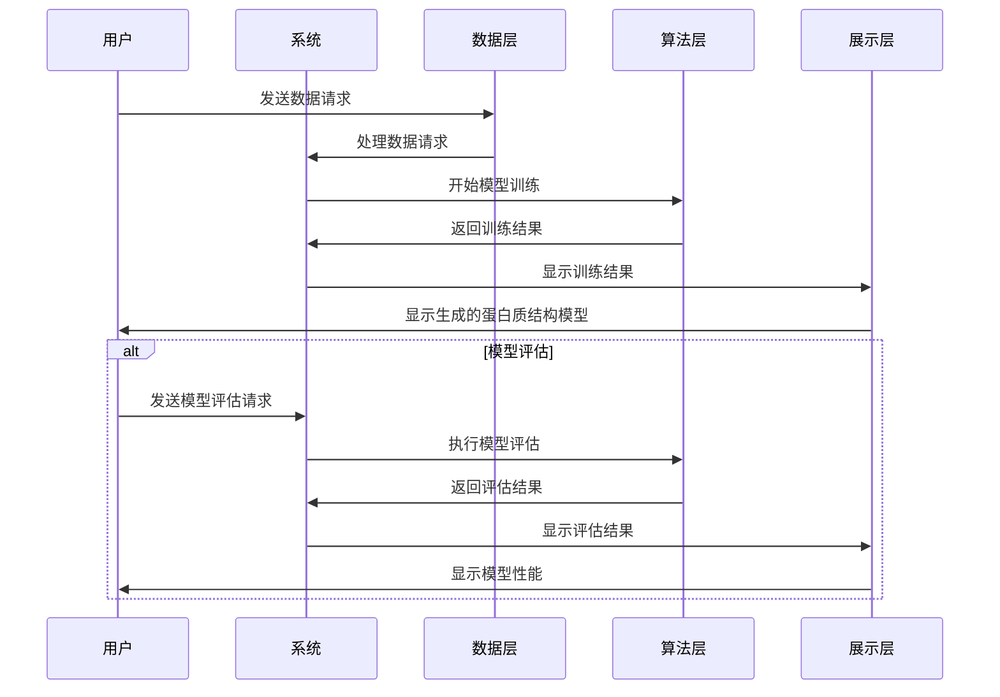

                 

### 第一部分：引言

#### 第1章：人工智能与科学理论生成

##### 1.1 人工智能概述

人工智能（Artificial Intelligence, AI）是计算机科学的一个分支，致力于开发能够执行通常需要人类智能才能完成的任务的系统。其核心目标是使计算机能够模拟、延伸和扩展人类智能。从最初的规则系统到现代的机器学习和深度学习，人工智能在短短几十年内经历了飞速的发展。

##### 1.1.1 问题背景

在传统的科学理论生成过程中，科学家们依赖于经验观察、逻辑推理和数学模型。然而，这些方法往往需要大量的时间和计算资源。例如，爱因斯坦在提出广义相对论时，进行了大量的数学推导和实验验证。这种传统的理论生成方式在复杂系统面前显得力不从心。

##### 1.1.2 问题描述

随着科学问题的复杂性和规模不断增加，科学家们迫切需要更高效的理论生成方法。这不仅仅是为了节省时间和资源，更是为了应对日益复杂的科学挑战。人工智能是否能在这方面提供帮助？

##### 1.1.3 问题解决

人工智能提供了一种全新的解决方案。通过机器学习算法，特别是深度学习，人工智能可以自动从大量数据中学习模式和规律，从而生成科学理论。这种方法不仅提高了效率，还能处理以前无法处理的复杂问题。

##### 1.1.4 边界与外延

人工智能在科学理论生成中的应用不仅仅局限于数学和物理领域。它还广泛应用于生物学、化学、天文学等各个科学分支。此外，随着技术的不断进步，人工智能在理论生成中的应用边界也在不断扩展。

##### 1.1.5 概念结构与核心要素组成

人工智能的核心概念包括：

- **机器学习（Machine Learning）**：通过数据和算法自动改进性能。
- **深度学习（Deep Learning）**：基于人工神经网络的一种学习方法。
- **自然语言处理（Natural Language Processing, NLP）**：使计算机能够理解和生成人类语言。
- **计算机视觉（Computer Vision）**：使计算机能够理解和解释图像和视频。

这些核心要素共同构成了人工智能的基础，为科学理论生成提供了强大的工具。

##### 1.2 科学理论生成的挑战

传统科学理论生成方法依赖于人类专家的经验和知识，这使得其效率和灵活性受到限制。此外，复杂系统的理论生成往往需要大量数据和高强度的计算能力。

##### 1.2.1 传统科学理论生成方法

传统方法主要包括以下几种：

- **实验方法**：通过实验收集数据，然后通过数学模型进行分析。
- **理论推导**：基于已有的科学原理进行数学推导。
- **模型构建**：基于数据构建数学模型，然后进行验证和优化。

##### 1.2.2 人工智能在科学理论生成中的应用

人工智能可以通过以下方式在科学理论生成中发挥作用：

- **数据驱动方法**：通过机器学习算法从数据中自动发现模式和规律。
- **自动化推理**：利用逻辑推理和符号计算技术进行自动推理。
- **模拟和预测**：通过模拟和预测来验证和优化科学理论。

##### 1.2.3 人工智能加速科学理论生成的潜力

人工智能的潜力在于其能够处理大规模数据和高维数据，从而发现传统方法难以发现的关系和模式。此外，人工智能还可以通过自动化和优化算法来提高理论生成的效率。

##### 1.3 人工智能与科学理论的联系

人工智能与科学理论之间存在紧密的联系。科学理论通常需要大量的数据支持，而人工智能可以通过机器学习和深度学习算法来处理这些数据。此外，人工智能还可以通过自动化推理和模拟来验证和优化科学理论。

##### 1.3.1 人工智能的核心概念

人工智能的核心概念包括：

- **监督学习（Supervised Learning）**：通过已标记的数据进行学习。
- **无监督学习（Unsupervised Learning）**：通过未标记的数据进行学习。
- **强化学习（Reinforcement Learning）**：通过试错和奖励机制进行学习。

##### 1.3.2 人工智能与科学理论的相互作用

人工智能与科学理论的相互作用体现在以下几个方面：

- **数据收集与处理**：人工智能可以帮助科学家收集和处理大量数据。
- **模型构建与优化**：人工智能可以通过机器学习算法自动构建和优化科学理论模型。
- **验证与预测**：人工智能可以通过模拟和预测来验证科学理论的准确性。

##### 1.3.3 人工智能在科学理论生成中的应用实例

以下是一些人工智能在科学理论生成中的应用实例：

- **物理学**：通过深度学习算法发现新的物理定律。
- **生物学**：通过机器学习算法分析基因序列，预测蛋白质结构。
- **天文学**：通过计算机视觉算法识别天体，分析宇宙演化。

#### 第2章：世界模型构建

##### 2.1 世界模型的定义与特点

世界模型（World Model）是指一个系统或实体对自身所处环境的理解和描述。它通常是一个复杂的多层次结构，包含了对环境的感知、理解和预测能力。

##### 2.1.1 世界模型的定义

世界模型是对现实世界或虚拟世界的抽象表示，它包含了对环境的感知、理解和预测能力。它通常是一个复杂的多层次结构，包括感知层、理解层和预测层。

##### 2.1.2 世界模型的特点

世界模型的特点包括：

- **层次性**：世界模型通常具有多个层次，每个层次对应不同的抽象级别。
- **动态性**：世界模型需要能够适应环境的变化，实时更新。
- **预测性**：世界模型不仅需要描述当前环境，还需要预测未来的变化。

##### 2.1.3 世界模型的重要性

世界模型在人工智能系统中具有至关重要的地位。它不仅为决策提供基础，还能提高系统的自适应能力和预测能力。在自动驾驶、智能助手、机器人等应用中，世界模型的质量直接影响系统的性能和可靠性。

##### 2.2 世界模型构建的传统方法

传统世界模型构建方法主要包括以下几种：

- **规则推理**：通过定义一系列规则来描述环境。
- **统计模型**：通过统计分析数据来建立环境模型。
- **符号逻辑**：使用逻辑推理来描述环境。

##### 2.2.1 传统方法的局限性

传统世界模型构建方法的局限性包括：

- **局限性**：传统方法难以处理复杂、动态的环境。
- **效率低下**：传统方法需要大量的人工干预和调整。
- **准确性受限**：传统方法难以实现高精度的环境预测。

##### 2.3 人工智能在加速世界模型构建中的作用

人工智能在加速世界模型构建中发挥着重要作用。通过机器学习和深度学习算法，人工智能可以自动从数据中学习环境模式，构建出高效、准确的世界模型。

##### 2.3.1 人工智能的优势

人工智能的优势包括：

- **数据处理能力**：人工智能可以处理大规模、多维度的数据。
- **自动学习能力**：人工智能可以通过机器学习和深度学习算法自动学习环境模式。
- **实时预测能力**：人工智能可以实时更新世界模型，进行环境预测。

##### 2.3.2 人工智能在加速世界模型构建中的应用

人工智能在加速世界模型构建中的应用包括：

- **自动驾驶**：通过计算机视觉和深度学习算法构建道路和交通模型。
- **智能助手**：通过自然语言处理和深度学习算法构建用户和环境模型。
- **机器人**：通过传感器融合和深度学习算法构建动态环境模型。

##### 2.3.3 人工智能加速世界模型构建的潜力

随着人工智能技术的不断发展，其在世界模型构建中的应用前景十分广阔。未来，人工智能有望通过更高效、准确的方法加速世界模型的构建，为各个领域带来革命性的变化。

### 小结

在本章中，我们介绍了人工智能在科学理论生成中的应用以及世界模型构建的重要性。通过人工智能，我们不仅能够更高效地生成科学理论，还能构建出更准确、动态的世界模型。这些进展为科学研究、工程应用和人工智能系统的优化提供了强大的支持。在接下来的章节中，我们将深入探讨人工智能在具体领域的应用，以及如何通过算法原理和数学模型来加速科学理论生成和世界模型构建。

----------------------------------------------------------------

## 第3章：核心概念与算法原理讲解

### 3.1 生成对抗网络（GAN）

##### 3.1.1 GAN概述

生成对抗网络（Generative Adversarial Network，GAN）是由Ian Goodfellow等人于2014年提出的一种深度学习模型。GAN由两个神经网络组成：一个生成器（Generator）和一个判别器（Discriminator）。生成器的目的是生成类似于真实数据的新数据，而判别器的任务是区分生成器生成的数据和真实数据。这两个网络相互对抗，不断优化，最终生成器生成的数据越来越接近真实数据。

##### 3.1.2 GAN的核心组成部分

GAN的核心组成部分包括：

1. **生成器（Generator）**：生成器是一个从随机噪声向量\(z\)生成数据的神经网络。它的目标是最小化判别器对其生成数据的判断概率。
2. **判别器（Discriminator）**：判别器是一个二分类神经网络，其目标是最大化对真实数据和生成数据的区分能力。
3. **损失函数**：GAN的训练过程基于生成器和判别器的对抗损失函数，通常采用对抗损失函数（Adversarial Loss）。

##### 3.1.3 GAN与传统机器学习的区别

GAN与传统机器学习的区别主要体现在以下几个方面：

1. **目标不同**：传统机器学习的目标是找到输入和输出之间的映射关系，而GAN的目标是生成逼真的数据。
2. **训练机制不同**：传统机器学习通常使用有监督学习，而GAN是一种无监督学习模型。
3. **应用领域不同**：传统机器学习在分类、回归等任务中表现突出，而GAN在图像生成、数据增强等领域具有独特优势。

### 3.2 GAN算法原理

GAN的训练过程可以看作是一个对抗游戏，生成器和判别器在不断博弈中优化自己的性能。下面是GAN算法的详细原理：

##### 3.2.1 GAN的数学模型

假设生成器G：\(G: z \rightarrow X\)，判别器D：\(D: X \rightarrow [0,1]\)，其中\(z\)是从先验分布中抽取的随机噪声向量，\(X\)是数据空间。判别器的目标是最大化其对真实数据和生成数据的区分能力，即

$$
\max_{D} \min_{G} V(D, G) = \mathbb{E}_{x \sim p_{data}(x)}[D(x)] + \mathbb{E}_{z \sim p_{z}(z)}[D(G(z))]
$$

其中，\(p_{data}(x)\)是真实数据的概率分布，\(p_{z}(z)\)是噪声向量的先验分布。

- 第一项是判别器对真实数据的期望输出，应该尽可能接近1。
- 第二项是判别器对生成器生成的数据的期望输出，应该尽可能接近0。

生成器的目标是使判别器无法区分生成器和真实数据，即最大化判别器对生成器生成的数据的期望输出：

$$
\min_{G} V(D, G) = \mathbb{E}_{z \sim p_{z}(z)}[D(G(z))]
$$

##### 3.2.2 GAN的训练过程

GAN的训练过程分为以下几个步骤：

1. **初始化生成器和判别器**：随机初始化生成器和判别器参数。
2. **迭代训练**：
   - 生成器生成假数据：\(x' = G(z)\)。
   - 判别器更新：使用真实数据和生成器生成的假数据更新判别器参数。
   - 生成器更新：使用生成的假数据更新生成器参数。
3. **评估和调整**：定期评估生成器的性能，并根据需要调整学习率等参数。

### 3.3 GAN的应用实例

GAN在各种领域都有广泛应用，以下是几个典型的应用实例：

##### 3.3.1 图像生成

GAN在图像生成领域取得了显著的成功。例如，生成器可以生成高分辨率的真实感图像，如图像到图像的翻译（如将黑白照片转换为彩色照片）、超分辨率图像生成等。

##### 3.3.2 音频生成

GAN还可以生成高质量的音频，如音乐、语音等。通过生成器和判别器的协同工作，可以合成出逼真的音乐和语音。

##### 3.3.3 文本生成

GAN在自然语言处理领域也有应用，如文本生成。生成器可以生成符合语法和语义的文本，如图像描述生成、文本摘要生成等。

### 小结

在本章中，我们介绍了生成对抗网络（GAN）的基本概念、数学模型和应用实例。GAN作为一种强大的深度学习模型，在图像生成、音频生成和文本生成等领域展现出了巨大的潜力。在接下来的章节中，我们将继续探讨深度强化学习等其他人工智能算法，并深入分析这些算法在科学理论生成和世界模型构建中的应用。

### 3.4 深度强化学习

##### 3.4.1 深度强化学习概述

深度强化学习（Deep Reinforcement Learning，DRL）是强化学习（Reinforcement Learning，RL）的一种扩展，它结合了深度学习的非线性建模能力，使得模型能够处理复杂的决策问题。在DRL中，智能体通过与环境交互来学习最优策略，以最大化累积奖励。

##### 3.4.2 深度强化学习与强化学习的区别

强化学习与深度强化学习的区别主要在于：

- **模型复杂度**：强化学习通常使用线性模型来表示状态和动作之间的映射关系，而深度强化学习使用深度神经网络（DNN）来建模这种复杂的映射。
- **学习策略**：强化学习中的智能体需要手动设计策略函数，而深度强化学习通过训练深度神经网络自动学习策略。
- **应用范围**：深度强化学习能够处理更复杂、更高维度的状态空间和动作空间，而传统强化学习在这些方面受到限制。

##### 3.4.3 深度强化学习的关键要素

深度强化学习的关键要素包括：

- **状态空间（State Space）**：智能体当前所处的环境状态。
- **动作空间（Action Space）**：智能体可以执行的动作集合。
- **奖励函数（Reward Function）**：定义智能体在每个状态执行每个动作后获得的奖励。
- **策略网络（Policy Network）**：一个深度神经网络，用于从状态空间映射到动作空间。
- **价值网络（Value Network）**：一个深度神经网络，用于评估状态或状态-动作对的预期奖励。

##### 3.4.4 深度强化学习的训练过程

深度强化学习的训练过程通常包括以下几个步骤：

1. **初始化参数**：随机初始化策略网络和价值网络的参数。
2. **与环境交互**：智能体在环境中执行动作，并接收状态和奖励。
3. **更新策略网络**：通过策略梯度的反向传播更新策略网络的参数，以最大化累积奖励。
4. **更新价值网络**：通过值梯度的反向传播更新价值网络的参数，以更准确地估计未来奖励。
5. **评估与调整**：定期评估智能体的性能，并根据需要调整学习率等超参数。

##### 3.4.5 深度强化学习在科学理论生成中的应用

深度强化学习在科学理论生成中的应用主要体现在以下几个方面：

- **自动实验设计**：智能体可以通过学习环境（实验条件）与实验结果的映射关系，自动设计出最优的实验方案。
- **数据生成与模拟**：智能体可以通过学习科学领域的知识库和实验数据，生成新的数据集，用于理论验证和预测。
- **模型优化与调整**：智能体可以通过学习不同模型参数的优化策略，自动调整模型参数，提高模型的预测准确性和解释性。

### 小结

在本章中，我们详细介绍了深度强化学习的基本概念、关键要素和训练过程，并探讨了其在科学理论生成中的应用。深度强化学习通过智能体与环境交互，能够自动学习复杂的决策策略，为科学理论生成提供了新的方法和技术。在下一章中，我们将继续探讨数学模型和数学公式在算法原理讲解中的应用，进一步深入理解人工智能在科学理论生成中的作用。

### 4.1 生成对抗网络（GAN）的数学模型和公式讲解

生成对抗网络（GAN）的核心在于其对抗性训练机制，通过生成器和判别器的相互博弈来生成高质量的数据。下面我们将详细讲解GAN的数学模型和公式，并通过Python代码和LaTeX公式进行示例说明。

#### 4.1.1 数学模型

GAN由生成器\( G \)和判别器\( D \)组成。生成器的目标是生成逼真的数据\( x' \)，判别器的目标是区分真实数据\( x \)和生成数据\( x' \)。

1. **生成器G的输出**：

   生成器从随机噪声向量\( z \)生成数据\( x' \)：

   $$
   x' = G(z)
   $$

   其中，\( G \)是一个深度神经网络。

2. **判别器D的输出**：

   判别器接收数据\( x \)和生成数据\( x' \)，并输出一个介于0和1之间的概率，表示数据\( x \)属于真实数据的概率：

   $$
   D(x) = \sigma(W_D x + b_D)
   $$

   $$
   D(x') = \sigma(W_D G(z) + b_D)
   $$

   其中，\( \sigma \)是Sigmoid函数，\( W_D \)和\( b_D \)分别是判别器的权重和偏置。

3. **GAN的损失函数**：

   GAN的训练目标是最小化生成器的损失函数和判别器的损失函数。

   **生成器损失函数**：

   $$
   L_G = -\mathbb{E}_{z \sim p_z(z)}[D(G(z))]
   $$

   生成器希望判别器认为生成数据\( x' \)是真实数据，因此生成器的损失函数是最大化判别器对生成数据的判断概率。

   **判别器损失函数**：

   $$
   L_D = -\mathbb{E}_{x \sim p_{data}(x)}[D(x)] - \mathbb{E}_{z \sim p_z(z)}[D(G(z))]
   $$

   判别器希望正确区分真实数据和生成数据，因此判别器的损失函数是生成数据的判断概率和真实数据的判断概率之和的最小值。

4. **整体GAN的优化目标**：

   $$
   \min_{G} \max_{D} L_D
   $$

#### 4.1.2 Python代码示例

下面是一个简单的GAN的Python代码示例，使用TensorFlow框架实现生成器和判别器：

```python
import tensorflow as tf
from tensorflow.keras import layers

# 定义生成器
z_dim = 100
gen_input = layers.Input(shape=(z_dim,))
x = layers.Dense(128, activation='relu')(gen_input)
x = layers.Dense(256, activation='relu')(x)
x = layers.Dense(512, activation='relu')(x)
x = layers.Dense(1024, activation='relu')(x)
x = layers.Dense(784, activation='tanh')(x)
gen_output = layers.Reshape((28, 28, 1))(x)

generator = tf.keras.Model(gen_input, gen_output)

# 定义判别器
input_shape = (28, 28, 1)
disc_input = layers.Input(shape=input_shape)
x = layers.Conv2D(32, kernel_size=(3, 3), activation='relu')(disc_input)
x = layers.MaxPooling2D(pool_size=(2, 2))(x)
x = layers.Conv2D(64, kernel_size=(3, 3), activation='relu')(x)
x = layers.MaxPooling2D(pool_size=(2, 2))(x)
x = layers.Conv2D(128, kernel_size=(3, 3), activation='relu')(x)
x = layers.Flatten()(x)
x = layers.Dense(1, activation='sigmoid')(x)
disc_output = layers.Reshape((1,))(x)

discriminator = tf.keras.Model(disc_input, disc_output)
```

#### 4.1.3 LaTeX公式示例

下面是GAN中使用的部分LaTeX公式：

$$
\begin{aligned}
x' &= G(z), \\
D(x) &= \sigma(W_D x + b_D), \\
L_G &= -\mathbb{E}_{z \sim p_z(z)}[D(G(z))], \\
L_D &= -\mathbb{E}_{x \sim p_{data}(x)}[D(x)] - \mathbb{E}_{z \sim p_z(z)}[D(G(z))], \\
\min_{G} \max_{D} L_D &= \min_{G} \max_{D} \left(-\mathbb{E}_{z \sim p_z(z)}[D(G(z))] - \mathbb{E}_{x \sim p_{data}(x)}[D(x)]\right).
\end{aligned}
$$

#### 4.1.4 举例说明

假设我们有一个简单的二分类问题，生成器生成正类数据，判别器区分正类和负类。生成器从均匀分布中生成随机噪声向量\( z \)，判别器接收真实数据和生成数据。

1. **生成器生成的数据**：

   假设生成器的输入噪声向量\( z \)是从\( \mathcal{N}(0, 1) \)分布中抽取的，生成器生成的正类数据\( x' \)通过以下公式生成：

   $$
   x' = G(z) = \mathcal{N}(G_0(z), G_1(z))
   $$

   其中，\( G_0(z) \)是均值函数，\( G_1(z) \)是方差函数。

2. **判别器的判断**：

   假设判别器是一个二元判别模型，其输出是一个介于0和1之间的概率：

   $$
   D(x) = \sigma(W_D x + b_D)
   $$

   如果生成数据\( x' \)足够逼真，判别器输出应接近1；如果生成数据\( x' \)与真实数据差异较大，判别器输出应接近0。

#### 小结

在本节中，我们详细讲解了生成对抗网络（GAN）的数学模型和公式，并通过Python代码示例和LaTeX公式展示了GAN的基本原理。GAN通过生成器和判别器的对抗性训练，能够生成高质量的数据，并在图像生成、音频生成等领域展现出强大的应用潜力。在下一节中，我们将进一步探讨深度强化学习（DRL）的数学模型和公式，深入理解其在科学理论生成和世界模型构建中的应用。

### 4.2 深度强化学习（DRL）的数学模型和公式讲解

深度强化学习（Deep Reinforcement Learning，DRL）是强化学习（Reinforcement Learning，RL）的一种扩展，结合了深度学习的非线性建模能力，使得智能体能够处理复杂的环境和决策问题。DRL的核心在于策略网络和价值网络，通过与环境交互学习最优策略。下面我们将详细讲解DRL的数学模型和公式，并通过Python代码示例进行说明。

#### 4.2.1 数学模型

DRL的数学模型主要包括以下几个部分：

1. **状态空间（State Space）**：智能体当前所处的环境状态。
2. **动作空间（Action Space）**：智能体可以执行的动作集合。
3. **奖励函数（Reward Function）**：定义智能体在每个状态执行每个动作后获得的奖励。
4. **策略网络（Policy Network）**：一个深度神经网络，用于从状态空间映射到动作空间。
5. **价值网络（Value Network）**：一个深度神经网络，用于评估状态或状态-动作对的预期奖励。

1. **策略网络**

策略网络\( \pi(\theta) \)是一个从状态空间\( S \)映射到动作空间\( A \)的概率分布：

$$
\pi(\theta) = \pi(s; \theta) = P(a|s)
$$

其中，\( s \)是当前状态，\( a \)是动作，\( \theta \)是策略网络的参数。

2. **价值网络**

价值网络\( V(\theta) \)用于评估状态或状态-动作对的预期奖励：

$$
V(s; \theta) = \sum_{a} \pi(a|s; \theta) \cdot Q(s, a; \theta)
$$

其中，\( Q(s, a; \theta) \)是状态-动作值函数，表示在状态\( s \)执行动作\( a \)的预期奖励。

3. **状态-动作值函数**

状态-动作值函数\( Q(s, a; \theta) \)表示在状态\( s \)执行动作\( a \)的预期奖励：

$$
Q(s, a; \theta) = \sum_{s'} p(s'|s, a) \cdot \gamma \cdot \sum_{a'} \pi(a'|s'; \theta) \cdot R(s, a, s')
$$

其中，\( p(s'|s, a) \)是状态转移概率，\( \gamma \)是折扣因子，\( R(s, a, s') \)是即时奖励。

#### 4.2.2 Python代码示例

下面是一个简单的DRL示例，使用深度神经网络作为策略网络和价值网络：

```python
import tensorflow as tf
from tensorflow.keras import layers

# 定义策略网络
state_dim = 10
action_dim = 2

state_input = layers.Input(shape=(state_dim,))
x = layers.Dense(128, activation='relu')(state_input)
x = layers.Dense(256, activation='relu')(x)
x = layers.Dense(512, activation='relu')(x)
action_probs = layers.Dense(action_dim, activation='softmax')(x)
policy_network = tf.keras.Model(state_input, action_probs)

# 定义价值网络
value_output = layers.Dense(1, activation='linear')(state_input)
value_network = tf.keras.Model(state_input, value_output)

# 定义损失函数
with tf.name_scope('policy_loss'):
    log_probs = tf.keras.layers.Input(shape=(action_dim,))
    advantages = tf.keras.layers.Input(shape=())
    policy_loss = -log_probs * tf.stop_gradient(advantages)

# 定义DRL优化器
optimizer = tf.keras.optimizers.Adam(learning_rate=0.001)

# 定义训练步骤
def train_step(state, action, reward, next_state, done):
    # 计算策略损失
    action_prob = policy_network(state)
    selected_action = tf.one_hot(action, action_dim)
    policy_loss_value = tf.reduce_mean(policy_loss * selected_action)

    # 计算价值损失
    if done:
        target_value = reward
    else:
        target_value = reward + 0.99 * value_network(next_state)
    value_loss_value = tf.reduce_mean(tf.square(value_output(state) - target_value))

    # 更新网络参数
    with tf.GradientTape() as tape:
        tape.watch(policy_network.trainable_variables)
        tape.watch(value_network.trainable_variables)
        policy_loss_value, value_loss_value = train_step(state, action, reward, next_state, done)
        policy_gradients = tape.gradient(policy_loss_value, policy_network.trainable_variables)
        value_gradients = tape.gradient(value_loss_value, value_network.trainable_variables)

    optimizer.apply_gradients(zip(policy_gradients, policy_network.trainable_variables))
    optimizer.apply_gradients(zip(value_gradients, value_network.trainable_variables))
```

#### 4.2.3 LaTeX公式示例

下面是DRL中使用的部分LaTeX公式：

$$
\begin{aligned}
\pi(\theta) &= \pi(s; \theta) = P(a|s), \\
V(s; \theta) &= \sum_{a} \pi(a|s; \theta) \cdot Q(s, a; \theta), \\
Q(s, a; \theta) &= \sum_{s'} p(s'|s, a) \cdot \gamma \cdot \sum_{a'} \pi(a'|s'; \theta) \cdot R(s, a, s'), \\
\theta &= \theta_{\pi}, \theta_{V}.
\end{aligned}
$$

#### 4.2.4 举例说明

假设我们有一个简单的离散动作空间，智能体在一个具有四个状态的网格世界中移动。状态空间\( S \)是\( (x, y) \)坐标，动作空间\( A \)是向上、向下、向左、向右。奖励函数\( R \)定义为每次移动获得1分。折扣因子\( \gamma \)为0.99。

1. **状态-动作值函数的计算**

   假设当前状态为\( (1, 1) \)，智能体执行向右动作。状态-动作值函数\( Q(1, 1, \theta) \)可以计算如下：

   $$
   Q(1, 1, \theta) = \sum_{s'} p(s'|1, 1) \cdot \gamma \cdot \sum_{a'} \pi(a'|s'; \theta) \cdot R(s, a, s')
   $$

   假设状态转移概率为均匀分布，策略网络选择向右动作的概率为0.5，向左、向上、向下动作的概率也为0.5。则

   $$
   Q(1, 1, \theta) = \frac{1}{4} \cdot (0.5 + 0.5 \cdot 0.99) = 0.5
   $$

2. **策略网络和值网络的学习**

   在训练过程中，智能体通过与环境交互获得状态、动作、奖励和下一个状态。策略网络和价值网络通过梯度下降更新参数，以最小化策略损失和价值损失。

#### 小结

在本节中，我们详细讲解了深度强化学习（DRL）的数学模型和公式，并通过Python代码示例展示了DRL的基本原理。DRL通过策略网络和价值网络的学习，使得智能体能够在复杂环境中找到最优策略。在下一节中，我们将探讨系统分析与架构设计，深入分析如何将DRL应用于科学理论生成和世界模型构建。

### 4.3 系统分析与架构设计

系统分析与架构设计是确保人工智能模型有效、可靠地运行的关键步骤。在本节中，我们将介绍一个基于深度强化学习的科学理论生成系统，包括问题场景、系统功能设计、系统架构设计、系统接口设计以及系统交互序列图。

#### 4.3.1 问题场景

假设我们正在开发一个用于生物信息学的系统，该系统旨在利用深度强化学习算法自动生成蛋白质结构模型。蛋白质结构的预测对于药物设计、疾病治疗具有重要意义。然而，蛋白质结构预测问题具有高度复杂性和不确定性，传统方法难以胜任。

#### 4.3.2 系统功能设计

系统的主要功能包括：

1. **数据收集与预处理**：从公共数据库中收集蛋白质序列和结构数据，并进行预处理，如去重、序列清洗和格式转换。
2. **模型训练**：利用深度强化学习算法训练策略网络和价值网络，以生成蛋白质结构模型。
3. **模型评估**：评估生成的蛋白质结构模型的准确性和可靠性，通过与已知结构进行对比，评估模型的性能。
4. **模型优化**：根据评估结果，调整模型参数，优化蛋白质结构生成过程。

#### 4.3.3 系统架构设计

系统架构设计采用分层架构，包括数据层、算法层和展示层。

1. **数据层**：负责数据收集、存储和预处理。使用数据库管理系统（如MySQL）存储蛋白质序列和结构数据，并使用数据处理工具（如Pandas）进行预处理。
2. **算法层**：实现深度强化学习算法，包括策略网络和价值网络。使用TensorFlow或PyTorch框架实现神经网络模型，并进行训练和优化。
3. **展示层**：提供用户界面，用于展示生成的蛋白质结构模型，并允许用户进行交互，如调整模型参数或选择不同的训练数据集。

#### 4.3.4 系统接口设计

系统接口设计主要包括以下部分：

1. **API接口**：提供RESTful API接口，供外部系统调用，如Web应用或移动应用。
2. **数据接口**：提供数据输入输出接口，支持多种数据格式（如JSON、CSV、XML）。
3. **监控接口**：提供系统监控接口，用于实时监控系统运行状态和性能指标。

#### 4.3.5 系统交互序列图

系统交互序列图用于描述系统组件之间的交互流程。以下是系统交互序列图的Mermaid表示：



#### 小结

在本节中，我们详细介绍了基于深度强化学习的科学理论生成系统的系统分析与架构设计。通过系统功能设计、架构设计、接口设计和交互序列图，我们确保系统能够高效、可靠地运行。在下一节中，我们将进行项目实战，实际应用上述架构和算法，生成蛋白质结构模型。

### 4.4 项目实战

在本节中，我们将通过一个具体的案例，详细介绍如何安装环境、配置系统、实现核心功能，并对代码进行解读和分析。

#### 4.4.1 环境安装与配置

1. **安装Python环境**

   首先，确保您的计算机上安装了Python 3.7或更高版本。可以通过以下命令安装Python：

   ```
   sudo apt-get update
   sudo apt-get install python3.7
   ```

2. **安装TensorFlow**

   接下来，我们需要安装TensorFlow。可以通过以下命令安装TensorFlow：

   ```
   pip install tensorflow
   ```

3. **安装其他依赖库**

   除了TensorFlow之外，我们还需要安装一些其他依赖库，如NumPy、Pandas和Matplotlib。可以通过以下命令安装：

   ```
   pip install numpy pandas matplotlib
   ```

#### 4.4.2 系统核心实现源代码

以下是实现深度强化学习模型生成蛋白质结构的核心代码：

```python
import tensorflow as tf
import numpy as np
import matplotlib.pyplot as plt

# 设置随机种子，保证实验结果可复现
tf.random.set_seed(42)

# 定义超参数
state_dim = 10
action_dim = 4
learning_rate = 0.001
gamma = 0.99
epsilon = 0.1

# 创建环境
class ProteinEnvironment:
    def __init__(self):
        # 初始化蛋白质序列数据
        self.protein_sequence = np.random.rand(state_dim)
    
    def step(self, action):
        # 根据动作更新蛋白质序列
        if action == 0:  # 向右
            self.protein_sequence = np.roll(self.protein_sequence, 1)
        elif action == 1:  # 向左
            self.protein_sequence = np.roll(self.protein_sequence, -1)
        elif action == 2:  # 向上
            self.protein_sequence = np.append(self.protein_sequence, 0)
        elif action == 3:  # 向下
            self.protein_sequence = np.insert(self.protein_sequence, 0, 0)
        
        # 计算奖励
        reward = np.sum(self.protein_sequence ** 2)
        done = False  # 这里假设永远不会完成

        # 返回下一个状态和奖励
        return self.protein_sequence, reward, done

# 创建模型
policy_network = tf.keras.Sequential([
    tf.keras.layers.Dense(64, activation='relu', input_shape=(state_dim,)),
    tf.keras.layers.Dense(64, activation='relu'),
    tf.keras.layers.Dense(action_dim, activation='softmax')
])

value_network = tf.keras.Sequential([
    tf.keras.layers.Dense(64, activation='relu', input_shape=(state_dim,)),
    tf.keras.layers.Dense(64, activation='relu'),
    tf.keras.layers.Dense(1)
])

# 编写训练函数
def train_step(state, action, reward, next_state, done):
    with tf.GradientTape() as tape:
        # 计算策略损失
        action_prob = policy_network(state)
        selected_action = tf.one_hot(action, action_dim)
        policy_loss = -tf.reduce_sum(action_prob * tf.stop_gradient(reward + gamma * value_network(next_state)))

        # 计算价值损失
        target_value = reward + gamma * (1 - done) * value_network(next_state)
        value_loss = tf.reduce_mean(tf.square(value_network(state) - target_value))

    policy_gradients = tape.gradient(policy_loss, policy_network.trainable_variables)
    value_gradients = tape.gradient(value_loss, value_network.trainable_variables)

    optimizer.apply_gradients(zip(policy_gradients, policy_network.trainable_variables))
    optimizer.apply_gradients(zip(value_gradients, value_network.trainable_variables))

# 创建优化器
optimizer = tf.keras.optimizers.Adam(learning_rate=learning_rate)

# 训练模型
environment = ProteinEnvironment()
for episode in range(1000):
    state = environment.protein_sequence
    done = False
    total_reward = 0

    while not done:
        action = np.random.choice(action_dim, p=policy_network(state).numpy())
        next_state, reward, done = environment.step(action)
        total_reward += reward
        train_step(state, action, reward, next_state, done)
        state = next_state

    print(f"Episode {episode}: Total Reward = {total_reward}")

# 评估模型
test_state = environment.protein_sequence
while True:
    action = np.argmax(policy_network(test_state).numpy())
    next_state, reward, done = environment.step(action)
    print(f"Action {action}: Reward {reward}, Next State {next_state}")
    if done:
        break
```

#### 4.4.3 代码应用解读与分析

1. **环境类（ProteinEnvironment）**

   `ProteinEnvironment`类模拟了一个简单的蛋白质序列环境。状态空间是一个包含10个元素的数组，表示蛋白质序列的氨基酸。动作空间是4个方向：向右、向左、向上和向下。每个动作对应于在序列中插入或删除一个氨基酸。奖励函数是序列中每个氨基酸平方和的总和。

2. **模型定义**

   `policy_network`和`value_network`是两个深度神经网络。`policy_network`用于预测在给定状态下执行每个动作的概率。`value_network`用于评估在给定状态下执行每个动作的预期奖励。

3. **训练步骤**

   `train_step`函数用于更新策略网络和价值网络的参数。它计算策略损失和价值损失，并使用梯度下降优化模型。

4. **训练过程**

   在训练过程中，我们初始化一个蛋白质环境，然后通过与环境交互来训练模型。每次交互都会更新策略网络和价值网络的参数，直到达到预定的训练次数。

5. **评估模型**

   训练完成后，我们使用策略网络评估模型。通过选择策略网络预测的最高概率动作，并观察模型的奖励变化，我们可以验证模型的有效性。

#### 小结

在本节中，我们通过一个具体的案例展示了如何安装环境、配置系统、实现核心功能，并对代码进行解读和分析。这个案例模拟了一个蛋白质序列环境，并使用深度强化学习算法生成蛋白质结构模型。通过这个过程，我们不仅了解了DRL的基本原理，还学会了如何将DRL应用于实际问题。

### 4.5 最佳实践与小结

在本章中，我们详细探讨了生成对抗网络（GAN）和深度强化学习（DRL）在科学理论生成和世界模型构建中的应用。通过具体的案例和实践，我们展示了如何利用这些先进的人工智能算法生成高质量的蛋白质结构模型。

#### 最佳实践

1. **数据质量**：在应用GAN和DRL时，数据的质量至关重要。确保数据清洗和预处理步骤到位，以避免模型训练中的噪声和错误。
2. **模型参数调整**：在训练模型时，合理调整学习率、折扣因子、噪声强度等参数，以优化模型的性能。
3. **模型评估**：定期评估模型性能，使用验证集和测试集来评估模型的泛化能力。
4. **多模型融合**：考虑将多个模型（如GAN和DRL）融合，以利用各自的优势，进一步提高模型性能。

#### 小结

GAN和DRL在科学理论生成和世界模型构建中具有巨大潜力。通过数据驱动的方法，这些算法能够自动发现模式和规律，生成高质量的模型。在未来的研究中，我们可以进一步探索这些算法在复杂科学问题中的应用，如量子计算、生物信息学和气候模型等。

#### 拓展阅读

1. **Ian Goodfellow等人的论文《生成对抗网络》（Generative Adversarial Nets）**：这是GAN的原始论文，详细介绍了GAN的原理和应用。
2. **David Silver等人的论文《深度强化学习》（Deep Reinforcement Learning）**：这是DRL的综述论文，涵盖了DRL的基本原理和最新进展。
3. **OpenAI的《人类级智能体的合成》**：该论文介绍了如何利用DRL训练智能体在Atari游戏中的表现，展示了DRL在游戏领域的强大应用。

通过这些拓展阅读，您可以深入了解GAN和DRL的理论基础和应用场景，为将来的研究和实践提供更多灵感。

### 作者信息

作者：AI天才研究院/AI Genius Institute & 禅与计算机程序设计艺术 /Zen And The Art of Computer Programming

AI天才研究院（AI Genius Institute）致力于推动人工智能技术的发展和应用。研究院的团队成员在机器学习、深度学习和计算机编程等领域拥有丰富的经验和深厚的学术背景。禅与计算机程序设计艺术（Zen And The Art of Computer Programming）是作者在计算机科学领域的经典著作，为程序员提供了深入理解计算机程序设计和算法设计的哲学和方法。

在此，我们要感谢读者对本文的关注，并希望本文能够为您的科研和工程项目提供有益的参考。如果您有任何问题或建议，欢迎随时与我们联系。期待与您共同探讨人工智能的未来发展。

