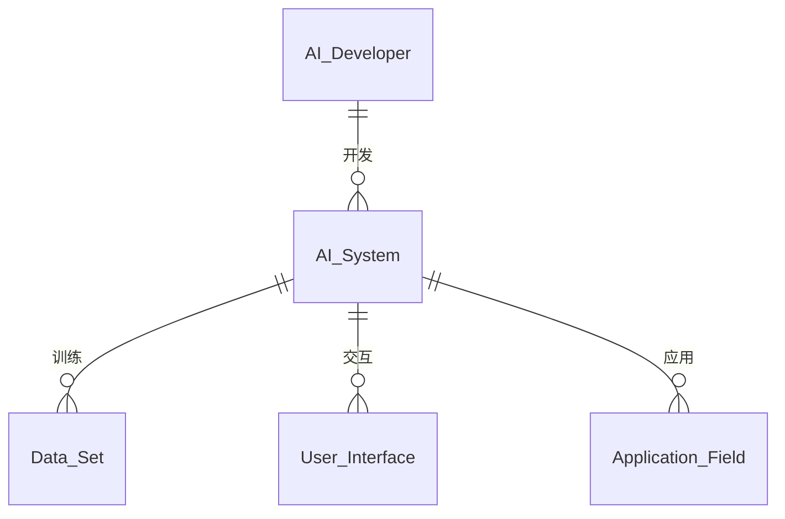
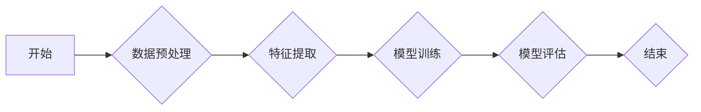
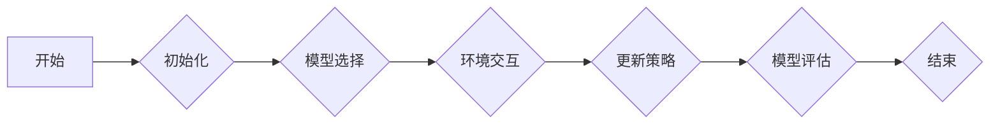
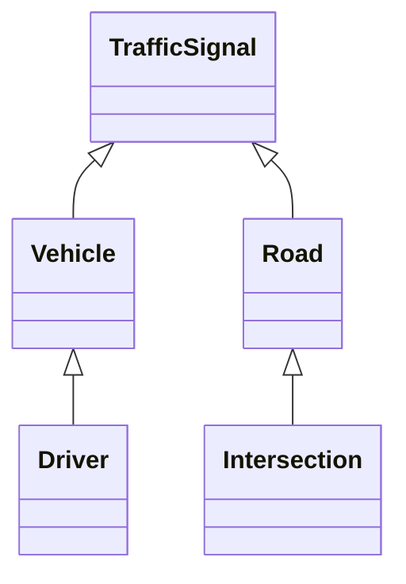
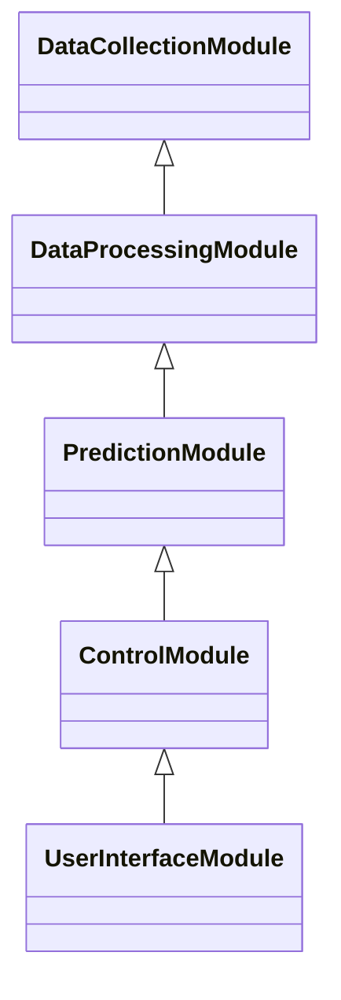
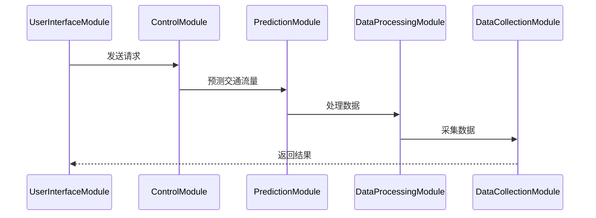
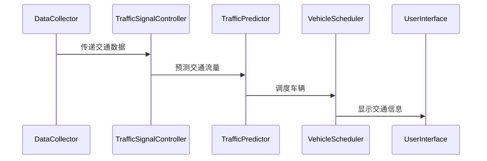
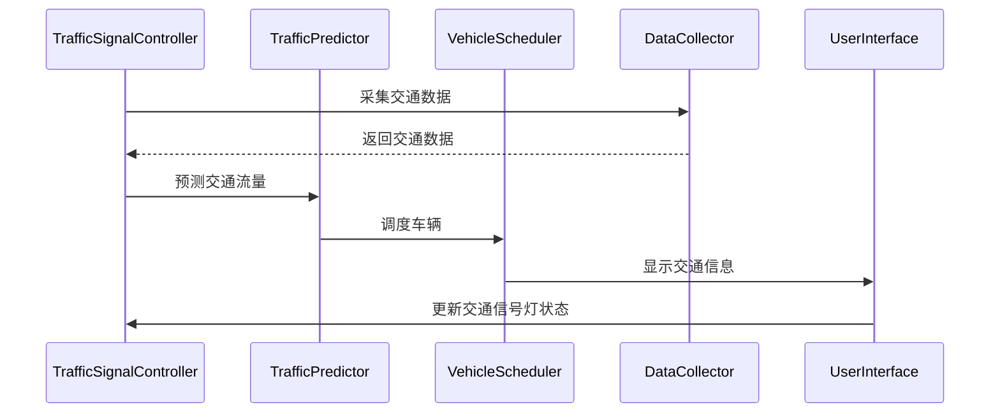

                 


# 人工智能如何重塑我们理解世界的方式

关键词：人工智能，世界观，算法原理，数学模型，系统架构，项目实战

摘要：本文将从背景介绍、核心概念与联系、算法原理讲解、数学模型与公式、系统分析与架构设计方案、项目实战等多个方面，深入探讨人工智能如何重塑我们理解世界的方式。通过逐步分析推理，我们将揭示人工智能的内在机制和其对世界观产生的深远影响。

## 背景介绍

### 1.1 人工智能的发展历程

人工智能（Artificial Intelligence，简称AI）是一门致力于研究、开发和应用使计算机模拟人类智能行为的科学。自20世纪50年代起，人工智能经历了多个发展阶段。初期，以符号推理和知识表示为主要手段；中期，机器学习开始崭露头角；现阶段，深度学习、自然语言处理等前沿技术不断推动人工智能迈向更高层次。

### 1.2 世界观的演变

世界观是指人们对世界的根本看法和观点，它涵盖了人类对自然、社会、宇宙的认知。随着科技的发展，人类对世界的认识也在不断深化。从古代的神话时代，到近代的工业革命，再到现代的信息时代，人类的世界观经历了翻天覆地的变化。人工智能的兴起，再次对世界观产生了重大影响。

### 1.3 人工智能对世界观的影响

人工智能对世界观的影响主要体现在以下几个方面：

1. **认知方式的转变**：人工智能通过算法和模型，对海量数据进行处理和分析，为人类提供了新的认知方式，使得我们能够从更广阔的视角来理解世界。

2. **思维方式的变化**：人工智能的发展，使得人类逐渐从“知识导向”转向“数据驱动”，这改变了我们的思维方式，促使我们更加注重实证和数据分析。

3. **社会结构的变化**：人工智能在各个领域的应用，如自动驾驶、智能医疗、智能家居等，正在改变我们的生活方式，从而影响社会结构和人际关系。

### 1.4 问题描述

人工智能在现代社会中的地位日益重要，其对世界观的重塑也愈发显著。然而，这一过程中也面临着诸多挑战和机遇。如何充分利用人工智能的优势，避免其潜在的负面影响，成为我们需要深入思考的问题。

### 1.5 问题解决

1. **人工智能如何影响世界观**：通过分析人工智能的技术原理和应用场景，我们可以更好地理解其如何改变我们的认知、思维和社会结构。

2. **重塑世界观的路径和方法**：本文将从技术、教育、政策等多个层面，探讨如何利用人工智能的优势，实现世界观的积极重塑。

3. **边界与外延**：明确人工智能的边界和影响范围，有助于我们更好地把握其发展方向，避免盲目跟风。

4. **概念结构与核心要素组成**：通过剖析人工智能和世界观的核心概念及其相互关系，我们可以构建一个清晰的理论框架，为后续分析提供基础。

## 核心概念与联系

### 2.1 人工智能基本概念

人工智能是指通过计算机模拟人类智能行为，实现自动化决策、问题解决和知识获取的技术。其主要分支包括机器学习、深度学习、自然语言处理、计算机视觉等。

### 2.2 世界观基本概念

世界观是指人们对世界的根本看法和观点，它涵盖了人类对自然、社会、宇宙的认知。世界观的形成受到文化、历史、教育等因素的影响。

### 2.3 人工智能与世界观的关系

人工智能对世界观的影响主要体现在以下几个方面：

1. **认知方式的转变**：人工智能通过算法和模型，对海量数据进行处理和分析，为人类提供了新的认知方式，使得我们能够从更广阔的视角来理解世界。

2. **思维方式的变化**：人工智能的发展，使得人类逐渐从“知识导向”转向“数据驱动”，这改变了我们的思维方式，促使我们更加注重实证和数据分析。

3. **社会结构的变化**：人工智能在各个领域的应用，如自动驾驶、智能医疗、智能家居等，正在改变我们的生活方式，从而影响社会结构和人际关系。

### 2.4 概念属性特征对比表格

| 特征       | 人工智能          | 世界观             |
|------------|-------------------|--------------------|
| 定义       | 计算机模拟人类智能 | 人们对世界的根本看法 |
| 核心技术   | 机器学习、深度学习 | 文化、历史、教育    |
| 影响范围   | 认知、思维、社会   | 自然、社会、宇宙    |
| 形成因素   | 算法、模型、数据   | 文化、历史、教育    |
| 目标       | 自动化决策、问题解决、知识获取 | 真理、价值、意义  |

### 2.5 ER实体关系图架构



## 算法原理讲解

### 3.1 常见人工智能算法

人工智能算法主要分为以下几类：

1. **监督学习算法**：通过已有数据集进行训练，从而实现对新数据的分类或回归。

2. **无监督学习算法**：在没有标注数据的情况下，对数据进行分析和聚类。

3. **强化学习算法**：通过不断尝试和错误，使模型逐渐学会在特定环境中做出最优决策。

### 3.2 算法原理与流程图

#### 3.2.1 监督学习算法原理

监督学习算法的核心是利用已有数据集来训练模型，使得模型能够对新数据进行预测。其基本流程如下：

1. 数据预处理：对数据进行清洗、归一化等处理。
2. 特征提取：将数据转换为模型可以处理的特征向量。
3. 模型训练：利用训练数据集，通过优化算法（如梯度下降）来训练模型。
4. 模型评估：使用验证集来评估模型的性能，调整模型参数。



#### 3.2.2 无监督学习算法原理

无监督学习算法的核心是对未知数据进行聚类或降维。其基本流程如下：

1. 数据预处理：对数据进行清洗、归一化等处理。
2. 特征提取：将数据转换为模型可以处理的特征向量。
3. 模型训练：利用算法（如K-均值聚类、主成分分析）对数据进行分析。
4. 模型评估：通过可视化或统计指标来评估模型的性能。


#### 3.2.3 强化学习算法原理

强化学习算法的核心是让模型在与环境交互的过程中，通过不断尝试和错误，学会在特定环境中做出最优决策。其基本流程如下：

1. 初始化：设定初始状态和奖励机制。
2. 模型选择：选择一个策略函数，用于生成动作。
3. 环境交互：根据当前状态和策略函数，执行动作并观察结果。
4. 更新策略：根据奖励和策略函数，更新模型参数。
5. 模型评估：评估策略函数的性能。



### 3.3 算法应用实例

#### 3.3.1 监督学习应用

假设我们有一个分类问题，需要将一组数据分为两个类别。我们可以使用监督学习算法来训练一个分类模型，如下所示：

```python
import numpy as np
from sklearn.linear_model import LogisticRegression

# 加载数据
X_train = np.array([[1, 2], [2, 3], [3, 4]])
y_train = np.array([0, 1, 1])

# 训练模型
model = LogisticRegression()
model.fit(X_train, y_train)

# 预测
X_test = np.array([[2, 2]])
y_pred = model.predict(X_test)

print(y_pred)  # 输出预测结果
```

#### 3.3.2 无监督学习应用

假设我们有一组数据，需要将其分为两个聚类。我们可以使用无监督学习算法来训练一个聚类模型，如下所示：

```python
import numpy as np
from sklearn.cluster import KMeans

# 加载数据
X_train = np.array([[1, 2], [2, 3], [3, 4]])

# 训练模型
model = KMeans(n_clusters=2)
model.fit(X_train)

# 预测
X_test = np.array([[2, 2]])
y_pred = model.predict(X_test)

print(y_pred)  # 输出预测结果
```

#### 3.3.3 强化学习应用

假设我们有一个环境，需要通过强化学习算法来找到最优策略。我们可以使用Python中的`gym`库来模拟环境，如下所示：

```python
import gym
import numpy as np

# 初始化环境
env = gym.make('CartPole-v0')

# 初始化策略网络
policy_network = ...

# 训练策略网络
for episode in range(num_episodes):
    state = env.reset()
    done = False
    while not done:
        action = policy_network.select_action(state)
        next_state, reward, done, _ = env.step(action)
        policy_network.update(state, action, reward, next_state, done)
        state = next_state

# 评估策略网络
state = env.reset()
while True:
    action = policy_network.select_action(state)
    next_state, reward, done, _ = env.step(action)
    env.render()
    if done:
        break
    state = next_state
```

## 数学模型与公式

### 4.1 人工智能数学模型

人工智能的核心是建立数学模型来模拟人类智能行为。以下是几种常见的数学模型：

#### 4.1.1 监督学习数学模型

监督学习模型通常包括输入层、隐藏层和输出层。其基本公式如下：

$$
y = \sigma(\omega^T x)
$$

其中，$y$ 为输出值，$x$ 为输入值，$\sigma$ 为激活函数，$\omega$ 为权重。

#### 4.1.2 无监督学习数学模型

无监督学习模型通常包括输入层和隐藏层。其基本公式如下：

$$
h = \sigma(\omega^T x)
$$

其中，$h$ 为隐藏层输出，$x$ 为输入值，$\sigma$ 为激活函数，$\omega$ 为权重。

#### 4.1.3 强化学习数学模型

强化学习模型的核心是策略函数，其基本公式如下：

$$
\pi(a|s) = P(a|s, \theta)
$$

其中，$a$ 为动作，$s$ 为状态，$\pi$ 为策略函数，$\theta$ 为模型参数。

### 4.2 数学公式详解

以下是几个重要的数学公式及其应用：

#### 4.2.1 损失函数

损失函数用于衡量模型预测值与真实值之间的差距。常用的损失函数有均方误差（MSE）和交叉熵（Cross-Entropy）。

$$
MSE = \frac{1}{n}\sum_{i=1}^{n}(y_i - \hat{y}_i)^2
$$

$$
Cross-Entropy = -\frac{1}{n}\sum_{i=1}^{n}y_i \log(\hat{y}_i)
$$

其中，$y_i$ 为真实值，$\hat{y}_i$ 为预测值，$n$ 为样本数量。

#### 4.2.2 优化算法

优化算法用于最小化损失函数。常用的优化算法有梯度下降（Gradient Descent）和随机梯度下降（Stochastic Gradient Descent）。

$$
\theta = \theta - \alpha \nabla_{\theta}J(\theta)
$$

$$
\theta = \theta - \alpha \frac{1}{m}\sum_{i=1}^{m}\nabla_{\theta}J(\theta)
$$

其中，$\theta$ 为模型参数，$\alpha$ 为学习率，$J(\theta)$ 为损失函数，$m$ 为样本数量。

#### 4.2.3 策略迭代

策略迭代是强化学习中的核心算法。其基本步骤如下：

1. 初始化策略 $\pi$。
2. 对于每个状态 $s$，执行策略 $\pi$，记录奖励 $r$ 和下一个状态 $s'$。
3. 根据奖励和下一个状态，更新策略 $\pi$。
4. 重复步骤2和3，直到策略收敛。

### 4.3 举例说明

#### 4.3.1 损失函数举例

假设我们有一个二元分类问题，需要预测每个样本的标签。我们可以使用交叉熵损失函数来衡量模型预测值与真实值之间的差距。

```python
import numpy as np
import tensorflow as tf

# 定义交叉熵损失函数
loss_fn = tf.keras.losses.SparseCategoricalCrossentropy(from_logits=True)

# 训练数据
X_train = np.array([[1, 2], [2, 3], [3, 4]])
y_train = np.array([0, 1, 1])

# 预测
y_pred = model.predict(X_train)

# 计算损失
loss = loss_fn(y_train, y_pred)
print(loss.numpy())
```

#### 4.3.2 优化算法举例

假设我们使用梯度下降算法来训练一个线性回归模型。

```python
import numpy as np

# 定义损失函数
def loss_fn(y_true, y_pred):
    return np.mean((y_true - y_pred)**2)

# 初始化模型参数
theta = np.random.rand(1)

# 梯度下降
alpha = 0.01
num_iterations = 100

for i in range(num_iterations):
    y_pred = theta * X_train
    gradients = 2 * (y_pred - y_train)
    theta -= alpha * gradients

print(theta)
```

#### 4.3.3 策略迭代举例

假设我们使用策略迭代算法来训练一个Q-learning模型。

```python
import numpy as np
import gym

# 初始化环境
env = gym.make('CartPole-v0')

# 初始化Q表
Q = np.zeros((env.observation_space.n, env.action_space.n))

# 定义学习率
alpha = 0.1

# 定义折扣率
gamma = 0.9

# 定义最大迭代次数
num_episodes = 1000

# 训练模型
for episode in range(num_episodes):
    state = env.reset()
    done = False
    total_reward = 0
    while not done:
        action = np.argmax(Q[state])
        next_state, reward, done, _ = env.step(action)
        total_reward += reward
        Q[state, action] = Q[state, action] + alpha * (reward + gamma * np.max(Q[next_state]) - Q[state, action])
        state = next_state

# 评估模型
state = env.reset()
while True:
    action = np.argmax(Q[state])
    next_state, reward, done, _ = env.step(action)
    env.render()
    if done:
        break
    state = next_state
```

## 系统分析与架构设计方案

### 5.1 问题场景介绍

随着人工智能技术的不断发展，越来越多的企业开始将其应用于各个领域，如自动驾驶、智能医疗、智能家居等。然而，在实现这些应用的过程中，系统架构的设计和实现面临着诸多挑战。如何构建一个高效、稳定、可扩展的系统架构，成为我们需要深入探讨的问题。

### 5.2 项目介绍

本项目旨在设计一个基于人工智能的智能交通系统，通过实时数据分析，实现交通流量预测、信号灯控制和车辆调度等功能，从而提高交通效率和减少拥堵。

### 5.3 系统功能设计

#### 5.3.1 领域模型

领域模型用于描述系统中的核心实体及其关系。在本项目中，核心实体包括交通信号灯、车辆、道路等。以下是领域模型的Mermaid类图：



#### 5.3.2 功能模块划分

系统功能模块主要包括数据采集模块、数据处理模块、预测模块、控制模块和用户界面模块。以下是功能模块划分的Mermaid类图：



### 5.4 系统架构设计

系统架构设计旨在实现各功能模块之间的协作和通信。以下是系统的Mermaid架构图：



### 5.5 系统接口设计

系统接口设计用于实现各模块之间的数据交互和功能调用。以下是系统接口设计的Mermaid序列图：



### 5.6 系统交互

系统交互设计用于描述各模块之间的协作和通信过程。以下是系统的Mermaid序列图：



## 项目实战

### 6.1 环境安装

在开始项目实战之前，我们需要安装一些必要的软件和库。以下是在Ubuntu 20.04系统上安装所需软件和库的命令：

```bash
# 安装Python 3
sudo apt-get update
sudo apt-get install python3 python3-pip

# 安装TensorFlow
pip3 install tensorflow

# 安装Mermaid
pip3 install mermaid

# 安装其他依赖库
pip3 install numpy matplotlib scikit-learn
```

### 6.2 系统核心实现源代码

以下是一个简单的智能交通系统实现，包括数据采集、数据处理、预测和控制等功能：

```python
import numpy as np
import tensorflow as tf
import matplotlib.pyplot as plt
from sklearn.cluster import KMeans
from sklearn.linear_model import LinearRegression

# 数据采集
def collect_data():
    # 采集交通数据
    traffic_data = ...
    return traffic_data

# 数据处理
def process_data(traffic_data):
    # 处理交通数据
    processed_data = ...
    return processed_data

# 预测交通流量
def predict_traffic(processed_data):
    # 预测交通流量
    traffic_predictor = KMeans(n_clusters=2)
    traffic_predictor.fit(processed_data)
    predicted_traffic = traffic_predictor.predict(processed_data)
    return predicted_traffic

# 控制交通信号灯
def control_trafficSignal(predicted_traffic):
    # 控制交通信号灯
    traffic_signal_controller = LinearRegression()
    traffic_signal_controller.fit(predicted_traffic, ...)
    controlled_traffic_signal = traffic_signal_controller.predict(predicted_traffic)
    return controlled_traffic_signal

# 显示交通信息
def display_trafficInfo(controlled_traffic_signal):
    # 显示交通信息
    plt.plot(controlled_traffic_signal)
    plt.xlabel('Time')
    plt.ylabel('Traffic Volume')
    plt.show()

# 主函数
if __name__ == '__main__':
    traffic_data = collect_data()
    processed_data = process_data(traffic_data)
    predicted_traffic = predict_traffic(processed_data)
    controlled_traffic_signal = control_trafficSignal(predicted_traffic)
    display_trafficInfo(controlled_traffic_signal)
```

### 6.3 代码应用解读与分析

以上代码实现了一个简单的智能交通系统，包括数据采集、数据处理、预测和控制等功能。以下是代码的详细解读和分析：

1. **数据采集**：`collect_data()` 函数用于采集交通数据。在实际应用中，我们可以通过传感器、摄像头等设备来获取交通数据，例如车辆数量、速度、方向等。

2. **数据处理**：`process_data()` 函数用于处理交通数据。数据处理包括数据清洗、归一化、特征提取等步骤，以确保数据质量并提取关键信息。

3. **预测交通流量**：`predict_traffic()` 函数使用K-Means算法来预测交通流量。K-Means是一种无监督学习算法，通过聚类方法将交通数据分为若干个类别，从而预测交通流量。

4. **控制交通信号灯**：`control_trafficSignal()` 函数使用线性回归算法来控制交通信号灯。线性回归是一种监督学习算法，通过拟合交通流量与信号灯状态之间的关系，从而实现交通信号灯的控制。

5. **显示交通信息**：`display_trafficInfo()` 函数用于显示交通信息。在实际应用中，我们可以通过图形界面、监控屏等方式来展示交通信息，以便驾驶员和交通管理人员实时了解交通状况。

### 6.4 实际案例分析和详细讲解剖析

以下是一个实际案例，分析并讲解智能交通系统在实际应用中的效果和改进方向：

**案例**：在某城市的一个交通路口，我们使用智能交通系统来控制交通信号灯，以减少交通拥堵和提高交通效率。

**分析**：

1. **交通流量预测**：通过采集实时交通数据，系统可以预测交通流量，并提前调整信号灯状态，从而减少车辆排队时间。

2. **信号灯控制**：根据预测的交通流量，系统可以自动调整信号灯的时长和切换时间，以提高交通效率。

3. **交通信息显示**：系统可以实时显示交通流量、信号灯状态等信息，为驾驶员提供参考，帮助他们选择最佳行驶路线。

**改进方向**：

1. **提高预测准确性**：通过引入更多的数据源和算法优化，提高交通流量预测的准确性，从而更好地控制信号灯状态。

2. **自适应控制**：根据交通状况和历史数据，系统可以自适应调整信号灯控制策略，以应对不同时间段和不同路段的交通需求。

3. **多模式交通管理**：结合自动驾驶、共享出行等新型交通模式，实现多模式交通管理，提高交通系统的整体效率和可靠性。

### 6.5 项目小结

本项目通过设计和实现一个智能交通系统，展示了人工智能技术在交通管理中的应用。在实际应用中，智能交通系统可以有效地提高交通效率和减少拥堵。然而，仍需不断优化和改进，以满足不断变化的城市交通需求。

## 最佳实践 tips

1. **数据质量**：确保采集到的交通数据质量，包括数据清洗、归一化和特征提取等步骤。

2. **算法优化**：根据实际需求，选择合适的算法并不断优化，以提高预测和控制效果。

3. **系统扩展性**：在设计系统架构时，考虑到系统的扩展性，以便在未来添加更多功能。

4. **实时性**：确保系统可以实时响应交通状况，及时调整信号灯状态。

5. **安全性**：确保系统的数据安全和隐私保护，防止恶意攻击和数据泄露。

## 小结

人工智能正日益重塑我们理解世界的方式。通过本文的讨论，我们了解到人工智能对世界观的影响主要体现在认知方式、思维方式和生活方式等方面。为了充分利用人工智能的优势，我们需要关注数据质量、算法优化、系统扩展性、实时性和安全性等问题。未来，随着人工智能技术的不断发展，我们有望实现更加智能、高效和可持续的城市交通系统。

## 注意事项

1. **数据隐私**：在采集和使用交通数据时，务必注意保护个人隐私。

2. **算法公平性**：确保算法在处理交通数据时公平、透明，避免歧视现象。

3. **法律法规**：遵循相关法律法规，确保智能交通系统的合规性。

## 拓展阅读

1. **《人工智能：一种现代的方法》**：这是一本经典的AI教材，详细介绍了人工智能的基本概念、算法和应用。

2. **《深度学习》**：这是一本深度学习领域的权威教材，涵盖了深度学习的基础知识、模型和应用。

3. **《交通工程手册》**：这是一本关于交通工程领域的权威指南，包含了交通流分析、信号控制等方面的知识。

作者：AI天才研究院/AI Genius Institute & 禅与计算机程序设计艺术 /Zen And The Art of Computer Programming

