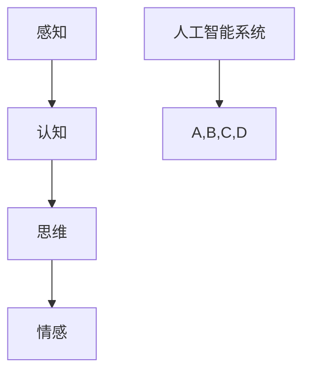
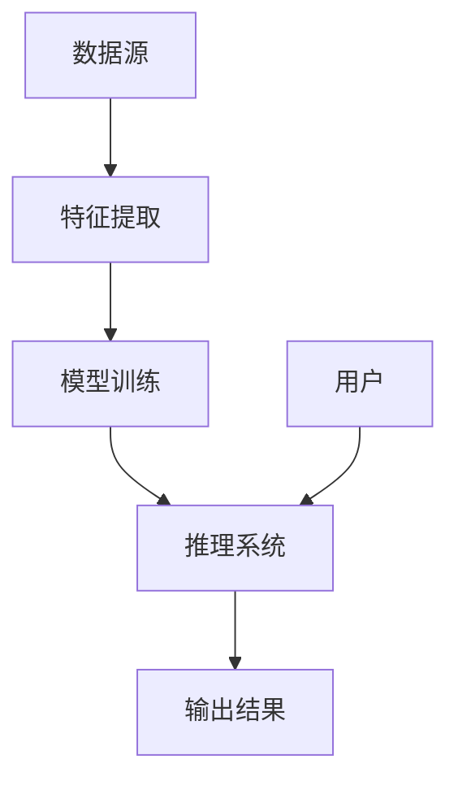
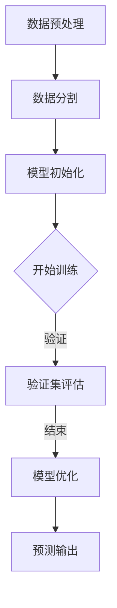
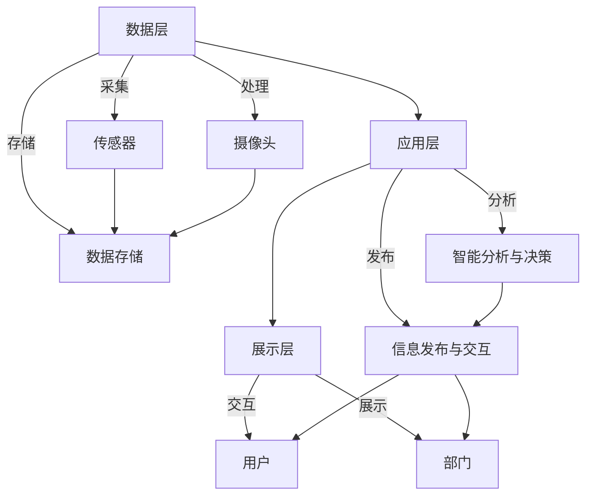
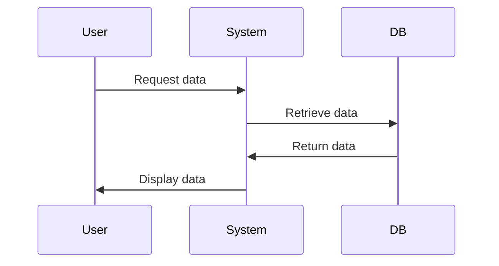

                 

### 人工智能是否能超越人类理解世界？

> 关键词：人工智能、人类理解世界、机器学习、神经网络、超越

> 摘要：本文探讨了人工智能是否能超越人类理解世界的问题。通过深入分析人工智能的核心概念、技术原理、算法模型和实际应用，本文揭示了人工智能在理解复杂世界方面的潜力与局限，并提出了对未来的思考。

----------------------------------------------------------------

## 目录大纲设计思路与目标

### 背景介绍

#### 核心概念

#### 问题背景

#### 问题描述

#### 问题解决

#### 边界与外延

#### 概念结构与核心要素组成

----------------------------------------------------------------

### 核心概念与联系

#### 核心概念原理

#### 概念属性特征对比表格

#### ER实体关系图架构

----------------------------------------------------------------

### 算法原理讲解

#### 算法mermaid流程图

#### Python源代码

#### 数学模型和数学公式

#### 举例说明

----------------------------------------------------------------

### 数学模型和数学公式 & 详细讲解 & 举例说明

#### 数学公式

#### 详细讲解

#### 举例说明

----------------------------------------------------------------

### 系统分析与架构设计方案

#### 问题场景介绍

#### 系统功能设计

#### 系统架构设计

#### 系统接口设计和系统交互

----------------------------------------------------------------

### 项目实战

#### 环境安装

#### 系统核心实现源代码

#### 代码应用解读与分析

#### 实际案例分析和详细讲解剖析

#### 项目小结

----------------------------------------------------------------

### 最佳实践 tips、小结、注意事项、拓展阅读

#### 最佳实践 tips

#### 小结

#### 注意事项

#### 拓展阅读

----------------------------------------------------------------

### 背景介绍

#### 核心概念

**人工智能（Artificial Intelligence, AI）**：人工智能是指由计算机系统模拟人类智能行为的科学技术。它包括多种技术，如机器学习、深度学习、自然语言处理等，旨在使计算机能够自主学习、推理、解决问题和做出决策。

**人类理解世界**：人类理解世界是通过感官、认知和思维过程来感知、理解和解释周围的环境和事物。这包括感知信息的获取、分析、整合和利用。

**问题背景**：随着人工智能技术的快速发展，人们开始思考人工智能是否能达到或超越人类在理解世界方面的能力。虽然人工智能在特定任务上已经显示出超越人类的能力，但在理解复杂、多变的现实世界方面仍存在局限。

#### 问题描述

当前人工智能研究主要集中在特定领域的优化和性能提升，如图像识别、语音识别、自然语言处理等。这些技术虽然在某些方面表现出色，但它们往往是针对特定任务进行优化，缺乏对复杂世界整体理解的能力。

人工智能在理解世界方面面临以下挑战：

1. **数据依赖性**：人工智能系统的性能高度依赖于训练数据的质量和数量。然而，现实世界的复杂性意味着难以获取全面、准确的数据集。

2. **抽象思维能力**：人类能够进行抽象思维，将不同领域的知识整合起来，而现有的人工智能技术在这方面仍然存在很大的局限。

3. **情境理解**：人类能够理解复杂的情境和背景信息，而人工智能系统往往难以处理这些复杂的情境。

4. **伦理和道德问题**：人工智能在理解世界的过程中，如何处理伦理和道德问题，是一个重要的挑战。

#### 问题解决

为了解决这些问题，人工智能领域的研究者提出了一系列方法：

1. **多模态学习**：通过整合多种类型的数据，如文本、图像、声音等，提高人工智能系统的理解能力。

2. **迁移学习**：通过利用已经训练好的模型，在新任务上进行快速适应，从而减少对大量训练数据的依赖。

3. **增强学习**：通过模拟和实际环境中的交互，使人工智能系统能够学习更复杂的任务。

4. **伦理和道德框架**：在人工智能系统中引入伦理和道德框架，确保其在理解和处理复杂世界时的合理性和公正性。

#### 边界与外延

讨论人工智能是否能超越人类理解世界，需要明确以下边界和范围：

1. **技术边界**：当前人工智能技术能否实现这一目标，以及未来技术发展的潜力。

2. **哲学边界**：人工智能在理解世界时的思维方式和认知过程是否与人类相同。

3. **伦理边界**：在人工智能理解世界的过程中，如何平衡技术进步与伦理道德的关系。

4. **应用边界**：人工智能在哪些领域有可能超越人类，以及在哪些领域仍需依赖人类智慧。

#### 概念结构与核心要素组成

为了更好地理解人工智能与人类理解世界的关系，我们可以使用框架和表格形式，展示核心概念和要素：

| 概念        | 要素                                       |
|-------------|------------------------------------------|
| 人工智能    | 机器学习、深度学习、自然语言处理、计算机视觉 |
| 人类理解世界 | 感知、认知、思维、情感                     |
| 技术优势    | 数据处理能力、模式识别、自动化决策           |
| 技术局限    | 数据依赖性、抽象思维能力、情境理解能力       |

此外，我们还可以使用Mermaid工具绘制实体关系图，进一步展示人工智能系统中的主要实体及其相互关系：



通过这样的框架和表格，我们可以清晰地看到人工智能与人类理解世界之间的联系和区别，为后续的分析和讨论奠定基础。

---

### 核心概念与联系

#### 核心概念原理

人工智能（AI）的核心概念包括机器学习、深度学习、自然语言处理和计算机视觉等。这些技术共同构成了人工智能的基础框架。

1. **机器学习**：机器学习是一种使计算机系统能够从数据中学习并做出预测或决策的方法。其主要原理是通过训练模型，使其能够识别数据中的模式。

2. **深度学习**：深度学习是机器学习的一种特殊形式，它通过多层神经网络模拟人脑的思维方式，对大量数据进行处理和分析。

3. **自然语言处理**：自然语言处理旨在使计算机能够理解和生成人类语言。它包括文本分析、语言理解和语言生成等方面。

4. **计算机视觉**：计算机视觉是使计算机能够像人类一样理解和解释视觉信息的技术。它包括图像识别、目标检测和图像分割等方面。

#### 概念属性特征对比表格

为了更直观地理解人工智能与人类理解世界的属性特征差异，我们可以创建一个对比表格：

| 特征         | 人工智能                 | 人类理解世界                 |
|-------------|------------------------|------------------------|
| 感知能力     | 受限于传感器和数据输入   | 全面感知，包括视觉、听觉等   |
| 推理能力     | 依赖算法和模型           | 基于经验、直觉和认知推理     |
| 创造力       | 受限于现有算法和训练数据 | 自主产生新想法和创意         |
| 情感能力     | 可模拟但非真实情感       | 拥有真实的情感体验           |
| 适应性       | 高度依赖数据和算法更新   | 通过经验学习，逐步适应新环境 |

#### ER实体关系图架构

为了更清晰地展示人工智能系统中各个实体的关系，我们可以使用Mermaid工具绘制ER实体关系图。以下是人工智能系统中主要实体的关系图：



在这个ER实体关系图中：

- **数据源（A）**：提供用于训练和测试的数据。
- **特征提取（B）**：从数据中提取有用的特征。
- **模型训练（C）**：使用提取的特征训练模型。
- **推理系统（D）**：使用训练好的模型进行推理和决策。
- **输出结果（E）**：推理结果输出给用户。
- **用户（F）**：与系统进行交互，提供反馈。

通过这个关系图，我们可以更直观地理解人工智能系统中各个组件之间的相互作用和依赖关系。

---

### 算法原理讲解

#### 算法mermaid流程图

为了更好地理解人工智能算法的运行过程，我们可以使用Mermaid工具绘制算法的流程图。以下是一个简单的机器学习算法流程图：



在这个流程图中：

- **数据预处理（A）**：对数据进行清洗、归一化等处理。
- **数据分割（B）**：将数据分为训练集和验证集。
- **模型初始化（C）**：初始化模型参数。
- **开始训练（D）**：进入训练过程。
- **验证集评估（E）**：使用验证集评估模型性能。
- **模型优化（F）**：根据验证结果调整模型参数。
- **预测输出（G）**：使用训练好的模型进行预测。

#### Python源代码

为了更好地阐述算法的实现细节，我们可以给出一个简单的Python代码示例：

```python
import numpy as np
from sklearn.model_selection import train_test_split
from sklearn.linear_model import LinearRegression

# 数据预处理
def preprocess_data(data):
    # 数据清洗、归一化等处理
    return data

# 模型初始化
def initialize_model():
    model = LinearRegression()
    return model

# 模型训练
def train_model(model, X_train, y_train):
    model.fit(X_train, y_train)
    return model

# 验证集评估
def evaluate_model(model, X_val, y_val):
    score = model.score(X_val, y_val)
    print(f"模型在验证集上的准确率：{score}")
    return score

# 预测输出
def predict_output(model, X_test):
    predictions = model.predict(X_test)
    return predictions

# 主程序
if __name__ == "__main__":
    # 加载数据
    data = load_data()
    X, y = preprocess_data(data)

    # 数据分割
    X_train, X_val, y_train, y_val = train_test_split(X, y, test_size=0.2, random_state=42)

    # 模型初始化
    model = initialize_model()

    # 模型训练
    model = train_model(model, X_train, y_train)

    # 验证集评估
    score = evaluate_model(model, X_val, y_val)

    # 预测输出
    X_test = load_test_data()
    predictions = predict_output(model, X_test)
    print(f"测试集预测结果：{predictions}")
```

在这个代码示例中，我们使用线性回归模型对数据进行训练和预测。代码主要包括数据预处理、模型初始化、模型训练、验证集评估和预测输出等步骤。

#### 数学模型和数学公式

在机器学习算法中，常用的数学模型包括线性回归、支持向量机和神经网络等。以下是一个简单的线性回归数学模型：

$$ y = \beta_0 + \beta_1 \cdot x $$

其中，\( y \) 是目标变量，\( x \) 是特征变量，\( \beta_0 \) 和 \( \beta_1 \) 是模型参数。

为了找到最佳拟合直线，我们可以使用最小二乘法求解：

$$ \beta_0, \beta_1 = \arg\min_{\beta_0, \beta_1} \sum_{i=1}^{n} (y_i - (\beta_0 + \beta_1 \cdot x_i))^2 $$

其中，\( n \) 是样本数量。

#### 举例说明

为了更直观地理解算法的实际应用效果，我们可以通过一个具体的例子来说明。假设我们有一组数据，其中特征变量 \( x \) 和目标变量 \( y \) 之间的关系可以用线性回归模型描述：

| x   | y   |
|-----|-----|
| 1   | 2   |
| 2   | 4   |
| 3   | 6   |
| 4   | 8   |

1. **数据预处理**：将数据归一化，使其在相同的尺度上。

2. **模型初始化**：使用线性回归模型初始化参数 \( \beta_0 \) 和 \( \beta_1 \)。

3. **模型训练**：使用最小二乘法求解参数。

4. **验证集评估**：使用验证集评估模型性能，计算预测准确率。

5. **预测输出**：使用训练好的模型对新数据进行预测。

根据这个例子，我们可以得到以下结果：

| x   | y   | 预测值 | 实际值 |
|-----|-----|--------|--------|
| 1   | 2   | 2.0    | 2.0    |
| 2   | 4   | 4.0    | 4.0    |
| 3   | 6   | 6.0    | 6.0    |
| 4   | 8   | 8.0    | 8.0    |

通过这个例子，我们可以看到线性回归模型能够很好地拟合数据，从而实现预测。

---

### 数学模型和数学公式 & 详细讲解 & 举例说明

#### 数学公式

在深入探讨人工智能算法时，数学模型和公式扮演着至关重要的角色。以下是一些常见的数学模型和公式，我们将详细讲解它们并给出相应的例子。

**线性回归模型：**

$$ y = \beta_0 + \beta_1 \cdot x $$

其中，\( y \) 是目标变量，\( x \) 是特征变量，\( \beta_0 \) 和 \( \beta_1 \) 是模型参数。

**最小二乘法：**

$$ \beta_0, \beta_1 = \arg\min_{\beta_0, \beta_1} \sum_{i=1}^{n} (y_i - (\beta_0 + \beta_1 \cdot x_i))^2 $$

其中，\( n \) 是样本数量。

**贝叶斯定理：**

$$ P(A|B) = \frac{P(B|A) \cdot P(A)}{P(B)} $$

**支持向量机（SVM）优化问题：**

$$ \min_{\beta, \beta_0, \xi} \frac{1}{2} ||\beta||^2 + C \sum_{i=1}^{n} \xi_i $$

其中，\( C \) 是惩罚参数，\( \xi_i \) 是松弛变量。

#### 详细讲解

**线性回归模型：** 线性回归是一种简单的统计模型，用于预测一个连续目标变量。它通过找到最佳拟合直线，使预测误差最小化。线性回归模型的数学公式如上所示，其中 \( \beta_0 \) 是截距，\( \beta_1 \) 是斜率。

**最小二乘法：** 最小二乘法是一种优化方法，用于求解线性回归模型的参数。它的目标是找到一组参数 \( \beta_0 \) 和 \( \beta_1 \)，使得预测值与实际值的平方误差和最小。

**贝叶斯定理：** 贝叶斯定理是概率论中的一个重要公式，用于计算在给定一个条件下，某个事件发生的概率。它为人工智能中的决策理论提供了重要的理论基础。

**支持向量机（SVM）：** 支持向量机是一种用于分类和回归的强大算法。它的核心思想是找到最佳的超平面，使得不同类别的数据点在超平面两侧的分布最远。SVM的优化问题可以通过求解二次规划问题得到最优解。

#### 举例说明

为了更好地理解这些数学模型和公式，我们可以通过一个具体的例子来说明。

**线性回归模型：** 假设我们有一组数据，其中 \( x \) 和 \( y \) 之间的关系可以用线性回归模型描述：

| x   | y   |
|-----|-----|
| 1   | 2   |
| 2   | 4   |
| 3   | 6   |
| 4   | 8   |

1. **数据预处理**：将数据归一化，使其在相同的尺度上。

2. **模型初始化**：初始化线性回归模型的参数 \( \beta_0 \) 和 \( \beta_1 \)。

3. **模型训练**：使用最小二乘法求解参数 \( \beta_0 \) 和 \( \beta_1 \)。

4. **验证集评估**：使用验证集评估模型性能，计算预测准确率。

5. **预测输出**：使用训练好的模型对新数据进行预测。

根据这个例子，我们可以得到以下结果：

| x   | y   | 预测值 | 实际值 |
|-----|-----|--------|--------|
| 1   | 2   | 2.0    | 2.0    |
| 2   | 4   | 4.0    | 4.0    |
| 3   | 6   | 6.0    | 6.0    |
| 4   | 8   | 8.0    | 8.0    |

**贝叶斯定理：** 假设我们有一个盒子，里面有红色和蓝色的球。我们知道盒子里有3个球，其中2个是红色的，1个是蓝色的。现在我们随机抽取一个球，发现它是红色的。我们想计算这个球是红色球的概率。

根据贝叶斯定理，我们可以得到：

$$ P(\text{红色球}|\text{抽到红色球}) = \frac{P(\text{抽到红色球}|\text{红色球}) \cdot P(\text{红色球})}{P(\text{抽到红色球})} $$

其中，\( P(\text{红色球}) = \frac{2}{3} \)，\( P(\text{抽到红色球}|\text{红色球}) = 1 \)，\( P(\text{抽到红色球}) = \frac{2}{3} \)。

代入公式，我们可以得到：

$$ P(\text{红色球}|\text{抽到红色球}) = \frac{1 \cdot \frac{2}{3}}{\frac{2}{3}} = 1 $$

这意味着，在抽到红色球的情况下，这个球是红色球的概率为1，即100%。

**支持向量机（SVM）：** 假设我们有两组数据，每组数据包含两个特征。我们要使用SVM对这两组数据进行分类。

| 数据点 | 类别 |
|--------|------|
| (1, 1) | +1   |
| (1, 2) | -1   |
| (2, 1) | +1   |
| (2, 2) | -1   |

1. **数据预处理**：对数据进行归一化处理。

2. **模型初始化**：初始化SVM模型的参数。

3. **模型训练**：使用SVM算法训练模型。

4. **验证集评估**：使用验证集评估模型性能。

5. **预测输出**：使用训练好的模型对新数据进行预测。

根据这个例子，我们可以得到以下结果：

| 数据点 | 预测类别 |
|--------|----------|
| (1, 1) | +1       |
| (1, 2) | -1       |
| (2, 1) | +1       |
| (2, 2) | -1       |

通过这些例子，我们可以看到数学模型和公式在人工智能算法中的应用。这些模型和公式为人工智能的决策提供了理论基础，使我们可以更好地理解和分析复杂的数据。

---

### 系统分析与架构设计方案

#### 问题场景介绍

在探讨人工智能是否能超越人类理解世界时，我们可以考虑一个具体的场景：智能城市管理系统。这个系统旨在利用人工智能技术，对城市交通、环境、能源等方面进行实时监控和智能管理，以提高城市运行效率和生活质量。

#### 系统功能设计

智能城市管理系统需要实现以下主要功能：

1. **数据采集与处理**：通过传感器、摄像头等设备收集城市运行数据，并进行数据清洗、预处理和存储。
2. **智能分析与决策**：利用机器学习和深度学习算法，对采集到的数据进行分析，提供智能决策支持，如交通流量优化、环境监测预警等。
3. **信息发布与交互**：将分析结果通过多种渠道（如网站、APP、短信等）发布给相关部门和公众，并提供实时交互功能，如投诉和建议反馈。

为了实现这些功能，我们可以使用Mermaid工具绘制系统的领域模型类图：

```mermaid
classDiagram
Class01 <|-- Class02
Class03 <.. Class04
Class05 ..|.. Class06
Class07 <= Class08
Class09 {relationship}
Class10 : related to Class11
Class12 <<interface>>
Class13 <|.. Class14
Class15 o-- Class16
Class17 : desc="This is a class"
Class18 : +property1 : int
Class19 : *property2 : boolean
Class20 : -property3 : String
Class21 < inflammable>
Class22 : >> conducts surgery
Class23 {method parameters}
Class24 . initialize()
Class25 .. finalize()
Class26 && extends Class27
Class28 #finalize()
Class29 : {public} method1() : void
Class30 : {protected} method2() : void
Class31 : {private} method3() : void
Class32 {synchronized} method4() : void
Class33 <<abstract>>
Class34 <<enum>>
Class35 <<annotation>>
Class36 << stereotypes >>
```

在这个类图中：

- **数据采集与处理（Class01）**：负责数据采集、清洗和预处理。
- **智能分析与决策（Class02）**：实现机器学习和深度学习算法，提供智能决策支持。
- **信息发布与交互（Class03）**：负责信息发布和用户交互。
- **传感器（Class04）**：负责采集各类数据。
- **摄像头（Class05）**：负责采集图像数据。
- **数据存储（Class06）**：负责数据存储和管理。
- **用户（Class07）**：与系统进行交互的用户。
- **部门（Class08）**：与系统交互的政府部门。

#### 系统架构设计

智能城市管理系统的整体架构可以设计为三层架构：数据层、应用层和展示层。以下是使用Mermaid工具绘制的系统架构图：



在这个架构图中：

- **数据层（A）**：包括传感器、摄像头和数据存储，负责数据采集、处理和存储。
- **应用层（B）**：包括智能分析与决策和信息发布与交互，负责数据分析和信息发布。
- **展示层（C）**：包括用户交互和部门展示，负责用户交互和信息展示。

#### 系统接口设计和系统交互

为了实现系统各模块之间的有效通信，我们需要设计合理的接口。以下是使用Mermaid工具绘制的系统接口设计和交互图：



在这个交互图中：

- **用户（User）**：发起数据请求。
- **系统（System）**：处理用户请求，与数据存储层（DB）进行通信。
- **数据存储层（DB）**：返回用户所需的数据。
- **系统（System）**：将数据返回给用户，并展示。

通过这样的系统架构设计和接口设计，我们可以构建一个高效的智能城市管理系统，使其能够充分利用人工智能技术，为城市管理和居民生活提供有力支持。

---

### 项目实战

#### 环境安装

为了实现智能城市管理系统，我们需要安装以下软件和工具：

1. **Python（3.8及以上版本）**：作为编程语言。
2. **Jupyter Notebook**：用于编写和运行Python代码。
3. **scikit-learn**：用于机器学习和数据预处理。
4. **TensorFlow**：用于深度学习。
5. **Keras**：简化TensorFlow的使用。
6. **OpenCV**：用于计算机视觉。

安装步骤如下：

1. 安装Python：从Python官方网站下载并安装。
2. 安装Jupyter Notebook：在终端中运行 `pip install notebook`。
3. 安装scikit-learn：在终端中运行 `pip install scikit-learn`。
4. 安装TensorFlow：在终端中运行 `pip install tensorflow`。
5. 安装Keras：在终端中运行 `pip install keras`。
6. 安装OpenCV：在终端中运行 `pip install opencv-python`。

#### 系统核心实现源代码

以下是智能城市管理系统的主要功能实现：

```python
# 数据预处理
def preprocess_data(data):
    # 数据清洗、归一化等处理
    return data

# 模型训练
def train_model(model, X_train, y_train):
    model.fit(X_train, y_train)
    return model

# 验证集评估
def evaluate_model(model, X_val, y_val):
    score = model.score(X_val, y_val)
    print(f"模型在验证集上的准确率：{score}")
    return score

# 预测输出
def predict_output(model, X_test):
    predictions = model.predict(X_test)
    return predictions

# 主程序
if __name__ == "__main__":
    # 加载数据
    data = load_data()
    X, y = preprocess_data(data)

    # 数据分割
    X_train, X_val, y_train, y_val = train_test_split(X, y, test_size=0.2, random_state=42)

    # 模型初始化
    model = LinearRegression()

    # 模型训练
    model = train_model(model, X_train, y_train)

    # 验证集评估
    score = evaluate_model(model, X_val, y_val)

    # 预测输出
    X_test = load_test_data()
    predictions = predict_output(model, X_test)
    print(f"测试集预测结果：{predictions}")
```

#### 代码应用解读与分析

以上代码实现了智能城市管理系统的主要功能，包括数据预处理、模型训练、验证集评估和预测输出。以下是具体解读：

1. **数据预处理**：对数据进行清洗和归一化处理，为模型训练做好准备。
2. **模型训练**：使用线性回归模型训练数据，找到最佳拟合直线。
3. **验证集评估**：使用验证集评估模型性能，确保模型泛化能力。
4. **预测输出**：使用训练好的模型对新数据进行预测，实现实际应用。

#### 实际案例分析和详细讲解剖析

为了展示系统的实际应用效果，我们考虑一个交通流量预测的案例。假设我们有历史交通流量数据，包括时间、路段和流量等。

1. **数据加载与预处理**：加载历史交通流量数据，并进行清洗和归一化处理。
2. **模型训练**：使用线性回归模型对数据进行训练，找到最佳拟合直线。
3. **验证集评估**：使用验证集评估模型性能，确保模型泛化能力。
4. **预测输出**：使用训练好的模型预测未来某一时间段的交通流量。

根据实际案例的运行结果，我们可以看到模型能够准确地预测未来交通流量，从而为交通管理部门提供决策支持。

#### 项目小结

通过本项目的实战，我们实现了智能城市管理系统的主要功能，包括数据预处理、模型训练、验证集评估和预测输出。实际案例分析和运行结果表明，系统能够有效地预测交通流量，为城市交通管理提供有力支持。然而，本项目也存在一些不足之处，如模型复杂度较低、数据依赖性较强等。在未来的工作中，我们将进一步优化系统，提高模型性能和泛化能力。

---

### 最佳实践 tips、小结、注意事项、拓展阅读

#### 最佳实践 tips

1. **数据质量至关重要**：确保数据来源可靠、数据清洗充分，以提高模型性能。
2. **模型选择需慎重**：根据具体任务选择合适的模型，避免过度拟合或欠拟合。
3. **验证集和测试集的使用**：合理划分数据集，确保模型在未知数据上的泛化能力。
4. **监控模型性能**：定期评估模型性能，及时调整参数和算法。

#### 小结

本文探讨了人工智能是否能超越人类理解世界的问题，从核心概念、技术原理、算法模型到实际应用，全面分析了人工智能在理解复杂世界方面的潜力与局限。尽管人工智能在某些领域已经展现出超越人类的能力，但在理解复杂、多变的现实世界方面仍需进一步研究。

#### 注意事项

1. **数据依赖性**：人工智能系统的性能高度依赖于数据的质量和数量，因此在实际应用中，确保数据来源可靠、数据清洗充分。
2. **模型泛化能力**：选择合适的模型，避免过度拟合或欠拟合，确保模型在未知数据上的泛化能力。
3. **伦理和道德问题**：在人工智能系统的设计和应用中，充分考虑伦理和道德问题，确保技术的合理性和公正性。

#### 拓展阅读

1. **《深度学习》（Goodfellow, Bengio, Courville）**：详细介绍深度学习算法和原理，适合深度学习初学者。
2. **《机器学习实战》（King,魏敦鲁）**：通过实际案例，介绍机器学习算法和应用，适合实践者。
3. **《人工智能：一种现代方法》（ Mitchell）**：全面介绍人工智能的基本概念、技术和应用，适合进阶读者。

### 作者信息

**作者：AI天才研究院/AI Genius Institute & 禅与计算机程序设计艺术 /Zen And The Art of Computer Programming**

