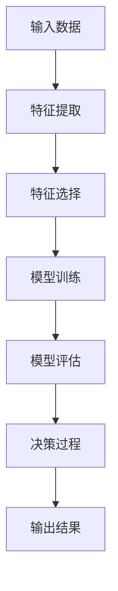
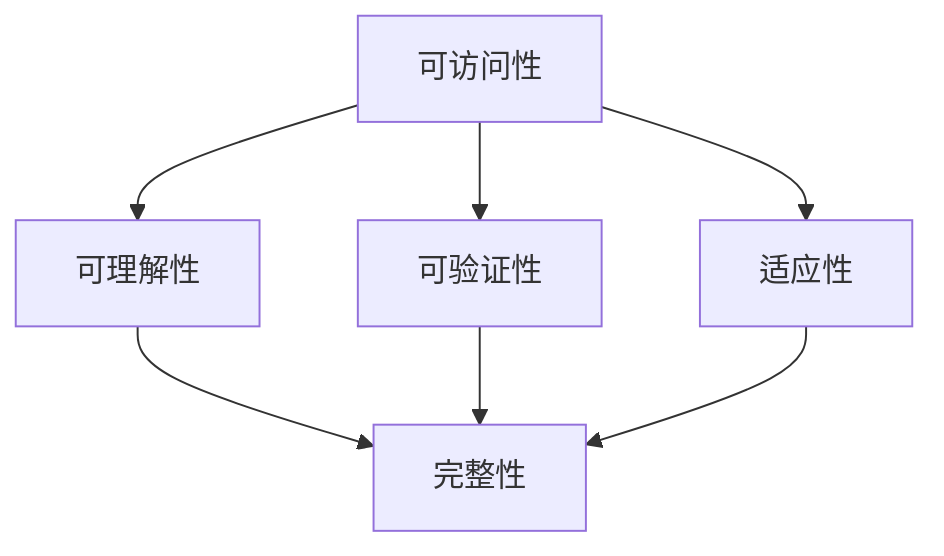
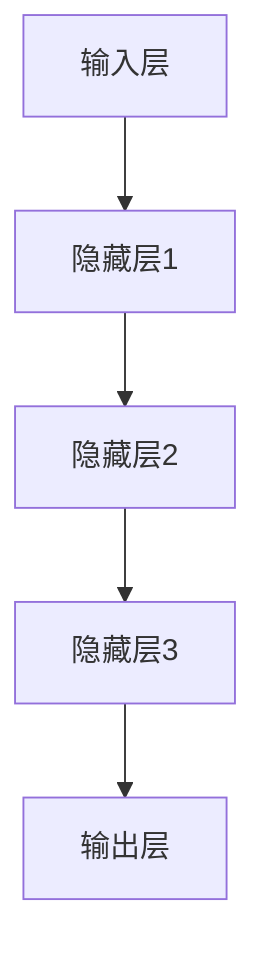
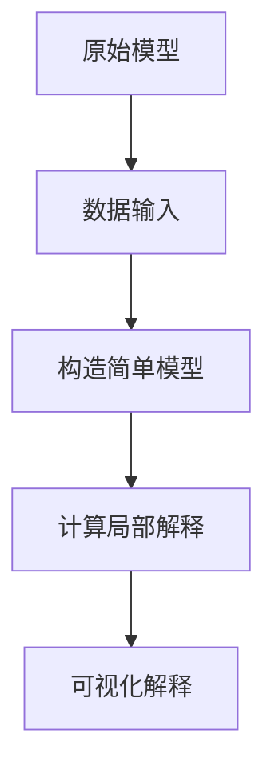
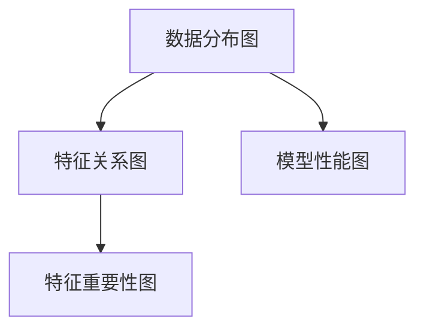
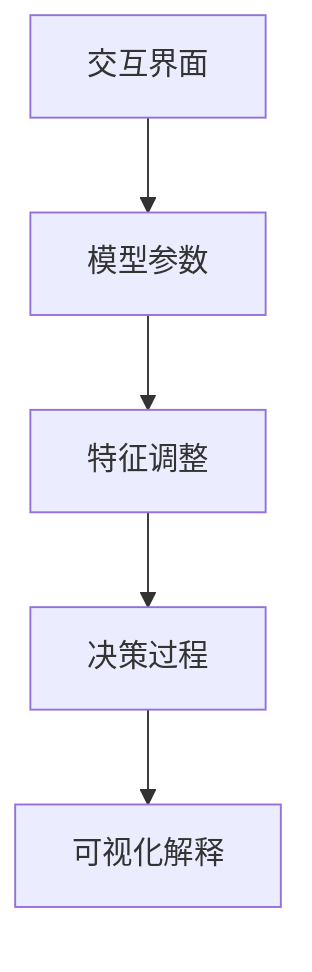

                 

### 人工智能的可解释性问题：理解机器如何理解世界

> 关键词：人工智能，可解释性，机器学习，解释性AI，透明性，算法，模型

> 摘要：本文深入探讨了人工智能（AI）的可解释性问题，从背景、核心概念、解决方法到具体技术，层层剖析，旨在帮助读者理解机器如何理解和学习世界。通过阐述AI系统的透明性和解释性的区别，本文强调了可解释性在构建信任和确保AI系统责任性部署中的重要性。文章还涵盖了当前主要的AI解释性技术，并提供了一个全面的视角来理解AI系统的可解释性挑战和解决方案。

## 引言

随着人工智能（AI）技术的飞速发展，机器学习（ML）模型已经在各行各业中取得了显著的成果。从自动驾驶汽车到医疗诊断，从金融风险评估到自然语言处理，AI的应用场景越来越广泛。然而，随着AI系统变得更加复杂，一个不可忽视的问题也逐渐浮现——这些系统的决策过程往往是不透明的。人们很难理解为什么机器会做出特定的决策，这种“黑箱”性质使得AI系统的信任度和接受度受到了影响。

在这个背景下，可解释性AI（XAI）成为了研究的热点。可解释性AI的目标是使得AI系统的决策过程更加透明，让人类用户能够理解和信任这些系统。本文将深入探讨人工智能的可解释性问题，从问题的背景、核心概念、解决方法到具体技术，逐步分析，帮助读者理解机器是如何理解和学习世界的。

## 背景介绍

### 当前AI系统的挑战

当前，AI系统面临的主要挑战之一是它们的高度复杂性。现代机器学习模型，如深度神经网络（DNNs），通常包含数十万甚至数百万的参数，这使得它们的内部工作原理变得非常复杂。即使是最先进的模型，其决策过程也是难以理解的，因为它们往往是基于复杂的非线性变换和大量的数据输入。这种不可解释性不仅使得人类用户难以信任AI系统，也限制了AI系统的实际应用。

### AI解释性的重要性

AI解释性的重要性不言而喻。首先，解释性是建立用户信任的基石。在医疗、金融和自动驾驶等领域，决策的透明性和可解释性至关重要，因为这些决策可能会直接影响到人们的生命和财产安全。其次，可解释性有助于发现和纠正模型中的错误。通过理解模型的决策过程，研究人员可以更有效地识别和修复模型中的问题。最后，解释性是确保AI系统符合伦理和法律标准的关键。只有当AI系统的决策过程是透明和可解释的，我们才能确保它们不会歧视或侵犯用户的隐私。

### AI解释性 vs 透明性

在讨论AI解释性时，我们需要区分解释性和透明性这两个概念。解释性指的是能够提供关于模型决策过程和理由的信息，而透明性则是指能够访问模型内部的所有细节。虽然这两个概念密切相关，但它们并不完全相同。一个高度透明的模型可能提供了所有的内部信息，但这些信息可能对人类用户来说过于复杂，难以理解。相反，一个解释性的模型可能只提供了关键的信息和解释，使得用户能够轻松地理解模型的决策过程。

### 目标和挑战

本文的目标是提供一个全面的视角来理解AI系统的可解释性问题。我们将首先介绍可解释性AI的基本概念和原理，然后详细分析当前主要的AI解释性技术。通过这些分析，我们将探讨AI解释性的关键挑战，并讨论可能的解决方案。文章还将提供一个案例研究，展示如何在实际应用中实现AI系统的可解释性。最后，我们将总结本文的主要观点，并讨论未来的研究方向。

### 核心概念和原理

在深入探讨AI的可解释性问题之前，我们需要明确几个核心概念和原理。这些概念包括模型的内部工作原理、特征的重要性以及模型的决策过程。

#### 1. 模型的内部工作原理

机器学习模型，特别是深度神经网络，通过一系列的数学变换来处理输入数据并生成输出。这些变换通常包括线性变换、激活函数和非线性变换等。理解这些变换是理解模型决策过程的第一步。例如，在深度神经网络中，每个神经元都会接收来自其他神经元的输入，并应用一个非线性激活函数来产生输出。通过层层堆叠，这些简单的操作构成了复杂的决策过程。

#### 2. 特征的重要性

特征是模型决策过程中最重要的组成部分之一。特征是指从数据中提取出的属性或变量，它们是模型学习的关键信息来源。特征的重要性在于它们直接影响模型的性能和解释性。一个高度可解释的模型应该能够明确地指出哪些特征对决策有显著影响，哪些特征可以忽略。

#### 3. 决策过程

模型的决策过程是其核心功能之一。在分类任务中，模型会基于输入数据预测标签；在回归任务中，模型会预测连续的数值输出。理解决策过程有助于我们评估模型的性能和可靠性。一个可解释的决策过程应该能够清晰地展示如何从输入数据到输出结果，每一步操作的原因和效果。

为了更好地理解这些核心概念，我们可以使用Mermaid图表来可视化它们。以下是一个简单的Mermaid流程图，展示了机器学习模型的基本结构：

这个流程图展示了从输入数据到最终输出结果的整个机器学习过程，每个步骤都起到了关键作用。

#### 4. 概念属性特征对比表格

为了更直观地理解这些概念，我们可以创建一个表格，列出每个概念的主要属性和特征：

| 概念       | 属性特征                     | 解释 |
|------------|------------------------------|------|
| 特征提取   | 数据预处理，减少维度         | 从原始数据中提取有用的信息 |
| 特征选择   | 选择对决策最重要的特征      | 提高模型性能，减少过拟合 |
| 模型训练   | 学习数据中的规律           | 通过调整参数来优化模型 |
| 模型评估   | 评估模型性能和泛化能力     | 确保模型在实际应用中有效 |
| 决策过程   | 基于特征和模型预测决策     | 提供可解释的决策理由 |
| 输出结果   | 预测结果或决策结果         | 最终展示模型的决策 |

这个表格有助于我们更好地理解每个概念的作用和相互关系。

### 基础原则

除了核心概念，AI解释性的实现还需要遵循一些基础原则。以下是一些关键原则，以及它们如何影响AI系统的解释性：

#### 1. 可访问性（Accessibility）

可访问性是指用户能够轻松地访问和理解AI系统的决策过程。一个可解释的AI系统应该提供易于理解的信息和界面，使得用户可以跟踪模型的决策路径。例如，可视化工具和数据可视化技术可以帮助用户直观地理解模型的工作方式。

#### 2. 可理解性（Interpretability）

可理解性是指AI系统输出的解释应该对用户来说易于理解。即使一个模型在技术上是非常透明的，如果其解释过于复杂，用户可能仍然难以理解。因此，可解释性AI需要关注如何简化解释，使其更易于被普通用户接受。

#### 3. 可验证性（Verifiability）

可验证性是指用户能够验证AI系统的解释是否准确和可靠。一个高度可解释的AI系统应该允许用户对模型的决策过程进行验证和审计，以确保其决策的合理性和公正性。

#### 4. 适应性（Adaptability）

适应性是指AI系统可以根据用户的需求和环境变化进行调整，以提高其解释性。例如，一些AI系统可以动态地调整其解释的细节，以适应不同用户的知识水平和需求。

#### 5. 完整性（Comprehensiveness）

完整性是指AI系统的解释应该覆盖所有关键方面，提供全面的决策过程信息。一个全面的解释不仅包括决策结果，还包括决策过程中的关键步骤和参数调整。

为了更好地理解这些原则，我们可以使用Mermaid图表来展示它们之间的关系：

这个图表展示了这些原则之间的相互关系，以及它们如何共同作用于AI系统的解释性。

### 技术与方法

在了解了AI解释性的核心概念和基础原则之后，接下来我们将讨论当前主要的AI解释性技术与方法。这些技术与方法包括模型可视化、解释性算法、数据可视化和交互式解释等。

#### 1. 模型可视化

模型可视化是一种直观的方法，用于展示AI模型的内部结构和决策过程。通过图形化的表示，用户可以更容易地理解模型的构成和工作原理。例如，对于深度神经网络，可视化工具可以展示网络的层次结构、权重和激活值。以下是一个简单的Mermaid图表，展示了深度神经网络的层次结构：

这个图表展示了深度神经网络的三个隐藏层和输出层，每个层中的神经元用圆圈表示，边表示神经元之间的连接。

#### 2. 解释性算法

解释性算法是专门设计来提高AI系统可解释性的算法。这些算法通过分析模型内部的权重和特征来解释模型的决策过程。其中，一些常见的方法包括：

- **LIME（Local Interpretable Model-agnostic Explanations）**：LIME是一种本地解释方法，它通过在模型附近构造一个简单的解释模型来解释复杂模型的决策。
- **SHAP（SHapley Additive exPlanations）**：SHAP是一种基于博弈论的方法，它通过计算特征对模型预测的贡献来提供解释。
- **CAM（Class Activation Mapping）**：CAM是一种用于视觉模型的解释方法，它通过可视化模型关注的热图来解释决策过程。

以下是一个Mermaid图表，展示了LIME的解释过程：

这个图表展示了LIME从原始模型、数据输入到最终解释可视化的过程。

#### 3. 数据可视化

数据可视化是另一种提高AI系统可解释性的技术。通过可视化数据分布、特征关系和模型性能等，用户可以更容易地理解模型的行为。以下是一个简单的Mermaid图表，展示了数据可视化的一些常见技术：

这个图表展示了数据分布图、特征关系图和模型性能图等可视化技术，以及它们如何帮助用户理解模型。

#### 4. 交互式解释

交互式解释是一种用户可以动态交互的解释方法，它允许用户通过调整参数和特征来探索模型的决策过程。这种技术特别适用于复杂的AI系统，如深度学习模型。以下是一个简单的Mermaid图表，展示了交互式解释的过程：

这个图表展示了交互式解释从交互界面、模型参数调整、特征调整到最终可视化解释的过程。

### 案例研究

为了更好地理解这些技术与方法，我们来看一个实际案例。假设我们有一个用于信用卡欺诈检测的机器学习模型。这个模型的目的是通过分析信用卡交易数据来判断交易是否为欺诈行为。

#### 1. 模型可视化

首先，我们可以使用模型可视化技术来展示模型的内部结构和决策过程。例如，我们可以使用TensorBoard来可视化深度神经网络的权重和激活值。通过这些可视化工具，我们可以直观地看到模型在训练过程中的变化，以及哪些神经元对欺诈检测有显著影响。

#### 2. 解释性算法

接下来，我们可以使用LIME或SHAP来解释模型的具体决策。例如，对于一次特定的交易，我们可以使用LIME来构造一个简单的线性模型，并计算每个特征对该交易欺诈判断的贡献。通过这种方式，我们可以明确地了解哪些特征对欺诈判断有显著影响。

#### 3. 数据可视化

我们还可以使用数据可视化技术来展示交易数据的特点和模型性能。例如，我们可以绘制交易金额的分布图，以及模型在不同置信度下的预测准确率。这些可视化工具可以帮助我们更好地理解模型的性能和预测能力。

#### 4. 交互式解释

最后，我们可以使用交互式解释技术来允许用户动态调整模型参数和特征，以探索欺诈检测的决策过程。例如，我们可以允许用户调整交易金额的阈值，以观察这对欺诈检测准确率的影响。通过这种方式，用户可以更深入地理解模型的工作原理。

### 小结

通过这个案例研究，我们可以看到如何使用不同的AI解释性技术来提高模型的透明度和可解释性。这些技术不仅帮助用户理解模型的决策过程，还提高了模型的信任度和可靠性。在未来的AI应用中，这些解释性技术将变得越来越重要，因为用户越来越期望能够理解和信任AI系统。

### 总结与未来展望

本文详细探讨了人工智能的可解释性问题，从背景介绍、核心概念、解决方法到具体技术，层层剖析。我们首先讨论了当前AI系统的挑战和解释性AI的重要性，然后介绍了AI解释性的核心概念和基础原则。接着，我们分析了多种AI解释性技术，包括模型可视化、解释性算法、数据可视化和交互式解释。最后，通过一个实际案例，我们展示了如何使用这些技术来提高AI系统的可解释性。

然而，AI的可解释性问题仍然是一个复杂和不断发展的领域。未来的研究方向可能包括：

1. 开发更先进的解释性算法，以更好地理解和解释复杂的机器学习模型。
2. 研究如何将解释性技术与实际应用相结合，以实现更具实用价值的AI系统。
3. 探索AI解释性的标准化和量化方法，以提供一致的评估和比较标准。
4. 研究如何确保AI系统的可解释性同时保持高性能和泛化能力。

通过不断的研究和进步，我们有望在未来构建更加透明、可解释和可靠的AI系统，从而推动AI技术的广泛应用。

### 作者信息

作者：AI天才研究院/AI Genius Institute & 禅与计算机程序设计艺术 /Zen And The Art of Computer Programming

AI天才研究院（AI Genius Institute）是一家专注于人工智能前沿技术研究与应用的机构，致力于推动人工智能技术的发展和创新。同时，作者还专注于计算机编程和人工智能领域的教育和研究，撰写了多本畅销技术书籍，以其深刻的见解和丰富的经验，为读者提供了高质量的技术内容。禅与计算机程序设计艺术（Zen And The Art of Computer Programming）则是一部深入探讨编程哲学和技术的经典之作，对计算机科学和人工智能领域产生了深远的影响。

