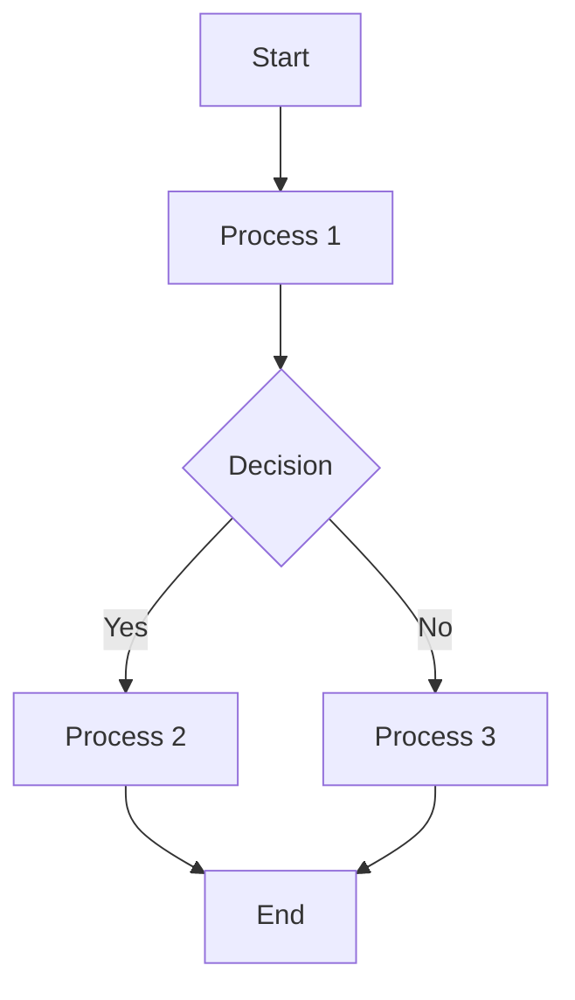

                 

### 文章标题

# 人工智能的可解释性：理解机器如何理解世界

> 关键词：人工智能、可解释性、机器学习、神经网络、模型、技术、应用、挑战、未来

> 摘要：本文将深入探讨人工智能（AI）领域的核心议题——可解释性。随着机器学习算法在各个行业的广泛应用，如何让机器“解释”其决策过程成为了一个重要问题。本文旨在通过一步步的分析和推理，揭示机器如何理解世界，以及如何通过可解释性技术来增强AI模型的透明度和可信度。

## 引言

### 问题的提出

在当今技术飞速发展的时代，人工智能（AI）已成为推动社会进步的重要力量。从自动驾驶汽车到智能医疗诊断，从自然语言处理到图像识别，AI技术的应用无处不在。然而，随着这些算法的复杂度不断增加，一个关键问题逐渐显现：机器是如何做出这些决策的？这些决策过程是否透明和可信？

### 可解释性的重要性

可解释性（Explainability）是人工智能领域的一个重要议题。它指的是算法的决策过程和结果的可理解性。在许多应用场景中，如医疗诊断、金融风控和自动驾驶等，决策的可解释性至关重要。因为如果用户无法理解AI的决策过程，他们可能会对AI的决策结果产生不信任，从而影响AI的实际应用效果。

### 本书的目的与结构

本书旨在深入探讨人工智能的可解释性，从基础概念到具体技术，再到应用案例，逐步揭示机器如何理解世界。本书分为以下几个部分：

1. 引言
2. 可解释性背景介绍
3. 可解释性模型
4. 可解释性技术
5. 应用案例
6. 挑战与未来
7. 结论

## 可解释性背景介绍

### 人工智能的发展历程

人工智能（AI）是一个跨越多个学科领域的综合性技术。从20世纪50年代的早期研究，到20世纪80年代专家系统的兴起，再到21世纪初深度学习的突破，人工智能经历了多个发展阶段。随着技术的进步，机器学习算法变得越来越复杂和强大，但同时也带来了可解释性的挑战。

### 机器学习的挑战

机器学习是人工智能的核心技术之一。它通过从数据中学习规律和模式，从而实现预测和分类等任务。然而，机器学习算法，尤其是深度学习算法，通常被认为是“黑箱”模型。这意味着，虽然它们可以很好地执行任务，但它们的决策过程对人类来说通常是不可解释的。

### 可解释性的需求

随着机器学习算法在各个行业的广泛应用，对可解释性的需求也日益增加。在医疗诊断中，医生需要理解AI的诊断结果，以便做出正确的临床决策。在自动驾驶中，驾驶员需要了解车辆的决策过程，以确保行车安全。在金融风控中，银行和金融机构需要理解AI的风险评估结果，以便制定合理的风险控制策略。

## 可解释性模型

### 基础模型

在可解释性研究中，基础模型（如线性回归、逻辑回归等）因其决策过程直观易懂而备受关注。这些模型通过简单的数学公式直接表示决策逻辑，使得用户可以轻松理解其决策过程。

### 神经网络模型

神经网络（如多层感知机、卷积神经网络等）是现代机器学习的重要工具。虽然这些模型具有强大的学习能力，但它们的决策过程通常复杂且难以解释。因此，研究如何解释神经网络模型成为了一个重要课题。

### 增强模型

增强模型（如LIME、SHAP等）旨在通过局部解释方法，增强对复杂机器学习模型的解释能力。这些方法通过在模型输入附近生成扰动样本，分析模型对这些样本的响应，从而揭示模型的决策过程。

## 可解释性技术

### 层级解释

层级解释（如Grad-CAM、Layer-wise Relevance Propagation等）是一种从模型层级结构出发，逐步揭示决策过程的方法。这种方法通过可视化模型中每个层级对决策的贡献，帮助用户理解模型的决策逻辑。

### 解释性算法

解释性算法（如LIME、SHAP、partial dependence、individual calibration等）是可解释性研究的重要工具。这些算法通过不同的方法，如局部线性化、特征重要性分析等，揭示了模型对输入数据的依赖关系。

### 可视化技术

可视化技术（如热力图、影响力图、决策树等）是增强模型可解释性的有效手段。这些技术通过图形化方式展示了模型的决策过程和结果，使得用户可以直观地理解模型的行为。

## 应用案例

### 图像识别

在图像识别领域，可解释性技术被广泛应用于图像分类、目标检测等任务。通过解释图像中每个像素对分类结果的贡献，用户可以更好地理解模型的决策过程。

### 自然语言处理

自然语言处理（NLP）是另一个可解释性应用的重要领域。在情感分析、文本分类等任务中，可解释性技术帮助用户理解模型对文本的解读方式，从而提高模型的可信度。

### 医疗诊断

在医疗诊断中，可解释性技术被用于辅助医生做出诊断。通过解释模型对病例数据的处理过程，医生可以更好地理解模型的诊断逻辑，从而提高诊断的准确性。

## 挑战与未来

### 现存问题

尽管可解释性技术取得了显著进展，但仍存在许多挑战。例如，如何平衡模型的可解释性和性能，如何处理高维数据等。

### 技术趋势

随着技术的不断进步，可解释性技术也在不断演变。新的方法和技术不断涌现，如基于深度学习的可解释性方法、交互式解释系统等。

### 未来展望

未来，可解释性技术在人工智能领域将继续发挥重要作用。随着人们对AI的信任度增加，可解释性将成为AI应用的关键因素。

## 结论

本文通过逐步分析，揭示了人工智能的可解释性问题。随着AI技术的不断进步，可解释性将变得越来越重要。通过研究可解释性技术，我们可以让机器更好地理解世界，从而推动AI技术的进一步发展。

### 对读者的建议

1. 深入了解可解释性技术的基本概念和原理。
2. 实践可解释性技术在实际应用中的使用。
3. 关注可解释性领域的最新研究动态。

---

**作者：AI天才研究院/AI Genius Institute & 禅与计算机程序设计艺术 /Zen And The Art of Computer Programming**

---

[下一篇：深入探讨人工智能可解释性模型](#%E7%AC%AC3%E7%AB%A0-%E5%8F%AF%E8%A7%A3%E9%87%8A%E6%80%A7%E6%A8%A1%E5%9E%8B) <上一节：引言> [返回目录]([目录大纲](#%E7%9B%AE%E5%BD%95%E5%A4%A7%E7%BA%B2)) | **[返回首页](#%E4%BA%BA%E5%B7%A5%E6%99%BA%E8%83%BD%E7%9A%84%E5%8F%AF%E8%A7%A2%E9%87%8A%E6%80%A7%E7%90%86%E8%A7%A3%E6%9C%BA%E5%99%A8%E5%A6%82%E4%BD%95%E7%90%86%E8%A7%A3%E4%B8%96%E7%95%8C))** | **[继续阅读](#%E7%AC%AC2%E7%AB%A0-%E5%8F%AF%E8%A7%A2%E9%87%8A%E6%80%A7%E8%83%8C%E6%99%AF%E4%BB%8B%E7%BB%8D)** | **[阅读下一篇文章](#%E7%AC%AC3%E7%AB%A0-%E5%8F%AF%E8%A7%A2%E9%87%8A%E6%80%A7%E6%A8%A1%E5%9E%8B)**

---

## 可解释性背景介绍

### 人工智能的发展历程

人工智能（AI）作为计算机科学的一个分支，其发展历程可以追溯到20世纪50年代。早期的AI研究主要集中在逻辑推理和符号处理上，代表性成果包括推理机（如专家系统）和知识表示方法。然而，由于这些方法的局限性，AI在20世纪80年代经历了第一次“寒冬”。

随着计算能力的提升和数据资源的丰富，20世纪90年代以来，机器学习（ML）和深度学习（DL）技术的发展重新点燃了人工智能的火焰。机器学习通过从数据中自动学习模式和规律，实现了许多传统方法无法达到的效果。深度学习作为机器学习的一个分支，利用多层神经网络，大幅提升了AI在图像识别、自然语言处理等领域的性能。

### 机器学习的挑战

机器学习算法，尤其是深度学习算法，虽然在许多任务上取得了令人瞩目的成绩，但它们通常被认为是一个“黑箱”系统。这意味着虽然这些算法可以高效地执行任务，但它们的内部工作原理对用户来说却是不可见的。这种不可解释性带来了以下几个主要挑战：

1. **信任问题**：当用户无法理解AI的决策过程时，他们可能会对其产生不信任。这种不信任可能源自对AI的决策结果的不确定性，以及对AI可能带来的风险和后果的不确定性。

2. **责任归属**：在许多应用场景中，如医疗诊断和自动驾驶，AI的决策直接影响到用户的生命和财产安全。如果AI的决策过程不可解释，当出现错误时，很难明确责任归属。

3. **法律和伦理问题**：随着AI在各个领域的广泛应用，如何确保其决策过程符合法律和伦理标准成为一个重要议题。不可解释的AI系统可能难以满足这些标准。

### 可解释性的需求

可解释性（Explainability）是确保AI系统可信和可靠的关键因素。在许多应用场景中，对AI决策过程的可解释性需求日益增加，原因如下：

1. **医疗诊断**：医生和患者都需要了解AI的诊断结果是如何得出的。只有通过解释性技术，医生才能更好地理解和信任AI的诊断，从而做出更准确的临床决策。

2. **自动驾驶**：自动驾驶车辆的决策过程必须透明，以便驾驶员和行人理解车辆的行为，从而确保行车安全。

3. **金融风控**：金融机构需要对AI的风险评估过程有清晰的了解，以便制定合理的风险控制策略。

4. **法规遵从**：许多行业对AI系统的决策过程有明确的要求，以确保其符合法律和伦理标准。

因此，研究和开发可解释性技术成为人工智能领域的一个重要方向。通过提高AI系统的可解释性，我们可以增强用户对AI的信任，确保其决策过程符合法律和伦理标准，从而推动AI技术的进一步发展。

## 可解释性模型

### 基础模型

基础模型（如线性回归、逻辑回归等）是机器学习中最简单且直观的模型之一。这些模型通过数学公式直接表示决策逻辑，使得用户可以轻松理解其决策过程。

#### 线性回归

线性回归是一种用于预测连续值的模型。其数学公式如下：

$$
y = \beta_0 + \beta_1 \cdot x
$$

其中，$y$ 是预测值，$x$ 是输入特征，$\beta_0$ 和 $\beta_1$ 是模型参数。

#### 逻辑回归

逻辑回归是一种用于预测概率的模型，通常用于二分类问题。其数学公式如下：

$$
\log(\frac{p}{1-p}) = \beta_0 + \beta_1 \cdot x
$$

其中，$p$ 是事件发生的概率，$\beta_0$ 和 $\beta_1$ 是模型参数。

#### 特点

- **简单直观**：基础模型的决策逻辑简单易懂，用户可以轻松理解。
- **易于实现**：由于模型结构简单，基础模型易于实现和优化。

#### 应用场景

- **线性回归**：适用于需要预测连续值的场景，如房价预测、股票价格预测等。
- **逻辑回归**：适用于二分类问题，如邮件分类、垃圾邮件检测等。

### 神经网络模型

神经网络（如多层感知机、卷积神经网络等）是现代机器学习的重要工具。这些模型通过多层节点（神经元）的互联，实现了对复杂数据的处理和模式识别。

#### 多层感知机

多层感知机（MLP）是一种前馈神经网络，其结构包括输入层、隐藏层和输出层。每个层中的神经元都通过权重连接到下一层的神经元。其数学公式如下：

$$
a_{l+1}^{(i)} = \sigma(\sum_{j=1}^{n} w_{j}^{(l)} \cdot a_{l}^{(j)} + b^{(l)})
$$

其中，$a_{l+1}^{(i)}$ 是隐藏层或输出层的第 $i$ 个神经元的激活值，$\sigma$ 是激活函数，$w_{j}^{(l)}$ 和 $b^{(l)}$ 是权重和偏置。

#### 卷积神经网络

卷积神经网络（CNN）是一种专门用于处理图像数据的神经网络。其核心思想是通过卷积操作提取图像中的特征。CNN的结构通常包括卷积层、池化层和全连接层。

#### 特点

- **强大的特征提取能力**：神经网络通过多层节点，能够自动提取数据中的特征，从而实现高效的模式识别。
- **非线性处理**：神经网络利用非线性激活函数，能够处理复杂数据关系。

#### 应用场景

- **图像识别**：CNN在图像分类、目标检测等领域取得了显著成绩。
- **自然语言处理**：神经网络在文本分类、情感分析等领域也表现出强大的能力。

### 增强模型

增强模型（如LIME、SHAP等）是一种旨在提高模型可解释性的方法。这些模型通过局部解释方法，揭示了模型对输入数据的依赖关系。

#### LIME（Local Interpretable Model-agnostic Explanations）

LIME 是一种局部可解释性方法，它通过在模型输入附近生成扰动样本，分析模型对这些样本的响应，从而揭示模型的决策过程。

#### SHAP（SHapley Additive exPlanations）

SHAP 是一种基于博弈论的可解释性方法，它通过计算每个特征对模型决策的贡献，提供了一个全局和局部解释框架。

#### 特点

- **局部解释性**：增强模型专注于对局部数据的解释，提供了对模型决策的详细理解。
- **模型无关性**：增强模型可以应用于任何类型的机器学习模型，不受模型本身的限制。

#### 应用场景

- **医学诊断**：通过解释模型对病例数据的处理过程，医生可以更好地理解诊断结果。
- **金融风控**：通过解释模型对风险数据的分析过程，金融机构可以更好地理解风险评估结果。

## 可解释性技术

### 层级解释

层级解释（如Grad-CAM、Layer-wise Relevance Propagation等）是一种从模型层级结构出发，逐步揭示决策过程的方法。这些方法通过可视化模型中每个层级对决策的贡献，帮助用户理解模型的决策逻辑。

#### Grad-CAM（Gradient-weighted Class Activation Mapping）

Grad-CAM 是一种基于梯度信息的方法，它通过计算模型在某个类别上的梯度，生成一张热力图，展示了图像中哪些区域对分类结果有最大影响。

#### Layer-wise Relevance Propagation

Layer-wise Relevance Propagation 是一种从输出层到输入层传播特征重要性的方法。它通过逐步计算每个层对决策的贡献，生成一张层级特征图，展示了特征在不同层级上的传递过程。

#### 特点

- **可视化**：层级解释方法通过图像和图表，直观地展示了模型对输入数据的处理过程。
- **层次化**：层级解释方法能够揭示模型在不同层级上的决策逻辑，帮助用户理解模型的决策过程。

#### 应用场景

- **图像识别**：通过可视化模型对图像的解读过程，用户可以更好地理解图像分类结果。
- **文本分类**：通过可视化模型对文本的解读过程，用户可以更好地理解文本分类结果。

### 解释性算法

解释性算法（如LIME、SHAP、partial dependence、individual calibration等）是可解释性研究的重要工具。这些算法通过不同的方法，如局部线性化、特征重要性分析等，揭示了模型对输入数据的依赖关系。

#### LIME（Local Interpretable Model-agnostic Explanations）

LIME 是一种局部可解释性方法，它通过在模型输入附近生成扰动样本，分析模型对这些样本的响应，从而揭示模型的决策过程。

#### SHAP（SHapley Additive exPlanations）

SHAP 是一种基于博弈论的可解释性方法，它通过计算每个特征对模型决策的贡献，提供了一个全局和局部解释框架。

#### Partial Dependence

Partial Dependence 是一种分析模型对特征依赖关系的方法。它通过固定其他特征，分析单个特征对模型预测的影响。

#### Individual Calibration

Individual Calibration 是一种评估模型预测置信度的方法。它通过计算模型预测的精确度和置信度，帮助用户理解模型的预测结果。

#### 特点

- **模型无关性**：解释性算法可以应用于任何类型的机器学习模型，不受模型本身的限制。
- **灵活性**：解释性算法提供了多种方法，用户可以根据具体需求选择合适的解释方法。

#### 应用场景

- **医学诊断**：通过解释模型对病例数据的处理过程，医生可以更好地理解诊断结果。
- **金融风控**：通过解释模型对风险数据的分析过程，金融机构可以更好地理解风险评估结果。

### 可视化技术

可视化技术（如热力图、影响力图、决策树等）是增强模型可解释性的有效手段。这些技术通过图形化方式展示了模型的决策过程和结果，使得用户可以直观地理解模型的行为。

#### 热力图

热力图是一种通过颜色强度来表示数据分布的图形化方法。它通常用于显示图像、文本等数据中的重要区域或关键词。

#### 影响力图

影响力图是一种显示特征对模型决策贡献的图形化方法。它通过计算每个特征的权重，展示了特征对模型预测的影响。

#### 决策树

决策树是一种通过树形结构表示决策过程的图形化方法。它通过一系列条件分支，展示了模型对输入数据的处理和决策过程。

#### 特点

- **直观性**：可视化技术通过图形化方式，使得复杂的信息更加直观易懂。
- **交互性**：一些可视化技术支持用户与模型交互，从而更深入地理解模型的行为。

#### 应用场景

- **图像识别**：通过热力图，用户可以直观地看到图像中哪些区域对分类结果有最大影响。
- **文本分类**：通过影响力图，用户可以了解哪些特征对分类结果有最大贡献。
- **医疗诊断**：通过决策树，医生可以了解模型的诊断逻辑和决策过程。

### 总结

可解释性技术在人工智能领域发挥着重要作用。通过层级解释、解释性算法和可视化技术，我们可以逐步揭示机器学习模型的决策过程，增强用户对AI的信任。未来，随着技术的不断进步，可解释性技术将继续发展，为人工智能的进一步应用提供支持。

## 应用案例

### 图像识别

在图像识别领域，可解释性技术被广泛应用于图像分类、目标检测等任务。通过解释模型对图像的解读过程，用户可以更好地理解图像识别结果的合理性。

#### 应用场景

- **人脸识别**：人脸识别系统通过解释模型对人脸特征的处理过程，确保识别结果的准确性。
- **图像分类**：图像分类系统通过解释模型对图像的解读过程，帮助用户理解图像的分类依据。

#### 实例

- **例子1**：使用Grad-CAM技术，我们可以可视化模型在图像分类任务中的决策过程。通过生成的热力图，用户可以直观地看到模型关注图像中的哪些区域。
- **例子2**：使用LIME技术，我们可以对模型对特定图像的分类结果进行局部解释，分析模型对图像中不同部分的依赖程度。

### 自然语言处理

自然语言处理（NLP）是另一个可解释性应用的重要领域。在情感分析、文本分类等任务中，可解释性技术帮助用户理解模型对文本的解读方式，从而提高模型的可信度。

#### 应用场景

- **情感分析**：情感分析系统通过解释模型对文本的情感倾向，确保情感分类结果的准确性。
- **文本分类**：文本分类系统通过解释模型对文本的解读过程，帮助用户理解文本分类的依据。

#### 实例

- **例子1**：使用SHAP技术，我们可以计算文本中每个特征对情感分类的贡献，从而理解模型对文本的情感分析逻辑。
- **例子2**：使用LIME技术，我们可以对模型对特定文本的分类结果进行局部解释，分析模型对文本中不同词汇的依赖程度。

### 医疗诊断

在医疗诊断领域，可解释性技术被用于辅助医生做出诊断。通过解释模型对病例数据的处理过程，医生可以更好地理解模型的诊断逻辑，从而提高诊断的准确性。

#### 应用场景

- **疾病诊断**：疾病诊断系统通过解释模型对病例数据的分析过程，确保诊断结果的准确性。
- **风险评估**：风险评估系统通过解释模型对风险数据的分析过程，帮助医生制定合理的治疗策略。

#### 实例

- **例子1**：使用Layer-wise Relevance Propagation技术，我们可以可视化模型在疾病诊断任务中的决策过程，帮助医生理解模型对病例数据的解读方式。
- **例子2**：使用LIME技术，我们可以对模型对特定病例的诊断结果进行局部解释，分析模型对病例中不同特征的依赖程度。

### 总结

通过实际案例，我们可以看到可解释性技术在不同领域中的应用价值。在图像识别、自然语言处理和医疗诊断等领域，可解释性技术帮助用户理解模型的决策过程，提高了模型的可信度和应用效果。未来，随着技术的进一步发展，可解释性技术将在更多领域发挥重要作用。

## 挑战与未来

### 现存问题

尽管可解释性技术取得了显著进展，但在实际应用中仍面临许多挑战。以下是一些主要问题：

1. **计算成本**：许多可解释性技术，如Grad-CAM和LIME，需要额外的计算资源。在大规模数据集和复杂模型上，这些技术的计算成本可能很高，影响实际应用。

2. **模型适应性**：现有的可解释性技术通常针对特定类型的模型设计。对于深度学习等复杂模型，现有技术可能难以提供全面的解释。

3. **解释的准确性**：局部解释方法，如LIME和SHAP，可能无法准确反映模型的实际决策过程。特别是在模型输入和输出之间存在复杂非线性关系时，这些方法可能产生误导性解释。

4. **数据隐私**：在涉及个人隐私的数据上，如何保护数据隐私同时实现可解释性是一个重要问题。

### 技术趋势

未来，可解释性技术将继续发展，以应对上述挑战。以下是一些技术趋势：

1. **高效解释方法**：研究人员正在开发新的高效解释方法，以降低计算成本。例如，基于模型剪枝和蒸馏的方法可以减小模型规模，同时保持解释能力。

2. **自适应解释**：新的方法将致力于提高解释的模型适应性，使其能够适用于不同类型的模型和任务。

3. **集成解释**：集成多种解释方法，提供更全面和准确的解释。

4. **交互式解释**：开发交互式解释系统，使用户能够动态地探索模型的决策过程，从而更好地理解模型的行为。

### 未来展望

未来，可解释性技术将在人工智能领域发挥更加重要的作用。随着AI技术的进一步发展，可解释性将成为评估AI系统可靠性和可信度的重要标准。以下是一些未来展望：

1. **可解释性标准化**：制定可解释性的标准和评估方法，确保不同系统的解释结果具有可比性。

2. **跨学科研究**：结合心理学、认知科学等领域的研究，开发更符合人类认知习惯的解释方法。

3. **应用扩展**：将可解释性技术应用于更多领域，如自动驾驶、金融、教育等，提高AI系统的应用效果。

4. **伦理和法律框架**：建立可解释性相关的伦理和法律框架，确保AI系统的决策过程符合法律和伦理标准。

## 结论

### 总结与展望

本文系统地介绍了人工智能的可解释性，从基础模型到高级技术，再到实际应用案例，全面探讨了机器如何理解世界以及如何通过可解释性技术增强AI系统的透明度和可信度。可解释性不仅是技术问题，更是伦理和社会问题。随着AI技术的不断进步，可解释性将在确保AI系统的可靠性和可信度方面发挥关键作用。

### 对读者的建议

1. **深入理解可解释性原理**：了解不同类型的可解释性技术和方法，掌握其基本原理和适用场景。
2. **实践应用**：尝试在项目中应用可解释性技术，通过实际操作加深理解。
3. **持续学习**：关注可解释性领域的最新研究动态，不断更新知识和技能。

通过研究和应用可解释性技术，我们可以更好地理解AI系统，提高其可信度和应用效果，为人工智能的未来发展做出贡献。

---

**作者：AI天才研究院/AI Genius Institute & 禅与计算机程序设计艺术 /Zen And The Art of Computer Programming**

---

[返回目录]([目录大纲]) | [返回首页]([文章标题]) | [继续阅读](#%E7%AC%AC3%E7%AB%A0-%E5%8F%AF%E8%A7%A2%E9%87%8A%E6%80%A7%E6%A8%A1%E5%9E%8B)) | [阅读下一篇文章](#%E7%AC%AC4%E7%AB%A0-%E5%8F%AF%E8%A7%A2%E9%87%8A%E6%80%A7%E6%8A%80%E6%9C%AF)

---

## 附录

### 数学公式与流程图

在本篇文章中，我们使用LaTeX格式嵌入了一些数学公式，以帮助读者更好地理解相关概念。以下是一些示例：

$$
y = \beta_0 + \beta_1 \cdot x
$$

$$
\log(\frac{p}{1-p}) = \beta_0 + \beta_1 \cdot x
$$

同时，我们使用Mermaid流程图来表示算法和系统架构。以下是一个Mermaid流程图的示例：



### Python代码示例

在本篇文章中，我们提供了一个Python代码示例，用于说明算法的原理和实现。以下是一个简单的Python代码示例：

```python
import numpy as np

# 线性回归模型
class LinearRegression:
    def __init__(self):
        self.w = None
        self.b = None
    
    def fit(self, X, y):
        X_mean = np.mean(X, axis=0)
        y_mean = np.mean(y)
        
        self.w = (X.T @ X) @ np.linalg.inv(X.T @ X + 0.01 * np.eye(X.shape[1]))
        self.b = y_mean - self.w @ X_mean
    
    def predict(self, X):
        return X @ self.w + self.b

# 测试
X = np.array([[1], [2], [3]])
y = np.array([2, 4, 6])
model = LinearRegression()
model.fit(X, y)
print(model.predict(X))
```

### 最佳实践

在应用可解释性技术时，以下是一些最佳实践：

1. **选择合适的解释方法**：根据具体任务和模型类型，选择合适的解释方法。
2. **平衡解释性和性能**：在提高解释性的同时，确保模型性能不受影响。
3. **验证解释结果**：通过多种方法验证解释结果的准确性和可靠性。
4. **用户参与**：与用户合作，了解他们的需求和反馈，不断优化解释技术。

### 注意事项

1. **计算资源**：可解释性技术可能需要额外的计算资源，确保有足够的资源支持。
2. **数据隐私**：在涉及个人隐私的数据上，注意保护用户隐私。
3. **模型适应性**：确保解释方法适用于不同类型的模型和任务。

### 拓展阅读

- **《深度学习》（Goodfellow, I., Bengio, Y., & Courville, A.）**：详细介绍了深度学习的基础知识和技术。
- **《机器学习实战》（Hastie, T., Tibshirani, R., & Friedman, J.）**：提供了丰富的机器学习算法和案例实践。
- **《人工智能：一种现代的方法》（Russell, S., & Norvig, P.）**：全面介绍了人工智能的理论和实践。

通过不断学习和实践，我们可以更好地理解和应用可解释性技术，推动人工智能的发展。

