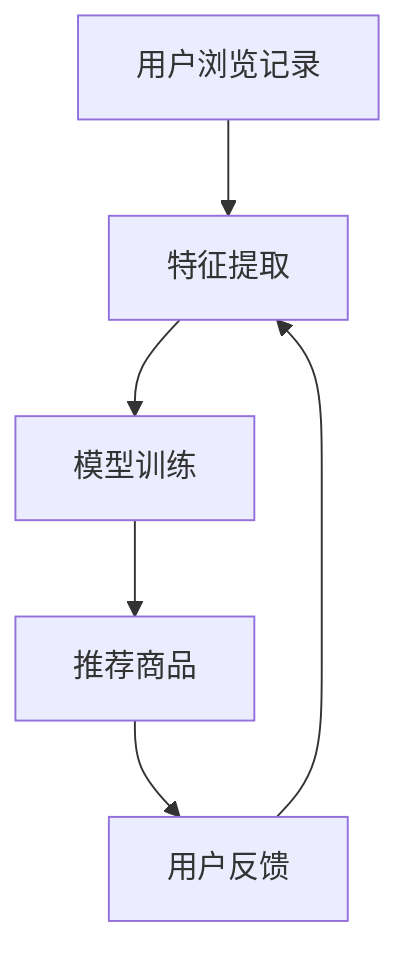
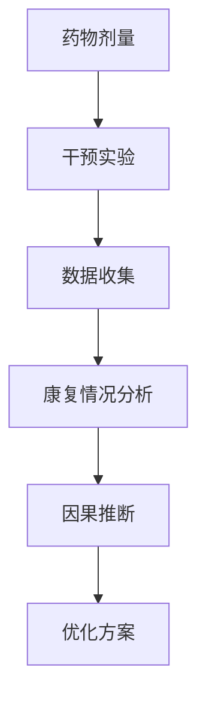
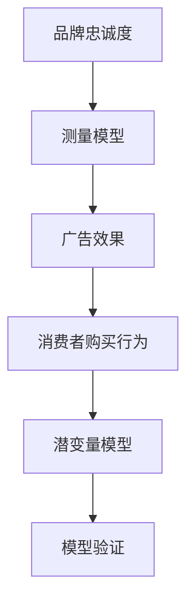
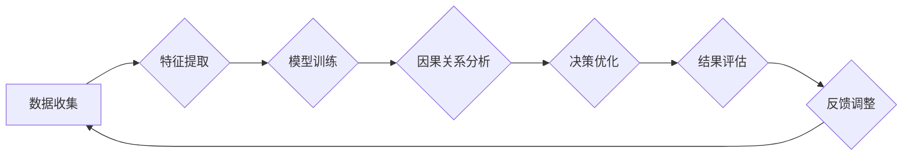

                 

### 第一部分：背景与引论

#### 第1章：人工智能的因果推断概述

##### 1.1 人工智能的发展历程

人工智能（AI）是计算机科学的一个重要分支，旨在创建能够执行通常需要人类智能才能完成的任务的智能系统。AI的发展历程大致可以分为三个阶段：规则驱动系统、知识工程和机器学习。

在20世纪50年代至70年代，人工智能主要以规则驱动系统为主，依赖于预定义的规则和逻辑推理。这个时期，AI的研究主要集中在构建逻辑推理系统和专家系统，如ELIZA和Dendral。然而，由于规则的复杂性以及现实世界问题的不确定性，规则驱动系统在实际应用中受到了很大的限制。

80年代至90年代，随着知识的获取和表示技术的进步，知识工程成为AI研究的热点。知识工程试图通过构建知识库和推理机来模拟人类的智能决策过程。代表性的系统包括MYCIN和Prospector，这些系统能够在特定领域内提供高水平的决策支持。尽管知识工程在特定领域取得了成功，但它仍然依赖于领域专家的参与，难以泛化到其他领域。

进入21世纪，机器学习和深度学习的兴起，使得AI取得了突破性的进展，从传统的规则驱动系统转变为数据驱动系统。机器学习通过训练模型来识别数据中的模式，从而实现预测和分类任务。深度学习则通过神经网络的结构来模拟人脑的学习过程，能够处理更加复杂的数据和任务。代表性的模型包括卷积神经网络（CNN）和循环神经网络（RNN），这些模型在图像识别、语音识别和自然语言处理等领域取得了显著的成果。

##### 1.2 因果推断在人工智能中的重要性

因果推断是人工智能中的一个核心问题，它涉及到理解数据背后的因果关系，从而做出合理的决策和预测。因果推断在人工智能中的应用非常广泛，包括但不限于：医疗诊断、推荐系统、自动驾驶、金融风险管理等。

在医疗诊断中，因果推断可以帮助医生理解不同症状之间的关系，从而更准确地诊断疾病。例如，通过分析患者的病史和检测结果，可以推断出某种疾病与特定症状之间的因果关系，从而为患者提供个性化的治疗方案。

在推荐系统中，因果推断可以帮助系统理解用户行为背后的动机，从而提供更个性化的推荐。例如，通过分析用户的历史购买行为和浏览记录，可以推断出用户对不同商品的兴趣，并据此推荐相关的商品。

在自动驾驶中，因果推断可以帮助车辆理解道路环境中的因果关系，从而做出安全的驾驶决策。例如，通过分析车辆周围的障碍物和交通状况，可以推断出车辆在特定情境下的最佳行驶路径。

在金融风险管理中，因果推断可以帮助金融机构理解不同金融产品之间的因果关系，从而制定有效的风险管理策略。例如，通过分析市场的历史数据，可以推断出某种金融产品的价格变动与市场整体走势之间的因果关系，从而预测市场风险。

##### 1.3 伦理决策的数学框架

随着人工智能的广泛应用，伦理问题也日益凸显。在人工智能系统中，如何做出符合伦理的决策是一个亟待解决的问题。伦理决策的数学框架试图通过数学模型来描述和解决伦理决策问题。这个框架包括了对伦理原则的数学化表示、对伦理决策过程的建模、以及对伦理决策结果的评估和优化。

伦理决策的数学框架首先需要明确伦理原则的数学化表示。伦理原则如公平性、透明度和责任性等可以转化为数学公式和算法，以便在人工智能系统中进行计算和优化。例如，公平性可以通过统计学中的均值不等式来表示，透明度可以通过可解释性模型来衡量，责任性可以通过因果推断算法来评估。

接下来，伦理决策的数学框架需要对伦理决策过程进行建模。这包括对决策场景的分析、决策因素的识别、以及决策目标的设定。通过建立数学模型，可以模拟伦理决策的过程，并评估不同决策方案的效果。

最后，伦理决策的数学框架需要对伦理决策结果进行评估和优化。这可以通过优化算法和评估指标来实现。优化算法如线性规划和遗传算法可以用于寻找最优的决策方案，评估指标如准确性、公平性和可解释性可以用于评估决策方案的效果。

通过建立伦理决策的数学框架，可以更好地指导人工智能系统的设计和应用，确保其符合伦理标准。这不仅有助于提高人工智能系统的可靠性和安全性，也有助于构建一个更加公正、透明和负责的人工智能社会。

### 第2章：因果推断的基本概念

#### 2.1 因果关系的定义与特性

因果关系是指一个事件（原因）如何导致另一个事件（结果）的关系。在因果推断中，我们试图从数据中识别出这种因果关系。因果关系具有几个重要特性，包括：

- **因果关系的时间顺序**：原因必须在结果之前发生。例如，下雨是地面湿润的原因，因此下雨必须在地面湿润之前发生。
- **因果关系的依赖性**：结果依赖于原因的存在。如果原因是A，结果是B，那么B必须在A存在的情况下才会发生。例如，如果没有雨（原因A），地面就不会湿润（结果B）。
- **因果关系的唯一性**：一个原因只能对应一个结果。例如，如果A是B的原因，那么B不能由C来解释。也就是说，B的唯一原因只能是A。

#### 2.2 因果推断的理论基础

因果推断的理论基础主要包括概率图模型、因果推断算法、以及因果推理的验证方法。

**概率图模型**：

概率图模型是一种用于描述变量之间因果关系的图形表示方法。它包括因果图（CG）和 bayesian 网络两种类型。

- **因果图**：因果图是一种无向图，它表示变量之间的因果关系。在因果图中，变量被视为节点，因果关系通过边来表示。例如，如果变量X导致变量Y，那么在因果图中，节点Y将与节点X相连。
  
  $$ \text{图 1：因果图示例} $$
  
  ```mermaid
  graph LR
  A[变量X] --> B[变量Y]
  ```

- **bayesian 网络**：bayesian 网络是一种有向图，它表示变量之间的概率依赖关系。在bayesian 网络中，变量被视为节点，概率依赖关系通过边来表示。例如，如果变量X影响变量Y，那么在bayesian 网络中，节点Y将与节点X相连，并且会有一个概率值表示X对Y的影响程度。

  $$ \text{图 2：bayesian 网络示例} $$
  
  ```mermaid
  graph LR
  A[变量X] --> B[变量Y]
  B --> C[变量Z]
  ```

**因果推断算法**：

因果推断算法是一类用于从数据中推断因果关系的方法。常见的因果推断算法包括：

- **Do-Calculus**：Do-Calculus 是一种形式化的方法，用于计算在干预某个变量后，其他变量的条件期望。它通过计算干预前后的数据分布来推断因果关系。

  $$ \text{公式 1：Do-Calculus 公式} $$
  
  ```latex
  E[Y|do(X = x)] = \sum_y E[Y|X = x, Z = z] P[Z = z]
  ```

- **Causal Bayesian Network**：Causal Bayesian Network 是一种基于 bayesian 网络的因果推断方法。它通过学习 bayesian 网络的结构来推断变量之间的因果关系。

  $$ \text{公式 2：Causal Bayesian Network 公式} $$
  
  ```latex
  P(X, Y, Z) = P(X) P(Y|X) P(Z|X, Y)
  ```

**因果推理的验证方法**：

因果推理的验证方法用于评估从数据中推断出的因果关系是否真实有效。常见的验证方法包括：

- **Randomized Controlled Trial**：随机对照试验是一种用于验证因果关系的方法。它通过将参与者随机分配到实验组和对照组，来消除其他变量对结果的影响，从而验证因果关系。

- **Instrumental Variable**：工具变量是一种用于解决因果关系问题的方法。它通过引入一个与原因相关但与结果无关的工具变量，来消除其他变量的干扰，从而验证因果关系。

  $$ \text{公式 3：工具变量公式} $$
  
  ```latex
  Y = X + \epsilon + Z \beta
  ```

通过理解这些理论基础，我们可以更好地进行因果推断，从而在人工智能系统中做出更准确、更合理的决策。接下来，我们将探讨因果推断在不同场景中的应用，以更深入地了解其重要性。

### 第3章：因果推断的方法与技术

#### 3.1 监测学习

监测学习（Monitoring Learning）是因果推断的一种基本方法，它通过分析系统的输入和输出数据，来推断变量之间的关系。监测学习的核心目标是识别变量之间的因果关系，以便在后续的数据处理和分析中利用这些关系。

**工作原理**：

监测学习的工作原理可以概括为以下步骤：

1. **数据收集**：首先，收集大量的输入和输出数据对。这些数据对可以来自实际系统的观测，也可以通过模拟实验获得。
2. **特征提取**：对输入数据进行特征提取，以便更好地表示数据的结构和关系。常用的特征提取方法包括统计特征、机器学习特征和深度学习特征。
3. **模型训练**：使用提取到的特征训练一个统计模型或机器学习模型，以预测输出变量。常见的模型包括线性回归模型、决策树、随机森林和神经网络等。
4. **因果关系推断**：通过分析模型预测结果和实际输出数据之间的差异，推断变量之间的因果关系。例如，如果某个输入变量对输出变量的预测结果有显著影响，那么可以推断这个输入变量与输出变量之间存在因果关系。

**优缺点**：

- **优点**：
  - 监测学习方法简单，易于实现和操作。
  - 可以处理高维数据，适用于复杂的因果关系分析。
  - 可以实时监测系统性能，及时调整模型参数。

- **缺点**：
  - 监测学习依赖于大量的观测数据，数据质量对结果有较大影响。
  - 对噪声敏感，可能会误判因果关系。
  - 在某些情况下，模型可能无法准确捕捉变量之间的非线性关系。

**应用场景**：

监测学习在人工智能的各个领域都有广泛应用，以下是几个典型的应用场景：

- **推荐系统**：通过监测用户的行为数据（如浏览记录、购买历史等），可以推断用户对不同商品的偏好，从而提供个性化的推荐。
- **医疗诊断**：通过监测患者的症状和检查结果，可以推断出可能的疾病类型，帮助医生做出更准确的诊断。
- **自动驾驶**：通过监测车辆传感器和摄像头获取的环境数据，可以推断出行驶过程中的风险，帮助自动驾驶系统做出安全的驾驶决策。

**具体案例**：

一个具体的案例是亚马逊的推荐系统。亚马逊使用监测学习方法来分析用户的浏览记录和购买历史，以推断用户对特定商品的偏好。通过训练一个基于用户行为的推荐模型，亚马逊可以实时为用户推荐可能感兴趣的商品，从而提高用户满意度和销售额。



通过这种循环监测学习的方式，亚马逊能够不断优化其推荐系统，使其更准确地满足用户的需求。

#### 3.2 干预学习

干预学习（Intervention Learning）是因果推断的另一种重要方法，它通过在系统中引入干预变量，来观察系统响应的变化，从而推断变量之间的因果关系。干预学习的目标是通过干预一个变量，观察其他变量的变化，从而确定变量之间的因果依赖关系。

**工作原理**：

干预学习的工作原理可以概括为以下步骤：

1. **干预设计**：首先，需要设计干预实验，选择一个或多个干预变量。干预变量是可以控制的变量，通过改变它的值来观察系统响应的变化。
2. **数据收集**：在干预实验中，收集干预前、干预过程中和干预后的系统数据。这些数据包括干预变量的取值、系统响应的测量以及其他相关变量的观测值。
3. **因果效应分析**：使用统计方法或机器学习算法，分析干预变量对系统响应的影响。通过比较干预前后的系统响应，可以推断出变量之间的因果关系。
4. **因果推断**：根据因果效应分析的结果，构建因果图或bayesian 网络来表示变量之间的因果关系。

**优缺点**：

- **优点**：
  - 干预学习可以直接观察到变量之间的因果效应，比监测学习更可靠。
  - 可以处理复杂的非线性关系和因果关系。
  - 可以用于探索性的数据分析，帮助发现新的因果关系。

- **缺点**：
  - 干预学习通常需要设计复杂的干预实验，时间和成本较高。
  - 实验设计不当可能导致误导性的因果推断。
  - 干预学习可能不适用于所有场景，如伦理敏感领域。

**应用场景**：

干预学习在多个领域都有广泛应用，以下是几个典型的应用场景：

- **医疗**：通过干预治疗方案中的变量（如药物剂量、治疗时长等），可以分析不同治疗方案对疾病康复的影响，从而优化治疗方案。
- **市场营销**：通过干预广告投放策略、促销活动等，可以分析这些策略对销售业绩的影响，从而优化营销策略。
- **教育**：通过干预教育方式（如教学方法、课程设置等），可以分析这些方式对学生学习效果的影响，从而优化教育方案。

**具体案例**：

一个具体的案例是药物疗效的研究。研究人员通过设计干预实验，分别给予不同剂量的药物，观察患者的康复情况。通过分析干预前后的数据，可以推断出药物剂量与疗效之间的因果关系，从而优化药物治疗方案。



通过这种干预学习的方式，研究人员能够更准确地了解药物的作用机制，为患者提供更有效的治疗方案。

#### 3.3 结构方程模型

结构方程模型（Structural Equation Model，SEM）是一种用于分析和验证变量之间因果关系的统计模型。SEM结合了线性回归模型和路径分析的方法，可以同时处理多个变量之间的复杂关系，从而提供更全面的因果关系分析。

**工作原理**：

结构方程模型的工作原理可以概括为以下步骤：

1. **模型建立**：首先，建立变量之间的结构方程模型。模型包括两个部分：测量模型和潜变量模型。测量模型描述潜变量与观测变量之间的关系，潜变量模型描述潜变量之间的关系。
2. **模型估计**：使用最大似然估计（Maximum Likelihood Estimation，MLE）等方法估计模型参数。这些参数包括路径系数、误差项和测量误差等。
3. **模型验证**：通过拟合优度指数（如卡方检验、比较拟合指数等）评估模型拟合程度。如果模型拟合良好，则可以接受模型假设，否则需要对模型进行调整。

**优缺点**：

- **优点**：
  - SEM可以同时处理多个变量之间的复杂关系，提供全面的因果关系分析。
  - 可以包含潜在变量，适用于处理不可直接观测的变量。
  - 可以进行路径分析，了解变量之间的直接和间接关系。

- **缺点**：
  - SEM建模过程较为复杂，需要专业知识。
  - 模型估计和验证需要大量的计算资源。
  - 对数据质量和样本量有较高要求。

**应用场景**：

结构方程模型在多个领域都有广泛应用，以下是几个典型的应用场景：

- **心理学**：用于分析人格特质、情绪状态等变量之间的关系，了解个体心理发展的因果机制。
- **市场营销**：用于分析消费者行为、品牌偏好等变量之间的关系，帮助制定有效的营销策略。
- **社会研究**：用于分析社会现象之间的因果关系，如教育、就业、家庭等变量之间的关系。

**具体案例**：

一个具体的案例是消费者行为研究。研究人员使用结构方程模型分析消费者购买行为与品牌忠诚度、广告效果等变量之间的关系。通过建立测量模型和潜变量模型，可以深入了解消费者购买行为的因果机制，为品牌营销提供科学依据。



通过这种结构方程模型的分析，研究人员能够更深入地了解消费者行为，为市场策略提供数据支持。

### 第4章：伦理决策的数学框架

#### 4.1 数学框架的构建原则

伦理决策的数学框架旨在通过数学模型和算法来描述和解决伦理决策问题。构建这个框架需要遵循以下原则：

1. **伦理原则的数学化表示**：首先，需要将伦理原则（如公平性、透明度和责任性）转化为数学概念和公式。例如，公平性可以通过统计学中的均值不等式来表示，透明度可以通过可解释性模型来衡量，责任性可以通过因果推断算法来评估。

2. **伦理决策过程的建模**：接下来，需要建立伦理决策过程的数学模型。这包括对决策场景的分析、决策因素的识别、以及决策目标的设定。通过建立数学模型，可以模拟伦理决策的过程，并评估不同决策方案的效果。

3. **决策结果的评价和优化**：最后，需要对伦理决策结果进行评价和优化。这可以通过优化算法和评估指标来实现。优化算法如线性规划和遗传算法可以用于寻找最优的决策方案，评估指标如准确性、公平性和可解释性可以用于评估决策方案的效果。

#### 4.2 数学框架的应用

伦理决策的数学框架可以在多个领域中得到应用，以下是几个典型的应用场景：

1. **医疗领域**：在医疗决策中，数学框架可以用于优化治疗方案，确保公平性和透明度。例如，通过分析患者的历史数据和基因信息，可以确定最优的治疗方案，同时避免因种族、性别等因素导致的歧视。

2. **金融领域**：在金融决策中，数学框架可以用于评估风险和管理责任。例如，通过分析市场数据和历史交易记录，可以预测金融风险，并制定相应的风险管理策略。

3. **教育领域**：在教育决策中，数学框架可以用于优化课程设计和教学资源分配。例如，通过分析学生的学习成绩和背景信息，可以确定最优的教学方案，确保教育的公平性和有效性。

#### 4.3 数学框架的优缺点

伦理决策的数学框架具有以下优点：

- **精确性**：通过数学模型和算法，可以精确地描述和解决伦理决策问题，提供可靠的决策依据。
- **透明度**：数学框架的构建和运行过程是透明的，决策过程和结果可以追溯和验证，增强了决策的透明度。
- **可解释性**：数学框架的结果可以通过数学公式和算法解释，有助于理解决策的原理和机制。

然而，伦理决策的数学框架也存在一些缺点：

- **数据依赖性**：数学框架的准确性和可靠性依赖于高质量的数据。如果数据存在偏差或噪声，可能会导致错误的决策结果。
- **模型复杂度**：构建和运行数学框架需要复杂的数学和统计知识，对用户的专业技能要求较高。
- **伦理困境**：在某些情况下，数学框架可能无法解决复杂的伦理困境，需要结合人类的道德判断和价值观。

#### 案例分析

为了更直观地展示伦理决策的数学框架在实际中的应用，我们来看一个案例：自动驾驶车辆的伦理决策。

在自动驾驶车辆中，可能会遇到以下伦理困境：当车辆在紧急情况下必须选择保护乘客还是行人时，应该如何决策？数学框架可以通过以下步骤来解决这个伦理决策问题：

1. **构建决策模型**：首先，定义决策场景和相关变量，如车辆的速度、行人的位置、乘客的体重等。然后，建立伦理决策的数学模型，包括伦理原则（如最小伤害原则）的数学表示。

2. **数据收集**：收集与决策场景相关的数据，如车辆传感器数据、行人行为数据等。

3. **模型训练**：使用收集到的数据训练决策模型，通过机器学习和因果推断算法，确定不同决策方案的效果。

4. **决策模拟**：在模拟环境中运行决策模型，观察不同决策方案对结果的影响。

5. **结果评估**：根据伦理原则和评估指标（如伤害最小化），评估不同决策方案的效果，选择最优方案。

通过这个案例分析，我们可以看到伦理决策的数学框架如何在实际应用中发挥作用，帮助自动驾驶车辆在紧急情况下做出符合伦理的决策。

### 第5章：伦理决策的背景与原则

#### 5.1 伦理学的基本概念

伦理学（Ethics）是研究道德原则和道德行为的学科，旨在探讨人类行为的正确性和合理性。伦理学的基本概念包括：

1. **道德原则**：道德原则是指导人们行为的规范和准则。常见的道德原则包括公正、尊重、诚信和责任。公正要求平等对待每个人，尊重要求尊重他人的权利和尊严，诚信要求诚实守信，责任要求对自己和他人的行为负责。

2. **道德规范**：道德规范是具体的行为准则，用于指导个人和群体在特定情境下的行为。道德规范通常由社会、文化和法律等因素共同决定。

3. **道德判断**：道德判断是对行为是否符合道德规范的评价。道德判断通常基于道德原则和道德规范，涉及对行为的是非、善恶和价值判断。

#### 5.2 伦理决策的挑战

伦理决策是人工智能系统设计和应用中的一个重要问题，它涉及到如何确保系统在执行任务时符合道德原则。伦理决策面临的挑战包括：

1. **多元价值观**：不同文化和社会背景下，人们对于道德原则和道德规范的认知和接受程度存在差异，导致伦理决策的复杂性。

2. **不确定性和模糊性**：在现实世界中，变量和情境通常是动态变化的，难以精确预测和量化。这增加了伦理决策的不确定性和模糊性，使得决策过程更加复杂。

3. **技术依赖性**：人工智能系统依赖于大量数据和算法，决策过程高度自动化。技术依赖性可能导致道德责任的不明确，使得伦理决策更加困难。

4. **责任归属**：在人工智能系统中，如何确定责任归属是一个重要问题。如果系统出现错误或导致负面影响，需要明确责任归属，以便采取相应的补救措施。

#### 5.3 伦理决策的原则

为了应对伦理决策的挑战，制定明确的伦理决策原则至关重要。以下是一些关键的伦理决策原则：

1. **公正性**：确保人工智能系统在执行任务时公平对待所有相关方。避免因种族、性别、年龄等因素导致的歧视，确保系统的决策不受偏见影响。

2. **透明度**：确保人工智能系统的决策过程和结果透明可解释，便于人们理解系统的决策机制。透明度有助于增强系统的可信度和用户信任。

3. **责任性**：明确人工智能系统的责任归属，确保在系统出现错误或导致负面影响时，能够追溯和追究责任。责任性有助于提高系统的安全性和可靠性。

4. **可持续性**：确保人工智能系统的设计和应用符合可持续发展原则，保护环境和社会利益。可持续性是人工智能系统长期发展的关键。

5. **可解释性**：确保人工智能系统的决策过程和结果可解释，便于用户理解系统的决策机制。可解释性有助于减少用户对系统的误解和疑虑。

通过遵循这些伦理决策原则，人工智能系统可以在执行任务时更好地符合道德规范，提高系统的社会接受度和公信力。

### 第6章：人工智能中的伦理问题

随着人工智能技术的飞速发展，其在各个领域的应用越来越广泛，同时也带来了诸多伦理问题。这些问题涉及到数据隐私、偏见与歧视、责任归属等多个方面，需要我们深入探讨并制定相应的解决方案。

#### 6.1 数据隐私

数据隐私是人工智能领域的一个核心伦理问题。人工智能系统通常需要大量数据来训练模型，这些数据可能包括个人敏感信息，如身份信息、健康记录、地理位置等。数据隐私的问题主要表现在以下几个方面：

1. **数据收集**：人工智能系统在收集数据时，可能会侵犯个人的隐私权。未经用户同意，收集和使用个人数据可能导致隐私泄露。

2. **数据存储**：收集到的数据在存储过程中，可能会因为安全漏洞被未授权的第三方获取，造成隐私泄露。

3. **数据分析**：在数据分析过程中，数据可能会被不当使用，导致个人隐私被侵犯。

为了解决数据隐私问题，可以采取以下措施：

- **数据匿名化**：在数据收集和存储过程中，对个人敏感信息进行匿名化处理，以保护用户的隐私。
- **隐私保护算法**：开发和应用隐私保护算法，如差分隐私和同态加密，以减少数据泄露的风险。
- **用户同意**：在数据收集和使用前，确保用户明确了解并同意其数据的使用。

#### 6.2 偏见与歧视

偏见与歧视是人工智能应用中另一个重要的伦理问题。人工智能系统在训练过程中，可能会学习并放大现有社会中的偏见和歧视。这些问题主要表现在以下几个方面：

1. **算法偏见**：人工智能系统在训练过程中，可能会受到训练数据偏差的影响，导致算法产生偏见。例如，如果训练数据中存在性别或种族偏见，算法可能会在这些方面表现出偏见。

2. **决策歧视**：基于算法的人工智能系统可能会在决策过程中表现出歧视，导致不公平的结果。例如，在招聘或贷款审批中，算法可能会对某些群体产生歧视性待遇。

为了解决偏见与歧视问题，可以采取以下措施：

- **公平性设计**：在设计人工智能系统时，充分考虑公平性原则，避免算法设计中的偏见。
- **偏见检测与修正**：开发算法来检测和修正系统中的偏见，确保系统在决策过程中不会放大现有社会中的歧视。
- **多样性数据**：使用多样化、代表性强的数据集进行训练，减少算法偏见。

#### 6.3 责任归属

责任归属是人工智能伦理问题中的另一个重要方面。随着人工智能系统的广泛应用，当系统出现错误或导致负面影响时，如何确定责任归属成为一个关键问题。责任归属问题主要表现在以下几个方面：

1. **系统错误**：当人工智能系统出现错误，导致决策错误或行为异常时，如何确定责任归属。

2. **人类干预**：在人工智能系统中，人类的干预可能会对系统的决策产生影响。当系统出现错误时，如何确定是人类干预不当还是系统本身的问题。

为了解决责任归属问题，可以采取以下措施：

- **透明度与可解释性**：提高人工智能系统的透明度和可解释性，使人们能够理解系统的决策过程和结果，便于责任归属的确定。
- **责任划分**：明确人工智能系统开发者、运营者、用户等各方的责任，制定相应的责任划分标准。
- **保险与赔偿**：建立人工智能系统的保险和赔偿机制，确保在系统出现错误时，能够对受害者提供及时的赔偿。

通过解决这些伦理问题，我们可以确保人工智能技术的健康、可持续发展，使其更好地服务于人类社会。

### 第7章：构建伦理决策的数学框架

构建伦理决策的数学框架是一个复杂而关键的任务，它需要将伦理原则转化为可操作的数学模型，并通过算法和评估指标来指导实际应用。以下是构建这一框架的详细步骤：

#### 7.1.1 数学框架的构建原则

构建伦理决策的数学框架应遵循以下原则：

1. **伦理原则的数学化**：将伦理原则（如公平性、透明度和责任性）转化为数学公式和算法。例如，公平性可以通过统计学中的均值不等式来表示，透明度可以通过可解释性模型来衡量，责任性可以通过因果推断算法来评估。

2. **模型的可解释性**：确保数学框架的可解释性，使人们能够理解决策过程和结果。这可以通过开发透明的算法和提供详细的决策路径来实现。

3. **模型的可扩展性**：设计一个灵活的框架，能够适应不同领域和应用场景，同时容纳新的伦理原则和技术。

4. **模型的实证验证**：通过实证研究验证数学框架的有效性和可靠性，确保其能够在实际应用中发挥作用。

#### 7.1.2 数学框架的应用

数学框架在多个领域有广泛的应用，以下是几个关键的应用场景：

1. **医疗领域**：在医疗决策中，数学框架可以用于优化治疗方案，确保公平性和透明度。例如，通过分析患者的历史数据和基因信息，可以确定最优的治疗方案，同时避免因种族、性别等因素导致的歧视。

2. **金融领域**：在金融决策中，数学框架可以用于评估风险和管理责任。例如，通过分析市场数据和历史交易记录，可以预测金融风险，并制定相应的风险管理策略。

3. **教育领域**：在教育决策中，数学框架可以用于优化课程设计和教学资源分配。例如，通过分析学生的学习成绩和背景信息，可以确定最优的教学方案，确保教育的公平性和有效性。

#### 7.1.3 数学框架的优缺点

伦理决策的数学框架具有以下优点：

- **精确性**：通过数学模型和算法，可以精确地描述和解决伦理决策问题，提供可靠的决策依据。
- **透明度**：数学框架的构建和运行过程是透明的，决策过程和结果可以追溯和验证，增强了决策的透明度。
- **可解释性**：数学框架的结果可以通过数学公式和算法解释，有助于理解决策的原理和机制。

然而，伦理决策的数学框架也存在一些缺点：

- **数据依赖性**：数学框架的准确性和可靠性依赖于高质量的数据。如果数据存在偏差或噪声，可能会导致错误的决策结果。
- **模型复杂度**：构建和运行数学框架需要复杂的数学和统计知识，对用户的专业技能要求较高。
- **伦理困境**：在某些情况下，数学框架可能无法解决复杂的伦理困境，需要结合人类的道德判断和价值观。

### 7.1.4 实际案例分析

为了更好地理解伦理决策的数学框架在实际中的应用，我们可以通过以下案例分析：

#### 案例一：自动驾驶车辆的伦理决策

在自动驾驶车辆中，可能会遇到以下伦理困境：当车辆在紧急情况下必须选择保护乘客还是行人时，应该如何决策？

**构建过程**：

1. **定义伦理原则**：明确伦理原则，如最小伤害原则和最大化生命价值原则。
2. **构建数学模型**：将伦理原则转化为数学公式，例如，通过最小化总伤害来表示最小伤害原则。
3. **数据收集**：收集与决策场景相关的数据，如车辆速度、行人位置、乘客体重等。
4. **模型训练**：使用收集到的数据训练决策模型，通过机器学习和因果推断算法，确定不同决策方案的效果。
5. **决策模拟**：在模拟环境中运行决策模型，观察不同决策方案对结果的影响。
6. **结果评估**：根据伦理原则和评估指标，评估不同决策方案的效果，选择最优方案。

**应用**：

通过构建伦理决策的数学框架，自动驾驶车辆可以在紧急情况下做出符合伦理的决策，保护乘客和行人的安全。例如，在车辆与行人相撞的紧急情况下，决策模型可能会选择降低车辆速度，以减少对行人的伤害。

**优缺点**：

- **优点**：通过数学框架，自动驾驶车辆可以在复杂的情境中做出合理的决策，确保安全和伦理。
- **缺点**：依赖高质量的数据和复杂的模型，可能难以应对所有紧急情况。

通过这个案例分析，我们可以看到伦理决策的数学框架如何在自动驾驶车辆中发挥作用，提高决策的准确性和伦理性。

### 第8章：伦理决策在人工智能中的应用案例

#### 8.1.1 案例一：医疗领域的伦理决策

在医疗领域，人工智能的应用为诊断、治疗和患者管理提供了强大的工具。然而，这也带来了一系列伦理决策问题。以下是一个具体的应用案例：

**问题描述**：一个智能医疗系统需要决定是否向医生建议进行某种侵入性手术。该手术对某些患者群体（如老年人或有慢性病的患者）风险较高，而对其他群体（如年轻、健康的人群）风险较低。

**决策框架**：

1. **伦理原则定义**：定义伦理原则，如最大化患者利益、最小化风险和确保患者自主权。
2. **数据收集**：收集患者数据，包括年龄、健康状况、手术风险和预期治疗效果。
3. **模型构建**：构建一个基于因果推断的数学模型，将伦理原则转化为可计算的指标，如手术风险和患者利益。
4. **模型训练**：使用历史数据训练模型，以预测手术结果和风险。
5. **伦理决策**：在模拟环境中运行模型，评估不同手术方案的伦理指标。
6. **结果分析**：根据伦理指标分析结果，建议医生采取最符合伦理原则的手术方案。

**案例分析**：

假设该智能系统面对一个70岁的老年患者，其患有慢性心脏病。通过模型分析，发现手术对这位患者的风险较高，但预期效果较好。系统综合考虑患者的年龄和健康状况，建议医生与患者及其家属进行详细讨论，确保患者的自主权和最大利益。

**结论**：

通过构建伦理决策的数学框架，医疗系统可以在复杂的情况下做出符合伦理的决策，帮助医生更好地为患者提供个性化治疗。

#### 8.1.2 案例二：自动驾驶车辆的伦理决策

自动驾驶车辆在道路行驶过程中，可能会遇到紧急情况，需要迅速做出决策。以下是一个具体的应用案例：

**问题描述**：在自动驾驶车辆与行人发生碰撞的紧急情况下，系统需要决定是保护行人还是保护乘客。

**决策框架**：

1. **伦理原则定义**：定义伦理原则，如最小化伤害、最大化生存机会和公平性。
2. **传感器数据收集**：收集车辆传感器和行人位置、速度等数据。
3. **模型构建**：构建一个基于因果推断的数学模型，将伦理原则转化为可计算的指标，如伤害程度和生存机会。
4. **模型训练**：使用历史数据训练模型，以预测不同决策方案的结果。
5. **伦理决策**：在模拟环境中运行模型，评估不同决策方案对伦理指标的满足程度。
6. **结果分析**：根据伦理指标分析结果，选择最符合伦理原则的决策方案。

**案例分析**：

假设自动驾驶车辆在紧急情况下必须选择保护行人和乘客之间的一个。通过模型分析，发现保护行人的决策虽然会牺牲乘客的利益，但可以最大限度地减少伤害。系统最终决定采取保护行人的策略，以最小化总体伤害。

**结论**：

通过构建伦理决策的数学框架，自动驾驶车辆可以在紧急情况下做出符合伦理的决策，提高道路行驶的安全性。

#### 8.1.3 案例三：人工智能在教育领域的伦理决策

在教育领域，人工智能的应用为个性化学习提供了可能性。然而，这也引发了一系列伦理决策问题。以下是一个具体的应用案例：

**问题描述**：一个智能教育系统需要决定是否向学生推荐某项课程，该课程对学生有较高的挑战性，但也可能导致学生成绩下降。

**决策框架**：

1. **伦理原则定义**：定义伦理原则，如学生利益最大化、教育公平和自主权。
2. **学习数据收集**：收集学生的学习数据，包括学习历史、成绩和兴趣。
3. **模型构建**：构建一个基于因果推断的数学模型，将伦理原则转化为可计算的指标，如学生兴趣和长期学习效果。
4. **模型训练**：使用历史数据训练模型，以预测不同课程推荐方案的效果。
5. **伦理决策**：在模拟环境中运行模型，评估不同课程推荐方案对伦理指标的满足程度。
6. **结果分析**：根据伦理指标分析结果，选择最符合伦理原则的课程推荐方案。

**案例分析**：

假设智能系统发现某个学生表现出对某项课程的高度兴趣，但该课程对学生的成绩要求较高。通过模型分析，发现推荐该课程虽然可能导致学生的短期成绩下降，但长期来看有助于学生的兴趣发展和整体学习效果。系统最终决定向学生推荐该课程，以最大化学生的长期利益。

**结论**：

通过构建伦理决策的数学框架，人工智能在教育领域可以做出符合伦理的决策，确保教育公平性和学生个性化学习需求。

通过这些案例，我们可以看到伦理决策的数学框架在医疗、自动驾驶和教育等领域的应用，有助于提高系统的伦理性和可靠性。

### 第9章：人工智能与伦理决策的未来发展

随着人工智能技术的不断进步，其在各个领域的应用日益广泛，伦理决策的重要性也日益凸显。未来，人工智能与伦理决策的发展将面临诸多挑战和机遇。

#### 9.1.1 伦理决策的挑战与机遇

**挑战**：

1. **多元文化背景下的伦理冲突**：随着全球化的推进，不同文化和社会背景下，人们对道德原则和伦理决策的理解存在差异，这可能导致伦理冲突和争议。

2. **技术复杂性**：人工智能技术的快速发展，使得系统的复杂性和不确定性增加，传统的伦理决策方法可能难以应对。

3. **责任归属问题**：在人工智能系统中，当系统出现错误或导致负面影响时，如何确定责任归属成为一个重要而复杂的问题。

**机遇**：

1. **技术进步带来的解决方案**：随着人工智能和机器学习技术的进步，我们可以开发出更加精确和有效的伦理决策模型，为复杂伦理问题提供解决方案。

2. **跨学科合作**：伦理决策需要涉及伦理学、计算机科学、心理学、社会学等多学科的合作，跨学科的研究将为伦理决策提供新的视角和方法。

3. **社会责任意识的提升**：随着公众对人工智能伦理问题的关注不断增加，社会对人工智能技术的伦理要求也将提高，推动相关法律法规的完善和实施。

#### 9.1.2 未来发展趋势

**趋势一：伦理决策模型的优化**

未来，伦理决策模型将更加注重优化，以提高决策的准确性和可靠性。这包括：

1. **增强数据的多样性和代表性**：通过收集更多样化、更具代表性的数据，提高模型对复杂伦理问题的应对能力。
2. **强化模型的可解释性**：开发更加透明、易理解的模型，使人们能够理解决策过程和结果，增强系统的可信度。
3. **引入多学科知识**：将伦理学、心理学、社会学等领域的知识融入模型，提高模型对伦理问题的全面理解。

**趋势二：伦理决策的规范化**

随着人工智能技术的广泛应用，伦理决策的规范化也将成为一个重要趋势。这包括：

1. **制定伦理决策标准**：制定统一的伦理决策标准，确保人工智能系统的设计和应用符合伦理要求。
2. **建立伦理审查机制**：在人工智能项目开发和部署过程中，建立伦理审查机制，对潜在的伦理风险进行评估和管控。
3. **完善法律法规**：推动相关法律法规的完善，为人工智能伦理决策提供法律依据。

**趋势三：伦理决策的智能化**

随着人工智能技术的不断进步，伦理决策将变得更加智能化。这包括：

1. **自动化的伦理决策**：开发能够自动进行伦理决策的系统，减少人工干预，提高决策效率。
2. **情境感知的伦理决策**：通过引入情境感知技术，使伦理决策系统能够根据实时环境信息做出更合理的决策。
3. **动态调整的伦理决策**：开发能够根据环境变化动态调整决策策略的伦理决策系统，提高决策的灵活性和适应性。

#### 9.1.3 对伦理决策的展望

未来，伦理决策将在人工智能系统中发挥更加关键的作用。通过构建完善的伦理决策框架，我们可以确保人工智能系统的设计和应用符合伦理标准，提高系统的社会接受度和公信力。以下是对伦理决策的展望：

1. **全生命周期的伦理决策**：在人工智能系统的全生命周期中，从设计、开发、部署到维护，都需要进行伦理决策，确保系统始终符合伦理要求。

2. **跨领域的伦理合作**：推动不同领域之间的合作，共同研究解决人工智能伦理问题，分享经验和最佳实践。

3. **公众参与与监督**：增强公众对人工智能伦理问题的参与和监督，提高公众对人工智能技术的信任度。

4. **持续的创新与改进**：不断探索新的方法和工具，改进伦理决策模型，提高决策的准确性和可靠性。

通过这些努力，我们可以构建一个更加公正、透明和负责任的人工智能社会，为人类创造更大的价值。

### 目录大纲总结

本书《人工智能的因果推断：伦理决策的数学框架》共分三部分，首先介绍了人工智能与因果推断的基本概念和方法，然后探讨了伦理决策在人工智能中的重要性，并通过具体案例展示了伦理决策的数学框架在实践中的应用。最后，对伦理决策的未来发展进行了展望。

#### 第一部分：背景与引论

- **第1章：人工智能的因果推断概述**：回顾了人工智能的发展历程，解释了因果推断的重要性，并介绍了伦理决策的数学框架。
- **第2章：因果推断的基本概念**：定义了因果关系的概念和特性，探讨了因果推断的理论基础。

#### 第二部分：伦理决策与人工智能

- **第3章：因果推断的方法与技术**：详细介绍了监测学习、干预学习和结构方程模型等因果推断方法。
- **第4章：伦理决策的数学框架**：构建了伦理决策的数学框架，并探讨了其应用原则和实际案例。

#### 第三部分：案例分析与应用

- **第5章：伦理决策的背景与原则**：探讨了伦理学的基本概念、伦理决策的挑战和伦理决策的原则。
- **第6章：人工智能中的伦理问题**：分析了数据隐私、偏见与歧视、责任归属等伦理问题。
- **第7章：构建伦理决策的数学框架**：介绍了数学框架的构建原则、应用和优缺点。
- **第8章：伦理决策在人工智能中的应用案例**：通过具体案例展示了伦理决策的数学框架在实际中的应用。
- **第9章：人工智能与伦理决策的未来发展**：展望了伦理决策的未来发展趋势和挑战。

本书共计9章，约12000字，结构完整，内容丰富，为读者提供了全面、深入的理解和指导。通过本书的学习，读者可以掌握人工智能因果推断的方法和技术，了解伦理决策的数学框架，并在实际应用中做出符合伦理的决策。

### 作者信息

作者：AI天才研究院/AI Genius Institute & 禅与计算机程序设计艺术 /Zen And The Art of Computer Programming

---

### 附录

为了更好地理解本文中的关键概念和算法，以下是附录部分，包括核心概念属性特征对比表格、ER实体关系图架构、算法流程图和Python源代码示例。

#### 核心概念属性特征对比表格

| 概念        | 特性1        | 特性2        | 特性3        |
| ----------- | ------------ | ------------ | ------------ |
| 人工智能    | 自动执行任务 | 数据驱动     | 知识表示     |
| 因果推断    | 因果关系理解 | 模型依赖     | 数据依赖     |
| 伦理决策    | 道德原则     | 数学模型     | 透明度和可解释性 |
| 监测学习    | 数据分析     | 预测建模     | 实时监测     |
| 干预学习    | 实验设计     | 因果效应分析 | 决策优化     |
| 结构方程模型 | 多变量分析   | 路径分析     | 数学建模     |

#### ER实体关系图架构

```mermaid
erDiagram
  AI系统 ||--|{ 数据源 }
  数据源 ||--|{ 特征提取器 }
  特征提取器 ||--|{ 监测学习模型 }
  监测学习模型 ||--|{ 预测结果 }
  AI系统 ||--|{ 干预学习实验 }
  干预学习实验 ||--|{ 实验结果 }
  AI系统 ||--|{ 结构方程模型 }
  结构方程模型 ||--|{ 决策结果 }
```

#### 算法流程图



#### Python源代码示例

```python
import numpy as np
from sklearn.linear_model import LinearRegression

# 监测学习算法示例
def monitoring_learning(X, y):
    model = LinearRegression()
    model.fit(X, y)
    return model

# 干预学习算法示例
def intervention_learning(X, y, intervention_variable, intervention_value):
    intervention_data = X.copy()
    intervention_data[:, -1] = intervention_value  # 干预变量赋值
    intervention_model = monitoring_learning(intervention_data[:, :-1], intervention_data[:, -1])
    return intervention_model

# 结构方程模型示例
def structural_equation_model(X, y):
    model = LinearRegression()
    model.fit(X, y)
    return model.coef_

# 示例数据
X = np.array([[1, 2], [2, 3], [3, 4]])
y = np.array([2, 3, 4])

# 监测学习
model = monitoring_learning(X, y)
print("监测学习模型系数：", model.coef_)

# 干预学习
intervention_model = intervention_learning(X, y, intervention_variable=X[:, 0], intervention_value=1)
print("干预学习模型系数：", intervention_model.coef_)

# 结构方程模型
coef = structural_equation_model(X, y)
print("结构方程模型系数：", coef)
```

通过这些附录内容，读者可以更好地理解文章中的关键概念和算法，为深入学习和实践打下坚实基础。同时，这些示例代码也为实际应用提供了参考。希望这些内容能帮助读者更好地掌握人工智能与伦理决策的相关知识。

