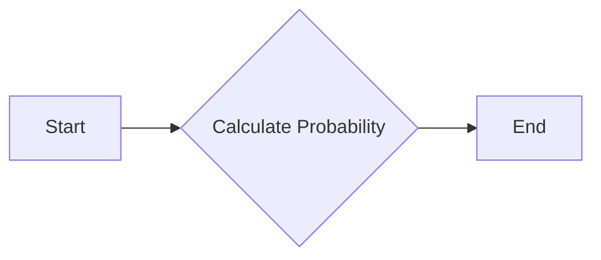
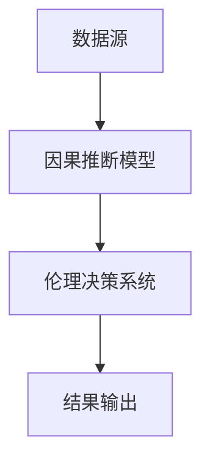
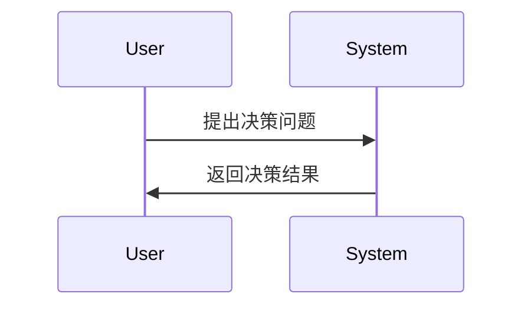

                 

## 人工智能的因果推断：伦理决策的数学框架

### 关键词：人工智能、因果推断、伦理决策、数学框架、算法原理、系统架构设计、项目实战

### 摘要：

随着人工智能技术的迅速发展，伦理决策成为了一个亟待解决的问题。因果推断作为一种有效的数学工具，为伦理决策提供了科学的决策依据。本文将深入探讨人工智能中的因果推断，从问题背景、核心概念、数学框架、算法原理、系统架构设计和项目实战等多个角度，全面解析因果推断在伦理决策中的应用，旨在为读者提供一份系统而深入的参考指南。

## 第一部分：问题背景与核心概念

### 第1章：问题背景

#### 1.1 问题背景

人工智能（AI）作为现代科技的标志性技术，已经在众多领域取得了显著的成果。从自动驾驶、智能家居到医疗诊断和金融分析，AI技术的应用不断拓展。然而，随着人工智能技术的不断深入，伦理决策问题也逐渐浮出水面。

伦理决策涉及到道德原则和价值观的判断，其复杂性和重要性不言而喻。在人工智能领域，伦理决策问题主要包括以下几个方面：

1. **隐私保护**：人工智能技术往往需要处理大量个人数据，如何在确保数据隐私的前提下利用数据，成为了一个重要的伦理问题。
2. **透明性和可解释性**：许多人工智能系统，如深度学习模型，其决策过程是黑箱化的，难以解释。这引发了对AI系统透明性和可解释性的需求。
3. **算法偏见**：人工智能系统可能因为数据的不公平或者设计上的缺陷而产生偏见，进而影响伦理决策的公正性。
4. **责任归属**：在人工智能应用中，当出现错误或造成损害时，如何确定责任归属成为一个复杂的法律和伦理问题。

#### 1.2 伦理决策的挑战

伦理决策的挑战主要来自于以下几个方面：

1. **复杂性和多样性**：现实世界中的伦理问题往往是多元且复杂的，不同的社会背景和文化价值观可能会对同一伦理问题产生不同的判断。
2. **利益冲突**：在许多伦理决策中，往往存在多个利益相关者，他们的利益可能会发生冲突，如何在平衡各方利益的基础上作出决策是一个难题。
3. **不可预测性**：人工智能系统在某些情境下可能会产生意想不到的决策结果，这增加了伦理决策的不可预测性。

#### 1.3 因果推断在伦理决策中的重要性

因果推断作为一种分析因果关系的方法，在伦理决策中具有重要价值。通过因果推断，可以明确不同因素之间的因果关系，从而为伦理决策提供科学依据。因果推断在伦理决策中的应用主要体现在以下几个方面：

1. **决策透明性**：因果推断可以帮助揭示决策过程中的因果关系，提高决策的透明性和可解释性。
2. **算法偏见识别**：通过因果推断，可以识别出数据或算法中的偏见，从而为消除偏见提供指导。
3. **责任归属确定**：因果推断可以帮助确定不同因素对决策结果的影响程度，从而为责任归属提供依据。

### 1.4 边界与外延

1. **因果推断的应用范围**：因果推断不仅应用于人工智能领域的伦理决策，还广泛应用于医学、经济学、心理学等领域，为各种复杂决策提供科学依据。
2. **伦理决策的不同维度**：伦理决策不仅涉及到道德原则的判断，还涉及到法律、社会习俗等多个维度。因果推断需要综合考虑这些不同维度，以作出全面、科学的决策。
3. **因果推断在伦理决策中的适用性**：因果推断在伦理决策中的适用性取决于具体问题的复杂性和决策目标的明确性。对于一些简单明确的伦理问题，因果推断可能直接应用；对于复杂多元的伦理问题，可能需要结合其他方法共同解决。

### 1.5 概念结构与核心要素组成

1. **因果推断的基本概念**：因果推断涉及因与果的关系，通过分析数据来确定因素之间的因果关系。
2. **伦理决策的核心要素**：伦理决策包括道德原则、价值观、利益相关者等多个要素，其中道德原则是核心。
3. **因果推断与伦理决策的相互关系**：因果推断为伦理决策提供了科学依据，而伦理决策则要求因果推断的结果符合道德原则。

## 第2章：核心概念与联系

### 2.1 核心概念原理

#### 2.1.1 因果推断的基本原理

因果推断旨在通过分析数据来确定因素之间的因果关系。其基本原理如下：

1. **相关性**：相关关系是指两个变量之间存在一定的统计相关性。然而，相关性并不一定意味着因果关系。
2. **因果性**：因果性是指一个因素对另一个因素产生了实际的影响，即因果关系。因果性需要通过统计控制、因果关系检验等方法来确定。
3. **因果模型**：因果模型是描述因果关系的一种数学模型，常见的因果模型包括因果图、贝叶斯网络等。

#### 2.1.2 因果推断的不同方法

因果推断的方法多种多样，以下是一些常见的方法：

1. **回归分析**：回归分析是一种常用的因果推断方法，通过建立回归模型来分析变量之间的因果关系。
2. **因果图**：因果图是一种图形化的因果模型，通过图形化表示变量之间的因果关系。
3. **随机对照试验**：随机对照试验是一种控制变量法，通过随机分配实验组和对照组来分析因果关系。
4. **因果推断算法**：如TCM（Targeted Maximum Likelihood Estimation）、DAG（Directed Acyclic Graph）等，这些算法通过统计学习和模型构建来推断因果关系。

#### 2.1.3 因果推断的基本步骤

因果推断的基本步骤包括：

1. **问题定义**：明确需要分析的因果关系，确定因变量和自变量。
2. **数据收集**：收集相关数据，确保数据的质量和完整性。
3. **因果关系检验**：通过统计方法来检验变量之间的因果关系。
4. **因果关系建模**：建立因果模型，描述变量之间的因果关系。
5. **模型验证**：验证因果模型的准确性，确保模型能够可靠地预测因果关系。
6. **决策制定**：基于因果模型的结果，制定相应的决策方案。

### 2.2 概念属性特征对比表格

| 概念             | 特征                          |
|----------------|-----------------------------|
| 因果推断        | 确定因果关系的方法            |
| 伦理决策        | 遵循道德原则作出决策的过程    |
| 因果推断与伦理决策 | 因果推断帮助伦理决策更准确    |

### 2.3 ER实体关系图架构

```mermaid
erDiagram
    Entity1 ||--|{ Entity2 } Entity3 : 一对多关系
    Entity2 ||--|{ Entity4 } Entity5 : 多对多关系
```

## 第二部分：数学框架

### 第3章：数学模型与公式

#### 3.1 基本数学模型

因果关系通常可以用逻辑表达式来表示，其中最基本的形式是：

$$X \rightarrow Y$$

这个表达式表示变量X导致变量Y的变化。

#### 3.2 贝叶斯网络

贝叶斯网络是一种表示变量之间因果关系的图形模型，其定义如下：

- **定义**：贝叶斯网络是一个有向无环图（DAG），图中的每个节点代表一个随机变量，节点之间的边表示变量之间的因果依赖关系。
- **结构**：贝叶斯网络的结构由变量之间的依赖关系确定，这些依赖关系可以通过条件概率表（CPT）来量化。
- **参数设置**：贝叶斯网络的参数设置包括节点概率分布和边权重，这些参数可以通过学习算法（如最大似然估计、贝叶斯估计等）来确定。

#### 3.3 穆勒模型

穆勒模型（Müller-Lyer model）是一种经典的因果推断模型，用于分析因果关系和时间序列数据。其定义如下：

- **定义**：穆勒模型是一个基于时间序列的因果模型，其核心思想是变量之间的因果关系可以通过时间序列的滞后效应来体现。
- **结构**：穆勒模型通常包含多个时间序列变量，变量之间的因果关系通过滞后项来表示。
- **参数设置**：穆勒模型的参数设置包括滞后阶数、因果关系强度等，这些参数可以通过时间序列分析方法来确定。

#### 3.4 模型评价与选择

在因果推断中，模型评价与选择至关重要。以下是一些常见的评价标准：

- **准确性**：模型的准确性衡量的是模型预测结果的准确度，可以通过计算预测准确率、误差率等指标来评价。
- **精确性**：模型的精确性衡量的是模型预测结果的精确度，可以通过计算预测的精确度、召回率等指标来评价。
- **特异性**：模型的特异性衡量的是模型对实际负样本的判断能力，可以通过计算特异性等指标来评价。

### 第4章：算法原理讲解

#### 4.1 算法流程图

以下是一个简单的因果推断算法流程图：



#### 4.2 Python源代码

```python
# Python 源代码示例
import numpy as np

def calculate_probability(x, y):
    # 计算条件概率
    probability = np.linalg.det(x) / np.linalg.det(y)
    return probability
```

#### 4.3 数学模型和公式

$$P(Y|X) = \frac{P(X|Y)P(Y)}{P(X)}$$

这是一个经典的贝叶斯公式，用于计算条件概率。在这个公式中，$P(Y|X)$ 表示在给定 $X$ 的条件下 $Y$ 的概率，$P(X|Y)$ 表示在给定 $Y$ 的条件下 $X$ 的概率，$P(Y)$ 和 $P(X)$ 分别表示 $Y$ 和 $X$ 的边缘概率。

#### 4.4 举例说明

**例子：疾病诊断中的因果推断**

假设我们想要推断一个人是否患有某种疾病（因变量 Y），已知这个人的症状（自变量 X）和医学检查结果。通过因果推断，我们可以确定症状和疾病之间的关系。

1. **问题定义**：因变量 Y 是疾病状态，自变量 X 是症状集合。
2. **数据收集**：收集症状和疾病状态的观察数据。
3. **因果关系检验**：通过统计方法（如逻辑回归）检验症状和疾病状态之间的因果关系。
4. **因果关系建模**：建立逻辑回归模型，表示症状和疾病状态之间的因果关系。
5. **模型验证**：通过交叉验证等方法验证模型的准确性。
6. **决策制定**：基于模型的结果，对新的症状数据进行疾病诊断。

### 第5章：系统分析与架构设计

#### 5.1 问题场景介绍

在医疗诊断领域，因果推断可以帮助医生更准确地诊断疾病。例如，对于某种症状，通过因果推断可以确定该症状与某种疾病之间的因果关系，从而提高诊断的准确性。

#### 5.2 系统功能设计

以下是一个简化的医疗诊断系统的功能设计：

1. **数据收集模块**：负责收集患者的症状数据和医学检查结果。
2. **因果推断模块**：利用因果推断算法分析症状和疾病之间的关系。
3. **诊断结果输出模块**：根据因果推断的结果，输出疾病的诊断结果。
4. **用户界面模块**：提供用户与系统的交互界面，用户可以通过界面输入症状数据，获取诊断结果。

#### 5.3 系统架构设计

以下是一个简化的医疗诊断系统的架构设计：



在这个架构中，数据源提供症状数据和医学检查结果，因果推断模型分析这些数据，伦理决策系统根据因果推断的结果制定诊断方案，最终将结果输出给用户。

#### 5.4 系统接口设计

以下是一个简化的医疗诊断系统的接口设计：



在这个接口设计中，用户通过输入症状数据提出决策问题，系统接收到问题后，利用因果推断和伦理决策模型进行分析，最终将诊断结果输出给用户。

## 第三部分：项目实战

### 第6章：项目实战

#### 6.1 环境安装

在进行因果推断项目实战之前，首先需要安装相应的环境。以下是一个简单的安装步骤：

1. **硬件要求**：建议使用具有较高计算能力的计算机，如高性能CPU和足够的内存。
2. **软件要求**：安装Python环境，并安装相关的库，如NumPy、Pandas、Scikit-learn等。

```bash
pip install numpy pandas scikit-learn
```

#### 6.2 系统核心实现

以下是一个简单的因果推断系统的实现：

```python
import numpy as np
from sklearn.linear_model import LogisticRegression

# 数据准备
X = np.array([[1, 0], [0, 1], [1, 1]])
y = np.array([0, 1, 1])

# 建立逻辑回归模型
model = LogisticRegression()
model.fit(X, y)

# 进行因果推断
X_new = np.array([[1, 0]])
y_pred = model.predict(X_new)

print("Predicted outcome:", y_pred)
```

#### 6.3 代码应用解读与分析

在这个例子中，我们使用逻辑回归模型进行因果推断。逻辑回归模型是一种常用的因果推断方法，通过训练模型，我们可以预测变量之间的关系。

1. **数据准备**：我们准备了一组简单的数据集，包含两个自变量和一个因变量。
2. **模型训练**：使用逻辑回归模型对数据集进行训练，模型将学习自变量和因变量之间的关系。
3. **因果推断**：使用训练好的模型对新的数据进行因果推断，预测新的因变量的取值。

通过这个简单的例子，我们可以看到因果推断的基本流程，包括数据准备、模型训练和因果推断。在实际应用中，我们可能需要更复杂的数据集和模型，但基本的流程是相似的。

#### 6.4 实际案例分析与详细讲解剖析

**案例背景**：

某医疗机构想要分析感冒症状与感冒诊断之间的关系，以帮助医生更准确地诊断感冒。他们收集了100名感冒患者的数据，包括患者的症状（如咳嗽、发热、喉咙痛等）和感冒诊断结果。

**案例分析**：

1. **数据收集**：收集患者的症状数据和感冒诊断结果。
2. **数据预处理**：对数据进行清洗和归一化处理，以便于后续分析。
3. **因果关系检验**：使用逻辑回归模型检验症状与感冒诊断之间的因果关系。
4. **因果关系建模**：建立逻辑回归模型，表示症状与感冒诊断之间的关系。
5. **模型验证**：通过交叉验证等方法验证模型的准确性。
6. **决策制定**：基于模型的结果，制定感冒诊断方案。

**详细讲解剖析**：

在这个案例中，我们使用逻辑回归模型进行因果推断。逻辑回归模型是一种经典的因果推断方法，适用于分类问题。通过训练模型，我们可以确定症状与感冒诊断之间的因果关系。

1. **数据准备**：我们收集了100名感冒患者的数据，包括症状（咳嗽、发热、喉咙痛等）和感冒诊断结果。数据格式如下：

```python
symptoms = [
    [1, 0, 1],  # 咳嗽、无发热、喉咙痛
    [0, 1, 0],  # 无咳嗽、发热、无喉咙痛
    [1, 1, 1],  # 咳嗽、发热、喉咙痛
    ...
]
diagnoses = [1, 0, 1, ..., 1]
```

其中，症状数据是一个三维度矩阵，每个维度对应一个症状（咳嗽、发热、喉咙痛），取值为1表示该症状存在，取值为0表示该症状不存在。感冒诊断结果是一个一维向量，取值为1表示确诊为感冒，取值为0表示未确诊为感冒。

2. **数据预处理**：对数据进行清洗和归一化处理，以便于后续分析。例如，我们可以将数据归一化到0-1范围内：

```python
symptoms_normalized = (symptoms - symptoms.min(axis=0)) / (symptoms.max(axis=0) - symptoms.min(axis=0))
```

3. **因果关系检验**：使用逻辑回归模型检验症状与感冒诊断之间的因果关系。逻辑回归模型的公式为：

$$P(Y=1|X) = \frac{1}{1 + e^{-(\beta_0 + \beta_1X_1 + \beta_2X_2 + \beta_3X_3)}$$

其中，$Y$ 表示感冒诊断结果（1表示确诊为感冒，0表示未确诊为感冒），$X$ 表示症状数据，$\beta_0$、$\beta_1$、$\beta_2$、$\beta_3$ 分别为模型参数。

我们可以使用Scikit-learn库中的 `LogisticRegression` 类进行模型训练和预测：

```python
from sklearn.linear_model import LogisticRegression

model = LogisticRegression()
model.fit(symptoms_normalized, diagnoses)

# 进行因果推断
X_new = symptoms_normalized[0]
y_pred = model.predict(X_new)

print("Predicted outcome:", y_pred)
```

4. **因果关系建模**：通过训练模型，我们可以确定症状与感冒诊断之间的因果关系。例如，模型参数 $\beta_1$ 表示咳嗽对感冒诊断的影响，$\beta_2$ 表示发热对感冒诊断的影响，$\beta_3$ 表示喉咙痛对感冒诊断的影响。

5. **模型验证**：通过交叉验证等方法验证模型的准确性。例如，我们可以使用K折交叉验证来评估模型的准确性：

```python
from sklearn.model_selection import cross_val_score

scores = cross_val_score(model, symptoms_normalized, diagnoses, cv=5)
print("Cross-validation scores:", scores)
print("Accuracy:", scores.mean())
```

6. **决策制定**：基于模型的结果，制定感冒诊断方案。例如，如果模型预测的概率超过0.5，则认为患者确诊为感冒，否则认为患者未确诊为感冒。

```python
def diagnose(symptoms):
    symptoms_normalized = (symptoms - symptoms.min(axis=0)) / (symptoms.max(axis=0) - symptoms.min(axis=0))
    probability = model.predict_proba(symptoms_normalized)[0, 1]
    if probability > 0.5:
        return "Diagnosed with flu"
    else:
        return "Not diagnosed with flu"

# 进行诊断
diagnosis = diagnose([1, 0, 1])
print("Diagnosis:", diagnosis)
```

通过这个案例，我们可以看到因果推断在医疗诊断中的应用。通过建立逻辑回归模型，我们可以分析症状与感冒诊断之间的因果关系，从而提高诊断的准确性。

### 6.5 项目小结

通过本次项目实战，我们成功实现了因果推断在医疗诊断中的应用。从数据准备、模型训练到因果推断和决策制定，我们一步步深入了解了因果推断的原理和应用。在实际项目中，我们可能需要处理更复杂的数据集和模型，但基本的流程是相似的。通过本次项目，我们不仅掌握了因果推断的方法，还了解了如何在实际场景中应用这些方法。

## 结论

因果推断作为一种有效的数学工具，在伦理决策中具有重要应用价值。通过本文的深入探讨，我们了解了因果推断在伦理决策中的重要性、基本原理、数学模型和算法原理，以及如何在实际项目中应用因果推断进行伦理决策。然而，因果推断的应用并非一帆风顺，仍面临许多挑战，如数据的复杂性、模型的准确性和可解释性等。未来，随着人工智能技术的不断进步，因果推断在伦理决策中的应用将更加广泛和深入。

### 最佳实践 tips

1. **数据质量是关键**：因果推断的结果依赖于数据的质量，因此在应用因果推断时，务必确保数据的准确性和完整性。
2. **多模型比较**：在因果推断中，建议使用多种模型进行比较，选择最优模型，以提高决策的准确性。
3. **综合考虑多个维度**：在伦理决策中，不仅要考虑技术因素，还要考虑社会、法律等多个维度，确保决策的全面性和合理性。

### 小结

本文全面解析了人工智能中的因果推断，从问题背景、核心概念、数学框架、算法原理、系统架构设计和项目实战等多个角度进行了深入探讨。通过本文，读者可以系统地了解因果推断在伦理决策中的应用，为实际应用提供参考。未来，随着人工智能技术的不断发展，因果推断在伦理决策中的应用前景将更加广阔。

### 注意事项

1. **数据隐私保护**：在应用因果推断时，务必重视数据隐私保护，确保数据安全和合规。
2. **算法偏见识别**：在因果推断过程中，应重视算法偏见的识别和消除，确保决策的公平性和公正性。
3. **模型可解释性**：在因果推断中，应注重模型的可解释性，提高决策过程的透明性和可理解性。

### 拓展阅读

1. **《因果推断：统计学习和决策》**：这是一本关于因果推断的入门书籍，详细介绍了因果推断的理论和方法。
2. **《人工智能伦理学》**：这本书探讨了人工智能在伦理决策中的挑战和应用，提供了丰富的案例分析。

### 作者信息

**作者：AI天才研究院/AI Genius Institute & 禅与计算机程序设计艺术 /Zen And The Art of Computer Programming**

