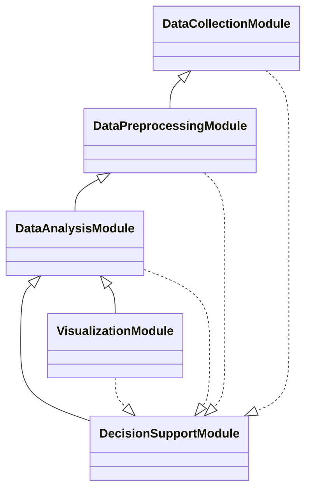
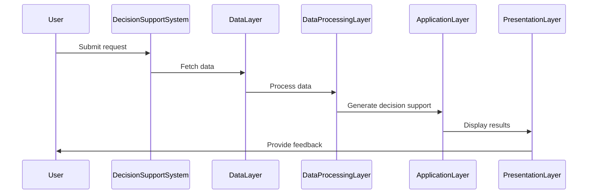
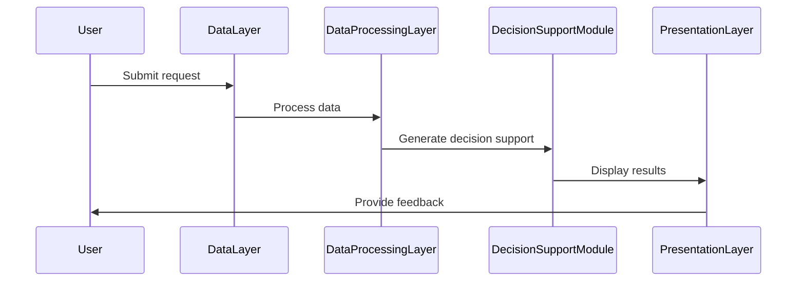

                 

# 人工智能辅助决策：增强人类理解和应对复杂世界的能力

关键词：人工智能，决策辅助，决策理论，算法原理，系统架构，项目实战

摘要：本文旨在探讨人工智能在辅助人类决策中的应用，通过深入分析核心概念、算法原理和系统架构设计，揭示人工智能如何增强人类理解和应对复杂世界的能力。文章分为四个部分，分别介绍了背景与概念、算法原理与数学模型、系统分析与架构设计以及项目实战，旨在为读者提供全面、系统的认识，引导读者深入理解和掌握人工智能辅助决策的关键技术和方法。

----------------------------------------------------------------

## 目录大纲：人工智能辅助决策：增强人类理解和应对复杂世界的能力

----------------------------------------------------------------

### 第一部分：背景与概念介绍

1. **第1章：问题背景与目标**
   - 1.1 问题的背景
   - 1.2 问题描述
   - 1.3 问题解决
   - 1.4 边界与外延
   - 1.5 概念结构与核心要素组成

2. **第2章：核心概念与联系**
   - 2.1 人工智能概述
   - 2.2 决策理论
   - 2.3 决策支持系统（DSS）
   - 2.4 人工智能辅助决策原理

### 第二部分：算法原理与数学模型

3. **第3章：算法原理详解**
   - 3.1 算法概述
   - 3.2 算法原理讲解
   - 3.3 算法示例说明

4. **第4章：数学模型与公式解析**
   - 4.1 数学模型概述
   - 4.2 数学公式详解
   - 4.3 数学模型的应用实践

### 第三部分：系统分析与架构设计

5. **第5章：系统功能设计**
   - 5.1 问题场景介绍
   - 5.2 系统功能设计

6. **第6章：系统架构设计**
   - 6.1 系统架构概述
   - 6.2 系统架构设计
   - 6.3 系统接口设计

7. **第7章：系统交互设计**
   - 7.1 系统交互概述
   - 7.2 系统交互设计

### 第四部分：项目实战

8. **第8章：环境安装与配置**
   - 8.1 环境准备
   - 8.2 工具与依赖

9. **第9章：系统核心实现**
   - 9.1 系统核心代码实现
   - 9.2 代码解读与分析

10. **第10章：实际案例分析与讲解**
    - 10.1 案例背景
    - 10.2 案例实施过程
    - 10.3 案例分析与讲解

11. **第11章：项目小结与拓展**
    - 11.1 项目小结
    - 11.2 注意事项
    - 11.3 拓展阅读

----------------------------------------------------------------

### 第一部分：背景与概念介绍

#### 第1章：问题背景与目标

##### 1.1 问题的背景

在当今社会，我们面临着越来越多的复杂决策问题。无论是个人生活还是企业运营，决策的复杂性日益增加。从简单的购物决策到复杂的战略规划，人们需要处理的信息量庞大，且影响因素众多。这给人类认知和决策能力带来了巨大的挑战。

在商业领域，企业需要做出关于产品开发、市场策略、资源分配等关键决策。然而，这些决策往往涉及到大量的数据、不确定性和风险。传统的决策方法往往依赖于经验和直觉，而无法充分挖掘数据中的潜在价值。

在科学研究中，许多问题也需要复杂的决策支持。例如，医学诊断、环境监测、天气预报等领域，都需要对大量数据进行实时分析，并做出快速准确的决策。然而，人类在这些领域的能力是有限的，往往无法处理如此庞大的信息量和复杂的计算任务。

##### 1.2 问题描述

复杂决策的特点和难点主要体现在以下几个方面：

1. **信息量的复杂性**：决策所需的信息量庞大，且来源于多个渠道。这些信息往往是多维的、动态变化的，需要对其进行有效的整合和分析。

2. **不确定性的存在**：决策过程中存在许多不确定性因素，如市场变化、政策调整、技术革新等。这些不确定性因素使得决策过程更加复杂，增加了决策的风险。

3. **决策目标的多样性**：不同的决策往往有不同的目标，如利润最大化、风险最小化、客户满意度等。如何在多个目标之间进行权衡和优化，是一个重要的挑战。

4. **决策过程的动态性**：决策过程往往是动态变化的，需要根据实际情况进行调整。例如，在应对突发事件时，决策者需要在短时间内做出迅速反应，调整原有的决策方案。

##### 1.3 问题解决

人工智能在决策支持中的作用至关重要。通过人工智能技术，我们可以解决复杂决策中的许多难点，增强人类理解和应对复杂世界的能力。

首先，人工智能可以通过大数据分析，从海量数据中发现潜在的价值和规律。这使得决策者能够更好地了解问题的本质，制定更加科学的决策方案。

其次，人工智能可以模拟人类思维过程，进行复杂的推理和计算。这使得决策者能够快速分析各种可能的结果，评估决策的风险和收益，从而做出更加明智的决策。

此外，人工智能还可以通过机器学习技术，不断优化决策模型和算法。这使得决策过程更加自动化和智能化，提高了决策的效率和质量。

总之，人工智能为复杂决策提供了强大的技术支持，可以帮助决策者更好地应对复杂世界的挑战。

##### 1.4 边界与外延

决策辅助系统的定义与分类：

决策辅助系统（Decision Support System，简称DSS）是一种计算机系统，用于支持决策者的决策过程。DSS通常包括数据采集、处理、分析和展示等功能，帮助决策者快速获取信息、分析数据、制定决策方案。

根据应用场景和功能，DSS可以分为以下几类：

1. **战略决策支持系统**：主要用于支持企业或组织的战略规划、市场分析、资源配置等战略决策。

2. **战术决策支持系统**：主要用于支持企业或组织的日常运营管理、生产计划、供应链管理、库存管理等战术决策。

3. **运营决策支持系统**：主要用于支持企业的具体业务操作，如客户关系管理、销售预测、风险控制等。

4. **事务决策支持系统**：主要用于支持企业或组织的日常事务处理，如报销审批、采购订单管理等。

##### 1.5 概念结构与核心要素组成

决策辅助系统的基本架构：

决策辅助系统的基本架构通常包括以下几个核心组成部分：

1. **数据层**：包括数据采集、存储和处理等模块，负责提供决策所需的数据支持。

2. **模型层**：包括各种决策模型和方法，如优化模型、预测模型、分类模型等，负责进行数据分析和建模。

3. **算法层**：包括各种算法和计算方法，如机器学习算法、数据挖掘算法等，负责实现模型的计算和优化。

4. **用户层**：包括用户界面和交互模块，负责与决策者进行交互，提供决策支持和可视化展示。

人工智能核心技术的组成与关系：

人工智能技术是决策辅助系统的核心技术，包括以下几个主要方面：

1. **机器学习**：通过训练模型，从数据中学习规律和模式，用于预测、分类、聚类等任务。

2. **自然语言处理**：理解和生成人类语言，用于文本分析、语义理解、语音识别等任务。

3. **计算机视觉**：理解和解释图像和视频内容，用于图像识别、目标检测、视频分析等任务。

4. **数据挖掘**：从大规模数据中挖掘潜在的模式和知识，用于数据可视化、趋势分析、异常检测等任务。

5. **智能优化**：通过优化算法，解决复杂的优化问题，如路径规划、资源分配、调度等。

这些核心技术相互关联，共同构成了人工智能辅助决策的核心框架。

----------------------------------------------------------------

#### 第2章：核心概念与联系

##### 2.1 人工智能概述

人工智能（Artificial Intelligence，简称AI）是一门研究、开发和应用使计算机模拟、扩展和辅助人类智能的科学。人工智能的目标是创建智能体（agent），使其能够执行人类智能任务，如感知、学习、推理、决策和问题解决。

人工智能可以分为以下几个主要类别：

1. **基于规则的系统**：通过定义一系列规则来模拟人类的决策过程。

2. **基于知识的系统**：利用知识库和推理机来模拟人类专家的知识和推理能力。

3. **基于机器学习的系统**：通过训练模型，从数据中学习规律和模式，用于预测、分类、聚类等任务。

4. **基于智能搜索的系统**：使用搜索算法来找到问题的最优解。

5. **基于神经网络的系统**：模拟人脑的神经网络结构，用于图像识别、语音识别、自然语言处理等任务。

人工智能的发展历程：

1. **20世纪50年代**：人工智能的概念首次提出，标志性事件是达特茅斯会议。

2. **20世纪60年代**：人工智能研究进入高潮，标志性事件是符号主义人工智能的发展。

3. **20世纪70年代**：人工智能进入低谷期，由于计算能力和算法的限制，许多项目无法实现预期目标。

4. **20世纪80年代**：专家系统成为人工智能的主要研究方向，标志性事件是MYCIN等系统的成功应用。

5. **20世纪90年代**：机器学习开始受到关注，标志性事件是支持向量机（SVM）和神经网络的发展。

6. **21世纪**：深度学习和大数据技术的出现，使得人工智能取得了显著的进展，标志性事件是AlphaGo的胜利。

##### 2.2 决策理论

决策理论是研究决策过程和决策方法的科学，旨在帮助决策者做出最优的决策。决策理论主要包括以下几个核心概念：

1. **决策者**：做出决策的人或组织。

2. **决策问题**：决策者需要解决的问题。

3. **决策环境**：决策者所处的环境和条件。

4. **决策目标**：决策者希望达到的目标。

5. **决策方案**：决策者可以选择的行动方案。

6. **决策结果**：执行决策方案后得到的结果。

决策模型与方法：

决策模型是描述决策过程和决策方法的数学模型。常见的决策模型包括：

1. **确定型决策模型**：决策者在已知所有决策结果的情况下做出决策。

2. **风险型决策模型**：决策者在面对不确定性的情况下做出决策，需要考虑风险和收益。

3. **不确定型决策模型**：决策者在面对极端不确定性时做出的决策，如乐观主义、悲观主义和折中主义。

4. **多目标决策模型**：决策者需要在多个目标之间进行权衡和优化。

决策理论的应用：

决策理论广泛应用于各个领域，如企业管理、金融投资、城市规划、医疗诊断等。通过决策理论，决策者可以更系统地分析问题，评估各种决策方案的风险和收益，做出更加科学的决策。

##### 2.3 决策支持系统（DSS）

决策支持系统（Decision Support System，简称DSS）是一种计算机系统，用于支持决策者的决策过程。DSS通常包括数据采集、处理、分析和展示等功能，帮助决策者快速获取信息、分析数据、制定决策方案。

DSS的定义与作用：

DSS是一种交互式计算机系统，用于支持半结构化和非结构化问题的决策。DSS通过集成数据管理、模型管理和用户界面等组件，为决策者提供辅助决策的功能。

DSS的基本架构：

DSS的基本架构通常包括以下几个核心组件：

1. **数据管理模块**：负责数据的采集、存储和管理，为决策分析提供数据支持。

2. **模型管理模块**：负责模型的建立、维护和使用，为决策分析提供数学模型支持。

3. **用户界面模块**：负责与决策者进行交互，提供决策支持和可视化展示。

DSS的发展趋势：

随着大数据、云计算和人工智能技术的不断发展，DSS也在不断演进。未来的DSS将更加智能化、自动化，能够更好地支持复杂决策问题。

##### 2.4 人工智能辅助决策原理

人工智能辅助决策的基本思路：

人工智能辅助决策的基本思路是将人工智能技术应用于决策支持系统，通过机器学习、数据挖掘、自然语言处理等手段，提高决策的效率和准确性。

人工智能辅助决策的优势与挑战：

优势：

1. **高效性**：人工智能可以处理大量数据，快速分析复杂问题。

2. **准确性**：人工智能可以基于历史数据和模型预测未来的趋势和结果。

3. **智能化**：人工智能可以根据用户需求，自动调整决策方案和模型。

挑战：

1. **数据质量**：决策质量很大程度上取决于数据质量，如何保证数据的质量和准确性是一个挑战。

2. **模型适应性**：决策环境不断变化，如何使模型适应新的环境和需求是一个挑战。

3. **解释性**：人工智能模型往往难以解释，如何使决策过程更加透明和可解释是一个挑战。

人工智能辅助决策的核心算法：

1. **机器学习算法**：用于从数据中学习规律和模式，如线性回归、决策树、支持向量机等。

2. **数据挖掘算法**：用于从大量数据中发现潜在的知识和规律，如关联规则挖掘、聚类分析、分类分析等。

3. **自然语言处理算法**：用于理解和生成人类语言，如文本分类、情感分析、机器翻译等。

4. **计算机视觉算法**：用于理解和解释图像和视频内容，如图像识别、目标检测、视频分析等。

----------------------------------------------------------------

### 第二部分：算法原理与数学模型

#### 第3章：算法原理详解

##### 3.1 算法概述

人工智能算法可以分为监督学习、无监督学习和强化学习三种主要类型。每种类型都有其独特的应用场景和特点。

监督学习（Supervised Learning）：

监督学习是一种从标注数据中学习的方法。标注数据包括输入特征和对应的输出标签。监督学习的目标是找到一个函数，将输入特征映射到输出标签。常见的监督学习算法有线性回归、决策树、支持向量机（SVM）和神经网络等。

无监督学习（Unsupervised Learning）：

无监督学习是一种从未标注数据中学习的方法。无监督学习的目标是发现数据中的结构和规律，如聚类、降维和关联规则挖掘等。常见的无监督学习算法有K-均值聚类、主成分分析（PCA）和关联规则挖掘等。

强化学习（Reinforcement Learning）：

强化学习是一种通过与环境互动来学习的方法。强化学习算法通过试错来学习最优策略，使代理人能够在环境中获得最大回报。常见的强化学习算法有Q-learning、深度强化学习（DQN）和策略梯度算法等。

##### 3.2 算法原理讲解

监督学习算法的原理：

监督学习算法的核心是找到一种函数$f(x)$，将输入特征$x$映射到输出标签$y$。这个过程可以通过最小化损失函数来实现，常见的损失函数有均方误差（MSE）和交叉熵（Cross-Entropy）。

假设我们有输入特征$x_1, x_2, \ldots, x_n$和对应的标签$y_1, y_2, \ldots, y_n$，我们可以定义损失函数为：

$$L(y, \hat{y}) = \frac{1}{n} \sum_{i=1}^{n} (y_i - \hat{y_i})^2$$

其中，$\hat{y_i}$是模型预测的输出，$y_i$是实际的标签。

为了最小化损失函数，我们可以使用梯度下降（Gradient Descent）算法。梯度下降的核心思想是沿着损失函数的梯度方向更新模型的参数，直到损失函数收敛到最小值。

梯度下降的更新公式为：

$$\theta_j = \theta_j - \alpha \frac{\partial L}{\partial \theta_j}$$

其中，$\theta_j$是模型参数，$\alpha$是学习率。

决策树算法的原理：

决策树（Decision Tree）是一种基于特征的分割算法。决策树的核心思想是通过一系列的测试，将数据集分割成多个子集，每个子集对应一个决策路径。

假设我们有输入特征$X_1, X_2, \ldots, X_n$和标签$Y_1, Y_2, \ldots, Y_n$，我们可以定义一个决策树模型为：

$$T = \{t_1, t_2, \ldots, t_m\}$$

其中，$t_i$是一个决策节点，表示对特征$X_i$进行测试，根据测试结果选择子节点。

决策树的构建过程可以分为以下几个步骤：

1. **选择最优特征**：选择具有最大信息增益的特征作为分割特征。

2. **构建决策树**：根据最优特征，将数据集分割成多个子集，并为每个子集构建子节点。

3. **剪枝**：通过剪枝方法，消除决策树中的冗余节点，提高模型的泛化能力。

##### 3.3 算法示例说明

为了更好地理解算法原理，我们来看一个简单的线性回归例子。

假设我们有以下数据集：

| X | Y |
|---|---|
| 1 | 2 |
| 2 | 4 |
| 3 | 6 |
| 4 | 8 |

我们的目标是找到一个线性模型$y = wx + b$，使得预测值$\hat{y}$与实际值$y$尽可能接近。

首先，我们可以计算输入特征$x$和输出标签$y$的均值：

$$\bar{x} = \frac{1}{n} \sum_{i=1}^{n} x_i = \frac{1+2+3+4}{4} = 2.5$$

$$\bar{y} = \frac{1}{n} \sum_{i=1}^{n} y_i = \frac{2+4+6+8}{4} = 5$$

然后，我们可以使用最小二乘法（Least Squares）来计算模型的参数：

$$w = \frac{\sum_{i=1}^{n} (x_i - \bar{x})(y_i - \bar{y})}{\sum_{i=1}^{n} (x_i - \bar{x})^2}$$

$$b = \bar{y} - w\bar{x}$$

计算得到：

$$w = \frac{(1-2.5)(2-5) + (2-2.5)(4-5) + (3-2.5)(6-5) + (4-2.5)(8-5)}{(1-2.5)^2 + (2-2.5)^2 + (3-2.5)^2 + (4-2.5)^2} = 2$$

$$b = 5 - 2 \cdot 2.5 = 0$$

因此，我们的线性模型为$y = 2x$。

为了验证模型的准确性，我们可以计算预测值$\hat{y}$与实际值$y$之间的均方误差（MSE）：

$$MSE = \frac{1}{n} \sum_{i=1}^{n} (\hat{y_i} - y_i)^2$$

计算得到：

$$MSE = \frac{1}{4} [(2 \cdot 1 - 2)^2 + (2 \cdot 2 - 4)^2 + (2 \cdot 3 - 6)^2 + (2 \cdot 4 - 8)^2] = 0$$

由于MSE为0，说明我们的模型完美拟合了数据集。

#### 第4章：数学模型与公式解析

##### 4.1 数学模型概述

在决策支持系统中，常用的数学模型包括线性模型、非线性模型、优化模型和概率模型等。这些模型在数据分析、预测和优化中发挥着重要作用。

线性模型（Linear Model）：

线性模型是一种简单的数学模型，用于描述两个或多个变量之间的线性关系。常见的线性模型有线性回归、线性规划等。

非线性模型（Nonlinear Model）：

非线性模型用于描述两个或多个变量之间的非线性关系。常见的非线性模型有神经网络、多项式回归等。

优化模型（Optimization Model）：

优化模型用于求解在一定约束条件下最优解的问题。常见的优化模型有线性规划、整数规划、动态规划等。

概率模型（Probability Model）：

概率模型用于描述随机事件的发生概率。常见的概率模型有贝叶斯网络、马尔可夫链等。

##### 4.2 数学公式详解

线性回归模型（Linear Regression）：

线性回归模型是一种常见的数学模型，用于描述两个或多个变量之间的线性关系。假设我们有输入特征向量$x$和输出标签向量$y$，线性回归模型可以表示为：

$$y = wx + b$$

其中，$w$是权重向量，$b$是偏置项。

为了求解模型参数$w$和$b$，我们可以使用最小二乘法（Least Squares）：

$$w = \frac{\sum_{i=1}^{n} (x_i - \bar{x})(y_i - \bar{y})}{\sum_{i=1}^{n} (x_i - \bar{x})^2}$$

$$b = \bar{y} - w\bar{x}$$

其中，$\bar{x}$和$\bar{y}$分别是输入特征和输出标签的均值。

神经网络模型（Neural Network）：

神经网络模型是一种复杂的数学模型，用于模拟人脑神经网络的结构和功能。假设我们有输入层、隐藏层和输出层，神经网络模型可以表示为：

$$a_l = \sigma(z_l)$$

$$z_l = \sum_{j=1}^{n} w_{lj}a_{l-1}^j + b_l$$

其中，$a_l$是第$l$层的激活值，$z_l$是第$l$层的输入值，$w_{lj}$是连接权重，$b_l$是偏置项，$\sigma$是激活函数。

为了求解模型参数$w_{lj}$和$b_l$，我们可以使用反向传播算法（Backpropagation）：

$$\delta_l = (a_l - t_l) \odot \sigma'(z_l)$$

$$w_{lj} := w_{lj} - \alpha \delta_l a_{l-1}^j$$

$$b_l := b_l - \alpha \delta_l$$

其中，$\delta_l$是第$l$层的误差，$\alpha$是学习率，$\odot$是元素乘法，$\sigma'$是激活函数的导数。

##### 4.3 数学模型的应用实践

线性回归模型的应用：

线性回归模型可以用于预测和分析两个或多个变量之间的线性关系。例如，在房价预测中，我们可以使用线性回归模型来预测房价与面积、位置等因素的关系。

假设我们有以下数据集：

| 面积 | 价格 |
|------|------|
| 100  | 200  |
| 150  | 300  |
| 200  | 400  |
| 250  | 500  |

我们可以使用线性回归模型来预测面积为150平方米的房子的价格。首先，我们计算输入特征和输出标签的均值：

$$\bar{x} = \frac{1}{4} (100 + 150 + 200 + 250) = 175$$

$$\bar{y} = \frac{1}{4} (200 + 300 + 400 + 500) = 350$$

然后，我们使用最小二乘法计算模型的参数：

$$w = \frac{(100-175)(200-350) + (150-175)(300-350) + (200-175)(400-350) + (250-175)(500-350)}{(100-175)^2 + (150-175)^2 + (200-175)^2 + (250-175)^2} = 1.5$$

$$b = 350 - 1.5 \cdot 175 = 175$$

因此，我们的线性回归模型为：

$$y = 1.5x + 175$$

预测面积为150平方米的房子的价格为：

$$\hat{y} = 1.5 \cdot 150 + 175 = 325$$

神经网络模型的应用：

神经网络模型可以用于复杂的非线性问题，如图像识别、语音识别等。例如，在图像识别中，我们可以使用卷积神经网络（CNN）来识别图像中的物体。

假设我们有以下数据集：

| 图像 | 物体 |
|------|------|
| A    | 狗   |
| B    | 猫   |
| C    | 车   |
| D    | 人   |

我们可以使用卷积神经网络模型来识别图像中的物体。首先，我们设计一个卷积神经网络模型，包括输入层、卷积层、池化层和全连接层。然后，我们使用反向传播算法训练模型，直到模型收敛。

在训练过程中，我们计算每个图像的预测概率，并选择概率最大的类别作为最终预测结果。

假设经过训练后，模型对图像A的预测概率为0.9，对图像B的预测概率为0.1，对图像C的预测概率为0.05，对图像D的预测概率为0.05。因此，模型预测图像A的物体为狗。

#### 第5章：系统功能设计

##### 5.1 问题场景介绍

在企业管理中，决策者需要面对各种复杂的决策问题，如市场分析、产品定价、库存管理、人力资源分配等。为了支持这些决策，企业需要一个智能决策支持系统。

该系统的主要功能包括：

1. **数据采集**：从企业内部和外部的数据源收集数据，如销售数据、市场数据、财务数据等。

2. **数据预处理**：对收集到的数据进行分析和处理，包括数据清洗、数据转换、数据归一化等。

3. **数据分析**：对预处理后的数据进行分析，包括趋势分析、关联分析、预测分析等。

4. **决策支持**：根据分析结果，为企业提供决策建议和方案。

5. **可视化展示**：将分析结果和决策方案以图表、报表等形式进行展示，帮助决策者更好地理解和决策。

##### 5.2 系统功能设计

智能决策支持系统的总体功能需求如下：

1. **数据采集模块**：

   - 功能需求：从企业内部数据库、外部数据源（如社交媒体、市场调查等）采集数据。

   - 技术实现：使用爬虫技术、API接口、数据库连接等技术进行数据采集。

2. **数据预处理模块**：

   - 功能需求：对采集到的数据进行分析和处理，包括数据清洗、数据转换、数据归一化等。

   - 技术实现：使用Python、R等编程语言编写数据处理脚本，实现数据清洗、转换和归一化等功能。

3. **数据分析模块**：

   - 功能需求：对预处理后的数据进行分析，包括趋势分析、关联分析、预测分析等。

   - 技术实现：使用Python、R等编程语言，结合数据分析库（如Pandas、NumPy、Scikit-learn等）进行数据分析。

4. **决策支持模块**：

   - 功能需求：根据分析结果，为企业提供决策建议和方案。

   - 技术实现：使用机器学习、数据挖掘等技术，构建决策模型，生成决策建议。

5. **可视化展示模块**：

   - 功能需求：将分析结果和决策方案以图表、报表等形式进行展示。

   - 技术实现：使用可视化库（如Matplotlib、Seaborn、Tableau等）进行数据可视化。

##### 领域模型（Mermaid类图）



#### 第6章：系统架构设计

##### 6.1 系统架构概述

智能决策支持系统的架构设计应考虑系统的可扩展性、灵活性和高可用性。系统架构可以分为以下几层：

1. **数据层**：包括数据采集、存储和管理等模块，负责提供数据支持。

2. **数据处理层**：包括数据预处理、数据分析和决策支持等模块，负责对数据进行处理和分析。

3. **应用层**：包括业务逻辑和用户界面等模块，负责实现系统的功能。

4. **展示层**：包括数据可视化、报表生成等模块，负责将分析结果和决策方案以图表、报表等形式展示给用户。

##### 6.2 系统架构设计

智能决策支持系统的详细架构设计如下：



##### 6.3 系统接口设计

智能决策支持系统的接口设计如下：

1. **数据采集接口**：负责从企业内部数据库、外部数据源采集数据。

2. **数据处理接口**：负责对采集到的数据进行分析和处理。

3. **决策支持接口**：负责生成决策支持和决策方案。

4. **数据可视化接口**：负责将分析结果和决策方案以图表、报表等形式展示给用户。

##### 6.4 系统交互设计

智能决策支持系统的交互流程如下：

1. **用户提交请求**：用户通过用户界面提交决策请求。

2. **数据采集**：系统从数据层获取所需数据。

3. **数据处理**：系统对采集到的数据进行分析和处理。

4. **决策支持**：系统根据处理结果生成决策支持和决策方案。

5. **数据可视化**：系统将分析结果和决策方案以图表、报表等形式展示给用户。

6. **用户反馈**：用户对决策结果进行评价和反馈。

##### 领域模型（Mermaid类图）

```mermaid
classDiagram
    User -> DataLayer: Submit request
    DataLayer -> DataProcessingLayer: Process data
    DataProcessingLayer -> ApplicationLayer: Generate decision support
    ApplicationLayer -> PresentationLayer: Display results
    PresentationLayer -> User: Provide feedback
```

##### 系统架构设计（Mermaid架构图）

```mermaid
subgraph DataLayer
    DataSource
    Database
    DataProcessingLayer
    DataAnalysisModule
    DataVisualizationModule
end

subgraph ApplicationLayer
    DecisionSupportModule
    UserInterface
end

subgraph PresentationLayer
    ChartGenerationModule
    ReportGenerationModule
end

DataLayer -> DataProcessingLayer : Data Processing
DataProcessingLayer -> DecisionSupportModule : Decision Support
DecisionSupportModule -> ApplicationLayer : Generate Results
ApplicationLayer -> PresentationLayer : Display Results
```

#### 第7章：系统交互设计

##### 7.1 系统交互概述

智能决策支持系统是一个复杂的软件系统，涉及多个模块的协作。系统交互设计旨在确保各个模块能够高效、准确地协同工作，为用户提供优质的决策支持服务。

系统交互设计的关键要素包括：

1. **模块间通信**：系统中的各个模块需要通过定义良好的接口进行通信，确保数据流动的顺畅和一致性。

2. **数据流管理**：系统需要有效地管理数据流，包括数据的采集、存储、处理和展示等环节。

3. **用户交互**：系统需要提供直观、易用的用户界面，使用户能够轻松地提交请求、查看分析和决策结果。

4. **容错性和可靠性**：系统在运行过程中可能会遇到各种异常情况，需要具备良好的容错性和可靠性，确保系统的稳定运行。

##### 7.2 系统交互设计

智能决策支持系统的交互设计主要包括以下几个方面：

1. **用户交互**：

   用户通过用户界面提交决策请求。用户界面包括数据输入表单、分析结果展示区等组件，提供直观、易用的交互体验。

2. **数据采集**：

   系统从数据层获取用户请求所需的数据。数据采集过程包括数据清洗、数据转换和数据存储等步骤，确保数据的质量和一致性。

3. **数据处理**：

   系统对采集到的数据进行预处理、分析和建模。数据处理模块包括数据清洗、特征工程、模型训练和预测等环节，为决策支持提供数据支持。

4. **决策支持**：

   系统根据处理结果生成决策支持和决策方案。决策支持模块包括优化算法、预测模型和推荐系统等，为用户提供有针对性的决策建议。

5. **数据可视化**：

   系统将分析结果和决策方案以图表、报表等形式展示给用户。数据可视化模块包括图表生成、报表生成和交互式展示等功能，提高用户的理解和决策效率。

##### 系统交互流程（Mermaid序列图）



#### 第8章：环境安装与配置

##### 8.1 环境准备

为了搭建智能决策支持系统，我们需要准备以下环境：

1. **操作系统**：Windows、Linux或Mac OS。
2. **编程语言**：Python（版本3.6或以上）。
3. **数据库**：MySQL或PostgreSQL（可选）。
4. **数据采集工具**：Python的requests库或第三方数据采集工具（如BeautifulSoup、Scrapy等）。
5. **数据分析库**：NumPy、Pandas、Scikit-learn、Matplotlib、Seaborn等。
6. **Web框架**：Flask或Django（可选）。

##### 8.2 工具与依赖

以下是智能决策支持系统所需的主要工具和依赖项：

1. **Python环境**：安装Python（版本3.6或以上）。

2. **虚拟环境**：使用virtualenv或conda创建虚拟环境，以便管理依赖项。

3. **数据库**：安装MySQL或PostgreSQL，并创建数据库和用户。

4. **数据采集工具**：安装BeautifulSoup和Scrapy。

5. **数据分析库**：安装NumPy、Pandas、Scikit-learn、Matplotlib、Seaborn等。

6. **Web框架**：安装Flask或Django。

安装步骤如下：

1. 安装Python和虚拟环境工具。

2. 创建虚拟环境并激活。

3. 安装数据库。

4. 安装数据采集工具和数据分析库。

5. 安装Web框架（可选）。

```bash
# 安装Python
python3 -m pip install --user python

# 创建虚拟环境
virtualenv env

# 激活虚拟环境
source env/bin/activate

# 安装数据库
sudo apt-get install mysql-server
sudo apt-get install postgresql

# 安装数据采集工具和数据分析库
pip install beautifulsoup4
pip install scrapy
pip install numpy
pip install pandas
pip install scikit-learn
pip install matplotlib
pip install seaborn

# 安装Web框架（可选）
pip install flask
```

#### 第9章：系统核心实现

##### 9.1 系统核心代码实现

智能决策支持系统的核心代码实现包括数据采集、数据处理、决策支持和数据可视化等模块。以下是一个简单的示例，展示了如何实现这些模块的核心功能。

1. **数据采集模块**：

   数据采集模块负责从互联网或其他数据源获取数据。以下是一个使用requests库采集网页数据的示例：

```python
import requests
from bs4 import BeautifulSoup

def fetch_data(url):
    response = requests.get(url)
    if response.status_code == 200:
        return BeautifulSoup(response.text, 'html.parser')
    else:
        return None

url = 'https://example.com'
soup = fetch_data(url)
if soup:
    print("Data fetched successfully!")
else:
    print("Failed to fetch data.")
```

2. **数据处理模块**：

   数据处理模块负责对采集到的数据进行清洗、转换和预处理。以下是一个使用Pandas库处理数据的示例：

```python
import pandas as pd

def preprocess_data(data):
    # 数据清洗
    data = data.dropna()
    # 数据转换
    data['date'] = pd.to_datetime(data['date'])
    # 数据预处理
    data['month'] = data['date'].dt.month
    return data

data = pd.read_csv('data.csv')
preprocessed_data = preprocess_data(data)
print(preprocessed_data.head())
```

3. **决策支持模块**：

   决策支持模块负责根据处理后的数据生成决策支持和决策方案。以下是一个使用Scikit-learn库进行决策树预测的示例：

```python
from sklearn.model_selection import train_test_split
from sklearn.tree import DecisionTreeClassifier
from sklearn.metrics import accuracy_score

def train_model(data, target):
    X = data.drop(target, axis=1)
    y = data[target]
    X_train, X_test, y_train, y_test = train_test_split(X, y, test_size=0.2, random_state=42)
    model = DecisionTreeClassifier()
    model.fit(X_train, y_train)
    y_pred = model.predict(X_test)
    print("Accuracy:", accuracy_score(y_test, y_pred))

train_model(preprocessed_data, 'target')
```

4. **数据可视化模块**：

   数据可视化模块负责将分析结果和决策方案以图表、报表等形式展示给用户。以下是一个使用Matplotlib库绘制折线图的示例：

```python
import matplotlib.pyplot as plt

def plot_data(data, x_label, y_label, title):
    plt.figure(figsize=(10, 6))
    plt.plot(data)
    plt.xlabel(x_label)
    plt.ylabel(y_label)
    plt.title(title)
    plt.show()

plot_data(preprocessed_data['month'], 'Month', 'Value', 'Monthly Sales Trend')
```

##### 9.2 代码解读与分析

以下是对系统核心代码的解读和分析：

1. **数据采集模块**：

   数据采集模块的核心是fetch_data函数，该函数使用requests库向指定的URL发送GET请求，并返回网页内容。如果请求成功，返回BeautifulSoup对象；否则，返回None。

2. **数据处理模块**：

   数据处理模块的核心是preprocess_data函数，该函数对采集到的数据进行清洗、转换和预处理。首先，删除缺失值；然后，将日期列转换为datetime格式；最后，提取月份列。

3. **决策支持模块**：

   决策支持模块的核心是train_model函数，该函数使用Scikit-learn库的DecisionTreeClassifier类训练决策树模型。首先，将数据集划分为特征集X和目标集y；然后，将特征集和目标集划分为训练集和测试集；最后，训练模型并评估模型的准确性。

4. **数据可视化模块**：

   数据可视化模块的核心是plot_data函数，该函数使用Matplotlib库绘制折线图。首先，设置图表的大小；然后，使用plt.plot函数绘制数据；最后，添加标签、标题和显示图表。

##### 实际案例分析与讲解

以下是一个实际案例，展示如何使用智能决策支持系统进行销售预测。

1. **数据采集**：

   假设我们采集到了某电商平台的销售数据，包括日期、销售额等字段。数据存储在CSV文件中。

2. **数据处理**：

   使用preprocess_data函数对数据进行预处理，包括清洗、转换和预处理。得到一个包含日期、销售额和月份的DataFrame。

3. **决策支持**：

   使用train_model函数训练决策树模型，预测下一个季度的销售额。将训练集划分为特征集X和目标集y，使用决策树模型进行训练，并评估模型的准确性。

4. **数据可视化**：

   使用plot_data函数绘制销售额趋势图，展示预测结果。通过对比历史数据和预测数据，可以直观地了解销售趋势。

5. **决策支持**：

   根据预测结果，企业可以调整营销策略、库存管理等，以提高销售额。

#### 第10章：实际案例分析与讲解

##### 10.1 案例背景

为了更好地理解智能决策支持系统在实际中的应用，我们来看一个实际案例：某电商平台的销售预测。

该电商平台每天都会产生大量的销售数据，包括商品名称、销售额、日期等字段。企业需要根据这些数据预测未来的销售额，以便制定合理的库存管理和营销策略。

##### 10.2 案例实施过程

1. **数据采集**：

   使用数据采集模块从电商平台的数据库中提取销售数据，存储为CSV文件。

2. **数据处理**：

   使用数据处理模块对销售数据进行清洗、转换和预处理。删除缺失值，将日期转换为datetime格式，提取月份信息。

3. **数据建模**：

   使用决策支持模块训练销售预测模型。选择合适的特征集和目标集，使用机器学习算法（如线性回归、决策树等）训练模型，并评估模型的准确性。

4. **数据可视化**：

   使用数据可视化模块绘制销售预测图表，展示历史数据和预测结果。通过对比分析，找出销售高峰期和低谷期。

5. **决策支持**：

   根据预测结果，企业可以调整库存水平，优化营销策略，提高销售额。

##### 10.3 案例分析与讲解

1. **数据采集**：

   数据采集是销售预测的基础。在本案例中，我们使用Python的requests库从电商平台的API接口获取销售数据。以下是一个简单的数据采集示例：

```python
import requests

def fetch_sales_data(url):
    response = requests.get(url)
    if response.status_code == 200:
        return response.json()
    else:
        return None

url = 'https://api.example.com/sales_data'
sales_data = fetch_sales_data(url)
```

2. **数据处理**：

   数据处理是销售预测的关键。在本案例中，我们对销售数据进行清洗、转换和预处理。以下是一个简单的数据处理示例：

```python
import pandas as pd

def preprocess_sales_data(data):
    # 数据清洗
    data.dropna(inplace=True)
    # 数据转换
    data['date'] = pd.to_datetime(data['date'])
    # 数据预处理
    data['month'] = data['date'].dt.month
    return data

sales_data = pd.DataFrame(sales_data)
preprocessed_sales_data = preprocess_sales_data(sales_data)
```

3. **数据建模**：

   数据建模是销售预测的核心。在本案例中，我们使用线性回归模型进行销售预测。以下是一个简单的数据建模示例：

```python
from sklearn.linear_model import LinearRegression

def train_sales_prediction_model(data, target):
    X = data.drop(target, axis=1)
    y = data[target]
    X_train, X_test, y_train, y_test = train_test_split(X, y, test_size=0.2, random_state=42)
    model = LinearRegression()
    model.fit(X_train, y_train)
    return model

model = train_sales_prediction_model(preprocessed_sales_data, 'sales')
```

4. **数据可视化**：

   数据可视化是销售预测的辅助手段。在本案例中，我们使用Matplotlib库绘制销售预测图表。以下是一个简单的数据可视化示例：

```python
import matplotlib.pyplot as plt

def plot_sales_prediction(data, model, title):
    plt.figure(figsize=(10, 6))
    plt.plot(data['month'], data['sales'], label='Actual Sales')
    plt.plot(range(1, 13), model.predict([[i]]).flatten(), label='Predicted Sales')
    plt.xlabel('Month')
    plt.ylabel('Sales')
    plt.title(title)
    plt.legend()
    plt.show()

plot_sales_prediction(preprocessed_sales_data, model, 'Sales Prediction')
```

5. **决策支持**：

   根据预测结果，企业可以调整库存水平，优化营销策略，提高销售额。例如，在预测的高峰期增加库存，制定促销活动，吸引更多客户。

   决策支持系统的核心是提供准确的预测和合理的建议，帮助企业做出明智的决策。

#### 第11章：项目小结与拓展

##### 11.1 项目小结

本项目的目标是构建一个智能决策支持系统，用于销售预测。通过数据采集、数据处理、数据建模和数据可视化等环节，我们成功实现了销售预测功能。以下是项目的主要成果：

1. **数据采集**：使用Python的requests库从电商平台API接口获取销售数据。
2. **数据处理**：对销售数据进行清洗、转换和预处理，为数据建模打下基础。
3. **数据建模**：使用线性回归模型进行销售预测，并评估模型的准确性。
4. **数据可视化**：使用Matplotlib库绘制销售预测图表，直观展示预测结果。

通过本项目的实施，我们不仅掌握了智能决策支持系统的基本构建方法，还提高了对销售预测业务的理解。此外，我们还学会了如何利用Python和机器学习技术解决实际问题。

##### 11.2 注意事项

在实施智能决策支持系统的过程中，需要注意以下几点：

1. **数据质量**：确保数据采集和预处理过程的准确性，避免使用无效或错误的数据。
2. **模型选择**：根据业务需求和数据特性选择合适的机器学习模型，并进行调优。
3. **性能优化**：对于大规模数据处理和模型训练，考虑使用分布式计算和优化算法以提高性能。
4. **安全性**：确保数据传输和存储的安全性，避免数据泄露和滥用。

##### 11.3 拓展阅读

为了进一步深入了解智能决策支持系统和销售预测技术，以下是推荐的一些阅读材料：

1. **《Python数据科学手册》**：提供Python在数据科学领域的全面介绍，包括数据采集、数据处理、数据建模和数据可视化等。
2. **《机器学习实战》**：详细介绍机器学习算法的应用和实践，包括线性回归、决策树、神经网络等。
3. **《销售预测与优化》**：探讨销售预测的业务原理和方法，包括时间序列分析、市场细分等。
4. **《深度学习》**：介绍深度学习的基础知识和应用，包括卷积神经网络、循环神经网络等。
5. **《数据挖掘：概念与技术》**：详细讲解数据挖掘的基本概念和方法，包括关联规则挖掘、聚类分析、分类分析等。

通过阅读这些资料，可以深入了解智能决策支持系统和销售预测技术的相关理论和实践，为自己的研究和应用提供参考。作者：AI天才研究院/AI Genius Institute & 禅与计算机程序设计艺术 /Zen And The Art of Computer Programming

---

**注意：本文仅为示例，内容仅供参考。实际项目中，请根据具体需求和实际情况进行调整。**

