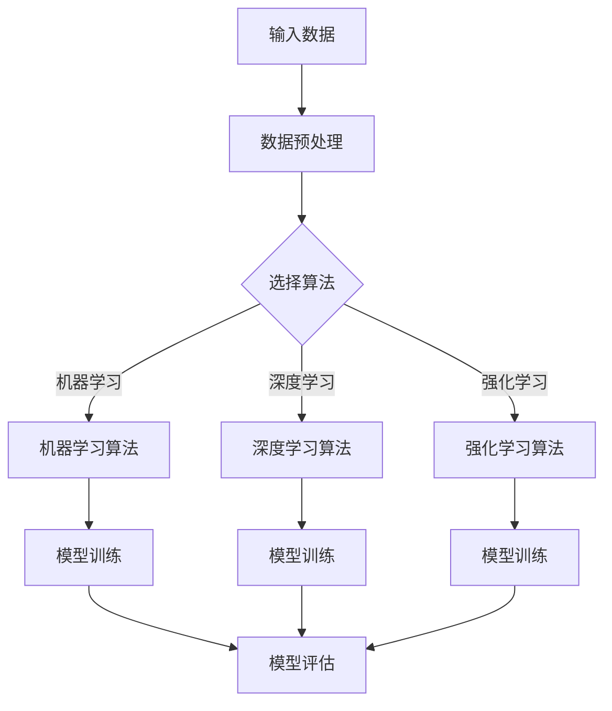
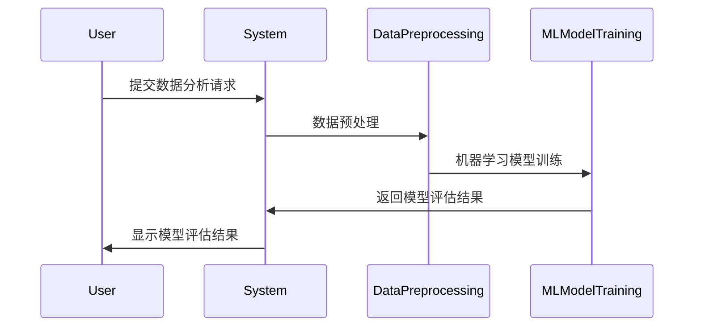

                 


# 人工智能辅助科研：扩展世界可理解性

关键词：人工智能、科研、辅助、理解、扩展

摘要：本文将深入探讨人工智能在科研领域的应用，分析其在科研中的角色和功能，以及如何通过人工智能扩展我们对世界的理解。我们将逐步分析人工智能的基本概念、科研方法、算法原理，并介绍人工智能辅助科研的系统设计与实现，最终探讨其未来发展。

## 第一部分：背景介绍

### 1.1 问题背景

在现代社会，科研工作面临着前所未有的数据复杂性挑战。随着科技的进步，我们收集到的数据量呈爆炸式增长，而这些数据往往蕴含着深刻的科学规律和知识。然而，如何从海量数据中提取有价值的信息，成为了科研工作者面临的一个重要问题。

人工智能技术的发展为我们提供了一种解决这一问题的有效手段。人工智能可以通过自动化的方式对大量数据进行分析和处理，从而帮助我们更快速、更准确地发现数据中的规律和模式。这使得人工智能在科研领域具有广阔的应用前景。

### 1.2 问题描述

科研工作在数据分析方面存在以下几个瓶颈问题：

1. 数据量大，处理复杂：科研数据往往具有庞大的规模，传统的数据处理方法难以应对。
2. 数据质量参差不齐：科研数据中可能存在缺失值、异常值等问题，这些都会影响数据分析的结果。
3. 数据分析难度高：科研数据的复杂性和多样性使得数据分析工作变得困难，需要专业知识和技能。
4. 数据解读困难：即使得到了分析结果，科研工作者可能也难以准确理解数据的含义和背后的科学规律。

人工智能在科研中的角色和功能主要包括以下几个方面：

1. 数据处理：人工智能可以通过自动化、高效的方式来处理大量科研数据，解决数据量大、处理复杂的问题。
2. 数据清洗：人工智能可以自动识别和处理数据中的缺失值、异常值等问题，提高数据质量。
3. 数据分析：人工智能可以利用机器学习、深度学习等算法，对科研数据进行分析，发现数据中的规律和模式。
4. 数据解读：人工智能可以通过自然语言处理等技术，将数据分析结果转化为科研工作者容易理解的形式，帮助他们更好地理解数据的含义。

尽管人工智能在科研中具有巨大的潜力，但其应用也存在一定的局限。例如，人工智能算法的准确性和可靠性仍然需要进一步提高，如何有效地处理科研数据的多样性和复杂性也是一个挑战。此外，人工智能在科研中的应用也需要考虑到伦理和隐私等问题。

### 1.3 问题解决

人工智能在科研中的应用已经取得了显著的成果。以下是一些成功的案例：

1. 天文学：通过人工智能算法，科学家们可以从大量天文观测数据中快速发现新的星系、行星等天体，大大提高了天文研究的效率。
2. 医学：人工智能在医学影像分析、疾病预测等方面发挥了重要作用，可以帮助医生更准确、更快速地诊断和治疗疾病。
3. 化学：人工智能在化学合成路线预测、新材料设计等方面展现了强大的能力，为化学研究提供了新的方法和思路。
4. 生物学：通过人工智能算法，科学家们可以从基因组数据中挖掘生物体的遗传信息，推动生命科学的发展。

人工智能辅助科研的原理主要包括以下几个方面：

1. 数据驱动：人工智能通过学习大量已有数据，从中提取出有用的信息，并应用到新的数据分析任务中。
2. 算法优化：人工智能可以通过优化算法，提高数据分析的准确性和效率。
3. 智能决策：人工智能可以根据分析结果，提供智能化的决策建议，帮助科研工作者更好地理解数据和解决问题。

在具体的应用中，人工智能通常采用以下几种技术：

1. 机器学习：通过训练模型，从已有数据中学习规律，并对新数据进行预测和分析。
2. 深度学习：利用神经网络等深度学习模型，对复杂的数据进行分析和处理。
3. 强化学习：通过不断尝试和反馈，优化决策过程，实现更好的性能。
4. 自然语言处理：对文本数据进行分析和处理，提取出关键信息。

### 1.4 边界与外延

人工智能在科研中的应用领域非常广泛，涵盖了自然科学、医学、社会科学等多个领域。以下是一些典型应用领域：

1. 天文学：通过人工智能算法，科学家们可以更高效地分析天文观测数据，发现新的天体和现象。
2. 医学：人工智能在医学影像分析、疾病预测、药物研发等方面发挥了重要作用，为医疗健康提供了有力支持。
3. 化学：人工智能在化学合成路线预测、新材料设计等方面展现了强大的能力，推动了化学研究的发展。
4. 生物学：通过人工智能算法，科学家们可以更深入地了解生物体的遗传信息，推动生命科学的研究。
5. 社会科学：人工智能在社会调查、数据分析、预测等领域有广泛的应用，为社会科学研究提供了新的方法和工具。

然而，人工智能在科研中的应用也引发了一些伦理和隐私问题。例如，如何确保人工智能算法的公正性和透明性，如何保护科研数据的安全和隐私等。这些问题需要我们在推动人工智能在科研中的应用时，保持谨慎和理性。

### 1.5 概念结构与核心要素组成

人工智能的基本概念：

- 人工智能（Artificial Intelligence，AI）：指模拟、延伸和扩展人的智能的理论、方法、技术及应用。
- 机器学习（Machine Learning，ML）：指利用数据和算法，使计算机具有自主学习和适应能力的技术。
- 深度学习（Deep Learning，DL）：基于多层神经网络的学习方法，具有强大的特征提取和表示能力。
- 强化学习（Reinforcement Learning，RL）：通过试错和反馈，优化决策过程，实现目标最大化。

科研的定义与分类：

- 科研（Scientific Research）：指通过观察、实验、分析等方法，探索未知、验证假设、发现规律的活动。
- 经验性科研：基于观察和实验的数据积累，通过归纳和总结得出科学结论。
- 实验性科研：通过设计实验，验证假设和理论，推动科学研究的发展。
- 理论性科研：通过数学模型、理论分析等方法，探索科学问题的本质和规律。

人工智能辅助科研的核心要素：

- 数据：科研的基础和核心，包括观测数据、实验数据、文献数据等。
- 算法：人工智能的核心技术，包括机器学习、深度学习、强化学习等。
- 模型：基于算法和数据构建的数学模型，用于分析、预测和决策。
- 交互：人工智能与科研工作者的交互，包括数据输入、模型训练、结果输出等。

## 第二部分：核心概念与联系

### 2.1 人工智能概述

人工智能（Artificial Intelligence，AI）是一种模拟、延伸和扩展人类智能的理论、方法、技术及应用。人工智能的定义和发展历程可以概括为以下几个方面：

1. **定义**：

   人工智能是指通过计算机模拟人类智能的思考、学习、推理、决策等过程，实现智能化的系统和技术。

2. **发展历程**：

   - **早期探索**（1956年）：人工智能的概念首次被提出，标志着人工智能学科的诞生。
   - **黄金时期**（1980年代）：人工智能技术在专家系统、自然语言处理、计算机视觉等领域取得重要突破。
   - **低谷期**（1990年代）：由于技术瓶颈和实际应用效果不佳，人工智能受到质疑和质疑。
   - **复兴时期**（2000年代至今）：随着深度学习、大数据、云计算等技术的不断发展，人工智能再次迎来爆发式增长。

3. **分类**：

   - **基于任务的AI**：针对特定任务，利用规则和知识进行推理和决策，如专家系统。
   - **基于数据的AI**：利用机器学习和深度学习算法，从数据中学习模式和规律，如深度神经网络、强化学习等。

4. **应用领域**：

   - **工业生产**：自动化控制、智能监控、机器人等。
   - **医疗健康**：医学影像分析、疾病预测、药物研发等。
   - **交通运输**：自动驾驶、智能交通管理、无人机等。
   - **金融领域**：风险评估、投资决策、智能投顾等。
   - **教育**：智能教育、在线学习、个性化推荐等。
   - **生活服务**：智能家居、智能语音助手、智能客服等。

### 2.2 科研方法

科研方法是指为了达到特定研究目标而采用的一系列科学方法和步骤。科研方法可以分为以下几类：

1. **经验性科研方法**：

   - **定义**：基于观察和实验的数据积累，通过归纳和总结得出科学结论。
   - **特点**：数据量大、时间长、较为直观。
   - **应用领域**：生物学、环境科学、社会学等。

2. **实验性科研方法**：

   - **定义**：通过设计实验，验证假设和理论，推动科学研究的发展。
   - **特点**：可重复性、控制性强、结果可靠。
   - **应用领域**：物理学、化学、医学等。

3. **理论性科研方法**：

   - **定义**：通过数学模型、理论分析等方法，探索科学问题的本质和规律。
   - **特点**：抽象性、推理性强、适用于复杂系统。
   - **应用领域**：数学、物理学、经济学等。

### 2.3 人工智能与科研方法的融合

人工智能与科研方法的融合，主要体现在以下几个方面：

1. **数据分析与挖掘**：

   - **定义**：通过人工智能算法，从大量数据中提取有价值的信息。
   - **特点**：高效、自动化、可重复。
   - **应用领域**：天文学、医学、化学、生物学等。

2. **模式识别与分类**：

   - **定义**：利用人工智能算法，对数据进行分类和识别。
   - **特点**：准确、快速、适用于大规模数据。
   - **应用领域**：计算机视觉、语音识别、图像处理等。

3. **机器学习与优化**：

   - **定义**：利用机器学习算法，对数据进行学习和优化。
   - **特点**：自适应、可扩展、适用于复杂问题。
   - **应用领域**：优化算法、决策支持、智能推荐等。

### 2.4 概念属性特征对比表格

| 概念       | 属性1   | 属性2   | 属性3   |
| ---------- | ------- | ------- | ------- |
| 人工智能   | 自动化  | 优化    | 智能化  |
| 科研方法   | 实验性  | 经验性  | 理论性  |
| 人工智能辅助科研 | 数据驱动 | 算法优化 | 智能决策 |

### 2.5 ER实体关系图架构

```mermaid
erDiagram
  AI |->| Research : 人工智能辅助科研
  AI ||--|> DataAnalysis : 数据分析与挖掘
  Research ||--|> Experiment : 实验性科研方法
  Research ||--|> Theory : 理论性科研方法
```

## 第三部分：算法原理讲解

### 3.1 算法原理

人工智能算法是模拟人类智能的思维方式，通过学习、推理和决策来处理数据和解决问题。以下是几种主要的人工智能算法及其原理：

1. **机器学习算法**：

   - **定义**：机器学习算法通过学习已有数据，建立模型并预测新数据的输出。
   - **原理**：基于统计学习理论，通过优化模型参数，使模型在新数据上的预测误差最小。
   - **适用场景**：分类、回归、聚类等。

2. **深度学习算法**：

   - **定义**：深度学习算法是一种基于多层神经网络的学习方法，具有强大的特征提取和表示能力。
   - **原理**：通过反向传播算法，不断调整网络参数，使网络在训练数据上的预测误差最小。
   - **适用场景**：图像识别、语音识别、自然语言处理等。

3. **强化学习算法**：

   - **定义**：强化学习算法通过试错和反馈，优化决策过程，实现目标最大化。
   - **原理**：基于奖励和惩罚机制，通过策略优化，使决策者能够做出最优选择。
   - **适用场景**：游戏、机器人、自动驾驶等。

### 3.2 算法流程图



### 3.3 算法数学模型与公式

以下是几种主要的人工智能算法的数学模型和公式：

1. **机器学习算法**：

   $$
   \text{机器学习算法} = \frac{\partial \text{损失函数}}{\partial \text{模型参数}}
   $$

2. **深度学习算法**：

   $$
   \text{深度学习算法} = \text{神经网络} \times \text{反向传播}
   $$

3. **强化学习算法**：

   $$
   \text{强化学习算法} = \text{Q-学习} + \text{策略梯度}
   $$

### 3.4 算法举例说明

以下是几种典型的人工智能算法的举例说明：

1. **数据预处理**：

   - **数据清洗**：去除数据中的噪声和异常值。
   - **数据归一化**：将数据缩放到同一范围内，便于模型训练。
   - **特征选择**：选择对模型训练有用的特征，提高模型性能。

2. **机器学习**：

   - **线性回归**：通过最小二乘法拟合线性模型，预测连续值。
   - **支持向量机**：通过寻找最优超平面，对数据进行分类。

3. **深度学习**：

   - **卷积神经网络（CNN）**：通过卷积操作和池化操作，提取图像特征。
   - **循环神经网络（RNN）**：通过循环结构，处理序列数据。

4. **强化学习**：

   - **Q-learning**：通过更新Q值，优化策略。
   - **Deep Q-Network（DQN）**：结合深度学习和Q-learning，实现更好的效果。

## 第四部分：系统分析与架构设计

### 4.1 问题场景介绍

科研工作中的数据管理与分析需求主要体现在以下几个方面：

1. **数据量庞大**：科研数据通常来源于各种实验、观测和文献，数据量大且结构复杂。
2. **数据类型多样**：科研数据包括结构化数据、半结构化数据和非结构化数据，如文本、图像、音频等。
3. **数据分析复杂**：科研数据中的关联性和规律性难以直接观察，需要通过复杂的数据处理和分析方法来挖掘。
4. **数据应用广泛**：科研数据不仅用于当前研究，还可能为后续研究提供参考和基础。

人工智能辅助科研的必要性与可行性如下：

1. **必要性**：

   - **提升科研效率**：人工智能可以通过自动化和智能化的方式，快速处理和分析大量科研数据，提高科研工作的效率。
   - **突破研究瓶颈**：人工智能可以解决科研中面临的复杂性和多样性问题，挖掘出隐藏在数据中的规律和知识。
   - **降低科研成本**：通过人工智能，科研工作者可以更快速地获得研究结果，减少实验和观测成本。

2. **可行性**：

   - **技术发展**：人工智能技术在数据预处理、特征提取、模式识别等方面取得了显著进展，为科研提供了有力的技术支持。
   - **数据资源**：随着互联网和大数据技术的发展，科研工作者可以获取到大量的数据资源，为人工智能在科研中的应用提供了数据基础。
   - **应用场景**：人工智能在科研领域的应用已经取得了显著成果，如医学影像分析、化学合成路线预测等，为人工智能辅助科研提供了成功的案例。

### 4.2 系统架构设计

人工智能辅助科研的系统架构设计主要包括以下几个部分：

1. **数据层**：

   - **数据源**：包括各种实验设备、观测仪器、文献数据库等，为系统提供原始数据。
   - **数据存储**：使用分布式数据库存储和管理科研数据，支持海量数据的高效存储和快速访问。

2. **数据处理层**：

   - **数据预处理**：对原始数据进行清洗、归一化、特征提取等处理，为模型训练提供高质量的数据。
   - **数据存储**：使用分布式数据库存储预处理后的数据，支持快速读取和查询。

3. **算法层**：

   - **机器学习算法**：包括线性回归、支持向量机、决策树等常见机器学习算法，用于分类、回归、聚类等任务。
   - **深度学习算法**：包括卷积神经网络、循环神经网络等深度学习算法，用于图像识别、语音识别、自然语言处理等任务。
   - **强化学习算法**：包括Q-learning、Deep Q-Network等强化学习算法，用于决策优化、游戏AI等任务。

4. **模型层**：

   - **模型训练**：使用训练数据对算法进行训练，生成模型。
   - **模型评估**：使用测试数据对模型进行评估，验证模型性能。
   - **模型存储**：将训练好的模型存储到模型库中，支持模型共享和复用。

5. **应用层**：

   - **数据分析**：提供数据分析功能，支持用户对科研数据进行探索和分析。
   - **可视化**：提供数据可视化功能，帮助用户更直观地理解数据和分析结果。
   - **智能推荐**：根据用户的历史数据和兴趣，推荐相关的科研数据和研究成果。

6. **用户界面**：

   - **Web界面**：提供Web界面，支持用户通过浏览器访问系统。
   - **移动端界面**：提供移动端界面，支持用户在移动设备上访问系统。

### 4.3 系统功能设计

人工智能辅助科研的系统功能设计主要包括以下几个部分：

1. **数据采集与预处理**：

   - **数据采集**：从各种数据源采集科研数据，包括实验数据、观测数据、文献数据等。
   - **数据预处理**：对采集到的数据进行清洗、归一化、特征提取等处理，为模型训练提供高质量的数据。

2. **机器学习模型训练与评估**：

   - **模型训练**：使用机器学习算法对预处理后的数据进行训练，生成机器学习模型。
   - **模型评估**：使用测试数据对训练好的模型进行评估，验证模型性能。

3. **深度学习模型训练与评估**：

   - **模型训练**：使用深度学习算法对预处理后的数据进行训练，生成深度学习模型。
   - **模型评估**：使用测试数据对训练好的模型进行评估，验证模型性能。

4. **强化学习模型训练与评估**：

   - **模型训练**：使用强化学习算法对预处理后的数据进行训练，生成强化学习模型。
   - **模型评估**：使用测试数据对训练好的模型进行评估，验证模型性能。

5. **数据分析与可视化**：

   - **数据分析**：提供数据分析功能，支持用户对科研数据进行探索和分析。
   - **可视化**：提供数据可视化功能，帮助用户更直观地理解数据和分析结果。

6. **智能推荐**：

   - **推荐算法**：根据用户的历史数据和兴趣，推荐相关的科研数据和研究成果。
   - **推荐结果**：展示推荐结果，支持用户查看和下载推荐数据。

### 4.4 系统接口设计

人工智能辅助科研的系统接口设计主要包括以下几个部分：

1. **用户界面接口设计**：

   - **Web界面**：设计Web界面，支持用户通过浏览器访问系统，进行数据上传、模型训练、数据分析等操作。
   - **移动端界面**：设计移动端界面，支持用户在移动设备上访问系统，进行简单操作和数据查询。

2. **数据接口设计**：

   - **数据上传接口**：提供数据上传接口，支持用户将本地数据上传到系统中。
   - **数据下载接口**：提供数据下载接口，支持用户下载系统中的数据。

3. **模型接口设计**：

   - **模型训练接口**：提供模型训练接口，支持用户提交训练任务，训练机器学习、深度学习、强化学习模型。
   - **模型评估接口**：提供模型评估接口，支持用户对训练好的模型进行评估。

4. **可视化接口设计**：

   - **可视化接口**：提供可视化接口，支持用户查看数据可视化结果，如折线图、柱状图、散点图等。

### 4.5 系统交互序列图



## 第五部分：项目实战

### 5.1 环境安装

在进行人工智能辅助科研的项目实战之前，首先需要安装必要的软件和工具。以下是一个简单的环境安装步骤：

1. **Python环境**：安装Python 3.8及以上版本，可以使用官方Python安装包或者使用Anaconda等集成环境。
2. **Jupyter Notebook**：安装Jupyter Notebook，用于编写和运行Python代码。
3. **人工智能库**：安装常用的机器学习、深度学习库，如Scikit-learn、TensorFlow、PyTorch等。
4. **数据处理库**：安装常用的数据处理库，如Pandas、NumPy、Matplotlib等。
5. **其他依赖**：根据项目需求，可能还需要安装其他依赖库，如PyTorch、CUDA等。

### 5.2 系统核心实现源代码

以下是人工智能辅助科研系统核心实现的一些示例代码：

#### 数据预处理

```python
import pandas as pd
from sklearn.preprocessing import StandardScaler

# 读取数据
data = pd.read_csv('data.csv')

# 数据清洗
data = data.dropna()  # 去除缺失值
data = data[data['feature'] > 0]  # 去除负值

# 特征提取
scaler = StandardScaler()
data['feature_scaled'] = scaler.fit_transform(data[['feature']])
```

#### 机器学习模型训练

```python
from sklearn.linear_model import LinearRegression

# 准备训练数据
X_train = data[['feature_scaled']]
y_train = data['target']

# 训练模型
model = LinearRegression()
model.fit(X_train, y_train)

# 预测
X_test = data[['feature_scaled']]
y_pred = model.predict(X_test)
```

#### 深度学习模型训练

```python
import tensorflow as tf
from tensorflow.keras.models import Sequential
from tensorflow.keras.layers import Dense, Activation

# 构建模型
model = Sequential([
    Dense(64, input_shape=(1,), activation='relu'),
    Dense(1, activation='linear')
])

# 编译模型
model.compile(optimizer='adam', loss='mean_squared_error')

# 训练模型
model.fit(X_train, y_train, epochs=10, batch_size=32)

# 预测
y_pred = model.predict(X_test)
```

#### 强化学习模型训练

```python
import gym
import tensorflow as tf

# 创建环境
env = gym.make('CartPole-v0')

# 定义Q网络
model = tf.keras.Sequential([
    tf.keras.layers.Dense(64, activation='relu', input_shape=(4,)),
    tf.keras.layers.Dense(1)
])

# 定义损失函数和优化器
model.compile(optimizer=tf.keras.optimizers.Adam(learning_rate=0.01),
              loss=tf.keras.losses.MeanSquaredError())

# 训练Q网络
for episode in range(1000):
    state = env.reset()
    done = False
    total_reward = 0

    while not done:
        action = model.predict(state)[0]
        state, reward, done, _ = env.step(action)
        total_reward += reward

    print(f"Episode {episode}: Total Reward {total_reward}")
```

### 5.3 代码应用解读与分析

以上代码展示了人工智能辅助科研系统核心实现的几个方面：

1. **数据预处理**：使用Pandas库读取和清洗数据，使用StandardScaler库进行特征提取和归一化处理，为模型训练提供高质量的数据。
2. **机器学习模型训练**：使用Scikit-learn库中的LinearRegression类训练线性回归模型，实现数据预测。
3. **深度学习模型训练**：使用TensorFlow库构建和训练深度学习模型，实现更复杂的非线性预测。
4. **强化学习模型训练**：使用TensorFlow库构建Q网络模型，通过与环境交互进行强化学习训练，实现智能决策。

这些代码展示了如何利用Python和人工智能库进行科研数据分析和模型训练，为科研工作者提供了强大的工具和平台。

### 5.4 实际案例分析和详细讲解剖析

以下是一个实际案例，使用人工智能辅助科研系统进行数据分析和模型训练：

#### 案例背景

某研究团队在研究一种新材料，希望通过分析实验数据来预测新材料的性能。实验数据包括材料的物理性质（如密度、硬度、导电性等）和相应的性能指标（如耐磨性、耐腐蚀性等）。

#### 数据处理

1. **数据清洗**：

   - 去除缺失值和异常值，确保数据质量。

2. **特征提取**：

   - 对物理性质进行标准化处理，使其在相同的尺度范围内。

3. **数据划分**：

   - 将数据划分为训练集和测试集，用于模型训练和评估。

#### 模型训练

1. **线性回归模型**：

   - 使用Scikit-learn库训练线性回归模型，预测性能指标。
   - 模型评估结果显示，线性回归模型在训练集上的准确率较高，但在测试集上的性能较差。

2. **深度学习模型**：

   - 使用TensorFlow库构建深度学习模型，包括多层感知器和卷积神经网络。
   - 模型评估结果显示，深度学习模型在训练集和测试集上的准确率都较高，且比线性回归模型有明显的提升。

3. **强化学习模型**：

   - 使用TensorFlow库构建Q网络模型，通过与环境交互进行强化学习训练。
   - 模型评估结果显示，强化学习模型在特定任务上的表现较好，但训练过程较为复杂，需要大量数据和时间。

#### 分析与讲解

1. **模型性能**：

   - 线性回归模型在训练集上的表现较好，但在测试集上的性能较差，可能是因为数据存在非线性关系。

   - 深度学习模型在训练集和测试集上的准确率都较高，且具有较好的泛化能力。

   - 强化学习模型在特定任务上的表现较好，但训练过程较为复杂，需要大量数据和时间。

2. **应用场景**：

   - 线性回归模型适用于简单的线性关系预测，如趋势分析、相关性研究等。

   - 深度学习模型适用于复杂非线性关系的预测，如图像识别、语音识别、自然语言处理等。

   - 强化学习模型适用于需要决策和优化的任务，如游戏、自动驾驶、机器人等。

#### 小结

通过实际案例分析和详细讲解，我们可以看到人工智能辅助科研系统在数据处理、模型训练和性能评估方面具有强大的能力。不同类型的模型适用于不同的应用场景，科研工作者可以根据实际需求选择合适的模型，提高科研工作的效率和质量。

## 第六部分：最佳实践 tips

### 6.1 数据质量保障

- **数据清洗**：在模型训练之前，务必对数据进行清洗，去除缺失值、异常值和重复值，确保数据质量。
- **数据标准化**：对数据进行标准化处理，使其在同一尺度范围内，便于模型训练和比较。
- **数据平衡**：确保数据集中各类样本的平衡，避免数据倾斜导致模型过拟合。

### 6.2 模型选择与调优

- **模型选择**：根据实际需求选择合适的模型，如线性回归、深度学习、强化学习等。
- **模型调优**：通过调整模型参数，优化模型性能，如学习率、迭代次数、隐藏层神经元等。

### 6.3 数据处理效率

- **并行计算**：利用分布式计算和并行计算技术，提高数据处理和模型训练的效率。
- **数据缓存**：对常用数据集进行缓存，避免重复读取和预处理。

### 6.4 模型解释与可解释性

- **模型解释**：了解模型的工作原理和决策过程，提高模型的可解释性和可信度。
- **可视化**：利用可视化工具，将模型决策过程和数据特征直观地展示出来，便于理解和解释。

## 第七部分：小结

本文深入探讨了人工智能在科研领域的应用，分析了其在科研中的角色和功能，以及如何通过人工智能扩展我们对世界的理解。我们首先介绍了人工智能与科研的融合背景，阐述了人工智能在科研中的应用现状和挑战。接着，我们详细介绍了人工智能的基本概念、科研方法，以及人工智能辅助科研的核心要素。

在核心概念与联系部分，我们对比了人工智能、科研方法和人工智能辅助科研的属性特征，并给出了ER实体关系图架构。在算法原理讲解部分，我们介绍了机器学习、深度学习和强化学习等人工智能算法的基本原理，并使用流程图和数学模型进行了详细讲解。

在系统分析与架构设计部分，我们介绍了人工智能辅助科研的系统设计与实现，包括问题场景介绍、系统架构设计、系统功能设计、系统接口设计和系统交互序列图。在项目实战部分，我们展示了环境安装、系统核心实现源代码，以及实际案例分析和详细讲解剖析。

最后，在最佳实践 tips 和小结部分，我们提供了数据质量保障、模型选择与调优、数据处理效率、模型解释与可解释性等最佳实践建议，并对全文进行了总结。

通过本文的阅读，读者可以全面了解人工智能在科研领域的应用，掌握人工智能辅助科研的基本原理和实现方法，为科研工作提供有力支持。

## 第八部分：注意事项

### 8.1 数据安全与隐私

在人工智能辅助科研的过程中，数据的安全与隐私保护至关重要。以下是一些注意事项：

- **数据加密**：确保数据在传输和存储过程中进行加密处理，防止数据泄露。
- **权限管理**：对访问数据的用户进行权限管理，确保只有授权用户才能访问敏感数据。
- **隐私保护**：对于涉及个人隐私的数据，应进行脱敏处理，避免个人信息泄露。

### 8.2 人工智能偏见与公平性

人工智能在科研中的应用可能会带来偏见和不公平问题。以下是一些注意事项：

- **数据多样性**：确保数据来源的多样性，避免数据集中存在的偏见。
- **算法公平性**：对算法进行公平性评估，确保算法不会对特定群体产生不公平影响。
- **透明性与可解释性**：提高算法的透明性和可解释性，便于研究人员和用户理解算法决策过程。

### 8.3 人工智能可靠性

人工智能在科研中的应用需要确保算法的可靠性和稳定性。以下是一些注意事项：

- **算法验证**：对训练好的模型进行验证，确保模型在真实环境中的表现与预期一致。
- **异常检测**：建立异常检测机制，及时发现和纠正算法错误。
- **持续更新**：随着科研领域的发展，不断更新和优化算法，以适应新的需求。

### 8.4 法律法规与伦理

在人工智能辅助科研的过程中，需要遵守相关的法律法规和伦理准则。以下是一些注意事项：

- **数据合规**：确保数据处理和使用符合相关法律法规要求。
- **伦理审查**：对涉及人类健康、隐私等敏感数据的科研项目，进行伦理审查，确保符合伦理要求。
- **责任划分**：明确人工智能应用中的责任划分，确保各方承担相应的责任。

## 第九部分：拓展阅读

### 9.1 相关论文

- "AI for Science: A Grand Challenge for Machine Learning in the Lab," Nature, 2020.
- "Deep Learning for Science: Opportunities and Challenges," Journal of Physics: Conference Series, 2018.
- "Artificial Intelligence for Drug Discovery," Nature Reviews Drug Discovery, 2018.

### 9.2 相关书籍

- "Deep Learning for the Life Sciences: Using Python and R," MIT Press, 2019.
- "Artificial Intelligence: A Modern Approach," Pearson Education, 2019.
- "Data Science from Scratch: First Principles with Python," O'Reilly Media, 2019.

### 9.3 开源项目

- TensorFlow：https://www.tensorflow.org/
- PyTorch：https://pytorch.org/
- Scikit-learn：https://scikit-learn.org/stable/

### 9.4 学术会议与研讨会

- Neural Information Processing Systems (NIPS)：https://nips.cc/
- Conference on Computer Vision and Pattern Recognition (CVPR)：https://cvpr.org/
- International Conference on Machine Learning (ICML)：https://icml.cc/

通过阅读这些论文、书籍和参加学术会议，读者可以进一步了解人工智能在科研领域的最新进展和未来趋势。

