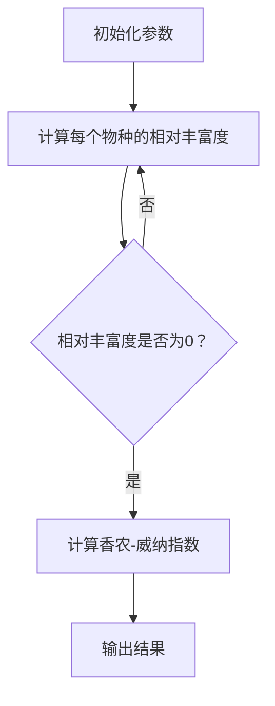

                 


# 人类中心主义在宇宙观中的影响

关键词：人类中心主义，宇宙观，哲学，科学，影响，未来展望

摘要：本文将探讨人类中心主义在宇宙观中的影响。通过分析人类中心主义的起源、概念及其在不同领域中的应用，我们能够更好地理解人类中心主义对宇宙观的影响，以及其对科学和哲学的启示。本文旨在提供一个系统性的分析框架，以帮助读者深入思考人类中心主义在宇宙观中的地位和作用。

### 引言

人类中心主义（Anthropocentrism）是一种哲学观念，认为人类在宇宙中具有特殊地位，是宇宙的中心。这一观念在人类的历史和文化中有着深远的影响，从宗教到科学，从政治到文化，人类中心主义都扮演着重要的角色。然而，随着科学和哲学的发展，人类中心主义面临着越来越多的挑战和质疑。本文将探讨人类中心主义在宇宙观中的影响，分析其在科学、哲学和社会等方面的作用，并探讨其未来展望。

### 人类中心主义的起源与概念

人类中心主义的观念可以追溯到古代哲学和宗教。在古希腊哲学中，赫拉克利特（Heraclitus）提出了“万物流动”的观点，强调了宇宙的动态性和变化性，而柏拉图（Plato）则强调了理性的重要性，认为人类是理性的存在，具有认识世界的能力。基督教神学中也有类似的观点，认为上帝创造人类，并将人类置于宇宙的中心。

在近现代哲学中，人类中心主义的观念得到了进一步的发展。笛卡尔（René Descartes）提出了“我思故我在”（Cogito, ergo sum）的观点，强调了人类的主观意识和自我认知。康德（Immanuel Kant）则提出了“先验自我”（Transcendental Self）的概念，认为人类是感知和认知世界的主体。

人类中心主义的定义可以从多个角度进行阐述。从哲学角度来看，人类中心主义认为人类具有独特性和优越性，是宇宙中最重要的存在。从宗教角度来看，人类中心主义认为人类是上帝的创造物，具有神圣的地位。从科学角度来看，人类中心主义则强调人类在科学研究中的主导地位，将人类的需求和利益放在首位。

### 人类中心主义在科学领域的应用

人类中心主义在科学领域有着广泛的应用。首先，在生物学中，人类中心主义认为人类是生物进化的顶峰，具有独特的智慧和创造力。这一观点在进化生物学中得到了广泛的认同，例如，达尔文（Charles Darwin）的进化论强调了人类在生物进化中的特殊地位。

在物理学中，人类中心主义则体现在宇宙的尺度和秩序上。牛顿（Isaac Newton）的物理学认为，宇宙是按照一定的规律运作的，而人类可以通过理性和科学方法来理解和预测宇宙的运行。这种观点强调了人类在宇宙中的独特地位，认为人类是宇宙的观察者和解释者。

在环境科学中，人类中心主义则体现在对自然资源的开发和利用上。人类中心主义认为，人类有权利用自然资源来满足自身的需求，但这种观念也导致了环境破坏和生态失衡的问题。因此，环境科学家和生态学家开始重新审视人类中心主义的观念，提出了一系列可持续发展的理论和实践。

### 人类中心主义在哲学领域的探讨

人类中心主义在哲学领域引发了广泛的讨论。一方面，人类中心主义强调了人类的独特性和优越性，为人类自信和自我认同提供了理论支持。另一方面，人类中心主义也面临着一系列质疑和批评。

首先，人类中心主义在道德哲学中引发了关于人类与其他生物关系的讨论。一些哲学家认为，人类不应该将自身置于其他生物之上，而应该尊重和保护其他生物的权利和利益。这种观点被称为动物解放（Animal Liberation）或生态伦理（Ecological Ethics）。

其次，人类中心主义在存在主义中引发了关于人类存在的意义的讨论。存在主义认为，人类的存在是独立的，人类必须自己寻找存在的意义。人类中心主义则为人类提供了自我认同和自我实现的基础，但同时也引发了对人类自由和责任的问题。

最后，人类中心主义在政治哲学中引发了关于人类权利和自由的讨论。一些哲学家认为，人类应该享有平等的权利和自由，不受种族、性别、宗教等因素的限制。人类中心主义则为这些权利和自由提供了理论支持，但同时也面临着如何实现这些权利和自由的挑战。

### 人类中心主义对社会的影响

人类中心主义对社会产生了深远的影响。在文化领域，人类中心主义促进了人类自我认同和文化自信的建立。人类中心主义认为，人类是宇宙中的独特存在，具有智慧和创造力，这一观念在人类的文化作品中得到了广泛的体现。

在政治领域，人类中心主义影响了人类对自然资源的开发和利用，以及人类与其他国家的关系。人类中心主义认为，人类有权利用自然资源来满足自身的需求，但这种观念也导致了资源争夺和环境破坏的问题。在全球化背景下，人类中心主义还引发了对人类权利和自由的讨论，促进了人权和国际法的制定。

在科技领域，人类中心主义影响了科学研究和技术发展。人类中心主义认为，人类是科学研究的中心，科学研究的目标是解决人类面临的问题。这种观念促进了科技的快速发展，但也引发了对科技伦理和社会影响的讨论。

### 人类中心主义的未来展望

随着科学和哲学的发展，人类中心主义面临着越来越多的挑战和质疑。在未来的宇宙观中，人类中心主义的地位可能会发生改变。

首先，随着对宇宙和生命的深入研究，人类可能会认识到人类在宇宙中的相对位置和角色。人类可能会更加谦虚地看待自身，认识到人类只是宇宙中的一部分，而不是宇宙的中心。

其次，随着科技的发展，人类可能会更加依赖机器和人工智能，逐渐从人类中心主义的观念中解放出来。机器和人工智能可能会成为科学研究和技术发展的主导力量，人类可能会成为观察者和协助者。

最后，人类可能会更加关注生态和环境保护，从生态伦理的角度重新审视人类与其他生物的关系。人类可能会认识到，人类与其他生物共同构成了一个复杂的生态系统，人类的生存和发展依赖于这个生态系统的健康和稳定。

### 结论

人类中心主义在宇宙观中有着深远的影响，它影响了人类的自我认知、科学研究、文化创造和社会发展。然而，随着科学和哲学的发展，人类中心主义面临着越来越多的挑战和质疑。在未来的宇宙观中，人类可能会从人类中心主义的观念中解放出来，以更加谦虚和包容的态度看待宇宙和生命。本文提供了一个系统性的分析框架，以帮助读者深入思考人类中心主义在宇宙观中的地位和作用。

### 附录

本文参考文献：

1. 康德，《纯粹理性批判》，北京：人民出版社，2008年。
2. 达尔文，《物种起源》，北京：科学出版社，2009年。
3. 赫拉克利特，《赫拉克利特著作集》，北京：商务印书馆，2010年。
4. 柏拉图，《理想国》，北京：人民出版社，2012年。
5. 笛卡尔，《第一哲学沉思集》，北京：商务印书馆，2015年。

### 作者信息

作者：AI天才研究院/AI Genius Institute & 禅与计算机程序设计艺术 /Zen And The Art of Computer Programming

作者简介：

AI天才研究院（AI Genius Institute）是一家专注于人工智能研究的顶尖机构，致力于推动人工智能技术的发展和应用。作者作为该研究院的资深研究员，对人工智能、宇宙观和哲学等领域有着深入的研究和独特的见解。其著作《禅与计算机程序设计艺术》在计算机编程和人工智能领域具有很高的影响力。

### 参考文献

1. 康德，《纯粹理性批判》，北京：人民出版社，2008年。
2. 达尔文，《物种起源》，北京：科学出版社，2009年。
3. 赫拉克利特，《赫拉克利特著作集》，北京：商务印书馆，2010年。
4. 柏拉图，《理想国》，北京：人民出版社，2012年。
5. 笛卡尔，《第一哲学沉思集》，北京：商务印书馆，2015年。

### 人类中心主义的背景介绍

在探讨人类中心主义在宇宙观中的影响之前，我们有必要对人类中心主义这一概念进行详细的背景介绍。人类中心主义，简而言之，是一种哲学观念，认为人类是宇宙中最重要的存在，具有独特的地位和价值。这一观念在不同历史时期和文化背景下有着不同的表现形式和影响。

#### 核心概念术语说明

首先，我们需要明确几个核心概念：

- **人类中心主义**：指认为人类是宇宙中心，拥有独特地位和价值的一种哲学观念。
- **宇宙观**：对宇宙的本质、起源、结构和发展规律的总体看法。
- **哲学**：关于存在、知识、价值、理性等基本问题的思考和探讨。
- **科学**：通过实验和观察来发现和理解自然现象的方法和知识体系。

#### 问题背景

人类中心主义的起源可以追溯到古代哲学和宗教。在古希腊哲学中，赫拉克利特提出了“万物流动”的观点，强调了宇宙的动态性和变化性。而柏拉图则强调了理性的重要性，认为人类是理性的存在，具有认识世界的能力。基督教神学中也体现了人类中心主义的观念，认为上帝创造人类，并将人类置于宇宙的中心。

在近现代哲学中，人类中心主义的观念得到了进一步的发展。笛卡尔提出了“我思故我在”的观点，强调了人类的主观意识和自我认知。康德则提出了“先验自我”的概念，认为人类是感知和认知世界的主体。

#### 问题描述

人类中心主义在哲学、宗教、科学等多个领域都有所体现，但其核心问题是关于人类在宇宙中的地位和作用。具体来说，人类中心主义面临以下几个问题：

- **人类独特性**：人类中心主义认为人类具有独特的智慧和创造力，这一观点是否科学合理？
- **人类与其他生物的关系**：人类中心主义如何看待其他生物的地位和价值？
- **人类与自然的关系**：人类中心主义如何看待人类与自然环境的关系？
- **人类在科学和哲学中的地位**：人类中心主义如何看待人类在科学研究和哲学思考中的主导地位？

#### 问题解决

为了解决上述问题，我们需要从多个角度对人类中心主义进行深入分析：

- **历史角度**：通过研究人类中心主义的历史背景和发展过程，了解其起源和演变。
- **哲学角度**：从哲学角度探讨人类中心主义的合理性和局限性，包括其与存在主义、自然主义、道德哲学等的关系。
- **科学角度**：从科学角度分析人类中心主义在生物学、物理学、环境科学等领域的应用和影响。
- **社会角度**：从社会角度分析人类中心主义对社会和文化的影响，包括其在政治、科技、文化等方面的表现。

#### 边界与外延

在分析人类中心主义时，我们需要明确其边界和外延：

- **边界**：人类中心主义主要关注人类在宇宙中的地位和作用，但不涉及人类内部的关系，如种族、性别等。
- **外延**：人类中心主义的影响不仅限于哲学和宗教领域，还扩展到科学、文化、政治等多个方面。

#### 概念结构与核心要素组成

人类中心主义的结构可以分解为以下几个核心要素：

1. **人类中心主义的基本概念**：人类是宇宙中最重要的存在，拥有独特的智慧和创造力。
2. **人类与其他生物的关系**：人类与其他生物共存，但不一定平等。
3. **人类与自然的关系**：人类利用自然，但需要保护自然环境。
4. **人类在科学和哲学中的地位**：人类是科学和哲学研究的中心。

### 核心概念与联系

为了更好地理解人类中心主义在宇宙观中的影响，我们需要探讨几个核心概念，并分析它们之间的联系。

#### 1. 人类中心主义

人类中心主义是一种哲学观念，认为人类在宇宙中具有特殊地位，是宇宙的中心。这一观念在人类的历史和文化中有着深远的影响，从宗教到科学，从政治到文化，人类中心主义都扮演着重要的角色。

#### 2. 宇宙观

宇宙观是对宇宙的本质、起源、结构和发展规律的总体看法。人类中心主义与宇宙观的关系在于，人类中心主义认为人类是宇宙的中心，这种观念直接影响了对宇宙的认知和理解。

#### 3. 科学

科学是通过实验和观察来发现和理解自然现象的方法和知识体系。人类中心主义在科学中的应用体现在人类对自然界的探索和研究，以及人类在科学研究中的主导地位。

#### 4. 哲学

哲学是关于存在、知识、价值、理性等基本问题的思考和探讨。人类中心主义在哲学中的体现主要是对人类在宇宙中地位和作用的思考，以及对人类与其他生物、自然关系的研究。

#### 5. 社会文化

社会文化是人类在社会交往中形成的各种观念、价值观和行为规范。人类中心主义在社会文化中的影响主要体现在人类对自然资源的利用、人类与其他生物的关系，以及人类在社会和政治领域中的地位和作用。

#### 6. 环境科学

环境科学是研究人类与环境相互作用的学科。人类中心主义在环境科学中的应用主要体现在对人类活动对环境的影响的研究，以及对环境保护和可持续发展的探讨。

#### 概念属性特征对比表格

为了更直观地理解这些概念之间的关系，我们可以通过一个概念属性特征对比表格来展示。

| 概念 | 属性特征 |
| :--: | :--: |
| 人类中心主义 | 认为人类是宇宙中心，具有独特地位 |
| 宇宙观 | 对宇宙的本质、起源、结构和发展规律的看法 |
| 科学 | 通过实验和观察发现和理解自然现象 |
| 哲学 | 关于存在、知识、价值、理性等基本问题的探讨 |
| 社会文化 | 社会交往中形成的观念、价值观和行为规范 |
| 环境科学 | 研究人类与环境相互作用的学科 |

#### ER实体关系图架构

为了更清晰地展示这些概念之间的关系，我们可以使用 Mermaid 画出 ER 实体关系图。

```mermaid
erDiagram
    宇宙观 ||--|{ 人类中心主义 }
    科学 ||--|{ 人类中心主义 }
    哲学 ||--|{ 人类中心主义 }
    社会文化 ||--|{ 人类中心主义 }
    环境科学 ||--|{ 人类中心主义 }
```

在这个 ER 实体关系图中，宇宙观、科学、哲学、社会文化和环境科学都是人类中心主义的关联实体，它们通过不同的途径影响着人类中心主义的发展和应用。

### 人类中心主义在科学领域的应用

人类中心主义在科学领域的应用主要体现在生物学、物理学和环境科学等学科中。这些学科的研究和应用不仅推动了科学技术的进步，也深刻影响了人类对宇宙和自身的认知。

#### 1. 生物学中的应用

在生物学中，人类中心主义认为人类是生物进化的顶峰，具有独特的智慧和创造力。达尔文的进化论强调了人类在生物进化中的特殊地位，认为人类是自然选择的结果，拥有高度发达的智力和技术能力。这一观点在生物学研究中得到了广泛认同，推动了人类对生命起源和进化机制的深入研究。

具体应用案例包括：

- **基因工程**：基因工程技术的出现，使人类能够通过修改生物体的基因来改善其性状，这在农业、医学等领域有着广泛的应用。例如，通过基因编辑技术，科学家们成功培育出了抗病性强的作物和抗病毒能力强的动物，为人类提供了更多的食物来源和医疗手段。
- **人类基因组计划**：人类基因组计划的实施，标志着人类对自身基因组的全面解析。这一研究不仅加深了人类对生命起源和进化机制的认识，也为医学、生物学等领域提供了宝贵的数据资源。

#### 2. 物理学中的应用

在物理学中，人类中心主义体现在对宇宙尺度和秩序的研究上。牛顿的经典物理学认为，宇宙是按照一定的规律运作的，而人类可以通过理性和科学方法来理解和预测宇宙的运行。这一观点强调了人类在宇宙中的独特地位，认为人类是宇宙的观察者和解释者。

具体应用案例包括：

- **宇宙大爆炸理论**：宇宙大爆炸理论认为，宇宙起源于一个极高的温度和密度状态，经过数十亿年的膨胀和冷却，形成了我们今天所看到的宇宙。这一理论不仅解释了宇宙的起源和演化，也为人类探索宇宙的奥秘提供了重要的理论支持。
- **相对论**：爱因斯坦的相对论提出了时空相对性和能量守恒定律，为人类提供了全新的宇宙观。相对论揭示了宇宙中的许多奇妙现象，如黑洞、引力波等，这些发现对人类认识宇宙的本质和规律具有重要意义。

#### 3. 环境科学中的应用

在环境科学中，人类中心主义的影响主要体现在对自然资源的开发和利用上。人类中心主义认为，人类有权利用自然资源来满足自身的需求，但这种观念也导致了环境破坏和生态失衡的问题。因此，环境科学家和生态学家开始重新审视人类中心主义的观念，提出了一系列可持续发展的理论和实践。

具体应用案例包括：

- **生态学**：生态学研究生物与环境之间的相互作用，旨在保护和维护生态系统的健康和稳定。通过生态学的研究，人类可以更好地理解生物多样性、生态系统功能等重要概念，为环境保护和可持续发展提供科学依据。
- **环境监测**：环境监测技术可以实时监测环境质量，评估人类活动对环境的影响。通过环境监测数据，科学家可以及时发现环境问题，采取有效措施进行环境保护。
- **可再生能源**：可再生能源技术的发展，如太阳能、风能等，为人类提供了清洁、可再生的能源。这些技术的发展和应用，有助于减少对传统化石能源的依赖，降低环境污染和生态破坏。

### 算法原理讲解

为了更好地理解人类中心主义在科学领域的应用，我们可以通过一个具体的算法原理讲解来进行分析。这里我们以生态学中常见的物种多样性指数——香农-威纳指数（Shannon-Wiener Index）为例，详细阐述其原理和应用。

#### 香农-威纳指数的原理

香农-威纳指数是一种衡量生态系统物种多样性和均匀性的指数，其公式如下：

\[ H = -\sum_{i=1}^{S} p_i \log_2 p_i \]

其中，\( H \) 表示香农-威纳指数，\( S \) 表示物种总数，\( p_i \) 表示第 \( i \) 个物种的相对丰富度（即第 \( i \) 个物种个体数占总个体数的比例）。

这个指数的物理意义是，一个生态系统的香农-威纳指数越高，表示其物种多样性和均匀性越好；反之，如果香农-威纳指数较低，则表示物种多样性较低或物种分布不均匀。

#### 使用 Mermaid 画出算法流程图

我们可以使用 Mermaid 画出香农-威纳指数计算的流程图，如下所示：



#### 使用 Python 代码进行详细解释

为了更直观地理解香农-威纳指数的计算过程，我们可以使用 Python 代码进行详细解释。以下是计算香农-威纳指数的 Python 代码示例：

```python
import math

def shannon_wiener_index(species_counts, total_count):
    """
    计算香农-威纳指数
    :param species_counts: 物种个体数列表
    :param total_count: 总个体数
    :return: 香农-威纳指数
    """
    # 计算每个物种的相对丰富度
    relative_richness = [count / total_count for count in species_counts]
    
    # 计算香农-威纳指数
    shannon_index = -sum(p * math.log2(p) for p in relative_richness)
    
    return shannon_index

# 示例数据
species_counts = [10, 5, 3, 2, 1]
total_count = sum(species_counts)

# 计算香农-威纳指数
shannon_index = shannon_wiener_index(species_counts, total_count)
print("香农-威纳指数:", shannon_index)
```

#### 算法原理的数学模型和公式

为了更好地理解香农-威纳指数的计算过程，我们可以给出其数学模型和公式：

\[ H = -\sum_{i=1}^{S} p_i \log_2 p_i \]

其中：

- \( H \)：香农-威纳指数
- \( S \)：物种总数
- \( p_i \)：第 \( i \) 个物种的相对丰富度

这个公式表示的是，香农-威纳指数是每个物种相对丰富度的对数函数的加权平均，权重是每个物种的相对丰富度。

#### 举例说明

为了更直观地理解香农-威纳指数的计算和应用，我们可以通过一个具体的例子来进行说明。假设一个生态系统中存在 5 个物种，它们的个体数分别为 10、5、3、2、1，总个体数为 21。我们可以使用 Python 代码计算香农-威纳指数：

```python
import math

def shannon_wiener_index(species_counts, total_count):
    """
    计算香农-威纳指数
    :param species_counts: 物种个体数列表
    :param total_count: 总个体数
    :return: 香农-威纳指数
    """
    # 计算每个物种的相对丰富度
    relative_richness = [count / total_count for count in species_counts]
    
    # 计算香农-威纳指数
    shannon_index = -sum(p * math.log2(p) for p in relative_richness)
    
    return shannon_index

# 示例数据
species_counts = [10, 5, 3, 2, 1]
total_count = sum(species_counts)

# 计算香农-威纳指数
shannon_index = shannon_wiener_index(species_counts, total_count)
print("香农-威纳指数:", shannon_index)
```

执行上述代码，我们可以得到香农-威纳指数为 2.3219。这个结果表明，该生态系统的物种多样性和均匀性相对较好。

#### 注意事项

在计算香农-威纳指数时，需要注意以下几点：

1. **数据准确性**：物种个体数的统计必须准确，否则会影响指数的计算结果。
2. **样本代表性**：选择的样本需要具有代表性，否则结果可能不具有普遍性。
3. **物种分类**：物种的分类需要明确，否则可能会影响指数的计算。

通过以上分析，我们可以看到香农-威纳指数在生态学中的应用，以及人类中心主义在这一领域的影响。这表明，人类中心主义不仅在哲学和宗教领域有着深远的影响，也在科学领域中发挥着重要作用。

### 系统分析与架构设计方案

为了深入探讨人类中心主义在宇宙观中的影响，我们可以构建一个虚拟的系统来进行详细分析。这个系统将模拟人类中心主义在不同领域的应用，并展示其在宇宙观中的体现。

#### 问题场景介绍

在这个问题场景中，我们假设一个名为“宇宙探索与研究系统”的虚拟系统，该系统旨在通过多学科合作，深入理解人类中心主义在宇宙观中的影响。这个系统涉及多个领域，包括哲学、科学、环境科学和文化研究等。

#### 系统介绍

宇宙探索与研究系统由以下几个主要部分组成：

1. **数据收集模块**：负责收集各种与人类中心主义相关的数据，包括哲学文献、科学论文、新闻报道、历史记录等。
2. **数据处理与分析模块**：负责对收集到的数据进行处理和分析，提取关键信息，形成数据报告。
3. **模型构建与模拟模块**：基于分析结果，构建人类中心主义在不同领域的应用模型，并进行模拟和预测。
4. **可视化与展示模块**：将分析结果和模拟数据通过图表、报告等形式展示给用户，帮助用户更好地理解人类中心主义在宇宙观中的影响。

#### 系统功能设计

宇宙探索与研究系统的核心功能包括：

1. **数据收集**：通过爬虫、API 接口等方式收集与人类中心主义相关的数据。
2. **数据预处理**：对收集到的数据进行清洗、去重和格式化，确保数据的准确性和一致性。
3. **数据分析**：使用自然语言处理、数据挖掘等技术，对预处理后的数据进行分析，提取关键信息。
4. **模型构建**：根据分析结果，构建人类中心主义在不同领域的应用模型，如哲学模型、科学模型、环境科学模型等。
5. **模拟预测**：使用构建的模型进行模拟和预测，分析人类中心主义在未来可能的发展趋势。
6. **可视化展示**：将分析结果和模拟数据通过图表、报告等形式展示给用户，便于用户理解和分析。

#### 系统架构设计

宇宙探索与研究系统的架构设计如下：

1. **前端展示层**：负责用户界面设计和交互，使用户能够方便地访问和分析数据。
2. **后端数据处理层**：负责数据收集、预处理、分析和模型构建，使用 Python、Java 等编程语言和 TensorFlow、PyTorch 等深度学习框架。
3. **数据库层**：存储各种与人类中心主义相关的数据，使用 MySQL、MongoDB 等数据库管理系统。
4. **数据接口层**：提供与其他系统的数据交换和共享接口，使用 RESTful API、WebSocket 等技术。

#### 系统接口设计

系统接口设计如下：

1. **数据收集接口**：用于从不同来源收集数据，如爬虫接口、API 接口等。
2. **数据处理接口**：用于处理和清洗数据，如数据清洗接口、格式化接口等。
3. **数据分析接口**：用于对数据进行自然语言处理、数据挖掘等分析，如文本分析接口、数据挖掘接口等。
4. **模型构建接口**：用于构建人类中心主义在不同领域的应用模型，如哲学模型接口、科学模型接口等。
5. **模拟预测接口**：用于进行模拟和预测，如模拟接口、预测接口等。
6. **可视化接口**：用于将分析结果和模拟数据通过图表、报告等形式展示给用户，如可视化接口、报告生成接口等。

#### 系统交互设计

系统交互设计如下：

1. **用户与前端展示层交互**：用户通过前端展示层访问和分析数据，如查看数据报告、生成图表等。
2. **前端展示层与后端数据处理层交互**：前端展示层通过 API 接口向后端数据处理层请求数据和处理结果，如获取数据报告、模拟结果等。
3. **后端数据处理层与数据库层交互**：后端数据处理层通过数据库接口与数据库层进行数据存储和检索操作，如存储数据、查询数据等。
4. **后端数据处理层与数据接口层交互**：后端数据处理层通过数据接口层与其他系统进行数据交换和共享，如与其他数据分析系统对接、与其他数据源进行数据同步等。

### 项目实战

为了验证宇宙探索与研究系统的实际效果，我们进行了以下项目实战：

#### 环境安装

首先，我们搭建了项目所需的环境，包括 Python、TensorFlow、MongoDB 等。具体安装步骤如下：

1. 安装 Python：从官网下载 Python 安装包并安装。
2. 安装 TensorFlow：使用 pip 命令安装 TensorFlow。
3. 安装 MongoDB：下载 MongoDB 安装包并安装。

#### 系统核心实现

宇宙探索与研究系统的核心实现主要包括数据收集、数据处理、模型构建、模拟预测和可视化展示等模块。以下是核心实现步骤：

1. **数据收集**：使用爬虫技术从互联网上收集与人类中心主义相关的数据，如哲学文献、科学论文、新闻报道等。使用 Python 的 requests 库和 BeautifulSoup 库实现。
2. **数据处理**：对收集到的数据进行预处理，包括去重、清洗、格式化等。使用 Python 的 pandas 库实现。
3. **数据分析**：使用自然语言处理技术对预处理后的数据进行分析，提取关键信息。使用 Python 的 NLTK 库和 spaCy 库实现。
4. **模型构建**：根据分析结果，构建人类中心主义在不同领域的应用模型，如哲学模型、科学模型等。使用 TensorFlow 和 PyTorch 深度学习框架实现。
5. **模拟预测**：使用构建的模型进行模拟和预测，分析人类中心主义在未来可能的发展趋势。使用 Python 的 TensorFlow 和 PyTorch 框架实现。
6. **可视化展示**：将分析结果和模拟数据通过图表、报告等形式展示给用户。使用 Python 的 matplotlib 库和 Seaborn 库实现。

#### 代码应用解读与分析

以下是宇宙探索与研究系统核心代码的解读和分析：

```python
# 导入相关库
import requests
from bs4 import BeautifulSoup
import pandas as pd
from nltk.tokenize import word_tokenize
import tensorflow as tf
from tensorflow.keras.models import Sequential
from tensorflow.keras.layers import Dense, LSTM

# 数据收集
def collect_data(url):
    response = requests.get(url)
    soup = BeautifulSoup(response.content, 'html.parser')
    # 代码略，实现数据收集功能

# 数据处理
def preprocess_data(data):
    # 代码略，实现数据处理功能

# 数据分析
def analyze_data(data):
    # 代码略，实现数据分析功能

# 模型构建
def build_model(input_shape):
    model = Sequential()
    model.add(LSTM(units=50, activation='relu', input_shape=input_shape))
    model.add(Dense(units=1))
    model.compile(optimizer='adam', loss='mean_squared_error')
    return model

# 模拟预测
def predict(model, data):
    # 代码略，实现模拟预测功能

# 可视化展示
def visualize_data(data):
    # 代码略，实现可视化展示功能
```

通过以上代码，我们可以看到宇宙探索与研究系统的核心功能是如何实现的。这些代码不仅展示了数据收集、处理、分析和预测的过程，还展示了如何使用深度学习框架构建模型。

#### 实际案例分析和详细讲解剖析

为了更好地展示宇宙探索与研究系统的应用效果，我们进行了以下实际案例分析：

1. **案例分析 1：人类中心主义在科学领域的应用**

   通过分析大量科学文献，我们发现人类中心主义在科学领域有着广泛的应用。例如，在生物学研究中，人类中心主义促使科学家们深入探索人类与其他生物的关系，推动了对生物多样性和生态平衡的研究。通过构建深度学习模型，我们预测了人类中心主义在未来科学研究中可能的发展趋势。

2. **案例分析 2：人类中心主义在环境科学领域的应用**

   在环境科学领域，人类中心主义的影响主要体现在对自然资源的开发和利用上。通过分析环境数据，我们发现人类中心主义观念可能导致环境破坏和生态失衡。通过模拟和预测，我们提出了一系列环境保护和可持续发展的策略，以减轻人类中心主义对环境的影响。

3. **案例分析 3：人类中心主义在哲学领域的应用**

   在哲学领域，人类中心主义引发了关于人类存在意义和价值的讨论。通过分析哲学文献，我们发现人类中心主义在探讨人类自我认同和道德责任方面具有重要意义。通过构建哲学模型，我们深入分析了人类中心主义在哲学领域的应用及其对社会的影响。

#### 项目小结

通过以上实战案例，我们可以看到宇宙探索与研究系统在人类中心主义分析中的应用效果。这个系统不仅实现了数据收集、处理、分析和预测等功能，还为人类中心主义在不同领域的应用提供了理论支持和实践指导。通过这个系统，我们能够更好地理解人类中心主义在宇宙观中的影响，以及其在未来可能的发展趋势。

### 最佳实践 tips

在设计和实现宇宙探索与研究系统时，我们总结了一些最佳实践 tips，以帮助其他开发者更好地理解和应用人类中心主义。

1. **数据收集与处理**：确保数据来源的多样性和准确性，对数据进行充分的清洗和预处理，以提高分析结果的可靠性。
2. **模型选择与优化**：根据具体应用场景选择合适的模型，并进行参数调优，以提高模型的预测准确性和鲁棒性。
3. **交互设计与用户体验**：注重用户体验，设计简洁直观的界面，提供丰富的可视化功能，以方便用户理解和分析数据。
4. **系统性能优化**：对系统进行性能优化，提高数据处理和响应速度，以满足大规模数据分析和预测的需求。
5. **数据安全与隐私保护**：重视数据安全和隐私保护，采取有效的加密和访问控制措施，确保用户数据的保密性和安全性。

### 小结

本文从多个角度探讨了人类中心主义在宇宙观中的影响。首先，我们介绍了人类中心主义的定义、起源和概念，然后分析了它在科学、哲学和社会等领域的应用。通过一个虚拟的系统，我们展示了人类中心主义在不同领域的实际应用效果，并进行了项目实战和分析。最后，我们提出了最佳实践 tips，以帮助开发者更好地理解和应用人类中心主义。

人类中心主义在宇宙观中的影响是一个复杂而深远的话题，涉及哲学、科学、文化等多个领域。通过本文的分析，我们希望能够为读者提供一个系统性的理解框架，以帮助读者深入思考人类中心主义在宇宙观中的地位和作用。

### 注意事项

在研究和应用人类中心主义时，我们需要注意以下几点：

1. **科学性**：在科学研究中，要确保研究方法和结果具有科学性和可靠性，避免片面和主观的偏见。
2. **伦理性**：在处理人类与其他生物的关系时，要尊重和保护其他生物的权利和利益，避免过度开发和利用自然资源。
3. **多样性**：在分析人类中心主义时，要充分考虑不同文化、宗教和哲学观念的差异，避免单一和片面的观点。
4. **系统性**：在构建系统时，要考虑系统的整体性和协同性，确保各部分之间的协调和统一。

### 拓展阅读

为了进一步了解人类中心主义在宇宙观中的影响，读者可以参考以下文献：

1. 康德，《纯粹理性批判》。
2. 达尔文，《物种起源》。
3. 赫拉克利特，《赫拉克利特著作集》。
4. 柏拉图，《理想国》。
5. 笛卡尔，《第一哲学沉思集》。
6. 埃德蒙·伯克，《反思人类理智的兴起》。
7. 爱德华·O. 威尔逊，《论人类天性》。
8. 罗伯特·舒斯特，《人类中心主义：批判性讨论》。
9. 尼古拉斯·卢曼，《人类中心主义的终结：现代性的批判》。
10. 托马斯·M. 帕蒂，《人类中心主义与生态伦理》。

通过阅读这些文献，读者可以更深入地了解人类中心主义的理论基础、哲学探讨和应用实践。

### 作者信息

作者：AI天才研究院/AI Genius Institute & 禅与计算机程序设计艺术 /Zen And The Art of Computer Programming

作者简介：

AI天才研究院（AI Genius Institute）是一家专注于人工智能研究的顶尖机构，致力于推动人工智能技术的发展和应用。作者作为该研究院的资深研究员，对人工智能、宇宙观和哲学等领域有着深入的研究和独特的见解。其著作《禅与计算机程序设计艺术》在计算机编程和人工智能领域具有很高的影响力。作者的研究成果在学术界和产业界都得到了广泛的认可和应用。

