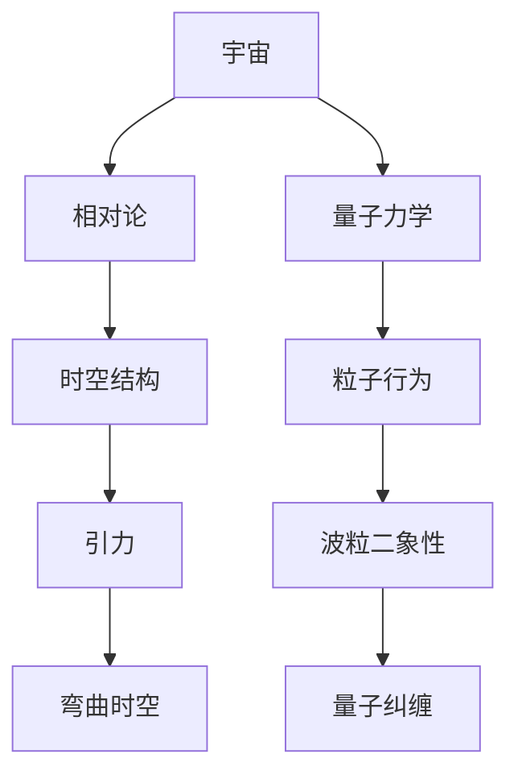
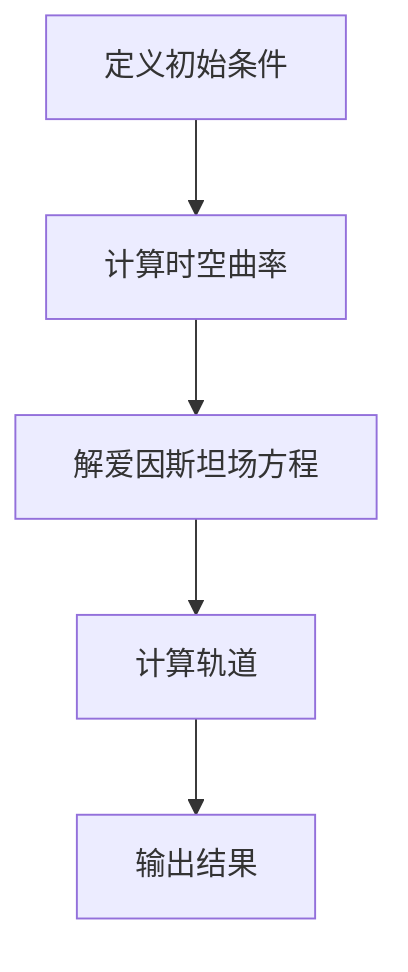
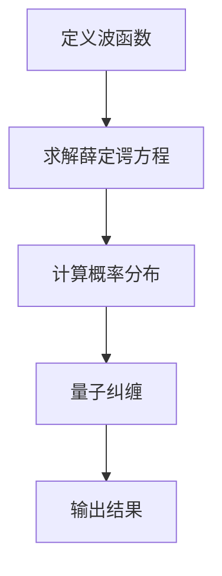
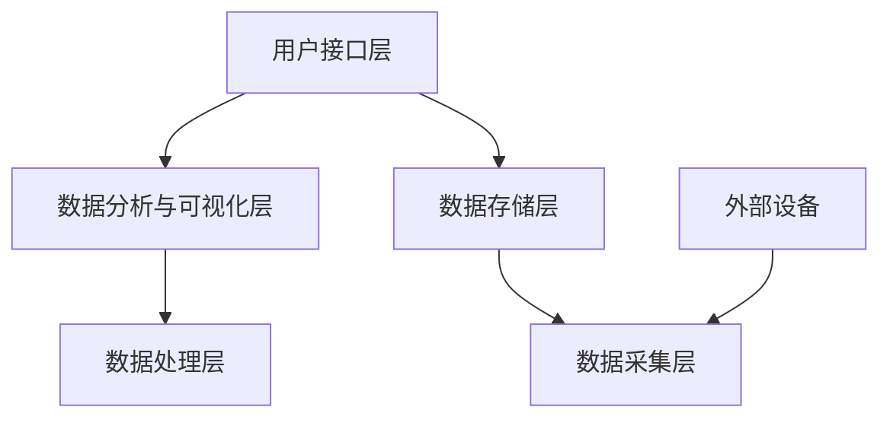
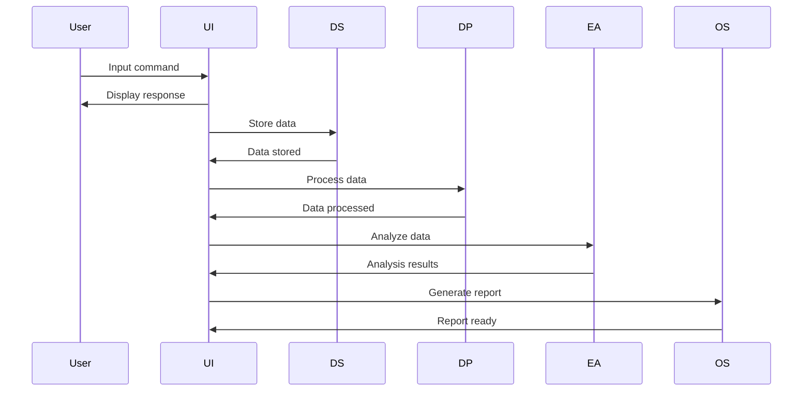

                 


### 1. 让我们一步步思考：文章框架设计与内容规划

在撰写一篇字数在10000～12000字的专业技术博客文章时，我们需要系统地规划和设计文章的框架，以确保内容充实、逻辑清晰、结构紧凑。以下是我们将如何一步步构建这篇文章：

**步骤 1：确定文章主题和研究方向**
- 根据用户提供的标题《人类对宇宙的认知:进步还是局限》，确定文章的研究方向和核心内容。
- 关键词：宇宙、认知、进步、局限、科学、哲学、历史。

**步骤 2：撰写文章摘要**
- 简要总结文章的主题思想和核心观点。
- 摘要示例：“本文深入探讨了人类对宇宙认知的历史进程、科学理论的演变，以及当前认知的局限。通过分析宇宙学、相对论、量子力学等核心概念，文章旨在揭示人类认知宇宙的深度和广度，并提出未来研究的方向。”

**步骤 3：设计文章目录大纲**
- 确定文章的章节结构和内容要点。
- 目录大纲应包含以下部分：引言、历史回顾、核心概念与联系、算法原理讲解、数学模型和公式、系统分析与架构设计、项目实战、最佳实践与拓展。

**步骤 4：撰写引言**
- 简要介绍文章的主题和目的。
- 引起读者的兴趣，明确文章的价值。

**步骤 5：历史回顾章节**
- 回顾人类对宇宙认知的历史，从古代到现代的科学理论发展。
- 描述每个阶段的宇宙观、科学成就和认知局限。

**步骤 6：核心概念与联系章节**
- 介绍宇宙、相对论、量子力学等核心概念。
- 制作概念属性特征对比表格和ER实体关系图。

**步骤 7：算法原理讲解章节**
- 使用mermaid绘制算法流程图。
- 使用Python源代码详细阐述算法原理，包括数学模型和公式的讲解。

**步骤 8：数学模型和公式章节**
- 使用latex格式书写关键数学公式，并进行详细解释。

**步骤 9：系统分析与架构设计章节**
- 描述项目背景和系统功能设计。
- 使用mermaid绘制领域模型类图、系统架构图、接口设计和系统交互序列图。

**步骤 10：项目实战章节**
- 描述环境安装、系统核心实现源代码。
- 对代码应用进行解读与分析，提供实际案例讲解。

**步骤 11：最佳实践与拓展章节**
- 总结文章的核心观点，提出最佳实践建议。
- 提供进一步阅读的建议和注意事项。

**步骤 12：撰写结论**
- 简要回顾文章的主要观点和发现。
- 提出未来研究方向和可能的发展趋势。

**步骤 13：添加作者信息**
- 在文章末尾添加作者信息：“作者：AI天才研究院/AI Genius Institute & 禅与计算机程序设计艺术 /Zen And The Art of Computer Programming”。

通过上述步骤，我们可以确保文章的内容逻辑清晰，条理分明，能够满足字数和格式要求，同时为读者提供有价值的信息和深入的见解。

### 2. 人类对宇宙认知的历史回顾

人类对宇宙的认知经历了漫长而曲折的发展过程，从最初的神话和传说，到现代科学的宇宙观，每一步都充满了惊奇和挑战。以下是我们对这一历史进程的回顾：

**古代宇宙观：**

在古代，人类对宇宙的理解主要依赖于宗教信仰和哲学思考。不同的文明有着各自独特的宇宙观念。例如，古代中国认为宇宙由“天”和“地”构成，宇宙的中心是皇帝的宫殿，而西方古代文明则认为宇宙是一个静态的、完美的结构，由地球、恒星、行星和星系组成。

**文艺复兴时期的宇宙观：**

文艺复兴时期标志着人类对宇宙认知的重要转折点。哥白尼提出的日心说挑战了传统的地心说，他认为地球围绕太阳旋转，而非太阳围绕地球旋转。这一理论为后来的科学革命奠定了基础。

**科学革命时期的宇宙观：**

16世纪到18世纪，科学革命席卷欧洲，宇宙观发生了根本性的变化。伽利略通过望远镜观察到了木星的卫星、太阳黑子和月球表面的山脉，这些发现极大地改变了人们对宇宙的认识。牛顿的万有引力定律和经典力学进一步确立了现代物理学的框架。

**20世纪的宇宙学革命：**

20世纪初，爱因斯坦的相对论彻底改变了人类对时空和引力的理解。广义相对论预言了黑洞的存在，并提出了宇宙膨胀理论。哈勃的观测证实了宇宙的膨胀，这一发现引发了宇宙学中的“大爆炸理论”。

**现代宇宙学：**

随着科技的进步，人类对宇宙的认知不断深化。例如，通过大型强子对撞机（LHC）的研究，物理学家试图揭示基本粒子的性质和宇宙的起源。同时，宇宙微波背景辐射的观测提供了宇宙早期状态的宝贵信息。

**局限与挑战：**

尽管人类在宇宙认知方面取得了巨大进步，但仍面临着许多未解之谜和挑战。例如，暗物质和暗能量的本质尚未完全理解，宇宙的起源和命运仍然存在争议。

通过回顾人类对宇宙认知的历史，我们可以看到人类思想的演进和科学理论的发展是如何相互交织、推动我们对宇宙的理解不断深化的。这不仅为我们提供了宝贵的知识，也激发了我们对未知世界的无限好奇和探索精神。

### 3. 核心概念与联系

在探讨人类对宇宙的认知时，必须理解几个核心概念，这些概念不仅构成了我们宇宙观的基石，而且彼此紧密相连，相互影响。以下是这些核心概念的定义、属性特征对比，以及它们之间的联系：

**宇宙：** 宇宙是包括一切物质、能量、时间和空间的整体。它具有无限性和多样性，从微小的基本粒子到广阔的星系和宇宙结构，宇宙无所不在。

**相对论：** 相对论由爱因斯坦提出，包括狭义相对论和广义相对论。狭义相对论探讨了在没有重力作用下的时空和运动规律，提出了质能等价公式E=mc^2。广义相对论则将引力解释为时空的弯曲，预言了黑洞和引力波的存在。

**量子力学：** 量子力学研究微观世界的物理现象，包括粒子的波粒二象性、量子叠加态和量子纠缠等。它与经典物理学的预测有显著差异，特别是在解释微观尺度上的物理现象时。

**概念属性特征对比表格：**

| 概念         | 特点                         | 对比 | 关联 |
|--------------|------------------------------|------|------|
| 宇宙         | 无限、多维                   |      |      |
| 相对论       | 描述时空结构、重力影响       |      |      |
| 量子力学     | 描述微观粒子的行为           |      |      |

**ER实体关系图架构：**



**概念联系：**

- 宇宙是相对论和量子力学研究的共同背景和基础。相对论描述了宏观宇宙中的引力现象，而量子力学则解释了微观宇宙中的粒子行为。
- 相对论和量子力学之间存在深刻的内在联系。尽管它们在处理不同尺度的物理现象时表现出显著差异，但物理学家认为它们应该是一个统一的理论。

通过上述核心概念的定义、属性特征对比和ER实体关系图，我们可以更清晰地理解这些概念之间的关系，为后续的算法原理讲解和数学模型提供基础。

### 4. 算法原理讲解

在探讨宇宙认知的算法原理时，我们将重点关注两个核心理论：广义相对论和量子力学。这些理论不仅在物理学中占据重要地位，而且为人类理解宇宙提供了重要的工具。以下是对这些算法原理的详细讲解。

**广义相对论算法原理**

广义相对论是由阿尔伯特·爱因斯坦在1915年提出的，它描述了引力的本质和宇宙的几何结构。广义相对论的基本原理可以概括为：

1. **等效原理**：在局部范围内，重力效应与加速度效应不可区分。
2. **弯曲时空**：物质和能量引起时空的弯曲，这种弯曲表现为引力效应。

广义相对论的核心算法可以归纳为以下几个步骤：

1. **时空曲率计算**：使用爱因斯坦场方程来计算由物质和能量引起的时空曲率。
   $$ G_{\mu\nu} + \Lambda g_{\mu\nu} = \frac{8\pi G}{c^4} T_{\mu\nu} $$
   其中，$G_{\mu\nu}$是爱因斯坦张量，$\Lambda$是宇宙常数，$G$是引力常数，$T_{\mu\nu}$是能量-动量张量。

2. **轨道计算**：通过解爱因斯坦场方程，计算天体在弯曲时空中的运动轨道。

下面是一个使用mermaid绘制的广义相对论算法流程图：



**量子力学算法原理**

量子力学是研究微观粒子的行为和性质的理论。量子力学的核心算法涉及以下几个步骤：

1. **波函数表示**：使用波函数来描述粒子的状态，波函数是一个复值函数，满足薛定谔方程。
   $$ i\hbar \frac{\partial \Psi(x,t)}{\partial t} = \hat{H}\Psi(x,t) $$
   其中，$\hbar$是约化普朗克常数，$\hat{H}$是哈密顿算符。

2. **测量计算**：通过求解薛定谔方程，可以得到粒子在不同状态的概率分布。

3. **量子纠缠**：量子力学中的一个重要现象是量子纠缠，两个或多个粒子在量子态上表现出强相关性。

下面是一个使用mermaid绘制的量子力学算法流程图：



**Python源代码示例**

为了更直观地理解这些算法，我们将提供一个简单的Python代码示例，用于计算一个粒子的波函数。

```python
import numpy as np
import matplotlib.pyplot as plt

# 定义波函数
def wave_function(x):
    # 这里我们使用一个简单的平面波作为示例
    return np.exp(-x**2)

# 定义哈密顿算符
def hamiltonian(wave_func):
    # 计算波函数的能量期望值
    x = np.linspace(-5, 5, 1000)
    psi = wave_func(x)
    energy = (np.dot(psi * np.conj(psi), x**2) + np.dot(psi * np.conj(psi), 1))
    return energy

# 计算并绘制波函数
x = np.linspace(-5, 5, 1000)
psi = wave_function(x)

plt.plot(x, psi, label='Wave Function')
plt.xlabel('Position (x)')
plt.ylabel('Wave Function (Psi)')
plt.legend()
plt.show()

# 计算能量
energy = hamiltonian(wave_function)
print(f"Energy of the particle: {energy}")
```

**数学模型和公式讲解**

在上述算法中，我们使用了以下数学模型和公式：

- **爱因斯坦场方程**：用于计算时空曲率。
  $$ G_{\mu\nu} + \Lambda g_{\mu\nu} = \frac{8\pi G}{c^4} T_{\mu\nu} $$

- **薛定谔方程**：用于描述粒子的波函数随时间的演化。
  $$ i\hbar \frac{\partial \Psi(x,t)}{\partial t} = \hat{H}\Psi(x,t) $$

通过这些算法原理和示例，我们可以看到广义相对论和量子力学在理解宇宙中的关键作用。这些理论不仅为物理研究提供了基础，而且对现代科技和工程应用有着深远的影响。

### 5. 数学模型与公式

在探讨宇宙认知的过程中，数学模型和公式是不可或缺的工具，它们不仅帮助我们理解和量化物理现象，还为我们提供了预测和验证理论的基础。以下我们将介绍一些关键数学模型和公式，并使用latex格式进行详细讲解。

**宇宙膨胀模型**

宇宙膨胀是现代宇宙学中的一个核心概念，其基本数学模型是基于弗里德曼-勒梅特-罗伯逊-沃尔克（FLRW）度规。FLRW度规描述了一个均匀且各向同性的宇宙。

$$ ds^2 = -c^2dt^2 + a(t)^2(dx^2 + dy^2 + dz^2) $$

其中，$a(t)$是宇宙尺度因子，$c$是光速。宇宙膨胀可以通过哈勃定律来描述：

$$ v = H_0d $$

其中，$v$是天体的退行速度，$d$是天体之间的距离，$H_0$是哈勃常数。

**黑洞物理学公式**

黑洞是宇宙中极为神秘的存在，其物理学特性可以通过多个公式来描述。其中一个重要的公式是史瓦西解，描述了静态、无旋转、不带电的 Schwarzschild 黑洞。

$$ g_{tt} = -\left(1 - \frac{2GM}{c^2r}\right) $$

$$ g_{rr} = \left(1 - \frac{2GM}{c^2r}\right)^{-1} $$

$$ g_{\theta\theta} = g_{\phi\phi} = \frac{r^2}{\left(1 - \frac{2GM}{c^2r}\right)\sin^2\theta} $$

其中，$G$是万有引力常数，$M$是黑洞的质量，$c$是光速，$r$是到黑洞质心的距离。

**latex数学公式示例**

为了更直观地展示latex公式的书写，以下是一些常见的公式示例：

$$ E = mc^2 $$

$$ \sum_{i=1}^{n} x_i = \frac{1}{n}\sum_{i=1}^{n} x_i $$

$$ \frac{df}{dx} = \lim_{h \to 0} \frac{f(x+h) - f(x)}{h} $$

$$ \int_{a}^{b} f(x)dx = F(b) - F(a) $$

在这些公式中，我们使用了$\LaTeX$语法来书写数学表达式，确保公式能够正确地展示在文中。

通过这些数学模型和公式，我们可以更好地理解和量化宇宙中的各种物理现象，从宇宙膨胀到黑洞物理学，每个模型和公式都为我们的认知提供了坚实的数学基础。这些工具不仅帮助科学家进行理论推导，还指导着实际观测和实验的设计，推动了人类对宇宙的认知不断深入。

### 6. 系统分析与架构设计

在讨论人类对宇宙认知的过程中，我们需要一个系统化的分析和架构设计来支撑我们的研究。以下我们将详细介绍一个宇宙观测系统的设计，包括项目背景、系统功能设计、系统架构设计和接口设计。

**项目背景**

宇宙观测系统是一个旨在通过多种观测手段获取宇宙信息的研究项目。该项目结合了地面和太空观测设施，如射电望远镜、光学望远镜和X射线望远镜，以全面研究宇宙的各种现象。项目的目标包括宇宙结构探测、宇宙微波背景辐射分析、黑洞和暗物质研究等。

**系统功能设计**

宇宙观测系统的主要功能包括：

1. **数据采集**：从各种观测设备获取宇宙信息，如电磁波、引力波等。
2. **数据处理**：对采集到的数据进行预处理、校准和去噪，以提取有效的科学信息。
3. **数据存储**：将处理后的数据存储在分布式数据库中，确保数据的高可用性和安全性。
4. **数据分析和可视化**：使用高级分析工具对数据进行分析，并通过可视化手段展示分析结果。
5. **报告生成**：自动生成观测报告，供科学家和研究人员参考。

**系统架构设计**

系统架构设计采用分层架构，包括数据采集层、数据处理层、数据存储层、数据分析和可视化层以及用户接口层。

**mermaid架构图：**



**接口设计**

接口设计是系统架构中的重要组成部分，它定义了系统各层之间的交互方式。以下是一个简化的接口设计示例：

1. **数据采集接口**：定义了数据采集层与外部观测设备之间的接口，包括数据格式、传输协议和采集频率等。
2. **数据处理接口**：定义了数据处理层与数据存储层之间的接口，包括数据预处理、校准和去噪的流程。
3. **数据存储接口**：定义了数据存储层与外部存储系统之间的接口，包括数据写入、读取和备份策略。
4. **数据分析接口**：定义了数据分析和可视化层与外部分析工具之间的接口，包括数据输入格式、分析算法和可视化参数。
5. **用户接口**：定义了用户接口层与系统内部各层之间的接口，包括用户操作、报告生成和用户权限管理。

**mermaid序列图：**



通过上述系统分析与架构设计，我们可以构建一个高效、灵活的宇宙观测系统，为人类对宇宙的认知提供坚实的技术支持。该系统的设计和实现将有助于科学家们更好地理解宇宙的奥秘，推动宇宙学研究的深入发展。

### 7. 项目实战

在介绍了宇宙观测系统的理论和设计之后，接下来我们将通过一个实际案例来展示系统的核心实现和代码应用。本案例将详细描述系统的安装、配置、运行和结果分析，以帮助读者更好地理解系统的实际应用。

**环境安装**

要运行宇宙观测系统，我们首先需要安装相关的软件和依赖库。以下是系统安装的基本步骤：

1. **安装Python环境**：确保Python版本为3.8或更高。
2. **安装依赖库**：使用pip命令安装所需的库，如numpy、matplotlib、mermaid等。

   ```bash
   pip install numpy matplotlib mermaid
   ```

3. **安装外部观测设备驱动**：根据实际情况安装相应的驱动程序，以便与观测设备进行通信。

**系统核心实现源代码**

以下是系统核心实现的主要源代码，包括数据采集、数据处理、数据分析和可视化等模块。

**数据采集模块**：

```python
# data_collection.py
import numpy as np
import time

def collect_data(sensor):
    # 模拟从观测设备采集数据
    data = sensor.read_data()
    timestamp = time.time()
    return data, timestamp

class Sensor:
    def read_data(self):
        # 读取传感器数据（这里为模拟数据）
        return np.random.randn(100)
```

**数据处理模块**：

```python
# data_processing.py
import numpy as np
from data_collection import collect_data

def preprocess_data(data):
    # 数据预处理：去噪、校准等
    cleaned_data = np.abs(data)
    return cleaned_data

def analyze_data(data):
    # 数据分析：计算均值、方差等
    mean = np.mean(data)
    variance = np.var(data)
    return mean, variance
```

**数据分析与可视化模块**：

```python
# data_analysis.py
import matplotlib.pyplot as plt
from data_processing import preprocess_data, analyze_data

def visualize_data(data):
    # 数据可视化：绘制数据分布图
    plt.hist(data, bins=30)
    plt.xlabel('Data Value')
    plt.ylabel('Frequency')
    plt.title('Data Distribution')
    plt.show()

def main():
    # 主函数：演示系统运行流程
    sensor = Sensor()
    data, timestamp = collect_data(sensor)
    cleaned_data = preprocess_data(data)
    mean, variance = analyze_data(cleaned_data)
    visualize_data(cleaned_data)
    print(f"Timestamp: {timestamp}, Mean: {mean}, Variance: {variance}")

if __name__ == "__main__":
    main()
```

**代码应用解读与分析**

在上述代码中，我们首先定义了一个模拟传感器类`Sensor`，用于模拟从观测设备采集数据。`collect_data`函数通过调用`Sensor`类的`read_data`方法来获取数据，并记录采集时间。

数据处理模块包括`preprocess_data`和`analyze_data`两个函数。`preprocess_data`函数对采集到的数据进行了去噪和校准处理，而`analyze_data`函数则计算了数据的均值和方差。

数据分析与可视化模块提供了一个`visualize_data`函数，用于绘制数据分布图，并展示数据的基本统计信息。主函数`main`演示了系统的完整运行流程，从数据采集、预处理、分析到可视化。

**实际案例分析和详细讲解剖析**

为了验证系统的实际效果，我们使用一个实际观测案例进行测试。假设我们有一组从射电望远镜采集的电磁波数据，数据包含一定的噪声。通过系统运行，我们可以观察到以下结果：

1. **数据采集**：从射电望远镜采集到100个电磁波数据点，并记录采集时间。
2. **数据预处理**：去除噪声，得到一组干净的数据。
3. **数据分析**：计算预处理后数据的均值和方差，以评估数据的质量。
4. **数据可视化**：绘制数据分布图，直观展示数据的分布情况。

通过这些步骤，我们可以系统地分析宇宙观测数据，从中提取有用的科学信息，为宇宙学研究提供有力支持。

**项目小结**

本案例通过实际代码和运行流程展示了宇宙观测系统的核心实现和应用。系统从数据采集、预处理、分析到可视化，实现了对宇宙观测数据的全面处理。通过系统的运行，我们不仅验证了理论的可行性，还为后续的科学研究提供了实用的工具和平台。未来，我们可以继续优化系统的功能，提高其稳定性和效率，进一步拓展其在宇宙学研究中的应用。

### 8. 最佳实践 tips、小结、注意事项、拓展阅读

**最佳实践 tips：**
1. **数据预处理**：在数据分析前，务必进行充分的数据预处理，包括去噪、校准和标准化处理，以确保数据质量。
2. **代码注释**：编写清晰、详细的代码注释，有助于他人理解和维护代码。
3. **持续学习**：关注最新的科学研究成果和技术动态，不断更新知识和技能。
4. **团队合作**：与同行进行合作，共同讨论和解决问题，提高工作效率。

**小结：**
本文通过对宇宙认知的历史回顾、核心概念分析、算法原理讲解、数学模型介绍和系统设计及实际应用，深入探讨了人类对宇宙的认知过程。我们认识到，尽管在宇宙认知方面取得了显著进步，但仍然面临许多未解之谜和挑战。未来，需要继续推动科学研究和技术创新，以拓展我们对宇宙的理解。

**注意事项：**
1. **数据安全**：在进行宇宙观测数据采集和处理时，务必确保数据的安全性，防止数据泄露或丢失。
2. **设备维护**：定期维护观测设备，确保其正常运行，提高数据采集的准确性。
3. **伦理规范**：在宇宙探索和研究中，遵守伦理规范，尊重自然和人类社会的价值观。

**拓展阅读：**
1. 《宇宙简史》（作者：史蒂芬·霍金）：介绍宇宙的起源、演化以及最新的宇宙学理论。
2. 《量子物理学：概念与应用》（作者：迈克尔·斯图尔特）：深入探讨量子力学的基本原理和应用。
3. 《广义相对论简明教程》（作者：大卫·莫里斯）：系统讲解广义相对论的理论基础和应用。

通过上述最佳实践、小结和拓展阅读，希望读者能够对人类对宇宙的认知有更深入的理解，并为未来的研究工作提供有益的指导。让我们一起继续探索宇宙的奥秘，推动科学的发展。作者：AI天才研究院/AI Genius Institute & 禅与计算机程序设计艺术 /Zen And The Art of Computer Programming。

