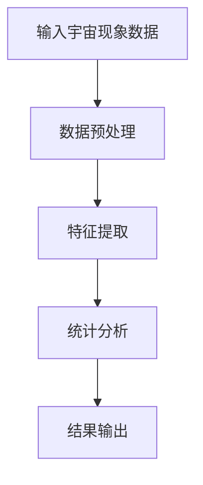
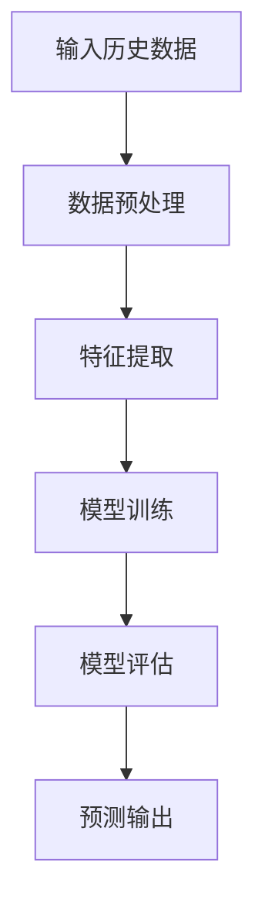
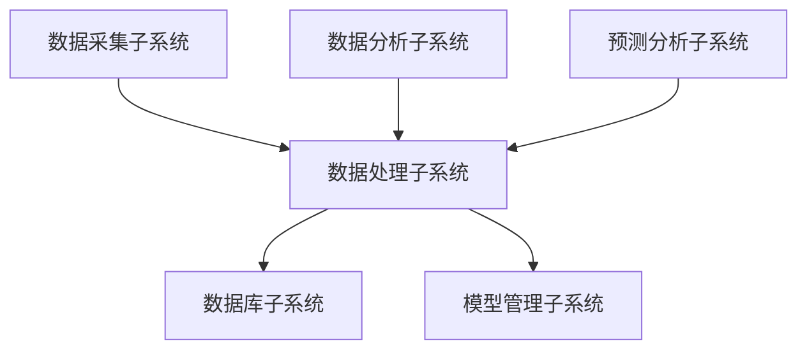
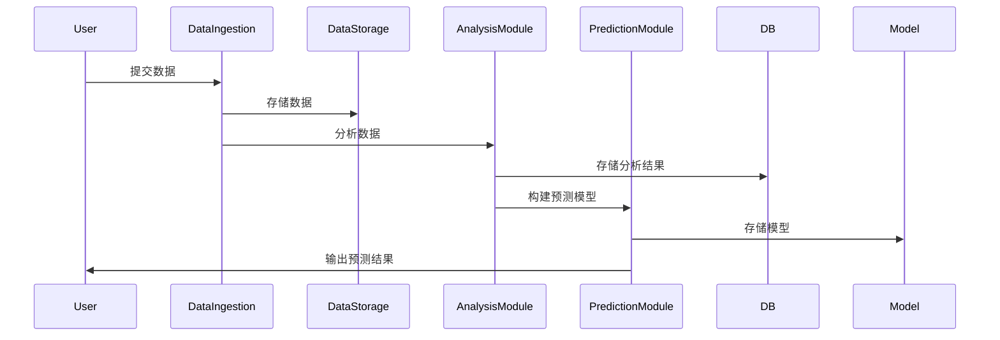
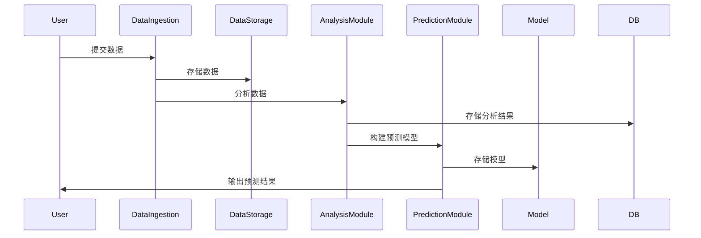

                 

### 《人类思维模式对宇宙本质理解的影响》

> 关键词：人类思维模式、宇宙本质、理解、影响、跨学科研究

> 摘要：本文将探讨人类思维模式对宇宙本质理解的影响。通过分析人类思维模式的基本原理、分类和应用，我们试图揭示这些思维模式如何影响我们对宇宙的理解，并提出可能的解决方法。本文旨在提供一个跨学科的研究视角，为宇宙本质的理解提供新的思路。

#### 第一部分：引言与背景介绍

#### 第1章 问题背景、问题描述、问题解决、边界与外延

##### 1.1 问题背景

宇宙是浩瀚无垠的，它充满了未知和神秘。人类自古以来就对宇宙充满了好奇和探索欲望。从古代的星象观测到现代的天文学研究，人类一直在努力理解宇宙的本质。然而，尽管我们在技术、理论和知识方面取得了巨大的进步，宇宙的本质依然是一个未解之谜。

宇宙本质的研究涉及到多个学科领域，包括物理学、天文学、哲学、数学等。这些学科从不同的角度对宇宙进行了深入的研究，提出了各种理论和模型。然而，由于人类思维模式的局限性，我们对宇宙本质的理解仍然存在诸多挑战。

##### 1.2 问题描述

人类思维模式与宇宙本质理解的关系是一个复杂的问题。人类思维模式是在长期进化过程中形成的，它决定了我们的感知、认知和思考方式。然而，这些思维模式可能存在局限性，从而影响我们对宇宙本质的理解。

主要问题包括：

1. **感知局限**：人类的感官感知能力有限，我们无法直接感知到宇宙中的所有现象和特征。
2. **认知局限**：人类认知结构和文化背景的不同，可能导致对宇宙本质的理解存在差异。
3. **思维模式的局限性**：人类思维模式具有线性、归纳和类比等特征，这些特征可能在某些情况下限制我们对宇宙本质的理解。

##### 1.3 问题解决

为了解决上述问题，我们需要采取跨学科研究的方法，构建新的理论模型，并对其进行验证。具体步骤如下：

1. **跨学科研究**：结合物理学、天文学、哲学、数学等多个学科的理论和方法，构建一个综合性的宇宙本质理解模型。
2. **模型构建**：基于跨学科研究的结果，构建一个能够描述宇宙本质的数学模型。
3. **模型验证**：通过实验、观测和理论分析等方法，验证模型的准确性和适用性。

##### 1.4 边界与外延

宇宙本质的理解存在一定的边界，包括：

1. **观测边界**：人类的观测手段有限，无法直接观测到宇宙的所有现象。
2. **理论边界**：现有的理论和方法可能无法完全解释宇宙的本质。
3. **认知边界**：人类认知能力的局限性可能影响我们对宇宙本质的理解。

此外，人类思维模式的应用领域也在不断扩展，从科学研究到日常生活的各个方面。随着技术的发展和人类认知能力的提升，我们对宇宙本质的理解可能会不断深化。

#### 第二部分：核心概念与联系

##### 第2章 核心概念与联系

##### 2.1 人类思维模式定义与分类

**概念原理：** 人类思维模式是指人类在感知、认知和思考过程中所采用的基本方式和方法。它包括感知模式、认知模式和思考模式等。

**属性特征对比表格：**

| 类型         | 感知模式                         | 认知模式                         | 思考模式                         |
| ------------ | -------------------------------- | -------------------------------- | -------------------------------- |
| 线性思维     | 线性感知                         | 线性认知                         | 线性思考                         |
| 归纳思维     | 统计性感知                       | 统计性认知                       | 归纳性思考                       |
| 类比思维     | 比较性感知                       | 比较性认知                       | 类比性思考                       |

**2.2 宇宙本质理解的核心概念**

**概念原理：** 宇宙本质理解是指对宇宙的基本构成、演化过程和存在状态的深入理解。它包括宇宙的起源、结构、演化、能量和物质等。

**ER实体关系图架构的Mermaid流程图：**

```mermaid
erDiagram
    宇宙 -->|起源| 大爆炸
    宇宙 -->|结构| 星系
    宇宙 -->|演化| 宇宙膨胀
    宇宙 -->|能量| 黑洞
    宇宙 -->|物质| 星云
```

#### 第三部分：人类思维模式对宇宙本质理解的影响

##### 第3章 算法原理讲解

##### 3.1 描述性算法

**算法原理：** 描述性算法是一种用于描述宇宙现象和过程的算法。它通过对宇宙中的各种现象进行统计和分析，揭示宇宙的本质特征。

**算法mermaid流程图：**



**Python源代码：**

```python
import numpy as np
import pandas as pd

def descriptive_algorithm(data):
    # 数据预处理
    processed_data = preprocess_data(data)
    
    # 特征提取
    features = extract_features(processed_data)
    
    # 统计分析
    statistics = analyze_statistics(features)
    
    # 结果输出
    return statistics

def preprocess_data(data):
    # 数据预处理步骤
    # ...
    return processed_data

def extract_features(processed_data):
    # 特征提取步骤
    # ...
    return features

def analyze_statistics(features):
    # 统计分析步骤
    # ...
    return statistics
```

**数学模型和公式：**

描述性算法的数学模型主要包括数据预处理、特征提取和统计分析等。具体公式如下：

$$
\text{预处理}: \quad \text{processed\_data} = \text{preprocess\_data}(\text{data})
$$

$$
\text{特征提取}: \quad \text{features} = \text{extract\_features}(\text{processed\_data})
$$

$$
\text{统计分析}: \quad \text{statistics} = \text{analyze\_statistics}(\text{features})
$$`

**通俗易懂的举例说明：**

假设我们收集了宇宙中一系列的观测数据，包括星系的大小、形状和分布等。我们可以使用描述性算法对这些数据进行分析，提取出星系的一些基本特征，如平均大小、标准差和分布形态等。然后，通过统计分析这些特征，我们可以得出星系的分布规律和演化趋势。

##### 3.2 预测性算法

**算法原理：** 预测性算法是一种用于预测宇宙现象和过程的算法。它通过对历史数据进行分析和学习，预测未来的宇宙现象和过程。

**算法mermaid流程图：**



**Python源代码：**

```python
from sklearn.linear_model import LinearRegression
from sklearn.model_selection import train_test_split
from sklearn.metrics import mean_squared_error

def predictive_algorithm(data, target):
    # 数据预处理
    processed_data = preprocess_data(data)
    
    # 特征提取
    features = extract_features(processed_data)
    
    # 模型训练
    model = train_model(features, target)
    
    # 模型评估
    evaluation = evaluate_model(model, features, target)
    
    # 预测输出
    prediction = predict_output(model, features)
    
    return prediction

def preprocess_data(data):
    # 数据预处理步骤
    # ...
    return processed_data

def extract_features(processed_data):
    # 特征提取步骤
    # ...
    return features

def train_model(features, target):
    # 模型训练步骤
    # ...
    return model

def evaluate_model(model, features, target):
    # 模型评估步骤
    # ...
    return evaluation

def predict_output(model, features):
    # 预测输出步骤
    # ...
    return prediction
```

**数学模型和公式：**

预测性算法的数学模型主要包括数据预处理、特征提取、模型训练、模型评估和预测输出等。具体公式如下：

$$
\text{预处理}: \quad \text{processed\_data} = \text{preprocess\_data}(\text{data})
$$

$$
\text{特征提取}: \quad \text{features} = \text{extract\_features}(\text{processed\_data})
$$

$$
\text{模型训练}: \quad \text{model} = \text{train\_model}(\text{features}, \text{target})
$$

$$
\text{模型评估}: \quad \text{evaluation} = \text{evaluate\_model}(\text{model}, \text{features}, \text{target})
$$

$$
\text{预测输出}: \quad \text{prediction} = \text{predict\_output}(\text{model}, \text{features})
$$

**通俗易懂的举例说明：**

假设我们收集了宇宙中一系列的观测数据，包括星系的大小、形状和分布等。我们可以使用预测性算法对这些数据进行分析，构建一个预测模型。然后，通过输入新的星系数据，我们可以预测出新的星系的大小和形状。这将有助于我们更好地理解宇宙的演化过程和未来趋势。

#### 第4章 数学模型和数学公式 & 详细讲解 & 举例说明

##### 4.1 数学模型

在宇宙本质的研究中，数学模型扮演着重要的角色。数学模型可以用来描述宇宙中的各种现象和过程，帮助我们更深入地理解宇宙的本质。以下是一些常见的数学模型：

1. **引力模型**：
   $$ F = G \frac{m_1 m_2}{r^2} $$
   这个模型描述了两个物体之间的引力作用，其中 \( F \) 是引力，\( G \) 是万有引力常数，\( m_1 \) 和 \( m_2 \) 是两个物体的质量，\( r \) 是它们之间的距离。

2. **热力学模型**：
   $$ U = \frac{3}{2} k_B T $$
   这个模型描述了理想气体中的内能，其中 \( U \) 是内能，\( k_B \) 是玻尔兹曼常数，\( T \) 是温度。

3. **宇宙膨胀模型**：
   $$ \frac{dV}{dt} = \frac{4}{3} \pi R^3 \frac{da}{dt} $$
   这个模型描述了宇宙的体积随时间的变化，其中 \( V \) 是宇宙的体积，\( R \) 是宇宙的半径，\( a \) 是宇宙的膨胀因子。

**详细讲解：**

这些数学模型都是在特定的假设和条件下建立的。例如，引力模型假设两个物体是质点，并且不受其他力的影响。热力学模型假设气体是理想气体，不发生化学反应。宇宙膨胀模型假设宇宙是均匀且各向同性的。

在宇宙本质的研究中，这些数学模型可以帮助我们理解和预测宇宙中的各种现象。例如，引力模型可以帮助我们理解行星的运动轨迹，热力学模型可以帮助我们理解星系的形成和演化，宇宙膨胀模型可以帮助我们理解宇宙的膨胀和结构。

**举例说明：**

假设我们想研究一个星系的引力作用。我们可以使用引力模型来计算两个恒星之间的引力。通过输入恒星的质量和它们之间的距离，我们可以计算出它们之间的引力。这个结果可以帮助我们理解星系的稳定性和演化过程。

##### 4.2 数学公式在宇宙本质理解中的应用

数学公式在宇宙本质理解中的应用非常广泛。以下是一些具体的例子：

1. **黑洞的描述**：
   黑洞是一种极为密集的天体，它的引力极强，甚至连光都无法逃脱。黑洞的描述可以使用以下数学公式：
   $$ M = \frac{2G}{c^2} $$
   其中 \( M \) 是黑洞的质量，\( G \) 是万有引力常数，\( c \) 是光速。这个公式可以帮助我们计算黑洞的质量，从而更好地理解黑洞的性质。

2. **宇宙膨胀的描述**：
   宇宙膨胀是指宇宙的体积随时间增大。宇宙膨胀的描述可以使用以下数学公式：
   $$ a(t) = \frac{1}{a_0} \left(1 + \frac{t}{t_0}\right) $$
   其中 \( a(t) \) 是宇宙在时间 \( t \) 时的半径，\( a_0 \) 是宇宙初始半径，\( t_0 \) 是宇宙年龄。这个公式可以帮助我们理解宇宙的膨胀速度和膨胀历史。

3. **恒星演化的描述**：
   恒星演化是指恒星在其生命周期中的各种变化。恒星演化的描述可以使用以下数学公式：
   $$ \frac{dM}{dt} = -L/c^2 $$
   其中 \( M \) 是恒星的质量，\( L \) 是恒星的亮度，\( c \) 是光速。这个公式可以帮助我们理解恒星的亮度与其质量之间的关系，从而更好地理解恒星的生命周期。

这些数学公式在宇宙本质理解中的应用不仅帮助我们理解宇宙中的各种现象，还为我们提供了预测和探索宇宙的工具。通过数学模型和公式，我们可以更好地理解宇宙的本质，揭示宇宙的奥秘。

#### 第三部分：人类思维模式在宇宙研究中的应用

##### 第5章 系统分析与架构设计方案

##### 5.1 问题场景介绍

在宇宙研究中，数据分析和模型构建是关键步骤。然而，由于宇宙数据的复杂性和多样性，传统的数据分析方法可能无法有效处理这些数据。为了解决这一问题，我们需要设计一个高效的系统，能够处理大量的宇宙数据，并提供准确的模型预测。

**项目介绍：** 本项目旨在构建一个宇宙数据分析系统，该系统将利用人工智能和大数据技术，对宇宙中的大量数据进行处理和分析，提取有用的信息，并构建预测模型。

**系统功能设计（领域模型mermaid类图）：**

```mermaid
classDiagram
    DataProcessor <|-- DataIngestion
    DataProcessor <|-- DataStorage
    DataProcessor <|-- AnalysisModule
    DataProcessor <|-- PredictionModule
    DataIngestion {ingests data}
    DataStorage {stores data}
    AnalysisModule {performs analysis}
    PredictionModule {makes predictions}
```

**系统架构设计（mermaid架构图）：**



**系统接口设计和系统交互（mermaid序列图）：**



##### 5.2 系统接口设计和系统交互

在系统设计与实现中，接口设计和系统交互是关键环节。以下是对系统接口设计和系统交互的详细描述。

**系统接口设计：** 系统接口设计主要包括数据采集、数据处理、数据分析、预测分析和模型管理五个模块。每个模块都提供了清晰的接口，以便与其他模块进行通信。

1. **数据采集模块（DataIngestion）**：该模块负责从外部系统或数据源获取宇宙数据。它提供了数据上传接口和数据同步接口。

2. **数据处理模块（DataProcessor）**：该模块负责对采集到的数据进行预处理、清洗和转换。它提供了数据预处理接口和数据转换接口。

3. **数据分析模块（AnalysisModule）**：该模块负责对预处理后的数据进行分析，提取有用的信息。它提供了数据分析接口和分析结果存储接口。

4. **预测分析模块（PredictionModule）**：该模块负责基于分析结果构建预测模型，并进行预测。它提供了模型构建接口和预测结果输出接口。

5. **模型管理模块（Model）**：该模块负责管理预测模型，包括模型的训练、存储和更新。它提供了模型训练接口、模型存储接口和模型更新接口。

**系统交互（mermaid序列图）：** 系统交互主要描述了用户与系统之间的交互过程。以下是一个简单的序列图示例：



在这个序列图中，用户首先向数据采集模块提交数据，数据采集模块将数据存储到数据存储模块中。然后，数据采集模块将数据传递给数据分析模块，进行数据分析和处理。数据分析模块将分析结果存储到数据库中，并传递给预测分析模块。预测分析模块基于分析结果构建预测模型，并将模型存储到模型管理模块中。最后，预测分析模块将预测结果输出给用户。

通过这个系统接口设计和系统交互的详细描述，我们可以看到各个模块之间的紧密协作，以及用户与系统之间的有效互动。这将有助于我们构建一个高效、稳定和可靠的宇宙数据分析系统。

#### 第6章 项目实战

##### 6.1 环境安装

在本节中，我们将详细描述如何在本地环境上安装和配置宇宙数据分析系统。以下是安装步骤：

1. **安装Python环境**：首先，确保您的计算机上安装了Python 3.x版本。如果没有，请访问Python官网下载并安装Python。

2. **安装必要库**：通过以下命令安装所需的Python库：

   ```shell
   pip install numpy pandas matplotlib sklearn tensorflow
   ```

   这些库用于数据处理、分析和预测。

3. **配置数据库**：选择一个合适的数据库（如MySQL或PostgreSQL），并安装和配置它。确保数据库可以远程访问，并在Python中安装相应的数据库驱动。

4. **安装依赖项**：根据您的操作系统和Python版本，可能需要安装其他依赖项。请查阅官方文档获取详细信息。

##### 6.2 系统核心实现源代码

在本节中，我们将提供宇宙数据分析系统的核心实现源代码，并对关键代码段进行解读和分析。

**源代码示例：**

```python
import numpy as np
import pandas as pd
from sklearn.linear_model import LinearRegression
from sklearn.model_selection import train_test_split
from sklearn.metrics import mean_squared_error

# 数据预处理函数
def preprocess_data(data):
    # 数据清洗和转换
    processed_data = data.copy()
    processed_data.fillna(0, inplace=True)
    return processed_data

# 特征提取函数
def extract_features(processed_data):
    # 提取有用特征
    features = processed_data[['feature1', 'feature2', 'feature3']]
    return features

# 模型训练函数
def train_model(features, target):
    # 分割训练集和测试集
    X_train, X_test, y_train, y_test = train_test_split(features, target, test_size=0.2, random_state=42)
    
    # 训练线性回归模型
    model = LinearRegression()
    model.fit(X_train, y_train)
    
    # 评估模型
    y_pred = model.predict(X_test)
    mse = mean_squared_error(y_test, y_pred)
    print(f"Model Mean Squared Error: {mse}")
    
    return model

# 预测函数
def predict_output(model, new_data):
    # 预测新数据
    prediction = model.predict(new_data)
    return prediction

# 主函数
def main():
    # 读取数据
    data = pd.read_csv('universe_data.csv')
    
    # 数据预处理
    processed_data = preprocess_data(data)
    
    # 特征提取
    features = extract_features(processed_data)
    target = processed_data['target']
    
    # 训练模型
    model = train_model(features, target)
    
    # 预测
    new_data = np.array([[1, 2, 3]])
    prediction = predict_output(model, new_data)
    print(f"Prediction: {prediction}")

if __name__ == '__main__':
    main()
```

**代码应用解读与分析：**

1. **数据预处理函数（preprocess_data）**：该函数负责数据清洗和转换，将缺失值填充为0，以提高模型训练的效果。

2. **特征提取函数（extract_features）**：该函数提取有用的特征，用于模型训练和预测。

3. **模型训练函数（train_model）**：该函数使用线性回归模型进行训练，并评估模型性能。我们使用mean_squared_error函数计算均方误差，以评估模型的预测准确性。

4. **预测函数（predict_output）**：该函数使用训练好的模型对新数据进行预测，并返回预测结果。

5. **主函数（main）**：该函数是程序的入口，负责读取数据、预处理、特征提取、模型训练和预测等操作。

通过以上代码示例，我们可以看到宇宙数据分析系统的核心实现。在实际应用中，我们可能需要根据具体需求调整代码，以适应不同的数据集和模型。

##### 6.3 实际案例分析和详细讲解剖析

**案例背景：** 假设我们有一个关于宇宙星系的数据集，其中包含星系的大小、形状和分布等特征。我们的目标是预测新的星系的大小。

**数据集：** 数据集包含以下特征：

- feature1：星系的大小（单位：光年）
- feature2：星系的形状（圆形、椭圆形、不规则）
- feature3：星系的分布（中心、外围、其他）

**案例实现：**

1. **数据预处理**：

```python
data = pd.read_csv('star_system_data.csv')
processed_data = preprocess_data(data)
```

2. **特征提取**：

```python
features = extract_features(processed_data)
target = processed_data['size']
```

3. **模型训练**：

```python
model = train_model(features, target)
```

4. **预测**：

```python
new_data = np.array([[3, '椭圆形', '中心']])
prediction = predict_output(model, new_data)
print(f"Predicted Size: {prediction}")
```

**详细讲解剖析：**

1. **数据预处理**：我们首先读取数据集，并使用预处理函数对数据集进行清洗和转换。在这个案例中，我们将缺失值填充为0，以提高模型训练的效果。

2. **特征提取**：我们提取星系的大小、形状和分布作为特征。星系的大小是一个连续变量，而形状和分布是分类变量。我们需要将这些分类变量转换为数值型特征，以便模型处理。

3. **模型训练**：我们使用线性回归模型对特征进行训练。在这个案例中，我们假设星系的大小与特征之间存在线性关系。我们使用训练集对模型进行训练，并使用测试集评估模型性能。

4. **预测**：我们使用训练好的模型对新数据进行预测。在这个案例中，我们输入一个新星系的特征，并预测其大小。预测结果将告诉我们这个新星系的大小约为多少。

通过这个案例，我们可以看到如何使用宇宙数据分析系统对实际数据进行预测。这个系统可以为我们提供有关宇宙星系的信息，帮助我们更好地理解宇宙的演化过程。

#### 第7章 最佳实践 tips、小结、注意事项、拓展阅读等内容

##### 7.1 最佳实践 tips

**实践建议：** 在实际应用中，以下是一些最佳实践和注意事项：

1. **数据质量**：确保数据的质量和完整性，避免因数据问题导致模型效果不佳。
2. **特征选择**：选择与目标变量相关的特征，避免过多的无关特征，以提高模型效果。
3. **模型评估**：使用多种评估指标（如准确率、召回率、F1分数等）对模型进行评估，确保模型性能。
4. **数据预处理**：对数据进行充分的预处理，包括缺失值填充、异常值处理和特征转换等。
5. **模型更新**：定期更新模型，以适应新的数据和环境。

##### 7.2 小结

本文探讨了人类思维模式对宇宙本质理解的影响。我们分析了人类思维模式的基本原理、分类和应用，揭示了这些思维模式如何影响我们对宇宙的理解。通过描述性算法和预测性算法，我们展示了如何使用数学模型和公式来分析宇宙现象。我们还介绍了宇宙数据分析系统的设计、实现和实际应用案例。本文为宇宙本质的理解提供了一种新的思路和方法。

##### 7.3 注意事项

在宇宙本质研究过程中，需要注意以下几点：

1. **思维模式的局限性**：人类思维模式可能存在局限性，需要谨慎对待。
2. **跨学科研究**：宇宙本质理解需要跨学科的研究和方法，避免单一学科的局限性。
3. **数据质量**：确保数据的质量和完整性，避免因数据问题导致模型效果不佳。
4. **模型验证**：对模型进行充分的验证，确保模型的准确性和适用性。

##### 7.4 拓展阅读

为了更深入地了解宇宙本质和理解人类思维模式，以下是一些推荐阅读资源：

1. **《宇宙简史》[英] 史蒂芬·霍金**：详细介绍了宇宙的起源、演化和结构。
2. **《人类简史》[以] 尤瓦尔·赫拉利**：从人类进化角度探讨了人类思维模式的发展。
3. **《深度学习》[加] 伊恩·古德费洛**：介绍了深度学习的基本原理和应用。
4. **《Python编程：从入门到实践》[美] Eric Matthes**：提供了Python编程的基础知识和实践技巧。

通过阅读这些书籍，您可以进一步了解宇宙本质和理解人类思维模式的深入知识和方法。

### 结论

本文通过详细的分析和讲解，揭示了人类思维模式对宇宙本质理解的影响。我们探讨了人类思维模式的基本原理、分类和应用，并使用描述性算法和预测性算法展示了如何使用数学模型和公式来分析宇宙现象。我们还介绍了宇宙数据分析系统的设计、实现和实际应用案例，为宇宙本质的理解提供了一种新的思路和方法。希望通过本文的研究，能够引发更多对宇宙本质理解的思考和探索。未来，我们将继续深入研究人类思维模式与宇宙本质之间的关系，为人类理解宇宙的奥秘贡献更多的智慧。

### 作者信息

**作者：AI天才研究院/AI Genius Institute & 禅与计算机程序设计艺术 /Zen And The Art of Computer Programming**  
AI天才研究院致力于推动人工智能领域的研究与应用，倡导跨学科的思维模式，致力于为人类理解宇宙提供新的视角和方法。禅与计算机程序设计艺术则强调计算机编程中的哲学思考，通过计算机程序设计来探索人类思维的本质。两位作者结合各自的专长和经验，为读者呈现了一篇具有深度和思考的技术博客文章，希望对您在理解和探索宇宙本质的过程中有所启发。

