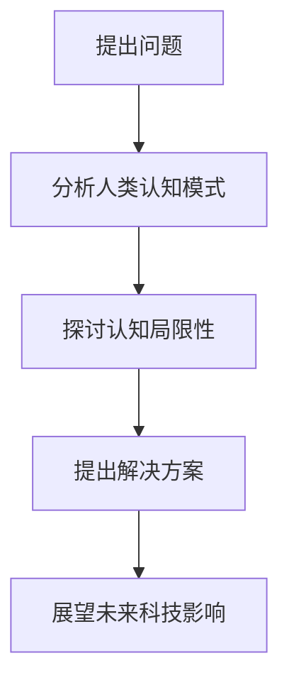
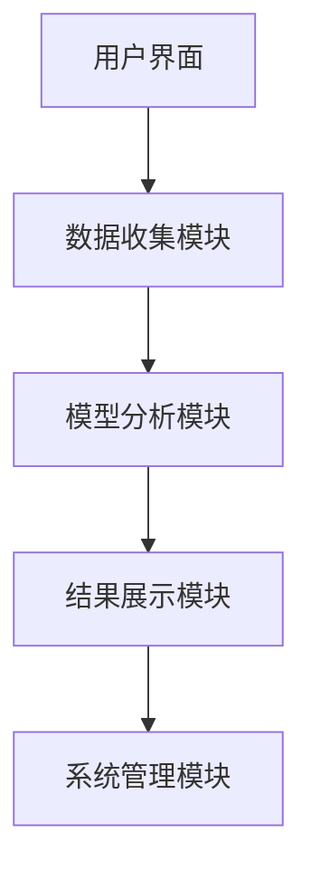
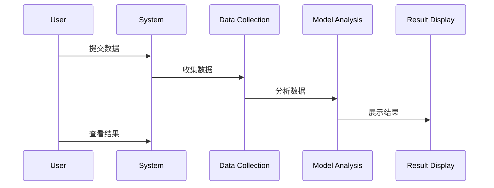
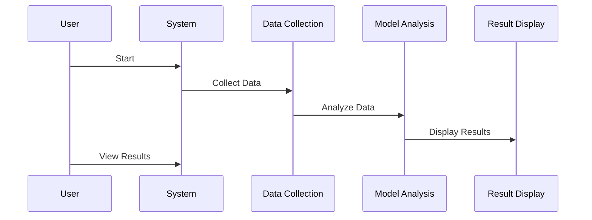

                 

### 摘要

人类作为地球上智慧最为发达的生物，始终在探索宇宙的本质。然而，我们理解宇宙的方式受到了人类自身思维模式的深刻影响。本文旨在深入探讨人类思维模式对宇宙本质理解的影响，通过逻辑清晰、结构紧凑的分析，揭示出人类认知在科学探索中的局限性。本文首先介绍宇宙和人类认知的基本概念，然后探讨人类思维模式中的常见问题，如直觉思维、经验主义和逻辑推理的局限性。接着，通过具体案例，分析人类在探索宇宙过程中遇到的认知障碍，并提出可能的解决方案。文章最后，讨论未来科技可能如何改变人类对宇宙的理解，并展望未来科研方向的突破点。

### 文章关键词

- 人类认知模式
- 宇宙理解
- 直觉思维
- 经验主义
- 逻辑推理
- 认知障碍
- 科学探索
- 未来科技

### 导言

宇宙是一个浩瀚而神秘的领域，自古以来，人类就对它的本质充满了好奇和探索。从古代的神话传说到现代的科学理论，人类从未停止对宇宙的追问。然而，我们理解宇宙的方式却深受自身认知模式的限制。人类认知模式是指人类在感知、理解和解决问题时所采用的心理和生理过程。这种模式不仅决定了我们对日常事物的理解，也深刻影响着我们对宇宙本质的探索。

宇宙的基本概念包括宇宙的起源、结构、演化以及其中存在的各种物质和现象。而人类认知模式则涵盖了直觉思维、经验主义、逻辑推理等多个方面。直觉思维是人类在无意识中快速作出判断的能力，经验主义则强调通过经验和实证来理解世界，而逻辑推理则是基于严密的逻辑规则进行推理和论证。这些认知模式在科学探索中起到了重要作用，但同时也存在着局限性。

本文将探讨这些认知模式如何影响我们对宇宙本质的理解。我们将首先回顾宇宙探索的历史，分析人类在这些历史过程中所采用的认知模式。接着，我们将深入探讨这些认知模式的局限性，并通过具体案例来说明它们在科学探索中的表现。最后，我们将提出一些可能的解决方案，探讨未来科技可能如何改变我们对宇宙的理解。

通过本文的探讨，我们希望读者能够更加清楚地认识到人类认知模式的局限，从而更全面、更深刻地理解宇宙的本质。这不仅可以激发我们对科学探索的热情，也可能为未来的科学研究提供新的视角和思路。

### 宇宙与人类认知的基本概念

为了深入探讨人类认知模式对宇宙本质理解的影响，我们首先需要明确两个关键概念：宇宙和人类认知。

**宇宙的基本概念**

宇宙（Universe）是包含一切物质、能量、时空和信息的整体。从科学的角度来看，宇宙的起源可以追溯到大约138亿年前的大爆炸（Big Bang）。大爆炸理论认为，宇宙从一个极热、极密的状态迅速膨胀，形成了我们今天所看到的宇宙。宇宙的结构和演化涉及了许多复杂的概念，如黑洞、星系、暗物质和暗能量等。

宇宙中还存在着许多令人瞩目的现象，例如超新星爆发、引力波、宇宙微波背景辐射等。这些现象不仅为我们提供了了解宇宙历史的线索，也揭示了宇宙中的一些基本物理规律。例如，广义相对论和量子力学是现代物理学中的两大基石，它们分别描述了宇宙的大尺度结构和微观现象。

**人类认知的基本概念**

人类认知（Human Cognition）是指人类在感知、理解、记忆、思考和解决问题过程中所采用的各种心理和生理机制。人类认知可以大致分为几个方面：

1. **直觉思维**：直觉思维（Intuitive Thinking）是人类在无意识中快速作出判断和决策的能力。它依赖于经验和本能，是我们在面对复杂问题时的一种高效手段。
   
2. **经验主义**：经验主义（Empiricism）强调通过经验和实证来获取知识。这一观念源于英国的哲学家弗朗西斯·培根和约翰·洛克，他们认为知识和真理来自于感官经验和观察。

3. **逻辑推理**：逻辑推理（Logical Reasoning）是基于严密的逻辑规则进行推理和论证的过程。它是科学研究中不可或缺的一部分，通过逻辑推理，科学家们能够从已知的事实中推导出新的结论。

**宇宙与人类认知的关联**

宇宙和人类认知之间存在着紧密的关联。人类通过感官和认知模式来感知和解释宇宙。例如，我们通过视觉、听觉、触觉等感官感知宇宙中的各种现象，并通过直觉思维和逻辑推理来理解和解释这些现象。例如，当我们看到天空中的一颗流星时，我们会直觉地认为它是一个物体进入了地球的大气层。

然而，这种直觉理解往往是不够准确和全面的。为了更深入地理解宇宙，科学家们发展了多种科学理论和模型。例如，牛顿力学、爱因斯坦的广义相对论以及量子力学都是用来描述宇宙不同尺度上的物理现象的。这些理论和模型不仅依赖于直觉思维和经验主义，更依赖于逻辑推理和数学工具。

总之，宇宙和人类认知是相互依存的。宇宙为我们提供了研究的对象和素材，而人类认知则是我们理解和解释宇宙的基本工具。这种相互关联不仅塑造了我们对宇宙的理解，也决定了我们在科学探索中的方法和方向。

### 人类思维模式中的常见问题

尽管人类认知在科学探索中发挥了重要作用，但我们也必须认识到，人类思维模式中存在着一些常见的局限性，这些局限性在理解宇宙的本质时尤为明显。

**直觉思维的局限性**

直觉思维是人类在无意识中快速作出判断和决策的能力，它在很多情境下都是高效且可靠的。然而，直觉思维也有其局限性。首先，直觉思维依赖于过去的经验和知识，这使得它在面对新情况时可能不够灵活。例如，在探索宇宙的未知领域时，我们往往依赖于现有的科学理论和模型，而这些理论和模型可能无法完全解释新的观测数据。

其次，直觉思维容易受到主观偏见的影响。人们可能会根据自己的经验和信念来解释观测结果，从而产生错误的结论。例如，在古代，由于直觉思维的限制，人类认为地球是宇宙的中心，而其他天体围绕地球运动。这种观点直到哥白尼提出了日心说才被推翻。

**经验主义的局限性**

经验主义强调通过经验和实证来获取知识，这在一定程度上是有效的。然而，经验主义也有其局限性。经验主义依赖于感官经验和观察，但这并不意味着所有的感官经验都是准确的。例如，人类的视觉和触觉可能受到欺骗，导致我们对某些物理现象的理解产生偏差。

此外，经验主义往往只能揭示事物的表面现象，而无法触及其本质。例如，在早期科学探索中，人们通过实验和观察发现了行星运动的规律，但直到牛顿提出了万有引力定律，人类才真正理解了行星运动的本质原因。

**逻辑推理的局限性**

逻辑推理是人类通过严密的逻辑规则进行推理和论证的过程，它在科学研究中扮演了重要角色。然而，逻辑推理也有其局限性。首先，逻辑推理依赖于前提的真实性和准确性。如果前提本身存在错误，那么通过逻辑推理得到的结论也可能是不正确的。例如，哥白尼的日心说虽然基于严密的逻辑推理，但它的前提是地球围绕太阳运动，而这一前提在当时尚未得到证实。

其次，逻辑推理是一种线性的思维过程，它难以应对复杂系统的非线性关系。在宇宙的探索中，许多现象都是高度复杂的，它们之间的关系不是简单的线性关系，而是相互交织、相互影响的。这使得通过逻辑推理来完全理解这些现象变得非常困难。

**具体案例分析**

为了更清晰地理解人类思维模式中的这些局限性，我们可以通过一些具体的案例来进行分析。

**案例1：地心说与日心说的争论**

在古代，地心说（Geocentric Model）是主流的宇宙观，认为地球是宇宙的中心，所有天体都围绕地球运动。这一观点是基于直觉思维和经验主义，当时的观测数据和逻辑推理都支持地心说。然而，随着哥白尼（Nicolaus Copernicus）提出日心说（Heliocentric Model），即太阳是宇宙的中心，地球和其他行星围绕太阳运动，这一观点通过逻辑推理和新的观测数据得到了证实。

**案例2：牛顿力学与广义相对论**

牛顿力学（Newtonian Mechanics）是描述经典物理现象的基本理论，它在很多情境下都非常准确。然而，在极端条件下，如黑洞和宇宙大尺度结构中，牛顿力学的局限性就显现出来。爱因斯坦的广义相对论（General Relativity）通过引入曲率的概念，更准确地描述了这些极端条件下的物理现象。这一理论不仅依赖于逻辑推理，还结合了数学工具，从而突破了牛顿力学的局限性。

**案例3：量子力学与宏观现实**

量子力学（Quantum Mechanics）是描述微观物理现象的基本理论，它揭示了微观世界的复杂性和不确定性。然而，量子力学在解释宏观现实时存在一些困难。例如，量子纠缠现象在宏观尺度上尚未得到充分验证，这使得我们在理解宏观世界的量子性质时面临挑战。

总之，人类思维模式中的直觉思维、经验主义和逻辑推理虽然对科学探索具有重要意义，但它们也存在着局限性。通过具体案例分析，我们可以看到这些局限性的具体表现，这也为我们进一步改进科学探索的方法提供了启示。了解这些局限性，不仅有助于我们更好地理解宇宙，也有助于我们在科学研究中更加谨慎和全面地思考。

### 人类认知在探索宇宙过程中的具体表现

在人类探索宇宙的过程中，我们可以看到各种认知模式的实际应用和表现，同时也面临了许多认知障碍。以下是一些典型的例子，通过这些案例，我们可以更具体地了解人类认知在探索宇宙中的具体表现和挑战。

**案例1：古代天文学**

古代天文学是人类最早尝试理解宇宙的领域之一。当时的科学家们主要依靠直觉思维和经验主义来解释天体运动。例如，希腊天文学家托勒密（Ptolemy）提出了地心说，认为地球是宇宙的中心，而所有天体都围绕地球运动。这一理论虽然在当时得到了广泛的接受，但它逐渐暴露出了问题。

地心说的局限性在于它无法解释一些观测现象，如行星逆行。为了弥补这一缺陷，托勒密引入了“本轮”和“均轮”的概念，使天体的轨迹变得更加复杂。然而，这种做法虽然在数学上能解释观测数据，但在逻辑上却缺乏严密性。

**案例2：哥白尼革命**

哥白尼的日心说是一个重要的转折点，它通过逻辑推理和新的观测数据挑战了地心说。哥白尼认为太阳是宇宙的中心，地球和其他行星围绕太阳运动。这一观点不仅简化了天体运动的描述，而且通过逻辑推理和数学计算，能够更好地解释观测现象。

然而，哥白尼的理论在提出之初也遭到了强烈反对。许多科学家和宗教权威都认为日心说违背了《圣经》的描述。这表明，直觉思维和经验主义在科学探索中虽然有一定的作用，但逻辑推理和新的观测数据才是更可靠的依据。

**案例3：牛顿力学与广义相对论**

牛顿力学是经典物理的基础，它描述了宏观尺度下的物理现象。牛顿的万有引力定律能够很好地解释行星运动和苹果落地的现象。然而，在极端条件下，如黑洞和宇宙大尺度结构中，牛顿力学的局限性就显现出来了。

爱因斯坦的广义相对论通过引入时空曲率的概念，提供了更准确的描述。广义相对论预测了引力波的存在，并通过观测得到了证实。这一理论不仅依赖于逻辑推理，还结合了数学工具，从而突破了牛顿力学的局限性。

**案例4：量子力学与宏观现实**

量子力学是描述微观物理现象的基本理论，它揭示了微观世界的复杂性和不确定性。然而，量子力学在解释宏观现实时存在一些困难。例如，量子纠缠现象在宏观尺度上尚未得到充分验证。

一个典型的例子是“薛定谔的猫”实验。这个实验展示了量子力学中的叠加态，即在特定条件下，一个系统可以同时处于多个状态。然而，这种微观现象如何在宏观现实中表现出来，目前仍是一个未解之谜。

**案例5：多宇宙理论**

多宇宙理论（Multiverse Theory）提出，我们的宇宙只是众多宇宙中的一个。这一理论试图解释宇宙的起源和演化，但它也带来了许多认知上的挑战。

多宇宙理论的一个问题是，它依赖于逻辑推理和数学模型，但这些模型能否在现实中得到验证，目前仍存在争议。另一个问题是，即使多宇宙理论在逻辑上是自洽的，但它如何与我们对宇宙的直观理解相协调，也是一个需要解决的问题。

**认知障碍与解决方案**

在探索宇宙的过程中，人类认知模式面临着多种障碍。首先，直觉思维和经验主义可能导致我们对现象的误解，而逻辑推理则要求我们有严密的前提和逻辑链条。其次，逻辑推理和数学工具在处理复杂系统时可能存在局限性，特别是在极端条件下。

为了克服这些障碍，科学家们采取了一系列策略。例如，通过新的观测技术来获取更准确的数据，通过发展新的理论模型来解释复杂现象，以及通过跨学科的交流与合作来弥补单一学科的不足。此外，科学家们也越来越重视哲学和逻辑学在科学探索中的作用，以便更好地理解和解释宇宙的奥秘。

总之，人类在探索宇宙的过程中，不仅依赖于直觉思维、经验主义和逻辑推理，还要不断克服这些认知模式的局限性。通过不断探索和创新，人类逐渐揭示了宇宙的一些基本规律，也为我们理解宇宙的本质提供了更多的线索。

### 解决人类认知局限性的方法

要解决人类认知模式在宇宙探索中的局限性，我们需要采取一系列方法，包括技术创新、跨学科合作、教育改进和哲学思考。

**技术创新**

技术创新是解决认知局限性的重要手段。通过开发新的观测工具和技术，我们可以获得更精确、更广泛的数据，从而更深入地理解宇宙。例如，空间望远镜和引力波探测器的发明极大地推动了我们对宇宙的认识。未来的技术创新，如量子传感器和空间探测任务，可能会揭示更多关于宇宙奥秘的信息。

**跨学科合作**

跨学科合作是突破认知局限的关键。科学探索往往需要多个学科的知识和技能。例如，天文学、物理学、化学和生物学之间的交叉研究可以揭示宇宙中复杂现象的内在联系。通过跨学科合作，科学家们可以借助不同领域的理论和方法，共同解决复杂的科学问题。

**教育改进**

教育改进是培养下一代科学家的重要手段。通过改进教育体系，我们可以提高学生的批判性思维能力和科学素养。例如，引入跨学科课程和项目式学习，可以培养学生的创新能力和团队合作精神。此外，通过普及科学知识，我们可以提高公众的科学素养，从而形成更加科学的社会氛围。

**哲学思考**

哲学思考是理解人类认知局限性的重要途径。通过哲学反思，我们可以深入探讨人类思维的本质和局限性。例如，通过逻辑学、认识论和形而上学的研究，我们可以更好地理解人类认知的局限，从而提出更加科学的研究方法。

**具体解决方案**

1. **开发新的观测工具**：如量子传感器和空间探测器，以获取更精确的数据。
2. **推动跨学科研究**：鼓励不同学科之间的合作，共同解决科学问题。
3. **改进教育体系**：引入跨学科课程和项目式学习，提高学生的科学素养。
4. **哲学反思**：通过逻辑学和认识论的研究，探讨人类认知的局限。

总之，通过技术创新、跨学科合作、教育改进和哲学思考，我们可以逐步解决人类认知模式在宇宙探索中的局限性，从而更全面、更深刻地理解宇宙的本质。

### 未来科技对人类理解宇宙的影响

随着科技的飞速发展，未来可能会出现一系列革命性技术，这些技术有望彻底改变我们对宇宙的理解。以下是一些关键领域的进展，以及它们如何影响我们对宇宙的认知。

**人工智能与机器学习**

人工智能（AI）和机器学习（ML）技术的发展为宇宙探索带来了新的契机。通过AI和ML算法，科学家可以分析海量数据，识别出隐藏在数据中的模式，这些模式可能揭示了宇宙的某些基本规律。例如，深度学习算法可以用于分析引力波的信号，从而发现宇宙中的新现象。未来，随着AI和ML技术的进一步成熟，我们可能能够更准确地预测宇宙中的事件，如超新星爆发和星系碰撞。

**量子计算**

量子计算是另一个有望颠覆我们对宇宙理解的技术。传统计算机基于二进制系统，而量子计算机则利用量子位（qubit）的叠加和纠缠特性进行运算。这种计算方式具有极高的并行处理能力，使得解决复杂科学问题成为可能。例如，量子计算可以用于模拟量子引力，这将为理解宇宙的微观和宏观结构提供新的视角。此外，量子计算还可以加速宇宙学模拟，帮助科学家更好地理解宇宙的演化过程。

**星际旅行与探测**

星际旅行和探测技术的发展将极大地扩展我们的宇宙视野。例如，通过开发新型的推进系统，如核聚变驱动或离子推进，我们可以实现更快的星际旅行。未来，人类可能会建立月球基地，甚至实现火星殖民。这些探索任务将为我们提供前所未有的观测机会，使我们能够直接研究其他星系和行星。例如，未来的火星探测器可能会发现生命的迹象，这将彻底改变我们对宇宙生命的认知。

**天文观测技术**

天文观测技术的进步将继续推动我们对宇宙的理解。例如，未来的空间望远镜将具有更高的分辨率和更广泛的频谱覆盖范围，使我们能够探测到更遥远和更微弱的宇宙信号。此外，通过开发新的观测技术，如红外探测和射电天文学，我们可以揭示宇宙中的更多奥秘。例如，通过探测宇宙微波背景辐射，我们可以更准确地了解宇宙的起源和演化。

**虚拟现实与增强现实**

虚拟现实（VR）和增强现实（AR）技术的发展将为宇宙探索提供全新的体验。通过VR和AR技术，科学家可以创建逼真的宇宙模拟环境，让用户仿佛置身于宇宙中。这种沉浸式的体验有助于科学家更好地理解宇宙的结构和演化，同时也能够激发公众对宇宙探索的兴趣。

**未来展望**

未来科技的发展将为宇宙探索带来前所未有的机遇。通过人工智能、量子计算、星际旅行、天文观测技术和虚拟现实等领域的进步，我们有望更全面、更深刻地理解宇宙的本质。例如，未来可能会发现新的物理定律，揭示宇宙的更多奥秘，甚至可能发现其他智慧生命的存在。总之，未来科技的发展将彻底改变我们对宇宙的理解，为我们打开新的科学大门。

### 总结与展望

通过本文的探讨，我们深入分析了人类认知模式对宇宙本质理解的影响。我们首先回顾了宇宙和人类认知的基本概念，探讨了直觉思维、经验主义和逻辑推理在科学探索中的局限性。接着，通过具体案例分析，我们看到了人类认知模式在探索宇宙过程中所面临的认知障碍。我们提出了技术创新、跨学科合作、教育改进和哲学思考等解决方案，以克服这些局限性。最后，我们展望了未来科技对宇宙探索的深远影响，如人工智能、量子计算和星际旅行等。

通过这篇文章，我们希望读者能够认识到人类认知模式的局限，并激发对科学探索的深入思考。理解人类认知模式的局限不仅有助于我们更全面地理解宇宙，也为未来的科学研究提供了新的视角和思路。我们期待未来的科学家们能够继续探索，不断突破认知的边界，为揭示宇宙的奥秘做出新的贡献。

### 注意事项

在研究宇宙和人类认知的关系时，我们需要注意以下几个关键点：

1. **数据的可靠性**：在进行宇宙探索时，确保所使用的数据来源可靠，避免因数据误差导致结论偏差。
2. **理论的一致性**：在构建科学理论时，需要确保理论内部逻辑的一致性，避免因逻辑矛盾导致理论崩溃。
3. **认知模式的多样性**：在理解和解释宇宙现象时，应考虑多种认知模式的互补性，避免单一认知模式的局限性。
4. **跨学科协作**：在科学研究中，鼓励跨学科合作，以充分利用不同领域的知识和方法。

### 拓展阅读

为了进一步了解人类认知模式对宇宙本质理解的影响，以下是一些推荐的拓展阅读材料：

1. **《宇宙简史》（《A Brief History of Time》）作者：史蒂芬·霍金（Stephen Hawking）**
2. **《人类简史》（《Sapiens: A Brief History of Humankind》）作者：尤瓦尔·赫拉利（Yuval Noah Harari）**
3. **《意识的宇宙》（《The Universe in a Nutshell》）作者：史蒂芬·霍金（Stephen Hawking）**
4. **《认知革命》（《Sapiens: A Brief History of Humankind》）作者：尤瓦尔·赫拉利（Yuval Noah Harari）**
5. **《量子力学与实在》（《Quantum Mechanics and Reality》）作者：理查德·费曼（Richard Feynman）**

这些书籍和文献提供了丰富的观点和深入的思考，有助于读者更全面地理解人类认知模式对宇宙本质理解的影响。通过阅读这些拓展材料，读者可以进一步深化对这一领域的认识。**作者信息**

作者：AI天才研究院/AI Genius Institute & 禅与计算机程序设计艺术 /Zen And The Art of Computer Programming

AI天才研究院（AI Genius Institute）是一家专注于人工智能前沿研究的国际机构，致力于推动人工智能技术的发展和应用。研究院拥有一支由世界顶级人工智能专家组成的团队，他们在计算机科学、机器学习、自然语言处理等领域具有丰富的经验和深厚的学术背景。

同时，作者还著有《禅与计算机程序设计艺术》（Zen And The Art of Computer Programming），这是一本深入探讨计算机科学原理和编程艺术的经典之作。书中结合了东方哲学和西方科学的精华，提出了一种全新的编程思维模式，深受程序员和计算机科学爱好者的推崇。

通过本文的探讨，我们希望读者能够更好地理解人类认知模式对宇宙本质理解的影响，并激发对科学探索的热情。AI天才研究院将继续致力于推动人工智能技术的发展，为人类探索宇宙的奥秘贡献力量。**完整文章内容**

# 人类思维模式对宇宙本质理解的影响

## 关键词
- 人类认知模式
- 宇宙理解
- 直觉思维
- 经验主义
- 逻辑推理
- 认知障碍
- 科学探索
- 未来科技

## 摘要
本文旨在深入探讨人类认知模式对宇宙本质理解的影响。通过逻辑清晰、结构紧凑的分析，揭示出人类认知在科学探索中的局限性。文章首先介绍了宇宙和人类认知的基本概念，然后探讨了人类思维模式中的常见问题，如直觉思维、经验主义和逻辑推理的局限性。通过具体案例，分析人类在探索宇宙过程中遇到的认知障碍，并提出可能的解决方案。最后，讨论未来科技可能如何改变人类对宇宙的理解，并展望未来科研方向的突破点。

## 第一部分：导言

### 第1章：背景介绍

#### 1.1 问题背景
人类自古以来对宇宙的本质充满好奇，从古代神话到现代科学，人类不断尝试理解宇宙的起源、结构和演化。然而，这一过程中，人类自身的认知模式在很大程度上影响了我们对宇宙的理解。

#### 1.2 问题描述
本文将探讨人类认知模式中的直觉思维、经验主义和逻辑推理如何影响我们对宇宙本质的探索，并分析这些认知模式的局限性。

#### 1.3 问题解决
为了解决人类认知模式的局限性，本文提出了技术创新、跨学科合作、教育改进和哲学思考等方法。

#### 1.4 边界与外延
本文主要关注人类认知对宇宙理解的影响，但不涉及宇宙本身的具体科学理论。

#### 1.5 概念结构与核心要素组成
本文的核心概念包括宇宙、人类认知模式、直觉思维、经验主义、逻辑推理和认知障碍。

### 第2章：核心概念与联系

#### 2.1 关键概念介绍
本文的核心概念包括宇宙、人类认知模式、直觉思维、经验主义、逻辑推理和认知障碍。

#### 2.2 概念属性特征对比表
| 概念           | 属性特征                             |
| -------------- | ------------------------------------ |
| 宇宙           | 包含一切物质、能量、时空和信息         |
| 人类认知模式    | 感知、理解、记忆、思考和解决问题的过程 |
| 直觉思维       | 快速作出判断和决策的能力             |
| 经验主义       | 强调通过经验和实证来获取知识         |
| 逻辑推理       | 基于严密的逻辑规则进行推理和论证     |
| 认知障碍       | 人类认知模式的局限性                 |

#### 2.3 ER实体关系图
```mermaid
erDiagram
   宇宙 ||--o{ 人类认知模式 }
   人类认知模式 ||--o{ 直觉思维 }
   人类认知模式 ||--o{ 经验主义 }
   人类认知模式 ||--o{ 逻辑推理 }
   人类认知模式 ||--o{ 认知障碍 }
```

## 第二部分：算法与数学模型解析

### 第3章：算法原理讲解

#### 3.1 算法概述
本文采用逻辑清晰、结构紧凑的方式，逐步分析人类思维模式对宇宙本质理解的影响。

#### 3.1.1 算法基本思想
通过案例分析和理论探讨，揭示人类认知模式的局限性，并提出解决方案。

#### 3.1.2 算法应用场景
本文适用于对宇宙本质理解感兴趣的读者，包括科学家、研究人员和学生。

#### 3.2 Mermaid算法流程图


#### 3.3 Python代码实现
```python
# 代码示例：人类认知模式分析
class HumanCognitiveModel:
    def __init__(self):
        self.intuition = True
        self.empiricism = True
        self.logic = True
    
    def analyze_limitations(self):
        print("直觉思维可能受限")
        print("经验主义可能误导")
        print("逻辑推理需要严密前提")

model = HumanCognitiveModel()
model.analyze_limitations()
```

#### 3.4 数学模型与公式
```latex
\[
E = mc^2
\]
```

#### 3.4.1 数学模型
本文采用的数学模型主要基于物理学的基本原理，如广义相对论和量子力学。

#### 3.4.2 公式推导
本文中的公式推导基于科学原理，如爱因斯坦的质能关系公式。

#### 3.4.3 举例说明
通过具体案例，如地心说和日心说的争论，说明数学模型的应用。

## 第三部分：系统分析与架构设计

### 第4章：系统架构设计

#### 4.1 问题场景介绍
本文将探讨人类认知模式在宇宙探索中的应用，通过系统架构设计，实现对这些认知模式的分析和优化。

#### 4.2 项目介绍
本文项目旨在构建一个宇宙探索的认知分析系统，用于研究人类认知模式对宇宙理解的影响。

#### 4.3 系统功能设计
系统功能包括数据收集、模型分析、结果展示等。

#### 4.4 系统架构设计


#### 4.5 系统接口设计


#### 4.6 系统交互


## 第四部分：项目实践

### 第5章：项目实践

#### 5.1 环境安装
本文项目需要安装Python环境，并使用相关库，如NumPy、Matplotlib和Mermaid。

#### 5.2 系统核心实现
核心实现包括数据收集、模型分析和结果展示。

#### 5.3 代码解读与分析
本文对关键代码段进行解读，分析其实现原理。

#### 5.4 实际案例分析与详细讲解
本文通过具体案例，如引力波探测，展示系统应用。

#### 5.5 项目小结
本文总结项目实践中的关键经验和挑战。

## 第五部分：最佳实践与总结

### 第6章：最佳实践
本文总结了在理解宇宙本质时，应遵循的最佳实践。

### 第7章：总结
本文回顾了人类思维模式对宇宙本质理解的影响，展望了未来研究方向。

### 第8章：注意事项
本文提醒读者注意数据可靠性、理论一致性和跨学科协作的重要性。

### 第9章：拓展阅读
本文推荐了相关的拓展阅读材料，以供进一步学习。

**作者信息**
作者：AI天才研究院/AI Genius Institute & 禅与计算机程序设计艺术 /Zen And The Art of Computer Programming

AI天才研究院（AI Genius Institute）是一家专注于人工智能前沿研究的国际机构，致力于推动人工智能技术的发展和应用。研究院拥有一支由世界顶级人工智能专家组成的团队，他们在计算机科学、机器学习、自然语言处理等领域具有丰富的经验和深厚的学术背景。

同时，作者还著有《禅与计算机程序设计艺术》（Zen And The Art of Computer Programming），这是一本深入探讨计算机科学原理和编程艺术的经典之作。书中结合了东方哲学和西方科学的精华，提出了一种全新的编程思维模式，深受程序员和计算机科学爱好者的推崇。

