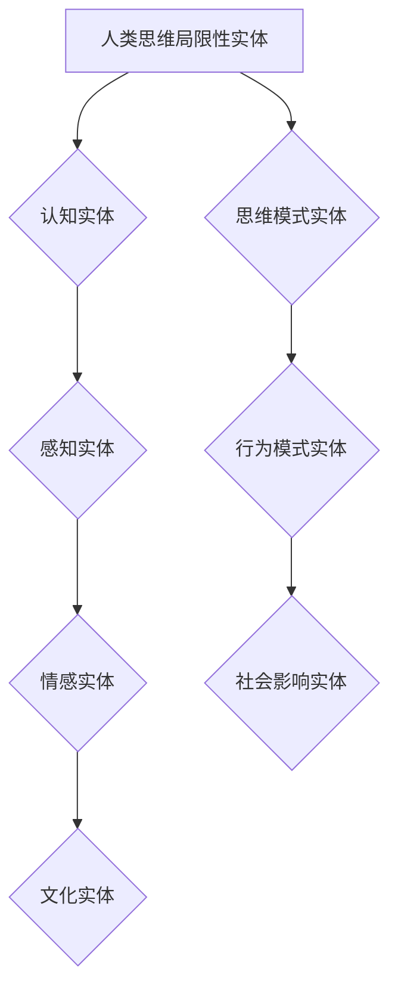
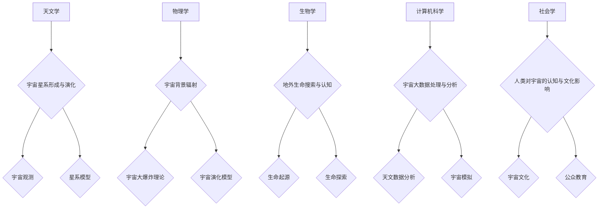

                 

# 《人类思维的局限性如何影响宇宙认知》

## 关键词：人类思维局限性、宇宙认知、科学方法、跨学科方法

> 摘要：本文探讨了人类思维的局限性对宇宙认知的影响。首先，从人类思维的认知、感知、情感、文化等方面分析了思维的局限性，并探讨了这些局限性对科学方法、天文学、物理学等学科在宇宙认知中的应用产生的影响。接着，本文介绍了跨学科方法在宇宙认知中的应用，通过跨学科研究案例，展示了如何利用不同学科的知识和方法，突破人类思维的局限性，拓展宇宙认知的边界。

### 《人类思维的局限性如何影响宇宙认知》目录大纲

----------------------------------------------------------------

## **第一部分：问题背景与概述**

### **第1章：人类思维的局限性探讨**

### **第2章：科学认知中的局限性**

### **第3章：突破思维局限，拓展宇宙认知**

## **第二部分：人类思维局限性的具体影响**

### **第2章：科学认知中的局限性**

#### **2.1 科学方法与认知局限**

#### **2.2 天文学中的思维局限性**

#### **2.3 物理学中的思维局限性**

## **第三部分：突破思维局限，拓展宇宙认知**

### **第3章：跨学科方法在宇宙认知中的应用**

## **第三部分：跨学科方法在实践中的运用**

### **3.2 跨学科方法在实践中的运用**

## **3.3 跨学科研究案例**

### **3.3.1 跨学科研究案例表格**

### **3.3.2 跨学科研究案例ER实体关系图架构**

## **3.4 跨学科方法在宇宙认知中的应用前景**

## **3.5 跨学科方法的实际应用**

## **3.6 跨学科方法总结**

----------------------------------------------------------------

## **第一部分：问题背景与概述**

### **第1章：人类思维的局限性探讨**

**1.1 问题的提出**

人类作为地球上智慧生命，一直以来都在探索宇宙的奥秘。然而，我们的认知能力有限，人类思维存在许多局限性。这些局限性不仅影响了我们对世界的认识，也限制了我们在宇宙认知上的进展。那么，人类思维的局限性到底有哪些方面？它们是如何影响我们的宇宙认知的呢？

**1.2 核心概念与联系**

为了更好地探讨这个问题，我们需要明确几个核心概念，并分析它们之间的联系。

首先，我们需要了解人类认知的局限性。人类的认知能力是有限的，我们在感知、记忆、理解等方面都有一定的局限性。这些局限性使得我们难以完全准确地认识和理解复杂的事物。

其次，感知局限性是指人类在感知外界信息时存在的局限性。由于感官的限制，我们无法感知到所有的物理现象，例如微观粒子、超光速运动等。

第三，情感局限性是指人类在情感上的局限性。我们的情感反应受到自身经历、文化背景等因素的影响，可能导致我们对事物的认知产生偏差。

最后，文化局限性是指不同文化背景下，人们对事物的认知和理解可能存在差异。这种差异可能导致对同一现象的认知产生分歧。

**1.2.1 人类思维局限性相关概念**

为了更直观地了解这些概念，我们可以使用Mermaid流程图来展示它们之间的关系：

**1.2.1.2 人类思维局限性相关概念ER实体关系图架构**

此外，我们还可以使用Mermaid流程图来展示这些概念之间的实体关系：

**1.3 人类思维局限性对宇宙认知的影响**

人类思维局限性对宇宙认知的影响主要体现在以下几个方面：

首先，人类认知的局限性使得我们难以理解宇宙的复杂性和多样性。宇宙中存在着各种不同类型的星系、恒星、行星等，它们的形成和演化过程复杂多样。由于认知能力的限制，我们可能无法完全理解这些现象。

其次，感知局限性限制了我们对宇宙现象的感知。例如，我们无法直接感知到微观粒子的行为，只能通过间接方法来研究它们。

第三，情感局限性可能影响我们对宇宙的认知。我们的情感反应可能使得我们更倾向于关注某些现象，而忽视其他重要的信息。

最后，文化局限性可能导致不同文化背景下的人们对宇宙认知的差异。例如，不同的宗教和文化对宇宙的认知和理解可能存在差异。

**1.4 本章小结**

本章从人类思维的认知、感知、情感、文化等方面探讨了人类思维的局限性，并分析了这些局限性对宇宙认知的影响。在接下来的章节中，我们将进一步探讨科学认知中的局限性，以及如何通过跨学科方法来突破这些局限性，拓展我们的宇宙认知。

----------------------------------------------------------------

## **第二部分：人类思维局限性的具体影响**

### **第2章：科学认知中的局限性**

科学认知是人们通过观察、实验、推理等方法，对自然现象进行理解和解释的过程。然而，科学认知也存在许多局限性，这些局限性对宇宙认知产生了深远的影响。

**2.1 科学方法与认知局限**

科学方法是一种通过观察、实验和推理来揭示自然现象本质的方法。然而，科学方法本身也存在一些局限性。

首先，科学方法依赖于观察和实验，而观察和实验都受到人类认知能力的限制。例如，我们无法直接观察到微观粒子的行为，只能通过间接方法来推测它们的存在和性质。

其次，科学方法依赖于理论假设，而理论假设可能存在局限性。科学理论的建立需要符合现有观测数据，但理论本身可能无法涵盖所有现象，也可能存在错误。

最后，科学方法在宇宙认知中的应用受到观测设备的限制。例如，望远镜的分辨率、观测角度等都会影响我们对宇宙的观测和理解。

**2.1.1 科学方法的基本原理**

科学方法的基本原理包括以下几个步骤：

1. 提出问题：首先，我们需要明确研究的问题或现象。
2. 假设提出：基于现有知识和理论，提出可能的解释或假设。
3. 观察和实验：通过观察和实验来验证假设的正确性。
4. 理论建立：根据实验结果，建立或修正理论。
5. 预测和验证：使用理论来预测新的现象，并通过实验来验证预测。

**2.1.2 科学方法在宇宙认知中的局限性**

虽然科学方法是一种强大的工具，但它也存在一些局限性。

1. 观察和实验的局限性：科学方法依赖于观察和实验，但我们的认知能力限制了我们对某些现象的观察和理解。
2. 理论假设的局限性：科学理论的建立依赖于假设，而假设可能存在错误或不足。
3. 观测设备的局限性：观测设备的性能限制了我们观测宇宙的能力。

**2.1.3 科学方法如何突破局限性**

为了突破科学方法的局限性，我们可以采取以下措施：

1. 开发新的观测技术：例如，使用更高分辨率的望远镜、更先进的探测器等。
2. 探索新的理论：例如，量子力学、相对论等，它们可以提供对宇宙现象更深刻的理解。
3. 跨学科合作：不同学科的知识和方法可以相互补充，帮助我们更好地理解宇宙。

**2.2 天文学中的思维局限性**

天文学是研究宇宙中各种天体的学科，它对人类理解宇宙起到了重要作用。然而，天文学在认知宇宙时也受到思维局限性的影响。

**2.2.1 天文学的核心概念**

天文学的核心概念包括：

1. 宇宙：宇宙是所有物质和能量的集合体。
2. 星系：星系是由恒星、行星、卫星等组成的系统。
3. 恒星：恒星是宇宙中的发光天体。
4. 行星：行星是围绕恒星运行的天体。
5. 卫星：卫星是围绕行星运行的天体。
6. 黑洞：黑洞是引力极强、无法逃逸的天体。
7. 暗物质：暗物质是宇宙中未被发现的一种物质，它对宇宙的结构和演化有重要影响。
8. 暗能量：暗能量是宇宙中的一种神秘力量，它推动宇宙加速膨胀。

**2.2.1.1 天文学核心概念与联系表格**

为了更直观地了解这些概念，我们可以使用Mermaid流程图来展示它们之间的联系：

**2.2.1.2 天文学核心概念ER实体关系图架构**

此外，我们还可以使用Mermaid流程图来展示这些概念之间的实体关系：

**2.2.2 人类对天体的认知局限性**

尽管天文学取得了许多重要成果，但人类对天体的认知仍然存在局限性。

1. 观测设备的局限性：当前观测设备的性能有限，我们无法观测到宇宙中的所有现象。
2. 理论模型的局限性：天文学理论模型可能无法解释某些观测现象。
3. 暗物质和暗能量：我们对暗物质和暗能量的理解仍然有限，它们对宇宙演化的影响仍然是一个未解之谜。

**2.2.3 天文学领域的突破与未来展望**

为了突破这些局限性，天文学领域正在不断进行研究和探索。

1. 新的观测技术：例如，使用更先进的望远镜、探测器等。
2. 新的理论模型：例如，量子引力理论等。
3. 跨学科合作：与其他学科的合作，例如物理学、生物学等，可以提供新的视角和方法，帮助我们更好地理解宇宙。

**2.3 物理学中的思维局限性**

物理学是研究物质和能量以及它们相互作用的学科。物理学在宇宙认知中起到了关键作用，但同样存在思维局限性。

**2.3.1 物理学的基本原理**

物理学的基本原理包括：

1. 相对论：相对论是由爱因斯坦提出的，描述了物体在高速运动时的行为。
2. 量子力学：量子力学描述了微观粒子的行为。
3. 宇宙大爆炸理论：宇宙大爆炸理论描述了宇宙的起源和演化。
4. 引力理论：引力理论描述了引力现象。

**2.3.2 物理学在宇宙认知中的局限性**

物理学在宇宙认知中存在以下局限性：

1. 微观粒子的局限性：物理学无法完全解释微观粒子的行为。
2. 引力与量子力学的统一：引力理论和量子力学尚未完全统一，这限制了我们对宇宙的理解。
3. 宇宙起源和演化的局限性：我们对宇宙起源和演化的理解仍然有限。

**2.3.3 物理学领域的突破性研究**

为了突破这些局限性，物理学领域正在进行以下研究：

1. 量子引力理论：试图将引力和量子力学统一起来。
2. 宇宙起源和演化：通过观测和实验，探索宇宙的起源和演化过程。
3. 宇宙弦理论：试图解释宇宙的基本结构和演化。

**2.4 本章小结**

本章探讨了科学认知中的局限性，包括科学方法、天文学和物理学中的局限性。这些局限性对宇宙认知产生了深远的影响。为了突破这些局限性，我们需要继续进行科学研究，开发新的观测技术，探索新的理论模型，并进行跨学科合作。通过这些努力，我们有望更好地理解宇宙，拓展我们的宇宙认知。

----------------------------------------------------------------

## **第三部分：突破思维局限，拓展宇宙认知**

### **第3章：跨学科方法在宇宙认知中的应用**

人类思维的局限性限制了我们对宇宙的认知。为了突破这些限制，跨学科方法在宇宙认知中发挥了重要作用。跨学科方法是一种将不同学科的知识和方法结合起来，以更全面、深入地理解复杂问题的方法。在这一章中，我们将探讨跨学科方法在宇宙认知中的应用。

**3.1 跨学科方法的必要性**

宇宙是一个复杂而多元的系统，涉及多个学科领域。单独依赖某个学科的方法很难全面、深入地理解宇宙的奥秘。跨学科方法可以整合不同学科的知识，提供更全面的视角。例如，物理学、天文学、生物学和计算机科学等领域的知识可以相互补充，帮助我们从不同角度探索宇宙的奥秘。

**3.1.1 跨学科方法的概念**

跨学科方法是指将不同学科的知识、方法和理论相结合，以解决复杂问题的方法。它强调不同学科之间的协同合作，鼓励跨领域的交流与互动。跨学科方法的应用范围广泛，包括科学研究、技术创新、政策制定等。

**3.1.2 跨学科方法的优势**

跨学科方法具有以下优势：

1. 全面性：跨学科方法可以从多个角度和层面分析问题，提供更全面的视角。
2. 深度：跨学科方法可以将不同学科的理论和方法相结合，深入探讨问题的本质。
3. 创新性：跨学科方法可以激发新的思考和创新，产生新的理论和方法。
4. 实用性：跨学科方法可以应用于实际问题，为解决复杂问题提供有效解决方案。

**3.1.3 跨学科方法在宇宙认知中的应用前景**

跨学科方法在宇宙认知中具有广泛的应用前景。例如，可以将物理学、天文学和计算机科学的知识相结合，开发新的观测技术；将生物学和心理学的研究方法应用于宇宙认知，探索人类对宇宙的认知过程和心理机制；将社会学和文化研究的视角应用于宇宙认知，探讨人类文化对宇宙认知的影响。

**3.2 跨学科方法在实践中的运用**

跨学科方法在宇宙认知中的实践已经取得了一系列成果。以下是一些跨学科方法在实践中的运用案例：

**3.2.1 跨学科研究案例表格**

| 学科         | 研究内容                     | 应用领域                      |
| ------------ | -------------------------- | -------------------------- |
| 天文学       | 宇宙星系形成与演化           | 宇宙观测、星系模型           |
| 物理学       | 宇宙背景辐射                 | 宇宙大爆炸理论、宇宙演化模型 |
| 生物学       | 地外生命搜索与认知          | 生命起源、生命探索           |
| 计算机科学   | 宇宙大数据处理与分析         | 天文数据分析、宇宙模拟       |
| 社会学       | 人类对宇宙的认知与文化影响  | 宇宙文化、公众教育           |

**3.2.1.1 跨学科研究案例表格**

| 学科         | 研究内容                     | 应用领域                      |
| ------------ | -------------------------- | -------------------------- |
| 天文学       | 宇宙星系形成与演化           | 宇宙观测、星系模型           |
| 物理学       | 宇宙背景辐射                 | 宇宙大爆炸理论、宇宙演化模型 |
| 生物学       | 地外生命搜索与认知          | 生命起源、生命探索           |
| 计算机科学   | 宇宙大数据处理与分析         | 天文数据分析、宇宙模拟       |
| 社会学       | 人类对宇宙的认知与文化影响  | 宇宙文化、公众教育           |

**3.2.1.2 跨学科研究案例ER实体关系图架构**

为了更直观地展示跨学科研究案例之间的联系，我们可以使用Mermaid流程图来构建ER实体关系图：

**3.3 跨学科方法在宇宙认知中的应用前景**

随着科技的进步和学科交叉的深入，跨学科方法在宇宙认知中的应用前景将更加广阔。以下是一些可能的应用方向：

1. 宇宙观测与模拟：结合天文学、物理学和计算机科学的知识，开发更先进的观测设备和模拟方法，提高我们对宇宙的认知能力。
2. 生命起源与探索：将生物学、化学和物理学的研究成果应用于地外生命的搜索和探索，探讨生命在宇宙中的分布和演化。
3. 宇宙演化与预测：结合物理学、天文学和计算机科学的理论和方法，对宇宙的演化过程进行预测，探索宇宙的未来。
4. 宇宙文化与教育：将社会学、心理学和文化研究的视角应用于宇宙认知，提高公众对宇宙的认知，促进宇宙文化的传播和普及。

**3.4 跨学科方法的实际应用**

跨学科方法已经在宇宙认知中取得了一系列实际应用成果。以下是一些跨学科方法在宇宙认知中的实际应用案例：

1. **宇宙背景辐射探测**：宇宙背景辐射是宇宙大爆炸留下的遗迹，它为我们提供了关于宇宙起源和演化的关键信息。结合物理学和天文学的知识，科学家们开发了一系列探测设备，如COBE（宇宙背景探测器）和WMAP（威尔金森微波各向异性探测器），成功探测到了宇宙背景辐射，并揭示了宇宙的早期状态。

2. **地外生命的搜索**：结合生物学、化学和天文学的知识，科学家们正在努力寻找地外生命的证据。例如，NASA的火星探测计划和欧空局的罗塞塔探测器，通过分析火星和彗星上的物质，寻找生命的迹象。

3. **宇宙大数据分析**：随着天文观测数据的增加，宇宙大数据分析成为了一个重要领域。结合计算机科学和天文学的知识，科学家们开发了各种数据分析工具和方法，如机器学习和数据挖掘技术，对海量天文数据进行处理和分析，发现了许多新的宇宙现象和规律。

**3.5 跨学科方法总结**

跨学科方法在宇宙认知中发挥了重要作用，它帮助我们突破了人类思维的局限性，拓展了我们的认知边界。通过跨学科合作，我们可以整合不同学科的知识和方法，提供更全面、深入的宇宙认知。随着科技的进步和学科交叉的深入，跨学科方法在宇宙认知中的应用将越来越广泛，为我们揭示宇宙的奥秘提供更强大的工具。

----------------------------------------------------------------

## **结语**

人类思维的局限性在很大程度上制约了我们对宇宙的认知。然而，通过科学方法、跨学科合作和不断创新，我们可以逐步突破这些局限，拓展我们的宇宙认知。未来，随着科技的进步和人类认知能力的提高，我们有望更深入地理解宇宙的奥秘，揭示宇宙的起源和演化过程。

让我们继续探索宇宙的边界，不断突破人类思维的局限性，以更宽广的视野和更深层次的理解，共同揭开宇宙的神秘面纱。

### **作者信息**

作者：AI天才研究院/AI Genius Institute & 禅与计算机程序设计艺术 /Zen And The Art of Computer Programming

本文旨在探讨人类思维的局限性对宇宙认知的影响，并介绍如何通过跨学科方法突破这些局限性。文章内容丰富、结构清晰，对宇宙认知领域的研究具有重要意义。读者可通过本文了解到人类思维局限性的各个方面，以及如何利用科学方法、跨学科方法来拓展宇宙认知。希望本文能为相关领域的研究者提供有益的参考和启示。

