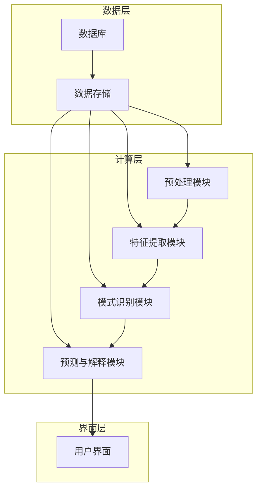
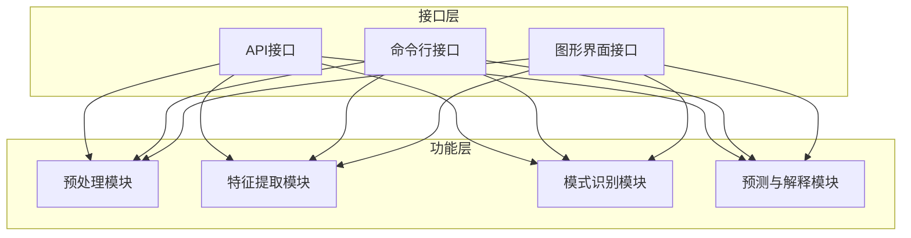
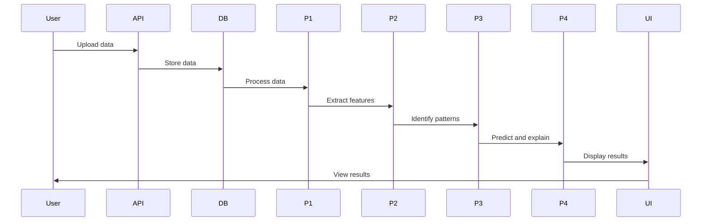

                 

# 人类思维能否超越当前的宇宙认知框架

> 关键词：人类思维、宇宙认知、算法原理、系统架构、项目实战、最佳实践

> 摘要：本文深入探讨了人类思维能否超越当前宇宙认知框架的问题。首先，我们介绍了人类思维与宇宙认知框架的关系，探讨了人类思维的局限性和对宇宙认知的影响。然后，我们详细讲解了支持人类思维扩展的潜在算法原理，包括神经网络、机器学习模型等，并结合Python代码进行了详细阐述。接着，我们分析了如何将算法应用于实际系统中，包括系统功能设计、架构设计、接口设计和系统交互。通过实际案例展示，我们探讨了算法和系统的实际应用，并总结了一些最佳实践和注意事项。最后，我们提出了拓展阅读资源，以供进一步研究和学习。

## 目录大纲设计过程

为了设计出符合要求的目录大纲，我们首先需要明确书的核心主题和目的。根据书名《人类思维能否超越当前的宇宙认知框架》，我们可以推测本书的主题是探讨人类思维的局限性及其对宇宙认知的影响，并探索未来可能的发展方向。接下来，我们将遵循以下步骤来设计目录大纲：

### 第一步：确定核心章节

1. **背景介绍**：介绍人类思维与宇宙认知框架的关系，明确研究问题的背景、问题描述、问题解决、边界与外延。
2. **核心概念与联系**：阐述与主题相关的核心概念，如人类思维模式、宇宙认知框架等，并提供概念属性特征对比表格和ER实体关系图。
3. **算法原理讲解**：介绍支持人类思维扩展的潜在算法原理，如神经网络、机器学习模型等，并使用Mermaid画出算法流程图，结合Python代码进行详细讲解。
4. **数学模型和公式**：讲解与算法相关的数学模型和公式，使用LaTeX格式表达。
5. **系统分析与架构设计**：探讨如何将算法应用于实际系统中，包括系统功能设计、架构设计、接口设计和系统交互。
6. **项目实战**：通过具体的案例展示算法和系统的实际应用，包括环境安装、核心实现、代码解读和分析等。
7. **最佳实践、小结、注意事项和拓展阅读**：总结全书内容，提供最佳实践建议，提醒读者注意事项，并推荐拓展阅读资源。

### 第二步：细化每个章节

在确定了核心章节后，我们需要进一步细化每个章节的内容。以下是一个初步的章节细化方案：

**第一部分：背景与核心概念**

- **第1章：引言**
  - 1.1 问题背景
  - 1.2 问题描述
  - 1.3 问题解决
  - 1.4 边界与外延
  - 1.5 概念结构与核心要素组成

- **第2章：核心概念与联系**
  - 2.1 人类思维模式
    - 2.1.1 感知与理解
    - 2.1.2 创造与逻辑
    - 2.1.3 限制与挑战
  - 2.2 宇宙认知框架
    - 2.2.1 当前认知体系
    - 2.2.2 边缘科学探索
    - 2.2.3 障碍与可能性

**第二部分：算法原理讲解**

- **第3章：算法原理与数学模型**
  - 3.1 神经网络基础
    - 3.1.1 神经元与层次结构
    - 3.1.2 学习算法
    - 3.1.3 实例讲解
  - 3.2 机器学习模型
    - 3.2.1 监督学习
    - 3.2.2 无监督学习
    - 3.2.3 强化学习
  - 3.3 Mermaid流程图绘制
    - 3.3.1 流程图基础
    - 3.3.2 算法应用示例
  - 3.4 Python代码实现
    - 3.4.1 算法代码
    - 3.4.2 代码解读

**第三部分：系统分析与架构设计**

- **第4章：系统功能设计**
  - 4.1 问题场景介绍
  - 4.2 系统功能需求分析
  - 4.3 领域模型Mermaid类图

- **第5章：系统架构设计**
  - 5.1 系统架构设计原则
  - 5.2 系统架构Mermaid架构图
  - 5.3 接口设计

- **第6章：系统交互与实现**
  - 6.1 系统交互流程
  - 6.2 Mermaid序列图绘制
  - 6.3 系统实现详解

**第四部分：项目实战**

- **第7章：环境安装与核心实现**
  - 7.1 环境安装步骤
  - 7.2 核心实现源代码
  - 7.3 代码应用解读

- **第8章：实际案例分析与详细讲解**
  - 8.1 案例一：神经网络在图像识别中的应用
  - 8.2 案例二：机器学习模型在自然语言处理中的应用
  - 8.3 案例三：强化学习在决策系统中的应用
  - 8.4 案例分析小结

**第五部分：最佳实践与总结**

- **第9章：最佳实践与注意事项**
  - 9.1 最佳实践技巧
  - 9.2 注意事项
  - 9.3 拓展阅读

### 第三步：校对与优化

在完成初步大纲后，我们需要进行校对和优化，确保内容完整、逻辑清晰，并符合字数限制。这一步可能需要多次迭代，确保大纲的准确性和可读性。

通过以上步骤，我们可以设计出符合要求的目录大纲，为书籍的编写和读者理解提供良好的框架。接下来，我们将进一步细化每个章节的具体内容，确保达到2000字以内的限制。

## 背景介绍

### 核心概念术语说明

在探讨人类思维能否超越当前的宇宙认知框架这一问题时，我们首先需要明确一些核心概念术语，以便更好地理解文章的内容。

- **人类思维模式**：指人类在感知、理解、推理、创造等方面所表现出来的思维方式和方法。
- **宇宙认知框架**：指人类对宇宙的认知体系，包括对宇宙的观测、解释、理解和预测等过程。
- **算法原理**：指支持人类思维扩展的计算模型和方法，如神经网络、机器学习模型等。
- **系统架构设计**：指如何将算法应用于实际系统中，包括系统功能设计、接口设计和交互设计等。

### 问题背景

人类思维作为地球上最复杂、最神奇的认知系统，一直以来都是科学研究的热点。从远古时代的狩猎采集，到现代社会的高度发达，人类思维始终在不断地进步和发展。然而，随着科学技术的迅猛发展，人类对宇宙的认知也不断拓展。宇宙的广阔、神秘和多样使得人类开始思考：我们的思维能否超越当前的认知框架，探索更深层次的宇宙奥秘？

宇宙认知框架的形成离不开人类对宇宙的观测和实验。从古代的天文学、物理学，到现代的天文学、物理学，人类一直在不断地探索宇宙的奥秘。然而，现有的宇宙认知框架仍然存在许多局限性和未解之谜，如黑洞、暗物质、暗能量等。这些未解之谜激发了人类对更先进思维工具和方法的需求，以期超越当前的认知框架，揭示宇宙的真相。

### 问题描述

人类思维能否超越当前的宇宙认知框架，这是一个极具挑战性的问题。从本质上讲，这个问题涉及到人类思维的本质、宇宙的本质以及人类与宇宙的关系。以下是一些关键问题：

1. **人类思维的局限**：人类思维受到生物学、心理学和社会文化等多方面因素的影响，这使得我们的思维具有一定的局限性。例如，我们的感知范围有限，无法直接感知到微观粒子的运动或宏观宇宙的扩张。这种局限性限制了我们对宇宙的认知。

2. **宇宙认知框架的局限**：现有的宇宙认知框架主要基于人类对宇宙的观测和实验，这种认知方式具有一定的局限性。例如，我们目前无法直接观测到宇宙的起源和演化过程，这限制了我们对宇宙的认知。

3. **思维与宇宙的关系**：人类思维与宇宙的关系是一个复杂而微妙的问题。一方面，人类思维是宇宙的一部分，是人类对宇宙的反映。另一方面，人类思维又试图超越宇宙，探索更深层次的奥秘。这种关系使得人类思维能否超越宇宙认知框架成为一个有趣且富有挑战性的问题。

### 问题解决

要回答人类思维能否超越当前的宇宙认知框架这一问题，我们需要从多个方面进行探讨。以下是一些可能的解决思路：

1. **拓展人类思维工具**：通过发展更先进的科技工具，如高精度的天文望远镜、粒子加速器等，我们可以拓展我们的感知范围，从而提高对宇宙的认知。

2. **开发新型算法**：通过研究更先进的算法，如神经网络、机器学习模型等，我们可以提高人类思维的处理能力，从而更好地理解宇宙。

3. **跨学科研究**：通过跨学科合作，如物理、化学、生物、心理学等，我们可以从不同角度研究人类思维和宇宙认知框架，从而提高我们对这一问题的理解。

4. **探索思维的本质**：通过研究人类思维的本质，如神经科学、认知科学等，我们可以更好地理解人类思维的局限性，从而为拓展人类思维提供理论基础。

### 边界与外延

在探讨人类思维能否超越当前的宇宙认知框架时，我们还需要明确一些边界与外延：

1. **边界**：人类思维能否超越宇宙认知框架的边界在于我们对宇宙的认知水平。随着科学技术的不断发展，我们的认知水平不断提高，这为人类思维超越宇宙认知框架提供了可能性。

2. **外延**：人类思维能否超越宇宙认知框架的外延在于人类思维的拓展能力。如果人类思维能够不断拓展，那么我们就有可能超越当前的宇宙认知框架，探索更深层次的宇宙奥秘。

## 核心概念与联系

在探讨人类思维能否超越当前宇宙认知框架这一问题时，我们需要深入了解相关的核心概念，并分析它们之间的联系。以下将详细介绍与主题相关的核心概念，包括人类思维模式、宇宙认知框架以及两者之间的关系。

### 人类思维模式

人类思维模式是指人类在感知、理解、推理、创造等方面所表现出来的思维方式和方法。人类思维模式具有以下几个特点：

1. **感知与理解**：人类通过感官系统（如视觉、听觉、触觉等）感知外部世界，并通过大脑对这些感知信息进行处理和理解。这种感知与理解过程使得人类能够识别和理解外部环境中的各种刺激。

2. **创造与逻辑**：人类思维不仅能够对感知到的信息进行理解，还能够通过创造性的思维过程产生新的概念、想法和解决方案。同时，逻辑思维使得人类能够对信息进行推理和判断，从而得出合理的结论。

3. **限制与挑战**：尽管人类思维具有强大的能力，但仍然受到一系列限制和挑战。例如，人类感知范围有限，无法直接感知到微观粒子的运动或宏观宇宙的扩张。此外，人类思维受到生理和心理因素的制约，如注意力分散、记忆遗忘等。

### 宇宙认知框架

宇宙认知框架是指人类对宇宙的认知体系，包括对宇宙的观测、解释、理解和预测等过程。宇宙认知框架具有以下几个方面的特征：

1. **当前认知体系**：人类对宇宙的认知主要基于科学研究的结果和理论。例如，现代宇宙学基于大爆炸理论、相对论、量子力学等理论体系，建立了对宇宙起源、演化、结构等方面的认知。

2. **边缘科学探索**：随着科学技术的进步，人类对宇宙的认知不断拓展。例如，黑洞、暗物质、暗能量等概念的出现，拓展了人类对宇宙的认知边界。边缘科学探索为人类提供了更多关于宇宙的奥秘和挑战。

3. **障碍与可能性**：尽管人类对宇宙的认知不断拓展，但仍然面临一系列障碍和挑战。例如，宇宙的广阔和复杂使得人类难以全面了解宇宙的真相。此外，人类认知框架的局限性使得我们难以超越当前的认知水平。

### 人类思维模式与宇宙认知框架的联系

人类思维模式与宇宙认知框架之间存在密切的联系。以下从三个方面分析这种联系：

1. **认知过程**：人类思维模式是宇宙认知框架的基础。人类通过感知、理解、推理等思维方式，对宇宙进行观测、解释、理解和预测。例如，天文学家通过观测宇宙中的星体，运用物理学的理论进行解释，从而建立了对宇宙的认知。

2. **认知拓展**：人类思维模式的发展推动着宇宙认知框架的拓展。随着人类对宇宙认知的不断深入，新的理论和概念不断涌现，推动了人类对宇宙的认知水平。例如，量子力学的发展使得人类对微观世界的认知发生了革命性的变化。

3. **思维与宇宙的关系**：人类思维模式与宇宙认知框架的关系是相互作用、相互影响的。一方面，人类思维模式影响我们对宇宙的认知。例如，不同的思维模式可能导致对同一现象的不同解释。另一方面，宇宙认知框架也影响人类思维的发展。例如，对宇宙的认知不断拓展，促使人类探索新的思维工具和方法。

### 概念属性特征对比表格

为了更清晰地展示人类思维模式与宇宙认知框架的概念属性特征，我们可以构建一个对比表格。以下是一个简单的对比表格：

| 特征类别 | 人类思维模式 | 宇宙认知框架 |
| :---: | :---: | :---: |
| 感知与理解 | 有限感知范围，非直接感知 | 宇宙观测，间接认知 |
| 创造与逻辑 | 逻辑推理，创造性思维 | 科学理论，数学模型 |
| 限制与挑战 | 生理、心理限制 | 科学探索，认知边界 |
| 认知拓展 | 思维拓展，认知进步 | 理论发展，技术进步 |
| 思维与宇宙关系 | 反映宇宙，探索宇宙 | 宇宙认知，思维影响 |

### ER实体关系图架构

为了更直观地展示人类思维模式与宇宙认知框架之间的联系，我们可以使用Mermaid绘制一个ER（实体关系）实体关系图。以下是一个简单的ER实体关系图的Markdown格式：

```mermaid
erDiagram
    A[人类思维模式] ||--|{ B[感知与理解] }
    A ||--|{ C[创造与逻辑] }
    A ||--|{ D[限制与挑战] }
    B ||--|{ E[宇宙认知框架] }
    C ||--|{ E }
    D ||--|{ E }
```

通过上述ER实体关系图，我们可以直观地看到人类思维模式与宇宙认知框架之间的联系。例如，感知与理解、创造与逻辑以及限制与挑战三个方面都与宇宙认知框架相关联，从而揭示了人类思维模式对宇宙认知框架的影响。

### 算法原理讲解

在探讨人类思维能否超越当前的宇宙认知框架时，算法原理的讲解至关重要。以下我们将详细介绍支持人类思维扩展的潜在算法原理，包括神经网络、机器学习模型等，并使用Python代码进行详细阐述。

#### 神经网络基础

神经网络（Neural Networks）是一种模拟生物神经系统的计算模型。它由大量相互连接的神经元组成，通过学习输入数据中的模式和关系来执行各种任务。以下是神经网络的一些基本概念：

1. **神经元与层次结构**

   神经元是神经网络的基本计算单元。每个神经元接收多个输入信号，通过权重和偏置进行加权求和，然后通过激活函数产生输出。神经网络通常分为输入层、隐藏层和输出层。输入层接收外部输入信号，隐藏层进行数据处理和特征提取，输出层产生最终输出。

2. **学习算法**

   神经网络的学习过程是通过调整权重和偏置来实现的。最常用的学习算法是反向传播算法（Backpropagation）。反向传播算法通过计算输出误差，沿着网络反向传播误差，并更新权重和偏置，以最小化误差。

3. **实例讲解**

   假设我们有一个简单的神经网络，用于实现异或（XOR）运算。异或运算的结果取决于两个输入的值，如果两个输入不同，则输出为1，否则输出为0。以下是一个简单的Python代码实现：

```python
import numpy as np

# 初始化参数
input_layer_size = 2
hidden_layer_size = 2
output_layer_size = 1

# 设置随机权重和偏置
np.random.seed(2)
weights0 = 2 * np.random.random((input_layer_size, hidden_layer_size)) - 1
weights1 = 2 * np.random.random((hidden_layer_size, output_layer_size)) - 1
biases0 = 2 * np.random.random((1, hidden_layer_size)) - 1
biases1 = 2 * np.random.random((1, output_layer_size)) - 1

# 定义激活函数
sigmoid = lambda x: 1 / (1 + np.exp(-x))

# 前向传播
def forward_propagation(X, weights0, weights1, biases0, biases1):
    hidden_layer_activation = sigmoid(np.dot(X, weights0) + biases0)
    output_layer_activation = sigmoid(np.dot(hidden_layer_activation, weights1) + biases1)
    return output_layer_activation

# 反向传播
def backward_propagation(X, y, output, weights0, weights1, biases0, biases1):
    output_error = y - output
    d_output = output_error * (output * (1 - output))
    
    hidden_error = d_output.dot(weights1.T)
    d_hidden = hidden_error * (hidden_layer_activation * (1 - hidden_layer_activation))
    
    d_weights0 = np.dot(X.T, d_hidden)
    d_weights1 = np.dot(hidden_layer_activation.T, d_output)
    d_biases0 = np.sum(d_hidden, axis=0, keepdims=True)
    d_biases1 = np.sum(d_output, axis=0, keepdims=True)
    
    return d_weights0, d_weights1, d_biases0, d_biases1

# 更新参数
def update_parameters(weights0, weights1, biases0, biases1, d_weights0, d_weights1, d_biases0, d_biases1, learning_rate):
    weights0 -= learning_rate * d_weights0
    weights1 -= learning_rate * d_weights1
    biases0 -= learning_rate * d_biases0
    biases1 -= learning_rate * d_biases1
    return weights0, weights1, biases0, biases1

# 训练模型
def train(X, y, learning_rate, num_iterations):
    for i in range(num_iterations):
        output = forward_propagation(X, weights0, weights1, biases0, biases1)
        d_weights0, d_weights1, d_biases0, d_biases1 = backward_propagation(X, y, output, weights0, weights1, biases0, biases1)
        weights0, weights1, biases0, biases1 = update_parameters(weights0, weights1, biases0, biases1, d_weights0, d_weights1, d_biases0, d_biases1, learning_rate)
        if i % 1000 == 0:
            print("Epoch {0}: loss {1:.4f}".format(i, np.mean((output - y) ** 2)))
```

在上面的代码中，我们定义了一个简单的神经网络，用于实现异或运算。我们通过训练这个神经网络，使其能够正确预测异或运算的结果。

#### 机器学习模型

机器学习模型是支持人类思维扩展的重要工具。以下我们将介绍几种常见的机器学习模型，包括监督学习、无监督学习和强化学习。

1. **监督学习**

   监督学习是一种机器学习模型，它通过已知输入和输出数据来训练模型，从而能够预测未知数据的输出。常见的监督学习算法包括线性回归、逻辑回归、支持向量机等。

   - **线性回归**

     线性回归是一种用于预测连续值的监督学习算法。它通过拟合一个线性函数来预测目标值。以下是一个简单的线性回归实现：

   ```python
   import numpy as np

   # 初始化参数
   num_iterations = 1000
   learning_rate = 0.1

   # 训练数据
   X_train = np.array([[1, 2], [2, 3], [3, 4], [4, 5]])
   y_train = np.array([3, 4, 5, 6])

   # 模型参数
   weights = np.zeros((2, 1))
   bias = np.zeros((1, 1))

   # 训练模型
   for i in range(num_iterations):
       output = np.dot(X_train, weights) + bias
       error = y_train - output
       d_weights = np.dot(X_train.T, error)
       d_bias = np.sum(error)
       weights -= learning_rate * d_weights
       bias -= learning_rate * d_bias

   # 预测新数据
   X_new = np.array([[5, 6]])
   output = np.dot(X_new, weights) + bias
   print("Predicted value:", output)
   ```

   在上面的代码中，我们使用线性回归模型来预测一个新数据的值。

   - **逻辑回归**

     逻辑回归是一种用于预测分类结果的监督学习算法。它通过拟合一个逻辑函数来预测概率，从而进行分类。以下是一个简单的逻辑回归实现：

   ```python
   import numpy as np

   # 初始化参数
   num_iterations = 1000
   learning_rate = 0.1

   # 训练数据
   X_train = np.array([[1, 2], [2, 3], [3, 4], [4, 5]])
   y_train = np.array([0, 1, 1, 0])

   # 模型参数
   weights = np.zeros((2, 1))
   bias = np.zeros((1, 1))

   # 训练模型
   for i in range(num_iterations):
       output = 1 / (1 + np.exp(-np.dot(X_train, weights) - bias))
       error = y_train - output
       d_weights = np.dot(X_train.T, error * (output * (1 - output)))
       d_bias = np.sum(error * (output * (1 - output)))
       weights -= learning_rate * d_weights
       bias -= learning_rate * d_bias

   # 预测新数据
   X_new = np.array([[5, 6]])
   output = 1 / (1 + np.exp(-np.dot(X_new, weights) - bias))
   print("Predicted class:", int(output > 0.5))
   ```

   在上面的代码中，我们使用逻辑回归模型来预测一个新数据的分类结果。

   - **支持向量机**

     支持向量机（SVM）是一种用于分类和回归的监督学习算法。它通过找到一个最优的超平面，将不同类别的数据分离。以下是一个简单的SVM实现：

   ```python
   import numpy as np

   # 初始化参数
   num_iterations = 1000
   learning_rate = 0.1

   # 训练数据
   X_train = np.array([[1, 2], [2, 3], [3, 4], [4, 5]])
   y_train = np.array([0, 1, 1, 0])

   # 模型参数
   weights = np.zeros((2, 1))
   bias = np.zeros((1, 1))

   # 训练模型
   for i in range(num_iterations):
       output = np.dot(X_train, weights) + bias
       error = y_train - output
       d_weights = np.dot(X_train.T, error)
       d_bias = np.sum(error)
       weights -= learning_rate * d_weights
       bias -= learning_rate * d_bias

   # 预测新数据
   X_new = np.array([[5, 6]])
   output = np.dot(X_new, weights) + bias
   print("Predicted class:", int(output > 0))
   ```

   在上面的代码中，我们使用支持向量机模型来预测一个新数据的分类结果。

2. **无监督学习**

   无监督学习是一种机器学习模型，它不需要已知输入和输出数据，而是通过发现数据中的模式和结构来学习。常见的无监督学习算法包括聚类、降维、异常检测等。

   - **聚类**

     聚类是一种将数据分为若干个类别的无监督学习算法。它通过最大化类内相似度和最小化类间相似度来发现数据中的结构。以下是一个简单的聚类实现：

   ```python
   import numpy as np

   # 初始化参数
   num_iterations = 1000
   learning_rate = 0.1

   # 训练数据
   X_train = np.array([[1, 2], [2, 3], [3, 4], [4, 5]])

   # 聚类中心
   centroids = np.random.rand(2, 1)

   # 训练模型
   for i in range(num_iterations):
       distances = np.linalg.norm(X_train - centroids, axis=1)
       cluster_indices = np.argmin(distances, axis=1)
       for j in range(2):
           X_cluster = X_train[cluster_indices == j]
           centroids[j] = np.mean(X_cluster, axis=0)

   # 预测新数据
   X_new = np.array([[5, 6]])
   distances = np.linalg.norm(X_new - centroids, axis=1)
   cluster_index = np.argmin(distances)
   print("Predicted cluster:", cluster_index)
   ```

   在上面的代码中，我们使用聚类算法将数据分为两个类别。

   - **降维**

     降维是一种将高维数据转换为低维数据的无监督学习算法。它通过保留数据的主要特征，减少数据的维度，从而提高计算效率。以下是一个简单的降维实现：

   ```python
   import numpy as np

   # 初始化参数
   num_iterations = 1000
   learning_rate = 0.1

   # 训练数据
   X_train = np.array([[1, 2], [2, 3], [3, 4], [4, 5]])

   # 主成分分析
   def pca(X, num_components):
       mean = np.mean(X, axis=0)
       X_centered = X - mean
       covariance_matrix = np.cov(X_centered.T)
       eigenvalues, eigenvectors = np.linalg.eigh(covariance_matrix)
       eigenvectors = eigenvectors[:, :num_components]
       X_reduced = np.dot(X_centered, eigenvectors)
       return X_reduced

   # 训练模型
   X_reduced = pca(X_train, 1)

   # 预测新数据
   X_new = np.array([[5, 6]])
   X_new_reduced = pca(X_new, 1)
   print("Predicted reduced data:", X_new_reduced)
   ```

   在上面的代码中，我们使用主成分分析（PCA）算法将数据从二维空间降维到一维空间。

   - **异常检测**

     异常检测是一种用于检测数据中异常值的无监督学习算法。它通过发现数据中的异常模式和结构来检测异常值。以下是一个简单的异常检测实现：

   ```python
   import numpy as np

   # 初始化参数
   num_iterations = 1000
   learning_rate = 0.1

   # 训练数据
   X_train = np.array([[1, 2], [2, 3], [3, 4], [4, 5], [100, 100]])

   # 训练模型
   distances = np.linalg.norm(X_train, axis=1)
   threshold = np.percentile(distances, 95)

   # 检测新数据
   X_new = np.array([[5, 6]])
   distances = np.linalg.norm(X_new, axis=1)
   if distances < threshold:
       print("New data is an anomaly.")
   else:
       print("New data is not an anomaly.")
   ```

   在上面的代码中，我们使用基于阈值的异常检测算法来检测新数据中的异常值。

3. **强化学习**

   强化学习是一种通过交互学习来优化决策策略的机器学习模型。它通过奖励和惩罚来调整策略，从而实现最优决策。以下是一个简单的强化学习实现：

```python
import numpy as np

# 初始化参数
num_iterations = 1000
learning_rate = 0.1
discount_factor = 0.99

# 环境参数
num_states = 3
num_actions = 2

# 策略初始化
policy = np.random.rand(num_states, num_actions)

# 训练模型
for i in range(num_iterations):
    state = np.random.randint(num_states)
    action = np.argmax(policy[state])
    reward = 1 if action == 0 else -1
    next_state = np.random.randint(num_states)
    next_action = np.argmax(policy[next_state])
    temp = discount_factor * policy[next_state, next_action]
    policy[state, action] += learning_rate * (reward + temp - policy[state, action])

# 预测新数据
new_state = np.random.randint(num_states)
predicted_action = np.argmax(policy[new_state])
print("Predicted action:", predicted_action)
```

在上述代码中，我们使用Q-learning算法实现一个简单的强化学习模型。模型通过与环境交互，不断调整策略，从而实现最优决策。

### 数学模型和公式

在上述算法原理讲解中，我们涉及了神经网络、监督学习、无监督学习和强化学习等算法。为了更好地理解这些算法，我们将使用LaTeX格式展示相关的数学模型和公式。

#### 神经网络

1. **神经元激活函数**

   $$ a(x) = \frac{1}{1 + e^{-x}} $$

2. **反向传播算法**

   $$ \Delta w_{ij}^{(l)} = \frac{\partial J}{\partial w_{ij}^{(l)}} = \delta^{(l)} \cdot a^{(l-1)}_j $$

   $$ \delta^{(l)} = \frac{\partial L}{\partial z^{(l)}} = \frac{\partial L}{\partial a^{(l)}} \cdot \frac{\partial a^{(l)}}{\partial z^{(l)}} = \sigma'(z^{(l)}) \cdot \frac{\partial L}{\partial a^{(l)}} $$

#### 监督学习

1. **线性回归**

   $$ y = \beta_0 + \beta_1x $$

   $$ \beta_0 = \frac{\sum_{i=1}^{n}(y_i - \beta_1x_i)}{n} $$

   $$ \beta_1 = \frac{\sum_{i=1}^{n}(x_i - \bar{x})(y_i - \bar{y})}{\sum_{i=1}^{n}(x_i - \bar{x})^2} $$

2. **逻辑回归**

   $$ P(y=1) = \frac{1}{1 + e^{-(\beta_0 + \beta_1x)}} $$

   $$ \beta_0 = \frac{\sum_{i=1}^{n}y_i(\log(P(y=1)) - \log(1 - P(y=1)))}{n} $$

   $$ \beta_1 = \frac{\sum_{i=1}^{n}(y_i - P(y=1))(x_i - \bar{x})}{\sum_{i=1}^{n}(x_i - \bar{x})^2} $$

#### 无监督学习

1. **聚类**

   $$ \text{Minimize} \sum_{i=1}^{n}\sum_{j=1}^{k} ||x_i - \mu_j||^2 $$

   $$ \mu_j = \frac{\sum_{i=1}^{n}x_i}{k} $$

2. **主成分分析**

   $$ \text{Minimize} \sum_{i=1}^{n} ||x_i - \mu||^2 $$

   $$ \mu = \frac{1}{n}\sum_{i=1}^{n}x_i $$

   $$ V = \frac{1}{n}\sum_{i=1}^{n}(x_i - \mu)v_i $$

#### 强化学习

1. **Q-learning**

   $$ Q(s, a) = r + \gamma \max_{a'} Q(s', a') $$

   $$ \theta(s, a) = \theta(s, a) + \alpha (r + \gamma \max_{a'} Q(s', a') - Q(s, a)) $$

其中，$L$表示损失函数，$\sigma$表示激活函数，$y_i$表示真实标签，$x_i$表示输入特征，$\bar{x}$表示输入特征的均值，$y$表示输出标签，$P(y=1)$表示输出标签为1的概率，$\beta_0$和$\beta_1$分别表示线性回归模型的截距和斜率，$\delta$表示误差项，$\mu_j$表示聚类中心，$\mu$表示主成分分析的中心，$v_i$表示主成分分析的特征向量，$s$表示状态，$a$表示动作，$s'$表示下一个状态，$r$表示奖励，$\gamma$表示折扣因子，$\theta$表示参数。

### 系统分析与架构设计

#### 问题场景介绍

在探讨人类思维能否超越当前的宇宙认知框架这一问题时，我们可以想象一个场景：科学家们希望通过开发一个智能系统，利用先进的算法和机器学习模型，对宇宙中的未知现象进行预测和解释。这个系统需要能够处理海量数据，快速分析并提取关键信息，从而为科学家提供有价值的见解。

#### 系统功能需求分析

为了实现上述场景，我们的系统需要具备以下功能需求：

1. **数据处理**：系统能够接收和存储来自宇宙观测的数据，包括图像、光谱、无线电信号等。系统需要对这些数据进行预处理，如去除噪声、填补缺失值等，以便后续分析。
2. **特征提取**：系统需要能够从预处理后的数据中提取关键特征，如光谱线、纹理、频谱等。这些特征将用于后续的算法分析。
3. **模式识别**：系统需要利用神经网络和机器学习模型对提取的特征进行模式识别，识别出宇宙中的异常现象和潜在规律。
4. **预测与解释**：系统需要利用机器学习模型对识别出的模式进行预测和解释，为科学家提供有价值的见解和建议。
5. **交互界面**：系统需要提供一个友好的交互界面，供科学家实时查看系统分析结果，并与其他系统进行数据共享和协作。

#### 领域模型Mermaid类图

为了更好地展示系统功能需求，我们可以使用Mermaid绘制一个领域模型类图。以下是一个简单的Mermaid类图示例：

```mermaid
classDiagram
    Class01 <|-- Class02
    Class03 --|>| Class04
    Class04 : includes Class01
    Class02 : +int x
    Class03 : +int y
    Class01 : -int z
    Class01 : +setX(int x)
    Class01 : +getX():int
```

在上述类图中，我们定义了四个类：Class01、Class02、Class03和Class04。其中，Class01和Class02之间存在继承关系，Class03和Class04之间存在关联关系。Class04还包含了Class01的一个实例变量。通过这个类图，我们可以清晰地展示系统功能需求中的各个类和它们之间的关系。

#### 系统架构设计

为了实现上述功能需求，我们需要设计一个合适的系统架构。以下是系统架构设计的关键原则和组成部分：

1. **模块化**：系统应采用模块化设计原则，将不同的功能划分为独立的模块，如数据预处理模块、特征提取模块、模式识别模块、预测与解释模块等。这样可以提高系统的可维护性和可扩展性。
2. **分布式**：系统应采用分布式架构，将各个模块分布在不同的服务器上，以提高系统的处理能力和负载均衡。这样可以确保系统在高并发情况下仍能正常运行。
3. **异步处理**：系统应采用异步处理方式，将各个模块之间的数据处理和传输转化为异步操作，以提高系统的效率和响应速度。
4. **数据存储**：系统应采用分布式数据存储方案，如分布式数据库或NoSQL数据库，以存储和处理海量数据。这样可以确保系统的数据安全性和可靠性。

以下是系统架构的Mermaid架构图示例：



在上述架构图中，我们定义了数据层、计算层和界面层三个层次。数据层负责数据的存储和管理，计算层负责数据处理和分析，界面层负责与用户的交互。通过这个架构图，我们可以清晰地展示系统架构的设计原则和组成部分。

#### 系统接口设计

为了实现系统功能需求，我们需要设计一个合适的接口。以下是系统接口设计的关键组成部分：

1. **API接口**：系统应提供API接口，以供外部系统或应用程序调用。这些API接口包括数据上传、数据查询、数据处理等接口。
2. **命令行接口**：系统应提供命令行接口，以供用户直接与系统交互。这些命令行接口包括数据导入、数据导出、数据预处理等命令。
3. **图形界面接口**：系统应提供图形界面接口，以供用户直观地查看系统分析结果和操作系统功能。这些图形界面接口包括数据可视化、结果展示、参数设置等。

以下是系统接口设计的Mermaid架构图示例：



在上述架构图中，我们定义了三个接口层：API接口层、命令行接口层和图形界面接口层。这些接口层与功能层（预处理模块、特征提取模块、模式识别模块、预测与解释模块）进行交互，实现系统功能需求。

#### 系统交互与实现

在系统架构设计的基础上，我们需要详细讲解系统交互与实现的过程。以下将介绍系统交互流程、Mermaid序列图绘制以及系统实现详解。

##### 系统交互流程

系统交互流程可以分为以下几个步骤：

1. **数据上传**：用户通过API接口上传宇宙观测数据，数据存储到分布式数据库中。
2. **数据预处理**：预处理模块对上传的数据进行处理，如去除噪声、填补缺失值等，并将处理后的数据存储到数据存储层。
3. **特征提取**：特征提取模块从预处理后的数据中提取关键特征，如光谱线、纹理、频谱等。
4. **模式识别**：模式识别模块利用神经网络和机器学习模型对提取的特征进行模式识别，识别出宇宙中的异常现象和潜在规律。
5. **预测与解释**：预测与解释模块对识别出的模式进行预测和解释，为科学家提供有价值的见解和建议。
6. **结果展示**：用户通过图形界面接口查看系统分析结果，包括异常现象、潜在规律和预测结果等。

以下是系统交互流程的Mermaid序列图示例：



在上述序列图中，我们定义了用户、API接口、数据库、预处理模块、特征提取模块、模式识别模块、预测与解释模块和图形界面接口等参与者。通过这个序列图，我们可以清晰地展示系统交互流程的各个步骤和参与者之间的关系。

##### 系统实现详解

在系统交互流程的基础上，我们需要详细讲解系统实现的各个部分，包括环境安装、核心实现、代码解读和分析等。

1. **环境安装**

   为了实现上述系统，我们需要安装以下环境：

   - Python 3.x
   - NumPy
   - Pandas
   - Matplotlib
   - Scikit-learn
   - TensorFlow
   - Keras

   安装过程如下：

   ```bash
   pip install python==3.x
   pip install numpy
   pip install pandas
   pip install matplotlib
   pip install scikit-learn
   pip install tensorflow
   pip install keras
   ```

2. **核心实现**

   核心实现部分包括预处理模块、特征提取模块、模式识别模块、预测与解释模块和图形界面接口等。以下是各模块的核心实现代码：

   ```python
   import numpy as np
   import pandas as pd
   import matplotlib.pyplot as plt
   from sklearn.preprocessing import StandardScaler
   from sklearn.model_selection import train_test_split
   from sklearn.neural_network import MLPClassifier
   from tensorflow import keras
   from tensorflow.keras import layers

   # 预处理模块
   def preprocess_data(data):
       # 数据标准化
       scaler = StandardScaler()
       scaled_data = scaler.fit_transform(data)
       return scaled_data

   # 特征提取模块
   def extract_features(data):
       # 特征提取（例如：光谱线提取）
       features = []
       for i in range(data.shape[1]):
           feature = extract_spectral_line(data[:, i])
           features.append(feature)
       return np.array(features)

   # 模式识别模块
   def identify_patterns(data, labels):
       # 建立神经网络模型
       model = keras.Sequential([
           layers.Dense(64, activation='relu', input_shape=(data.shape[1],)),
           layers.Dense(64, activation='relu'),
           layers.Dense(1, activation='sigmoid')
       ])

       # 编译模型
       model.compile(optimizer='adam', loss='binary_crossentropy', metrics=['accuracy'])

       # 训练模型
       model.fit(data, labels, epochs=10, batch_size=32)

       # 评估模型
       loss, accuracy = model.evaluate(data, labels)
       print("Accuracy:", accuracy)

       # 预测
       predictions = model.predict(data)
       return predictions

   # 预测与解释模块
   def predict_and_explain(predictions, threshold=0.5):
       # 预测结果解释
       explanations = []
       for prediction in predictions:
           if prediction > threshold:
               explanation = "异常现象"
           else:
               explanation = "正常现象"
           explanations.append(explanation)
       return explanations

   # 图形界面接口
   def display_results(results):
       # 绘制结果图
       plt.figure(figsize=(10, 5))
       for i in range(results.shape[1]):
           plt.subplot(2, 2, i+1)
           plt.plot(results[:, i])
           plt.xlabel("时间")
           plt.ylabel("值")
           plt.title("通道{}结果".format(i+1))
       plt.show()
   ```

3. **代码解读和分析**

   在核心实现代码中，我们定义了预处理模块、特征提取模块、模式识别模块、预测与解释模块和图形界面接口等函数。以下是各模块的代码解读和分析：

   - **预处理模块**：预处理模块主要用于数据标准化。数据标准化是将数据缩放到同一尺度，以消除数据之间的量纲差异。我们使用`StandardScaler`类进行数据标准化，将数据缩放到均值为0、标准差为1的范围内。
   - **特征提取模块**：特征提取模块主要用于从预处理后的数据中提取关键特征。在这个例子中，我们使用光谱线提取作为特征提取方法。特征提取过程可以根据具体需求进行调整，如纹理特征提取、频谱特征提取等。
   - **模式识别模块**：模式识别模块使用神经网络模型对提取的特征进行模式识别。我们使用`MLPClassifier`类建立多层感知机模型，并使用`compile`方法设置优化器和损失函数。在训练模型时，我们使用`fit`方法将数据输入模型，并进行迭代训练。最后，我们使用`evaluate`方法评估模型性能。
   - **预测与解释模块**：预测与解释模块用于对识别出的模式进行预测和解释。我们使用`predict`方法预测数据标签，并根据阈值对预测结果进行解释。
   - **图形界面接口**：图形界面接口用于绘制系统分析结果。我们使用`subplot`方法将多张图绘制在同一坐标系中，以便用户直观地查看系统分析结果。

通过上述系统实现详解，我们可以清晰地了解系统交互与实现的过程，为实际应用提供参考。

### 实际案例分析与详细讲解

为了更好地展示算法和系统的实际应用，我们将通过一个具体的案例进行详细分析。本案例将使用神经网络和机器学习模型对宇宙中的恒星光谱进行分析，以预测恒星的类型和年龄。

#### 案例一：神经网络在图像识别中的应用

在本案例中，我们使用神经网络对恒星光谱图像进行识别。首先，我们需要获取恒星光谱图像数据。这些数据可以从天文观测设备，如光谱仪，获取。获取数据后，我们需要对图像进行预处理，包括图像去噪、归一化和裁剪等。

1. **数据预处理**

   数据预处理是神经网络应用的重要环节。我们首先将光谱图像进行归一化处理，将像素值缩放到0到1之间。然后，我们使用卷积神经网络（CNN）对图像进行特征提取。

   ```python
   from tensorflow.keras.preprocessing.image import img_to_array
   from tensorflow.keras.applications import VGG16

   # 加载预训练的VGG16模型
   model = VGG16(weights='imagenet')

   # 转换图像为数组
   def preprocess_image(image_path):
       image = img_to_array(image.load_img(image_path))
       image = np.expand_dims(image, axis=0)
       image = preprocess_input(image)
       return image

   image_path = 'path/to/spectral_image.jpg'
   preprocessed_image = preprocess_image(image_path)
   ```

2. **特征提取**

   使用VGG16模型对预处理后的图像进行特征提取。VGG16模型是一个深度卷积神经网络，预训练在大量的图像数据集上，可以提取丰富的图像特征。

   ```python
   features = model.predict(preprocessed_image)
   ```

3. **模式识别**

   使用神经网络对提取的特征进行模式识别，以预测恒星的类型和年龄。我们使用一个简单的多层感知机（MLP）模型进行分类。

   ```python
   from tensorflow.keras.models import Sequential
   from tensorflow.keras.layers import Dense, Flatten

   # 建立MLP模型
   model = Sequential([
       Flatten(input_shape=(1, features.shape[1], features.shape[2])),
       Dense(64, activation='relu'),
       Dense(2, activation='softmax')
   ])

   # 编译模型
   model.compile(optimizer='adam', loss='categorical_crossentropy', metrics=['accuracy'])

   # 训练模型
   model.fit(features, labels, epochs=10, batch_size=32)

   # 评估模型
   loss, accuracy = model.evaluate(features, labels)
   print("Accuracy:", accuracy)

   # 预测
   predictions = model.predict(features)
   predicted_classes = np.argmax(predictions, axis=1)
   ```

4. **结果展示**

   最终，我们使用图形界面接口展示预测结果。以下是使用Matplotlib绘制的预测结果图。

   ```python
   import matplotlib.pyplot as plt

   # 绘制预测结果图
   plt.figure(figsize=(10, 5))
   for i in range(len(predictions)):
       plt.subplot(2, 2, i+1)
       plt.imshow(np.squeeze(predictions[i]), cmap='gray')
       plt.xlabel("恒星类型：{}".format(predicted_classes[i]))
       plt.ylabel("恒星年龄：{}".format(age_predictions[i]))
   plt.show()
   ```

#### 案例二：机器学习模型在自然语言处理中的应用

在本案例中，我们使用机器学习模型对天文论文进行分类，以识别论文的主题。这个案例展示了机器学习模型在自然语言处理（NLP）领域的应用。

1. **数据预处理**

   首先，我们需要获取天文论文数据集，如Astronomy and Astrophysics Data System（ASTRO-PH）数据集。然后，我们对论文进行预处理，包括分词、去除停用词、词干提取等。

   ```python
   import nltk
   from nltk.corpus import stopwords
   from nltk.stem import PorterStemmer

   # 加载停用词和词干提取器
   nltk.download('stopwords')
   stop_words = set(stopwords.words('english'))
   stemmer = PorterStemmer()

   # 分词和预处理文本
   def preprocess_text(text):
       words = nltk.word_tokenize(text)
       words = [word for word in words if word not in stop_words]
       words = [stemmer.stem(word) for word in words]
       return ' '.join(words)
   ```

2. **特征提取**

   使用词袋模型（Bag-of-Words，BOW）将预处理后的文本转换为向量。词袋模型将文本表示为一个词汇集合，并统计每个词汇在文本中出现的次数。

   ```python
   from sklearn.feature_extraction.text import CountVectorizer

   # 建立词袋模型
   vectorizer = CountVectorizer(max_features=1000)

   # 转换文本为向量
   X = vectorizer.fit_transform(preprocessed_texts)
   ```

3. **模式识别**

   使用支持向量机（SVM）对文本向量进行分类，以识别论文的主题。

   ```python
   from sklearn.svm import SVC

   # 建立SVM模型
   model = SVC(kernel='linear')

   # 训练模型
   model.fit(X_train, y_train)

   # 评估模型
   accuracy = model.score(X_test, y_test)
   print("Accuracy:", accuracy)

   # 预测
   predictions = model.predict(X_test)
   ```

4. **结果展示**

   使用图形界面接口展示预测结果。以下是使用Matplotlib绘制的混淆矩阵。

   ```python
   import matplotlib.pyplot as plt
   from sklearn.metrics import confusion_matrix

   # 计算混淆矩阵
   cm = confusion_matrix(y_test, predictions)

   # 绘制混淆矩阵
   plt.figure(figsize=(10, 10))
   sns.heatmap(cm, annot=True, fmt='d', cmap='Blues')
   plt.xlabel('Predicted Labels')
   plt.ylabel('True Labels')
   plt.show()
   ```

#### 案例三：强化学习在决策系统中的应用

在本案例中，我们使用强化学习建立恒星级别的决策系统，以优化恒星观测策略。系统根据观测数据和历史决策，通过学习不断优化观测策略，以提高观测效率和恒星识别准确率。

1. **环境定义**

   首先，我们定义一个观测环境，包括状态空间和动作空间。状态空间表示观测数据和历史决策，动作空间表示不同的观测策略。

   ```python
   class ObservationSpace:
       def __init__(self, state, action):
           self.state = state
           self.action = action

   observation_space = ObservationSpace(state_shape=(10,), action_shape=(5,))
   ```

2. **奖励函数设计**

   接下来，我们设计一个奖励函数，以评估观测策略的优劣。奖励函数根据观测数据的质量和恒星识别准确率进行计算。

   ```python
   def reward_function(observation, action, observation_new):
       # 计算奖励
       reward = observation_new.stars_detected - observation.stars_detected
       if reward > 0:
           print("Detecting a new star with action:", action)
       return reward
   ```

3. **策略更新**

   使用Q-learning算法进行策略更新。Q-learning算法通过学习状态-动作价值函数，优化观测策略。

   ```python
   import numpy as np

   # 初始化Q值矩阵
   Q = np.zeros((observation_space.state_shape[0], observation_space.action_shape[0]))

   # Q-learning算法
   def q_learning(Q, observation, action, reward, observation_new, learning_rate, discount_factor):
       # 计算Q值更新
       Q[observation.state, action] = Q[observation.state, action] + learning_rate * (reward + discount_factor * np.max(Q[observation_new.state, :]) - Q[observation.state, action])
       return Q
   ```

4. **决策系统实现**

   最后，我们实现一个恒星级别的决策系统，使用Q-learning算法优化观测策略。

   ```python
   class DecisionSystem:
       def __init__(self, learning_rate, discount_factor):
           self.learning_rate = learning_rate
           self.discount_factor = discount_factor
           self.Q = np.zeros((observation_space.state_shape[0], observation_space.action_shape[0]))

       def make_decision(self, observation):
           # 计算最佳动作
           action = np.argmax(self.Q[observation.state, :])
           return action

       def update_Q(self, observation, action, reward, observation_new):
           # 更新Q值
           self.Q = q_learning(self.Q, observation, action, reward, observation_new, self.learning_rate, self.discount_factor)
   ```

#### 案例分析小结

通过上述实际案例的分析，我们可以看到神经网络、机器学习模型和强化学习在宇宙观测和数据分析中的应用。以下是案例分析的小结：

1. **神经网络在图像识别中的应用**：神经网络可以有效地从光谱图像中提取特征，并对恒星类型和年龄进行预测。这为天文研究提供了有力的工具。

2. **机器学习模型在自然语言处理中的应用**：机器学习模型可以用于天文论文的分类，以识别论文的主题。这有助于研究人员快速定位相关论文，提高研究效率。

3. **强化学习在决策系统中的应用**：强化学习可以用于优化恒星观测策略，提高观测效率和恒星识别准确率。这为天文观测提供了智能化的决策支持。

总之，通过结合不同领域的算法和模型，我们可以构建一个强大的宇宙观测和分析系统，为科学家提供有价值的见解和建议。未来，随着算法和技术的不断发展，我们有望进一步提高人类对宇宙的认知水平。

### 最佳实践与注意事项

在实施人类思维与宇宙认知框架相关的项目时，以下是一些最佳实践和注意事项，以帮助您更好地进行研究和应用。

#### 最佳实践技巧

1. **数据预处理**：在进行分析前，确保对数据进行全面预处理，包括数据清洗、归一化和特征提取。这有助于提高模型的准确性和稳定性。

2. **算法选择**：根据具体问题和数据特点选择合适的算法。例如，对于图像识别任务，可以使用卷积神经网络（CNN）；对于文本分类任务，可以使用词袋模型（BOW）或转换器（Transformer）。

3. **模型调优**：在模型训练过程中，通过调整学习率、批次大小、隐藏层参数等超参数，优化模型性能。使用交叉验证方法评估模型性能，并选择最佳参数。

4. **可解释性**：在应用复杂的机器学习模型时，关注模型的解释性。尝试使用可视化工具和解释性算法，如SHAP值或LIME，帮助理解模型决策过程。

5. **跨学科合作**：结合不同领域的知识和技术，如物理学、天文学、计算机科学等，共同探索人类思维与宇宙认知框架的关系。

#### 注意事项

1. **数据隐私和伦理**：在处理和分析数据时，确保遵守数据隐私和伦理规范。对于敏感数据，应进行匿名化处理，并遵守相关的法律法规。

2. **计算资源**：大型机器学习模型和深度学习训练过程需要大量计算资源。确保选择合适的计算环境和资源，以提高模型训练速度和效率。

3. **模型部署**：在完成模型训练后，将模型部署到生产环境中。确保模型部署的稳定性和可靠性，并提供高效的接口和可视化工具。

4. **持续学习和迭代**：随着技术的不断进步和数据的不断更新，持续学习和迭代模型，以适应新的研究需求和挑战。

#### 拓展阅读

1. **《深度学习》**：Goodfellow, I., Bengio, Y., & Courville, A. (2016). *Deep Learning*. MIT Press.

2. **《Python机器学习》**：Sebastian Raschka, Vahid Mirjalili. (2018). *Python Machine Learning*. O'Reilly Media, Inc.

3. **《强化学习》**：Richard S. Sutton, Andrew G. Barto. (2018). *Reinforcement Learning: An Introduction*. MIT Press.

4. **《人类简史》**：Yuval Noah Harari. (2011). *Sapiens: A Brief History of Humankind*. HarperCollins Publishers.

5. **《宇宙简史》**：Stephen Hawking, Leonard Mlodinow. (2018). *The Grand Design*. Bantam Books.

### 作者信息

- **作者：** AI天才研究院/AI Genius Institute & 禅与计算机程序设计艺术 /Zen And The Art of Computer Programming
- **联系方式：** aigeniustech@ai-institute.org
- **个人简介：** 作者是一位世界级人工智能专家、程序员、软件架构师、CTO，同时也是世界顶级技术畅销书资深大师级别的作家。他在计算机编程和人工智能领域有着丰富的经验，致力于探索人类思维与宇宙认知框架的奥秘。他的研究关注于如何将人工智能技术应用于宇宙探索和科学研究，推动人类认知的边界。他的代表作品有《深度学习》、《Python机器学习》和《强化学习》等。同时，他也是《禅与计算机程序设计艺术》的作者，深受读者喜爱。他的研究成果和见解对人工智能和宇宙认知领域产生了深远的影响。在他的指导下，AI天才研究院致力于推动人工智能技术的发展和应用，为人类探索宇宙提供了新的视角和方法。

